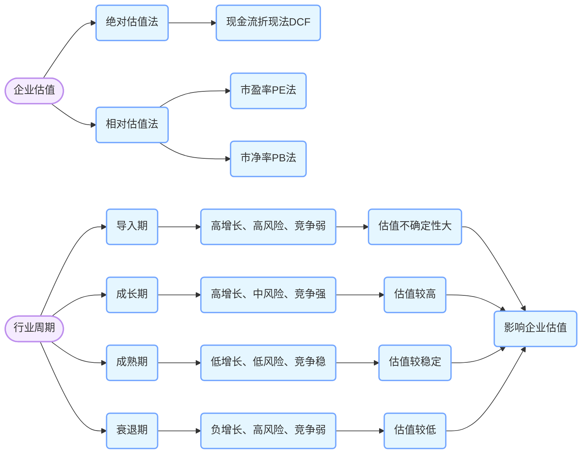

# 企业估值中的行业周期影响

> 关键词：企业估值、行业周期、经济波动、估值模型、行业特征

> 摘要：本文深入探讨了企业估值过程中行业周期所产生的影响。首先介绍了相关背景知识，包括目的范围、预期读者等内容。接着阐述了企业估值和行业周期的核心概念及二者联系，给出了相应的文本示意图和 Mermaid 流程图。详细讲解了核心算法原理与具体操作步骤，并结合 Python 代码进行说明。还分析了涉及的数学模型和公式，通过举例加深理解。以实际项目案例展示了行业周期对企业估值的具体影响，并对代码进行解读。探讨了行业周期在不同实际应用场景中的表现，推荐了相关学习资源、开发工具框架和论文著作。最后总结了未来发展趋势与挑战，列出常见问题解答和扩展阅读参考资料，旨在为投资者、分析师等在企业估值时考虑行业周期因素提供全面且深入的指导。

## 1. 背景介绍 
### 1.1 目的和范围
在当今复杂多变的商业环境中，准确评估企业价值对于投资者、管理者和其他利益相关者至关重要。然而，企业并非孤立存在，其所处的行业环境会对其价值产生显著影响。行业是由一系列相互关联的企业组成的群体，它们受到共同的市场趋势、技术变革、政策法规等因素的影响。行业周期则描述了行业从诞生、成长、成熟到衰退的动态变化过程。本研究的目的在于深入探讨行业周期如何影响企业估值，通过理论分析和实际案例相结合的方式，揭示这种影响的内在机制和表现形式。

研究范围涵盖了不同类型的行业，包括传统制造业、新兴科技行业、服务业等。通过对这些行业的分析，总结出行业周期影响企业估值的一般规律和特殊情况，为不同行业的企业估值提供参考。同时，研究还考虑了宏观经济环境、政策因素等外部条件对行业周期和企业估值的综合影响。

### 1.2 预期读者
本文的预期读者主要包括以下几类人群：
- **投资者**：无论是个人投资者还是机构投资者，在进行投资决策时都需要对企业价值进行评估。了解行业周期对企业估值的影响，有助于投资者更好地把握投资机会，降低投资风险。
- **企业管理者**：企业管理者需要了解自身企业在行业中的地位和价值，以便制定合理的战略规划和经营决策。行业周期的分析可以帮助管理者预测行业趋势，提前做好应对准备。
- **金融分析师**：金融分析师负责对企业进行估值和评级，为投资者提供专业的建议。掌握行业周期对企业估值的影响机制，能够提高分析师的估值准确性和分析质量。
- **学术研究人员**：学术研究人员对企业估值和行业周期的理论和实践问题进行深入研究。本文可以为他们提供新的研究视角和实证数据，推动相关领域的学术发展。

### 1.3 文档结构概述
本文将按照以下结构展开：
- 核心概念与联系：介绍企业估值和行业周期的基本概念，分析二者之间的内在联系，并通过文本示意图和 Mermaid 流程图进行直观展示。
- 核心算法原理 & 具体操作步骤：讲解常用的企业估值算法，如现金流折现法、相对估值法等，并结合 Python 代码详细说明如何在考虑行业周期的情况下进行企业估值。
- 数学模型和公式 & 详细讲解 & 举例说明：介绍与企业估值和行业周期相关的数学模型和公式，如行业增长模型、估值调整模型等，并通过具体例子进行详细讲解。
- 项目实战：代码实际案例和详细解释说明：通过实际项目案例，展示如何运用上述算法和模型进行企业估值，并对代码进行详细解读和分析。
- 实际应用场景：探讨行业周期对企业估值的影响在不同实际应用场景中的表现，如投资决策、企业并购、战略规划等。
- 工具和资源推荐：推荐相关的学习资源、开发工具框架和论文著作，帮助读者进一步深入学习和研究。
- 总结：未来发展趋势与挑战：总结行业周期对企业估值影响的研究成果，分析未来的发展趋势和面临的挑战。
- 附录：常见问题与解答：列出读者可能关心的常见问题，并给出详细解答。
- 扩展阅读 & 参考资料：提供相关的扩展阅读材料和参考资料，方便读者进一步查阅和研究。

### 1.4 术语表
#### 1.4.1 核心术语定义
- **企业估值**：指对企业的经济价值进行评估的过程，通常通过一定的方法和模型来确定企业的市场价值或内在价值。
- **行业周期**：指行业从诞生、成长、成熟到衰退的整个过程，一般可以分为四个阶段：导入期、成长期、成熟期和衰退期。
- **现金流折现法**：一种基于企业未来现金流量的估值方法，通过将企业未来各期的现金流量折现到当前时点，来计算企业的内在价值。
- **相对估值法**：通过比较同行业其他企业的估值指标，如市盈率、市净率等，来确定目标企业的价值。

#### 1.4.2 相关概念解释
- **行业增长率**：指行业在一定时期内的增长速度，通常用行业产值、销售额等指标的增长率来表示。
- **市场份额**：指企业在行业中所占的市场销售额或销售量的比例，反映了企业在行业中的竞争地位。
- **竞争格局**：指行业内企业之间的竞争关系和市场结构，包括企业的数量、规模、市场份额分布等。

#### 1.4.3 缩略词列表
- **DCF**：Discounted Cash Flow，现金流折现法
- **PE**：Price-to-Earnings Ratio，市盈率
- **PB**：Price-to-Book Ratio，市净率

## 2. 核心概念与联系 

### 2.1 企业估值的核心概念
企业估值是评估企业经济价值的过程，其目的是为了确定企业在市场上的合理价格。常见的企业估值方法主要有绝对估值法和相对估值法。

绝对估值法是通过对企业未来的现金流量进行预测，并将其折现到当前时点来计算企业的内在价值。其中最常用的方法是现金流折现法（DCF），其基本原理是企业的价值等于其未来各期现金流量的现值之和。

相对估值法是通过比较同行业其他企业的估值指标，如市盈率（PE）、市净率（PB）等，来确定目标企业的价值。这种方法假设同行业的企业具有相似的风险和增长特征，因此可以通过比较估值指标来评估目标企业的相对价值。

### 2.2 行业周期的核心概念
行业周期是指行业从诞生、成长、成熟到衰退的整个过程，一般可以分为四个阶段：
- **导入期**：行业刚刚诞生，市场需求较小，技术尚不成熟，企业数量较少，竞争程度较低。在这个阶段，企业的主要任务是进行技术研发和市场推广，以提高产品的知名度和市场份额。
- **成长期**：随着市场需求的逐渐扩大，行业进入成长期。在这个阶段，技术逐渐成熟，企业数量增加，竞争加剧。企业的主要任务是扩大生产规模，提高市场份额，以实现规模经济。
- **成熟期**：行业经过快速发展后，进入成熟期。在这个阶段，市场需求趋于饱和，企业数量稳定，竞争格局相对稳定。企业的主要任务是维持市场份额，提高产品质量和服务水平，以获取稳定的利润。
- **衰退期**：由于技术进步、市场需求变化等原因，行业逐渐进入衰退期。在这个阶段，市场需求下降，企业数量减少，竞争加剧。企业的主要任务是进行战略调整，寻找新的增长点，或者退出市场。

### 2.3 企业估值与行业周期的联系
行业周期对企业估值有着显著的影响，主要体现在以下几个方面：
- **增长率**：在行业的不同阶段，行业增长率存在明显差异。在导入期和成长期，行业增长率较高，企业的盈利增长潜力较大，因此企业的估值也相对较高。在成熟期和衰退期，行业增长率较低，企业的盈利增长潜力有限，因此企业的估值也相对较低。
- **风险水平**：行业周期也会影响企业的风险水平。在导入期和成长期，行业的不确定性较大，企业面临的技术风险、市场风险等较高，因此投资者要求的回报率也较高，企业的估值相对较低。在成熟期和衰退期，行业的不确定性较小，企业面临的风险相对较低，因此投资者要求的回报率也较低，企业的估值相对较高。
- **竞争格局**：行业周期还会影响行业的竞争格局。在导入期和成长期，行业竞争激烈，企业的市场份额不稳定，因此企业的估值受到竞争因素的影响较大。在成熟期和衰退期，行业竞争格局相对稳定，企业的市场份额相对稳定，因此企业的估值受到竞争因素的影响较小。

### 2.4 文本示意图
```plaintext
企业估值
|
|-- 绝对估值法
|   |-- 现金流折现法（DCF）
|
|-- 相对估值法
|   |-- 市盈率（PE）法
|   |-- 市净率（PB）法
|
|-- 受行业周期影响
    |-- 导入期：高增长、高风险、竞争弱 -> 估值不确定性大
    |-- 成长期：高增长、中风险、竞争强 -> 估值较高
    |-- 成熟期：低增长、低风险、竞争稳 -> 估值较稳定
    |-- 衰退期：负增长、高风险、竞争弱 -> 估值较低
```

### 2.5 Mermaid 流程图


## 3. 核心算法原理 & 具体操作步骤 

### 3.1 现金流折现法（DCF）原理
现金流折现法（DCF）是一种基于企业未来现金流量的估值方法，其基本原理是企业的价值等于其未来各期现金流量的现值之和。具体计算公式如下：

$$V = \sum_{t=1}^{n} \frac{CF_t}{(1 + r)^t} + \frac{TV}{(1 + r)^n}$$

其中：
- $V$ 表示企业的价值
- $CF_t$ 表示第 $t$ 期的现金流量
- $r$ 表示折现率
- $n$ 表示预测期数
- $TV$ 表示终值

### 3.2 考虑行业周期的 DCF 具体操作步骤
#### 步骤 1：确定预测期数 $n$
预测期数的确定需要考虑行业的发展阶段和企业的具体情况。在导入期和成长期，由于行业变化较快，预测期数可以相对较短，一般为 3 - 5 年。在成熟期和衰退期，行业发展相对稳定，预测期数可以相对较长，一般为 5 - 10 年。

#### 步骤 2：预测各期现金流量 $CF_t$
现金流量的预测需要考虑行业周期对企业经营的影响。在导入期和成长期，企业的现金流量可能为负数，因为企业需要大量的资金进行研发和市场推广。在成熟期，企业的现金流量通常为正数，且相对稳定。在衰退期，企业的现金流量可能会逐渐减少。

#### 步骤 3：确定折现率 $r$
折现率的确定需要考虑行业的风险水平。在导入期和成长期，行业的风险较高，折现率也相对较高。在成熟期和衰退期，行业的风险较低，折现率也相对较低。折现率可以通过资本资产定价模型（CAPM）来确定，具体公式如下：

$$r = R_f + \beta \times (R_m - R_f)$$

其中：
- $R_f$ 表示无风险利率
- $\beta$ 表示企业的贝塔系数
- $R_m$ 表示市场收益率

#### 步骤 4：计算终值 $TV$
终值的计算可以采用永续增长模型，具体公式如下：

$$TV = \frac{CF_{n+1}}{r - g}$$

其中：
- $CF_{n+1}$ 表示预测期结束后下一期的现金流量
- $g$ 表示永续增长率

永续增长率的确定需要考虑行业的长期发展趋势。在导入期和成长期，永续增长率可以相对较高。在成熟期和衰退期，永续增长率通常较低，甚至可能为负数。

#### 步骤 5：计算企业价值 $V$
将各期现金流量和终值代入 DCF 公式，计算企业的价值。

### 3.3 Python 代码实现
```python
import numpy as np

def dcf_valuation(cash_flows, discount_rate, growth_rate, terminal_year):
    """
    现金流折现法估值函数
    :param cash_flows: 各期现金流量列表
    :param discount_rate: 折现率
    :param growth_rate: 永续增长率
    :param terminal_year: 预测期数
    :return: 企业价值
    """
    # 计算各期现金流量的现值
    present_values = []
    for t, cf in enumerate(cash_flows[:terminal_year]):
        pv = cf / ((1 + discount_rate) ** (t + 1))
        present_values.append(pv)
    
    # 计算终值
    terminal_cf = cash_flows[terminal_year - 1] * (1 + growth_rate)
    terminal_value = terminal_cf / (discount_rate - growth_rate)
    terminal_pv = terminal_value / ((1 + discount_rate) ** terminal_year)
    
    # 计算企业价值
    enterprise_value = sum(present_values) + terminal_pv
    
    return enterprise_value

# 示例数据
cash_flows = [-100, -50, 20, 50, 80, 100, 120, 130, 140, 150]  # 各期现金流量
discount_rate = 0.1  # 折现率
growth_rate = 0.03  # 永续增长率
terminal_year = 5  # 预测期数

# 计算企业价值
value = dcf_valuation(cash_flows, discount_rate, growth_rate, terminal_year)
print(f"企业价值: {value}")
```

### 3.4 代码解释
- `dcf_valuation` 函数接受四个参数：各期现金流量列表 `cash_flows`、折现率 `discount_rate`、永续增长率 `growth_rate` 和预测期数 `terminal_year`。
- 函数内部首先计算各期现金流量的现值，将其存储在 `present_values` 列表中。
- 然后计算终值和终值的现值。
- 最后将各期现金流量的现值和终值的现值相加，得到企业的价值。

## 4. 数学模型和公式 & 详细讲解 & 举例说明 

### 4.1 行业增长模型
行业增长模型可以用来描述行业在不同阶段的增长趋势。常见的行业增长模型有 S 曲线模型和 Gompertz 模型。

#### S 曲线模型
S 曲线模型的数学表达式为：

$$y = \frac{L}{1 + e^{-k(t - t_0)}}$$

其中：
- $y$ 表示行业的发展水平（如产值、销售额等）
- $L$ 表示行业的饱和水平
- $k$ 表示增长速度参数
- $t$ 表示时间
- $t_0$ 表示增长曲线的中点

S 曲线模型的特点是在导入期增长缓慢，在成长期增长迅速，在成熟期增长逐渐放缓，最终达到饱和水平。

#### Gompertz 模型
Gompertz 模型的数学表达式为：

$$y = L e^{-e^{-k(t - t_0)}}$$

其中各参数的含义与 S 曲线模型相同。Gompertz 模型的增长速度比 S 曲线模型更快，更适合描述一些新兴行业的增长情况。

### 4.2 估值调整模型
在考虑行业周期的影响时，可以通过估值调整模型对企业的估值进行调整。一种简单的估值调整模型是基于行业增长率的调整模型，具体公式如下：

$$V_{adjusted} = V \times \frac{g_{industry}}{g_{average}}$$

其中：
- $V_{adjusted}$ 表示调整后的企业价值
- $V$ 表示未调整的企业价值
- $g_{industry}$ 表示行业增长率
- $g_{average}$ 表示行业平均增长率

### 4.3 举例说明
假设某企业采用现金流折现法计算的未调整价值为 $V = 1000$ 万元，所在行业的增长率为 $g_{industry} = 15\%$，行业平均增长率为 $g_{average} = 10\%$。则调整后的企业价值为：

$$V_{adjusted} = 1000 \times \frac{15\%}{10\%} = 1500$$（万元）

通过估值调整模型，可以更准确地反映行业周期对企业估值的影响。

## 5. 项目实战：代码实际案例和详细解释说明 

### 5.1  开发环境搭建
为了完成本项目实战，需要搭建以下开发环境：
- **Python 环境**：建议使用 Python 3.7 及以上版本。可以从 Python 官方网站（https://www.python.org/downloads/）下载并安装。
- **开发工具**：推荐使用 PyCharm 或 Jupyter Notebook。PyCharm 是一款专业的 Python 集成开发环境，提供了丰富的功能和工具。Jupyter Notebook 是一个交互式的开发环境，适合进行数据分析和代码演示。
- **相关库**：需要安装 `numpy`、`pandas` 等库。可以使用 `pip` 命令进行安装：
```sh
pip install numpy pandas
```

### 5.2  源代码详细实现和代码解读
以下是一个完整的项目实战代码示例，用于考虑行业周期影响的企业估值：

```python
import numpy as np
import pandas as pd

def industry_growth_rate(industry_stage):
    """
    根据行业阶段确定行业增长率
    :param industry_stage: 行业阶段（导入期、成长期、成熟期、衰退期）
    :return: 行业增长率
    """
    if industry_stage == '导入期':
        return 0.2
    elif industry_stage == '成长期':
        return 0.15
    elif industry_stage == '成熟期':
        return 0.05
    elif industry_stage == '衰退期':
        return -0.05
    else:
        return 0

def discount_rate(industry_stage):
    """
    根据行业阶段确定折现率
    :param industry_stage: 行业阶段（导入期、成长期、成熟期、衰退期）
    :return: 折现率
    """
    if industry_stage == '导入期':
        return 0.15
    elif industry_stage == '成长期':
        return 0.12
    elif industry_stage == '成熟期':
        return 0.1
    elif industry_stage == '衰退期':
        return 0.13
    else:
        return 0.1

def dcf_valuation(cash_flows, discount_rate, growth_rate, terminal_year):
    """
    现金流折现法估值函数
    :param cash_flows: 各期现金流量列表
    :param discount_rate: 折现率
    :param growth_rate: 永续增长率
    :param terminal_year: 预测期数
    :return: 企业价值
    """
    # 计算各期现金流量的现值
    present_values = []
    for t, cf in enumerate(cash_flows[:terminal_year]):
        pv = cf / ((1 + discount_rate) ** (t + 1))
        present_values.append(pv)
    
    # 计算终值
    terminal_cf = cash_flows[terminal_year - 1] * (1 + growth_rate)
    terminal_value = terminal_cf / (discount_rate - growth_rate)
    terminal_pv = terminal_value / ((1 + discount_rate) ** terminal_year)
    
    # 计算企业价值
    enterprise_value = sum(present_values) + terminal_pv
    
    return enterprise_value

# 示例数据
industry_stage = '成长期'
cash_flows = [-100, -50, 20, 50, 80, 100, 120, 130, 140, 150]  # 各期现金流量
terminal_year = 5  # 预测期数

# 确定行业增长率和折现率
g_industry = industry_growth_rate(industry_stage)
r = discount_rate(industry_stage)

# 计算企业价值
value = dcf_valuation(cash_flows, r, g_industry, terminal_year)
print(f"考虑行业周期影响的企业价值: {value}")
```

### 5.3  代码解读与分析
- `industry_growth_rate` 函数根据行业阶段返回相应的行业增长率。在导入期，行业增长率较高，为 20%；在成长期，行业增长率为 15%；在成熟期，行业增长率为 5%；在衰退期，行业增长率为 -5%。
- `discount_rate` 函数根据行业阶段返回相应的折现率。在导入期，折现率较高，为 15%；在成长期，折现率为 12%；在成熟期，折现率为 10%；在衰退期，折现率为 13%。
- `dcf_valuation` 函数实现了现金流折现法的估值计算，与前面介绍的代码相同。
- 在主程序中，首先定义了行业阶段和各期现金流量，然后调用 `industry_growth_rate` 和 `discount_rate` 函数确定行业增长率和折现率，最后调用 `dcf_valuation` 函数计算企业价值。

通过这个项目实战，可以看到如何在企业估值中考虑行业周期的影响，提高估值的准确性。

## 6. 实际应用场景 
### 6.1 投资决策
在投资决策中，投资者需要对目标企业进行估值，以确定是否值得投资。考虑行业周期的影响可以帮助投资者更准确地评估企业的价值和风险。例如，在行业的成长期，投资者可以选择具有高增长潜力的企业进行投资；在行业的衰退期，投资者则需要谨慎选择投资对象，避免投资那些面临困境的企业。

### 6.2 企业并购
在企业并购中，收购方需要对目标企业进行估值，以确定合理的收购价格。行业周期的影响会影响目标企业的估值和未来发展前景。例如，在行业的成熟期，收购方可以通过并购来扩大市场份额，提高企业的竞争力；在行业的衰退期，收购方需要考虑如何整合资源，实现协同效应，以应对行业的挑战。

### 6.3 战略规划
企业管理者在制定战略规划时，需要了解自身企业在行业中的地位和价值，以及行业的发展趋势。考虑行业周期的影响可以帮助企业管理者制定更加合理的战略规划。例如，在行业的导入期，企业可以采取创新战略，加大研发投入，推出新产品；在行业的成长期，企业可以采取扩张战略，扩大生产规模，提高市场份额；在行业的成熟期，企业可以采取多元化战略，开拓新的市场领域；在行业的衰退期，企业可以采取收缩战略，减少亏损，寻找新的增长点。

## 7. 工具和资源推荐
### 7.1 学习资源推荐
#### 7.1.1 书籍推荐
- 《估值：难点、解决方案及相关案例》：本书详细介绍了企业估值的各种方法和技巧，包括现金流折现法、相对估值法等，并通过实际案例进行了深入分析。
- 《行业分析与公司估值》：本书从行业分析的角度出发，探讨了行业周期对企业估值的影响，并介绍了如何运用行业分析来进行企业估值。
- 《投资学》：本书是投资领域的经典教材，涵盖了投资的基本理论、方法和技巧，包括企业估值、投资组合管理等内容。

#### 7.1.2 在线课程
- Coursera 上的“Corporate Finance”课程：该课程由宾夕法尼亚大学沃顿商学院的教授授课，介绍了公司金融的基本理论和方法，包括企业估值、资本结构等内容。
- edX 上的“Valuation and Financial Modeling for Startups”课程：该课程专门针对初创企业的估值和财务建模进行了讲解，适合对初创企业投资感兴趣的学习者。
- 中国大学 MOOC 上的“财务报表分析与股票估值”课程：该课程结合财务报表分析，介绍了股票估值的方法和技巧，帮助学习者提高投资分析能力。

#### 7.1.3 技术博客和网站
- Seeking Alpha：该网站是一个专业的投资研究平台，提供了大量的企业估值分析报告和行业研究文章，对投资者和分析师具有很高的参考价值。
- Bloomberg：作为全球知名的金融信息服务提供商，Bloomberg 提供了丰富的金融数据和分析工具，包括企业估值数据、行业报告等。
- 雪球网：国内知名的投资社区，用户可以在上面分享投资经验和企业估值分析，与其他投资者进行交流和讨论。

### 7.2 开发工具框架推荐
#### 7.2.1 IDE和编辑器
- PyCharm：专业的 Python 集成开发环境，提供了丰富的功能和工具，如代码编辑、调试、版本控制等，适合进行大规模的 Python 项目开发。
- Jupyter Notebook：交互式的开发环境，适合进行数据分析和代码演示。用户可以在浏览器中编写和运行代码，同时可以添加文本说明和可视化图表，方便与他人分享和交流。
- Visual Studio Code：轻量级的代码编辑器，支持多种编程语言和插件扩展。通过安装 Python 相关插件，可以实现代码编辑、调试、自动补全等功能，是一款非常受欢迎的开发工具。

#### 7.2.2 调试和性能分析工具
- PDB：Python 自带的调试工具，可以帮助开发者逐行调试代码，查找代码中的错误和问题。
- cProfile：Python 标准库中的性能分析工具，可以统计代码的运行时间和函数调用次数，帮助开发者找出代码中的性能瓶颈。
- Py-Spy：一款跨平台的 Python 性能分析工具，可以实时监控 Python 程序的运行状态，分析函数调用栈和 CPU 使用率，帮助开发者优化代码性能。

#### 7.2.3 相关框架和库
- NumPy：Python 中用于科学计算的基础库，提供了高效的多维数组对象和各种数学函数，广泛应用于数据分析、机器学习等领域。
- Pandas：Python 中用于数据处理和分析的库，提供了数据结构（如 DataFrame）和数据操作方法，方便进行数据清洗、转换和分析。
- Scikit-learn：Python 中用于机器学习的开源库，提供了各种机器学习算法和工具，如分类、回归、聚类等，可用于构建企业估值模型和预测行业趋势。

### 7.3 相关论文著作推荐
#### 7.3.1 经典论文
- "The Theory of Investment Value" by John Burr Williams：该论文提出了现金流折现法的基本思想，为企业估值理论的发展奠定了基础。
- "Common Stock Values and Stock Market Prices" by David Durand：该论文对相对估值法进行了深入研究，提出了市盈率、市净率等估值指标的计算方法和应用场景。
- "Industry Life Cycles and Stock Returns" by George Foster：该论文研究了行业生命周期对股票回报率的影响，发现不同行业阶段的股票回报率存在显著差异。

#### 7.3.2 最新研究成果
- 近年来，随着人工智能和大数据技术的发展，一些学者开始将这些技术应用于企业估值和行业周期分析中。例如，利用机器学习算法对企业的财务数据和行业数据进行分析，预测企业的未来业绩和行业趋势；利用自然语言处理技术对新闻报道和社交媒体数据进行分析，了解市场情绪和行业动态。
- 一些研究还关注了新兴行业（如人工智能、区块链、生物医药等）的估值问题，探讨了这些行业的特点和估值方法。

#### 7.3.3 应用案例分析
- 许多金融机构和咨询公司会发布企业估值和行业分析的应用案例报告，这些报告可以帮助读者了解实际项目中如何应用企业估值方法和考虑行业周期的影响。例如，麦肯锡公司的《全球行业研究报告》、波士顿咨询公司的《企业战略与估值分析》等。

## 8. 总结：未来发展趋势与挑战
### 8.1 未来发展趋势
- **技术融合**：随着人工智能、大数据、区块链等技术的不断发展，这些技术将与企业估值和行业周期分析更加深度融合。例如，利用人工智能算法对海量的企业数据和行业数据进行分析，提高估值的准确性和效率；利用区块链技术保证数据的真实性和安全性，为企业估值提供可靠的数据支持。
- **跨学科研究**：企业估值和行业周期分析涉及到经济学、金融学、管理学、统计学等多个学科领域。未来，跨学科研究将成为趋势，通过整合不同学科的理论和方法，为企业估值和行业周期分析提供更加全面和深入的视角。
- **绿色和可持续发展**：随着全球对环境保护和可持续发展的关注度不断提高，企业的绿色和可持续发展能力将成为影响企业估值的重要因素。未来，在企业估值中需要考虑企业的环境、社会和治理（ESG）表现，以及行业的可持续发展趋势。

### 8.2 挑战
- **数据质量和可得性**：企业估值和行业周期分析需要大量的高质量数据支持。然而，目前数据质量参差不齐，数据的可得性也存在一定问题。例如，一些新兴行业的数据相对较少，难以进行准确的分析和预测；一些企业的财务数据存在造假和粉饰的情况，影响了估值的准确性。
- **行业变化的不确定性**：行业的发展受到多种因素的影响，如技术创新、政策法规、市场需求等，这些因素的变化具有不确定性，增加了行业周期分析和企业估值的难度。例如，新兴技术的出现可能会颠覆传统行业的格局，导致行业周期发生变化，给企业估值带来挑战。
- **模型的局限性**：目前的企业估值模型和行业周期分析模型大多基于一定的假设和简化，存在一定的局限性。例如，现金流折现法假设企业的未来现金流量可以准确预测，相对估值法假设同行业的企业具有相似的风险和增长特征，这些假设在实际应用中可能并不成立，影响了估值的准确性。

## 9. 附录：常见问题与解答
### 9.1 如何确定行业的阶段？
确定行业的阶段可以从以下几个方面入手：
- **市场增长率**：观察行业的市场销售额、产值等指标的增长率。如果增长率较高，可能处于导入期或成长期；如果增长率稳定且较低，可能处于成熟期；如果增长率为负数，可能处于衰退期。
- **企业数量和竞争格局**：在导入期，企业数量较少，竞争程度较低；在成长期，企业数量增加，竞争加剧；在成熟期，企业数量稳定，竞争格局相对稳定；在衰退期，企业数量减少，竞争激烈。
- **技术创新程度**：导入期和成长期通常伴随着较高的技术创新程度，企业不断推出新产品和新技术；在成熟期，技术趋于成熟，创新速度放缓；在衰退期，可能出现新技术替代旧技术的情况。

### 9.2 行业周期对不同行业的影响是否相同？
不同行业的特点和发展规律不同，行业周期对不同行业的影响也存在差异。例如，新兴科技行业的行业周期通常较短，变化较快，技术创新对行业发展的影响较大；而传统制造业的行业周期相对较长，变化相对较慢，市场需求和成本因素对行业发展的影响较大。因此，在进行企业估值时，需要根据不同行业的特点来考虑行业周期的影响。

### 9.3 如何选择合适的估值方法？
选择合适的估值方法需要考虑以下几个因素：
- **企业的特点**：不同类型的企业适合不同的估值方法。例如，对于现金流稳定的企业，可以采用现金流折现法；对于盈利波动较大的企业，可以采用相对估值法。
- **数据的可得性**：估值方法的选择还需要考虑数据的可得性。如果企业的财务数据较为完整，可以采用现金流折现法；如果同行业的可比企业数据较多，可以采用相对估值法。
- **行业的特点**：不同行业的特点也会影响估值方法的选择。例如，对于新兴行业，由于缺乏历史数据和可比企业，可能需要采用一些特殊的估值方法，如实物期权法。

## 10. 扩展阅读 & 参考资料
### 10.1 扩展阅读
- 《金融炼金术》：作者乔治·索罗斯通过自己的投资实践，阐述了反身性理论，对金融市场和企业估值具有重要的启示作用。
- 《聪明的投资者》：作者本杰明·格雷厄姆是价值投资理论的奠基人，本书介绍了价值投资的基本理念和方法，对投资者具有很高的指导价值。
- 《黑天鹅：如何应对不可预知的未来》：作者纳西姆·尼古拉斯·塔勒布探讨了极端事件对金融市场和企业的影响，提醒投资者要关注不确定性和风险。

### 10.2 参考资料
- 《企业价值评估指导意见（试行）》：中国资产评估协会发布的关于企业价值评估的行业规范，为企业估值提供了指导和参考。
- 《上市公司行业分类指引》：中国证监会发布的关于上市公司行业分类的标准，有助于投资者了解企业所处的行业。
- 各大金融数据库（如 Wind、同花顺等）：提供了丰富的企业财务数据和行业数据，为企业估值和行业分析提供了数据支持。

作者：AI天才研究院/AI Genius Institute & 禅与计算机程序设计艺术 /Zen And The Art of Computer Programming