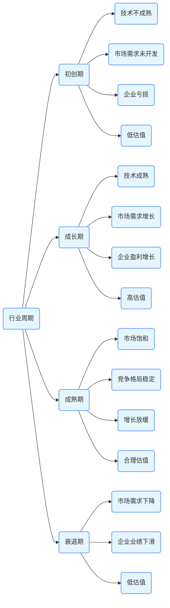

# 企业估值中的行业周期影响

> 关键词：企业估值、行业周期、经济周期、估值模型、市场动态

> 摘要：本文聚焦于企业估值过程中行业周期所产生的影响。通过深入剖析行业周期的不同阶段特征，探讨其如何作用于企业的财务状况、经营业绩与市场预期，进而影响企业估值。详细阐述了核心概念、算法原理、数学模型，结合实际案例分析行业周期在企业估值中的具体体现，介绍了相关的工具和资源，并对未来发展趋势与挑战进行总结，旨在为投资者、分析师及企业管理者在企业估值决策中提供全面且深入的参考。

## 1. 背景介绍 
### 1.1 目的和范围
企业估值是投资决策、并购重组、财务报告等诸多经济活动中的关键环节。准确的企业估值有助于投资者合理判断企业价值，做出明智的投资选择；对于企业管理者而言，了解自身企业的价值有助于制定战略规划、评估经营绩效。然而，企业并非孤立存在，其所处的行业环境对其价值有着重要影响。行业周期作为行业发展的动态轨迹，涵盖了从起步、成长、成熟到衰退的不同阶段，每个阶段都具有独特的市场特征、竞争格局和发展趋势。本研究的目的在于深入探讨行业周期如何影响企业估值，分析不同阶段企业估值的特点和变化规律，为企业估值提供更全面、准确的视角。研究范围将涵盖多个行业，分析行业周期各阶段对企业财务指标、现金流、市场预期等方面的影响，以及在不同估值模型中的体现。

### 1.2 预期读者
本文的预期读者主要包括金融投资领域的专业人士，如股票分析师、基金经理、风险投资家等，他们在进行投资决策时需要准确评估企业价值，行业周期的影响是其必须考虑的重要因素。企业管理者也能从本文中获得启示，了解行业周期对自身企业估值的影响，以便制定更符合市场环境的战略规划和经营决策。此外，高校金融、经济等相关专业的师生也可将本文作为学习企业估值和行业分析的参考资料。

### 1.3 文档结构概述
本文将首先介绍行业周期和企业估值的核心概念，明确两者之间的联系，并通过文本示意图和 Mermaid 流程图进行直观展示。接着，阐述在企业估值中考虑行业周期影响的核心算法原理，给出具体操作步骤，并使用 Python 源代码进行详细说明。然后，介绍相关的数学模型和公式，通过举例说明其在实际中的应用。在项目实战部分，提供代码实际案例并进行详细解释。之后，探讨行业周期影响企业估值的实际应用场景。再推荐相关的工具和资源，包括学习资源、开发工具框架和相关论文著作。最后，总结行业周期影响企业估值的未来发展趋势与挑战，列出常见问题与解答，并提供扩展阅读和参考资料。

### 1.4 术语表
#### 1.4.1 核心术语定义
- **企业估值**：指对企业的内在价值进行评估和估算，通常基于企业的财务状况、经营业绩、市场前景等因素，采用一定的估值方法得出企业的价值。
- **行业周期**：指一个行业从诞生、成长、成熟到衰退的整个过程，一般可分为四个阶段：初创期、成长期、成熟期和衰退期。每个阶段具有不同的市场特征、竞争格局和发展趋势。
- **经济周期**：指国民经济活动的总体水平有规律地扩张和收缩的过程，通常包括繁荣、衰退、萧条和复苏四个阶段。经济周期会对行业周期产生影响，进而影响企业估值。
- **估值模型**：用于评估企业价值的数学模型，常见的估值模型包括现金流折现模型（DCF）、相对估值模型（如市盈率法、市净率法）等。

#### 1.4.2 相关概念解释
- **现金流折现模型（DCF）**：该模型基于企业未来的现金流进行估值，将企业未来各期的现金流按照一定的折现率折现到当前时刻，求和得到企业的内在价值。其核心思想是企业的价值取决于其未来创造现金流的能力。
- **相对估值模型**：通过比较同行业内其他类似企业的估值指标（如市盈率、市净率等）来评估目标企业的价值。相对估值模型简单易懂，计算方便，但需要选择合适的可比企业。
- **市场预期**：指市场参与者对企业未来业绩和发展前景的预期。市场预期会影响企业的股票价格和估值，当市场预期乐观时，企业估值往往较高；反之，当市场预期悲观时，企业估值会下降。

#### 1.4.3 缩略词列表
- **DCF**：Discounted Cash Flow，现金流折现模型
- **PE**：Price-to-Earnings Ratio，市盈率
- **PB**：Price-to-Book Ratio，市净率

## 2. 核心概念与联系 

### 核心概念原理
行业周期和企业估值是两个紧密相关的概念。行业周期反映了一个行业的发展历程和阶段性特征，而企业作为行业的参与者，其经营业绩和价值会受到行业周期的显著影响。

- **行业周期阶段特征**
    - **初创期**：行业刚刚兴起，市场需求尚未完全开发，技术和商业模式还不成熟。企业数量较少，竞争相对较小，但面临较高的技术风险和市场风险。此时，企业往往处于亏损状态，需要大量的资金投入进行研发和市场开拓。
    - **成长期**：随着市场需求的逐渐增长，行业进入快速发展阶段。技术逐渐成熟，商业模式得到验证，企业数量增加，市场竞争加剧。企业的销售额和利润快速增长，开始实现盈利。
    - **成熟期**：行业发展趋于稳定，市场需求增长缓慢，甚至达到饱和。企业竞争格局相对稳定，市场份额基本确定。企业的销售额和利润增长放缓，开始注重成本控制和效率提升。
    - **衰退期**：由于技术进步、市场需求变化等原因，行业逐渐走向衰退。市场需求下降，企业面临激烈的竞争，销售额和利润持续下滑。部分企业开始退出市场，行业集中度提高。

- **企业估值原理**
企业估值的核心是评估企业未来创造现金流的能力。不同的估值模型从不同的角度来衡量企业的价值，如现金流折现模型通过预测企业未来的现金流并折现到当前时刻来计算企业的内在价值；相对估值模型则通过比较同行业内其他类似企业的估值指标来评估目标企业的价值。

### 核心概念联系
行业周期的不同阶段会对企业的财务状况、经营业绩和市场预期产生不同的影响，从而影响企业估值。

- **初创期**：在初创期，由于企业面临较高的风险和不确定性，市场预期较低，企业估值往往较低。投资者更关注企业的技术创新能力和市场潜力，而不是当前的财务业绩。此时，相对估值模型可能不太适用，因为同行业内的可比企业较少，且财务指标差异较大。现金流折现模型虽然理论上可以用于评估初创企业的价值，但由于未来现金流的预测难度较大，折现率的确定也较为困难，因此估值结果的准确性较低。
- **成长期**：在成长期，企业的销售额和利润快速增长，市场预期乐观，企业估值通常较高。相对估值模型中的市盈率法较为常用，因为市场对成长型企业往往给予较高的市盈率。现金流折现模型也可以用于评估成长期企业的价值，但需要对未来现金流进行合理的预测，考虑到企业的增长速度和竞争优势。
- **成熟期**：在成熟期，企业的增长速度放缓，市场预期相对稳定，企业估值相对合理。相对估值模型中的市净率法和市盈率法都可以用于评估成熟期企业的价值。现金流折现模型中，由于未来现金流的预测相对较为稳定，折现率的确定也相对容易，因此估值结果的准确性较高。
- **衰退期**：在衰退期，企业的销售额和利润持续下滑，市场预期悲观，企业估值较低。相对估值模型中的市净率法可能更为适用，因为企业的净资产相对较为稳定。现金流折现模型中，需要考虑到企业未来现金流的减少和风险的增加，折现率应相应提高。

### 文本示意图
```plaintext
行业周期
|-- 初创期
|   |-- 技术不成熟
|   |-- 市场需求未开发
|   |-- 企业亏损
|   |-- 低估值
|-- 成长期
|   |-- 技术成熟
|   |-- 市场需求增长
|   |-- 企业盈利增长
|   |-- 高估值
|-- 成熟期
|   |-- 市场饱和
|   |-- 竞争格局稳定
|   |-- 增长放缓
|   |-- 合理估值
|-- 衰退期
|   |-- 市场需求下降
|   |-- 企业业绩下滑
|   |-- 低估值
```

### Mermaid 流程图


## 3. 核心算法原理 & 具体操作步骤 

### 核心算法原理
在企业估值中，考虑行业周期影响的核心算法主要基于现金流折现模型和相对估值模型。

- **现金流折现模型（DCF）**
现金流折现模型的基本原理是将企业未来各期的现金流按照一定的折现率折现到当前时刻，求和得到企业的内在价值。其计算公式为：
$$V = \sum_{t=1}^{n} \frac{CF_t}{(1 + r)^t} + \frac{TV}{(1 + r)^n}$$
其中，$V$ 表示企业的内在价值，$CF_t$ 表示第 $t$ 期的现金流，$r$ 表示折现率，$n$ 表示预测期数，$TV$ 表示终值。

在考虑行业周期影响时，需要根据行业周期的不同阶段对未来现金流和折现率进行调整。在初创期和成长期，由于企业的增长速度较快，未来现金流的预测需要考虑到企业的高增长潜力；同时，由于风险较高，折现率也应相应提高。在成熟期和衰退期，未来现金流的预测相对较为稳定，折现率可以适当降低。

- **相对估值模型**
相对估值模型通过比较同行业内其他类似企业的估值指标来评估目标企业的价值。常见的相对估值指标包括市盈率（PE）、市净率（PB）等。其计算公式为：
$$V = P \times M$$
其中，$V$ 表示目标企业的价值，$P$ 表示可比企业的估值指标，$M$ 表示目标企业的相应财务指标（如净利润、净资产等）。

在考虑行业周期影响时，需要选择处于相同行业周期阶段的可比企业。不同行业周期阶段的企业，其估值指标可能存在较大差异。例如，成长型企业的市盈率通常较高，而成熟型企业的市盈率相对较低。

### 具体操作步骤

#### 现金流折现模型操作步骤
1. **确定预测期数 $n$**：根据行业特点和企业发展情况，确定预测期的长度。一般来说，预测期可以设定为 5 - 10 年。
2. **预测未来现金流 $CF_t$**：根据企业的历史财务数据、行业发展趋势和市场预期，预测企业未来各期的现金流。在预测时，需要考虑行业周期的影响，对不同阶段的现金流进行合理调整。
3. **确定折现率 $r$**：折现率反映了投资者对企业投资的风险要求。可以采用资本资产定价模型（CAPM）来确定折现率，其计算公式为：
$$r = R_f + \beta \times (R_m - R_f)$$
其中，$R_f$ 表示无风险利率，$\beta$ 表示企业的贝塔系数，$R_m$ 表示市场平均收益率。在考虑行业周期影响时，需要根据行业周期的不同阶段对 $\beta$ 值进行调整。例如，在初创期和成长期，企业的风险较高，$\beta$ 值可以适当提高；在成熟期和衰退期，企业的风险相对较低，$\beta$ 值可以适当降低。
4. **计算终值 $TV$**：终值表示预测期结束后企业的价值。可以采用永续增长模型来计算终值，其计算公式为：
$$TV = \frac{CF_{n+1}}{r - g}$$
其中，$CF_{n+1}$ 表示预测期结束后下一期的现金流，$g$ 表示永续增长率。永续增长率应根据行业的长期发展趋势和企业的竞争优势来确定。
5. **计算企业内在价值 $V$**：将预测期内的现金流和终值按照折现率折现到当前时刻，求和得到企业的内在价值。

#### 相对估值模型操作步骤
1. **选择可比企业**：选择与目标企业处于相同行业、相同行业周期阶段的可比企业。可比企业的规模、业务模式、财务状况等应与目标企业相似。
2. **计算可比企业的估值指标 $P$**：根据可比企业的市场价格和相应的财务指标，计算可比企业的估值指标（如市盈率、市净率等）。
3. **确定目标企业的相应财务指标 $M$**：根据目标企业的财务报表，确定其相应的财务指标（如净利润、净资产等）。
4. **计算目标企业的价值 $V$**：将可比企业的估值指标乘以目标企业的相应财务指标，得到目标企业的价值。

### Python 源代码实现
```python
import numpy as np

# 现金流折现模型
def dcf_valuation(cash_flows, discount_rate, growth_rate, terminal_year):
    """
    现金流折现模型计算企业价值
    :param cash_flows: 预测期内的现金流列表
    :param discount_rate: 折现率
    :param growth_rate: 永续增长率
    :param terminal_year: 预测期数
    :return: 企业内在价值
    """
    # 计算预测期内现金流的现值
    present_values = []
    for i in range(terminal_year):
        present_value = cash_flows[i] / ((1 + discount_rate) ** (i + 1))
        present_values.append(present_value)
    
    # 计算终值
    terminal_cash_flow = cash_flows[-1] * (1 + growth_rate)
    terminal_value = terminal_cash_flow / (discount_rate - growth_rate)
    terminal_value_present = terminal_value / ((1 + discount_rate) ** terminal_year)
    
    # 计算企业内在价值
    enterprise_value = sum(present_values) + terminal_value_present
    return enterprise_value

# 相对估值模型
def relative_valuation(comparable_pe, target_net_income):
    """
    相对估值模型计算企业价值
    :param comparable_pe: 可比企业的市盈率
    :param target_net_income: 目标企业的净利润
    :return: 目标企业的价值
    """
    enterprise_value = comparable_pe * target_net_income
    return enterprise_value

# 示例数据
cash_flows = [100, 120, 150, 180, 200]  # 预测期内的现金流
discount_rate = 0.1  # 折现率
growth_rate = 0.03  # 永续增长率
terminal_year = 5  # 预测期数
comparable_pe = 20  # 可比企业的市盈率
target_net_income = 100  # 目标企业的净利润

# 计算企业价值
dcf_value = dcf_valuation(cash_flows, discount_rate, growth_rate, terminal_year)
relative_value = relative_valuation(comparable_pe, target_net_income)

print(f"现金流折现模型计算的企业价值: {dcf_value}")
print(f"相对估值模型计算的企业价值: {relative_value}")
```

## 4. 数学模型和公式 & 详细讲解 & 举例说明 

### 现金流折现模型（DCF）
#### 公式
$$V = \sum_{t=1}^{n} \frac{CF_t}{(1 + r)^t} + \frac{TV}{(1 + r)^n}$$
其中，$V$ 表示企业的内在价值，$CF_t$ 表示第 $t$ 期的现金流，$r$ 表示折现率，$n$ 表示预测期数，$TV$ 表示终值。

#### 详细讲解
- **现金流预测**：现金流是企业估值的核心因素之一。在预测现金流时，需要考虑企业的经营活动、投资活动和筹资活动所产生的现金流。在不同的行业周期阶段，企业的现金流特征不同。例如，在初创期，企业可能需要大量的资金投入进行研发和市场开拓，经营活动现金流可能为负数；在成长期，企业的销售额和利润快速增长，经营活动现金流逐渐增加；在成熟期，企业的现金流相对稳定；在衰退期，企业的现金流可能会下降。
- **折现率确定**：折现率反映了投资者对企业投资的风险要求。折现率越高，说明投资者对风险的厌恶程度越高，企业的价值就越低。折现率的确定需要考虑市场利率、企业的风险水平等因素。在考虑行业周期影响时，需要根据行业周期的不同阶段对折现率进行调整。例如，在初创期和成长期，企业的风险较高，折现率应相应提高；在成熟期和衰退期，企业的风险相对较低，折现率可以适当降低。
- **终值计算**：终值表示预测期结束后企业的价值。由于预测期是有限的，而企业的经营是持续的，因此需要计算终值来反映企业在预测期结束后的价值。常见的终值计算方法是永续增长模型，假设企业在预测期结束后以一个固定的增长率持续增长。

#### 举例说明
假设某企业在未来 5 年的现金流分别为 100 万元、120 万元、150 万元、180 万元和 200 万元，折现率为 10%，永续增长率为 3%。则该企业的内在价值计算如下：

1. 计算预测期内现金流的现值
    - 第 1 年现金流的现值：$PV_1 = \frac{100}{(1 + 0.1)^1} = 90.91$（万元）
    - 第 2 年现金流的现值：$PV_2 = \frac{120}{(1 + 0.1)^2} = 99.17$（万元）
    - 第 3 年现金流的现值：$PV_3 = \frac{150}{(1 + 0.1)^3} = 112.69$（万元）
    - 第 4 年现金流的现值：$PV_4 = \frac{180}{(1 + 0.1)^4} = 122.94$（万元）
    - 第 5 年现金流的现值：$PV_5 = \frac{200}{(1 + 0.1)^5} = 124.18$（万元）

2. 计算终值
第 6 年的现金流：$CF_6 = 200 \times (1 + 0.03) = 206$（万元）
终值：$TV = \frac{206}{0.1 - 0.03} = 2942.86$（万元）
终值的现值：$PV_{TV} = \frac{2942.86}{(1 + 0.1)^5} = 1827.94$（万元）

3. 计算企业内在价值
$V = PV_1 + PV_2 + PV_3 + PV_4 + PV_5 + PV_{TV} = 90.91 + 99.17 + 112.69 + 122.94 + 124.18 + 1827.94 = 2377.83$（万元）

### 相对估值模型
#### 公式
- **市盈率法**：$V = PE \times E$
其中，$V$ 表示目标企业的价值，$PE$ 表示可比企业的市盈率，$E$ 表示目标企业的净利润。

- **市净率法**：$V = PB \times B$
其中，$V$ 表示目标企业的价值，$PB$ 表示可比企业的市净率，$B$ 表示目标企业的净资产。

#### 详细讲解
- **可比企业选择**：可比企业的选择是相对估值模型的关键。可比企业应与目标企业处于相同行业、相同行业周期阶段，具有相似的规模、业务模式和财务状况。在选择可比企业时，需要考虑多个因素，如企业的市场份额、盈利能力、成长潜力等。
- **估值指标计算**：估值指标（如市盈率、市净率等）反映了市场对企业价值的评估。市盈率是指企业的市场价格与净利润的比率，市净率是指企业的市场价格与净资产的比率。不同行业周期阶段的企业，其估值指标可能存在较大差异。例如，成长型企业的市盈率通常较高，而成熟型企业的市盈率相对较低。

#### 举例说明
假设某行业内有一家可比企业，其市盈率为 20 倍，目标企业的净利润为 100 万元。则目标企业的价值计算如下：
$V = 20 \times 100 = 2000$（万元）

## 5. 项目实战：代码实际案例和详细解释说明 

### 5.1  开发环境搭建
为了实现企业估值中考虑行业周期影响的代码，我们可以使用 Python 编程语言。以下是开发环境搭建的步骤：

1. **安装 Python**：从 Python 官方网站（https://www.python.org/downloads/）下载并安装 Python 3.x 版本。
2. **安装必要的库**：我们需要使用一些 Python 库来进行数据处理和计算，如 `numpy` 和 `pandas`。可以使用以下命令来安装这些库：
```sh
pip install numpy pandas
```

### 5.2  源代码详细实现和代码解读
```python
import numpy as np
import pandas as pd

# 现金流折现模型
def dcf_valuation(cash_flows, discount_rate, growth_rate, terminal_year):
    """
    现金流折现模型计算企业价值
    :param cash_flows: 预测期内的现金流列表
    :param discount_rate: 折现率
    :param growth_rate: 永续增长率
    :param terminal_year: 预测期数
    :return: 企业内在价值
    """
    # 计算预测期内现金流的现值
    present_values = []
    for i in range(terminal_year):
        present_value = cash_flows[i] / ((1 + discount_rate) ** (i + 1))
        present_values.append(present_value)
    
    # 计算终值
    terminal_cash_flow = cash_flows[-1] * (1 + growth_rate)
    terminal_value = terminal_cash_flow / (discount_rate - growth_rate)
    terminal_value_present = terminal_value / ((1 + discount_rate) ** terminal_year)
    
    # 计算企业内在价值
    enterprise_value = sum(present_values) + terminal_value_present
    return enterprise_value

# 相对估值模型
def relative_valuation(comparable_pe, target_net_income):
    """
    相对估值模型计算企业价值
    :param comparable_pe: 可比企业的市盈率
    :param target_net_income: 目标企业的净利润
    :return: 目标企业的价值
    """
    enterprise_value = comparable_pe * target_net_income
    return enterprise_value

# 示例数据
# 假设某企业处于成长期，未来 5 年的现金流预测如下
cash_flows = [100, 120, 150, 180, 200]  # 预测期内的现金流
discount_rate = 0.1  # 折现率，考虑成长期风险较高
growth_rate = 0.03  # 永续增长率
terminal_year = 5  # 预测期数
comparable_pe = 20  # 可比企业的市盈率，成长期企业市盈率较高
target_net_income = 100  # 目标企业的净利润

# 计算企业价值
dcf_value = dcf_valuation(cash_flows, discount_rate, growth_rate, terminal_year)
relative_value = relative_valuation(comparable_pe, target_net_income)

print(f"现金流折现模型计算的企业价值: {dcf_value}")
print(f"相对估值模型计算的企业价值: {relative_value}")

# 考虑行业周期影响的调整
# 假设该企业所处行业即将进入成熟期，我们可以调整相关参数
# 降低折现率，因为成熟期企业风险相对较低
discount_rate_mature = 0.08
# 降低可比企业的市盈率，因为成熟期企业市盈率相对较低
comparable_pe_mature = 15

dcf_value_mature = dcf_valuation(cash_flows, discount_rate_mature, growth_rate, terminal_year)
relative_value_mature = relative_valuation(comparable_pe_mature, target_net_income)

print(f"考虑行业进入成熟期后，现金流折现模型计算的企业价值: {dcf_value_mature}")
print(f"考虑行业进入成熟期后，相对估值模型计算的企业价值: {relative_value_mature}")
```

### 5.3  代码解读与分析
- **现金流折现模型（DCF）**：
    - `dcf_valuation` 函数实现了现金流折现模型的计算。首先，通过循环计算预测期内各期现金流的现值，并将其存储在 `present_values` 列表中。然后，计算终值，即预测期结束后企业的价值。最后，将预测期内现金流的现值和终值的现值相加，得到企业的内在价值。
    - 在考虑行业周期影响时，我们可以调整折现率和永续增长率。例如，在成长期，由于企业风险较高，折现率可以适当提高；在成熟期，企业风险相对较低，折现率可以降低。
- **相对估值模型**：
    - `relative_valuation` 函数实现了相对估值模型的计算。通过将可比企业的市盈率乘以目标企业的净利润，得到目标企业的价值。
    - 在考虑行业周期影响时，我们可以调整可比企业的市盈率。例如，在成长期，市场对企业的增长预期较高，市盈率通常较高；在成熟期，企业增长速度放缓，市盈率相对较低。
- **行业周期调整**：在代码中，我们假设企业所处行业即将进入成熟期，通过调整折现率和可比企业的市盈率，重新计算企业的价值。可以看到，考虑行业周期影响后，企业的估值发生了变化，这体现了行业周期对企业估值的重要影响。

## 6. 实际应用场景 
### 投资决策
在股票投资中，投资者需要评估企业的价值，以确定是否值得投资。行业周期是影响企业估值的重要因素之一。在行业初创期，虽然企业的当前业绩可能不佳，但如果行业具有较大的发展潜力，投资者可以关注那些具有创新技术和商业模式的企业，进行长期投资。例如，在互联网行业发展初期，一些电商企业虽然处于亏损状态，但随着行业的发展，这些企业逐渐实现盈利，并成为行业的领军者。在行业成长期，投资者可以选择那些市场份额不断扩大、业绩快速增长的企业进行投资。在行业成熟期，投资者可以关注那些具有稳定现金流和较高股息率的企业。在行业衰退期，投资者应谨慎投资，避免投资那些业绩下滑、面临较大经营风险的企业。

### 并购重组
在企业并购重组中，准确评估目标企业的价值是关键。行业周期会影响目标企业的估值，进而影响并购交易的价格和决策。在行业成长期，企业的估值通常较高，并购方需要支付较高的价格才能完成并购。此时，并购方需要考虑行业的发展前景和目标企业的竞争优势，评估并购的协同效应和潜在风险。在行业成熟期，企业的估值相对合理，并购交易可能更多地关注企业的资产整合和成本控制。在行业衰退期，目标企业的估值较低，并购方可以以较低的价格获得目标企业的资产和市场份额，但需要考虑行业衰退对目标企业未来发展的影响。

### 企业战略规划
企业管理者在制定战略规划时，需要了解自身企业的价值和所处行业的发展趋势。行业周期会影响企业的市场机会、竞争格局和经营风险，进而影响企业的战略决策。在行业初创期，企业可以采取激进的战略，加大研发投入，开拓市场，争取在行业中占据领先地位。在行业成长期，企业可以通过扩大生产规模、加强市场营销等方式，提高市场份额，实现快速发展。在行业成熟期，企业可以采取稳健的战略，注重成本控制和效率提升，保持市场份额。在行业衰退期，企业可以考虑转型或退出市场，寻找新的发展机会。

### 财务报告
在企业的财务报告中，需要对企业的资产和负债进行估值。行业周期会影响企业的资产价值和盈利能力，进而影响财务报告的准确性。在行业成长期，企业的资产价值可能会随着市场需求的增长而增加，盈利能力也会提高。在行业成熟期，企业的资产价值和盈利能力相对稳定。在行业衰退期，企业的资产价值可能会下降，盈利能力也会减弱。因此，企业在编制财务报告时，需要考虑行业周期的影响，对资产和负债进行合理的估值。

## 7. 工具和资源推荐
### 7.1 学习资源推荐
#### 7.1.1 书籍推荐
- 《价值评估：公司价值的衡量与管理》（第四版）：本书由蒂姆·科勒、马克·戈德哈特和大卫·威赛尔斯所著，是企业估值领域的经典著作。书中详细介绍了各种估值方法和模型，包括现金流折现模型、相对估值模型等，并结合实际案例进行了深入分析。
- 《证券分析》（第六版）：由本杰明·格雷厄姆和戴维·多德所著，是投资领域的经典之作。书中介绍了价值投资的理念和方法，包括企业估值的基本原理和技巧。
- 《财务报表分析与证券定价》（第四版）：作者是斯蒂芬·H·佩因曼，本书将财务报表分析与证券定价相结合，介绍了如何通过分析财务报表来评估企业的价值。

#### 7.1.2 在线课程
- Coursera 上的“企业估值与金融建模”课程：该课程由知名教授授课，系统介绍了企业估值的方法和金融建模的技巧，包括现金流折现模型、相对估值模型等。
- edX 上的“投资评估与决策”课程：课程内容涵盖了投资评估的基本原理和方法，包括企业估值、项目评估等，适合金融投资领域的初学者和专业人士。
- 中国大学 MOOC 上的“财务管理”课程：该课程由国内高校的教授授课，介绍了财务管理的基本理论和方法，包括企业估值的相关内容。

#### 7.1.3 技术博客和网站
- Seeking Alpha：是一个知名的金融投资博客平台，提供了大量关于企业估值、行业分析和投资策略的文章和研究报告。
- ValueWalk：专注于价值投资领域，提供了有关企业估值、市场分析和投资机会的深度报道和评论。
- 雪球网：国内知名的投资交流平台，用户可以在上面分享企业估值的经验和见解，讨论行业发展趋势。

### 7.2 开发工具框架推荐
#### 7.2.1 IDE和编辑器
- PyCharm：是一款专业的 Python 集成开发环境，提供了丰富的代码编辑、调试和分析功能，适合 Python 开发。
- Jupyter Notebook：是一个交互式的开发环境，支持 Python、R 等多种编程语言，适合数据处理和分析。
- Visual Studio Code：是一款轻量级的代码编辑器，支持多种编程语言和插件扩展，具有良好的用户体验。

#### 7.2.2 调试和性能分析工具
- pdb：是 Python 自带的调试工具，可以帮助开发者定位代码中的错误和问题。
- cProfile：是 Python 标准库中的性能分析工具，可以分析代码的运行时间和函数调用情况，帮助开发者优化代码性能。
- Py-Spy：是一个轻量级的 Python 性能分析工具，可以实时监控 Python 程序的运行状态，找出性能瓶颈。

#### 7.2.3 相关框架和库
- numpy：是 Python 中用于科学计算的基础库，提供了高效的数组操作和数学函数。
- pandas：是 Python 中用于数据处理和分析的库，提供了灵活的数据结构和数据处理方法。
- scikit-learn：是 Python 中用于机器学习的库，提供了各种机器学习算法和工具，可用于企业估值的预测和分析。

### 7.3 相关论文著作推荐
#### 7.3.1 经典论文
- 《资本成本、公司财务与投资理论》（The Cost of Capital, Corporation Finance and the Theory of Investment）：由弗兰科·莫迪利安尼和默顿·米勒所著，提出了著名的 MM 定理，对企业估值和资本结构理论产生了深远影响。
- 《证券市场效率的实证研究回顾》（Efficient Capital Markets: A Review of Theory and Empirical Work）：由尤金·法玛所著，介绍了有效市场假说，对理解证券市场的定价机制和企业估值具有重要意义。
- 《资产定价的消费导向模型》（Consumption-Based Asset Pricing Models）：由约翰·Y·坎贝尔和约翰·H·科克伦所著，探讨了消费与资产定价之间的关系，为企业估值提供了新的视角。

#### 7.3.2 最新研究成果
- 关注《Journal of Finance》《Review of Financial Studies》《Journal of Financial Economics》等国际顶级金融学术期刊，这些期刊上发表了许多关于企业估值和行业周期的最新研究成果。
- 国内的《金融研究》《经济研究》等学术期刊也发表了一些相关的研究论文，可以关注这些期刊获取国内的最新研究动态。

#### 7.3.3 应用案例分析
- 可以参考麦肯锡、波士顿咨询集团等咨询公司发布的行业研究报告和企业估值案例分析，了解行业周期对企业估值的实际影响和应用方法。
- 一些大型投资银行的研究报告也提供了丰富的企业估值案例和分析，可以从中学习到实际的操作经验和技巧。

## 8. 总结：未来发展趋势与挑战
### 未来发展趋势
- **多维度数据融合**：随着信息技术的发展，企业和行业的数据来源越来越广泛，包括财务数据、市场数据、社交媒体数据等。未来，企业估值将更多地融合多维度数据，综合考虑各种因素对企业价值的影响。例如，通过分析社交媒体数据了解消费者对企业产品和品牌的评价，从而更准确地评估企业的市场竞争力和未来发展潜力。
- **人工智能和机器学习的应用**：人工智能和机器学习技术将在企业估值中发挥越来越重要的作用。这些技术可以处理大量的数据，挖掘数据中的潜在模式和规律，提高估值的准确性和效率。例如，使用机器学习算法对企业的财务数据和市场数据进行分析，预测企业未来的现金流和业绩表现。
- **绿色可持续发展因素的纳入**：随着全球对环境保护和可持续发展的关注度不断提高，绿色可持续发展因素将逐渐纳入企业估值体系。企业的环境、社会和治理（ESG）表现将成为影响企业价值的重要因素。例如，具有良好 ESG 表现的企业可能在市场上获得更高的估值，因为它们更符合投资者的长期利益和社会发展的趋势。
- **行业周期的动态监测和预警**：未来，将更加注重对行业周期的动态监测和预警。通过建立行业周期监测指标体系和模型，及时发现行业周期的变化趋势，提前调整企业估值的方法和参数。例如，当监测到行业即将进入衰退期时，及时降低企业的估值，避免投资风险。

### 挑战
- **数据质量和可靠性**：多维度数据的融合和人工智能、机器学习的应用需要大量高质量的数据支持。然而，数据质量和可靠性是一个挑战。数据可能存在缺失、错误、不一致等问题，需要进行清洗和预处理。此外，数据的安全性和隐私保护也是需要关注的问题。
- **模型的复杂性和解释性**：人工智能和机器学习模型通常具有较高的复杂性，难以解释模型的决策过程和结果。在企业估值中，需要对模型的结果进行合理的解释和验证，以便投资者和决策者能够理解和接受。
- **行业周期的不确定性**：行业周期受到多种因素的影响，如技术创新、政策变化、市场需求等，具有较高的不确定性。准确预测行业周期的变化趋势是一个挑战，需要综合考虑各种因素，建立科学的预测模型。
- **绿色可持续发展指标的量化和标准化**：将绿色可持续发展因素纳入企业估值体系需要对 ESG 指标进行量化和标准化。然而，目前 ESG 指标的定义和评估方法还存在差异，缺乏统一的标准。这给企业估值带来了一定的困难。

## 9. 附录：常见问题与解答
### 1. 如何确定行业周期的阶段？
可以通过分析行业的市场规模、增长率、竞争格局、技术创新等因素来确定行业周期的阶段。例如，在初创期，行业的市场规模较小，增长率较高，竞争格局尚未形成；在成长期，市场规模快速增长，竞争加剧；在成熟期，市场规模增长缓慢，竞争格局相对稳定；在衰退期，市场规模下降，企业数量减少。此外，还可以参考行业研究报告、专家意见等。

### 2. 不同行业的行业周期是否相同？
不同行业的行业周期可能不同。一些新兴行业，如人工智能、生物技术等，可能处于初创期或成长期，具有较高的增长潜力和不确定性；而一些传统行业，如钢铁、煤炭等，可能处于成熟期或衰退期，增长速度较慢，面临着市场饱和和竞争加剧的压力。因此，在进行企业估值时，需要根据不同行业的特点来考虑行业周期的影响。

### 3. 现金流折现模型中的折现率如何确定？
折现率可以采用资本资产定价模型（CAPM）来确定，其计算公式为：$r = R_f + \beta \times (R_m - R_f)$，其中，$R_f$ 表示无风险利率，$\beta$ 表示企业的贝塔系数，$R_m$ 表示市场平均收益率。无风险利率可以参考国债收益率，市场平均收益率可以参考股票市场的历史收益率。贝塔系数反映了企业的系统性风险，可以通过回归分析等方法来估计。在考虑行业周期影响时，需要根据行业周期的不同阶段对 $\beta$ 值进行调整。

### 4. 相对估值模型中如何选择可比企业？
选择可比企业时，应考虑以下因素：
- **行业相同**：可比企业应与目标企业处于相同行业，以确保行业环境和市场特征相似。
- **行业周期阶段相同**：选择处于相同行业周期阶段的可比企业，因为不同阶段的企业估值指标可能存在较大差异。
- **规模相似**：可比企业的规模应与目标企业相近，避免因规模差异导致估值指标的偏差。
- **业务模式相似**：可比企业的业务模式应与目标企业相似，以保证财务指标具有可比性。
- **财务状况相似**：可比企业的盈利能力、偿债能力等财务状况应与目标企业相似。

### 5. 行业周期对企业估值的影响是否会随着时间而变化？
是的，行业周期对企业估值的影响会随着时间而变化。随着行业的发展和市场环境的变化，行业周期会从一个阶段过渡到另一个阶段，企业的经营业绩和市场预期也会发生相应的变化，从而影响企业估值。例如，在行业成长期，企业的估值可能会随着业绩的增长而上升；而在行业衰退期，企业的估值可能会随着业绩的下滑而下降。因此，在进行企业估值时，需要动态地考虑行业周期的影响。

## 10. 扩展阅读 & 参考资料
### 扩展阅读
- 《聪明的投资者》（The Intelligent Investor）：由本杰明·格雷厄姆所著，是价值投资领域的经典著作，介绍了投资的基本原则和方法，对企业估值和投资决策具有重要的指导意义。
- 《巴菲特致股东的信：股份公司教程》（Letters to Shareholders of Berkshire Hathaway）：由沃伦·巴菲特所著，书中收录了巴菲特多年来致股东的信，分享了他的投资理念和企业管理经验，对理解企业估值和投资价值具有很大的帮助。
- 《金融炼金术》（The Alchemy of Finance）：由乔治·索罗斯所著，介绍了索罗斯的反身性理论，对理解金融市场的波动和企业估值的不确定性具有重要的启示。

### 参考资料
- 中国证券监督管理委员会发布的相关法规和政策文件，如《上市公司重大资产重组管理办法》《上市公司收购管理办法》等，这些文件对企业并购重组中的估值方法和要求进行了规定。
- 国际会计准则理事会（IASB）发布的国际财务报告准则（IFRS），对企业财务报表的编制和估值方法提供了指导。
- 行业协会发布的行业研究报告和统计数据，如中国电子信息产业发展研究院发布的《中国电子信息产业发展蓝皮书》、中国汽车工业协会发布的《中国汽车工业产销快讯》等，这些报告和数据可以帮助了解行业的发展现状和趋势。

作者：AI天才研究院/AI Genius Institute & 禅与计算机程序设计艺术 /Zen And The Art of Computer Programming