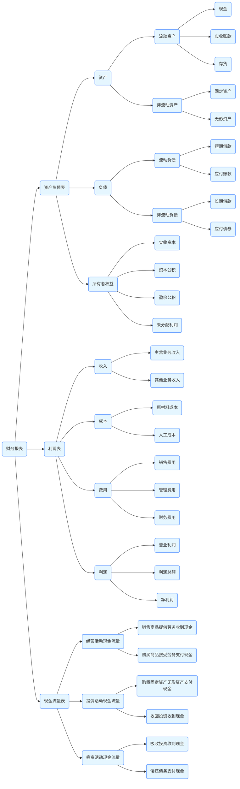

# 企业估值中的财务报表分析方法

> 关键词：企业估值、财务报表分析、比率分析、现金流量分析、趋势分析

> 摘要：本文深入探讨了企业估值中财务报表分析的重要方法。首先介绍了财务报表分析在企业估值中的背景，包括目的、预期读者等内容。接着阐述了核心概念，如资产负债表、利润表、现金流量表的原理及其联系。详细讲解了核心算法原理，通过Python代码展示比率分析等具体操作步骤。同时给出了相关数学模型和公式，并举例说明。通过项目实战，从开发环境搭建到源代码实现与解读，让读者更清晰地理解如何运用这些方法进行企业估值。还介绍了实际应用场景、推荐了相关工具和资源，最后总结了未来发展趋势与挑战，为读者提供了全面且深入的企业估值中财务报表分析的知识体系。

## 1. 背景介绍 
### 1.1 目的和范围
在当今的商业世界中，企业估值是一个至关重要的议题。无论是投资者决定是否投资一家公司，还是企业进行并购、重组等战略决策，都需要准确地评估企业的价值。财务报表作为企业经营状况和财务成果的重要记录，是进行企业估值的关键依据。本文章的目的就是详细介绍在企业估值过程中，如何运用有效的方法对财务报表进行分析，从而更准确地评估企业的价值。

范围涵盖了常见的财务报表分析方法，包括比率分析、现金流量分析、趋势分析等，并结合Python代码进行实际操作演示。同时，通过项目实战案例，让读者了解如何将这些方法应用到实际的企业估值中。

### 1.2 预期读者
本文预期读者包括但不限于以下几类人群：
- 投资者：无论是个人投资者还是机构投资者，都需要通过财务报表分析来评估企业的投资价值，以便做出明智的投资决策。
- 企业管理者：企业管理者可以通过对自身财务报表的分析，了解企业的经营状况和财务健康程度，为企业的战略规划和决策提供依据。
- 金融分析师：金融分析师需要对企业进行深入的研究和分析，为客户提供专业的投资建议，财务报表分析是他们工作的重要组成部分。
- 学术研究人员：学术研究人员可以从本文中获取关于企业估值和财务报表分析的理论和实践知识，为进一步的研究提供参考。

### 1.3 文档结构概述
本文将按照以下结构进行阐述：
- 核心概念与联系：介绍财务报表的核心概念，包括资产负债表、利润表、现金流量表的原理和它们之间的联系，并通过文本示意图和Mermaid流程图进行展示。
- 核心算法原理 & 具体操作步骤：详细讲解常见的财务报表分析方法的算法原理，如比率分析、现金流量分析等，并使用Python代码进行具体操作演示。
- 数学模型和公式 & 详细讲解 & 举例说明：给出相关的数学模型和公式，并结合实际例子进行详细讲解。
- 项目实战：代码实际案例和详细解释说明：通过一个实际的项目案例，展示如何运用财务报表分析方法进行企业估值，包括开发环境搭建、源代码详细实现和代码解读。
- 实际应用场景：介绍财务报表分析在企业估值中的实际应用场景。
- 工具和资源推荐：推荐学习财务报表分析和企业估值的相关工具和资源，包括书籍、在线课程、技术博客和网站等。
- 总结：未来发展趋势与挑战：总结财务报表分析在企业估值中的发展趋势和面临的挑战。
- 附录：常见问题与解答：解答读者在学习和实践过程中可能遇到的常见问题。
- 扩展阅读 & 参考资料：提供相关的扩展阅读材料和参考资料，方便读者进一步深入学习。

### 1.4 术语表
#### 1.4.1 核心术语定义
- **企业估值**：指对企业的经济价值进行评估的过程，通常用于投资决策、并购重组、企业上市等场景。
- **财务报表**：是企业按照一定的会计规范和方法编制的，反映企业在一定时期内的财务状况、经营成果和现金流量的书面文件，主要包括资产负债表、利润表和现金流量表。
- **比率分析**：是通过计算财务报表中不同项目之间的比率，来评估企业的财务状况、经营效率和盈利能力的一种分析方法。
- **现金流量分析**：是对企业现金流入和流出的情况进行分析，以评估企业的现金创造能力、偿债能力和资金运营效率的一种分析方法。
- **趋势分析**：是通过比较企业不同时期的财务数据，来观察企业的财务状况和经营成果的变化趋势的一种分析方法。

#### 1.4.2 相关概念解释
- **资产负债表**：反映企业在某一特定日期的财务状况，包括资产、负债和所有者权益三个方面。资产是企业拥有或控制的经济资源，负债是企业所承担的债务，所有者权益是企业所有者对企业净资产的所有权。
- **利润表**：反映企业在一定会计期间的经营成果，主要包括收入、成本、费用和利润等项目。收入是企业在销售商品或提供劳务等经营活动中所取得的经济利益流入，成本和费用是企业为取得收入而发生的经济利益流出，利润是企业收入减去成本和费用后的剩余部分。
- **现金流量表**：反映企业在一定会计期间的现金流入和流出情况，主要包括经营活动现金流量、投资活动现金流量和筹资活动现金流量三个部分。经营活动现金流量是企业在日常经营活动中所产生的现金流量，投资活动现金流量是企业在投资活动中所产生的现金流量，筹资活动现金流量是企业在筹资活动中所产生的现金流量。

#### 1.4.3 缩略词列表
- **EPS**：Earnings Per Share，每股收益，反映企业普通股股东每股所能享有的利润。
- **ROE**：Return on Equity，净资产收益率，反映企业运用自有资本的效率。
- **ROA**：Return on Assets，总资产收益率，反映企业运用全部资产的盈利能力。
- **P/E**：Price-to-Earnings Ratio，市盈率，反映投资者对企业未来盈利的预期。
- **P/B**：Price-to-Book Ratio，市净率，反映企业股票价格与每股净资产的关系。

## 2. 核心概念与联系 

### 核心概念原理
#### 资产负债表
资产负债表是企业财务报表的重要组成部分，它遵循会计恒等式：$资产 = 负债 + 所有者权益$。资产按照流动性可以分为流动资产和非流动资产。流动资产包括现金、应收账款、存货等，它们能够在较短的时间内变现。非流动资产包括固定资产、无形资产等，它们的变现周期较长。负债按照偿还期限可以分为流动负债和非流动负债。流动负债如短期借款、应付账款等，需要在短期内偿还。非流动负债如长期借款、应付债券等，偿还期限较长。所有者权益是企业所有者对企业净资产的所有权，包括实收资本、资本公积、盈余公积和未分配利润等。

#### 利润表
利润表反映了企业在一定会计期间的经营成果。其基本公式为：$利润 = 收入 - 成本 - 费用$。收入是企业在销售商品或提供劳务等经营活动中所取得的经济利益流入，包括主营业务收入和其他业务收入。成本是企业为生产产品或提供劳务所发生的直接费用，如原材料成本、人工成本等。费用是企业为取得收入而发生的间接费用，如销售费用、管理费用、财务费用等。利润可以分为营业利润、利润总额和净利润。营业利润是企业日常经营活动所产生的利润，利润总额是营业利润加上营业外收入减去营业外支出后的金额，净利润是利润总额减去所得税费用后的金额。

#### 现金流量表
现金流量表反映了企业在一定会计期间的现金流入和流出情况。它将企业的现金流量分为经营活动现金流量、投资活动现金流量和筹资活动现金流量三个部分。经营活动现金流量是企业在日常经营活动中所产生的现金流量，如销售商品、提供劳务收到的现金，购买商品、接受劳务支付的现金等。投资活动现金流量是企业在投资活动中所产生的现金流量，如购置固定资产、无形资产支付的现金，收回投资收到的现金等。筹资活动现金流量是企业在筹资活动中所产生的现金流量，如吸收投资收到的现金，偿还债务支付的现金等。

### 架构的文本示意图
```plaintext
财务报表
|-- 资产负债表
|   |-- 资产
|   |   |-- 流动资产
|   |   |   |-- 现金
|   |   |   |-- 应收账款
|   |   |   |-- 存货
|   |   |-- 非流动资产
|   |       |-- 固定资产
|   |       |-- 无形资产
|   |-- 负债
|   |   |-- 流动负债
|   |   |   |-- 短期借款
|   |   |   |-- 应付账款
|   |   |-- 非流动负债
|   |       |-- 长期借款
|   |       |-- 应付债券
|   |-- 所有者权益
|       |-- 实收资本
|       |-- 资本公积
|       |-- 盈余公积
|       |-- 未分配利润
|-- 利润表
|   |-- 收入
|   |   |-- 主营业务收入
|   |   |-- 其他业务收入
|   |-- 成本
|   |   |-- 原材料成本
|   |   |-- 人工成本
|   |-- 费用
|   |   |-- 销售费用
|   |   |-- 管理费用
|   |   |-- 财务费用
|   |-- 利润
|       |-- 营业利润
|       |-- 利润总额
|       |-- 净利润
|-- 现金流量表
|   |-- 经营活动现金流量
|   |   |-- 销售商品、提供劳务收到的现金
|   |   |-- 购买商品、接受劳务支付的现金
|   |-- 投资活动现金流量
|   |   |-- 购置固定资产、无形资产支付的现金
|   |   |-- 收回投资收到的现金
|   |-- 筹资活动现金流量
|       |-- 吸收投资收到的现金
|       |-- 偿还债务支付的现金
```

### Mermaid 流程图


## 3. 核心算法原理 & 具体操作步骤 

### 比率分析
#### 算法原理
比率分析是通过计算财务报表中不同项目之间的比率，来评估企业的财务状况、经营效率和盈利能力的一种分析方法。常见的比率包括偿债能力比率、营运能力比率、盈利能力比率等。

#### 具体操作步骤及Python代码实现
以下是使用Python计算一些常见比率的示例代码：
```python
import pandas as pd

# 假设我们有一个包含财务数据的DataFrame
data = {
    '流动资产': [1000, 1200, 1500],
    '流动负债': [800, 900, 1000],
    '营业收入': [5000, 6000, 7000],
    '净利润': [500, 600, 700],
    '总资产': [3000, 3500, 4000],
    '所有者权益': [2000, 2200, 2500]
}
df = pd.DataFrame(data)

# 计算流动比率
df['流动比率'] = df['流动资产'] / df['流动负债']

# 计算销售净利率
df['销售净利率'] = df['净利润'] / df['营业收入']

# 计算总资产收益率
df['总资产收益率'] = df['净利润'] / df['总资产']

# 计算净资产收益率
df['净资产收益率'] = df['净利润'] / df['所有者权益']

print(df)
```
### 现金流量分析
#### 算法原理
现金流量分析是对企业现金流入和流出的情况进行分析，以评估企业的现金创造能力、偿债能力和资金运营效率的一种分析方法。主要分析指标包括经营活动现金流量净额、自由现金流量等。

#### 具体操作步骤及Python代码实现
```python
# 假设我们有一个包含现金流量数据的DataFrame
cash_flow_data = {
    '经营活动现金流入': [2000, 2200, 2500],
    '经营活动现金流出': [1500, 1600, 1800],
    '投资活动现金流出': [500, 600, 700],
    '筹资活动现金流入': [300, 400, 500],
    '筹资活动现金流出': [200, 250, 300]
}
cash_flow_df = pd.DataFrame(cash_flow_data)

# 计算经营活动现金流量净额
cash_flow_df['经营活动现金流量净额'] = cash_flow_df['经营活动现金流入'] - cash_flow_df['经营活动现金流出']

# 计算自由现金流量
cash_flow_df['自由现金流量'] = cash_flow_df['经营活动现金流量净额'] - cash_flow_df['投资活动现金流出']

print(cash_flow_df)
```

### 趋势分析
#### 算法原理
趋势分析是通过比较企业不同时期的财务数据，来观察企业的财务状况和经营成果的变化趋势的一种分析方法。可以通过计算增长率等指标来进行趋势分析。

#### 具体操作步骤及Python代码实现
```python
# 假设我们有一个包含多年营业收入数据的Series
revenue = pd.Series([5000, 6000, 7000, 8000, 9000])

# 计算增长率
growth_rate = revenue.pct_change()

print(growth_rate)
```

## 4. 数学模型和公式 & 详细讲解 & 举例说明 

### 偿债能力比率
#### 流动比率
公式：$流动比率 = \frac{流动资产}{流动负债}$
详细讲解：流动比率反映了企业流动资产偿还流动负债的能力。一般来说，流动比率越高，企业的短期偿债能力越强。但流动比率过高也可能意味着企业的资金闲置，没有得到有效的利用。
举例说明：假设企业的流动资产为1000万元，流动负债为800万元，则流动比率为$\frac{1000}{800} = 1.25$。这表明企业每1元的流动负债有1.25元的流动资产作为保障。

#### 速动比率
公式：$速动比率 = \frac{流动资产 - 存货}{流动负债}$
详细讲解：速动比率是对流动比率的补充，它排除了存货等变现能力较差的资产，更能准确地反映企业的短期偿债能力。
举例说明：假设企业的流动资产为1000万元，存货为200万元，流动负债为800万元，则速动比率为$\frac{1000 - 200}{800} = 1$。这表明企业在不考虑存货的情况下，每1元的流动负债有1元的速动资产作为保障。

### 营运能力比率
#### 应收账款周转率
公式：$应收账款周转率 = \frac{营业收入}{平均应收账款余额}$
详细讲解：应收账款周转率反映了企业应收账款的周转速度，即企业收回应收账款的效率。应收账款周转率越高，说明企业收回应收账款的速度越快，资金使用效率越高。
举例说明：假设企业的营业收入为5000万元，年初应收账款余额为800万元，年末应收账款余额为1200万元，则平均应收账款余额为$\frac{800 + 1200}{2} = 1000$万元，应收账款周转率为$\frac{5000}{1000} = 5$次。这意味着企业的应收账款在一年内周转了5次。

#### 存货周转率
公式：$存货周转率 = \frac{营业成本}{平均存货余额}$
详细讲解：存货周转率反映了企业存货的周转速度，即企业销售存货的效率。存货周转率越高，说明企业存货的周转速度越快，存货占用的资金越少。
举例说明：假设企业的营业成本为3000万元，年初存货余额为600万元，年末存货余额为400万元，则平均存货余额为$\frac{600 + 400}{2} = 500$万元，存货周转率为$\frac{3000}{500} = 6$次。这意味着企业的存货在一年内周转了6次。

### 盈利能力比率
#### 销售净利率
公式：$销售净利率 = \frac{净利润}{营业收入} \times 100\%$
详细讲解：销售净利率反映了企业每单位营业收入所赚取的净利润，是衡量企业盈利能力的重要指标。销售净利率越高，说明企业的盈利能力越强。
举例说明：假设企业的净利润为500万元，营业收入为5000万元，则销售净利率为$\frac{500}{5000} \times 100\% = 10\%$。这表明企业每销售100元的商品或提供100元的劳务，能够赚取10元的净利润。

#### 净资产收益率
公式：$净资产收益率 = \frac{净利润}{所有者权益} \times 100\%$
详细讲解：净资产收益率反映了企业运用自有资本的效率，即企业为股东创造利润的能力。净资产收益率越高，说明企业运用自有资本的效率越高，为股东创造的价值越大。
举例说明：假设企业的净利润为500万元，所有者权益为2000万元，则净资产收益率为$\frac{500}{2000} \times 100\% = 25\%$。这表明企业每100元的自有资本能够创造25元的净利润。

## 5. 项目实战：代码实际案例和详细解释说明 

### 5.1  开发环境搭建
#### 安装Python
首先需要安装Python，建议使用Python 3.7及以上版本。可以从Python官方网站（https://www.python.org/downloads/）下载适合自己操作系统的安装包，然后按照安装向导进行安装。

#### 安装必要的库
在进行财务报表分析时，需要使用一些Python库，如`pandas`、`numpy`等。可以使用以下命令进行安装：
```sh
pip install pandas numpy
```

### 5.2  源代码详细实现和代码解读
以下是一个完整的项目实战代码，用于对企业的财务报表进行分析：
```python
import pandas as pd

# 读取财务报表数据
financial_data = pd.read_csv('financial_statements.csv')

# 计算常见比率
# 流动比率
financial_data['流动比率'] = financial_data['流动资产'] / financial_data['流动负债']

# 销售净利率
financial_data['销售净利率'] = financial_data['净利润'] / financial_data['营业收入']

# 总资产收益率
financial_data['总资产收益率'] = financial_data['净利润'] / financial_data['总资产']

# 净资产收益率
financial_data['净资产收益率'] = financial_data['净利润'] / financial_data['所有者权益']

# 应收账款周转率
financial_data['平均应收账款余额'] = (financial_data['年初应收账款余额'] + financial_data['年末应收账款余额']) / 2
financial_data['应收账款周转率'] = financial_data['营业收入'] / financial_data['平均应收账款余额']

# 存货周转率
financial_data['平均存货余额'] = (financial_data['年初存货余额'] + financial_data['年末存货余额']) / 2
financial_data['存货周转率'] = financial_data['营业成本'] / financial_data['平均存货余额']

# 输出分析结果
print(financial_data[['流动比率', '销售净利率', '总资产收益率', '净资产收益率', '应收账款周转率', '存货周转率']])
```
### 代码解读
- **读取财务报表数据**：使用`pandas`库的`read_csv`函数读取存储在CSV文件中的财务报表数据。
- **计算常见比率**：根据前面介绍的公式，计算流动比率、销售净利率、总资产收益率、净资产收益率、应收账款周转率和存货周转率。
- **输出分析结果**：打印出计算得到的比率数据，方便进行分析和评估。

### 5.3  代码解读与分析
通过上述代码，我们可以对企业的财务报表进行全面的分析。流动比率可以反映企业的短期偿债能力，销售净利率、总资产收益率和净资产收益率可以反映企业的盈利能力，应收账款周转率和存货周转率可以反映企业的营运能力。通过对这些比率的分析，我们可以评估企业的财务状况和经营成果，为企业估值提供重要的依据。

## 6. 实际应用场景 
### 投资决策
投资者在进行投资决策时，需要对企业的价值进行评估。通过对企业财务报表的分析，可以了解企业的财务状况、经营成果和现金流量，从而判断企业的投资价值。例如，如果企业的盈利能力较强、偿债能力较好、营运能力较高，那么该企业可能具有较高的投资价值。

### 并购重组
在企业进行并购重组时，需要对目标企业的价值进行评估。财务报表分析可以帮助企业了解目标企业的资产状况、负债情况、盈利能力等，从而确定合理的并购价格。同时，通过对财务报表的分析，还可以发现目标企业存在的潜在风险，为并购决策提供参考。

### 企业内部管理
企业管理者可以通过对自身财务报表的分析，了解企业的经营状况和财务健康程度。例如，通过分析应收账款周转率和存货周转率，可以发现企业在销售和库存管理方面存在的问题，从而采取相应的措施进行改进。同时，通过分析盈利能力和偿债能力等指标，可以为企业的战略规划和决策提供依据。

### 银行信贷审批
银行在进行信贷审批时，需要对企业的还款能力进行评估。财务报表分析可以帮助银行了解企业的财务状况和经营成果，从而判断企业的还款能力。例如，如果企业的流动比率较高、销售净利率较好、现金流量充足，那么该企业的还款能力可能较强，银行可以考虑给予其贷款。

## 7. 工具和资源推荐
### 7.1 学习资源推荐
#### 7.1.1 书籍推荐
- 《财务报表分析与证券定价》：这本书系统地介绍了财务报表分析的方法和技术，并结合证券定价的理论，为投资者提供了实用的分析工具。
- 《手把手教你读财报》：以通俗易懂的语言，详细讲解了财务报表的阅读方法和分析技巧，适合初学者阅读。
- 《巴菲特的护城河》：通过分析巴菲特的投资理念，介绍了如何通过财务报表分析寻找具有竞争优势的企业。

#### 7.1.2 在线课程
- Coursera上的“财务报表分析”课程：由知名大学的教授授课，内容涵盖了财务报表分析的基本概念、方法和应用。
- 网易云课堂上的“企业财务报表分析实战”课程：结合实际案例，详细讲解了财务报表分析的实战技巧。

#### 7.1.3 技术博客和网站
- 雪球网：提供了丰富的企业财务数据和分析文章，是投资者交流和学习的重要平台。
- 东方财富网：提供了全面的金融信息和财务报表数据，方便投资者进行查询和分析。

### 7.2 开发工具框架推荐
#### 7.2.1 IDE和编辑器
- PyCharm：一款专业的Python集成开发环境，提供了丰富的代码编辑、调试和分析功能。
- Jupyter Notebook：一种交互式的开发环境，适合进行数据分析和可视化，方便用户进行代码的编写和调试。

#### 7.2.2 调试和性能分析工具
- `pdb`：Python自带的调试工具，可以帮助用户定位代码中的错误。
- `cProfile`：Python的性能分析工具，可以帮助用户分析代码的性能瓶颈。

#### 7.2.3 相关框架和库
- `pandas`：一个强大的数据处理和分析库，提供了丰富的数据结构和函数，方便用户进行财务报表数据的处理和分析。
- `numpy`：一个用于科学计算的库，提供了高效的数组操作和数学函数，是`pandas`的基础库。

### 7.3 相关论文著作推荐
#### 7.3.1 经典论文
- Ball, R., & Brown, P. (1968). An empirical evaluation of accounting income numbers. Journal of Accounting Research, 6(2), 159-178. 这篇经典论文首次实证研究了会计盈余数字与股票价格之间的关系，为财务报表分析的实证研究奠定了基础。
- Beaver, W. H. (1966). Financial ratios as predictors of failure. Journal of Accounting Research, 4(2), 71-111. 该论文探讨了财务比率在预测企业失败方面的作用，为财务困境预测研究提供了重要的思路。

#### 7.3.2 最新研究成果
- Dechow, P. M., Ge, W., & Schrand, C. M. (2010). Understanding earnings quality: A review of the proxies, their determinants and their consequences. Journal of Accounting and Economics, 50(2-3), 344-401. 这篇论文对盈余质量的相关研究进行了全面的综述，包括盈余质量的代理变量、决定因素和经济后果等方面。
- Fama, E. F., & French, K. R. (2015). A five-factor asset pricing model. Journal of Financial Economics, 116(1), 1-22. 该论文提出了五因子资产定价模型，为资产定价和企业估值提供了新的理论框架。

#### 7.3.3 应用案例分析
- Koller, T., Goedhart, M., & Wessels, D. (2015). Valuation: Measuring and managing the value of companies. John Wiley & Sons. 这本书通过大量的实际案例，详细介绍了企业估值的方法和技巧，包括财务报表分析在企业估值中的应用。

## 8. 总结：未来发展趋势与挑战
### 未来发展趋势
#### 大数据和人工智能的应用
随着大数据和人工智能技术的不断发展，财务报表分析将越来越多地应用这些技术。例如，可以利用大数据技术收集和整合更多的财务和非财务数据，为企业估值提供更全面的信息。同时，人工智能算法可以自动分析财务报表数据，发现潜在的规律和趋势，提高分析的效率和准确性。

#### 非财务信息的重要性增加
传统的财务报表分析主要关注企业的财务数据，但未来非财务信息的重要性将逐渐增加。例如，企业的创新能力、品牌价值、社会责任等非财务因素对企业的价值和发展具有重要影响。因此，在进行企业估值时，需要综合考虑财务和非财务信息。

#### 国际化和跨行业分析
随着经济全球化的发展，企业的国际化程度越来越高，跨行业经营也越来越普遍。因此，未来的财务报表分析需要更加注重国际化和跨行业的比较和分析。例如，需要考虑不同国家和地区的会计制度和税收政策的差异，以及不同行业的特点和竞争环境。

### 挑战
#### 数据质量和可靠性
财务报表分析的准确性和可靠性依赖于数据的质量。然而，在实际应用中，数据质量可能存在问题，如数据缺失、错误、虚假等。因此，如何保证数据的质量和可靠性是财务报表分析面临的一个重要挑战。

#### 技术和人才短缺
大数据和人工智能等新技术的应用需要具备相应的技术和人才。然而，目前相关技术和人才相对短缺，这给财务报表分析的发展带来了一定的困难。因此，需要加强技术研发和人才培养，提高财务报表分析的技术水平和应用能力。

#### 法律法规和监管要求
随着金融市场的不断发展和监管的加强，财务报表分析需要遵守越来越多的法律法规和监管要求。例如，需要保证分析过程的合规性和透明度，防范内幕交易和市场操纵等违法行为。因此，如何在满足法律法规和监管要求的前提下，进行有效的财务报表分析是一个需要解决的问题。

## 9. 附录：常见问题与解答
### 如何选择合适的财务比率进行分析？
选择合适的财务比率进行分析需要根据分析的目的和企业的特点来确定。例如，如果分析的目的是评估企业的短期偿债能力，可以选择流动比率、速动比率等指标；如果分析的目的是评估企业的盈利能力，可以选择销售净利率、净资产收益率等指标。同时，还需要考虑企业所处的行业特点和经营模式，不同行业的企业可能适用不同的财务比率。

### 财务报表数据的真实性如何判断？
判断财务报表数据的真实性可以从以下几个方面入手：
- 审计报告：查看企业的审计报告，审计意见可以提供关于财务报表真实性和可靠性的重要信息。
- 数据的合理性：分析财务报表数据之间的逻辑关系和合理性，如收入和成本的匹配性、资产和负债的结构等。
- 行业比较：将企业的财务数据与同行业其他企业进行比较，看是否存在异常情况。
- 非财务信息：结合企业的非财务信息，如市场口碑、客户评价等，综合判断财务报表数据的真实性。

### 如何处理财务报表中的异常数据？
处理财务报表中的异常数据可以采取以下方法：
- 核实数据来源：首先要核实异常数据的来源，看是否是数据录入错误或其他原因导致的。
- 分析异常原因：如果数据确实存在异常，需要分析异常的原因，如是否是企业的特殊业务活动或会计政策变更导致的。
- 调整数据：如果异常数据是由于错误或不合理的会计处理导致的，可以对数据进行调整，以反映企业的真实财务状况。
- 进行敏感性分析：在进行财务报表分析时，可以进行敏感性分析，考虑异常数据对分析结果的影响程度。

## 10. 扩展阅读 & 参考资料
### 扩展阅读
- 《财务造假识别与经济后果研究》：深入探讨了财务造假的识别方法和经济后果，有助于读者提高对财务报表真实性的判断能力。
- 《企业价值评估理论与方法研究》：系统介绍了企业价值评估的各种理论和方法，为读者提供了更深入的企业估值知识。

### 参考资料
- 《企业会计准则》：是企业编制财务报表的重要依据，读者可以参考相关准则了解财务报表的编制方法和要求。
- 各证券交易所的上市公司年报和季报：可以获取实际的企业财务报表数据，进行实践分析和研究。

作者：AI天才研究院/AI Genius Institute & 禅与计算机程序设计艺术 /Zen And The Art of Computer Programming