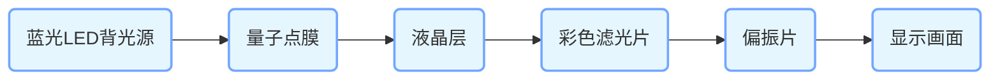

# 企业估值中的量子点显示技术应用评估

> 关键词：企业估值、量子点显示技术、应用评估、技术经济分析、市场潜力

> 摘要：本文聚焦于企业估值中量子点显示技术的应用评估。首先介绍了企业估值及量子点显示技术的背景知识，明确研究目的、范围、预期读者等。接着阐述量子点显示技术的核心概念、原理及架构，给出文本示意图和Mermaid流程图。详细讲解核心算法原理，并用Python代码进行展示，同时给出相关数学模型和公式。通过项目实战案例，包括开发环境搭建、源代码实现与解读，深入分析量子点显示技术在企业中的应用。探讨了该技术的实际应用场景，推荐了学习、开发工具及相关论文著作。最后总结量子点显示技术在企业估值中的未来发展趋势与挑战，解答常见问题并提供扩展阅读和参考资料，旨在为企业在估值中准确评估量子点显示技术的应用价值提供全面的指导。

## 1. 背景介绍 
### 1.1 目的和范围
企业估值是对企业的经济价值进行评估的过程，准确的估值对于企业的投资决策、并购重组、上市融资等活动至关重要。量子点显示技术作为一种新兴的显示技术，具有色彩鲜艳、对比度高、能耗低等优点，在显示领域展现出巨大的应用潜力。本研究的目的是深入探讨量子点显示技术在企业估值中的应用评估方法，为企业和投资者提供科学的决策依据。研究范围涵盖量子点显示技术的原理、市场应用、技术经济分析等方面，以及如何将这些因素纳入企业估值模型中。

### 1.2 预期读者
本文的预期读者包括企业管理者、投资者、金融分析师、技术研发人员以及对量子点显示技术和企业估值感兴趣的相关人员。企业管理者可以通过本文了解如何评估量子点显示技术对企业价值的影响，以便做出合理的战略决策；投资者可以借助文中的评估方法判断企业的投资价值；金融分析师能够运用相关知识进行企业估值和风险评估；技术研发人员可以从市场和经济的角度了解量子点显示技术的发展前景，为技术创新提供方向。

### 1.3 文档结构概述
本文共分为十个部分。第一部分介绍背景信息，包括目的、范围、预期读者和文档结构概述；第二部分阐述量子点显示技术的核心概念、原理和架构，并给出示意图和流程图；第三部分讲解核心算法原理，并用Python代码详细说明；第四部分介绍相关数学模型和公式，并举例说明；第五部分通过项目实战案例，包括开发环境搭建、源代码实现和代码解读，深入分析量子点显示技术在企业中的应用；第六部分探讨量子点显示技术的实际应用场景；第七部分推荐学习资源、开发工具和相关论文著作；第八部分总结量子点显示技术在企业估值中的未来发展趋势与挑战；第九部分解答常见问题；第十部分提供扩展阅读和参考资料。

### 1.4 术语表
#### 1.4.1 核心术语定义
- **企业估值**：指对企业的经济价值进行评估的过程，通常基于企业的资产、盈利能力、市场前景等因素。
- **量子点显示技术**：是一种基于量子点材料的显示技术，通过量子点材料在电场或光场的激发下发出特定颜色的光，实现高质量的显示效果。
- **技术经济分析**：是对技术方案的经济效果进行分析、评价和比较的一种方法，旨在选择最优的技术方案。
- **市场潜力**：指某种产品或技术在市场上可能达到的最大销售量或销售额。

#### 1.4.2 相关概念解释
- **量子点**：是一种纳米级的半导体颗粒，其尺寸通常在几纳米到几十纳米之间。量子点具有独特的光学和电学性质，其发光颜色可以通过改变量子点的尺寸来调节。
- **显示技术**：是将图像或视频信息转化为可见光的技术，包括液晶显示（LCD）、有机发光二极管显示（OLED）、量子点显示等多种类型。
- **企业价值**：是企业在市场上的经济价值，通常由企业的资产价值、盈利能力、市场份额、品牌价值等因素决定。

#### 1.4.3 缩略词列表
- **LCD**：Liquid Crystal Display，液晶显示
- **OLED**：Organic Light - Emitting Diode，有机发光二极管显示
- **QLED**：Quantum - Dot Light - Emitting Diode，量子点发光二极管显示

## 2. 核心概念与联系 
### 核心概念原理
量子点显示技术的核心是量子点材料。量子点是一种零维的纳米半导体材料，其电子和空穴被限制在一个非常小的空间内，导致其能级结构呈现出离散化的特点。当量子点受到外界能量（如光或电）的激发时，电子会从基态跃迁到激发态，然后再从激发态回到基态，同时释放出特定波长的光。这种发光特性使得量子点可以作为发光材料应用于显示领域。

量子点显示技术主要有两种类型：量子点增强型液晶显示（QLED - LCD）和量子点发光二极管显示（QLED）。在QLED - LCD中，量子点材料被用作背光源的色彩转换层，通过蓝光激发量子点，使其发出红、绿等颜色的光，从而提高液晶显示的色彩表现。在QLED中，量子点材料直接作为发光层，通过电场激发量子点发光，实现主动发光显示。

### 架构的文本示意图
以下是量子点增强型液晶显示（QLED - LCD）的架构示意图：

| 组件名称 | 功能描述 |
| ---- | ---- |
| 背光源（蓝光LED） | 提供激发量子点的蓝光 |
| 量子点膜 | 包含量子点材料，在蓝光激发下发出红、绿等颜色的光 |
| 液晶层 | 通过控制液晶分子的取向来调节光的透过率，实现图像显示 |
| 彩色滤光片 | 进一步过滤光线，提高色彩纯度 |
| 偏振片 | 控制光的偏振方向，使光线能够正常显示 |

### Mermaid流程图


该流程图展示了量子点增强型液晶显示（QLED - LCD）的工作流程。首先，蓝光LED背光源发出蓝光，照射到量子点膜上。量子点膜中的量子点在蓝光的激发下发出红、绿等颜色的光，这些混合光进入液晶层。液晶层通过控制液晶分子的取向来调节光的透过率，然后经过彩色滤光片进一步过滤光线，提高色彩纯度。最后，经过偏振片的光线形成显示画面。

## 3. 核心算法原理 & 具体操作步骤 
### 核心算法原理
在企业估值中评估量子点显示技术的应用价值，需要综合考虑多个因素，如技术的市场占有率、技术的研发成本、技术带来的收益等。一种常用的方法是基于现金流折现模型（DCF）。DCF模型的核心思想是将企业未来的现金流折现到当前时刻，以确定企业的价值。

假设企业使用量子点显示技术后，每年的净现金流为 $CF_t$，折现率为 $r$，预测期为 $n$ 年，企业的终值为 $TV$，则企业的价值 $V$ 可以通过以下公式计算：

$$V=\sum_{t = 1}^{n}\frac{CF_t}{(1 + r)^t}+\frac{TV}{(1 + r)^n}$$

其中，净现金流 $CF_t$ 可以通过以下公式计算：

$$CF_t = R_t - C_t$$

$R_t$ 表示第 $t$ 年的收入，$C_t$ 表示第 $t$ 年的成本。

### 具体操作步骤
1. **预测未来现金流**：根据量子点显示技术的市场前景、企业的市场份额、产品价格等因素，预测企业未来 $n$ 年的收入 $R_t$。同时，考虑技术研发成本、生产成本、营销成本等因素，预测企业未来 $n$ 年的成本 $C_t$。然后计算每年的净现金流 $CF_t$。
2. **确定折现率**：折现率 $r$ 反映了资金的时间价值和投资风险。可以通过资本资产定价模型（CAPM）来确定折现率，公式如下：

$$r = R_f+\beta\times(R_m - R_f)$$

其中，$R_f$ 表示无风险利率，$\beta$ 表示企业的贝塔系数，$R_m$ 表示市场收益率。

3. **计算企业终值**：企业终值 $TV$ 可以通过以下公式计算：

$$TV=\frac{CF_{n + 1}}{r - g}$$

其中，$CF_{n + 1}$ 表示预测期后第一年的净现金流，$g$ 表示企业的永续增长率。

4. **计算企业价值**：将预测的每年净现金流 $CF_t$ 和企业终值 $TV$ 代入现金流折现模型公式，计算企业的价值 $V$。

### Python源代码实现
```python
import numpy as np

def calculate_enterprise_value(revenues, costs, discount_rate, growth_rate, n):
    """
    计算企业价值
    :param revenues: 每年的收入列表
    :param costs: 每年的成本列表
    :param discount_rate: 折现率
    :param growth_rate: 永续增长率
    :param n: 预测期年数
    :return: 企业价值
    """
    # 计算每年的净现金流
    cash_flows = np.array(revenues) - np.array(costs)
    
    # 计算预测期内净现金流的现值
    present_values = []
    for t in range(n):
        present_value = cash_flows[t] / ((1 + discount_rate) ** (t + 1))
        present_values.append(present_value)
    
    # 计算企业终值
    cf_n_plus_1 = cash_flows[-1] * (1 + growth_rate)
    terminal_value = cf_n_plus_1 / (discount_rate - growth_rate)
    terminal_value_present = terminal_value / ((1 + discount_rate) ** n)
    
    # 计算企业价值
    enterprise_value = sum(present_values) + terminal_value_present
    
    return enterprise_value

# 示例数据
revenues = [100, 120, 140, 160, 180]  # 每年的收入
costs = [50, 60, 70, 80, 90]  # 每年的成本
discount_rate = 0.1  # 折现率
growth_rate = 0.03  # 永续增长率
n = 5  # 预测期年数

# 计算企业价值
value = calculate_enterprise_value(revenues, costs, discount_rate, growth_rate, n)
print(f"企业价值: {value}")
```

### 代码解释
上述代码实现了基于现金流折现模型的企业价值计算。首先，定义了一个名为 `calculate_enterprise_value` 的函数，该函数接受每年的收入列表、每年的成本列表、折现率、永续增长率和预测期年数作为输入参数。在函数内部，先计算每年的净现金流，然后计算预测期内净现金流的现值。接着，计算企业终值及其现值。最后，将预测期内净现金流的现值和企业终值的现值相加，得到企业价值。

在示例数据中，我们假设了每年的收入、成本、折现率、永续增长率和预测期年数，调用 `calculate_enterprise_value` 函数计算企业价值，并将结果打印输出。

## 4. 数学模型和公式 & 详细讲解 & 举例说明 
### 现金流折现模型（DCF）
现金流折现模型是企业估值中常用的一种方法，其基本公式为：

$$V=\sum_{t = 1}^{n}\frac{CF_t}{(1 + r)^t}+\frac{TV}{(1 + r)^n}$$

其中：
- $V$ 表示企业的价值。
- $CF_t$ 表示第 $t$ 年的净现金流。
- $r$ 表示折现率。
- $n$ 表示预测期年数。
- $TV$ 表示企业的终值。

### 详细讲解
1. **净现金流 $CF_t$**：净现金流是企业在某一年度内的现金流入减去现金流出后的余额。在量子点显示技术应用评估中，净现金流可以通过以下公式计算：

$$CF_t = R_t - C_t$$

其中，$R_t$ 表示第 $t$ 年的收入，$C_t$ 表示第 $t$ 年的成本。收入 $R_t$ 可以根据量子点显示产品的销售量、销售价格等因素进行预测；成本 $C_t$ 包括技术研发成本、生产成本、营销成本等。

2. **折现率 $r$**：折现率反映了资金的时间价值和投资风险。一般来说，折现率越高，未来现金流的现值越低。折现率可以通过资本资产定价模型（CAPM）来确定：

$$r = R_f+\beta\times(R_m - R_f)$$

其中：
- $R_f$ 表示无风险利率，通常可以用国债收益率来近似表示。
- $\beta$ 表示企业的贝塔系数，反映了企业股票相对于市场的波动性。
- $R_m$ 表示市场收益率，通常可以用股票市场的平均收益率来表示。

3. **企业终值 $TV$**：企业终值是指预测期结束后企业的价值。在实际应用中，通常假设企业在预测期结束后进入稳定增长阶段，此时企业终值可以通过以下公式计算：

$$TV=\frac{CF_{n + 1}}{r - g}$$

其中：
- $CF_{n + 1}$ 表示预测期后第一年的净现金流。
- $g$ 表示企业的永续增长率。

### 举例说明
假设一家企业计划应用量子点显示技术，预测未来 5 年的收入和成本如下表所示：

| 年份 | 收入（万元） | 成本（万元） |
| ---- | ---- | ---- |
| 1 | 100 | 50 |
| 2 | 120 | 60 |
| 3 | 140 | 70 |
| 4 | 160 | 80 |
| 5 | 180 | 90 |

无风险利率 $R_f$ 为 3%，市场收益率 $R_m$ 为 10%，企业的贝塔系数 $\beta$ 为 1.2，永续增长率 $g$ 为 3%。

1. **计算折现率 $r$**：
根据资本资产定价模型：
$$r = R_f+\beta\times(R_m - R_f)=0.03 + 1.2\times(0.1 - 0.03)=0.114$$

2. **计算每年的净现金流 $CF_t$**：
| 年份 | 收入（万元） | 成本（万元） | 净现金流（万元） |
| ---- | ---- | ---- | ---- |
| 1 | 100 | 50 | 50 |
| 2 | 120 | 60 | 60 |
| 3 | 140 | 70 | 70 |
| 4 | 160 | 80 | 80 |
| 5 | 180 | 90 | 90 |

3. **计算预测期内净现金流的现值**：
$$PV_1=\frac{CF_1}{(1 + r)^1}=\frac{50}{(1 + 0.114)^1}\approx44.88$$
$$PV_2=\frac{CF_2}{(1 + r)^2}=\frac{60}{(1 + 0.114)^2}\approx48.44$$
$$PV_3=\frac{CF_3}{(1 + r)^3}=\frac{70}{(1 + 0.114)^3}\approx50.47$$
$$PV_4=\frac{CF_4}{(1 + r)^4}=\frac{80}{(1 + 0.114)^4}\approx51.67$$
$$PV_5=\frac{CF_5}{(1 + r)^5}=\frac{90}{(1 + 0.114)^5}\approx52.14$$

预测期内净现金流的现值总和为：
$$\sum_{t = 1}^{5}PV_t=44.88 + 48.44 + 50.47 + 51.67 + 52.14 = 247.6$$

4. **计算企业终值 $TV$**：
预测期后第一年的净现金流 $CF_6 = CF_5\times(1 + g)=90\times(1 + 0.03)=92.7$
$$TV=\frac{CF_6}{r - g}=\frac{92.7}{0.114 - 0.03}\approx1103.57$$

企业终值的现值为：
$$PV_{TV}=\frac{TV}{(1 + r)^5}=\frac{1103.57}{(1 + 0.114)^5}\approx642.77$$

5. **计算企业价值 $V$**：
$$V=\sum_{t = 1}^{5}PV_t+PV_{TV}=247.6 + 642.77 = 890.37$$

因此，该企业在应用量子点显示技术后的价值约为 890.37 万元。

## 5. 项目实战：代码实际案例和详细解释说明 
### 5.1  开发环境搭建
#### 安装Python
首先，需要安装Python编程语言。可以从Python官方网站（https://www.python.org/downloads/）下载适合自己操作系统的Python安装包，并按照安装向导进行安装。建议安装Python 3.x版本。

#### 安装必要的库
在本项目中，需要使用 `numpy` 库进行数值计算。可以使用以下命令通过 `pip` 安装 `numpy` 库：

```sh
pip install numpy
```

### 5.2  源代码详细实现和代码解读
以下是完整的Python代码实现：

```python
import numpy as np

def calculate_enterprise_value(revenues, costs, discount_rate, growth_rate, n):
    """
    计算企业价值
    :param revenues: 每年的收入列表
    :param costs: 每年的成本列表
    :param discount_rate: 折现率
    :param growth_rate: 永续增长率
    :param n: 预测期年数
    :return: 企业价值
    """
    # 计算每年的净现金流
    cash_flows = np.array(revenues) - np.array(costs)
    
    # 计算预测期内净现金流的现值
    present_values = []
    for t in range(n):
        present_value = cash_flows[t] / ((1 + discount_rate) ** (t + 1))
        present_values.append(present_value)
    
    # 计算企业终值
    cf_n_plus_1 = cash_flows[-1] * (1 + growth_rate)
    terminal_value = cf_n_plus_1 / (discount_rate - growth_rate)
    terminal_value_present = terminal_value / ((1 + discount_rate) ** n)
    
    # 计算企业价值
    enterprise_value = sum(present_values) + terminal_value_present
    
    return enterprise_value

# 示例数据
revenues = [100, 120, 140, 160, 180]  # 每年的收入
costs = [50, 60, 70, 80, 90]  # 每年的成本
discount_rate = 0.1  # 折现率
growth_rate = 0.03  # 永续增长率
n = 5  # 预测期年数

# 计算企业价值
value = calculate_enterprise_value(revenues, costs, discount_rate, growth_rate, n)
print(f"企业价值: {value}")
```

### 代码解读与分析
#### 函数定义
`calculate_enterprise_value` 函数接受每年的收入列表、每年的成本列表、折现率、永续增长率和预测期年数作为输入参数，返回企业的价值。

#### 净现金流计算
使用 `numpy` 库将收入列表和成本列表转换为 `numpy` 数组，然后相减得到每年的净现金流数组 `cash_flows`。

#### 预测期内净现金流的现值计算
使用 `for` 循环遍历预测期内的每一年，根据折现率计算每年净现金流的现值，并将其添加到 `present_values` 列表中。

#### 企业终值计算
首先计算预测期后第一年的净现金流 `cf_n_plus_1`，然后根据永续增长率和折现率计算企业终值 `terminal_value`。最后，将企业终值折现到当前时刻，得到企业终值的现值 `terminal_value_present`。

#### 企业价值计算
将预测期内净现金流的现值总和与企业终值的现值相加，得到企业的价值 `enterprise_value`。

#### 示例数据和结果输出
定义了示例数据，包括每年的收入、成本、折现率、永续增长率和预测期年数。调用 `calculate_enterprise_value` 函数计算企业价值，并将结果打印输出。

## 6. 实际应用场景 
### 电视显示领域
量子点显示技术在电视显示领域具有广泛的应用前景。量子点电视具有色彩鲜艳、对比度高、色域广等优点，能够为用户带来更加逼真的视觉体验。与传统的液晶电视相比，量子点电视的色彩表现更加出色，能够显示出更加丰富的色彩层次和细腻的图像细节。目前，市场上已经有多家电视厂商推出了量子点电视产品，受到了消费者的广泛关注。

### 显示器领域
在显示器领域，量子点显示技术也逐渐得到应用。量子点显示器可以应用于电脑显示器、电竞显示器等产品中，为用户提供更加清晰、鲜艳的图像显示效果。对于电竞玩家来说，量子点显示器的高刷新率和快速响应时间能够满足他们对游戏画面流畅性的要求；对于设计师和摄影师来说，量子点显示器的高精度色彩还原能力能够帮助他们更准确地进行图像和视频处理。

### 车载显示领域
随着汽车智能化和电动化的发展，车载显示系统的需求也越来越高。量子点显示技术具有高亮度、高对比度、宽视角等优点，非常适合应用于车载显示领域。量子点车载显示器可以应用于汽车仪表盘、中控显示屏、后座娱乐系统等部件中，为驾驶员和乘客提供更加清晰、舒适的视觉体验。同时，量子点显示技术的低功耗特性也能够满足汽车对能源效率的要求。

### 虚拟现实（VR）和增强现实（AR）领域
在虚拟现实和增强现实领域，显示技术的质量直接影响到用户的沉浸感和体验效果。量子点显示技术的高分辨率、高对比度和高色域特性，能够为VR和AR设备提供更加逼真的图像显示效果，增强用户的沉浸感。此外，量子点显示技术的快速响应时间也能够减少图像的拖影现象，提高用户的视觉体验。

## 7. 工具和资源推荐
### 7.1 学习资源推荐
#### 7.1.1 书籍推荐
- 《量子点物理》：本书系统地介绍了量子点的基本物理概念、理论模型和实验方法，对于深入理解量子点显示技术的原理具有重要的参考价值。
- 《企业估值：理论与实践》：该书全面介绍了企业估值的各种方法和模型，包括现金流折现模型、市场比较法等，为企业估值提供了理论和实践指导。
- 《显示技术原理与应用》：详细介绍了各种显示技术的原理、特点和应用，包括量子点显示技术、液晶显示技术、有机发光二极管显示技术等。

#### 7.1.2 在线课程
- Coursera上的“Quantum Mechanics for Scientists and Engineers”：该课程由知名高校的教授授课，介绍了量子力学的基本原理和应用，对于理解量子点显示技术的物理基础有很大帮助。
- edX上的“Valuation for Mergers, Acquisitions, and Restructuring”：课程主要讲解企业估值在并购重组中的应用，包括各种估值方法的实际操作和案例分析。
- Udemy上的“Advanced Display Technologies”：课程涵盖了最新的显示技术发展趋势，包括量子点显示技术、MicroLED显示技术等。

#### 7.1.3 技术博客和网站
- IEEE Spectrum：是电气和电子工程师协会（IEEE）的官方杂志网站，提供了大量关于电子技术、通信技术、显示技术等方面的最新研究成果和技术动态。
- Display Daily：专注于显示技术领域的新闻和分析，提供了量子点显示技术、OLED显示技术等方面的最新市场动态和技术进展。
- Seeking Alpha：是一个金融投资领域的网站，提供了企业估值、股票分析等方面的文章和研究报告，对于了解企业估值的实际应用有很大帮助。

### 7.2 开发工具框架推荐
#### 7.2.1 IDE和编辑器
- PyCharm：是一款专门为Python开发设计的集成开发环境（IDE），具有代码自动补全、调试、版本控制等功能，非常适合Python代码的开发和调试。
- Jupyter Notebook：是一个交互式的编程环境，支持Python、R等多种编程语言。可以通过Jupyter Notebook进行代码编写、数据分析和可视化，方便进行技术实验和验证。
- Visual Studio Code：是一款轻量级的代码编辑器，支持多种编程语言和插件扩展。可以通过安装Python相关的插件，实现Python代码的开发和调试。

#### 7.2.2 调试和性能分析工具
- PDB：是Python自带的调试器，可以在代码中设置断点，逐行调试代码，帮助开发者查找代码中的错误。
- cProfile：是Python的性能分析工具，可以统计代码中各个函数的执行时间和调用次数，帮助开发者找出代码中的性能瓶颈。
- Memory Profiler：是一个Python的内存分析工具，可以分析代码中各个函数的内存使用情况，帮助开发者优化代码的内存占用。

#### 7.2.3 相关框架和库
- NumPy：是Python的一个数值计算库，提供了高效的多维数组对象和各种数学函数，用于进行数值计算和数据处理。
- Pandas：是Python的一个数据处理库，提供了高效的数据结构和数据操作方法，用于进行数据清洗、数据分析和数据可视化。
- Matplotlib：是Python的一个数据可视化库，提供了各种绘图函数和工具，用于绘制折线图、柱状图、散点图等各种图表。

### 7.3 相关论文著作推荐
#### 7.3.1 经典论文
- “Colloidal nanocrystal quantum dots and quantum dot arrays and solids”：该论文介绍了胶体量子点的合成、性质和应用，是量子点领域的经典论文之一。
- “Valuation of high - tech start - up firms”：论文探讨了高科技初创企业的估值方法，对于评估应用量子点显示技术的初创企业价值具有重要的参考意义。
- “Advances in quantum dot - based displays”：介绍了量子点显示技术的最新研究进展和发展趋势。

#### 7.3.2 最新研究成果
- 可以通过IEEE Xplore、ACM Digital Library等学术数据库搜索关于量子点显示技术和企业估值的最新研究论文。这些论文通常涵盖了量子点显示技术的材料研发、器件制备、市场应用以及企业估值模型的改进等方面的内容。

#### 7.3.3 应用案例分析
- 《高科技企业估值案例分析》：该书收录了多个高科技企业的估值案例，包括应用量子点显示技术的企业案例，通过对这些案例的分析，可以了解企业估值在实际应用中的具体操作和方法。

## 8. 总结：未来发展趋势与挑战
### 未来发展趋势
#### 技术不断创新
量子点显示技术将不断进行创新和改进。例如，开发更高质量的量子点材料，提高量子点的发光效率和稳定性；研究新的量子点显示器件结构，进一步提升显示性能。同时，量子点显示技术可能会与其他显示技术（如MicroLED显示技术）相结合，创造出更加先进的显示产品。

#### 市场需求增长
随着消费者对显示产品质量和性能的要求不断提高，量子点显示技术的市场需求将持续增长。特别是在电视、显示器、车载显示等领域，量子点显示产品将逐渐占据更大的市场份额。此外，随着虚拟现实、增强现实等新兴领域的发展，量子点显示技术也将迎来新的应用机遇。

#### 产业生态完善
量子点显示技术的产业链将不断完善。从量子点材料的研发和生产，到量子点显示器件的制造和组装，再到终端产品的销售和服务，整个产业链将形成更加紧密的合作关系。同时，政府和行业协会也将加大对量子点显示技术产业的支持力度，促进产业的健康发展。

### 挑战
#### 技术成本较高
目前，量子点显示技术的研发和生产成本相对较高，这限制了其大规模的市场应用。降低量子点材料的成本、提高生产工艺的效率是量子点显示技术面临的一个重要挑战。

#### 市场竞争激烈
显示技术领域竞争激烈，量子点显示技术面临着来自液晶显示技术、有机发光二极管显示技术等其他显示技术的竞争。如何在激烈的市场竞争中脱颖而出，提高量子点显示技术的市场竞争力，是企业需要解决的问题。

#### 环境和安全问题
量子点材料中可能含有一些重金属元素，如镉等，这些元素可能会对环境和人体健康造成一定的影响。因此，如何解决量子点显示技术的环境和安全问题，是该技术可持续发展的关键。

## 9. 附录：常见问题与解答
### 量子点显示技术与其他显示技术相比有哪些优势？
量子点显示技术与其他显示技术相比，具有色彩鲜艳、对比度高、色域广等优点。量子点可以精确控制发光颜色，能够实现更加丰富的色彩层次和细腻的图像细节。此外，量子点显示技术的能耗相对较低，具有较好的节能效果。

### 在企业估值中，如何准确预测量子点显示技术的市场前景？
在企业估值中，准确预测量子点显示技术的市场前景需要综合考虑多个因素。可以通过市场调研了解消费者对量子点显示产品的需求和偏好，分析市场规模和增长趋势。同时，关注行业技术发展动态，了解竞争对手的情况，评估量子点显示技术的竞争力。此外，还可以参考相关的行业报告和专家意见，对市场前景进行预测。

### 量子点显示技术的研发成本对企业估值有什么影响？
量子点显示技术的研发成本是企业成本的重要组成部分，会对企业的盈利能力和现金流产生影响。如果研发成本过高，可能会导致企业短期内盈利下降，从而降低企业的价值。但是，如果研发成功，量子点显示技术能够带来更高的市场份额和产品附加值，从而提高企业的长期盈利能力和价值。因此，在企业估值中，需要综合考虑研发成本的投入和预期收益。

### 如何确定企业估值中的折现率和永续增长率？
折现率可以通过资本资产定价模型（CAPM）来确定，公式为 $r = R_f+\beta\times(R_m - R_f)$，其中 $R_f$ 表示无风险利率，$\beta$ 表示企业的贝塔系数，$R_m$ 表示市场收益率。无风险利率可以用国债收益率来近似表示，$\beta$ 可以通过历史数据或专业机构的评估来确定，市场收益率可以用股票市场的平均收益率来表示。

永续增长率是指企业在预测期结束后进入稳定增长阶段的增长率。永续增长率的确定需要考虑行业的发展趋势、企业的竞争优势、宏观经济环境等因素。一般来说，永续增长率应该低于宏观经济的长期增长率。

## 10. 扩展阅读 & 参考资料
### 扩展阅读
- 《量子点材料与器件》：深入介绍了量子点材料的制备、性能和应用，以及量子点器件的设计和制造。
- 《企业价值评估理论与方法研究》：对企业价值评估的各种理论和方法进行了系统的研究和分析。
- 《显示技术产业发展报告》：每年发布的显示技术产业发展报告，提供了显示技术领域的最新市场动态和发展趋势。

### 参考资料
- IEEE Transactions on Electron Devices：该期刊发表了大量关于电子器件和显示技术的研究论文，是了解量子点显示技术最新研究成果的重要参考资料。
- Journal of Applied Physics：涵盖了应用物理学的各个领域，包括量子点物理和显示技术，提供了相关的理论研究和实验结果。
- 《中国显示产业年度发展报告》：由中国光学光电子行业协会液晶分会发布，对中国显示产业的发展进行了全面的总结和分析，包括量子点显示技术的市场情况和发展趋势。

作者：AI天才研究院/AI Genius Institute & 禅与计算机程序设计艺术 /Zen And The Art of Computer Programming