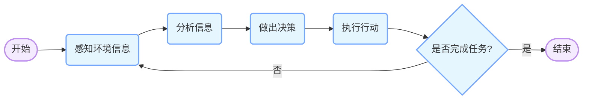

# 企业数字化转型中的AI Agent角色

> 关键词：企业数字化转型、AI Agent、智能决策、自动化流程、人机协作

> 摘要：本文深入探讨了企业数字化转型中AI Agent所扮演的角色。随着企业数字化进程的加速，AI Agent作为一种新兴的智能技术，正逐渐成为推动企业变革的关键力量。文章详细介绍了AI Agent的核心概念、算法原理、数学模型，通过实际案例展示了其在企业中的应用，分析了实际应用场景，推荐了相关的学习资源、开发工具和论文著作，最后总结了AI Agent在企业数字化转型中的未来发展趋势与挑战，并对常见问题进行了解答。

## 1. 背景介绍 
### 1.1 目的和范围
企业数字化转型是当今企业发展的必然趋势，旨在通过数字技术的应用提升企业的竞争力和运营效率。AI Agent作为一种具有自主决策和行动能力的智能实体，在企业数字化转型中具有巨大的应用潜力。本文的目的是全面分析AI Agent在企业数字化转型中的角色和作用，探讨其应用场景、技术原理和实施方法，为企业在数字化转型过程中合理应用AI Agent提供理论支持和实践指导。

### 1.2 预期读者
本文的预期读者包括企业管理人员、IT技术人员、数据科学家、人工智能研究人员以及对企业数字化转型和AI Agent感兴趣的人士。企业管理人员可以从本文中了解AI Agent如何帮助企业实现数字化转型目标，制定合理的战略决策；IT技术人员和数据科学家可以深入学习AI Agent的技术原理和实现方法，为企业开发和部署相关应用；人工智能研究人员可以通过本文了解AI Agent在企业领域的应用现状和研究方向；对企业数字化转型和AI Agent感兴趣的人士可以通过本文初步了解相关知识。

### 1.3 文档结构概述
本文共分为十个部分。第一部分为背景介绍，阐述了文章的目的和范围、预期读者以及文档结构概述，并对相关术语进行了解释。第二部分介绍了AI Agent的核心概念和联系，包括其定义、原理、架构以及与其他相关概念的关系，并通过文本示意图和Mermaid流程图进行了直观展示。第三部分详细讲解了AI Agent的核心算法原理和具体操作步骤，使用Python源代码进行了详细阐述。第四部分介绍了AI Agent的数学模型和公式，并通过举例进行了详细说明。第五部分通过项目实战，展示了AI Agent在企业中的实际应用，包括开发环境搭建、源代码详细实现和代码解读。第六部分分析了AI Agent在企业数字化转型中的实际应用场景。第七部分推荐了相关的学习资源、开发工具和论文著作。第八部分总结了AI Agent在企业数字化转型中的未来发展趋势与挑战。第九部分为附录，解答了常见问题。第十部分提供了扩展阅读和参考资料。

### 1.4 术语表
#### 1.4.1 核心术语定义
- **企业数字化转型**：指企业利用数字技术对业务流程、组织架构、商业模式等进行全面改造和升级，以提高企业的竞争力和运营效率。
- **AI Agent**：即人工智能代理，是一种具有自主决策和行动能力的智能实体，能够感知环境、分析信息、做出决策并执行相应的行动。
- **智能决策**：指利用人工智能技术，对大量数据进行分析和处理，为企业提供科学、合理的决策支持。
- **自动化流程**：指通过计算机程序和系统，自动执行企业的业务流程，减少人工干预，提高工作效率。
- **人机协作**：指人类与AI Agent之间的协同工作，充分发挥人类的智慧和创造力以及AI Agent的高效性和准确性。

#### 1.4.2 相关概念解释
- **机器学习**：是人工智能的一个重要分支，通过让计算机从数据中学习模式和规律，实现对未知数据的预测和分类。
- **深度学习**：是机器学习的一种特殊形式，通过构建深度神经网络，自动提取数据的特征和模式，在图像识别、语音识别等领域取得了显著的成果。
- **自然语言处理**：是人工智能的一个重要领域，研究如何让计算机理解和处理人类语言，包括文本分析、机器翻译、对话系统等。

#### 1.4.3 缩略词列表
- **AI**：Artificial Intelligence，人工智能
- **ML**：Machine Learning，机器学习
- **DL**：Deep Learning，深度学习
- **NLP**：Natural Language Processing，自然语言处理

## 2. 核心概念与联系 
### 2.1 AI Agent的定义
AI Agent是一种能够感知环境、分析信息、做出决策并执行相应行动的智能实体。它可以是软件程序、机器人或其他具有智能的设备。AI Agent具有自主性、反应性、社会性和学习性等特点。自主性指AI Agent能够独立地做出决策和执行行动，不受外界的直接控制；反应性指AI Agent能够根据环境的变化及时做出反应；社会性指AI Agent能够与其他Agent或人类进行交互和协作；学习性指AI Agent能够通过学习不断提高自己的性能和能力。

### 2.2 AI Agent的原理
AI Agent的工作原理主要包括感知、决策和行动三个阶段。在感知阶段，AI Agent通过传感器或其他方式获取环境信息；在决策阶段，AI Agent对感知到的信息进行分析和处理，根据预设的目标和规则做出决策；在行动阶段，AI Agent根据决策结果执行相应的行动，对环境产生影响。

### 2.3 AI Agent的架构
AI Agent的架构通常包括感知模块、决策模块和行动模块。感知模块负责获取环境信息，决策模块负责对信息进行分析和处理，做出决策，行动模块负责执行决策结果。此外，AI Agent还可以包括学习模块，用于不断学习和改进自己的性能和能力。

### 2.4 AI Agent与其他相关概念的关系
AI Agent与机器学习、深度学习、自然语言处理等概念密切相关。机器学习和深度学习是AI Agent实现智能决策的重要技术手段，通过对大量数据的学习和分析，AI Agent可以不断提高自己的决策能力。自然语言处理则为AI Agent与人类之间的交互提供了便利，使AI Agent能够理解和处理人类语言。

### 2.5 文本示意图
以下是AI Agent的基本架构示意图：

```plaintext
+----------------+
|   感知模块     |
+----------------+
       |
       v
+----------------+
|   决策模块     |
+----------------+
       |
       v
+----------------+
|   行动模块     |
+----------------+
```

### 2.6 Mermaid流程图


## 3. 核心算法原理 & 具体操作步骤 
### 3.1 核心算法原理
AI Agent的核心算法主要包括搜索算法、机器学习算法和强化学习算法等。

#### 3.1.1 搜索算法
搜索算法是AI Agent在决策过程中常用的一种算法，用于在状态空间中寻找最优解。常见的搜索算法包括广度优先搜索、深度优先搜索、A*搜索等。

广度优先搜索（BFS）是一种盲目搜索算法，它从起始状态开始，逐层扩展状态空间，直到找到目标状态。BFS的时间复杂度为 $O(b^d)$，其中 $b$ 是分支因子，$d$ 是目标状态的深度。

深度优先搜索（DFS）也是一种盲目搜索算法，它从起始状态开始，沿着一条路径不断深入，直到无法继续扩展，然后回溯到上一个节点，继续探索其他路径。DFS的时间复杂度为 $O(b^m)$，其中 $b$ 是分支因子，$m$ 是搜索树的最大深度。

A*搜索是一种启发式搜索算法，它结合了广度优先搜索和贪心搜索的优点，通过使用启发式函数来估计从当前状态到目标状态的代价，从而引导搜索朝着最优解的方向进行。A*搜索的时间复杂度取决于启发式函数的质量。

#### 3.1.2 机器学习算法
机器学习算法是AI Agent实现智能决策的重要技术手段，通过对大量数据的学习和分析，AI Agent可以不断提高自己的决策能力。常见的机器学习算法包括决策树、支持向量机、神经网络等。

决策树是一种基于树结构进行决策的机器学习算法，它通过对数据的特征进行分析和划分，构建一棵决策树，用于对未知数据进行分类和预测。决策树的优点是简单易懂、计算效率高，缺点是容易过拟合。

支持向量机（SVM）是一种用于分类和回归分析的机器学习算法，它通过寻找一个最优的超平面，将不同类别的数据分开。SVM的优点是泛化能力强、抗干扰能力好，缺点是计算复杂度高。

神经网络是一种模仿人类神经系统的机器学习算法，它由多个神经元组成，通过对数据的学习和训练，调整神经元之间的连接权重，从而实现对未知数据的分类和预测。神经网络的优点是可以处理复杂的非线性问题，缺点是训练时间长、容易过拟合。

#### 3.1.3 强化学习算法
强化学习算法是AI Agent在动态环境中进行决策和学习的重要算法，它通过与环境进行交互，根据环境反馈的奖励信号来调整自己的行为，以最大化长期累积奖励。常见的强化学习算法包括Q-learning、SARSA、深度Q网络（DQN）等。

Q-learning是一种基于值函数的强化学习算法，它通过学习一个Q函数来估计在每个状态下采取每个动作的价值，从而选择最优的动作。Q-learning的优点是简单易懂、收敛速度快，缺点是在处理高维状态空间时效率较低。

SARSA是一种基于策略的强化学习算法，它与Q-learning类似，但在更新Q函数时考虑了下一个状态和动作的选择。SARSA的优点是更加稳定，缺点是收敛速度较慢。

深度Q网络（DQN）是一种将深度学习与Q-learning相结合的强化学习算法，它通过使用深度神经网络来近似Q函数，从而处理高维状态空间。DQN的优点是在处理复杂问题时表现出色，缺点是训练难度大、容易过拟合。

### 3.2 具体操作步骤
以下是一个使用Python实现简单AI Agent的具体操作步骤：

#### 3.2.1 定义环境
首先，我们需要定义一个环境，用于模拟AI Agent的交互场景。在这个例子中，我们使用一个简单的网格世界作为环境。

```python
import numpy as np

class GridWorld:
    def __init__(self, width, height):
        self.width = width
        self.height = height
        self.state = (0, 0)
        self.goal = (width - 1, height - 1)

    def reset(self):
        self.state = (0, 0)
        return self.state

    def step(self, action):
        x, y = self.state
        if action == 0:  # 上
            y = max(y - 1, 0)
        elif action == 1:  # 下
            y = min(y + 1, self.height - 1)
        elif action == 2:  # 左
            x = max(x - 1, 0)
        elif action == 3:  # 右
            x = min(x + 1, self.width - 1)

        self.state = (x, y)
        reward = 1 if self.state == self.goal else 0
        done = self.state == self.goal
        return self.state, reward, done
```

#### 3.2.2 定义AI Agent
接下来，我们定义一个AI Agent，使用Q-learning算法进行学习和决策。

```python
class QLearningAgent:
    def __init__(self, state_size, action_size, learning_rate=0.1, discount_factor=0.9):
        self.state_size = state_size
        self.action_size = action_size
        self.learning_rate = learning_rate
        self.discount_factor = discount_factor
        self.q_table = np.zeros((state_size[0], state_size[1], action_size))

    def act(self, state):
        x, y = state
        q_values = self.q_table[x, y]
        action = np.argmax(q_values)
        return action

    def learn(self, state, action, reward, next_state, done):
        x, y = state
        next_x, next_y = next_state
        q_value = self.q_table[x, y, action]
        next_q_value = np.max(self.q_table[next_x, next_y])
        if done:
            target = reward
        else:
            target = reward + self.discount_factor * next_q_value
        self.q_table[x, y, action] += self.learning_rate * (target - q_value)
```

#### 3.2.3 训练AI Agent
最后，我们使用定义好的环境和AI Agent进行训练。

```python
width = 5
height = 5
env = GridWorld(width, height)
agent = QLearningAgent(state_size=(width, height), action_size=4)

num_episodes = 1000
for episode in range(num_episodes):
    state = env.reset()
    done = False
    while not done:
        action = agent.act(state)
        next_state, reward, done = env.step(action)
        agent.learn(state, action, reward, next_state, done)
        state = next_state

    if episode % 100 == 0:
        print(f"Episode {episode}: Completed")

print("Training completed.")
```

## 4. 数学模型和公式 & 详细讲解 & 举例说明 
### 4.1 搜索算法的数学模型和公式
#### 4.1.1 广度优先搜索（BFS）
广度优先搜索的基本思想是从起始状态开始，逐层扩展状态空间，直到找到目标状态。在BFS中，我们使用一个队列来存储待扩展的状态。

设 $S$ 是状态空间，$s_0$ 是起始状态，$s_g$ 是目标状态，$b$ 是分支因子，$d$ 是目标状态的深度。BFS的时间复杂度为 $O(b^d)$，空间复杂度也为 $O(b^d)$。

#### 4.1.2 深度优先搜索（DFS）
深度优先搜索的基本思想是从起始状态开始，沿着一条路径不断深入，直到无法继续扩展，然后回溯到上一个节点，继续探索其他路径。在DFS中，我们使用一个栈来存储待扩展的状态。

设 $S$ 是状态空间，$s_0$ 是起始状态，$s_g$ 是目标状态，$b$ 是分支因子，$m$ 是搜索树的最大深度。DFS的时间复杂度为 $O(b^m)$，空间复杂度为 $O(bm)$。

#### 4.1.3 A*搜索
A*搜索是一种启发式搜索算法，它结合了广度优先搜索和贪心搜索的优点，通过使用启发式函数来估计从当前状态到目标状态的代价，从而引导搜索朝着最优解的方向进行。

设 $S$ 是状态空间，$s_0$ 是起始状态，$s_g$ 是目标状态，$g(s)$ 是从起始状态 $s_0$ 到当前状态 $s$ 的实际代价，$h(s)$ 是从当前状态 $s$ 到目标状态 $s_g$ 的启发式估计代价，$f(s) = g(s) + h(s)$ 是从起始状态 $s_0$ 经过当前状态 $s$ 到目标状态 $s_g$ 的估计总代价。

A*搜索的基本步骤如下：
1. 初始化一个开放列表和一个关闭列表，将起始状态 $s_0$ 加入开放列表。
2. 当开放列表不为空时，选择 $f(s)$ 值最小的状态 $s$ 从开放列表中移除，并加入关闭列表。
3. 如果 $s$ 是目标状态 $s_g$，则搜索结束，返回路径。
4. 扩展状态 $s$，生成其所有的后继状态 $s'$。
5. 对于每个后继状态 $s'$，如果 $s'$ 已经在关闭列表中，则忽略；如果 $s'$ 不在开放列表中，则将其加入开放列表，并计算 $g(s')$、$h(s')$ 和 $f(s')$；如果 $s'$ 已经在开放列表中，且新的 $g(s')$ 值更小，则更新 $g(s')$、$f(s')$ 和 $s'$ 的父节点。
6. 重复步骤2-5，直到开放列表为空。

### 4.2 机器学习算法的数学模型和公式
#### 4.2.1 决策树
决策树是一种基于树结构进行决策的机器学习算法，它通过对数据的特征进行分析和划分，构建一棵决策树，用于对未知数据进行分类和预测。

设 $D$ 是训练数据集，$X$ 是特征向量，$y$ 是标签。决策树的构建过程可以使用信息增益、信息增益比、基尼指数等指标来选择最优的划分特征。

信息增益的计算公式为：
$$
IG(D, A) = H(D) - H(D|A)
$$
其中，$H(D)$ 是数据集 $D$ 的熵，$H(D|A)$ 是在特征 $A$ 给定的条件下数据集 $D$ 的条件熵。

信息增益比的计算公式为：
$$
IGR(D, A) = \frac{IG(D, A)}{IV(A)}
$$
其中，$IV(A)$ 是特征 $A$ 的固有值。

基尼指数的计算公式为：
$$
Gini(D) = 1 - \sum_{k=1}^{K} p_k^2
$$
其中，$K$ 是类别数，$p_k$ 是第 $k$ 类样本在数据集 $D$ 中所占的比例。

#### 4.2.2 支持向量机（SVM）
支持向量机是一种用于分类和回归分析的机器学习算法，它通过寻找一个最优的超平面，将不同类别的数据分开。

设 $D = \{(x_1, y_1), (x_2, y_2), \cdots, (x_n, y_n)\}$ 是训练数据集，其中 $x_i \in \mathbb{R}^d$ 是特征向量，$y_i \in \{-1, +1\}$ 是标签。SVM的目标是找到一个超平面 $w^T x + b = 0$，使得不同类别的数据点到超平面的间隔最大。

SVM的优化问题可以表示为：
$$
\min_{w, b} \frac{1}{2} \|w\|^2
$$
$$
\text{s.t. } y_i (w^T x_i + b) \geq 1, i = 1, 2, \cdots, n
$$

引入拉格朗日乘子 $\alpha_i \geq 0$，得到拉格朗日函数：
$$
L(w, b, \alpha) = \frac{1}{2} \|w\|^2 - \sum_{i=1}^{n} \alpha_i (y_i (w^T x_i + b) - 1)
$$

对 $w$ 和 $b$ 求偏导数并令其为零，得到：
$$
w = \sum_{i=1}^{n} \alpha_i y_i x_i
$$
$$
\sum_{i=1}^{n} \alpha_i y_i = 0
$$

将上述结果代入拉格朗日函数，得到对偶问题：
$$
\max_{\alpha} \sum_{i=1}^{n} \alpha_i - \frac{1}{2} \sum_{i=1}^{n} \sum_{j=1}^{n} \alpha_i \alpha_j y_i y_j x_i^T x_j
$$
$$
\text{s.t. } \sum_{i=1}^{n} \alpha_i y_i = 0, \alpha_i \geq 0, i = 1, 2, \cdots, n
$$

#### 4.2.3 神经网络
神经网络是一种模仿人类神经系统的机器学习算法，它由多个神经元组成，通过对数据的学习和训练，调整神经元之间的连接权重，从而实现对未知数据的分类和预测。

设 $x$ 是输入向量，$y$ 是输出向量，$W$ 是权重矩阵，$b$ 是偏置向量。神经网络的前向传播过程可以表示为：
$$
z = Wx + b
$$
$$
a = f(z)
$$
其中，$f$ 是激活函数，常用的激活函数包括 sigmoid 函数、ReLU 函数等。

神经网络的训练过程通常使用反向传播算法来调整权重和偏置，以最小化损失函数。常见的损失函数包括均方误差损失函数、交叉熵损失函数等。

### 4.3 强化学习算法的数学模型和公式
#### 4.3.1 Q-learning
Q-learning是一种基于值函数的强化学习算法，它通过学习一个Q函数来估计在每个状态下采取每个动作的价值，从而选择最优的动作。

设 $S$ 是状态空间，$A$ 是动作空间，$R$ 是奖励函数，$\gamma$ 是折扣因子。Q-learning的更新公式为：
$$
Q(s, a) \leftarrow Q(s, a) + \alpha [r + \gamma \max_{a'} Q(s', a') - Q(s, a)]
$$
其中，$s$ 是当前状态，$a$ 是当前动作，$r$ 是即时奖励，$s'$ 是下一个状态，$\alpha$ 是学习率。

#### 4.3.2 SARSA
SARSA是一种基于策略的强化学习算法，它与Q-learning类似，但在更新Q函数时考虑了下一个状态和动作的选择。

SARSA的更新公式为：
$$
Q(s, a) \leftarrow Q(s, a) + \alpha [r + \gamma Q(s', a') - Q(s, a)]
$$
其中，$s$ 是当前状态，$a$ 是当前动作，$r$ 是即时奖励，$s'$ 是下一个状态，$a'$ 是下一个动作，$\alpha$ 是学习率。

#### 4.3.3 深度Q网络（DQN）
深度Q网络是一种将深度学习与Q-learning相结合的强化学习算法，它通过使用深度神经网络来近似Q函数，从而处理高维状态空间。

DQN的目标是最小化损失函数：
$$
L(\theta) = \mathbb{E}[(y_i - Q(s_i, a_i; \theta))^2]
$$
其中，$y_i = r_i + \gamma \max_{a'} Q(s_{i+1}, a'; \theta^-)$，$\theta$ 是当前网络的参数，$\theta^-$ 是目标网络的参数。

### 4.4 举例说明
#### 4.4.1 搜索算法举例
假设有一个简单的迷宫问题，迷宫由一个 $3 \times 3$ 的网格组成，起点是 $(0, 0)$，终点是 $(2, 2)$。我们可以使用广度优先搜索来寻找从起点到终点的最短路径。

```python
from collections import deque

maze = [
    [0, 0, 0],
    [0, 1, 0],
    [0, 0, 0]
]

start = (0, 0)
goal = (2, 2)

directions = [(0, 1), (0, -1), (1, 0), (-1, 0)]

queue = deque([(start, [start])])
visited = set([start])

while queue:
    current, path = queue.popleft()
    if current == goal:
        print("Path found:", path)
        break

    x, y = current
    for dx, dy in directions:
        new_x, new_y = x + dx, y + dy
        if 0 <= new_x < 3 and 0 <= new_y < 3 and maze[new_x][new_y] == 0 and (new_x, new_y) not in visited:
            new_state = (new_x, new_y)
            new_path = path + [new_state]
            queue.append((new_state, new_path))
            visited.add(new_state)
```

#### 4.4.2 机器学习算法举例
假设有一个简单的二分类问题，我们可以使用决策树来进行分类。

```python
from sklearn.datasets import make_classification
from sklearn.model_selection import train_test_split
from sklearn.tree import DecisionTreeClassifier
from sklearn.metrics import accuracy_score

# 生成数据集
X, y = make_classification(n_samples=100, n_features=4, random_state=42)

# 划分训练集和测试集
X_train, X_test, y_train, y_test = train_test_split(X, y, test_size=0.2, random_state=42)

# 创建决策树分类器
clf = DecisionTreeClassifier()

# 训练模型
clf.fit(X_train, y_train)

# 预测
y_pred = clf.predict(X_test)

# 计算准确率
accuracy = accuracy_score(y_test, y_pred)
print("Accuracy:", accuracy)
```

#### 4.4.3 强化学习算法举例
我们可以使用Q-learning算法来解决前面定义的网格世界问题。

```python
import numpy as np

class GridWorld:
    def __init__(self, width, height):
        self.width = width
        self.height = height
        self.state = (0, 0)
        self.goal = (width - 1, height - 1)

    def reset(self):
        self.state = (0, 0)
        return self.state

    def step(self, action):
        x, y = self.state
        if action == 0:  # 上
            y = max(y - 1, 0)
        elif action == 1:  # 下
            y = min(y + 1, self.height - 1)
        elif action == 2:  # 左
            x = max(x - 1, 0)
        elif action == 3:  # 右
            x = min(x + 1, self.width - 1)

        self.state = (x, y)
        reward = 1 if self.state == self.goal else 0
        done = self.state == self.goal
        return self.state, reward, done

class QLearningAgent:
    def __init__(self, state_size, action_size, learning_rate=0.1, discount_factor=0.9):
        self.state_size = state_size
        self.action_size = action_size
        self.learning_rate = learning_rate
        self.discount_factor = discount_factor
        self.q_table = np.zeros((state_size[0], state_size[1], action_size))

    def act(self, state):
        x, y = state
        q_values = self.q_table[x, y]
        action = np.argmax(q_values)
        return action

    def learn(self, state, action, reward, next_state, done):
        x, y = state
        next_x, next_y = next_state
        q_value = self.q_table[x, y, action]
        next_q_value = np.max(self.q_table[next_x, next_y])
        if done:
            target = reward
        else:
            target = reward + self.discount_factor * next_q_value
        self.q_table[x, y, action] += self.learning_rate * (target - q_value)

width = 5
height = 5
env = GridWorld(width, height)
agent = QLearningAgent(state_size=(width, height), action_size=4)

num_episodes = 1000
for episode in range(num_episodes):
    state = env.reset()
    done = False
    while not done:
        action = agent.act(state)
        next_state, reward, done = env.step(action)
        agent.learn(state, action, reward, next_state, done)
        state = next_state

    if episode % 100 == 0:
        print(f"Episode {episode}: Completed")

print("Training completed.")
```

## 5. 项目实战：代码实际案例和详细解释说明 
### 5.1  开发环境搭建
在进行AI Agent项目实战之前，我们需要搭建相应的开发环境。以下是具体的搭建步骤：

#### 5.1.1 安装Python
首先，我们需要安装Python。建议使用Python 3.7及以上版本。可以从Python官方网站（https://www.python.org/downloads/）下载并安装Python。

#### 5.1.2 创建虚拟环境
为了避免不同项目之间的依赖冲突，我们可以使用虚拟环境来管理项目的依赖。可以使用 `venv` 模块来创建虚拟环境。

```bash
python -m venv myenv
```

激活虚拟环境：
- 在Windows上：
```bash
myenv\Scripts\activate
```
- 在Linux或Mac上：
```bash
source myenv/bin/activate
```

#### 5.1.3 安装必要的库
在虚拟环境中，我们需要安装一些必要的库，如 `numpy`、`scikit-learn`、`tensorflow` 等。可以使用 `pip` 来安装这些库。

```bash
pip install numpy scikit-learn tensorflow
```

### 5.2  源代码详细实现和代码解读
以下是一个使用深度学习实现的AI Agent项目实战案例，用于解决手写数字识别问题。

```python
import tensorflow as tf
from tensorflow.keras.datasets import mnist
from tensorflow.keras.models import Sequential
from tensorflow.keras.layers import Dense, Flatten
from tensorflow.keras.utils import to_categorical

# 加载数据集
(train_images, train_labels), (test_images, test_labels) = mnist.load_data()

# 数据预处理
train_images = train_images / 255.0
test_images = test_images / 255.0

train_labels = to_categorical(train_labels)
test_labels = to_categorical(test_labels)

# 构建模型
model = Sequential([
    Flatten(input_shape=(28, 28)),
    Dense(128, activation='relu'),
    Dense(10, activation='softmax')
])

# 编译模型
model.compile(optimizer='adam',
              loss='categorical_crossentropy',
              metrics=['accuracy'])

# 训练模型
model.fit(train_images, train_labels, epochs=5, batch_size=32)

# 评估模型
test_loss, test_acc = model.evaluate(test_images, test_labels)
print(f"Test accuracy: {test_acc}")
```

#### 代码解读：
1. **加载数据集**：使用 `mnist.load_data()` 函数加载MNIST手写数字识别数据集，该数据集包含60000个训练样本和10000个测试样本。
2. **数据预处理**：将图像像素值归一化到0-1之间，将标签进行one-hot编码。
3. **构建模型**：使用 `Sequential` 模型构建一个简单的神经网络，包含一个Flatten层、一个全连接层和一个输出层。
4. **编译模型**：使用 `adam` 优化器和 `categorical_crossentropy` 损失函数编译模型。
5. **训练模型**：使用 `fit` 方法训练模型，设置训练轮数为5，批次大小为32。
6. **评估模型**：使用 `evaluate` 方法评估模型在测试集上的性能。

### 5.3  代码解读与分析
通过上述代码，我们实现了一个简单的手写数字识别AI Agent。在训练过程中，模型通过不断调整权重和偏置，学习到图像特征与标签之间的映射关系。在评估过程中，模型对测试集进行预测，并计算预测准确率。

该模型的优点是简单易懂、训练速度快，缺点是模型复杂度较低，在处理复杂问题时可能表现不佳。可以通过增加模型层数、调整超参数等方式来提高模型的性能。

## 6. 实际应用场景 
### 6.1 智能客服
在企业的客户服务领域，AI Agent可以作为智能客服为客户提供实时、高效的服务。智能客服可以通过自然语言处理技术理解客户的问题，并根据预设的知识库或机器学习模型给出准确的回答。例如，电商企业的智能客服可以帮助客户查询商品信息、处理订单、解决售后问题等；金融企业的智能客服可以为客户提供账户查询、理财产品推荐等服务。智能客服不仅可以提高客户服务的效率和质量，还可以降低企业的人力成本。

### 6.2 供应链管理
在企业的供应链管理中，AI Agent可以实时监控供应链的各个环节，包括采购、生产、物流等。AI Agent可以通过分析大量的数据，预测需求、优化库存管理、提高物流效率。例如，AI Agent可以根据历史销售数据和市场趋势预测产品的需求量，帮助企业合理安排生产计划；可以实时监控物流运输情况，及时调整运输路线和配送方案，确保货物按时到达。

### 6.3 智能营销
在企业的营销领域，AI Agent可以通过分析客户的行为数据和偏好，实现个性化的营销推荐。AI Agent可以根据客户的浏览历史、购买记录等信息，为客户推荐符合其兴趣的产品或服务。例如，电商平台的AI Agent可以为用户推荐可能感兴趣的商品；社交媒体平台的AI Agent可以为用户推送个性化的广告。智能营销可以提高营销效果，增加客户的转化率和忠诚度。

### 6.4 风险评估与管理
在金融、保险等行业，AI Agent可以用于风险评估与管理。AI Agent可以通过分析大量的金融数据和市场信息，评估客户的信用风险、投资风险等。例如，银行的AI Agent可以根据客户的信用记录、收入情况等信息，评估客户的贷款风险；保险公司的AI Agent可以根据客户的健康状况、职业等信息，评估客户的保险风险。AI Agent还可以实时监控市场变化，及时预警潜在的风险，帮助企业采取相应的措施进行风险控制。

### 6.5 生产自动化
在制造业企业中，AI Agent可以实现生产过程的自动化和智能化。AI Agent可以控制生产设备，实现自动化生产；可以实时监控生产过程中的各项参数，及时发现和解决生产故障；可以根据生产需求和资源状况，优化生产计划和调度。例如，汽车制造企业的AI Agent可以控制机器人进行汽车组装；电子制造企业的AI Agent可以实时监控生产线的运行状态，提高生产效率和产品质量。

## 7. 工具和资源推荐
### 7.1 学习资源推荐
#### 7.1.1 书籍推荐
- 《人工智能：一种现代的方法》（Artificial Intelligence: A Modern Approach）：这本书是人工智能领域的经典教材，全面介绍了人工智能的基本概念、算法和应用。
- 《深度学习》（Deep Learning）：由Ian Goodfellow、Yoshua Bengio和Aaron Courville三位深度学习领域的权威专家撰写，详细介绍了深度学习的原理、算法和应用。
- 《Python机器学习》（Python Machine Learning）：这本书以Python为工具，介绍了机器学习的基本概念、算法和实践案例。

#### 7.1.2 在线课程
- Coursera上的“机器学习”课程：由斯坦福大学教授Andrew Ng讲授，是机器学习领域最受欢迎的在线课程之一。
- edX上的“深度学习”课程：由麻省理工学院教授Lex Fridman讲授，深入介绍了深度学习的原理和应用。
- 阿里云天池平台上的“人工智能实战营”：提供了丰富的人工智能实践项目和课程，适合初学者和有一定基础的学习者。

#### 7.1.3 技术博客和网站
- Medium：一个知名的技术博客平台，有很多人工智能领域的专家和爱好者分享他们的经验和见解。
- Towards Data Science：专注于数据科学和人工智能领域的技术博客，提供了大量的优质文章和教程。
- arXiv：一个预印本平台，提供了最新的人工智能研究论文和成果。

### 7.2 开发工具框架推荐
#### 7.2.1 IDE和编辑器
- PyCharm：一款专业的Python集成开发环境，提供了丰富的功能和插件，适合开发大型的Python项目。
- Jupyter Notebook：一个交互式的开发环境，适合进行数据探索、模型训练和可视化等工作。
- Visual Studio Code：一款轻量级的代码编辑器，支持多种编程语言和插件，适合快速开发和调试。

#### 7.2.2 调试和性能分析工具
- TensorBoard：TensorFlow提供的可视化工具，可以帮助用户监控模型的训练过程、分析模型的性能。
- PyTorch Profiler：PyTorch提供的性能分析工具，可以帮助用户找出模型中的性能瓶颈，优化模型的性能。
- cProfile：Python内置的性能分析工具，可以帮助用户分析Python代码的性能。

#### 7.2.3 相关框架和库
- TensorFlow：一个开源的深度学习框架，由Google开发，提供了丰富的工具和接口，适合开发各种深度学习模型。
- PyTorch：一个开源的深度学习框架，由Facebook开发，具有动态图机制，适合快速开发和实验。
- Scikit-learn：一个开源的机器学习库，提供了丰富的机器学习算法和工具，适合进行数据挖掘和数据分析。

### 7.3 相关论文著作推荐
#### 7.3.1 经典论文
- “A Logical Calculus of the Ideas Immanent in Nervous Activity”：由Warren McCulloch和Walter Pitts于1943年发表，提出了人工神经网络的概念。
- “Perceptrons: An Introduction to Computational Geometry”：由Frank Rosenblatt于1962年发表，介绍了感知机算法。
- “Learning Representations by Back-propagating Errors”：由David Rumelhart、Geoffrey Hinton和Ronald Williams于1986年发表，提出了反向传播算法。

#### 7.3.2 最新研究成果
- “Attention Is All You Need”：由Ashish Vaswani等人于2017年发表，提出了Transformer模型，在自然语言处理领域取得了显著的成果。
- “Generative Adversarial Networks”：由Ian Goodfellow等人于2014年发表，提出了生成对抗网络（GAN），在图像生成、数据增强等领域有广泛的应用。
- “Reinforcement Learning: An Introduction”：由Richard Sutton和Andrew Barto于2018年出版，是强化学习领域的经典著作。

#### 7.3.3 应用案例分析
- 《AI Superpowers: China, Silicon Valley, and the New World Order》：由李开复撰写，分析了人工智能在各个领域的应用案例和发展趋势。
- 《The Age of AI: And Our Human Future》：由Henry Kissinger、Eric Schmidt和Daniel Huttenlocher共同撰写，探讨了人工智能对人类社会的影响和挑战。

## 8. 总结：未来发展趋势与挑战
### 8.1 未来发展趋势
#### 8.1.1 更强大的智能决策能力
随着机器学习、深度学习等技术的不断发展，AI Agent的智能决策能力将不断提高。AI Agent可以处理更复杂的问题，做出更准确、更合理的决策。例如，在金融领域，AI Agent可以根据市场变化和客户需求，实时调整投资策略；在医疗领域，AI Agent可以根据患者的病情和基因数据，提供个性化的治疗方案。

#### 8.1.2 更广泛的人机协作
未来，AI Agent将与人类进行更广泛、更深入的协作。AI Agent可以作为人类的助手，帮助人类完成繁琐、重复的工作，提高工作效率；也可以与人类共同完成复杂的任务，发挥各自的优势。例如，在设计领域，AI Agent可以为设计师提供创意灵感和设计方案，设计师可以根据自己的经验和审美进行修改和完善；在科研领域，AI Agent可以帮助科学家进行数据处理和分析，科学家可以根据分析结果进行深入研究。

#### 8.1.3 多模态交互能力
未来的AI Agent将具备多模态交互能力，能够通过语音、图像、手势等多种方式与人类进行交互。例如，用户可以通过语音指令让AI Agent完成任务，也可以通过手势控制AI Agent的操作；AI Agent可以通过图像识别技术理解用户的表情和动作，提供更个性化的服务。

#### 8.1.4 自主学习和进化能力
未来的AI Agent将具备自主学习和进化能力，能够不断从环境中学习新的知识和技能，适应不断变化的环境。例如，AI Agent可以通过自我监督学习和强化学习，不断提高自己的性能和能力；可以根据新的数据和任务，自动调整自己的模型和算法。

### 8.2 挑战
#### 8.2.1 数据隐私和安全问题
AI Agent的训练和运行需要大量的数据，这些数据可能包含用户的个人隐私信息。因此，如何保护数据的隐私和安全是一个重要的挑战。企业需要采取有效的措施，如数据加密、访问控制等，确保数据不被泄露和滥用。

#### 8.2.2 算法可解释性问题
许多AI Agent使用的算法，如深度学习算法，是黑盒模型，难以解释其决策过程和结果。这在一些关键领域，如医疗、金融等，可能会导致信任问题。因此，如何提高算法的可解释性是一个亟待解决的问题。

#### 8.2.3 伦理和法律问题
AI Agent的广泛应用可能会带来一些伦理和法律问题，如责任归属、道德决策等。例如，当AI Agent做出错误的决策导致损失时，责任应该由谁承担；AI Agent在面对道德困境时，应该如何做出决策。这些问题需要政府、企业和社会共同探讨和解决。

#### 8.2.4 人才短缺问题
AI Agent的开发和应用需要具备人工智能、机器学习、深度学习等多方面知识和技能的专业人才。目前，这类人才相对短缺，制约了AI Agent的发展。企业需要加强人才培养和引进，提高自身的技术实力。

## 9. 附录：常见问题与解答
### 9.1 什么是AI Agent？
AI Agent是一种具有自主决策和行动能力的智能实体，能够感知环境、分析信息、做出决策并执行相应的行动。它可以是软件程序、机器人或其他具有智能的设备。

### 9.2 AI Agent与传统软件有什么区别？
传统软件通常是按照预设的规则和流程执行任务，缺乏自主决策和学习能力。而AI Agent具有自主性、反应性、社会性和学习性等特点，能够根据环境的变化自动调整自己的行为，不断提高自己的性能和能力。

### 9.3 AI Agent在企业数字化转型中有哪些作用？
AI Agent在企业数字化转型中可以发挥多种作用，如智能客服、供应链管理、智能营销、风险评估与管理、生产自动化等。它可以提高企业的运营效率、降低成本、提升客户体验、增强企业的竞争力。

### 9.4 如何开发一个AI Agent？
开发一个AI Agent通常需要以下步骤：
1. 定义问题和目标：明确AI Agent需要解决的问题和达到的目标。
2. 收集和准备数据：收集相关的数据，并进行预处理和清洗。
3. 选择合适的算法和模型：根据问题的特点和数据的类型，选择合适的算法和模型。
4. 训练和优化模型：使用收集到的数据对模型进行训练，并进行优化和调整。
5. 部署和测试：将训练好的模型部署到实际环境中，并进行测试和评估。
6. 监控和维护：对AI Agent的运行情况进行监控和维护，及时发现和解决问题。

### 9.5 AI Agent的发展前景如何？
AI Agent的发展前景非常广阔。随着人工智能技术的不断发展和应用，AI Agent将在各个领域得到更广泛的应用，为企业和社会带来巨大的价值。同时，AI Agent也将面临一些挑战，如数据隐私和安全问题、算法可解释性问题、伦理和法律问题等，需要政府、企业和社会共同努力解决。

## 10. 扩展阅读 & 参考资料
### 10.1 扩展阅读
- 《人工智能时代与人类未来》：探讨了人工智能对人类社会的影响和未来发展趋势。
- 《智能时代：大数据与智能革命重新定义未来》：介绍了大数据和人工智能在各个领域的应用和发展。