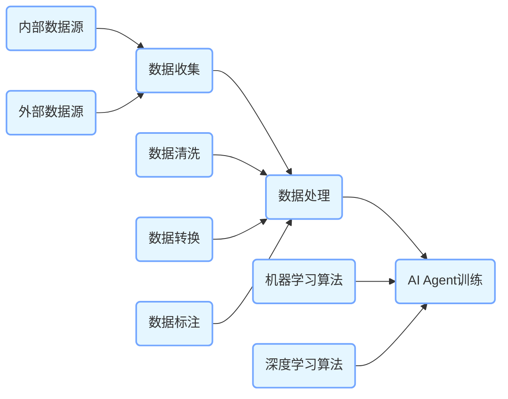

# 企业数据管理：AI Agent训练数据的收集与处理

> 关键词：企业数据管理、AI Agent、训练数据收集、训练数据处理、数据质量

> 摘要：本文聚焦于企业数据管理中AI Agent训练数据的收集与处理这一核心主题。详细阐述了数据收集与处理在AI Agent训练中的重要性，深入探讨了相关核心概念、算法原理、数学模型。通过项目实战案例展示了具体的操作步骤和代码实现，并分析了实际应用场景。同时提供了丰富的学习资源、开发工具框架以及相关论文著作推荐。最后对未来发展趋势与挑战进行了总结，还给出了常见问题解答和扩展阅读参考资料，旨在为企业在AI Agent训练数据管理方面提供全面且深入的指导。

## 1. 背景介绍 
### 1.1 目的和范围
随着人工智能技术的飞速发展，AI Agent在企业的各个领域得到了广泛应用，如客户服务、供应链管理、金融风险评估等。而高质量的训练数据是AI Agent能够准确、高效执行任务的基础。本文章的目的在于为企业提供全面的指导，帮助企业了解如何有效地收集和处理AI Agent训练所需的数据。范围涵盖了从数据收集的方法、渠道，到数据处理的流程、技术，以及在实际项目中的应用和相关资源的推荐。

### 1.2 预期读者
本文主要面向企业的数据管理人员、AI开发工程师、数据科学家以及对AI Agent训练数据管理感兴趣的专业人士。这些读者可能在企业中负责数据的规划、收集、处理和分析工作，或者参与AI Agent的开发和训练项目，希望通过本文获取相关的知识和经验，提升企业在数据管理和AI应用方面的能力。

### 1.3 文档结构概述
本文将按照以下结构展开：首先介绍相关的核心概念和它们之间的联系，通过文本示意图和Mermaid流程图进行直观展示；接着讲解核心算法原理和具体操作步骤，并使用Python源代码详细阐述；然后介绍数学模型和公式，并通过举例进行说明；再通过项目实战展示代码实际案例和详细解释；之后分析实际应用场景；接着推荐相关的工具和资源；最后对未来发展趋势与挑战进行总结，同时提供常见问题解答和扩展阅读参考资料。

### 1.4 术语表
#### 1.4.1 核心术语定义
- **AI Agent（人工智能代理）**：是一种能够感知环境、自主决策并采取行动以实现特定目标的软件实体。它可以通过学习和适应不断提高自己的性能。
- **训练数据**：用于训练AI Agent的数据集合，包含输入数据和对应的期望输出数据，AI Agent通过对训练数据的学习来调整自身的参数和模型。
- **数据收集**：从各种数据源获取原始数据的过程，这些数据源可以是企业内部的数据库、文件系统，也可以是外部的公开数据集、传感器等。
- **数据处理**：对收集到的原始数据进行清洗、转换、标注等操作，以提高数据的质量和可用性，使其适合用于AI Agent的训练。

#### 1.4.2 相关概念解释
- **数据质量**：指数据的准确性、完整性、一致性、时效性等特征。高质量的数据对于AI Agent的训练至关重要，直接影响到训练结果的准确性和可靠性。
- **数据标注**：为数据添加标签或注释的过程，例如在图像数据中标注物体的类别，在文本数据中标注情感倾向等。标注后的数据可以用于监督学习，帮助AI Agent学习输入和输出之间的映射关系。
- **数据清洗**：去除数据中的噪声、缺失值、重复值等异常数据的过程，以提高数据的质量和纯度。

#### 1.4.3 缩略词列表
- **AI（Artificial Intelligence）**：人工智能
- **ML（Machine Learning）**：机器学习
- **DL（Deep Learning）**：深度学习
- **ETL（Extract, Transform, Load）**：数据抽取、转换和加载

## 2. 核心概念与联系 

### 核心概念原理
在企业数据管理中，AI Agent训练数据的收集与处理涉及到多个核心概念，它们相互关联，共同构成了一个完整的流程。

数据收集是整个流程的起点，其原理是从各种数据源中获取与AI Agent训练目标相关的数据。数据源的多样性决定了数据的丰富性和全面性，不同的数据源可能提供不同类型和格式的数据，例如结构化数据（如数据库中的表格数据）、半结构化数据（如XML、JSON文件）和非结构化数据（如文本、图像、音频）。

数据处理则是对收集到的原始数据进行加工和转换，使其适合用于AI Agent的训练。这包括数据清洗、数据转换、数据标注等步骤。数据清洗的原理是识别和去除数据中的噪声和异常值，以提高数据的质量；数据转换的原理是将数据转换为统一的格式和特征表示，以便于AI Agent进行处理；数据标注的原理是为数据添加标签或注释，为监督学习提供必要的信息。

AI Agent训练则是利用处理后的数据对AI模型进行训练，通过不断调整模型的参数，使其能够准确地对输入数据进行预测和决策。训练过程通常基于机器学习或深度学习算法，如神经网络、决策树等。

### 架构的文本示意图
```plaintext
+-------------------+
|   数据收集        |
|                   |
| - 内部数据源       |
| - 外部数据源       |
+-------------------+
          |
          v
+-------------------+
|   数据处理        |
|                   |
| - 数据清洗        |
| - 数据转换        |
| - 数据标注        |
+-------------------+
          |
          v
+-------------------+
|   AI Agent训练    |
|                   |
| - 机器学习算法    |
| - 深度学习算法    |
+-------------------+
```

### Mermaid流程图


## 3. 核心算法原理 & 具体操作步骤 

### 数据收集算法原理及步骤
#### 原理
数据收集的核心是根据AI Agent的训练目标，从合适的数据源中提取相关的数据。可以使用数据抽取算法，如基于SQL查询的数据抽取，从数据库中获取结构化数据；使用网络爬虫算法，从网页中抓取非结构化数据。

#### 具体操作步骤
1. **确定数据源**：根据AI Agent的训练需求，确定需要收集数据的来源，如企业内部的数据库、外部的公开数据集网站、社交媒体平台等。
2. **选择数据抽取方法**：
    - 对于结构化数据，可以使用SQL查询语句从数据库中提取数据。例如，以下Python代码使用`pandas`库从SQLite数据库中读取数据：
```python
import pandas as pd
import sqlite3

# 连接到SQLite数据库
conn = sqlite3.connect('example.db')

# 执行SQL查询
query = "SELECT * FROM table_name"
data = pd.read_sql(query, conn)

# 关闭数据库连接
conn.close()

print(data.head())
```
    - 对于非结构化数据，可以使用网络爬虫工具，如`Scrapy`库。以下是一个简单的`Scrapy`爬虫示例：
```python
import scrapy

class MySpider(scrapy.Spider):
    name = "myspider"
    start_urls = ['http://example.com']

    def parse(self, response):
        # 提取网页中的文本数据
        text = response.css('p::text').getall()
        yield {'text': text}
```
3. **数据存储**：将收集到的数据存储到合适的存储介质中，如数据库、文件系统等。

### 数据处理算法原理及步骤
#### 原理
数据处理的核心是对收集到的原始数据进行清洗、转换和标注。数据清洗可以使用统计方法和规则匹配方法，识别和去除异常值和缺失值；数据转换可以使用特征工程方法，将数据转换为统一的格式和特征表示；数据标注可以使用人工标注或自动标注方法，为数据添加标签。

#### 具体操作步骤
1. **数据清洗**：
    - **缺失值处理**：可以使用均值、中位数或众数填充缺失值，也可以删除包含缺失值的记录。以下Python代码使用`pandas`库处理缺失值：
```python
import pandas as pd
import numpy as np

# 创建包含缺失值的DataFrame
data = pd.DataFrame({'A': [1, 2, np.nan, 4], 'B': [5, np.nan, 7, 8]})

# 使用均值填充缺失值
data_filled = data.fillna(data.mean())

print(data_filled)
```
    - **异常值处理**：可以使用Z-score方法或四分位距方法识别和去除异常值。以下Python代码使用Z-score方法处理异常值：
```python
import pandas as pd
from scipy import stats

# 创建包含异常值的DataFrame
data = pd.DataFrame({'A': [1, 2, 3, 100]})

# 计算Z-score
z_scores = np.abs(stats.zscore(data))

# 去除Z-score大于3的异常值
data_cleaned = data[(z_scores < 3).all(axis=1)]

print(data_cleaned)
```
2. **数据转换**：
    - **特征编码**：对于分类特征，可以使用独热编码（One-Hot Encoding）将其转换为数值特征。以下Python代码使用`sklearn`库进行独热编码：
```python
import pandas as pd
from sklearn.preprocessing import OneHotEncoder

# 创建包含分类特征的DataFrame
data = pd.DataFrame({'color': ['red', 'blue', 'green']})

# 创建OneHotEncoder对象
encoder = OneHotEncoder()

# 进行独热编码
encoded_data = encoder.fit_transform(data[['color']]).toarray()

print(encoded_data)
```
    - **特征缩放**：对于数值特征，可以使用标准化（Standardization）或归一化（Normalization）方法将其缩放到相同的尺度。以下Python代码使用`sklearn`库进行标准化：
```python
import pandas as pd
from sklearn.preprocessing import StandardScaler

# 创建包含数值特征的DataFrame
data = pd.DataFrame({'A': [1, 2, 3, 4]})

# 创建StandardScaler对象
scaler = StandardScaler()

# 进行标准化
scaled_data = scaler.fit_transform(data)

print(scaled_data)
```
3. **数据标注**：
    - **人工标注**：由专业人员手动为数据添加标签，适用于对标注质量要求较高的场景。
    - **自动标注**：使用机器学习或深度学习模型为数据添加标签，适用于大规模数据的标注。例如，可以使用预训练的自然语言处理模型为文本数据进行情感分析标注。

## 4. 数学模型和公式 & 详细讲解 & 举例说明 

### 数据清洗中的数学模型和公式
#### Z-score方法
Z-score是一种常用的用于识别异常值的统计方法，其计算公式为：
$$Z = \frac{X - \mu}{\sigma}$$
其中，$X$ 是数据点的值，$\mu$ 是数据的均值，$\sigma$ 是数据的标准差。Z-score表示数据点偏离均值的标准差倍数。通常，当Z-score的绝对值大于3时，认为该数据点是异常值。

**举例说明**：假设有一组数据 $[1, 2, 3, 4, 100]$，首先计算均值 $\mu$ 和标准差 $\sigma$：
```python
import numpy as np

data = np.array([1, 2, 3, 4, 100])
mu = np.mean(data)
sigma = np.std(data)

print(f"均值: {mu}, 标准差: {sigma}")
```
然后计算每个数据点的Z-score：
```python
z_scores = np.abs((data - mu) / sigma)
print(z_scores)
```
可以看到，数据点100的Z-score远大于3，因此可以将其视为异常值。

#### 四分位距方法
四分位距（Interquartile Range，IQR）是一种用于识别异常值的非参数方法，其计算公式为：
$$IQR = Q_3 - Q_1$$
其中，$Q_1$ 是数据的第一四分位数（25%分位数），$Q_3$ 是数据的第三四分位数（75%分位数）。异常值通常定义为小于 $Q_1 - 1.5 \times IQR$ 或大于 $Q_3 + 1.5 \times IQR$ 的数据点。

**举例说明**：假设有一组数据 $[1, 2, 3, 4, 5, 6, 7, 8, 9, 100]$，首先计算第一四分位数 $Q_1$、第三四分位数 $Q_3$ 和四分位距 $IQR$：
```python
import numpy as np

data = np.array([1, 2, 3, 4, 5, 6, 7, 8, 9, 100])
q1 = np.percentile(data, 25)
q3 = np.percentile(data, 75)
iqr = q3 - q1

print(f"第一四分位数: {q1}, 第三四分位数: {q3}, 四分位距: {iqr}")
```
然后确定异常值的范围：
```python
lower_bound = q1 - 1.5 * iqr
upper_bound = q3 + 1.5 * iqr

outliers = data[(data < lower_bound) | (data > upper_bound)]
print(outliers)
```
可以看到，数据点100被识别为异常值。

### 数据转换中的数学模型和公式
#### 标准化
标准化（Standardization）是将数据转换为均值为0，标准差为1的标准正态分布的过程，其计算公式为：
$$X_{std} = \frac{X - \mu}{\sigma}$$
其中，$X$ 是原始数据点的值，$\mu$ 是数据的均值，$\sigma$ 是数据的标准差，$X_{std}$ 是标准化后的数据点的值。

**举例说明**：假设有一组数据 $[1, 2, 3, 4]$，首先计算均值 $\mu$ 和标准差 $\sigma$：
```python
import numpy as np

data = np.array([1, 2, 3, 4])
mu = np.mean(data)
sigma = np.std(data)

print(f"均值: {mu}, 标准差: {sigma}")
```
然后进行标准化：
```python
data_std = (data - mu) / sigma
print(data_std)
```
可以看到，标准化后的数据均值接近0，标准差接近1。

#### 归一化
归一化（Normalization）是将数据缩放到 [0, 1] 区间的过程，其计算公式为：
$$X_{norm} = \frac{X - X_{min}}{X_{max} - X_{min}}$$
其中，$X$ 是原始数据点的值，$X_{min}$ 是数据的最小值，$X_{max}$ 是数据的最大值，$X_{norm}$ 是归一化后的数据点的值。

**举例说明**：假设有一组数据 $[1, 2, 3, 4]$，首先计算最小值 $X_{min}$ 和最大值 $X_{max}$：
```python
import numpy as np

data = np.array([1, 2, 3, 4])
x_min = np.min(data)
x_max = np.max(data)

print(f"最小值: {x_min}, 最大值: {x_max}")
```
然后进行归一化：
```python
data_norm = (data - x_min) / (x_max - x_min)
print(data_norm)
```
可以看到，归一化后的数据范围在 [0, 1] 之间。

## 5. 项目实战：代码实际案例和详细解释说明 

### 5.1  开发环境搭建
#### 操作系统
可以选择Windows、Linux或macOS操作系统，本案例以Windows 10为例。

#### Python环境
安装Python 3.7或以上版本，可以从Python官方网站（https://www.python.org/downloads/）下载安装包进行安装。

#### 安装必要的库
使用`pip`命令安装以下必要的库：
```bash
pip install pandas numpy scikit-learn scrapy
```

### 5.2  源代码详细实现和代码解读
#### 数据收集
以下是一个使用`Scrapy`库从网页上收集文本数据的示例：
```python
import scrapy

class MySpider(scrapy.Spider):
    name = "myspider"
    start_urls = ['http://quotes.toscrape.com']

    def parse(self, response):
        # 提取网页中的名言和作者信息
        for quote in response.css('div.quote'):
            text = quote.css('span.text::text').get()
            author = quote.css('small.author::text').get()
            yield {'text': text, 'author': author}

        # 跟进下一页链接
        next_page = response.css('li.next a::attr(href)').get()
        if next_page is not None:
            yield response.follow(next_page, self.parse)
```
**代码解读**：
- `MySpider`类继承自`scrapy.Spider`，定义了一个爬虫。
- `start_urls`指定了爬虫开始的URL。
- `parse`方法是爬虫的核心方法，用于解析网页内容。在这个方法中，使用CSS选择器提取名言和作者信息，并使用`yield`语句返回数据。
- `response.follow`方法用于跟进下一页链接，实现分页爬取。

#### 数据处理
以下是一个对收集到的数据进行清洗和转换的示例：
```python
import pandas as pd
from sklearn.preprocessing import OneHotEncoder

# 模拟收集到的数据
data = pd.DataFrame({
    'text': ['This is a quote.', 'Another quote.'],
    'author': ['Author 1', 'Author 2']
})

# 数据清洗：去除缺失值
data = data.dropna()

# 数据转换：对作者进行独热编码
encoder = OneHotEncoder()
encoded_author = encoder.fit_transform(data[['author']]).toarray()

# 将编码后的作者信息添加到原始数据中
encoded_data = pd.concat([data['text'], pd.DataFrame(encoded_author)], axis=1)

print(encoded_data)
```
**代码解读**：
- 首先，使用`pandas`库创建一个模拟的数据集。
- 然后，使用`dropna`方法去除包含缺失值的记录。
- 接着，使用`OneHotEncoder`对作者信息进行独热编码。
- 最后，将编码后的作者信息与原始的文本信息合并到一个新的DataFrame中。

### 5.3  代码解读与分析
#### 数据收集代码分析
- `Scrapy`库是一个强大的Python爬虫框架，它提供了丰富的功能，如异步请求、自动分页、数据存储等。
- 在`parse`方法中，使用CSS选择器可以方便地提取网页中的数据。CSS选择器是一种用于定位HTML元素的语法，通过指定元素的标签名、类名、属性等信息来选择元素。
- `response.follow`方法可以自动处理URL的拼接和请求，使得分页爬取变得简单。

#### 数据处理代码分析
- `pandas`库是Python中用于数据处理和分析的常用库，它提供了DataFrame和Series等数据结构，方便对数据进行操作。
- `OneHotEncoder`是`scikit-learn`库中的一个类，用于对分类特征进行独热编码。独热编码可以将分类特征转换为数值特征，使得机器学习模型能够处理这些数据。
- `pd.concat`方法用于将多个DataFrame或Series按行或列进行合并。

## 6. 实际应用场景 
### 客户服务
在客户服务领域，企业可以使用AI Agent来自动回答客户的问题。为了训练这样的AI Agent，需要收集大量的客户问题和对应的答案作为训练数据。可以从企业的客服聊天记录、常见问题解答（FAQ）页面等数据源中收集数据。通过对这些数据进行处理和标注，训练出能够准确回答客户问题的AI Agent，提高客户服务的效率和质量。

### 供应链管理
在供应链管理中，AI Agent可以用于预测需求、优化库存管理等。为了训练这样的AI Agent，需要收集与供应链相关的数据，如历史销售数据、库存数据、供应商信息等。通过对这些数据进行清洗和转换，提取有用的特征，训练出能够准确预测需求和优化库存的AI Agent，降低企业的运营成本。

### 金融风险评估
在金融领域，AI Agent可以用于评估客户的信用风险、预测市场趋势等。为了训练这样的AI Agent，需要收集客户的个人信息、财务数据、交易记录等数据，以及市场的宏观经济数据、行业数据等。通过对这些数据进行处理和分析，构建合适的数学模型，训练出能够准确评估风险和预测趋势的AI Agent，帮助企业做出更明智的决策。

## 7. 工具和资源推荐
### 7.1 学习资源推荐
#### 7.1.1 书籍推荐
- 《Python数据分析实战》：介绍了使用Python进行数据分析的基本方法和技巧，包括数据收集、清洗、转换、分析和可视化等方面的内容。
- 《机器学习实战》：通过实际案例介绍了机器学习的基本算法和应用，帮助读者理解和掌握机器学习的原理和方法。
- 《深度学习》：由深度学习领域的三位顶尖专家撰写，全面介绍了深度学习的理论和实践，是深度学习领域的经典著作。

#### 7.1.2 在线课程
- Coursera上的“机器学习”课程：由斯坦福大学教授Andrew Ng讲授，是机器学习领域的经典课程，涵盖了机器学习的基本概念、算法和应用。
- edX上的“深度学习”课程：由麻省理工学院（MIT）教授Geoffrey Hinton等人讲授，深入介绍了深度学习的理论和实践。
- 中国大学MOOC上的“Python数据分析与应用”课程：由国内高校教师讲授，结合实际案例介绍了Python在数据分析中的应用。

#### 7.1.3 技术博客和网站
- Medium：一个技术博客平台，上面有很多关于人工智能、数据科学等领域的优质文章。
- Towards Data Science：专门发布数据科学和机器学习相关的文章，涵盖了从基础概念到前沿技术的各个方面。
- Kaggle：一个数据科学竞赛平台，上面有很多数据集和开源代码，可以学习到其他数据科学家的优秀实践经验。

### 7.2 开发工具框架推荐
#### 7.2.1 IDE和编辑器
- PyCharm：一款功能强大的Python集成开发环境（IDE），提供了代码编辑、调试、版本控制等功能，适合专业的Python开发人员使用。
- Jupyter Notebook：一个交互式的开发环境，支持Python、R等多种编程语言，适合数据科学家进行数据分析和模型开发。
- Visual Studio Code：一款轻量级的代码编辑器，支持多种编程语言和插件扩展，具有良好的代码编辑和调试功能。

#### 7.2.2 调试和性能分析工具
- pdb：Python自带的调试器，可以帮助开发人员定位和解决代码中的问题。
- cProfile：Python标准库中的性能分析工具，可以分析代码的运行时间和函数调用情况，帮助开发人员优化代码性能。
- TensorBoard：TensorFlow提供的可视化工具，可以用于可视化深度学习模型的训练过程和性能指标。

#### 7.2.3 相关框架和库
- pandas：用于数据处理和分析的Python库，提供了DataFrame和Series等数据结构，方便对数据进行操作。
- numpy：用于科学计算的Python库，提供了高效的数组和矩阵运算功能。
- scikit-learn：用于机器学习的Python库，提供了丰富的机器学习算法和工具，如分类、回归、聚类等。
- TensorFlow：由Google开发的深度学习框架，提供了丰富的深度学习模型和工具，如神经网络、卷积神经网络等。
- PyTorch：由Facebook开发的深度学习框架，具有动态图机制，适合快速开发和实验深度学习模型。

### 7.3 相关论文著作推荐
#### 7.3.1 经典论文
- “Gradient-based learning applied to document recognition”：由Yann LeCun等人撰写，介绍了卷积神经网络（CNN）在手写数字识别中的应用，是深度学习领域的经典论文之一。
- “Attention Is All You Need”：由Google Brain团队撰写，提出了Transformer模型，是自然语言处理领域的重要突破。
- “Deep Residual Learning for Image Recognition”：由Kaiming He等人撰写，提出了残差网络（ResNet），解决了深度学习中的梯度消失问题，提高了模型的训练效率和性能。

#### 7.3.2 最新研究成果
- 可以关注NeurIPS、ICML、CVPR等顶级学术会议的论文，了解人工智能领域的最新研究成果。
- arXiv.org是一个预印本平台，上面有很多最新的学术论文，可以及时了解研究动态。

#### 7.3.3 应用案例分析
- 《AI Superpowers: China, Silicon Valley, and the New World Order》：由李开复撰写，介绍了人工智能在各个领域的应用案例和发展趋势。
- 《Artificial Intelligence: A Modern Approach》：由Stuart Russell和Peter Norvig撰写，是人工智能领域的经典教材，包含了很多实际应用案例。

## 8. 总结：未来发展趋势与挑战
### 未来发展趋势
#### 数据收集的自动化和智能化
随着技术的发展，数据收集将越来越自动化和智能化。例如，使用物联网设备自动收集传感器数据，使用智能爬虫自动抓取互联网上的相关数据。同时，数据收集系统将能够根据AI Agent的训练需求，自动选择合适的数据源和收集方法。

#### 数据处理的深度学习化
深度学习技术将在数据处理中得到更广泛的应用。例如，使用深度学习模型进行数据清洗、数据标注和数据转换。深度学习模型能够自动学习数据的特征和模式，提高数据处理的效率和质量。

#### AI Agent与人类的协同工作
未来的AI Agent将不仅仅是独立的软件实体，而是能够与人类进行协同工作。例如，在客户服务领域，AI Agent可以辅助客服人员回答问题，提高服务效率；在供应链管理领域，AI Agent可以与管理人员共同制定决策，优化供应链流程。

### 挑战
#### 数据隐私和安全问题
随着数据收集和处理的规模不断扩大，数据隐私和安全问题变得越来越重要。企业需要采取有效的措施保护用户的个人信息和敏感数据，防止数据泄露和滥用。

#### 数据质量和一致性问题
数据质量和一致性是影响AI Agent训练效果的关键因素。由于数据源的多样性和数据格式的不一致性，数据质量和一致性问题难以保证。企业需要建立完善的数据质量管理体系，确保数据的准确性、完整性和一致性。

#### 技术人才短缺问题
人工智能领域的发展需要大量的专业技术人才，包括数据科学家、机器学习工程师、AI开发工程师等。目前，市场上这类人才短缺，企业面临着招聘和培养技术人才的挑战。

## 9. 附录：常见问题与解答
### 问题1：如何选择合适的数据源？
解答：选择合适的数据源需要考虑以下几个因素：
- **与训练目标的相关性**：数据源中的数据应该与AI Agent的训练目标相关，例如，如果要训练一个图像分类的AI Agent，就需要选择包含图像数据的数据源。
- **数据的质量**：数据源中的数据应该具有较高的质量，包括准确性、完整性、一致性等。可以通过查看数据的描述、样本数据等方式评估数据的质量。
- **数据的规模**：数据源中的数据规模应该足够大，以支持AI Agent的训练。如果数据规模太小，可能会导致模型过拟合。
- **数据的可获取性**：数据源应该是可获取的，并且获取数据的成本应该在可接受的范围内。

### 问题2：数据标注的准确性如何保证？
解答：保证数据标注的准确性可以采取以下措施：
- **制定明确的标注规则**：在进行数据标注之前，需要制定明确的标注规则，确保标注人员对标注任务有清晰的理解。
- **培训标注人员**：对标注人员进行培训，使其掌握标注规则和方法，提高标注的准确性。
- **进行标注审核**：对标注结果进行审核，发现和纠正标注错误。可以采用多人标注、交叉审核等方式提高审核的准确性。
- **使用自动化标注工具**：对于一些简单的标注任务，可以使用自动化标注工具进行标注，提高标注的效率和准确性。

### 问题3：如何评估数据处理的效果？
解答：评估数据处理的效果可以从以下几个方面进行：
- **数据质量指标**：计算数据的准确性、完整性、一致性等质量指标，评估数据处理后的数据质量是否得到提高。
- **模型性能指标**：使用处理后的数据训练AI Agent，计算模型的性能指标，如准确率、召回率、F1值等，评估数据处理对模型性能的影响。
- **可视化分析**：对处理后的数据进行可视化分析，观察数据的分布和特征，评估数据处理是否合理。

## 10. 扩展阅读 & 参考资料
### 扩展阅读
- 《人工智能时代与人类未来》：探讨了人工智能对人类社会的影响和未来发展趋势。
- 《数据之巅：大数据革命，历史、现实与未来》：介绍了大数据的发展历程、应用案例和未来挑战。
- 《智能时代：大数据与智能革命重新定义未来》：阐述了大数据和人工智能在各个领域的应用和变革。

### 参考资料
- Python官方文档：https://docs.python.org/
- pandas官方文档：https://pandas.pydata.org/docs/
- scikit-learn官方文档：https://scikit-learn.org/stable/documentation.html
- TensorFlow官方文档：https://www.tensorflow.org/api_docs
- PyTorch官方文档：https://pytorch.org/docs/stable/index.html

作者：AI天才研究院/AI Genius Institute & 禅与计算机程序设计艺术 /Zen And The Art of Computer Programming