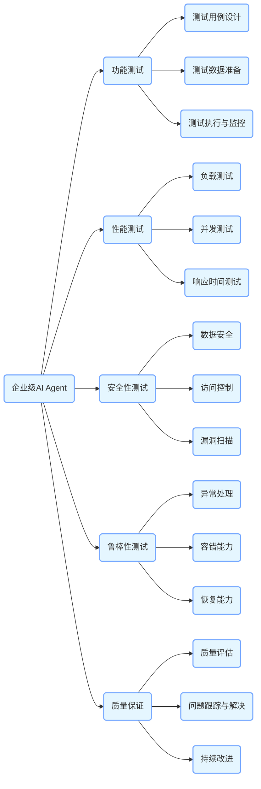

# 企业级AI Agent的测试与质量保证策略

> 关键词：企业级AI Agent、测试策略、质量保证、自动化测试、测试框架

> 摘要：本文围绕企业级AI Agent的测试与质量保证策略展开深入探讨。首先介绍了企业级AI Agent在当今数字化企业中的重要性以及进行有效测试和质量保证的目的。接着阐述了核心概念，包括AI Agent的定义、特点及测试相关的关键要素，并通过文本示意图和Mermaid流程图展示其架构联系。详细讲解了核心算法原理，结合Python源代码说明具体操作步骤，同时给出相关数学模型和公式并举例。在项目实战部分，介绍了开发环境搭建、源代码实现及代码解读。还列举了实际应用场景，推荐了学习资源、开发工具框架和相关论文著作。最后总结了未来发展趋势与挑战，提供常见问题解答和扩展阅读参考资料，旨在为企业提供全面的企业级AI Agent测试与质量保证的方法和思路。

## 1. 背景介绍 
### 1.1 目的和范围
在当今数字化转型的浪潮中，企业级AI Agent正逐渐成为企业提升效率、创新业务模式的关键技术。企业级AI Agent能够模拟人类的智能行为，自动执行各种复杂任务，如客户服务、业务流程自动化、数据分析等。然而，为了确保AI Agent在企业环境中稳定、可靠且高效地运行，必须对其进行全面的测试和严格的质量保证。

本文的目的在于提供一套系统的企业级AI Agent测试与质量保证策略，涵盖从核心概念到实际操作的各个方面。范围包括AI Agent的功能测试、性能测试、安全性测试、鲁棒性测试等多个维度，同时涉及测试工具、测试框架的选择和使用，以及如何建立有效的质量保证体系。

### 1.2 预期读者
本文的预期读者主要包括企业的IT管理人员、AI项目的开发人员、测试人员以及对企业级AI Agent技术感兴趣的研究人员。对于IT管理人员，本文可以帮助他们制定合理的测试与质量保证计划，确保AI Agent项目的顺利实施和成功应用。开发人员可以从本文中获取关于AI Agent测试的技术细节和最佳实践，提高代码质量和开发效率。测试人员可以借鉴本文的测试策略和方法，设计更全面、有效的测试用例。研究人员则可以从本文中了解企业级AI Agent测试与质量保证的最新研究动态和发展趋势。

### 1.3 文档结构概述
本文将按照以下结构进行组织：
- 核心概念与联系：介绍企业级AI Agent的基本概念、特点以及与测试和质量保证相关的关键要素，并通过文本示意图和Mermaid流程图展示其架构联系。
- 核心算法原理 & 具体操作步骤：详细讲解AI Agent中涉及的核心算法原理，结合Python源代码说明具体操作步骤。
- 数学模型和公式 & 详细讲解 & 举例说明：给出AI Agent相关的数学模型和公式，并进行详细讲解和举例说明。
- 项目实战：代码实际案例和详细解释说明：通过一个具体的项目实战案例，介绍开发环境搭建、源代码实现及代码解读。
- 实际应用场景：列举企业级AI Agent在不同领域的实际应用场景，以及相应的测试与质量保证要点。
- 工具和资源推荐：推荐学习资源、开发工具框架和相关论文著作，帮助读者进一步深入学习和研究。
- 总结：未来发展趋势与挑战：总结企业级AI Agent测试与质量保证的未来发展趋势和面临的挑战。
- 附录：常见问题与解答：提供常见问题的解答，帮助读者解决实际遇到的问题。
- 扩展阅读 & 参考资料：提供扩展阅读的建议和参考资料，方便读者进一步深入研究。

### 1.4 术语表
#### 1.4.1 核心术语定义
- **企业级AI Agent**：是指在企业环境中运行的，能够模拟人类智能行为，自动执行各种复杂任务的智能软件系统。它通常结合了人工智能技术，如机器学习、自然语言处理、计算机视觉等，以实现特定的业务目标。
- **测试**：是指对AI Agent进行一系列的检查和验证，以确保其满足预期的功能、性能、安全性等要求的过程。
- **质量保证**：是指通过一系列的措施和方法，确保AI Agent在整个生命周期内的质量符合企业的标准和要求的过程。
- **自动化测试**：是指使用自动化工具和脚本，自动执行测试用例，以提高测试效率和准确性的测试方法。
- **测试框架**：是指为了支持测试工作而设计的一套软件系统，它提供了测试用例管理、测试执行、测试报告生成等功能。

#### 1.4.2 相关概念解释
- **功能测试**：主要验证AI Agent是否能够正确地执行预期的功能，例如是否能够准确地回答用户的问题、是否能够正确地完成业务流程等。
- **性能测试**：主要评估AI Agent在不同负载条件下的性能表现，例如响应时间、吞吐量、并发处理能力等。
- **安全性测试**：主要检查AI Agent是否存在安全漏洞，例如数据泄露、恶意攻击等，以确保其在企业环境中的安全性。
- **鲁棒性测试**：主要测试AI Agent在异常情况下的稳定性和可靠性，例如输入错误数据、网络中断等情况下是否能够正常工作。

#### 1.4.3 缩略词列表
- **AI**：Artificial Intelligence，人工智能
- **ML**：Machine Learning，机器学习
- **NLP**：Natural Language Processing，自然语言处理
- **CV**：Computer Vision，计算机视觉
- **QA**：Quality Assurance，质量保证
- **TDD**：Test-Driven Development，测试驱动开发
- **BDD**：Behavior-Driven Development，行为驱动开发

## 2. 核心概念与联系 
### 2.1 企业级AI Agent的定义与特点
企业级AI Agent是一种基于人工智能技术的智能软件系统，它能够在企业环境中自主地执行各种复杂任务。与传统的软件系统相比，企业级AI Agent具有以下特点：
- **自主性**：能够自主地感知环境、分析问题并做出决策，无需人工干预。
- **智能性**：具备一定的智能能力，能够学习和适应新的环境和任务。
- **交互性**：能够与人类用户进行自然、流畅的交互，理解用户的意图并提供相应的服务。
- **协作性**：能够与其他AI Agent或软件系统进行协作，共同完成复杂的任务。

### 2.2 测试与质量保证的关键要素
企业级AI Agent的测试与质量保证涉及多个关键要素，包括：
- **测试用例设计**：根据AI Agent的功能和需求，设计全面、有效的测试用例，以确保能够覆盖所有可能的情况。
- **测试数据准备**：准备具有代表性的测试数据，包括正常数据、异常数据和边界数据，以验证AI Agent在不同情况下的性能和稳定性。
- **测试环境搭建**：搭建与企业实际环境相似的测试环境，包括硬件环境、软件环境和网络环境，以确保测试结果的准确性和可靠性。
- **测试执行与监控**：按照测试计划执行测试用例，并实时监控测试过程和结果，及时发现和解决问题。
- **质量评估与改进**：根据测试结果对AI Agent的质量进行评估，找出存在的问题和不足，并采取相应的措施进行改进。

### 2.3 核心概念的架构联系
下面是企业级AI Agent测试与质量保证的核心概念架构联系的文本示意图：

```plaintext
企业级AI Agent
|
|-- 功能测试
|   |-- 测试用例设计
|   |-- 测试数据准备
|   |-- 测试执行与监控
|
|-- 性能测试
|   |-- 负载测试
|   |-- 并发测试
|   |-- 响应时间测试
|
|-- 安全性测试
|   |-- 数据安全
|   |-- 访问控制
|   |-- 漏洞扫描
|
|-- 鲁棒性测试
|   |-- 异常处理
|   |-- 容错能力
|   |-- 恢复能力
|
|-- 质量保证
|   |-- 质量评估
|   |-- 问题跟踪与解决
|   |-- 持续改进
```

### 2.4 Mermaid流程图


这个流程图清晰地展示了企业级AI Agent测试与质量保证的各个环节及其之间的关系。从企业级AI Agent出发，分别进行功能测试、性能测试、安全性测试、鲁棒性测试和质量保证工作，每个测试环节又包含了具体的子任务，而质量保证则贯穿整个过程，通过质量评估、问题跟踪与解决以及持续改进来确保AI Agent的质量。

## 3. 核心算法原理 & 具体操作步骤 
### 3.1 机器学习算法在AI Agent中的应用
在企业级AI Agent中，机器学习算法是实现智能决策和行为的核心。常见的机器学习算法包括监督学习、无监督学习和强化学习。下面以监督学习中的决策树算法为例，详细讲解其原理和具体操作步骤。

#### 3.1.1 决策树算法原理
决策树是一种基于树结构进行决策的机器学习算法。它通过对训练数据进行分析，构建一棵决策树，每个内部节点表示一个属性上的测试，每个分支表示一个测试输出，每个叶节点表示一个类别或值。决策树的构建过程就是不断地选择最优的属性进行划分，直到满足终止条件为止。

#### 3.1.2 具体操作步骤及Python代码实现
以下是使用Python的`scikit-learn`库实现决策树分类的具体步骤和代码：

```python
# 步骤1：导入必要的库
from sklearn.datasets import load_iris
from sklearn.model_selection import train_test_split
from sklearn.tree import DecisionTreeClassifier
from sklearn.metrics import accuracy_score

# 步骤2：加载数据集
iris = load_iris()
X = iris.data  # 特征数据
y = iris.target  # 标签数据

# 步骤3：划分训练集和测试集
X_train, X_test, y_train, y_test = train_test_split(X, y, test_size=0.3, random_state=42)

# 步骤4：创建决策树分类器
clf = DecisionTreeClassifier()

# 步骤5：训练模型
clf.fit(X_train, y_train)

# 步骤6：进行预测
y_pred = clf.predict(X_test)

# 步骤7：评估模型性能
accuracy = accuracy_score(y_test, y_pred)
print(f"模型准确率: {accuracy}")
```

### 3.2 自然语言处理算法在AI Agent中的应用
在企业级AI Agent中，自然语言处理算法用于实现与人类用户的自然语言交互。常见的自然语言处理任务包括文本分类、情感分析、命名实体识别等。下面以文本分类任务为例，详细讲解其原理和具体操作步骤。

#### 3.2.1 文本分类算法原理
文本分类是指将文本数据划分到不同的类别中。常见的文本分类算法包括朴素贝叶斯、支持向量机、深度学习等。其中，朴素贝叶斯算法基于贝叶斯定理和特征条件独立假设，通过计算文本属于各个类别的概率来进行分类。

#### 3.2.2 具体操作步骤及Python代码实现
以下是使用Python的`scikit-learn`库实现朴素贝叶斯文本分类的具体步骤和代码：

```python
# 步骤1：导入必要的库
from sklearn.datasets import fetch_20newsgroups
from sklearn.feature_extraction.text import TfidfVectorizer
from sklearn.naive_bayes import MultinomialNB
from sklearn.pipeline import Pipeline
from sklearn.metrics import accuracy_score

# 步骤2：加载数据集
categories = ['alt.atheism', 'soc.religion.christian', 'comp.graphics', 'sci.med']
twenty_train = fetch_20newsgroups(subset='train', categories=categories, shuffle=True, random_state=42)
twenty_test = fetch_20newsgroups(subset='test', categories=categories, shuffle=True, random_state=42)

# 步骤3：创建文本分类管道
text_clf = Pipeline([
    ('tfidf', TfidfVectorizer()),
    ('clf', MultinomialNB()),
])

# 步骤4：训练模型
text_clf.fit(twenty_train.data, twenty_train.target)

# 步骤5：进行预测
predicted = text_clf.predict(twenty_test.data)

# 步骤6：评估模型性能
accuracy = accuracy_score(twenty_test.target, predicted)
print(f"模型准确率: {accuracy}")
```

## 4. 数学模型和公式 & 详细讲解 & 举例说明 
### 4.1 决策树算法的数学模型和公式
#### 4.1.1 信息熵
信息熵是用来衡量数据的不确定性的指标。对于一个离散随机变量 $X$，其信息熵的计算公式为：

$$H(X) = -\sum_{i=1}^{n} p(x_i) \log_2 p(x_i)$$

其中，$p(x_i)$ 是随机变量 $X$ 取值为 $x_i$ 的概率，$n$ 是 $X$ 可能取值的个数。

#### 4.1.2 信息增益
信息增益是指在划分数据集前后信息熵的变化量。对于一个数据集 $D$，按照属性 $A$ 进行划分后的信息增益计算公式为：

$$Gain(D, A) = H(D) - \sum_{v=1}^{V} \frac{|D^v|}{|D|} H(D^v)$$

其中，$H(D)$ 是数据集 $D$ 的信息熵，$V$ 是属性 $A$ 可能取值的个数，$D^v$ 是属性 $A$ 取值为 $v$ 的子集，$|D|$ 和 $|D^v|$ 分别表示数据集 $D$ 和子集 $D^v$ 的样本数量。

#### 4.1.3 举例说明
假设有一个数据集 $D$ 包含 10 个样本，分为两个类别：正类和负类，其中正类有 6 个样本，负类有 4 个样本。则数据集 $D$ 的信息熵为：

$$H(D) = -\frac{6}{10} \log_2 \frac{6}{10} - \frac{4}{10} \log_2 \frac{4}{10} \approx 0.971$$

假设我们有一个属性 $A$，它有两个取值：$A_1$ 和 $A_2$。按照属性 $A$ 进行划分后，$A_1$ 对应的子集 $D_1$ 包含 4 个样本，其中正类有 3 个，负类有 1 个；$A_2$ 对应的子集 $D_2$ 包含 6 个样本，其中正类有 3 个，负类有 3 个。则子集 $D_1$ 和 $D_2$ 的信息熵分别为：

$$H(D_1) = -\frac{3}{4} \log_2 \frac{3}{4} - \frac{1}{4} \log_2 \frac{1}{4} \approx 0.811$$

$$H(D_2) = -\frac{3}{6} \log_2 \frac{3}{6} - \frac{3}{6} \log_2 \frac{3}{6} = 1$$

按照属性 $A$ 进行划分后的信息增益为：

$$Gain(D, A) = H(D) - \frac{4}{10} H(D_1) - \frac{6}{10} H(D_2) \approx 0.971 - \frac{4}{10} \times 0.811 - \frac{6}{10} \times 1 \approx 0.106$$

### 4.2 朴素贝叶斯算法的数学模型和公式
#### 4.2.1 贝叶斯定理
贝叶斯定理是朴素贝叶斯算法的核心，其公式为：

$$P(C|X) = \frac{P(X|C) P(C)}{P(X)}$$

其中，$P(C|X)$ 是在给定特征 $X$ 的情况下，类别 $C$ 发生的概率；$P(X|C)$ 是在类别 $C$ 发生的情况下，特征 $X$ 出现的概率；$P(C)$ 是类别 $C$ 发生的先验概率；$P(X)$ 是特征 $X$ 出现的概率。

#### 4.2.2 朴素贝叶斯分类器
朴素贝叶斯分类器基于特征条件独立假设，即假设各个特征之间相互独立。对于一个文本分类问题，假设文本 $X$ 由 $n$ 个特征 $x_1, x_2, \cdots, x_n$ 组成，则朴素贝叶斯分类器的计算公式为：

$$P(C|X) = \frac{P(X|C) P(C)}{P(X)} \approx \frac{P(C) \prod_{i=1}^{n} P(x_i|C)}{P(X)}$$

由于 $P(X)$ 对于所有类别都是相同的，因此在分类时可以忽略 $P(X)$，只需要比较 $P(C) \prod_{i=1}^{n} P(x_i|C)$ 的大小即可。

#### 4.2.3 举例说明
假设有一个文本分类问题，有两个类别：体育和科技。训练数据集中有 10 篇体育类文本和 10 篇科技类文本。对于一篇新的文本 $X$，假设它包含两个特征：“篮球”和“芯片”。

- 先验概率：$P(体育) = \frac{10}{20} = 0.5$，$P(科技) = \frac{10}{20} = 0.5$。
- 条件概率：假设在体育类文本中，“篮球”出现的概率为 $P(篮球|体育) = 0.8$，“芯片”出现的概率为 $P(芯片|体育) = 0.1$；在科技类文本中，“篮球”出现的概率为 $P(篮球|科技) = 0.2$，“芯片”出现的概率为 $P(芯片|科技) = 0.7$。

则文本 $X$ 属于体育类的概率为：

$$P(体育|X) \approx P(体育) \times P(篮球|体育) \times P(芯片|体育) = 0.5 \times 0.8 \times 0.1 = 0.04$$

文本 $X$ 属于科技类的概率为：

$$P(科技|X) \approx P(科技) \times P(篮球|科技) \times P(芯片|科技) = 0.5 \times 0.2 \times 0.7 = 0.07$$

由于 $P(科技|X) > P(体育|X)$，因此该文本被分类为科技类。

## 5. 项目实战：代码实际案例和详细解释说明 
### 5.1  开发环境搭建
#### 5.1.1 操作系统
本项目可以在多种操作系统上进行开发，如Windows、Linux和macOS。建议使用Linux系统，因为它具有良好的开源生态和稳定性。

#### 5.1.2 Python环境
安装Python 3.7及以上版本。可以从Python官方网站（https://www.python.org/downloads/）下载并安装。安装完成后，建议使用虚拟环境来管理项目的依赖包，以避免不同项目之间的依赖冲突。可以使用`venv`或`conda`来创建虚拟环境。

使用`venv`创建虚拟环境的命令如下：

```bash
python -m venv myenv
source myenv/bin/activate  # 在Linux和macOS上
myenv\Scripts\activate  # 在Windows上
```

#### 5.1.3 依赖包安装
在激活虚拟环境后，安装项目所需的依赖包。可以使用`pip`来安装，以下是一些常用的依赖包：

```bash
pip install scikit-learn pandas numpy matplotlib
```

### 5.2  源代码详细实现和代码解读
#### 5.2.1 项目需求
我们要实现一个简单的企业级AI Agent，用于对客户的咨询进行分类，分为技术咨询、业务咨询和其他咨询三类。

#### 5.2.2 代码实现

```python
import pandas as pd
from sklearn.feature_extraction.text import TfidfVectorizer
from sklearn.naive_bayes import MultinomialNB
from sklearn.pipeline import Pipeline
from sklearn.model_selection import train_test_split
from sklearn.metrics import accuracy_score

# 步骤1：加载数据集
data = pd.read_csv('customer_consultation.csv')
X = data['consultation_text']  # 咨询文本
y = data['category']  # 咨询类别

# 步骤2：划分训练集和测试集
X_train, X_test, y_train, y_test = train_test_split(X, y, test_size=0.2, random_state=42)

# 步骤3：创建文本分类管道
text_clf = Pipeline([
    ('tfidf', TfidfVectorizer()),
    ('clf', MultinomialNB()),
])

# 步骤4：训练模型
text_clf.fit(X_train, y_train)

# 步骤5：进行预测
y_pred = text_clf.predict(X_test)

# 步骤6：评估模型性能
accuracy = accuracy_score(y_test, y_pred)
print(f"模型准确率: {accuracy}")

# 步骤7：对新的咨询进行分类
new_consultation = ["我想了解一下你们的新技术产品"]
predicted_category = text_clf.predict(new_consultation)
print(f"新咨询的分类结果: {predicted_category[0]}")
```

#### 5.2.3 代码解读
- **数据加载**：使用`pandas`库的`read_csv`函数加载包含客户咨询文本和分类标签的CSV文件。
- **数据划分**：使用`train_test_split`函数将数据集划分为训练集和测试集，测试集占比为20%。
- **文本分类管道**：使用`Pipeline`将`TfidfVectorizer`和`MultinomialNB`组合在一起，`TfidfVectorizer`用于将文本转换为TF-IDF特征向量，`MultinomialNB`用于进行朴素贝叶斯分类。
- **模型训练**：使用训练集数据对模型进行训练。
- **模型预测**：使用测试集数据对模型进行预测，并计算预测准确率。
- **新咨询分类**：对新的咨询文本进行分类，输出分类结果。

### 5.3  代码解读与分析
#### 5.3.1 优点
- **简单易用**：使用`scikit-learn`库的`Pipeline`可以方便地将特征提取和分类器组合在一起，减少了代码的复杂度。
- **可扩展性**：可以很容易地替换不同的特征提取器和分类器，以适应不同的任务需求。
- **性能较好**：朴素贝叶斯算法在文本分类任务中通常具有较好的性能，尤其是在处理大规模文本数据时。

#### 5.3.2 缺点
- **特征工程依赖**：模型的性能很大程度上依赖于特征工程的质量，例如TF-IDF特征的选择可能不是最优的。
- **缺乏语义理解**：朴素贝叶斯算法是基于词频统计的，缺乏对文本语义的理解，对于一些语义相近但词频不同的文本可能分类不准确。

#### 5.3.3 改进建议
- **使用更复杂的特征工程**：可以尝试使用词嵌入（如Word2Vec、GloVe）等方法来提取文本的语义特征。
- **使用深度学习模型**：可以尝试使用深度学习模型，如卷积神经网络（CNN）、循环神经网络（RNN）等，来提高文本分类的性能。

## 6. 实际应用场景 
### 6.1 客户服务领域
在客户服务领域，企业级AI Agent可以用于自动回答客户的咨询问题，提供实时的解决方案。例如，一个电商企业的AI Agent可以根据客户的问题，自动查找相关的产品信息、订单状态、售后服务等内容，并以自然语言的方式回复客户。在测试和质量保证方面，需要重点关注以下几点：
- **功能测试**：验证AI Agent是否能够准确地理解客户的问题，并提供正确的答案。需要准备各种类型的问题，包括常见问题、复杂问题和模糊问题，以确保AI Agent的覆盖范围。
- **性能测试**：评估AI Agent在高并发情况下的响应时间和吞吐量，确保能够及时处理大量客户的咨询请求。
- **安全性测试**：检查AI Agent是否能够保护客户的隐私信息，避免数据泄露和恶意攻击。

### 6.2 业务流程自动化领域
在业务流程自动化领域，企业级AI Agent可以用于自动执行各种业务流程，如订单处理、财务结算、人力资源管理等。例如，一个金融企业的AI Agent可以自动审核贷款申请，根据客户的信用记录、收入情况等信息进行风险评估，并做出审批决策。在测试和质量保证方面，需要重点关注以下几点：
- **功能测试**：验证AI Agent是否能够正确地执行业务流程，包括数据的输入、处理和输出。需要模拟各种业务场景，确保AI Agent的准确性和可靠性。
- **性能测试**：评估AI Agent在处理大量业务数据时的性能表现，如处理时间、资源占用等。
- **鲁棒性测试**：测试AI Agent在遇到异常情况时的处理能力，如数据错误、系统故障等，确保能够自动恢复并继续执行业务流程。

### 6.3 数据分析与决策支持领域
在数据分析与决策支持领域，企业级AI Agent可以用于自动分析大量的业务数据，提供有价值的 insights 和决策建议。例如，一个市场营销企业的AI Agent可以分析客户的购买行为、偏好等数据，为企业制定营销策略提供支持。在测试和质量保证方面，需要重点关注以下几点：
- **功能测试**：验证AI Agent是否能够正确地分析数据，并提供准确的分析结果和决策建议。需要使用真实的业务数据进行测试，确保分析结果的可靠性。
- **性能测试**：评估AI Agent在处理大规模数据时的性能表现，如数据分析时间、内存占用等。
- **准确性测试**：检查AI Agent的分析结果和决策建议的准确性，与人工分析结果进行对比，确保AI Agent的可信度。

## 7. 工具和资源推荐
### 7.1 学习资源推荐
#### 7.1.1 书籍推荐
- 《Python机器学习》：这本书详细介绍了Python在机器学习领域的应用，包括各种机器学习算法的原理和实现，适合初学者入门。
- 《自然语言处理入门》：系统地介绍了自然语言处理的基本概念、算法和应用，对于想要了解自然语言处理技术的读者非常有帮助。
- 《人工智能：现代方法》：是人工智能领域的经典教材，涵盖了人工智能的各个方面，包括知识表示、推理、机器学习、自然语言处理等，适合深入学习人工智能技术的读者。

#### 7.1.2 在线课程
- Coursera上的“机器学习”课程：由斯坦福大学的Andrew Ng教授授课，是机器学习领域最受欢迎的在线课程之一，课程内容丰富，讲解清晰，适合初学者。
- edX上的“自然语言处理”课程：由哥伦比亚大学的教授授课，系统地介绍了自然语言处理的理论和实践，适合有一定编程基础的读者。
- Udemy上的“企业级AI Agent开发实战”课程：结合实际项目案例，详细介绍了企业级AI Agent的开发流程和技术，适合想要实践企业级AI Agent开发的读者。

#### 7.1.3 技术博客和网站
- Medium：是一个技术博客平台，上面有很多关于人工智能、机器学习、自然语言处理等领域的优秀文章，作者来自世界各地，内容丰富多样。
- Towards Data Science：是一个专注于数据科学和机器学习的技术博客，上面有很多关于最新技术和研究成果的介绍，以及实际项目的案例分析。
- arXiv：是一个预印本平台，上面有很多关于人工智能、机器学习等领域的最新研究论文，对于想要了解最新研究动态的读者非常有帮助。

### 7.2 开发工具框架推荐
#### 7.2.1 IDE和编辑器
- PyCharm：是一款专门为Python开发设计的集成开发环境（IDE），具有代码自动补全、调试、版本控制等功能，非常适合Python开发者使用。
- Jupyter Notebook：是一个交互式的开发环境，支持Python、R等多种编程语言，适合进行数据探索、模型训练和可视化等工作。
- Visual Studio Code：是一款轻量级的代码编辑器，支持多种编程语言和插件扩展，具有丰富的功能和良好的用户体验，适合快速开发和调试代码。

#### 7.2.2 调试和性能分析工具
- pdb：是Python自带的调试工具，可以在代码中设置断点，逐行调试代码，帮助开发者快速定位和解决问题。
- cProfile：是Python自带的性能分析工具，可以统计代码的运行时间和函数调用次数，帮助开发者找出代码中的性能瓶颈。
- TensorBoard：是TensorFlow提供的可视化工具，可以用于可视化模型的训练过程、损失函数曲线、模型结构等，帮助开发者更好地理解和优化模型。

#### 7.2.3 相关框架和库
- scikit-learn：是一个简单易用的机器学习库，提供了各种机器学习算法的实现，如分类、回归、聚类等，适合初学者和快速开发。
- TensorFlow：是一个开源的深度学习框架，由Google开发，具有强大的计算能力和丰富的工具集，适合开发大规模的深度学习模型。
- PyTorch：是一个开源的深度学习框架，由Facebook开发，具有动态图的特点，代码简洁易懂，适合研究和快速迭代。

### 7.3 相关论文著作推荐
#### 7.3.1 经典论文
- “A Logical Calculus of the Ideas Immanent in Nervous Activity”：由Warren S. McCulloch和Walter Pitts发表于1943年，提出了神经元的数学模型，为神经网络的发展奠定了基础。
- “A Machine for Playing Chess”：由Claude E. Shannon发表于1950年，提出了计算机下棋的基本算法，开创了人工智能在博弈领域的应用。
- “Speech Recognition with Deep Recurrent Neural Networks”：由Alex Graves等人发表于2013年，提出了深度循环神经网络在语音识别中的应用，取得了当时最好的性能。

#### 7.3.2 最新研究成果
- “Attention Is All You Need”：由Vaswani等人发表于2017年，提出了Transformer模型，在自然语言处理领域取得了巨大的成功，成为了当前最流行的模型架构之一。
- “GPT-3: Language Models are Few-Shot Learners”：由OpenAI团队发表于2020年，介绍了GPT-3模型，该模型具有强大的语言生成能力，在很多自然语言处理任务中取得了优异的成绩。
- “DALL-E 2: Creating Images from Text”：由OpenAI团队发表于2022年，介绍了DALL-E 2模型，该模型可以根据文本描述生成高质量的图像，展示了人工智能在图像生成领域的巨大潜力。

#### 7.3.3 应用案例分析
- “How Amazon Uses AI to Improve Customer Experience”：分析了亚马逊如何使用人工智能技术来提升客户体验，包括推荐系统、客服机器人等方面的应用。
- “Google's Use of AI in Search and Advertising”：介绍了谷歌如何在搜索和广告领域应用人工智能技术，提高搜索结果的准确性和广告投放的效果。
- “Microsoft's AI-Powered Office Tools”：探讨了微软如何将人工智能技术融入到办公软件中，如Word、Excel、PowerPoint等，提高用户的工作效率。

## 8. 总结：未来发展趋势与挑战
### 8.1 未来发展趋势
#### 8.1.1 多模态融合
未来的企业级AI Agent将不仅仅局限于文本交互，还将融合语音、图像、视频等多种模态的信息，实现更加自然、高效的人机交互。例如，一个智能客服可以同时处理客户的语音咨询和图像上传，提供更加全面的服务。

#### 8.1.2 强化学习与决策优化
强化学习将在企业级AI Agent中得到更广泛的应用，用于优化决策过程。例如，一个物流企业的AI Agent可以通过强化学习算法，自动优化配送路线，提高配送效率和降低成本。

#### 8.1.3 联邦学习与隐私保护
随着数据隐私和安全问题的日益突出，联邦学习将成为企业级AI Agent的重要发展方向。联邦学习允许在不共享原始数据的情况下进行模型训练，保护了数据的隐私和安全。例如，多个医疗机构可以通过联邦学习共同训练一个疾病诊断模型，而不需要共享患者的敏感数据。

### 8.2 面临的挑战
#### 8.2.1 数据质量与标注
企业级AI Agent的性能很大程度上依赖于高质量的数据。然而，在实际应用中，数据往往存在噪声、缺失值、不一致等问题，需要进行大量的数据清洗和预处理工作。此外，很多任务需要人工标注数据，标注的质量和效率也会影响模型的性能。

#### 8.2.2 可解释性与透明度
AI Agent的决策过程往往是黑盒的，难以解释和理解。在企业应用中，尤其是涉及到关键决策的场景，如金融风险评估、医疗诊断等，需要AI Agent具有可解释性和透明度，以便用户能够信任和接受其决策结果。

#### 8.2.3 伦理与法律问题
随着AI Agent的广泛应用，伦理和法律问题也日益凸显。例如，AI Agent可能会产生歧视性的决策，或者侵犯用户的隐私和权益。需要建立相应的伦理和法律框架，规范AI Agent的开发和使用。

## 9. 附录：常见问题与解答
### 9.1 如何选择合适的测试方法？
选择合适的测试方法需要考虑多个因素，如AI Agent的类型、应用场景、测试目标等。对于功能测试，可以使用黑盒测试方法，根据需求规格说明书设计测试用例；对于性能测试，可以使用负载测试、压力测试等方法，模拟高并发场景；对于安全性测试，可以使用漏洞扫描、渗透测试等方法，检查系统的安全漏洞。

### 9.2 如何评估AI Agent的质量？
评估AI Agent的质量可以从多个维度进行，如功能准确性、性能指标、安全性、鲁棒性等。可以使用一些指标来量化评估，如准确率、召回率、F1值、响应时间、吞吐量等。此外，还可以通过用户反馈、A/B测试等方式来评估AI Agent的用户体验和实际效果。

### 9.3 如何处理测试过程中发现的问题？
在测试过程中发现问题后，需要及时记录问题的详细信息，包括问题描述、复现步骤、测试环境等。然后，将问题反馈给开发团队，开发团队进行问题分析和修复。在修复完成后，需要进行回归测试，确保问题已经得到解决，并且没有引入新的问题。

### 9.4 如何提高测试效率？
可以通过以下几种方式提高测试效率：
- 使用自动化测试工具和框架，自动执行测试用例，减少人工测试的工作量。
- 采用测试驱动开发（TDD）或行为驱动开发（BDD）的方法，在开发过程中及时进行测试，提高代码质量。
- 优化测试用例设计，减少冗余的测试用例，提高测试用例的覆盖率。
- 并行执行测试用例，充分利用多核处理器的性能。

## 10. 扩展阅读 & 参考资料
### 10.1 扩展阅读
- 《深度学习》（Deep Learning）：由Ian Goodfellow、Yoshua Bengio和Aaron Courville合著，是深度学习领域的经典教材，深入介绍了深度学习的理论和实践。
- 《人工智能时代的人类未来》（Life 3.0: Being Human in the Age of Artificial Intelligence）：由Max Tegmark所著，探讨了人工智能对人类社会的影响以及人类未来的发展方向。
- 《第四次工业革命》（The Fourth Industrial Revolution）：由Klaus Schwab所著，介绍了第四次工业革命的概念和特点，以及人工智能在其中的重要作用。

### 10.2 参考资料
- 《企业级AI Agent开发指南》：某公司内部文档，详细介绍了企业级AI Agent的开发流程和技术要点。
- 《AI Agent测试标准与规范》：某行业协会发布的标准文档，为AI Agent的测试提供了统一的标准和规范。
- 《人工智能白皮书》：由相关机构发布的年度报告，总结了人工智能领域的最新发展趋势和应用案例。

作者：AI天才研究院/AI Genius Institute & 禅与计算机程序设计艺术 /Zen And The Art of Computer Programming