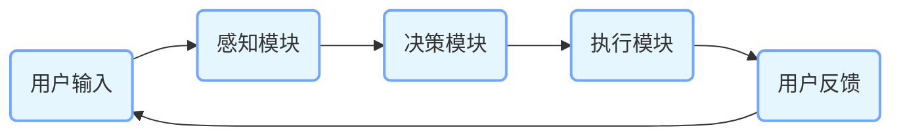

# 企业级AI Agent的用户体验设计原则

> 关键词：企业级AI Agent、用户体验设计、设计原则、交互设计、信息架构

> 摘要：本文聚焦于企业级AI Agent的用户体验设计原则。首先介绍了相关背景，包括目的范围、预期读者等内容。接着阐述了企业级AI Agent的核心概念与联系，通过文本示意图和Mermaid流程图进行说明。详细讲解了核心算法原理及具体操作步骤，运用Python代码进行示例。深入分析了数学模型和公式，并举例说明。通过项目实战展示了开发环境搭建、源代码实现与解读。探讨了实际应用场景，推荐了相关工具和资源，最后总结了未来发展趋势与挑战，解答常见问题并提供扩展阅读和参考资料，旨在为企业级AI Agent的用户体验设计提供全面且深入的指导。

## 1. 背景介绍 
### 1.1 目的和范围
随着人工智能技术的飞速发展，企业级AI Agent在企业的日常运营、客户服务、数据分析等多个领域得到了广泛应用。本文章的目的在于深入探讨企业级AI Agent的用户体验设计原则，为设计师、开发人员以及企业决策者提供一套科学、实用的设计指南，以提升AI Agent在企业环境中的使用效率和用户满意度。

文章的范围涵盖了企业级AI Agent从概念理解、核心算法原理、数学模型分析到项目实战应用等多个方面，重点聚焦于用户体验设计的各个环节，包括交互设计、信息架构设计、视觉设计等。

### 1.2 预期读者
本文的预期读者主要包括以下几类人群：
- **设计师**：包括交互设计师、界面设计师等，他们负责设计AI Agent的用户界面和交互流程，需要了解如何根据企业级应用的特点来设计出符合用户需求的体验。
- **开发人员**：如人工智能工程师、软件工程师等，他们在开发AI Agent的过程中需要考虑用户体验因素，以确保产品的可用性和易用性。
- **企业决策者**：企业的管理层和业务负责人，他们需要了解用户体验设计对企业级AI Agent的重要性，以便在产品规划和决策中做出正确的选择。
- **研究人员**：从事人工智能、人机交互等领域研究的学者和科研人员，他们可以从本文中获取关于企业级AI Agent用户体验设计的最新研究成果和实践经验。

### 1.3 文档结构概述
本文将按照以下结构进行阐述：
- **核心概念与联系**：介绍企业级AI Agent的基本概念、原理和架构，通过文本示意图和Mermaid流程图展示其核心组成部分和相互关系。
- **核心算法原理 & 具体操作步骤**：详细讲解企业级AI Agent所涉及的核心算法原理，并使用Python源代码进行示例，说明具体的操作步骤。
- **数学模型和公式 & 详细讲解 & 举例说明**：分析企业级AI Agent背后的数学模型和公式，通过具体的例子进行详细讲解。
- **项目实战：代码实际案例和详细解释说明**：通过一个实际的项目案例，介绍开发环境搭建、源代码实现和代码解读，展示如何将用户体验设计原则应用到实际开发中。
- **实际应用场景**：探讨企业级AI Agent在不同行业和业务场景中的应用，分析其用户体验设计的特点和要求。
- **工具和资源推荐**：推荐一些学习资源、开发工具框架和相关论文著作，帮助读者进一步深入学习和研究。
- **总结：未来发展趋势与挑战**：总结企业级AI Agent用户体验设计的发展趋势和面临的挑战，为读者提供未来的研究方向和思考。
- **附录：常见问题与解答**：解答读者在学习和实践过程中可能遇到的常见问题。
- **扩展阅读 & 参考资料**：提供一些扩展阅读的材料和参考资料，方便读者进一步深入学习。

### 1.4 术语表
#### 1.4.1 核心术语定义
- **企业级AI Agent**：是指在企业环境中使用的人工智能代理，它能够模拟人类的行为和决策，与用户进行交互，完成各种任务，如客户服务、业务流程自动化等。
- **用户体验设计**：是指以用户为中心，通过设计产品的交互流程、界面布局、信息架构等方面，使用户在使用产品的过程中获得良好的体验和满意度。
- **交互设计**：是指设计人与产品之间的交互方式，包括用户输入、系统反馈、操作流程等方面，以确保交互的高效性和易用性。
- **信息架构**：是指对信息进行组织、分类和导航的方式，以便用户能够快速、准确地找到所需的信息。

#### 1.4.2 相关概念解释
- **人工智能**：是指让计算机模拟人类的智能行为，包括学习、推理、决策等能力。
- **机器学习**：是人工智能的一个重要分支，通过让计算机从数据中学习模式和规律，从而实现预测和决策。
- **自然语言处理**：是指让计算机理解和处理人类语言的技术，包括语音识别、文本分析、机器翻译等。

#### 1.4.3 缩略词列表
- **AI**：Artificial Intelligence，人工智能
- **ML**：Machine Learning，机器学习
- **NLP**：Natural Language Processing，自然语言处理

## 2. 核心概念与联系 
企业级AI Agent是一种结合了人工智能技术和企业业务需求的智能代理，它的核心组成部分包括感知模块、决策模块和执行模块。感知模块负责收集用户的输入信息，如语音、文本、图像等；决策模块根据感知到的信息进行分析和推理，做出决策；执行模块根据决策结果执行相应的任务，并将执行结果反馈给用户。

以下是企业级AI Agent的核心概念架构的文本示意图：

```plaintext
企业级AI Agent
├── 感知模块
│   ├── 语音识别
│   ├── 文本分析
│   ├── 图像识别
├── 决策模块
│   ├── 机器学习模型
│   ├── 规则引擎
├── 执行模块
│   ├── 业务流程自动化
│   ├── 数据查询与处理
│   ├── 系统集成
├── 用户交互界面
│   ├── 语音交互
│   ├── 文本交互
│   ├── 图形界面交互
```

下面是使用Mermaid绘制的企业级AI Agent的流程图：



从这个流程图可以看出，企业级AI Agent的工作流程是一个闭环。用户输入信息后，感知模块将其转化为计算机能够理解的形式，决策模块根据这些信息进行分析和决策，执行模块执行相应的任务并将结果反馈给用户。用户根据反馈信息可以进一步输入新的信息，形成一个持续的交互过程。

## 3. 核心算法原理 & 具体操作步骤 
企业级AI Agent涉及到多种核心算法，其中机器学习和自然语言处理是两个重要的方面。下面以一个简单的文本分类任务为例，介绍核心算法原理和具体操作步骤。

### 核心算法原理
文本分类是自然语言处理中的一个基本任务，其目标是将输入的文本分配到预先定义的类别中。常用的文本分类算法包括朴素贝叶斯、支持向量机、深度学习等。这里我们使用朴素贝叶斯算法，它基于贝叶斯定理和特征条件独立假设，通过计算文本属于各个类别的概率，选择概率最大的类别作为分类结果。

贝叶斯定理的公式为：
$$P(C|X)=\frac{P(X|C)P(C)}{P(X)}$$
其中，$P(C|X)$ 表示在给定文本 $X$ 的情况下，文本属于类别 $C$ 的概率；$P(X|C)$ 表示在类别 $C$ 下，文本 $X$ 出现的概率；$P(C)$ 表示类别 $C$ 出现的先验概率；$P(X)$ 表示文本 $X$ 出现的概率。

在朴素贝叶斯算法中，假设文本的各个特征（如单词）是条件独立的，因此可以将 $P(X|C)$ 分解为各个特征的概率乘积：
$$P(X|C)=\prod_{i=1}^{n}P(x_i|C)$$
其中，$x_i$ 表示文本 $X$ 中的第 $i$ 个特征。

### 具体操作步骤
以下是使用Python实现朴素贝叶斯文本分类的具体步骤和代码示例：

```python
import numpy as np
from sklearn.feature_extraction.text import CountVectorizer
from sklearn.naive_bayes import MultinomialNB

# 步骤1：准备数据集
corpus = [
    "This is a positive sentence",
    "This is a negative sentence",
    "Another positive example",
    "Another negative example"
]
labels = [1, 0, 1, 0]

# 步骤2：特征提取
vectorizer = CountVectorizer()
X = vectorizer.fit_transform(corpus)

# 步骤3：模型训练
model = MultinomialNB()
model.fit(X, labels)

# 步骤4：预测
new_text = ["This is a new positive sentence"]
new_X = vectorizer.transform(new_text)
prediction = model.predict(new_X)

print("预测结果:", prediction)
```

### 代码解释
1. **准备数据集**：定义一个包含文本数据的列表 `corpus` 和对应的标签列表 `labels`，其中 `1` 表示正类，`0` 表示负类。
2. **特征提取**：使用 `CountVectorizer` 将文本数据转换为词频矩阵，每个文本样本被表示为一个向量，向量的每个元素表示对应单词的出现次数。
3. **模型训练**：使用 `MultinomialNB` 初始化一个朴素贝叶斯分类器，并使用训练数据 `X` 和标签 `labels` 进行训练。
4. **预测**：对于新的文本数据，使用 `vectorizer.transform` 将其转换为词频矩阵，然后使用训练好的模型进行预测。

## 4. 数学模型和公式 & 详细讲解 & 举例说明 
### 数学模型
在企业级AI Agent中，除了前面提到的朴素贝叶斯算法的数学模型，还有很多其他的数学模型和公式。例如，在机器学习中，线性回归是一种常用的模型，用于预测连续值。线性回归的数学模型可以表示为：
$$y = \theta_0 + \theta_1x_1 + \theta_2x_2 + \cdots + \theta_nx_n + \epsilon$$
其中，$y$ 是预测值，$x_1, x_2, \cdots, x_n$ 是输入特征，$\theta_0, \theta_1, \cdots, \theta_n$ 是模型的参数，$\epsilon$ 是误差项。

### 公式详细讲解
线性回归的目标是找到一组参数 $\theta$，使得预测值 $y$ 与真实值之间的误差最小。常用的误差度量方法是均方误差（Mean Squared Error，MSE），其公式为：
$$MSE = \frac{1}{m}\sum_{i=1}^{m}(y^{(i)} - \hat{y}^{(i)})^2$$
其中，$m$ 是样本数量，$y^{(i)}$ 是第 $i$ 个样本的真实值，$\hat{y}^{(i)}$ 是第 $i$ 个样本的预测值。

为了最小化均方误差，我们可以使用梯度下降算法。梯度下降算法的基本思想是沿着误差函数的负梯度方向更新参数，直到找到误差函数的最小值。参数更新公式为：
$$\theta_j := \theta_j - \alpha\frac{\partial}{\partial\theta_j}MSE(\theta)$$
其中，$\alpha$ 是学习率，控制参数更新的步长。

### 举例说明
假设我们有一个简单的线性回归问题，输入特征 $x$ 是房屋面积，输出 $y$ 是房屋价格。我们有以下数据集：

| 房屋面积 ($x$) | 房屋价格 ($y$) |
| --- | --- |
| 100 | 200 |
| 200 | 400 |
| 300 | 600 |

我们的目标是找到一个线性模型 $y = \theta_0 + \theta_1x$，使得预测值与真实值之间的误差最小。

首先，我们可以计算均方误差：
$$MSE = \frac{1}{3}[(200 - (\theta_0 + \theta_1\times100))^2 + (400 - (\theta_0 + \theta_1\times200))^2 + (600 - (\theta_0 + \theta_1\times300))^2]$$

然后，使用梯度下降算法更新参数 $\theta_0$ 和 $\theta_1$。具体实现代码如下：

```python
import numpy as np

# 数据集
X = np.array([100, 200, 300])
y = np.array([200, 400, 600])

# 初始化参数
theta_0 = 0
theta_1 = 0

# 学习率
alpha = 0.00001

# 迭代次数
num_iterations = 1000

for i in range(num_iterations):
    # 计算预测值
    y_pred = theta_0 + theta_1 * X
    
    # 计算误差
    error = y_pred - y
    
    # 更新参数
    theta_0 = theta_0 - alpha * (1/len(X)) * np.sum(error)
    theta_1 = theta_1 - alpha * (1/len(X)) * np.sum(error * X)

print("最终参数 theta_0:", theta_0)
print("最终参数 theta_1:", theta_1)
```

通过上述代码，我们可以找到使得均方误差最小的参数 $\theta_0$ 和 $\theta_1$，从而得到一个最优的线性回归模型。

## 5. 项目实战：代码实际案例和详细解释说明 
### 5.1  开发环境搭建
为了实现一个简单的企业级AI Agent，我们可以使用Python作为开发语言，并结合一些常用的库和框架。以下是开发环境搭建的步骤：

1. **安装Python**：从Python官方网站（https://www.python.org/downloads/）下载并安装Python 3.x 版本。
2. **安装虚拟环境**：建议使用虚拟环境来管理项目的依赖，避免不同项目之间的依赖冲突。可以使用 `venv` 或 `conda` 来创建虚拟环境。例如，使用 `venv` 创建虚拟环境的命令如下：
```sh
python -m venv myenv
```
激活虚拟环境：
- 在Windows上：
```sh
myenv\Scripts\activate
```
- 在Linux或Mac上：
```sh
source myenv/bin/activate
```
3. **安装依赖库**：安装所需的依赖库，如 `scikit-learn`、`nltk`、`flask` 等。可以使用 `pip` 进行安装：
```sh
pip install scikit-learn nltk flask
```

### 5.2  源代码详细实现和代码解读
以下是一个简单的企业级AI Agent的代码示例，该AI Agent可以进行文本分类和问答：

```python
from flask import Flask, request, jsonify
from sklearn.feature_extraction.text import CountVectorizer
from sklearn.naive_bayes import MultinomialNB
import nltk
from nltk.tokenize import word_tokenize
nltk.download('punkt')

# 初始化Flask应用
app = Flask(__name__)

# 准备数据集
corpus = [
    "This is a positive sentence",
    "This is a negative sentence",
    "Another positive example",
    "Another negative example"
]
labels = [1, 0, 1, 0]

# 特征提取
vectorizer = CountVectorizer()
X = vectorizer.fit_transform(corpus)

# 模型训练
model = MultinomialNB()
model.fit(X, labels)

# 问答知识库
qa_knowledge_base = {
    "What is AI?": "AI stands for Artificial Intelligence, which refers to the simulation of human intelligence in machines.",
    "How does AI work?": "AI works by using algorithms and data to learn patterns and make predictions or decisions."
}

@app.route('/classify', methods=['POST'])
def classify_text():
    data = request.get_json()
    text = data.get('text')
    if text:
        new_X = vectorizer.transform([text])
        prediction = model.predict(new_X)
        result = {
            "text": text,
            "classification": "positive" if prediction[0] == 1 else "negative"
        }
        return jsonify(result)
    return jsonify({"error": "No text provided"})

@app.route('/answer', methods=['POST'])
def answer_question():
    data = request.get_json()
    question = data.get('question')
    if question:
        if question in qa_knowledge_base:
            answer = qa_knowledge_base[question]
            result = {
                "question": question,
                "answer": answer
            }
            return jsonify(result)
        else:
            return jsonify({"error": "No answer found for this question"})
    return jsonify({"error": "No question provided"})

if __name__ == '__main__':
    app.run(debug=True)
```

### 5.3  代码解读与分析
1. **初始化Flask应用**：使用 `Flask` 框架创建一个Web应用，用于处理HTTP请求。
2. **数据准备和模型训练**：准备文本分类的数据集，使用 `CountVectorizer` 进行特征提取，使用 `MultinomialNB` 进行模型训练。
3. **问答知识库**：定义一个简单的问答知识库，存储常见问题和对应的答案。
4. **文本分类接口**：定义一个 `/classify` 接口，接收用户输入的文本，使用训练好的模型进行分类，并返回分类结果。
5. **问答接口**：定义一个 `/answer` 接口，接收用户的问题，在问答知识库中查找对应的答案并返回。

通过这个简单的示例，我们可以看到如何将文本分类和问答功能集成到一个企业级AI Agent中，并通过Web接口提供服务。

## 6. 实际应用场景 
企业级AI Agent在不同的行业和业务场景中有着广泛的应用，以下是一些常见的应用场景：

### 客户服务
企业级AI Agent可以作为智能客服，自动回答客户的常见问题，提供产品信息和解决方案。例如，电商企业可以使用AI Agent处理客户的订单查询、退换货咨询等问题；金融企业可以使用AI Agent为客户提供账户信息查询、贷款申请指导等服务。

### 业务流程自动化
AI Agent可以自动化执行一些重复性的业务流程，如数据录入、报表生成、任务分配等。例如，人力资源部门可以使用AI Agent自动筛选简历、安排面试；财务部门可以使用AI Agent自动处理报销流程、生成财务报表。

### 数据分析与决策支持
AI Agent可以分析大量的企业数据，提供有价值的洞察和决策建议。例如，市场营销部门可以使用AI Agent分析客户行为数据，制定个性化的营销策略；运营部门可以使用AI Agent分析生产数据，优化生产流程和资源分配。

### 智能办公助手
AI Agent可以作为智能办公助手，帮助员工提高工作效率。例如，员工可以使用AI Agent查询公司内部资料、安排会议、提醒任务等。

### 供应链管理
AI Agent可以优化供应链管理流程，提高供应链的透明度和效率。例如，AI Agent可以实时监控库存水平、预测需求、优化物流配送路线等。

在不同的应用场景中，企业级AI Agent的用户体验设计需要考虑到用户的特点和需求。例如，在客户服务场景中，用户通常希望能够快速得到准确的答案，因此AI Agent的响应速度和回答准确性是关键；在业务流程自动化场景中，用户更关注系统的稳定性和易用性，因此AI Agent的操作流程应该简单明了，避免给用户带来过多的负担。

## 7. 工具和资源推荐
### 7.1 学习资源推荐
#### 7.1.1 书籍推荐
- 《人工智能：一种现代的方法》：这是一本经典的人工智能教材，全面介绍了人工智能的各个领域，包括搜索算法、机器学习、自然语言处理等。
- 《Python机器学习》：详细介绍了使用Python进行机器学习的方法和技巧，包括数据预处理、模型选择、评估和优化等。
- 《自然语言处理入门》：适合初学者的自然语言处理书籍，介绍了自然语言处理的基本概念、算法和应用。

#### 7.1.2 在线课程
- Coursera上的“机器学习”课程：由斯坦福大学教授Andrew Ng主讲，是一门非常经典的机器学习课程，涵盖了机器学习的基本概念、算法和应用。
- edX上的“人工智能基础”课程：介绍了人工智能的基本原理和方法，包括搜索算法、知识表示、推理等。
- 网易云课堂上的“Python深度学习实战”课程：讲解了使用Python和深度学习框架（如TensorFlow、PyTorch）进行深度学习的实践方法。

#### 7.1.3 技术博客和网站
- Medium：一个技术博客平台，有很多关于人工智能、机器学习、自然语言处理等领域的优质文章。
- Towards Data Science：专注于数据科学和机器学习领域的博客，提供了很多实用的教程和案例分析。
- AI Time：一个专注于人工智能领域的网站，提供了最新的学术研究成果、行业动态和技术分享。

### 7.2 开发工具框架推荐
#### 7.2.1 IDE和编辑器
- PyCharm：一款专业的Python集成开发环境，提供了丰富的代码编辑、调试、版本控制等功能。
- Jupyter Notebook：一个交互式的编程环境，适合进行数据探索、模型实验和可视化分析。
- Visual Studio Code：一款轻量级的代码编辑器，支持多种编程语言和插件扩展，具有强大的代码编辑和调试功能。

#### 7.2.2 调试和性能分析工具
- pdb：Python自带的调试器，可以帮助开发者调试代码，定位问题。
- cProfile：Python的性能分析工具，可以分析代码的执行时间和函数调用情况，帮助开发者优化代码性能。
- TensorBoard：TensorFlow的可视化工具，可以帮助开发者可视化模型的训练过程、性能指标等。

#### 7.2.3 相关框架和库
- scikit-learn：一个简单易用的机器学习库，提供了丰富的机器学习算法和工具，如分类、回归、聚类等。
- TensorFlow：一个开源的深度学习框架，广泛应用于图像识别、自然语言处理、语音识别等领域。
- PyTorch：另一个流行的深度学习框架，具有动态图和易于使用的特点，适合快速开发和实验。

### 7.3 相关论文著作推荐
#### 7.3.1 经典论文
- 《A Logical Calculus of the Ideas Immanent in Nervous Activity》：由Warren McCulloch和Walter Pitts发表于1943年，提出了人工神经网络的基本概念。
- 《A Mathematical Theory of Communication》：由Claude Shannon发表于1948年，奠定了信息论的基础。
- 《Gradient-Based Learning Applied to Document Recognition》：由Yann LeCun等人发表于1998年，介绍了卷积神经网络（CNN）在手写数字识别中的应用。

#### 7.3.2 最新研究成果
- 《Attention Is All You Need》：提出了Transformer架构，在自然语言处理领域取得了巨大的成功。
- 《Generative Adversarial Networks》：提出了生成对抗网络（GAN），用于生成逼真的图像、文本等数据。
- 《BERT: Pre-training of Deep Bidirectional Transformers for Language Understanding》：介绍了BERT模型，在自然语言处理的多个任务中取得了最先进的结果。

#### 7.3.3 应用案例分析
- 《AI in Healthcare: Transforming the Future of Medicine》：分析了人工智能在医疗领域的应用案例，包括疾病诊断、药物研发、医疗影像分析等。
- 《AI in Finance: Transforming the Financial Industry》：探讨了人工智能在金融领域的应用，如风险评估、投资决策、客户服务等。
- 《AI in Retail: Transforming the Shopping Experience》：介绍了人工智能在零售行业的应用，如个性化推荐、库存管理、供应链优化等。

## 8. 总结：未来发展趋势与挑战
### 未来发展趋势
- **多模态交互**：未来的企业级AI Agent将支持多种模态的交互方式，如语音、手势、眼神等，使用户能够更加自然、便捷地与AI Agent进行交互。
- **个性化服务**：AI Agent将能够根据用户的个人偏好、历史行为等信息，提供个性化的服务和推荐，提高用户的满意度和忠诚度。
- **与企业系统的深度集成**：AI Agent将与企业的各种信息系统（如ERP、CRM等）进行深度集成，实现数据的共享和业务流程的自动化，提高企业的运营效率。
- **强化学习和自主决策**：AI Agent将越来越多地采用强化学习算法，实现自主决策和自适应学习，能够在复杂的环境中做出最优的决策。
- **伦理和法律规范**：随着AI Agent的广泛应用，伦理和法律问题将越来越受到关注，未来需要建立相应的伦理和法律规范，确保AI Agent的合法、合规使用。

### 挑战
- **数据质量和隐私保护**：AI Agent的性能和效果很大程度上依赖于数据的质量和数量，同时，数据的隐私保护也是一个重要的问题。如何获取高质量的数据，并确保数据的隐私和安全是一个挑战。
- **模型可解释性**：许多深度学习模型是黑盒模型，难以解释其决策过程和结果。在企业级应用中，用户通常需要了解AI Agent的决策依据，因此提高模型的可解释性是一个亟待解决的问题。
- **技术集成和兼容性**：企业级AI Agent通常需要集成多种技术和系统，如机器学习、自然语言处理、数据库等，如何确保这些技术和系统的兼容性和协同工作是一个挑战。
- **用户接受度**：用户对AI Agent的接受度也是一个重要的问题。一些用户可能对AI Agent的可靠性和安全性存在疑虑，如何提高用户对AI Agent的信任和接受度是一个挑战。

## 9. 附录：常见问题与解答
### 问题1：企业级AI Agent与普通AI Agent有什么区别？
企业级AI Agent通常需要满足企业的特定业务需求，具有更高的可靠性、安全性和可扩展性。与普通AI Agent相比，企业级AI Agent需要处理更多的复杂任务，如业务流程自动化、数据分析与决策支持等，同时需要与企业的各种信息系统进行集成。

### 问题2：如何评估企业级AI Agent的用户体验？
可以从多个方面评估企业级AI Agent的用户体验，如交互效率、易用性、准确性、可靠性等。可以通过用户调查、可用性测试、数据分析等方法来收集用户的反馈和数据，从而评估AI Agent的用户体验。

### 问题3：企业级AI Agent的开发成本高吗？
企业级AI Agent的开发成本取决于多个因素，如功能需求、技术复杂度、数据量等。一般来说，开发一个功能复杂的企业级AI Agent需要投入较多的人力、物力和时间，成本相对较高。但是，随着技术的发展和开源工具的普及，开发成本也在逐渐降低。

### 问题4：如何确保企业级AI Agent的安全性？
可以从多个方面确保企业级AI Agent的安全性，如数据加密、访问控制、身份验证、安全审计等。同时，需要定期对AI Agent进行安全评估和漏洞修复，及时发现和解决安全问题。

### 问题5：企业级AI Agent可以替代人类员工吗？
企业级AI Agent可以自动化执行一些重复性的任务，提高工作效率，但不能完全替代人类员工。在一些需要创造力、情感理解、人际交往等方面的工作中，人类员工仍然具有不可替代的优势。企业级AI Agent应该作为人类员工的辅助工具，与人类员工协同工作。

## 10. 扩展阅读 & 参考资料
### 扩展阅读
- 《智能时代》：吴军著，介绍了人工智能对社会和经济的影响，以及未来的发展趋势。
- 《AI 3.0》：加里·马库斯著，探讨了人工智能的发展现状和面临的挑战，提出了未来人工智能的发展方向。
- 《机器之心》：沈向洋、李开复著，介绍了人工智能的历史、现状和未来，以及人工智能在各个领域的应用。

### 参考资料
- 《Python数据分析实战》：利用Python进行数据分析的实战教程，介绍了数据处理、可视化和机器学习等方面的内容。
- 《自然语言处理实战：基于Python和深度学习》：详细介绍了使用Python和深度学习进行自然语言处理的方法和实践案例。
- 《机器学习实战》：通过实际案例介绍了机器学习的基本算法和应用，适合初学者入门。

作者：AI天才研究院/AI Genius Institute & 禅与计算机程序设计艺术 /Zen And The Art of Computer Programming