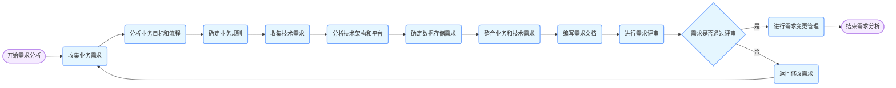

# 企业级AI Agent需求分析方法

> 关键词：企业级AI Agent、需求分析方法、人工智能、业务需求、技术需求

> 摘要：本文聚焦于企业级AI Agent需求分析方法，深入探讨在企业环境下如何准确把握对AI Agent的需求。首先介绍了进行需求分析的背景，包括目的、预期读者、文档结构和相关术语。接着阐述了核心概念及联系，通过文本示意图和Mermaid流程图清晰展示。详细讲解了核心算法原理及操作步骤，结合Python代码进行说明。给出了相关数学模型和公式，并举例解释。通过项目实战，包括开发环境搭建、源代码实现与解读，让读者更直观地理解。还探讨了实际应用场景，推荐了学习资源、开发工具框架和相关论文著作。最后总结了未来发展趋势与挑战，提供常见问题解答和扩展阅读参考资料，旨在为企业准确分析和实现AI Agent需求提供全面的指导。

## 1. 背景介绍 
### 1.1 目的和范围
在当今数字化快速发展的时代，企业级AI Agent逐渐成为企业提升效率、创新业务模式的重要工具。本文章的目的在于提供一套系统、全面的企业级AI Agent需求分析方法，帮助企业准确识别、定义和细化对AI Agent的需求，确保开发出的AI Agent能够满足企业的实际业务需求和战略目标。

文章的范围涵盖了企业级AI Agent需求分析的各个方面，包括核心概念的解释、需求分析的算法原理、数学模型的应用、项目实战案例以及实际应用场景的探讨等。同时，还会推荐相关的学习资源、开发工具和研究论文，为企业在进行AI Agent需求分析和开发过程中提供全方位的支持。

### 1.2 预期读者
本文的预期读者主要包括企业的业务决策者、项目经理、需求分析师、AI开发人员以及对企业级AI Agent感兴趣的研究人员。业务决策者可以通过本文了解如何从企业战略和业务需求的角度出发，分析和确定对AI Agent的需求；项目经理能够掌握需求分析的流程和方法，更好地管理AI Agent项目的开发过程；需求分析师可以学习到专业的需求分析技巧和工具；AI开发人员可以了解企业对AI Agent的需求特点，为开发工作提供指导；研究人员则可以通过本文了解企业级AI Agent需求分析领域的最新发展动态和研究方向。

### 1.3 文档结构概述
本文将按照以下结构进行组织：
1. **背景介绍**：阐述文章的目的、范围、预期读者、文档结构和相关术语。
2. **核心概念与联系**：解释企业级AI Agent、需求分析等核心概念，展示它们之间的联系，并通过文本示意图和Mermaid流程图进行说明。
3. **核心算法原理 & 具体操作步骤**：介绍需求分析中涉及的核心算法原理，并用Python代码详细阐述具体操作步骤。
4. **数学模型和公式 & 详细讲解 & 举例说明**：给出需求分析中使用的数学模型和公式，进行详细讲解并举例说明。
5. **项目实战：代码实际案例和详细解释说明**：通过实际项目案例，介绍开发环境搭建、源代码实现和代码解读。
6. **实际应用场景**：探讨企业级AI Agent在不同行业和业务场景中的应用。
7. **工具和资源推荐**：推荐学习资源、开发工具框架和相关论文著作。
8. **总结：未来发展趋势与挑战**：总结企业级AI Agent需求分析的未来发展趋势和面临的挑战。
9. **附录：常见问题与解答**：解答读者在企业级AI Agent需求分析过程中常见的问题。
10. **扩展阅读 & 参考资料**：提供相关的扩展阅读材料和参考资料。

### 1.4 术语表
#### 1.4.1 核心术语定义
- **企业级AI Agent**：是指在企业环境中运行的，具备一定智能决策和执行能力的软件程序或系统。它能够理解企业的业务规则和目标，与企业的各种信息系统和业务流程进行交互，自动完成特定的任务或提供决策支持。
- **需求分析**：是指通过一系列的方法和技术，对企业的业务需求、用户需求进行收集、整理、分析和定义的过程。其目的是明确系统需要具备的功能、性能、质量等方面的要求，为系统的开发提供准确的依据。
- **业务需求**：是指企业为了实现其战略目标和业务流程，对信息系统或软件提出的功能和性能要求。业务需求通常与企业的业务流程、管理模式、市场竞争等因素密切相关。
- **技术需求**：是指为了实现业务需求，对系统的技术架构、开发平台、编程语言、数据库等方面提出的要求。技术需求需要考虑系统的可扩展性、可靠性、安全性等因素。

#### 1.4.2 相关概念解释
- **智能决策**：是指AI Agent根据所获取的信息和预设的规则，自动进行分析和判断，并做出合理的决策。智能决策可以帮助企业提高决策效率和准确性，降低决策风险。
- **自然语言处理（NLP）**：是指让计算机能够理解、处理和生成人类语言的技术。在企业级AI Agent中，NLP技术可以用于实现人机对话、文本分析、信息检索等功能。
- **机器学习（ML）**：是指让计算机通过数据学习和优化模型，从而实现对未知数据的预测和分类的技术。在企业级AI Agent中，ML技术可以用于实现预测分析、风险评估、客户细分等功能。

#### 1.4.3 缩略词列表
- **AI**：Artificial Intelligence，人工智能
- **NLP**：Natural Language Processing，自然语言处理
- **ML**：Machine Learning，机器学习
- **API**：Application Programming Interface，应用程序编程接口

## 2. 核心概念与联系 
### 核心概念原理
企业级AI Agent的核心在于其能够模拟人类的智能行为，在企业环境中完成特定的任务或提供决策支持。它通常由感知模块、决策模块和执行模块组成。感知模块负责收集企业内外的各种信息，如业务数据、市场动态等；决策模块根据感知到的信息和预设的规则，进行智能分析和决策；执行模块则根据决策结果，执行相应的操作，如与其他系统进行交互、生成报告等。

需求分析则是确保企业级AI Agent能够满足企业实际需求的关键环节。需求分析需要从业务需求和技术需求两个方面进行考虑。业务需求是企业对AI Agent功能和性能的直接要求，它反映了企业的业务目标和流程；技术需求则是为了实现业务需求，对AI Agent的技术架构、开发平台等方面提出的要求。

### 文本示意图
```plaintext
企业级AI Agent需求分析
|
|--业务需求分析
|   |--业务目标
|   |--业务流程
|   |--业务规则
|
|--技术需求分析
|   |--技术架构
|   |--开发平台
|   |--数据存储
|
|--需求整合与验证
|   |--需求文档
|   |--需求评审
|   |--需求变更管理
```

### Mermaid流程图


## 3. 核心算法原理 & 具体操作步骤 
### 核心算法原理
在企业级AI Agent需求分析中，常用的算法包括文本挖掘算法、聚类算法和关联规则算法等。

#### 文本挖掘算法
文本挖掘算法用于从企业的文档、报告、邮件等文本数据中提取有价值的信息。例如，通过关键词提取算法，可以找出文本中频繁出现的关键词，从而了解企业的业务重点和关注点。常用的关键词提取算法有TF-IDF（Term Frequency-Inverse Document Frequency）算法，其核心思想是一个词在文档中出现的频率越高，同时在其他文档中出现的频率越低，则该词越能代表该文档的主题。

#### 聚类算法
聚类算法用于将相似的业务需求或技术需求进行分组。例如，通过K-Means聚类算法，可以将企业的业务需求按照功能、重要性等因素进行分类，从而更好地理解和管理需求。K-Means算法的核心思想是通过迭代的方式，将数据点划分为K个不同的簇，使得每个簇内的数据点相似度最高，不同簇之间的数据点相似度最低。

#### 关联规则算法
关联规则算法用于发现业务需求和技术需求之间的关联关系。例如，通过Apriori算法，可以找出哪些业务需求需要特定的技术支持，从而为技术选型提供依据。Apriori算法的核心思想是通过逐层搜索的方式，找出所有满足最小支持度和最小置信度的关联规则。

### 具体操作步骤及Python代码实现
#### 关键词提取（TF-IDF算法）
```python
from sklearn.feature_extraction.text import TfidfVectorizer

# 示例文本数据
documents = [
    "企业级AI Agent可以提高企业效率",
    "AI Agent在企业中的应用越来越广泛",
    "企业需要智能的AI Agent来支持业务决策"
]

# 创建TF-IDF向量化器
vectorizer = TfidfVectorizer()

# 计算TF-IDF值
tfidf_matrix = vectorizer.fit_transform(documents)

# 获取特征名称（关键词）
feature_names = vectorizer.get_feature_names_out()

# 输出每个文档的关键词及其TF-IDF值
for doc_index in range(len(documents)):
    feature_index = tfidf_matrix[doc_index, :].nonzero()[1]
    tfidf_scores = zip(feature_index, [tfidf_matrix[doc_index, x] for x in feature_index])
    print(f"文档 {doc_index + 1} 的关键词及其TF-IDF值：")
    for w, s in [(feature_names[i], s) for (i, s) in tfidf_scores]:
        print(f"{w}: {s}")
```

#### 聚类分析（K-Means算法）
```python
from sklearn.cluster import KMeans
from sklearn.feature_extraction.text import TfidfVectorizer

# 示例文本数据
documents = [
    "企业级AI Agent可以提高企业效率",
    "AI Agent在企业中的应用越来越广泛",
    "企业需要智能的AI Agent来支持业务决策",
    "AI Agent可以处理大量的数据",
    "企业的业务流程需要优化"
]

# 创建TF-IDF向量化器
vectorizer = TfidfVectorizer()
tfidf_matrix = vectorizer.fit_transform(documents)

# 设置聚类的簇数
num_clusters = 2

# 创建K-Means模型
km = KMeans(n_clusters=num_clusters)

# 进行聚类
km.fit(tfidf_matrix)

# 输出每个文档的聚类结果
for doc_index in range(len(documents)):
    print(f"文档 {doc_index + 1}: {documents[doc_index]}，聚类标签: {km.labels_[doc_index]}")
```

#### 关联规则挖掘（Apriori算法）
```python
from mlxtend.preprocessing import TransactionEncoder
from mlxtend.frequent_patterns import apriori, association_rules
import pandas as pd

# 示例业务需求和技术需求数据
dataset = [
    ['需求A', '技术X'],
    ['需求A', '技术Y'],
    ['需求B', '技术X'],
    ['需求B', '技术Z'],
    ['需求C', '技术Y']
]

# 数据编码
te = TransactionEncoder()
te_ary = te.fit(dataset).transform(dataset)
df = pd.DataFrame(te_ary, columns=te.columns_)

# 生成频繁项集
frequent_itemsets = apriori(df, min_support=0.2, use_colnames=True)

# 生成关联规则
rules = association_rules(frequent_itemsets, metric="confidence", min_threshold=0.7)

# 输出关联规则
print(rules)
```

## 4. 数学模型和公式 & 详细讲解 & 举例说明 
### TF-IDF公式
TF-IDF（Term Frequency-Inverse Document Frequency）是一种常用的文本特征提取方法，用于评估一个词在文档中的重要性。其计算公式如下：

$$TF - IDF(t, d, D) = TF(t, d) \times IDF(t, D)$$

其中：
- $TF(t, d)$ 表示词 $t$ 在文档 $d$ 中出现的频率，计算公式为：
$$TF(t, d) = \frac{词 t 在文档 d 中出现的次数}{文档 d 中的总词数}$$
- $IDF(t, D)$ 表示词 $t$ 的逆文档频率，计算公式为：
$$IDF(t, D) = \log\frac{文档总数}{包含词 t 的文档数 + 1}$$

#### 举例说明
假设有以下三个文档：
- 文档 $d_1$: "企业级AI Agent可以提高企业效率"
- 文档 $d_2$: "AI Agent在企业中的应用越来越广泛"
- 文档 $d_3$: "企业需要智能的AI Agent来支持业务决策"

计算词 "企业" 在文档 $d_1$ 中的TF-IDF值：
- 文档 $d_1$ 中的总词数为 7，词 "企业" 在文档 $d_1$ 中出现的次数为 2，则 $TF("企业", d_1) = \frac{2}{7}$。
- 文档总数为 3，包含词 "企业" 的文档数为 3，则 $IDF("企业", D) = \log\frac{3}{3 + 1} = \log\frac{3}{4}$。
- 因此，$TF - IDF("企业", d_1, D) = \frac{2}{7} \times \log\frac{3}{4}$。

### K-Means算法原理
K-Means算法是一种无监督学习算法，用于将数据点划分为 $K$ 个不同的簇。其基本步骤如下：
1. **初始化**：随机选择 $K$ 个数据点作为初始的簇中心。
2. **分配数据点**：计算每个数据点到各个簇中心的距离，将数据点分配到距离最近的簇中。
3. **更新簇中心**：计算每个簇内数据点的平均值，将该平均值作为新的簇中心。
4. **重复步骤2和3**：直到簇中心不再发生变化或达到最大迭代次数。

#### 数学公式
假设数据集为 $X = \{x_1, x_2, \cdots, x_n\}$，簇中心为 $C = \{c_1, c_2, \cdots, c_K\}$，则数据点 $x_i$ 到簇中心 $c_j$ 的距离通常使用欧几里得距离计算：
$$d(x_i, c_j) = \sqrt{\sum_{k = 1}^{m}(x_{ik} - c_{jk})^2}$$

其中，$m$ 为数据点的特征维度。

#### 举例说明
假设有以下二维数据点：
$X = \{(1, 2), (2, 3), (8, 7), (9, 8)\}$，我们要将其划分为 $K = 2$ 个簇。

1. **初始化**：随机选择两个数据点作为初始簇中心，假设选择 $(1, 2)$ 和 $(8, 7)$ 作为 $c_1$ 和 $c_2$。
2. **分配数据点**：
    - 计算 $(2, 3)$ 到 $c_1$ 和 $c_2$ 的距离：
      - $d((2, 3), c_1) = \sqrt{(2 - 1)^2 + (3 - 2)^2} = \sqrt{2}$
      - $d((2, 3), c_2) = \sqrt{(2 - 8)^2 + (3 - 7)^2} = \sqrt{36 + 16} = \sqrt{52}$
      因为 $d((2, 3), c_1) < d((2, 3), c_2)$，所以将 $(2, 3)$ 分配到簇 1。
    - 计算 $(9, 8)$ 到 $c_1$ 和 $c_2$ 的距离：
      - $d((9, 8), c_1) = \sqrt{(9 - 1)^2 + (8 - 2)^2} = \sqrt{64 + 36} = \sqrt{100}$
      - $d((9, 8), c_2) = \sqrt{(9 - 8)^2 + (8 - 7)^2} = \sqrt{2}$
      因为 $d((9, 8), c_2) < d((9, 8), c_1)$，所以将 $(9, 8)$ 分配到簇 2。
3. **更新簇中心**：
    - 簇 1 的数据点为 $(1, 2)$ 和 $(2, 3)$，则新的簇中心 $c_1' = (\frac{1 + 2}{2}, \frac{2 + 3}{2}) = (1.5, 2.5)$。
    - 簇 2 的数据点为 $(8, 7)$ 和 $(9, 8)$，则新的簇中心 $c_2' = (\frac{8 + 9}{2}, \frac{7 + 8}{2}) = (8.5, 7.5)$。
4. **重复步骤2和3**：直到簇中心不再发生变化。

### Apriori算法原理
Apriori算法是一种经典的关联规则挖掘算法，用于发现数据集中的频繁项集和关联规则。其基本步骤如下：
1. **生成候选项集**：从单个项集开始，生成所有可能的候选项集。
2. **计算支持度**：计算每个候选项集在数据集中出现的频率，即支持度。
3. **筛选频繁项集**：选择支持度大于等于最小支持度的候选项集作为频繁项集。
4. **生成关联规则**：从频繁项集中生成关联规则，并计算规则的置信度。
5. **筛选强关联规则**：选择置信度大于等于最小置信度的关联规则作为强关联规则。

#### 数学公式
- **支持度**：项集 $X$ 的支持度 $Support(X)$ 表示项集 $X$ 在数据集中出现的频率，计算公式为：
$$Support(X) = \frac{包含项集 X 的事务数}{总事务数}$$
- **置信度**：关联规则 $X \rightarrow Y$ 的置信度 $Confidence(X \rightarrow Y)$ 表示在包含项集 $X$ 的事务中，同时包含项集 $Y$ 的频率，计算公式为：
$$Confidence(X \rightarrow Y) = \frac{Support(X \cup Y)}{Support(X)}$$

#### 举例说明
假设有以下事务数据集：
| 事务ID | 项集 |
| ---- | ---- |
| T1 | {A, B, C} |
| T2 | {A, B} |
| T3 | {B, C} |
| T4 | {A, C} |
| T5 | {A, B, C} |

计算项集 $\{A, B\}$ 的支持度和关联规则 $A \rightarrow B$ 的置信度：
- 包含项集 $\{A, B\}$ 的事务数为 3，总事务数为 5，则 $Support(\{A, B\}) = \frac{3}{5} = 0.6$。
- 包含项集 $\{A\}$ 的事务数为 4，则 $Support(\{A\}) = \frac{4}{5} = 0.8$。
- 因此，$Confidence(A \rightarrow B) = \frac{Support(\{A, B\})}{Support(\{A\})} = \frac{0.6}{0.8} = 0.75$。

## 5. 项目实战：代码实际案例和详细解释说明 
### 5.1  开发环境搭建
#### 操作系统
建议使用Linux系统，如Ubuntu 20.04或更高版本，因为Linux系统在开发和部署AI项目方面具有良好的稳定性和兼容性。

#### Python环境
安装Python 3.8或更高版本，可以从Python官方网站（https://www.python.org/downloads/）下载安装包进行安装。安装完成后，建议使用虚拟环境来管理项目依赖，避免不同项目之间的依赖冲突。可以使用`venv`模块创建虚拟环境：
```bash
python3 -m venv myenv
source myenv/bin/activate  # 在Windows系统上使用 `myenv\Scripts\activate`
```

#### 安装依赖库
在虚拟环境中安装项目所需的依赖库，包括`scikit-learn`、`mlxtend`、`pandas`等：
```bash
pip install scikit-learn mlxtend pandas
```

### 5.2  源代码详细实现和代码解读
以下是一个完整的企业级AI Agent需求分析项目的Python代码示例，包括关键词提取、聚类分析和关联规则挖掘：

```python
from sklearn.feature_extraction.text import TfidfVectorizer
from sklearn.cluster import KMeans
from mlxtend.preprocessing import TransactionEncoder
from mlxtend.frequent_patterns import apriori, association_rules
import pandas as pd

# 示例业务需求文本数据
business_requirements = [
    "企业级AI Agent需要支持多语言交互",
    "AI Agent应具备智能决策能力",
    "企业希望AI Agent能够集成到现有业务系统中",
    "AI Agent需要处理大量的实时数据",
    "企业要求AI Agent提供可视化报表"
]

# 示例技术需求数据
technical_requirements = [
    ["Python", "NLP库"],
    ["机器学习框架", "深度学习模型"],
    ["API接口", "微服务架构"],
    ["大数据处理平台", "实时数据处理技术"],
    ["数据可视化工具", "报表生成库"]
]

# 关键词提取（TF-IDF算法）
def keyword_extraction(documents):
    vectorizer = TfidfVectorizer()
    tfidf_matrix = vectorizer.fit_transform(documents)
    feature_names = vectorizer.get_feature_names_out()
    keyword_scores = []
    for doc_index in range(len(documents)):
        feature_index = tfidf_matrix[doc_index, :].nonzero()[1]
        tfidf_scores = zip(feature_index, [tfidf_matrix[doc_index, x] for x in feature_index])
        doc_keywords = [(feature_names[i], s) for (i, s) in tfidf_scores]
        doc_keywords.sort(key=lambda x: x[1], reverse=True)
        keyword_scores.append(doc_keywords)
    return keyword_scores

# 聚类分析（K-Means算法）
def clustering_analysis(documents, num_clusters):
    vectorizer = TfidfVectorizer()
    tfidf_matrix = vectorizer.fit_transform(documents)
    km = KMeans(n_clusters=num_clusters)
    km.fit(tfidf_matrix)
    return km.labels_

# 关联规则挖掘（Apriori算法）
def association_rule_mining(dataset, min_support=0.2, min_confidence=0.7):
    te = TransactionEncoder()
    te_ary = te.fit(dataset).transform(dataset)
    df = pd.DataFrame(te_ary, columns=te.columns_)
    frequent_itemsets = apriori(df, min_support=min_support, use_colnames=True)
    rules = association_rules(frequent_itemsets, metric="confidence", min_threshold=min_confidence)
    return rules

# 执行关键词提取
keyword_scores = keyword_extraction(business_requirements)
print("关键词提取结果：")
for i, doc_keywords in enumerate(keyword_scores):
    print(f"业务需求 {i + 1} 的关键词：")
    for keyword, score in doc_keywords[:3]:
        print(f"{keyword}: {score}")

# 执行聚类分析
num_clusters = 2
cluster_labels = clustering_analysis(business_requirements, num_clusters)
print("\n聚类分析结果：")
for i, label in enumerate(cluster_labels):
    print(f"业务需求 {i + 1}: {business_requirements[i]}，聚类标签: {label}")

# 执行关联规则挖掘
rules = association_rule_mining(technical_requirements)
print("\n关联规则挖掘结果：")
print(rules)
```

### 5.3  代码解读与分析
#### 关键词提取
`keyword_extraction`函数使用`TfidfVectorizer`计算每个业务需求文本的TF-IDF值，并提取每个文本的前三个关键词及其得分。通过TF-IDF算法，我们可以找出每个业务需求中最重要的关键词，从而更好地理解业务需求的重点。

#### 聚类分析
`clustering_analysis`函数使用`KMeans`算法对业务需求文本进行聚类。通过聚类分析，我们可以将相似的业务需求分组，便于后续的需求管理和分析。

#### 关联规则挖掘
`association_rule_mining`函数使用`Apriori`算法对技术需求数据进行关联规则挖掘。通过关联规则挖掘，我们可以发现不同技术需求之间的关联关系，为技术选型和系统架构设计提供参考。

## 6. 实际应用场景 
### 客户服务
在客户服务领域，企业级AI Agent可以通过自然语言处理技术实现智能客服功能。通过需求分析，企业可以明确AI Agent需要具备的功能，如自动回复常见问题、转接人工客服、分析客户意图等。同时，结合机器学习算法，AI Agent可以不断学习和优化回复策略，提高客户服务的效率和质量。

### 销售与营销
在销售与营销领域，AI Agent可以帮助企业进行客户细分、潜在客户挖掘和营销活动推荐。通过需求分析，企业可以确定AI Agent需要处理的销售数据和营销指标，如客户购买历史、市场趋势等。AI Agent可以根据这些数据进行智能分析和预测，为销售团队提供精准的销售线索和营销策略建议。

### 财务管理
在财务管理领域，AI Agent可以用于财务风险评估、预算管理和财务报表分析。通过需求分析，企业可以明确AI Agent需要获取的财务数据和业务规则，如财务指标、税收政策等。AI Agent可以根据这些数据和规则进行自动计算和分析，为财务决策提供支持。

### 供应链管理
在供应链管理领域，AI Agent可以实现供应链优化、库存管理和物流调度。通过需求分析，企业可以确定AI Agent需要集成的供应链系统和数据接口，如采购系统、仓储系统等。AI Agent可以实时监控供应链的运行状态，预测需求和供应变化，及时调整供应链策略，降低成本和提高效率。

## 7. 工具和资源推荐
### 7.1 学习资源推荐
#### 7.1.1 书籍推荐
- 《人工智能：一种现代的方法》：本书是人工智能领域的经典教材，全面介绍了人工智能的基本概念、算法和应用。
- 《Python机器学习》：本书详细介绍了使用Python进行机器学习的方法和技术，包括数据预处理、模型选择、评估等。
- 《自然语言处理入门》：本书适合初学者，系统介绍了自然语言处理的基本理论和实践方法。

#### 7.1.2 在线课程
- Coursera上的“机器学习”课程：由斯坦福大学教授Andrew Ng主讲，是机器学习领域的经典课程。
- edX上的“人工智能基础”课程：提供了人工智能的基础知识和实践经验。
- 阿里云大学的“AI开发实战营”：结合实际项目案例，介绍了AI开发的流程和方法。

#### 7.1.3 技术博客和网站
- Medium：上面有很多关于人工智能、机器学习和自然语言处理的技术文章和案例分享。
- Towards Data Science：专注于数据科学和机器学习领域的技术博客，提供了很多实用的教程和技巧。
- AI研习社：国内专业的人工智能社区，提供了丰富的学习资源和技术交流平台。

### 7.2 开发工具框架推荐
#### 7.2.1 IDE和编辑器
- PyCharm：是一款专门为Python开发设计的集成开发环境，提供了丰富的代码编辑、调试和项目管理功能。
- Jupyter Notebook：是一种交互式的开发环境，适合进行数据分析和机器学习实验。
- Visual Studio Code：是一款轻量级的代码编辑器，支持多种编程语言和插件扩展。

#### 7.2.2 调试和性能分析工具
- PDB：是Python自带的调试工具，可以帮助开发者定位和解决代码中的问题。
- TensorBoard：是TensorFlow提供的可视化工具，可以用于监控模型训练过程和分析模型性能。
- cProfile：是Python的性能分析工具，可以分析代码的运行时间和内存使用情况。

#### 7.2.3 相关框架和库
- TensorFlow：是Google开发的开源机器学习框架，广泛应用于深度学习领域。
- PyTorch：是Facebook开发的开源深度学习框架，具有动态图和易于使用的特点。
- NLTK：是Python的自然语言处理工具包，提供了丰富的文本处理和分析功能。

### 7.3 相关论文著作推荐
#### 7.3.1 经典论文
- “A Logical Calculus of the Ideas Immanent in Nervous Activity”：由Warren McCulloch和Walter Pitts发表，提出了人工神经网络的基本概念。
- “Learning Representations by Back-propagating Errors”：由David Rumelhart、Geoffrey Hinton和Ronald Williams发表，介绍了反向传播算法，是深度学习的重要基础。
- “Attention Is All You Need”：由Google团队发表，提出了Transformer架构，推动了自然语言处理领域的发展。

#### 7.3.2 最新研究成果
- 关注顶级学术会议如NeurIPS（神经信息处理系统大会）、ICML（国际机器学习会议）、ACL（计算语言学协会年会）等的最新研究成果。
- 关注知名学术期刊如Journal of Artificial Intelligence Research（JAIR）、Artificial Intelligence等的最新论文。

#### 7.3.3 应用案例分析
- 可以参考各大科技公司的技术博客和案例分享，如Google AI Blog、Microsoft AI、IBM Research等，了解企业级AI Agent在实际应用中的经验和教训。

## 8. 总结：未来发展趋势与挑战
### 未来发展趋势
#### 智能化程度不断提高
未来的企业级AI Agent将具备更高的智能化程度，能够更好地理解和处理复杂的业务场景和用户需求。例如，通过引入深度学习、强化学习等技术，AI Agent可以实现自主学习和决策，提高解决问题的能力。

#### 与其他技术的融合
企业级AI Agent将与物联网、区块链、云计算等技术进行更深入的融合。例如，与物联网结合可以实现对物理设备的智能监控和管理；与区块链结合可以提高数据的安全性和可信度；与云计算结合可以提供更强大的计算资源和存储能力。

#### 行业应用更加广泛
随着AI技术的不断发展和成熟，企业级AI Agent将在更多的行业得到应用，如医疗、教育、金融、制造业等。不同行业的企业将根据自身的业务需求，定制开发适合自己的AI Agent，推动行业的数字化转型和升级。

### 面临的挑战
#### 数据隐私和安全问题
企业级AI Agent需要处理大量的企业敏感数据，如客户信息、业务数据等，因此数据隐私和安全问题是一个重要的挑战。企业需要采取有效的措施来保护数据的安全，如加密技术、访问控制等。

#### 算法可解释性问题
深度学习等复杂算法在提高AI Agent性能的同时，也带来了算法可解释性的问题。企业需要了解AI Agent的决策过程和依据，以便对其进行有效的管理和控制。因此，如何提高算法的可解释性是一个亟待解决的问题。

#### 人才短缺问题
企业级AI Agent的开发和应用需要具备跨学科知识和技能的人才，如人工智能、机器学习、软件工程等。目前，相关领域的人才短缺是一个普遍存在的问题，企业需要加大人才培养和引进的力度。

## 9. 附录：常见问题与解答
### 1. 企业级AI Agent需求分析与普通软件需求分析有什么区别？
企业级AI Agent需求分析不仅需要考虑软件的功能和性能需求，还需要考虑AI技术的特点和应用场景。例如，需要关注数据的质量和规模、算法的选择和优化、模型的训练和评估等方面。同时，企业级AI Agent通常需要与企业的业务流程和信息系统进行集成，因此需求分析需要更加注重业务需求的理解和整合。

### 2. 如何确保需求分析的准确性和完整性？
为了确保需求分析的准确性和完整性，可以采取以下措施：
- 与业务人员和用户进行充分的沟通和交流，了解他们的实际需求和期望。
- 采用多种需求收集方法，如访谈、问卷调查、观察等，从不同角度获取需求信息。
- 对需求进行分类和整理，建立需求文档，并进行评审和验证，确保需求的一致性和可行性。
- 建立需求变更管理机制，及时处理需求的变更，确保需求的稳定性和可控性。

### 3. 在需求分析过程中，如何处理模糊和不确定的需求？
对于模糊和不确定的需求，可以采取以下方法进行处理：
- 进一步与业务人员和用户进行沟通，明确需求的具体含义和边界。
- 进行需求调研和分析，收集相关的案例和数据，为需求的明确提供参考。
- 采用原型开发的方法，快速构建一个简单的原型，让业务人员和用户进行体验和反馈，从而明确需求。
- 对需求进行优先级排序，先处理明确和关键的需求，对于模糊和不确定的需求可以在后续的开发过程中逐步明确。

### 4. 需求分析完成后，如何将需求转化为实际的开发任务？
需求分析完成后，可以按照以下步骤将需求转化为实际的开发任务：
- 对需求进行详细的分解和细化，将其转化为具体的功能模块和任务。
- 制定项目计划，明确每个任务的负责人、时间节点和交付物。
- 进行技术选型和架构设计，选择合适的开发工具和框架，确保能够实现需求。
- 编写详细的设计文档，包括功能设计、数据库设计、界面设计等，为开发人员提供指导。
- 开发人员根据设计文档进行代码开发，并进行单元测试和集成测试，确保代码的质量和功能的正确性。

## 10. 扩展阅读 & 参考资料
### 扩展阅读
- 《AI 3.0》：本书探讨了人工智能的发展现状和未来趋势，以及人工智能对社会和人类的影响。
- 《智能时代》：介绍了智能革命的背景和影响，以及如何在智能时代中把握机遇和应对挑战。
- 《深度学习》：由Ian Goodfellow、Yoshua Bengio和Aaron Courville撰写，是深度学习领域的权威著作。

### 参考资料
- 《软件工程》：由Ian Sommerville编写，是软件工程领域的经典教材，介绍了软件开发的过程和方法。
- 《机器学习实战》：由Peter Harrington编写，通过实际案例介绍了机器学习的算法和应用。
- 《自然语言处理实战：基于Python和深度学习》：由Hobson Lane、Cole Howard和 Hannes Max Hapke编写，介绍了使用Python和深度学习进行自然语言处理的方法和技术。

作者：AI天才研究院/AI Genius Institute & 禅与计算机程序设计艺术 /Zen And The Art of Computer Programming