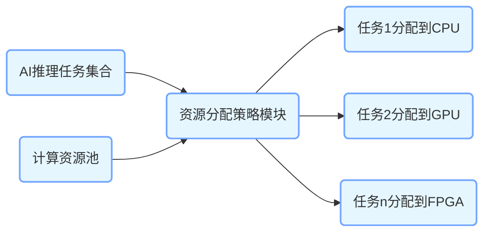

# 优化AI推理效率:计算资源分配策略

> 关键词：AI推理效率、计算资源分配、策略优化、深度学习、硬件加速

> 摘要：本文围绕优化AI推理效率的计算资源分配策略展开深入探讨。在AI技术飞速发展的当下，推理效率成为制约其广泛应用的关键因素，合理的计算资源分配对于提升AI推理性能至关重要。文章将详细介绍相关核心概念、算法原理、数学模型，通过项目实战案例展示具体实现过程，分析实际应用场景，推荐学习资源、开发工具及相关论文著作，最后总结未来发展趋势与挑战，为从业者和研究者提供全面而深入的参考。

## 1. 背景介绍 
### 1.1 目的和范围
随着人工智能的不断发展，AI推理在各个领域的应用越来越广泛，如自动驾驶、智能安防、医疗诊断等。然而，AI推理过程通常需要大量的计算资源，计算资源的有限性和AI推理任务的复杂性之间的矛盾日益突出。本文的目的在于探讨如何优化计算资源的分配，以提高AI推理效率，减少推理延迟，降低计算成本。范围涵盖了从理论概念到实际应用的各个方面，包括核心算法、数学模型、项目实战以及实际应用场景等。

### 1.2 预期读者
本文预期读者包括人工智能领域的研究者、开发者、工程师，以及对AI推理效率和计算资源分配感兴趣的技术爱好者。对于正在从事AI项目开发的人员，可从中获取优化推理效率的实用策略和方法；对于研究者，可作为进一步深入研究的参考资料；对于技术爱好者，有助于了解AI推理背后的技术原理和资源分配的重要性。

### 1.3 文档结构概述
本文将按照以下结构进行阐述：首先介绍相关背景知识，包括目的、预期读者和文档结构概述；接着详细讲解核心概念与联系，通过文本示意图和Mermaid流程图进行说明；然后阐述核心算法原理和具体操作步骤，并使用Python源代码进行详细阐述；再介绍数学模型和公式，并通过举例进行说明；之后通过项目实战展示代码实际案例和详细解释；分析实际应用场景；推荐相关的工具和资源；最后总结未来发展趋势与挑战，提供常见问题与解答以及扩展阅读和参考资料。

### 1.4 术语表
#### 1.4.1 核心术语定义
- **AI推理**：指在训练好的人工智能模型基础上，对新的数据进行预测或分类的过程。
- **计算资源**：包括CPU、GPU、FPGA等硬件设备的计算能力、内存、存储等资源。
- **资源分配策略**：根据不同的目标和约束条件，将计算资源合理地分配给不同的AI推理任务的方法和规则。
- **推理效率**：衡量AI推理过程中资源利用效率和性能的指标，通常用推理延迟、吞吐量等表示。

#### 1.4.2 相关概念解释
- **深度学习模型**：一种基于人工神经网络的机器学习模型，通常包含多个隐藏层，能够自动从大量数据中学习特征和模式。
- **硬件加速**：利用专门的硬件设备（如GPU、FPGA等）来加速计算过程，提高计算效率。
- **任务调度**：根据任务的优先级、资源需求等因素，合理安排任务的执行顺序和资源分配。

#### 1.4.3 缩略词列表
- **CPU**：Central Processing Unit，中央处理器
- **GPU**：Graphics Processing Unit，图形处理器
- **FPGA**：Field - Programmable Gate Array，现场可编程门阵列
- **DNN**：Deep Neural Network，深度神经网络
- **RNN**：Recurrent Neural Network，循环神经网络

## 2. 核心概念与联系 

### 核心概念原理
AI推理效率与计算资源分配密切相关。AI推理任务通常基于深度学习模型，这些模型包含大量的参数和计算操作，需要消耗大量的计算资源。计算资源的分配直接影响到推理任务的执行速度和性能。合理的资源分配可以充分利用计算设备的性能，减少推理延迟，提高吞吐量。

例如，在一个多任务的AI推理环境中，不同的任务可能具有不同的计算复杂度和资源需求。如果将所有的任务都分配到同一个计算设备上，可能会导致设备过载，从而影响推理效率。相反，如果根据任务的特点和设备的性能，将任务合理地分配到不同的计算设备上，就可以充分发挥各个设备的优势，提高整体的推理效率。

### 架构的文本示意图
```plaintext
计算资源池
|-- CPU
|-- GPU
|-- FPGA

AI推理任务集合
|-- 任务1
|-- 任务2
|-- ...
|-- 任务n

资源分配策略模块
|-- 任务分析
|-- 设备性能评估
|-- 分配算法

连接关系：
资源分配策略模块根据任务分析和设备性能评估结果，使用分配算法将AI推理任务集合中的任务分配到计算资源池中的不同设备上。
```

### Mermaid流程图


## 3. 核心算法原理 & 具体操作步骤 

### 算法原理
一种常见的计算资源分配策略是基于任务的计算复杂度和设备的性能进行分配。具体步骤如下：
1. **任务分析**：对每个AI推理任务进行分析，计算其计算复杂度，例如可以通过模型的参数数量、计算操作的数量等指标来衡量。
2. **设备性能评估**：评估计算资源池中各个设备的性能，例如CPU的计算速度、GPU的浮点运算能力、FPGA的并行处理能力等。
3. **分配算法**：根据任务的计算复杂度和设备的性能，将任务分配到最合适的设备上。可以使用贪心算法、动态规划算法等。

### Python源代码详细阐述
```python
# 定义任务类
class Task:
    def __init__(self, id, complexity):
        self.id = id
        self.complexity = complexity

# 定义设备类
class Device:
    def __init__(self, id, performance):
        self.id = id
        self.performance = performance
        self.tasks = []

    def add_task(self, task):
        self.tasks.append(task)

# 资源分配函数，使用贪心算法
def resource_allocation(tasks, devices):
    for task in tasks:
        best_device = None
        min_time = float('inf')
        for device in devices:
            # 计算任务在该设备上的执行时间
            execution_time = task.complexity / device.performance
            if execution_time < min_time:
                min_time = execution_time
                best_device = device
        # 将任务分配到最佳设备上
        best_device.add_task(task)
    return devices

# 示例使用
tasks = [Task(1, 100), Task(2, 200), Task(3, 150)]
devices = [Device(1, 50), Device(2, 100), Device(3, 80)]

allocated_devices = resource_allocation(tasks, devices)

# 输出分配结果
for device in allocated_devices:
    print(f"Device {device.id} has tasks:")
    for task in device.tasks:
        print(f"  Task {task.id} with complexity {task.complexity}")
```

### 具体操作步骤
1. **数据准备**：收集AI推理任务的相关信息，如计算复杂度；收集计算设备的性能信息。
2. **任务和设备对象创建**：根据收集到的信息，创建任务对象和设备对象。
3. **调用资源分配函数**：将任务对象列表和设备对象列表作为参数传递给资源分配函数，得到分配结果。
4. **结果处理**：根据分配结果，将任务分配到相应的设备上进行执行。

## 4. 数学模型和公式 & 详细讲解 & 举例说明 

### 数学模型
设任务集合为 $T = \{t_1, t_2, \cdots, t_n\}$，设备集合为 $D = \{d_1, d_2, \cdots, d_m\}$。任务 $t_i$ 的计算复杂度为 $c_i$，设备 $d_j$ 的性能为 $p_j$。设 $x_{ij}$ 为一个二进制变量，如果任务 $t_i$ 分配到设备 $d_j$ 上，则 $x_{ij} = 1$，否则 $x_{ij} = 0$。

目标是最小化所有任务的总执行时间，即：
$$\min \sum_{i = 1}^{n} \sum_{j = 1}^{m} \frac{c_i x_{ij}}{p_j}$$

约束条件：
1. 每个任务只能分配到一个设备上：
$$\sum_{j = 1}^{m} x_{ij} = 1, \quad i = 1, 2, \cdots, n$$
2. $x_{ij}$ 为二进制变量：
$$x_{ij} \in \{0, 1\}, \quad i = 1, 2, \cdots, n; j = 1, 2, \cdots, m$$

### 详细讲解
这个数学模型的目标是通过合理的资源分配，使得所有任务的总执行时间最短。约束条件保证了每个任务只能分配到一个设备上，并且分配变量 $x_{ij}$ 只能取 0 或 1。

### 举例说明
假设有两个任务 $t_1$ 和 $t_2$，计算复杂度分别为 $c_1 = 100$ 和 $c_2 = 200$。有两个设备 $d_1$ 和 $d_2$，性能分别为 $p_1 = 50$ 和 $p_2 = 100$。

根据数学模型，我们需要求解以下优化问题：
目标函数：
$$\min \left(\frac{100x_{11}}{50} + \frac{100x_{12}}{100} + \frac{200x_{21}}{50} + \frac{200x_{22}}{100}\right)$$

约束条件：
$$x_{11} + x_{12} = 1$$
$$x_{21} + x_{22} = 1$$
$$x_{11}, x_{12}, x_{21}, x_{22} \in \{0, 1\}$$

通过求解这个优化问题，我们可以得到最优的资源分配方案。例如，当 $x_{12} = 1$，$x_{21} = 1$，$x_{11} = 0$，$x_{22} = 0$ 时，总执行时间为 $\frac{100\times0}{50} + \frac{100\times1}{100} + \frac{200\times1}{50} + \frac{200\times0}{100} = 1 + 4 = 5$。

## 5. 项目实战：代码实际案例和详细解释说明 

### 5.1  开发环境搭建
1. **硬件环境**：选择合适的计算设备，如CPU、GPU等。如果使用GPU，需要确保GPU驱动程序已正确安装。
2. **软件环境**：安装Python开发环境，建议使用Python 3.6及以上版本。安装深度学习框架，如TensorFlow、PyTorch等。安装相关的依赖库，如NumPy、Pandas等。

### 5.2  源代码详细实现和代码解读
以下是一个基于PyTorch的AI推理任务资源分配的实际案例：
```python
import torch
import torchvision.models as models
import time

# 定义任务类
class InferenceTask:
    def __init__(self, model_name, input_size):
        self.model_name = model_name
        self.input_size = input_size
        self.model = getattr(models, model_name)(pretrained=True)
        self.model.eval()

    def inference(self, device):
        self.model.to(device)
        input_tensor = torch.randn(self.input_size).to(device)
        start_time = time.time()
        with torch.no_grad():
            _ = self.model(input_tensor)
        end_time = time.time()
        return end_time - start_time

# 定义设备类
class ComputeDevice:
    def __init__(self, device_type):
        self.device_type = device_type
        self.device = torch.device(device_type)
        self.tasks = []

    def add_task(self, task):
        self.tasks.append(task)

    def execute_tasks(self):
        total_time = 0
        for task in self.tasks:
            execution_time = task.inference(self.device)
            total_time += execution_time
            print(f"Task {task.model_name} on {self.device_type} took {execution_time} seconds")
        return total_time

# 资源分配函数
def resource_allocation(tasks, devices):
    for task in tasks:
        best_device = None
        min_time = float('inf')
        for device in devices:
            # 模拟任务在该设备上的执行时间
            test_time = task.inference(device.device)
            if test_time < min_time:
                min_time = test_time
                best_device = device
        # 将任务分配到最佳设备上
        best_device.add_task(task)
    return devices

# 示例使用
tasks = [InferenceTask('resnet18', (1, 3, 224, 224)), InferenceTask('vgg16', (1, 3, 224, 224))]
devices = [ComputeDevice('cpu'), ComputeDevice('cuda' if torch.cuda.is_available() else 'cpu')]

allocated_devices = resource_allocation(tasks, devices)

# 执行任务
total_time = 0
for device in allocated_devices:
    device_total_time = device.execute_tasks()
    total_time += device_total_time

print(f"Total execution time: {total_time} seconds")
```

### 代码解读与分析
1. **InferenceTask类**：表示一个AI推理任务，包含模型名称、输入大小、模型对象等属性。`inference` 方法用于在指定设备上执行推理任务，并返回执行时间。
2. **ComputeDevice类**：表示一个计算设备，包含设备类型、设备对象和任务列表等属性。`add_task` 方法用于添加任务，`execute_tasks` 方法用于执行所有任务并返回总执行时间。
3. **resource_allocation函数**：使用贪心算法将任务分配到最合适的设备上。通过模拟任务在每个设备上的执行时间，选择执行时间最短的设备进行分配。
4. **主程序**：创建任务对象和设备对象，调用资源分配函数进行任务分配，然后执行所有任务并输出总执行时间。

## 6. 实际应用场景 
### 自动驾驶
在自动驾驶系统中，AI推理任务包括目标检测、场景识别、路径规划等。这些任务需要实时处理大量的传感器数据，对推理效率要求极高。合理的计算资源分配可以确保各个任务在不同的计算设备上高效执行，提高自动驾驶系统的安全性和可靠性。

例如，将目标检测任务分配到GPU上，利用其强大的并行计算能力快速处理图像数据；将路径规划任务分配到CPU上，利用其灵活的控制能力进行复杂的逻辑计算。

### 智能安防
智能安防系统中，AI推理任务包括人脸识别、行为分析、视频监控等。这些任务需要处理大量的视频流数据，对计算资源的需求较大。通过优化计算资源分配，可以提高系统的实时性和准确性。

例如，将人脸识别任务分配到FPGA上，利用其可重构性和低延迟的特点，快速准确地识别人员身份；将行为分析任务分配到GPU上，利用其高效的计算能力进行复杂的行为模式分析。

### 医疗诊断
在医疗诊断领域，AI推理任务包括医学图像分析、疾病预测等。这些任务需要处理高精度的医学图像数据和复杂的医疗数据，对计算资源和推理精度要求都很高。合理的资源分配可以提高诊断的准确性和效率。

例如，将医学图像分析任务分配到专门的医疗影像处理设备上，利用其专业的图像处理能力进行图像特征提取和分析；将疾病预测任务分配到高性能的服务器上，利用其强大的计算能力进行数据挖掘和模型训练。

## 7. 工具和资源推荐
### 7.1 学习资源推荐
#### 7.1.1 书籍推荐
- 《深度学习》（Deep Learning）：由Ian Goodfellow、Yoshua Bengio和Aaron Courville撰写，是深度学习领域的经典教材，全面介绍了深度学习的理论和实践。
- 《Python深度学习》（Deep Learning with Python）：由Francois Chollet撰写，结合Keras框架详细介绍了如何使用Python进行深度学习开发。
- 《人工智能：一种现代的方法》（Artificial Intelligence: A Modern Approach）：由Stuart Russell和Peter Norvig撰写，是人工智能领域的权威著作，涵盖了AI的各个方面。

#### 7.1.2 在线课程
- Coursera上的“深度学习专项课程”（Deep Learning Specialization）：由Andrew Ng教授授课，系统介绍了深度学习的基础知识和应用。
- edX上的“人工智能导论”（Introduction to Artificial Intelligence）：由麻省理工学院（MIT）提供，介绍了人工智能的基本概念和算法。
- Udemy上的“Python for Data Science and Machine Learning Bootcamp”：通过实际项目介绍了Python在数据科学和机器学习中的应用。

#### 7.1.3 技术博客和网站
- Medium：有很多关于人工智能和深度学习的技术博客，如Towards Data Science等。
- arXiv：提供了