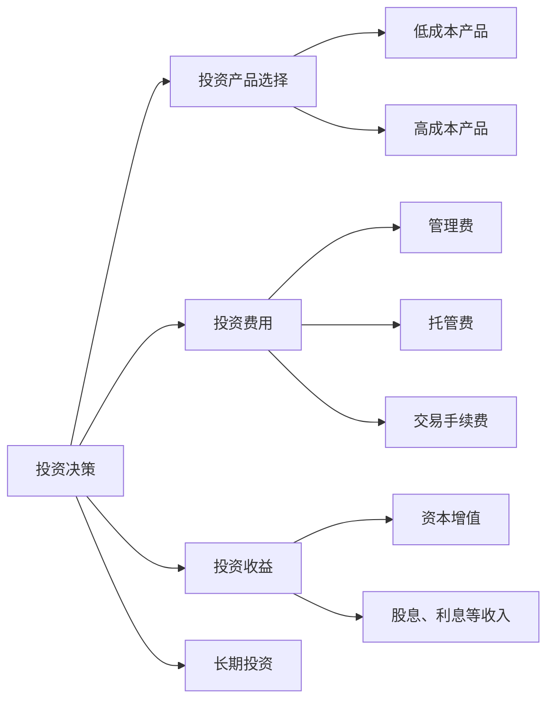

# 伯格的低成本投资策略：为什么费用很重要

> 关键词：伯格低成本投资策略、投资费用、投资收益、成本控制、长期投资

> 摘要：本文深入探讨了伯格的低成本投资策略，着重分析了投资费用在投资过程中的重要性。通过阐述核心概念、算法原理、数学模型，结合实际案例，展示了费用对投资收益的显著影响。同时介绍了该策略在实际中的应用场景，推荐了相关的学习资源、开发工具和论文著作。最后对低成本投资策略的未来发展趋势与挑战进行了总结，并提供了常见问题解答和扩展阅读参考资料。

## 1. 背景介绍 
### 1.1 目的和范围
本文旨在全面剖析伯格的低成本投资策略，详细解释为什么投资费用在投资决策中起着至关重要的作用。范围涵盖了该策略的核心概念、算法原理、数学模型、实际案例以及未来发展等多个方面，帮助读者深入理解低成本投资策略的本质和价值。

### 1.2 预期读者
本文预期读者包括对投资领域感兴趣的初学者、有一定投资经验但希望优化投资策略的投资者、金融专业学生以及从事金融投资研究的专业人士。通过阅读本文，读者能够获得关于低成本投资策略的系统知识和实践指导。

### 1.3 文档结构概述
本文将按照以下结构进行阐述：首先介绍相关核心概念和它们之间的联系；接着讲解核心算法原理和具体操作步骤，并结合Python代码进行详细说明；然后给出数学模型和公式，并通过举例进行详细讲解；再通过项目实战展示实际案例和代码解读；之后介绍该策略的实际应用场景；推荐相关的工具和资源；总结未来发展趋势与挑战；提供常见问题与解答；最后列出扩展阅读和参考资料。

### 1.4 术语表
#### 1.4.1 核心术语定义
- **伯格低成本投资策略**：由约翰·伯格（John C. Bogle）提出的一种投资策略，强调通过降低投资费用来提高长期投资收益。该策略主张投资者选择低成本的投资产品，如指数基金，以减少费用对收益的侵蚀。
- **投资费用**：投资者在进行投资过程中需要支付的各种费用，包括管理费、托管费、交易手续费等。这些费用会直接从投资资产中扣除，对投资收益产生负面影响。
- **投资收益**：投资者通过投资所获得的回报，包括资本增值和股息、利息等收入。投资收益是衡量投资效果的重要指标。
- **长期投资**：指投资者将资金投入某项资产并持有较长时间，通常为数年甚至数十年。长期投资的目的是通过资产的长期增值获得较高的收益。

#### 1.4.2 相关概念解释
- **指数基金**：一种按照特定指数的成分股构成及其权重进行投资的基金产品。指数基金的目标是复制指数的表现，其管理费用通常较低，是伯格低成本投资策略中常用的投资工具。
- **主动管理型基金**：由基金经理主动选择投资标的，试图通过选股和择时来获得超越市场平均水平的收益。与指数基金相比，主动管理型基金的管理费用较高。

#### 1.4.3 缩略词列表
- **ETF**：交易型开放式指数基金（Exchange Traded Fund），是一种在证券交易所上市交易的、基金份额可变的开放式基金，通常跟踪特定的指数。
- **ROI**：投资回报率（Return on Investment），是指通过投资而应返回的价值，即企业从一项投资活动中得到的经济回报。

## 2. 核心概念与联系 

### 核心概念原理
伯格的低成本投资策略基于一个简单而深刻的原理：投资费用会对投资收益产生显著的负面影响。在长期投资过程中，即使是看似微小的费用差异，也可能在复利的作用下导致巨大的收益差距。

例如，假设投资者A和投资者B都投资了10万元，预期年化收益率为8%。投资者A选择了一只管理费为0.5%的指数基金，而投资者B选择了一只管理费为2%的主动管理型基金。在30年后，投资者A的资产将增长到约100.63万元，而投资者B的资产仅增长到约60.29万元。可以看出，仅仅是1.5%的费用差异，在30年的时间里就导致了约40万元的收益差距。

### 架构的文本示意图
```plaintext
投资决策
|
|-- 投资产品选择
|   |-- 低成本产品（指数基金等）
|   |-- 高成本产品（主动管理型基金等）
|
|-- 投资费用
|   |-- 管理费
|   |-- 托管费
|   |-- 交易手续费
|
|-- 投资收益
|   |-- 资本增值
|   |-- 股息、利息等收入
|
|-- 长期投资
```

### Mermaid 流程图


## 3. 核心算法原理 & 具体操作步骤 

### 核心算法原理
为了更好地理解费用对投资收益的影响，我们可以使用复利计算公式。复利是指在每一个计息期后，将所生利息加入本金再计利息。复利计算公式为：

$$A = P(1 + r - f)^n$$

其中：
- $A$ 表示最终的投资资产总额
- $P$ 表示初始投资本金
- $r$ 表示年化收益率
- $f$ 表示年化费用率
- $n$ 表示投资年限

### 具体操作步骤
以下是基于上述算法原理的具体操作步骤：

1. **确定初始投资本金 $P$**：根据自己的财务状况和投资目标，确定初始投资的金额。
2. **预估年化收益率 $r$**：参考历史数据和市场情况，预估投资产品的年化收益率。需要注意的是，年化收益率是一个预估指标，实际收益可能会有所波动。
3. **确定年化费用率 $f$**：了解投资产品的各项费用，计算出年化费用率。
4. **确定投资年限 $n$**：根据自己的投资目标和风险承受能力，确定投资的年限。
5. **计算最终投资资产总额 $A$**：将上述参数代入复利计算公式，计算出最终的投资资产总额。

### Python源代码实现
```python
def calculate_investment_return(principal, annual_return_rate, annual_fee_rate, years):
    """
    计算考虑费用后的投资收益
    :param principal: 初始投资本金
    :param annual_return_rate: 年化收益率
    :param annual_fee_rate: 年化费用率
    :param years: 投资年限
    :return: 最终投资资产总额
    """
    return principal * (1 + annual_return_rate - annual_fee_rate) ** years

# 示例参数
principal = 100000  # 初始投资本金为10万元
annual_return_rate = 0.08  # 年化收益率为8%
annual_fee_rate_1 = 0.005  # 低成本产品年化费用率为0.5%
annual_fee_rate_2 = 0.02  # 高成本产品年化费用率为2%
years = 30  # 投资年限为30年

# 计算低成本产品的最终投资资产总额
final_amount_1 = calculate_investment_return(principal, annual_return_rate, annual_fee_rate_1, years)
# 计算高成本产品的最终投资资产总额
final_amount_2 = calculate_investment_return(principal, annual_return_rate, annual_fee_rate_2, years)

print(f"低成本产品（费用率 {annual_fee_rate_1 * 100}%）30年后的资产总额: {final_amount_1:.2f} 元")
print(f"高成本产品（费用率 {annual_fee_rate_2 * 100}%）30年后的资产总额: {final_amount_2:.2f} 元")
print(f"费用差异导致的收益差距: {final_amount_1 - final_amount_2:.2f} 元")
```

### 代码解释
上述代码定义了一个名为 `calculate_investment_return` 的函数，用于计算考虑费用后的投资收益。函数接受四个参数：初始投资本金、年化收益率、年化费用率和投资年限，并返回最终的投资资产总额。

在主程序中，我们设置了示例参数，分别计算了低成本产品和高成本产品在30年后的投资资产总额，并输出了两者的收益差距。通过这个示例，我们可以直观地看到费用对投资收益的影响。

## 4. 数学模型和公式 & 详细讲解 & 举例说明 

### 数学模型和公式
我们使用的数学模型基于复利计算公式：

$$A = P(1 + r - f)^n$$

其中：
- $A$ 表示最终的投资资产总额
- $P$ 表示初始投资本金
- $r$ 表示年化收益率
- $f$ 表示年化费用率
- $n$ 表示投资年限

### 详细讲解
这个公式的核心思想是考虑了投资过程中的费用因素。在每一年的投资中，实际的收益率为年化收益率减去年化费用率。随着投资年限的增加，复利的作用会使得最终的投资资产总额产生显著的差异。

例如，当 $P = 100000$，$r = 0.08$，$f = 0.005$，$n = 30$ 时：

$$A = 100000\times(1 + 0.08 - 0.005)^{30}$$

先计算括号内的值：$1 + 0.08 - 0.005 = 1.075$

然后计算指数部分：$1.075^{30} \approx 8.063$

最后计算最终结果：$A = 100000\times8.063 = 806300$

### 举例说明
假设投资者小李和小张都有10万元的初始资金，他们都预期年化收益率为7%，但选择了不同费用率的投资产品。小李选择了一只费用率为0.2%的指数基金，小张选择了一只费用率为1.5%的主动管理型基金。他们都打算投资20年。

对于小李：
$P = 100000$，$r = 0.07$，$f = 0.002$，$n = 20$

$$A_{小李} = 100000\times(1 + 0.07 - 0.002)^{20}$$
$$A_{小李} = 100000\times(1.068)^{20}$$
$$A_{小李} \approx 367897.72$$

对于小张：
$P = 100000$，$r = 0.07$，$f = 0.015$，$n = 20$

$$A_{小张} = 100000\times(1 + 0.07 - 0.015)^{20}$$
$$A_{小张} = 100000\times(1.055)^{20}$$
$$A_{小张} \approx 291775.74$$

可以看出，仅仅是1.3%的费用差异，在20年后就导致了约76121.98元的收益差距。这充分说明了费用对投资收益的重要影响。

## 5. 项目实战：代码实际案例和详细解释说明 

### 5.1  开发环境搭建
为了运行我们的Python代码，需要搭建以下开发环境：

1. **Python安装**：从Python官方网站（https://www.python.org/downloads/）下载并安装Python 3.x版本。
2. **代码编辑器**：推荐使用Visual Studio Code、PyCharm等代码编辑器。这些编辑器提供了丰富的功能，如代码高亮、自动补全、调试等，能够提高开发效率。
3. **安装必要的库**：我们的代码只使用了Python的内置库，不需要额外安装其他库。

### 5.2  源代码详细实现和代码解读
以下是完整的源代码：

```python
def calculate_investment_return(principal, annual_return_rate, annual_fee_rate, years):
    """
    计算考虑费用后的投资收益
    :param principal: 初始投资本金
    :param annual_return_rate: 年化收益率
    :param annual_fee_rate: 年化费用率
    :param years: 投资年限
    :return: 最终投资资产总额
    """
    return principal * (1 + annual_return_rate - annual_fee_rate) ** years

# 示例参数
principal = 100000  # 初始投资本金为10万元
annual_return_rate = 0.08  # 年化收益率为8%
annual_fee_rate_1 = 0.005  # 低成本产品年化费用率为0.5%
annual_fee_rate_2 = 0.02  # 高成本产品年化费用率为2%
years = 30  # 投资年限为30年

# 计算低成本产品的最终投资资产总额
final_amount_1 = calculate_investment_return(principal, annual_return_rate, annual_fee_rate_1, years)
# 计算高成本产品的最终投资资产总额
final_amount_2 = calculate_investment_return(principal, annual_return_rate, annual_fee_rate_2, years)

print(f"低成本产品（费用率 {annual_fee_rate_1 * 100}%）30年后的资产总额: {final_amount_1:.2f} 元")
print(f"高成本产品（费用率 {annual_fee_rate_2 * 100}%）30年后的资产总额: {final_amount_2:.2f} 元")
print(f"费用差异导致的收益差距: {final_amount_1 - final_amount_2:.2f} 元")
```

### 代码解读
1. **函数定义**：`calculate_investment_return` 函数接受四个参数：初始投资本金、年化收益率、年化费用率和投资年限。函数内部使用复利计算公式计算最终的投资资产总额，并返回结果。
2. **示例参数设置**：在主程序中，我们设置了初始投资本金为10万元，年化收益率为8%，低成本产品年化费用率为0.5%，高成本产品年化费用率为2%，投资年限为30年。
3. **计算最终投资资产总额**：调用 `calculate_investment_return` 函数分别计算低成本产品和高成本产品在30年后的投资资产总额。
4. **输出结果**：使用 `print` 函数输出低成本产品和高成本产品的最终投资资产总额，以及费用差异导致的收益差距。

### 5.3  代码解读与分析
通过这个代码示例，我们可以直观地看到费用对投资收益的影响。在实际投资中，投资者应该尽量选择费用较低的投资产品，以提高长期投资收益。

同时，我们可以对代码进行扩展，例如增加更多的投资产品选项，计算不同投资组合的收益情况，或者绘制投资收益曲线等，以便更好地进行投资决策。

## 6. 实际应用场景 
### 个人投资者
对于个人投资者来说，伯格的低成本投资策略具有重要的实际应用价值。个人投资者通常资金规模较小，投资经验相对不足，因此费用对他们的投资收益影响更为显著。

个人投资者可以选择投资低成本的指数基金，如沪深300指数基金、中证500指数基金等。这些指数基金能够跟踪市场指数的表现，具有分散风险、费用低廉等优点。通过长期持有指数基金，个人投资者可以获得市场平均水平的收益，同时避免了主动管理型基金可能存在的高费用和业绩波动风险。

### 机构投资者
机构投资者如养老基金、保险公司等，通常管理着大量的资金，投资期限较长。在这种情况下，费用对投资收益的影响也不容忽视。

机构投资者可以采用伯格的低成本投资策略，优化投资组合，降低投资费用。例如，机构投资者可以增加指数基金的投资比例，减少主动管理型基金的投资。同时，机构投资者还可以通过与基金管理公司谈判，争取更低的管理费用。

### 投资顾问
投资顾问在为客户提供投资建议时，也应该考虑费用因素。投资顾问可以向客户介绍伯格的低成本投资策略，帮助客户选择费用较低的投资产品。

投资顾问可以通过分析客户的投资目标、风险承受能力和投资期限，为客户制定个性化的投资方案。在方案中，投资顾问可以推荐一些低成本的指数基金、ETF等投资产品，并向客户解释费用对投资收益的影响，帮助客户做出明智的投资决策。

## 7. 工具和资源推荐
### 7.1 学习资源推荐
#### 7.1.1 书籍推荐
- 《聪明的投资者》（The Intelligent Investor）：本杰明·格雷厄姆（Benjamin Graham）著，这本书是价值投资的经典之作，介绍了许多投资的基本原则和方法，对理解投资费用的重要性也有很大帮助。
- 《共同基金常识》（Common Sense on Mutual Funds）：约翰·伯格（John C. Bogle）著，作者是低成本投资策略的倡导者，书中详细阐述了低成本投资的理念和方法。
- 《漫步华尔街》（A Random Walk Down Wall Street）：伯顿·马尔基尔（Burton G. Malkiel）著，这本书介绍了有效市场假说和随机漫步理论，对投资者理解市场和选择投资产品具有重要的指导意义。

#### 7.1.2 在线课程
- Coursera平台上的“投资学原理”（Principles of Investing）课程：该课程由知名教授授课，涵盖了投资的基本概念、资产定价、投资组合理论等内容，对初学者非常友好。
- edX平台上的“金融市场”（Financial Markets）课程：该课程由耶鲁大学教授罗伯特·席勒（Robert J. Shiller）授课，深入讲解了金融市场的运作机制和投资策略。

#### 7.1.3 技术博客和网站
- 雪球网（https://xueqiu.com/）：国内知名的投资社区，提供了丰富的投资资讯、研究报告和投资者交流平台。
- 晨星网（https://cn.morningstar.com/）：全球著名的基金评级机构，提供基金评级、分析报告等服务，帮助投资者选择合适的基金产品。

### 7.2 开发工具框架推荐
#### 7.2.1 IDE和编辑器
- Visual Studio Code：一款轻量级的代码编辑器，支持多种编程语言，具有丰富的插件和扩展功能，适合Python开发。
- PyCharm：专业的Python集成开发环境，提供了强大的代码编辑、调试、测试等功能，适合大型Python项目的开发。

#### 7.2.2 调试和性能分析工具
- pdb：Python的内置调试器，可以帮助开发者定位和解决代码中的问题。
- cProfile：Python的性能分析工具，可以分析代码的运行时间和函数调用情况，帮助开发者优化代码性能。

#### 7.2.3 相关框架和库
- Pandas：用于数据处理和分析的Python库，提供了高效的数据结构和数据操作方法，适合处理投资数据。
- Matplotlib：用于数据可视化的Python库，可以绘制各种图表，如折线图、柱状图、散点图等，帮助投资者直观地展示投资数据。

### 7.3 相关论文著作推荐
#### 7.3.1 经典论文
- “The Arithmetic of Active Management”：作者是威廉·夏普（William F. Sharpe），这篇论文从数学角度证明了主动管理型基金在扣除费用后很难战胜市场指数。
- “Random Walks in Stock Market Prices”：作者是保罗·库特纳（Paul H. Cootner），这篇论文提出了股票价格的随机漫步理论，对有效市场假说的发展起到了重要作用。

#### 7.3.2 最新研究成果
- 可以关注《金融研究》《经济研究》等国内权威金融经济期刊，以及《Journal of Finance》《The Review of Financial Studies》等国际知名金融学术期刊，获取最新的投资研究成果。

#### 7.3.3 应用案例分析
- 可以参考一些金融机构的研究报告和案例分析，了解低成本投资策略在实际中的应用效果和经验教训。例如，一些大型基金公司会发布关于指数基金投资的研究报告和案例分析，对投资者具有一定的参考价值。

## 8. 总结：未来发展趋势与挑战
### 未来发展趋势
- **低成本投资产品的普及**：随着投资者对费用的关注度不断提高，低成本投资产品如指数基金、ETF等将越来越受到欢迎。未来，这些产品的规模有望继续扩大，市场份额也将不断提高。
- **科技与投资的融合**：科技的发展将为低成本投资策略带来更多的机遇。例如，人工智能、大数据等技术可以帮助投资者更好地分析市场数据，选择合适的投资产品，降低投资风险。同时，区块链技术的应用也有望提高投资交易的效率和透明度，进一步降低投资成本。
- **全球投资市场的一体化**：随着全球经济的一体化和金融市场的互联互通，投资者将有更多的机会进行全球投资。低成本投资策略可以帮助投资者在全球范围内分散风险，获取更广泛的投资收益。

### 挑战
- **市场竞争加剧**：随着低成本投资产品的普及，市场竞争将越来越激烈。基金管理公司可能会通过降低费用来吸引投资者，这可能会导致行业利润率下降。同时，市场竞争也可能会导致一些低质量的低成本投资产品出现，投资者需要更加谨慎地选择投资产品。
- **投资者教育不足**：虽然低成本投资策略具有很多优点，但很多投资者对其了解还不够深入。投资者教育的不足可能会导致投资者在投资过程中做出错误的决策，影响投资收益。因此，需要加强投资者教育，提高投资者对低成本投资策略的认识和理解。
- **市场波动风险**：尽管低成本投资策略可以降低投资成本，但并不能完全消除市场波动风险。在市场行情不佳的情况下，即使是低成本的投资产品也可能会出现亏损。投资者需要具备一定的风险承受能力和投资经验，合理配置资产，以应对市场波动风险。

## 9. 附录：常见问题与解答
### 问题1：低成本投资策略是否适用于所有投资者？
答：低成本投资策略适用于大多数投资者，尤其是那些投资期限较长、风险承受能力较低、追求市场平均收益的投资者。但对于一些具有较高投资经验和专业知识、追求超越市场平均收益的投资者来说，可能会选择主动管理型基金或其他投资策略。

### 问题2：如何选择低成本的投资产品？
答：选择低成本的投资产品可以从以下几个方面入手：
1. 关注基金的管理费用和托管费用，选择费用较低的基金产品。
2. 优先考虑指数基金和ETF，这些产品通常具有较低的费用。
3. 比较不同基金公司的同类产品，选择费用最低的产品。

### 问题3：费用对投资收益的影响有多大？
答：费用对投资收益的影响取决于投资期限、年化收益率和费用率等因素。在长期投资过程中，即使是看似微小的费用差异，也可能在复利的作用下导致巨大的收益差距。例如，在前面的例子中，1.5%的费用差异在30年后导致了约40万元的收益差距。

### 问题4：低成本投资策略是否意味着放弃追求高收益？
答：低成本投资策略并不意味着放弃追求高收益。该策略的核心是通过降低费用来提高长期投资收益。在市场行情较好的情况下，低成本的投资产品也可以获得较高的收益。同时，通过长期持有和分散投资，投资者可以在一定程度上降低风险，实现稳健的投资收益。

## 10. 扩展阅读 & 参考资料
### 扩展阅读
- 《投资中最简单的事》：邱国鹭著，这本书介绍了一些简单实用的投资方法和理念，对投资者具有一定的启发作用。
- 《金融炼金术》（The Alchemy of Finance）：乔治·索罗斯（George Soros）著，作者是著名的投资家，书中介绍了他的投资哲学和操作方法。

### 参考资料
- John C. Bogle, “Common Sense on Mutual Funds: New Imperatives for the Intelligent Investor”, Wiley, 2009.
- Benjamin Graham, “The Intelligent Investor: The Definitive Book on Value Investing. A Book of Practical Counsel”, HarperBusiness, 2003.
- Burton G. Malkiel, “A Random Walk Down Wall Street: The Time-Tested Strategy for Successful Investing”, W. W. Norton & Company, 2019.

作者：AI天才研究院/AI Genius Institute & 禅与计算机程序设计艺术 /Zen And The Art of Computer Programming