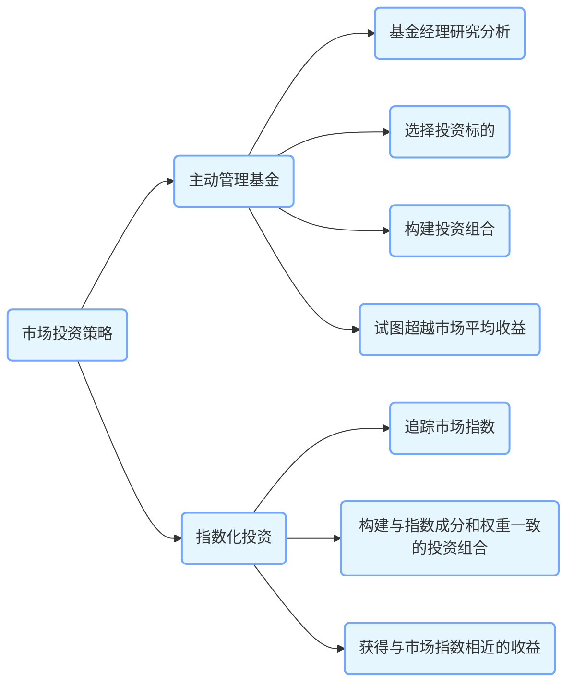

# 伯格的指数化投资：应对主动管理基金表现不佳的解决方案

> 关键词：伯格指数化投资、主动管理基金、投资策略、市场效率、长期收益

> 摘要：本文深入探讨了伯格的指数化投资策略，旨在为解决主动管理基金表现不佳的问题提供有效方案。通过对指数化投资的核心概念、算法原理、数学模型等方面进行详细分析，并结合实际案例展示其应用。同时，介绍了相关的学习资源、开发工具以及研究成果，最后对指数化投资的未来发展趋势与挑战进行了总结，帮助投资者更好地理解和应用这一投资策略。

## 1. 背景介绍 
### 1.1 目的和范围
在金融投资领域，主动管理基金一直是投资者的重要选择之一。然而，越来越多的研究和实际数据表明，主动管理基金在长期表现上往往难以超越市场平均水平。伯格的指数化投资理念正是在这样的背景下应运而生。本文的目的是详细介绍伯格的指数化投资策略，分析其如何应对主动管理基金表现不佳的问题，探讨其原理、应用和发展前景。范围涵盖指数化投资的基本概念、核心算法、数学模型、实际案例以及相关的工具和资源等方面。

### 1.2 预期读者
本文预期读者包括金融投资者、投资顾问、金融分析师、金融专业学生以及对金融投资领域感兴趣的人士。无论是希望优化投资组合的个人投资者，还是需要为客户提供专业建议的投资顾问，都可以从本文中获得有关指数化投资的深入理解和实用信息。

### 1.3 文档结构概述
本文将按照以下结构进行阐述：首先介绍核心概念与联系，明确指数化投资和主动管理基金的定义、特点以及它们之间的关系；接着详细讲解核心算法原理和具体操作步骤，并通过 Python 代码进行示例；然后介绍数学模型和公式，结合实际例子进行说明；再通过项目实战展示指数化投资在实际中的应用；之后探讨实际应用场景；推荐相关的工具和资源；最后总结指数化投资的未来发展趋势与挑战，并提供常见问题解答和扩展阅读参考资料。

### 1.4 术语表
#### 1.4.1 核心术语定义
- **指数化投资**：一种投资策略，通过构建投资组合来追踪特定市场指数的表现，旨在获得与市场指数相近的收益。
- **主动管理基金**：由基金经理通过积极的研究和分析，选择投资标的，试图超越市场平均水平的基金。
- **市场指数**：用于衡量特定市场或行业表现的统计指标，如标普 500 指数、沪深 300 指数等。

#### 1.4.2 相关概念解释
- **有效市场假说**：该理论认为市场价格已经反映了所有可用的信息，因此很难通过主动管理来持续获得超额收益。指数化投资正是基于这一理论，认为市场是有效的，通过追踪市场指数可以获得市场平均收益。
- **跟踪误差**：指数化投资组合的收益率与所追踪指数收益率之间的差异，反映了投资组合对指数的跟踪效果。

#### 1.4.3 缩略词列表
- **ETF**：交易型开放式指数基金（Exchange Traded Fund），是一种可以在证券交易所交易的指数化投资产品。
- **CAPM**：资本资产定价模型（Capital Asset Pricing Model），用于描述资产预期收益率与风险之间的关系。

## 2. 核心概念与联系 

### 核心概念原理
#### 指数化投资原理
指数化投资的核心原理是基于市场有效性假说。该假说认为，在一个有效的市场中，资产价格已经充分反映了所有可用的信息，因此很难通过主动的研究和分析来持续获得超越市场平均水平的收益。指数化投资通过构建一个投资组合，使其成分股和权重与特定的市场指数保持一致，从而获得与市场指数相近的收益。这种投资策略不需要基金经理进行大量的研究和分析，降低了管理成本，同时也减少了由于人为因素导致的投资失误。

#### 主动管理基金原理
主动管理基金则是基于市场无效性的假设。基金经理通过深入的研究和分析，试图发现被市场低估或高估的资产，从而选择投资标的，构建投资组合，以获得超越市场平均水平的收益。主动管理基金需要基金经理具备丰富的专业知识和经验，以及强大的研究团队支持。

### 架构的文本示意图
```plaintext
市场投资策略
|-- 主动管理基金
|   |-- 基金经理研究分析
|   |-- 选择投资标的
|   |-- 构建投资组合
|   |-- 试图超越市场平均收益
|
|-- 指数化投资
|   |-- 追踪市场指数
|   |-- 构建与指数成分和权重一致的投资组合
|   |-- 获得与市场指数相近的收益
```

### Mermaid 流程图


## 3. 核心算法原理 & 具体操作步骤 

### 核心算法原理
指数化投资的核心算法是构建一个与目标市场指数成分股和权重一致的投资组合。具体来说，需要根据市场指数的成分股列表和权重数据，计算出投资组合中每只股票的投资金额。

### 具体操作步骤
1. **确定目标市场指数**：选择一个适合自己投资目标和风险偏好的市场指数，如标普 500 指数、沪深 300 指数等。
2. **获取指数成分股和权重数据**：可以从金融数据提供商或相关指数编制机构获取目标市场指数的成分股列表和权重数据。
3. **计算投资组合中每只股票的投资金额**：根据自己的投资总金额和指数成分股的权重，计算出每只股票的投资金额。计算公式为：
   - 每只股票的投资金额 = 投资总金额 × 该股票在指数中的权重

### Python 源代码示例
```python
import pandas as pd

# 假设投资总金额为 100000 元
total_investment = 100000

# 模拟获取指数成分股和权重数据
# 这里使用一个简单的 DataFrame 来表示
index_data = pd.DataFrame({
    'stock_symbol': ['AAPL', 'MSFT', 'GOOG', 'AMZN'],
    'weight': [0.2, 0.3, 0.25, 0.25]
})

# 计算每只股票的投资金额
index_data['investment_amount'] = total_investment * index_data['weight']

# 输出结果
print(index_data)
```

### 代码解释
1. 导入 `pandas` 库，用于数据处理和分析。
2. 定义投资总金额 `total_investment`。
3. 创建一个 `DataFrame` 来模拟指数成分股和权重数据。
4. 使用公式计算每只股票的投资金额，并将结果存储在新的列 `investment_amount` 中。
5. 打印输出结果。

## 4. 数学模型和公式 & 详细讲解 & 举例说明 

### 数学模型和公式
#### 投资组合收益率
指数化投资组合的收益率可以用以下公式表示：
$$R_p = \sum_{i=1}^{n} w_i R_i$$
其中，$R_p$ 是投资组合的收益率，$w_i$ 是第 $i$ 只股票在投资组合中的权重，$R_i$ 是第 $i$ 只股票的收益率，$n$ 是投资组合中股票的数量。

#### 跟踪误差
跟踪误差（Tracking Error，TE）用于衡量指数化投资组合的收益率与所追踪指数收益率之间的差异。计算公式为：
$$TE = \sqrt{\frac{1}{T} \sum_{t=1}^{T} (R_{p,t} - R_{i,t})^2}$$
其中，$T$ 是时间周期数，$R_{p,t}$ 是投资组合在第 $t$ 期的收益率，$R_{i,t}$ 是所追踪指数在第 $t$ 期的收益率。

### 详细讲解
- **投资组合收益率公式**：该公式表明投资组合的收益率是由组合中每只股票的收益率及其权重共同决定的。通过合理分配权重，可以调整投资组合的风险和收益特征。
- **跟踪误差公式**：跟踪误差反映了投资组合对指数的跟踪效果。跟踪误差越小，说明投资组合的收益率越接近所追踪指数的收益率，投资组合对指数的跟踪效果越好。

### 举例说明
假设一个指数化投资组合包含三只股票 A、B、C，它们在投资组合中的权重分别为 0.3、0.4、0.3，在某一时期内，三只股票的收益率分别为 0.05、0.03、0.02。则该投资组合的收益率为：
$$R_p = 0.3 \times 0.05 + 0.4 \times 0.03 + 0.3 \times 0.02 = 0.033$$
即 3.3%。

假设该投资组合所追踪的指数在同一时期的收益率为 0.035。如果我们有 10 个时间周期的数据，计算每个周期投资组合收益率与指数收益率的差值的平方和，再除以时间周期数，最后取平方根，就可以得到跟踪误差。

## 5. 项目实战：代码实际案例和详细解释说明 

### 5.1  开发环境搭建
#### 安装 Python
首先需要安装 Python 编程语言。可以从 Python 官方网站（https://www.python.org/downloads/）下载适合自己操作系统的 Python 安装包，并按照安装向导进行安装。

#### 安装必要的库
在 Python 环境中，需要安装一些必要的库来进行数据处理和分析，如 `pandas`、`numpy`、`yfinance` 等。可以使用 `pip` 命令进行安装：
```sh
pip install pandas numpy yfinance
```

### 5.2  源代码详细实现和代码解读
```python
import pandas as pd
import yfinance as yf
import numpy as np

# 定义目标市场指数和投资总金额
index_symbol = '^GSPC'  # 标普 500 指数
total_investment = 100000

# 获取指数成分股和权重数据
# 这里简化处理，假设可以从某个数据源获取成分股列表
# 实际中可能需要从金融数据提供商获取
# 为了演示，我们手动定义一些成分股
index_components = ['AAPL', 'MSFT', 'GOOG', 'AMZN']

# 获取成分股的历史数据
start_date = '2020-01-01'
end_date = '2021-01-01'
data = yf.download(index_components, start=start_date, end=end_date)['AdjClose']

# 计算成分股的日收益率
returns = data.pct_change().dropna()

# 假设成分股的权重相等
weights = np.array([1/len(index_components)] * len(index_components))

# 计算投资组合的日收益率
portfolio_returns = (returns * weights).sum(axis=1)

# 计算投资组合的累计收益率
portfolio_cumulative_returns = (1 + portfolio_returns).cumprod()

# 计算所追踪指数的历史数据
index_data = yf.download(index_symbol, start=start_date, end=end_date)['AdjClose']
index_returns = index_data.pct_change().dropna()
index_cumulative_returns = (1 + index_returns).cumprod()

# 计算跟踪误差
tracking_error = np.sqrt(((portfolio_returns - index_returns) ** 2).mean())

# 输出结果
print(f"投资组合累计收益率: {portfolio_cumulative_returns[-1]:.2%}")
print(f"所追踪指数累计收益率: {index_cumulative_returns[-1]:.2%}")
print(f"跟踪误差: {tracking_error:.4f}")
```

### 5.3  代码解读与分析
1. **导入必要的库**：导入 `pandas`、`yfinance` 和 `numpy` 库，用于数据处理、获取金融数据和数值计算。
2. **定义目标市场指数和投资总金额**：选择标普 500 指数作为目标市场指数，并定义投资总金额为 100000 元。
3. **获取指数成分股和历史数据**：手动定义一些成分股，使用 `yfinance` 库获取成分股的历史调整收盘价数据，并计算日收益率。
4. **计算投资组合的收益率**：假设成分股的权重相等，计算投资组合的日收益率和累计收益率。
5. **获取所追踪指数的历史数据**：使用 `yfinance` 库获取标普 500 指数的历史调整收盘价数据，并计算日收益率和累计收益率。
6. **计算跟踪误差**：根据跟踪误差的计算公式，计算投资组合的跟踪误差。
7. **输出结果**：打印投资组合的累计收益率、所追踪指数的累计收益率和跟踪误差。

通过这个项目实战，我们可以看到如何使用 Python 实现指数化投资组合的构建和分析，以及如何计算投资组合的收益率和跟踪误差。

## 6. 实际应用场景 
### 个人投资者
对于个人投资者来说，指数化投资是一种简单、低成本、有效的投资策略。个人投资者往往没有足够的时间和专业知识来进行深入的研究和分析，选择指数化投资可以避免由于个人判断失误导致的投资损失。例如，一个普通上班族可以将一部分资金投资于宽基指数基金，如沪深 300 指数基金，长期持有以获得市场平均收益。

### 机构投资者
机构投资者，如养老基金、保险公司等，通常需要进行大规模的资产配置。指数化投资可以帮助他们实现资产的分散化，降低投资风险。同时，由于指数化投资的管理成本较低，可以提高资金的使用效率。例如，养老基金可以将一部分资金投资于债券指数基金和股票指数基金，以满足长期的资金需求和风险偏好。

### 投资顾问
投资顾问可以将指数化投资作为一种重要的投资建议提供给客户。对于那些风险承受能力较低、追求长期稳定收益的客户，指数化投资是一个不错的选择。投资顾问可以根据客户的具体情况，选择合适的市场指数和指数化投资产品，为客户构建合理的投资组合。

## 7. 工具和资源推荐
### 7.1 学习资源推荐
#### 7.1.1 书籍推荐
- 《聪明的投资者》（The Intelligent Investor）：本杰明·格雷厄姆（Benjamin Graham）著，是价值投资领域的经典著作，对指数化投资也有一定的阐述。
- 《漫步华尔街》（A Random Walk Down Wall Street）：伯顿·马尔基尔（Burton Malkiel）著，介绍了有效市场假说和指数化投资的理念。
- 《伯格投资：聪明投资者的最初 50 年》（Bogle on Investing: The First 50 Years）：约翰·伯格（John Bogle）著，作者是指数化投资的创始人之一，书中分享了他的投资经验和理念。

#### 7.1.2 在线课程
- Coursera 上的“投资学原理”（Principles of Investing）课程，由知名大学教授授课，涵盖了投资组合理论、市场效率等内容。
- edX 上的“金融市场”（Financial Markets）课程，由耶鲁大学教授罗伯特·席勒（Robert Shiller）主讲，对理解金融市场和投资策略有很大帮助。

#### 7.1.3 技术博客和网站
- 雪球网（https://xueqiu.com/）：是一个投资者社区，提供了丰富的金融资讯、投资分析和讨论。
- 晨星网（https://www.morningstar.com/）：是全球知名的基金评级和研究机构，提供基金分析、评级和投资建议等服务。

### 7.2 开发工具框架推荐
#### 7.2.1 IDE和编辑器
- PyCharm：是一款专业的 Python 集成开发环境，提供了丰富的代码编辑、调试和分析功能。
- Jupyter Notebook：是一个交互式的开发环境，适合进行数据探索和分析，以及编写和运行 Python 代码。

#### 7.2.2 调试和性能分析工具
- pdb：是 Python 自带的调试工具，可以帮助开发者定位和解决代码中的问题。
- cProfile：是 Python 的性能分析工具，可以分析代码的运行时间和函数调用情况，帮助优化代码性能。

#### 7.2.3 相关框架和库
- pandas：是一个强大的数据处理和分析库，提供了数据结构和数据操作方法，方便进行金融数据的处理和分析。
- numpy：是 Python 的数值计算库，提供了高效的数组操作和数学函数，是金融计算的基础库之一。
- yfinance：是一个用于获取金融数据的 Python 库，可以方便地获取股票、基金等金融产品的历史数据。

### 7.3 相关论文著作推荐
#### 7.3.1 经典论文
- Eugene F. Fama 的《有效资本市场：理论与实证研究回顾》（Efficient Capital Markets: A Review of Theory and Empirical Work），提出了有效市场假说，为指数化投资提供了理论基础。
- Harry Markowitz 的《投资组合选择》（Portfolio Selection），奠定了现代投资组合理论的基础，对指数化投资的资产配置有重要指导意义。

#### 7.3.2 最新研究成果
- 可以关注《金融研究》、《经济学季刊》等学术期刊，以及 SSRN（社会科学研究网络）等平台上的最新研究论文，了解指数化投资领域的最新发展动态。

#### 7.3.3 应用案例分析
- 可以参考一些金融机构的研究报告和案例分析，了解指数化投资在实际应用中的效果和经验教训。例如，一些大型基金公司会发布关于指数化投资产品的研究报告和业绩分析。

## 8. 总结：未来发展趋势与挑战
### 未来发展趋势
#### 市场规模扩大
随着投资者对指数化投资的认识不断提高，以及市场有效性的增强，指数化投资的市场规模有望继续扩大。越来越多的个人和机构投资者将选择指数化投资产品，如 ETF 等。

#### 产品创新
指数化投资产品将不断创新，除了传统的宽基指数基金和行业指数基金外，还将出现更多主题指数基金、策略指数基金等。这些创新产品将满足不同投资者的个性化需求。

#### 国际化发展
指数化投资将呈现国际化发展趋势，投资者可以通过投资海外市场的指数基金，实现全球资产配置。同时，不同国家和地区的指数化投资产品也将相互竞争和融合。

### 挑战
#### 市场波动风险
虽然指数化投资可以分散风险，但仍然无法避免市场波动带来的风险。在市场大幅下跌时，指数化投资组合的价值也会下降。投资者需要根据自己的风险承受能力合理配置资产。

#### 跟踪误差问题
尽管指数化投资的目标是追踪市场指数，但由于各种因素的影响，如交易成本、成分股调整等，投资组合的收益率与所追踪指数的收益率之间可能会存在一定的跟踪误差。基金管理人需要采取措施尽量降低跟踪误差。

#### 监管政策变化
指数化投资的发展受到监管政策的影响。监管政策的变化可能会对指数化投资产品的发行、交易和管理等方面产生影响。投资者和基金管理人需要密切关注监管政策的变化，及时调整投资策略。

## 9. 附录：常见问题与解答
### 指数化投资一定能获得市场平均收益吗？
理论上，指数化投资的目标是获得与所追踪指数相近的收益，但由于跟踪误差等因素的影响，实际收益率可能会与市场平均收益存在一定的差异。不过，从长期来看，指数化投资的收益率通常比较接近市场平均水平。

### 主动管理基金和指数化投资哪个更好？
这取决于投资者的投资目标、风险承受能力和投资经验等因素。主动管理基金试图超越市场平均水平，但需要基金经理具备较高的专业能力和研究水平，同时管理成本也相对较高。指数化投资则以获得市场平均收益为目标，管理成本较低，适合那些追求长期稳定收益、对投资专业知识要求不高的投资者。

### 如何选择合适的指数化投资产品？
选择合适的指数化投资产品需要考虑以下因素：目标市场指数、基金规模、跟踪误差、管理费率等。投资者可以根据自己的投资目标和风险偏好选择适合自己的市场指数，同时选择基金规模较大、跟踪误差较小、管理费率较低的指数化投资产品。

### 指数化投资适合短期投资吗？
指数化投资更适合长期投资。由于市场波动的存在，短期投资可能会受到市场短期波动的影响，导致投资收益不稳定。而长期投资可以平滑市场波动的影响，获得市场的长期平均收益。

## 10. 扩展阅读 & 参考资料
### 扩展阅读
- 《金融市场与金融机构》（Financial Markets and Institutions），介绍了金融市场的基本原理和金融机构的运作模式，有助于深入理解指数化投资的市场环境。
- 《行为金融学》（Behavioral Finance），探讨了投资者的心理和行为对金融市场的影响，对理解主动管理基金和指数化投资的投资者行为有一定帮助。

### 参考资料
- 金融数据提供商，如 Wind、Bloomberg 等，提供了丰富的金融数据和研究报告。
- 指数编制机构，如标普道琼斯指数公司、中证指数有限公司等，提供了指数的编制方法和相关数据。

作者：AI天才研究院/AI Genius Institute & 禅与计算机程序设计艺术 /Zen And The Art of Computer Programming