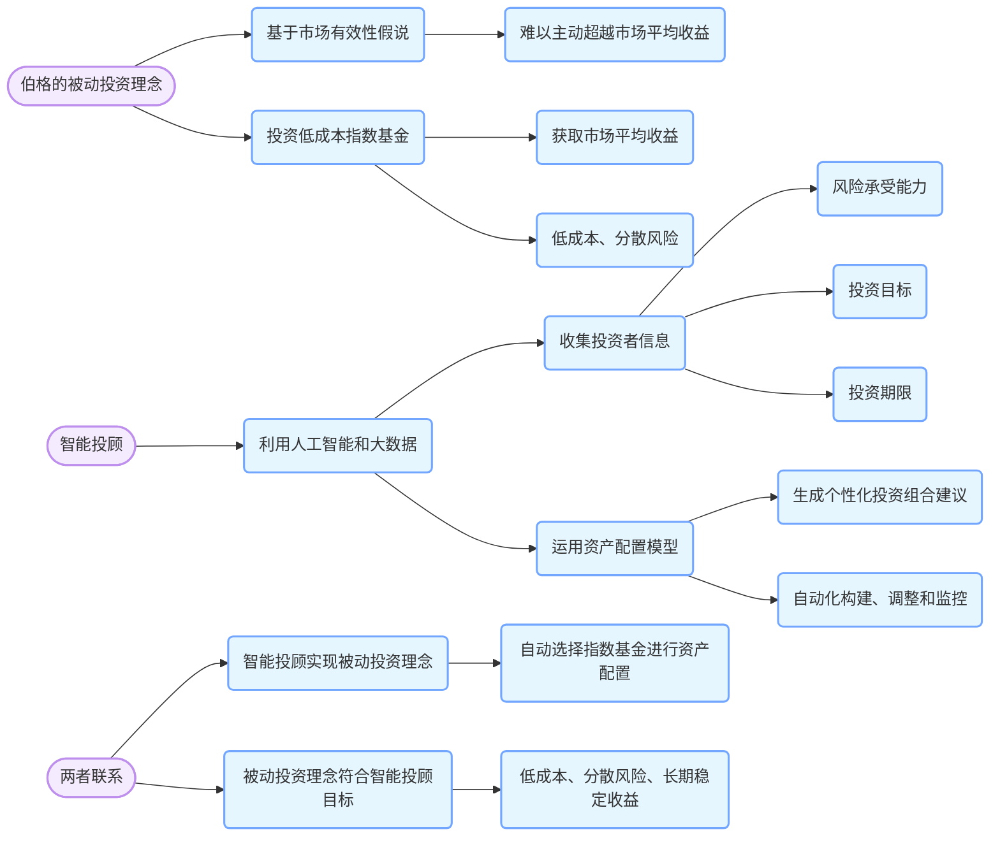

# 伯格的被动投资理念：智能投顾时代的新发展

> 关键词：伯格被动投资理念、智能投顾、资产配置、指数基金、金融科技

> 摘要：本文深入探讨了伯格的被动投资理念在智能投顾时代的新发展。首先介绍了被动投资理念的背景与核心，分析了其与智能投顾结合的理论基础。接着阐述了智能投顾中被动投资策略的核心算法原理，包括资产配置模型，并给出 Python 代码示例。通过数学模型和公式详细讲解了相关原理，并举例说明。在项目实战部分，展示了开发智能投顾系统的环境搭建、源代码实现及解读。探讨了该理念在不同场景下的实际应用，推荐了学习资源、开发工具和相关论文。最后总结了未来发展趋势与挑战，为投资者和金融从业者提供全面的参考。

## 1. 背景介绍 
### 1.1 目的和范围
本文旨在全面剖析伯格的被动投资理念在智能投顾时代的新发展情况。通过对相关理论、算法、实践案例等方面的研究，深入探讨被动投资理念与智能投顾结合的原理、应用及发展趋势。范围涵盖被动投资理念的核心内容、智能投顾的技术架构和算法原理、实际应用场景分析以及未来发展的预测等。

### 1.2 预期读者
本文适合广大投资者，包括个人投资者和机构投资者，帮助他们了解被动投资理念在智能投顾时代的优势和应用方法，以便做出更合理的投资决策。同时，对于金融科技从业者、研究人员以及对金融投资和技术创新感兴趣的人士也具有较高的参考价值。

### 1.3 文档结构概述
本文首先介绍了背景信息，包括目的、预期读者和文档结构。接着阐述了核心概念，即伯格的被动投资理念和智能投顾的定义、原理及联系。然后详细讲解了核心算法原理和具体操作步骤，通过 Python 代码进行说明。之后给出数学模型和公式，并举例说明。在项目实战部分，介绍了开发环境搭建、源代码实现和代码解读。探讨了实际应用场景，推荐了相关工具和资源。最后总结了未来发展趋势与挑战，并提供常见问题解答和扩展阅读资料。

### 1.4 术语表
#### 1.4.1 核心术语定义
- **伯格的被动投资理念**：由约翰·伯格（John C. Bogle）提出，主张通过长期投资低成本的指数基金来跟踪市场指数，以获取市场平均收益，而不进行主动的股票挑选和市场时机把握。
- **智能投顾**：利用人工智能和大数据技术，根据投资者的风险承受能力、投资目标等因素，为投资者提供自动化、个性化的投资组合建议和管理服务。
- **资产配置**：将资金分配到不同类型的资产（如股票、债券、现金等）中，以实现风险和收益的平衡。
- **指数基金**：一种按照特定指数（如标普 500 指数）的成分股构成进行投资的基金，旨在复制指数的表现。

#### 1.4.2 相关概念解释
- **主动投资**：与被动投资相对，主动投资经理通过深入研究和分析，试图挑选出表现优于市场平均水平的股票或资产，进行频繁的交易和调整投资组合。
- **风险承受能力**：投资者在投资过程中能够承受的最大损失程度，通常与投资者的财务状况、投资经验、年龄等因素有关。
- **投资目标**：投资者进行投资的目的，如资产增值、收入稳定、养老储备等。

#### 1.4.3 缩略词列表
- **ETF**：交易型开放式指数基金（Exchange-Traded Fund），是一种在证券交易所上市交易的、基金份额可变的开放式基金，通常跟踪特定的指数。
- **MPT**：现代投资组合理论（Modern Portfolio Theory），由哈里·马科维茨（Harry Markowitz）提出，用于构建最优投资组合，以实现风险和收益的平衡。

## 2. 核心概念与联系 

### 伯格的被动投资理念原理
伯格的被动投资理念基于市场有效性假说。该假说认为，在有效的市场中，股票价格已经反映了所有可用的信息，因此很难通过主动的股票挑选和市场时机把握来持续获得超过市场平均水平的收益。基于此，伯格主张投资者通过投资低成本的指数基金来跟踪市场指数，以获取市场平均收益。这种投资方式具有低成本、分散风险等优点。

### 智能投顾原理
智能投顾利用人工智能和大数据技术，通过收集投资者的风险承受能力、投资目标、投资期限等信息，运用资产配置模型为投资者生成个性化的投资组合建议。它可以自动化地完成投资组合的构建、调整和监控，降低了投资顾问的人工成本，提高了服务效率和质量。

### 两者联系
智能投顾为伯格的被动投资理念提供了更高效、更个性化的实现方式。智能投顾可以根据投资者的具体情况，自动为其选择合适的指数基金进行资产配置，实现被动投资策略。同时，被动投资理念的低成本、分散风险等特点也符合智能投顾为投资者提供长期稳定收益的目标。

### 文本示意图
```plaintext
伯格的被动投资理念
|-- 基于市场有效性假说
|   |-- 难以主动超越市场平均收益
|-- 投资低成本指数基金
|   |-- 获取市场平均收益
|   |-- 低成本、分散风险

智能投顾
|-- 利用人工智能和大数据
|   |-- 收集投资者信息
|   |   |-- 风险承受能力
|   |   |-- 投资目标
|   |   |-- 投资期限
|   |-- 运用资产配置模型
|       |-- 生成个性化投资组合建议
|       |-- 自动化构建、调整和监控

两者联系
|-- 智能投顾实现被动投资理念
|   |-- 自动选择指数基金进行资产配置
|-- 被动投资理念符合智能投顾目标
|   |-- 低成本、分散风险、长期稳定收益
```

### Mermaid 流程图


## 3. 核心算法原理 & 具体操作步骤 

### 资产配置模型
在智能投顾中，常用的资产配置模型是现代投资组合理论（MPT）。该理论的核心思想是通过分散投资来降低风险，找到在给定风险水平下预期收益最高的投资组合，或者在给定预期收益水平下风险最低的投资组合。

### Python 代码实现 MPT 资产配置模型
```python
import numpy as np
import pandas as pd
import matplotlib.pyplot as plt
from scipy.optimize import minimize

# 假设我们有三种资产，其历史收益率数据如下
returns = pd.DataFrame({
    'Asset1': [0.05, 0.03, 0.02, 0.06, 0.04],
    'Asset2': [0.03, 0.01, 0.04, 0.02, 0.05],
    'Asset3': [0.02, 0.04, 0.03, 0.01, 0.06]
})

# 计算每种资产的平均收益率和协方差矩阵
mean_returns = returns.mean()
cov_matrix = returns.cov()

# 定义目标函数：最小化投资组合的风险（方差）
def portfolio_volatility(weights, mean_returns, cov_matrix):
    return np.sqrt(np.dot(weights.T, np.dot(cov_matrix, weights)))

# 定义约束条件：权重之和为 1
constraints = ({'type': 'eq', 'fun': lambda x: np.sum(x) - 1})

# 定义权重的取值范围：0 到 1
bounds = tuple((0, 1) for _ in range(len(mean_returns)))

# 初始权重猜测
initial_weights = np.array([1/len(mean_returns)] * len(mean_returns))

# 最小化风险
result = minimize(portfolio_volatility, initial_weights, args=(mean_returns, cov_matrix),
                  method='SLSQP', bounds=bounds, constraints=constraints)

# 最优权重
optimal_weights = result.x

# 最优投资组合的预期收益率和风险
optimal_return = np.dot(mean_returns, optimal_weights)
optimal_volatility = portfolio_volatility(optimal_weights, mean_returns, cov_matrix)

print("最优权重:", optimal_weights)
print("最优投资组合的预期收益率:", optimal_return)
print("最优投资组合的风险（波动率）:", optimal_volatility)

# 绘制有效前沿
num_portfolios = 1000
all_weights = np.zeros((num_portfolios, len(mean_returns)))
ret_arr = np.zeros(num_portfolios)
vol_arr = np.zeros(num_portfolios)

for i in range(num_portfolios):
    weights = np.random.random(len(mean_returns))
    weights = weights / np.sum(weights)
    all_weights[i, :] = weights
    ret_arr[i] = np.dot(mean_returns, weights)
    vol_arr[i] = portfolio_volatility(weights, mean_returns, cov_matrix)

plt.figure(figsize=(10, 6))
plt.scatter(vol_arr, ret_arr, c=ret_arr / vol_arr, cmap='viridis')
plt.colorbar(label='Sharpe Ratio')
plt.scatter(optimal_volatility, optimal_return, marker='*', color='r', s=500, label='Optimal Portfolio')
plt.xlabel('Volatility')
plt.ylabel('Expected Return')
plt.title('Efficient Frontier')
plt.legend()
plt.show()
```

### 具体操作步骤
1. **数据收集**：收集各种资产的历史收益率数据。
2. **计算统计指标**：计算每种资产的平均收益率和协方差矩阵。
3. **定义目标函数**：根据 MPT 理论，定义目标函数为最小化投资组合的风险（方差）。
4. **设置约束条件**：设置权重之和为 1 的约束条件，确保投资组合的总权重为 1。
5. **初始权重猜测**：给出初始的权重猜测值。
6. **优化求解**：使用优化算法（如 SLSQP）求解最优权重。
7. **计算最优投资组合的指标**：计算最优投资组合的预期收益率和风险（波动率）。
8. **绘制有效前沿**：通过随机生成大量的投资组合，计算它们的预期收益率和风险，绘制有效前沿图，展示不同风险水平下的最优预期收益率。

## 4. 数学模型和公式 & 详细讲解 & 举例说明 

### 现代投资组合理论（MPT）数学模型
设投资组合中包含 $n$ 种资产，第 $i$ 种资产的权重为 $w_i$，$i = 1, 2, \cdots, n$，且 $\sum_{i=1}^{n} w_i = 1$。每种资产的预期收益率为 $\mu_i$，投资组合的预期收益率 $\mu_p$ 为：
$$\mu_p = \sum_{i=1}^{n} w_i \mu_i$$

投资组合的方差 $\sigma_p^2$ 为：
$$\sigma_p^2 = \sum_{i=1}^{n} \sum_{j=1}^{n} w_i w_j \sigma_{ij}$$
其中，$\sigma_{ij}$ 是资产 $i$ 和资产 $j$ 的协方差。

### 详细讲解
预期收益率 $\mu_p$ 表示投资组合在未来一段时间内的平均收益水平，它是每种资产预期收益率的加权平均值。方差 $\sigma_p^2$ 衡量了投资组合的风险，它考虑了资产之间的相关性。协方差 $\sigma_{ij}$ 反映了资产 $i$ 和资产 $j$ 的收益率之间的联动关系。当 $\sigma_{ij} > 0$ 时，资产 $i$ 和资产 $j$ 的收益率呈正相关；当 $\sigma_{ij} < 0$ 时，呈负相关；当 $\sigma_{ij} = 0$ 时，两者不相关。

### 举例说明
假设我们有两种资产，资产 A 和资产 B。资产 A 的预期收益率 $\mu_A = 0.1$，资产 B 的预期收益率 $\mu_B = 0.08$。资产 A 的标准差 $\sigma_A = 0.2$，资产 B 的标准差 $\sigma_B = 0.15$，资产 A 和资产 B 的相关系数 $\rho_{AB} = 0.5$。

首先计算协方差 $\sigma_{AB}$：
$$\sigma_{AB} = \rho_{AB} \sigma_A \sigma_B = 0.5 \times 0.2 \times 0.15 = 0.015$$

设投资组合中资产 A 的权重为 $w_A = 0.6$，资产 B 的权重为 $w_B = 0.4$。

计算投资组合的预期收益率 $\mu_p$：
$$\mu_p = w_A \mu_A + w_B \mu_B = 0.6 \times 0.1 + 0.4 \times 0.08 = 0.092$$

计算投资组合的方差 $\sigma_p^2$：
$$\sigma_p^2 = w_A^2 \sigma_A^2 + w_B^2 \sigma_B^2 + 2 w_A w_B \sigma_{AB}$$
$$= 0.6^2 \times 0.2^2 + 0.4^2 \times 0.15^2 + 2 \times 0.6 \times 0.4 \times 0.015$$
$$= 0.0144 + 0.0036 + 0.0072 = 0.0252$$

投资组合的标准差 $\sigma_p = \sqrt{0.0252} \approx 0.159$。

## 5. 项目实战：代码实际案例和详细解释说明 

### 5.1  开发环境搭建
#### 安装 Python
首先，确保你已经安装了 Python 3.x 版本。可以从 Python 官方网站（https://www.python.org/downloads/） 下载并安装适合你操作系统的 Python 版本。

#### 安装必要的库
使用以下命令安装项目所需的库：
```sh
pip install numpy pandas matplotlib scipy
```

### 5.2  源代码详细实现和代码解读
```python
import numpy as np
import pandas as pd
import matplotlib.pyplot as plt
from scipy.optimize import minimize

# 假设我们有三种资产，其历史收益率数据如下
returns = pd.DataFrame({
    'Asset1': [0.05, 0.03, 0.02, 0.06, 0.04],
    'Asset2': [0.03, 0.01, 0.04, 0.02, 0.05],
    'Asset3': [0.02, 0.04, 0.03, 0.01, 0.06]
})

# 计算每种资产的平均收益率和协方差矩阵
mean_returns = returns.mean()
cov_matrix = returns.cov()

# 定义目标函数：最小化投资组合的风险（方差）
def portfolio_volatility(weights, mean_returns, cov_matrix):
    return np.sqrt(np.dot(weights.T, np.dot(cov_matrix, weights)))

# 定义约束条件：权重之和为 1
constraints = ({'type': 'eq', 'fun': lambda x: np.sum(x) - 1})

# 定义权重的取值范围：0 到 1
bounds = tuple((0, 1) for _ in range(len(mean_returns)))

# 初始权重猜测
initial_weights = np.array([1/len(mean_returns)] * len(mean_returns))

# 最小化风险
result = minimize(portfolio_volatility, initial_weights, args=(mean_returns, cov_matrix),
                  method='SLSQP', bounds=bounds, constraints=constraints)

# 最优权重
optimal_weights = result.x

# 最优投资组合的预期收益率和风险
optimal_return = np.dot(mean_returns, optimal_weights)
optimal_volatility = portfolio_volatility(optimal_weights, mean_returns, cov_matrix)

print("最优权重:", optimal_weights)
print("最优投资组合的预期收益率:", optimal_return)
print("最优投资组合的风险（波动率）:", optimal_volatility)

# 绘制有效前沿
num_portfolios = 1000
all_weights = np.zeros((num_portfolios, len(mean_returns)))
ret_arr = np.zeros(num_portfolios)
vol_arr = np.zeros(num_portfolios)

for i in range(num_portfolios):
    weights = np.random.random(len(mean_returns))
    weights = weights / np.sum(weights)
    all_weights[i, :] = weights
    ret_arr[i] = np.dot(mean_returns, weights)
    vol_arr[i] = portfolio_volatility(weights, mean_returns, cov_matrix)

plt.figure(figsize=(10, 6))
plt.scatter(vol_arr, ret_arr, c=ret_arr / vol_arr, cmap='viridis')
plt.colorbar(label='Sharpe Ratio')
plt.scatter(optimal_volatility, optimal_return, marker='*', color='r', s=500, label='Optimal Portfolio')
plt.xlabel('Volatility')
plt.ylabel('Expected Return')
plt.title('Efficient Frontier')
plt.legend()
plt.show()
```

### 代码解读与分析
1. **数据导入和预处理**：
    - 使用 `pandas` 库创建一个包含三种资产历史收益率的 `DataFrame`。
    - 计算每种资产的平均收益率和协方差矩阵，为后续的资产配置计算做准备。

2. **定义目标函数**：
    - `portfolio_volatility` 函数用于计算投资组合的风险（波动率），它接受权重、平均收益率和协方差矩阵作为输入，返回投资组合的波动率。

3. **设置约束条件和权重范围**：
    - 约束条件要求权重之和为 1，确保投资组合的总权重为 1。
    - 权重的取值范围为 0 到 1，表示每种资产的投资比例不能为负数，也不能超过 100%。

4. **初始权重猜测**：
    - 初始权重猜测为每种资产的权重相等，作为优化算法的起始点。

5. **优化求解**：
    - 使用 `scipy.optimize.minimize` 函数，采用 SLSQP 方法最小化投资组合的风险，得到最优权重。

6. **计算最优投资组合的指标**：
    - 根据最优权重计算最优投资组合的预期收益率和风险（波动率）。

7. **绘制有效前沿**：
    - 通过随机生成 1000 个不同的投资组合，计算它们的预期收益率和风险，绘制有效前沿图。
    - 在图中标记出最优投资组合的位置，方便直观比较。

## 6. 实际应用场景 
### 个人投资者
对于个人投资者来说，智能投顾结合伯格的被动投资理念可以提供便捷、个性化的投资服务。个人投资者可以通过智能投顾平台输入自己的风险承受能力、投资目标和投资期限等信息，平台会根据这些信息为其生成包含指数基金的投资组合建议。这种方式降低了个人投资者的投资门槛，减少了他们进行投资研究和决策的时间和精力。例如，一位年轻的上班族，风险承受能力较高，投资目标是长期资产增值，智能投顾可能会为他推荐一个以股票指数基金为主的投资组合。

### 机构投资者
机构投资者，如养老基金、保险公司等，也可以利用智能投顾和被动投资理念进行资产配置。这些机构通常有大规模的资金需要管理，追求长期稳定的收益和风险控制。通过智能投顾系统，机构可以更高效地进行资产配置，选择合适的指数基金进行投资，降低交易成本和管理成本。例如，养老基金可以根据其资金的特点和投资目标，利用智能投顾生成一个包含不同市场指数基金的投资组合，以实现资产的保值增值。

### 金融科技公司
金融科技公司可以将伯格的被动投资理念和智能投顾技术相结合，开发创新的金融产品和服务。例如，推出基于智能投顾的在线投资平台，为客户提供一站式的投资解决方案。这些平台可以利用大数据和人工智能技术，不断优化投资组合建议，提高客户的投资体验和收益水平。同时，金融科技公司还可以通过与传统金融机构合作，将智能投顾服务推广到更广泛的客户群体中。

## 7. 工具和资源推荐
### 7.1 学习资源推荐
#### 7.1.1 书籍推荐
- 《聪明的投资者》（The Intelligent Investor）：作者本杰明·格雷厄姆（Benjamin Graham），这本书是价值投资的经典之作，也包含了对被动投资理念的深入探讨，对于理解投资的基本原理和方法非常有帮助。
- 《漫步华尔街》（A Random Walk Down Wall Street）：作者伯顿·马尔基尔（Burton G. Malkiel），书中介绍了市场有效性假说和被动投资的优势，是一本通俗易懂的投资入门书籍。
- 《约翰·伯格的投资50堂课》（John C. Bogle on Investing: The First 50 Years）：作者约翰·伯格（John C. Bogle），这本书集中体现了伯格的被动投资理念，对于想要深入了解该理念的读者来说是一本必读之书。

#### 7.1.2 在线课程
- Coursera 上的“投资学原理”（Principles of Investing）课程：由知名大学的教授授课，涵盖了投资组合理论、资产定价等投资学的核心内容，对于系统学习投资知识非常有帮助。
- edX 上的“金融科技与智能投顾”（Fintech and Robo-Advising）课程：专门介绍金融科技在智能投顾领域的应用，包括智能投顾的算法原理、技术架构和实际案例等内容。

#### 7.1.3 技术博客和网站
- Seeking Alpha：一个提供金融市场分析、投资建议和研究报告的网站，有很多关于被动投资和智能投顾的文章和讨论。
- QuantNet：一个专注于量化金融和金融科技的社区，提供了大量的技术文章、代码示例和论坛讨论，对于学习智能投顾的技术实现非常有帮助。

### 7.2 开发工具框架推荐
#### 7.2.1 IDE和编辑器
- PyCharm：一款功能强大的 Python 集成开发环境（IDE），提供了代码编辑、调试、代码分析等功能，适合开发智能投顾相关的 Python 代码。
- Jupyter Notebook：一个交互式的开发环境，支持 Python 等多种编程语言，方便进行数据分析、模型实验和代码演示。

#### 7.2.2 调试和性能分析工具
- PySnooper：一个简单易用的 Python 调试工具，可以自动记录函数的执行过程和变量的值，帮助开发者快速定位问题。
- cProfile：Python 内置的性能分析工具，可以分析代码的执行时间和函数调用次数，帮助优化代码性能。

#### 7.2.3 相关框架和库
- Pandas：一个强大的数据分析库，提供了数据结构和数据分析工具，适合处理和分析金融数据。
- NumPy：一个用于科学计算的 Python 库，提供了高效的数组操作和数学函数，是进行金融计算和模型实现的基础库。
- Scikit-learn：一个机器学习库，提供了各种机器学习算法和工具，可用于智能投顾中的风险评估、投资组合优化等任务。

### 7.3 相关论文著作推荐
#### 7.3.1 经典论文
- “Portfolio Selection”（Harry Markowitz，1952）：这篇论文提出了现代投资组合理论（MPT），奠定了资产配置的理论基础，是投资学领域的经典之作。
- “Efficient Capital Markets: A Review of Theory and Empirical Work”（Eugene F. Fama，1970）：该论文系统地阐述了市场有效性假说，为被动投资理念提供了理论支持。

#### 7.3.2 最新研究成果
- “Robo-Advisors and the Future of Personalized Financial Advice”（Malte Krueger 等，2018）：这篇论文探讨了智能投顾的发展现状和未来趋势，分析了智能投顾在提供个性化金融建议方面的优势和挑战。
- “The Impact of Passive Investing on Market Efficiency”（Andrei Shleifer 等，2020）：研究了被动投资对市场效率的影响，对于理解被动投资理念在市场中的作用具有重要意义。

#### 7.3.3 应用案例分析
- “Case Studies in Robo-Advisory: Lessons Learned from Successful Implementations”（Financial Technology Association，2021）：该报告分析了多个智能投顾平台的成功应用案例，总结了它们的经验和教训，对于实际开发和应用智能投顾系统具有参考价值。

## 8. 总结：未来发展趋势与挑战
### 未来发展趋势
- **技术创新推动**：随着人工智能、大数据、区块链等技术的不断发展，智能投顾将不断创新和升级。例如，利用深度学习算法可以更准确地预测市场走势和投资者行为，提高投资组合的优化效果。
- **个性化服务深化**：智能投顾将更加注重个性化服务，不仅考虑投资者的风险承受能力和投资目标，还会结合投资者的生活场景、消费习惯等因素，提供更加精准的投资建议。
- **与传统金融融合**：智能投顾将与传统金融机构更加紧密地融合，传统金融机构可以利用智能投顾技术提升服务效率和质量，智能投顾平台也可以借助传统金融机构的品牌和客户资源拓展市场。
- **全球化发展**：随着金融市场的全球化，智能投顾将跨越国界，为全球投资者提供服务。投资者可以通过智能投顾平台投资全球范围内的资产，实现资产的全球化配置。

### 挑战
- **数据安全和隐私问题**：智能投顾需要收集和处理大量的投资者个人信息和金融数据，数据安全和隐私保护面临严峻挑战。一旦数据泄露，可能会给投资者带来巨大的损失。
- **市场波动和不确定性**：金融市场具有高度的波动性和不确定性，智能投顾的投资策略可能无法完全适应市场变化，导致投资组合的收益受到影响。
- **监管合规问题**：智能投顾作为一种新兴的金融服务模式，监管政策还不够完善。如何确保智能投顾平台遵守相关法律法规，保护投资者的合法权益，是监管部门面临的重要问题。
- **投资者教育问题**：虽然智能投顾降低了投资门槛，但部分投资者对被动投资理念和智能投顾的理解还不够深入，可能会做出不理性的投资决策。因此，加强投资者教育，提高投资者的金融素养至关重要。

## 9. 附录：常见问题与解答
### 问题 1：智能投顾推荐的投资组合一定能保证盈利吗？
答：不能。金融市场具有不确定性和波动性，智能投顾推荐的投资组合只是基于历史数据和模型计算得出的最优方案，但不能保证在未来一定能获得盈利。投资者仍然需要承担市场风险。

### 问题 2：被动投资理念是否适用于所有投资者？
答：被动投资理念具有低成本、分散风险等优点，适合大多数投资者，尤其是那些没有足够时间和专业知识进行主动投资的投资者。但对于一些具有丰富投资经验和较强市场分析能力的投资者来说，他们可能更倾向于主动投资策略。

### 问题 3：智能投顾的费用高吗？
答：一般来说，智能投顾的费用相对较低。与传统的投资顾问相比，智能投顾通过自动化的服务流程降低了人工成本，因此收取的费用通常也比较低。但不同的智能投顾平台收费标准可能会有所差异。

### 问题 4：如何选择合适的智能投顾平台？
答：选择智能投顾平台时，可以考虑以下几个方面：平台的信誉和口碑、投资策略的合理性、费用水平、客户服务质量、数据安全和隐私保护措施等。同时，也可以参考其他投资者的评价和建议。

### 问题 5：智能投顾会取代传统投资顾问吗？
答：短期内不会完全取代。虽然智能投顾具有效率高、成本低等优点，但传统投资顾问可以提供更个性化、更深入的投资建议和服务，尤其是对于一些复杂的投资需求和高净值客户。未来，智能投顾和传统投资顾问可能会相互补充，共同为投资者提供更好的服务。

## 10. 扩展阅读 & 参考资料
- 《金融科技概论》
- 《量化投资：策略与技术》
- 《金融市场与金融机构》
- Bloomberg、Financial Times 等金融媒体网站
- 各大金融科技公司和投资机构的官方报告和研究成果

作者：AI天才研究院/AI Genius Institute & 禅与计算机程序设计艺术 /Zen And The Art of Computer Programming