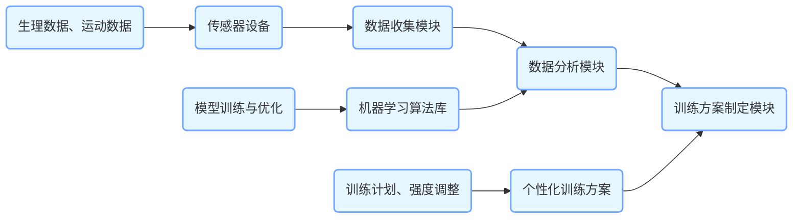

# 体育训练中的AI Agent辅助教练

> 关键词：体育训练、AI Agent、辅助教练、智能分析、个性化训练

> 摘要：本文围绕体育训练中的AI Agent辅助教练展开深入探讨。详细介绍了其背景、核心概念、算法原理、数学模型等内容，通过项目实战展示了其在实际中的应用，分析了具体的应用场景，推荐了相关的工具和资源，最后总结了未来发展趋势与挑战，并给出常见问题解答和参考资料。旨在为体育训练领域引入先进的AI技术提供全面的技术指导和理论支持。

## 1. 背景介绍 
### 1.1 目的和范围
在当今体育领域，提升运动员的训练效果和竞技水平是核心目标。传统的体育训练方式主要依赖教练的经验和主观判断，存在一定的局限性。引入AI Agent作为辅助教练，旨在利用人工智能技术的优势，对运动员的训练数据进行精准分析，提供个性化的训练方案，提高训练效率和质量。本文的范围涵盖了AI Agent在体育训练中的基本原理、技术实现、实际应用等方面，为体育从业者和技术开发者提供全面的参考。

### 1.2 预期读者
本文预期读者包括体育教练、运动员、体育科研人员、人工智能领域的开发者和研究人员。体育教练和运动员可以从中了解如何利用AI Agent提升训练效果；体育科研人员可以获取相关技术的理论和实践依据；人工智能开发者则可以找到在体育领域的应用场景和技术实现思路。

### 1.3 文档结构概述
本文首先介绍体育训练中AI Agent辅助教练的背景信息，包括目的、读者和文档结构。接着阐述核心概念与联系，通过文本示意图和Mermaid流程图展示其架构。然后详细讲解核心算法原理和具体操作步骤，结合Python源代码进行说明。再介绍数学模型和公式，并举例说明。之后通过项目实战展示代码实际案例和详细解释。分析实际应用场景，推荐相关的工具和资源。最后总结未来发展趋势与挑战，提供常见问题解答和参考资料。

### 1.4 术语表
#### 1.4.1 核心术语定义
- **AI Agent**：人工智能代理，是一种能够感知环境、做出决策并执行动作的智能实体。在体育训练中，AI Agent可以根据运动员的训练数据和环境信息，提供训练建议和决策支持。
- **辅助教练**：在体育训练中，协助主教练完成训练任务的角色。AI Agent作为辅助教练，可以提供数据分析、训练方案制定等功能。
- **体育训练数据**：包括运动员的生理数据（如心率、血压、肌肉力量等）、运动数据（如速度、加速度、运动轨迹等）和训练表现数据（如得分、失误率等）。

#### 1.4.2 相关概念解释
- **机器学习**：是一门多领域交叉学科，涉及概率论、统计学、逼近论、凸分析、算法复杂度理论等多门学科。它专门研究计算机怎样模拟或实现人类的学习行为，以获取新的知识或技能，重新组织已有的知识结构使之不断改善自身的性能。在体育训练中，机器学习可用于分析运动员的训练数据，预测运动表现。
- **深度学习**：是机器学习的一个分支领域，它是一种基于对数据进行表征学习的方法。深度学习通过构建具有很多层的神经网络模型，自动从大量数据中学习特征和模式。在体育训练中，深度学习可用于处理复杂的图像和视频数据，如动作分析和姿态识别。

#### 1.4.3 缩略词列表
- **AI**：Artificial Intelligence，人工智能
- **ML**：Machine Learning，机器学习
- **DL**：Deep Learning，深度学习

## 2. 核心概念与联系 

### 核心概念原理
在体育训练中，AI Agent辅助教练的核心原理是通过收集运动员的各种训练数据，利用机器学习和深度学习等人工智能技术对数据进行分析和处理，从而为教练和运动员提供有价值的信息和决策支持。具体来说，AI Agent可以完成以下几个方面的任务：
- **数据收集**：通过各种传感器（如心率带、运动追踪器、摄像头等）收集运动员的生理数据、运动数据和训练表现数据。
- **数据分析**：对收集到的数据进行清洗、预处理和特征提取，然后利用机器学习和深度学习算法进行分析，挖掘数据中的潜在信息和模式。
- **训练方案制定**：根据数据分析的结果，结合运动员的目标和特点，为运动员制定个性化的训练方案。
- **实时反馈**：在训练过程中，AI Agent可以实时监测运动员的状态，提供实时反馈和调整建议，帮助运动员优化训练效果。

### 架构的文本示意图
```plaintext
|-------------------|       |-------------------|       |-------------------|
| 数据收集模块      | ----> | 数据分析模块      | ----> | 训练方案制定模块 |
|-------------------|       |-------------------|       |-------------------|
         |                                 |                      |
         v                                 v                      v
|-------------------|       |-------------------|       |-------------------|
| 传感器设备        |       | 机器学习算法库    |       | 个性化训练方案    |
|-------------------|       |-------------------|       |-------------------|
         |                                 |                      |
         v                                 v                      v
|-------------------|       |-------------------|       |-------------------|
| 生理数据、运动数据 |       | 模型训练与优化    |       | 训练计划、强度调整 |
|-------------------|       |-------------------|       |-------------------|
```

### Mermaid流程图


## 3. 核心算法原理 & 具体操作步骤 

### 核心算法原理
在体育训练的AI Agent辅助教练系统中，常用的核心算法包括机器学习中的决策树、支持向量机，以及深度学习中的卷积神经网络（CNN）和循环神经网络（RNN）等。下面以决策树算法为例进行详细讲解。

决策树是一种基于树结构进行决策的算法，它通过对数据的特征进行划分，构建一棵决策树，每个内部节点表示一个特征上的测试，每个分支表示一个测试输出，每个叶节点表示一个类别或值。在体育训练中，决策树可以用于根据运动员的生理数据和训练表现数据，判断运动员的训练状态和适合的训练强度。

### Python源代码实现决策树算法
```python
import pandas as pd
from sklearn.model_selection import train_test_split
from sklearn.tree import DecisionTreeClassifier
from sklearn.metrics import accuracy_score

# 加载体育训练数据
data = pd.read_csv('sports_training_data.csv')

# 分离特征和标签
X = data.drop('training_status', axis=1)
y = data['training_status']

# 划分训练集和测试集
X_train, X_test, y_train, y_test = train_test_split(X, y, test_size=0.2, random_state=42)

# 创建决策树分类器
clf = DecisionTreeClassifier()

# 训练模型
clf.fit(X_train, y_train)

# 预测测试集
y_pred = clf.predict(X_test)

# 计算准确率
accuracy = accuracy_score(y_test, y_pred)
print(f"决策树模型的准确率: {accuracy}")
```

### 具体操作步骤
1. **数据加载**：使用`pandas`库加载体育训练数据，将其存储为`DataFrame`对象。
2. **数据预处理**：分离特征和标签，将特征数据存储在`X`中，标签数据存储在`y`中。
3. **数据集划分**：使用`train_test_split`函数将数据集划分为训练集和测试集，测试集占比为20%。
4. **模型创建**：创建一个决策树分类器对象`clf`。
5. **模型训练**：使用训练集数据对决策树分类器进行训练。
6. **模型预测**：使用训练好的模型对测试集数据进行预测。
7. **模型评估**：使用`accuracy_score`函数计算模型的准确率。

## 4. 数学模型和公式 & 详细讲解 & 举例说明 

### 决策树的数学模型和公式
决策树的构建过程主要基于信息增益的概念。信息增益是衡量一个特征对数据集分类能力的指标，它表示在使用某个特征进行划分后，数据集的信息熵减少的程度。信息熵是对数据集不确定性的度量，其计算公式为：

$$H(X) = -\sum_{i=1}^{n}p(x_i)\log_2p(x_i)$$

其中，$X$ 是数据集，$p(x_i)$ 是数据集中第 $i$ 个类别的概率。

信息增益的计算公式为：

$$IG(X, A) = H(X) - \sum_{v\in Values(A)}\frac{|X_v|}{|X|}H(X_v)$$

其中，$IG(X, A)$ 表示使用特征 $A$ 对数据集 $X$ 进行划分的信息增益，$Values(A)$ 是特征 $A$ 的所有可能取值，$X_v$ 是特征 $A$ 取值为 $v$ 时的子集。

### 详细讲解
在决策树的构建过程中，每次选择信息增益最大的特征作为划分节点，直到满足停止条件（如所有样本属于同一类别或没有更多特征可用）。通过不断地划分数据集，决策树可以逐步学习到数据中的分类规则。

### 举例说明
假设我们有一个体育训练数据集，包含运动员的年龄、性别、心率和训练状态（良好、一般、较差）。我们要使用决策树算法对训练状态进行分类。

首先，计算数据集的信息熵 $H(X)$。假设数据集中有100个样本，其中良好状态的样本有30个，一般状态的样本有50个，较差状态的样本有20个。则：

$$p(良好)=\frac{30}{100}=0.3$$
$$p(一般)=\frac{50}{100}=0.5$$
$$p(较差)=\frac{20}{100}=0.2$$

$$H(X)=-(0.3\log_20.3 + 0.5\log_20.5 + 0.2\log_20.2)\approx 1.485$$

然后，假设我们选择年龄作为划分特征，年龄有两个取值：年轻和年老。年轻的样本有60个，其中良好状态的样本有20个，一般状态的样本有30个，较差状态的样本有10个；年老的样本有40个，其中良好状态的样本有10个，一般状态的样本有20个，较差状态的样本有10个。

计算年轻子集的信息熵 $H(X_{年轻})$：

$$p(良好|年轻)=\frac{20}{60}\approx 0.333$$
$$p(一般|年轻)=\frac{30}{60}=0.5$$
$$p(较差|年轻)=\frac{10}{60}\approx 0.167$$

$$H(X_{年轻})=-(0.333\log_20.333 + 0.5\log_20.5 + 0.167\log_20.167)\approx 1.459$$

计算年老子集的信息熵 $H(X_{年老})$：

$$p(良好|年老)=\frac{10}{40}=0.25$$
$$p(一般|年老)=\frac{20}{40}=0.5$$
$$p(较差|年老)=\frac{10}{40}=0.25$$

$$H(X_{年老})=-(0.25\log_20.25 + 0.5\log_20.5 + 0.25\log_20.25)=1.5$$

计算使用年龄特征进行划分的信息增益 $IG(X, 年龄)$：

$$IG(X, 年龄)=H(X)-(\frac{60}{100}H(X_{年轻})+\frac{40}{100}H(X_{年老}))$$
$$=1.485 - (0.6\times1.459 + 0.4\times1.5)\approx 0.011$$

同理，可以计算其他特征的信息增益，选择信息增益最大的特征作为划分节点，逐步构建决策树。

## 5. 项目实战：代码实际案例和详细解释说明 

### 5.1  开发环境搭建
#### 操作系统
建议使用Linux或Windows操作系统，推荐使用Ubuntu 18.04及以上版本或Windows 10及以上版本。

#### Python环境
安装Python 3.7及以上版本，可以从Python官方网站（https://www.python.org/downloads/）下载安装包进行安装。

#### 依赖库安装
使用`pip`工具安装以下依赖库：
```bash
pip install pandas scikit-learn matplotlib
```

### 5.2  源代码详细实现和代码解读
以下是一个完整的体育训练AI Agent辅助教练系统的Python代码示例：

```python
import pandas as pd
from sklearn.model_selection import train_test_split
from sklearn.tree import DecisionTreeClassifier
from sklearn.metrics import accuracy_score
import matplotlib.pyplot as plt

# 加载体育训练数据
data = pd.read_csv('sports_training_data.csv')

# 数据探索
print("数据基本信息：")
data.info()

# 查看数据集行数和列数
rows, columns = data.shape

if rows < 100:
    # 小样本数据（行数少于100）查看全量数据信息
    print("数据全部内容信息：")
    print(data.to_csv(sep='\t', na_rep='nan'))
else:
    # 大样本数据查看数据前几行信息
    print("数据前几行内容信息：")
    print(data.head().to_csv(sep='\t', na_rep='nan'))

# 分离特征和标签
X = data.drop('training_status', axis=1)
y = data['training_status']

# 划分训练集和测试集
X_train, X_test, y_train, y_test = train_test_split(X, y, test_size=0.2, random_state=42)

# 创建决策树分类器
clf = DecisionTreeClassifier()

# 训练模型
clf.fit(X_train, y_train)

# 预测测试集
y_pred = clf.predict(X_test)

# 计算准确率
accuracy = accuracy_score(y_test, y_pred)
print(f"决策树模型的准确率: {accuracy}")

# 可视化训练结果
plt.figure(figsize=(10, 6))
plt.scatter(range(len(y_test)), y_test, color='blue', label='Actual')
plt.scatter(range(len(y_pred)), y_pred, color='red', label='Predicted')
plt.title('Actual vs Predicted Training Status')
plt.xlabel('Sample Index')
plt.ylabel('Training Status')
plt.legend()
plt.show()
```

### 代码解读与分析
1. **数据加载**：使用`pandas`库的`read_csv`函数加载体育训练数据文件`sports_training_data.csv`。
2. **数据探索**：使用`info`方法查看数据的基本信息，包括数据类型、缺失值等。根据数据集的行数，决定输出全量数据信息还是前几行数据信息。
3. **数据预处理**：使用`drop`方法分离特征和标签，将特征数据存储在`X`中，标签数据存储在`y`中。
4. **数据集划分**：使用`train_test_split`函数将数据集划分为训练集和测试集，测试集占比为20%。
5. **模型创建**：创建一个决策树分类器对象`clf`。
6. **模型训练**：使用训练集数据对决策树分类器进行训练。
7. **模型预测**：使用训练好的模型对测试集数据进行预测。
8. **模型评估**：使用`accuracy_score`函数计算模型的准确率。
9. **可视化训练结果**：使用`matplotlib`库绘制实际训练状态和预测训练状态的散点图，直观展示模型的预测效果。

## 6. 实际应用场景 
### 个性化训练方案制定
AI Agent可以根据运动员的生理数据、运动能力和训练目标，为每个运动员制定个性化的训练方案。例如，对于一名长跑运动员，AI Agent可以根据其心率、配速、体能恢复情况等数据，制定不同阶段的训练计划，包括训练强度、训练时长和训练频率等。

### 实时训练反馈
在训练过程中，AI Agent可以实时监测运动员的状态，如心率、血压、运动姿态等，并及时提供反馈和调整建议。例如，当运动员的心率过高时，AI Agent可以提醒运动员降低训练强度；当运动员的运动姿态不正确时，AI Agent可以提供纠正指导。

### 运动员伤病预防
通过对运动员的历史训练数据和生理数据进行分析，AI Agent可以预测运动员发生伤病的风险，并提前采取预防措施。例如，当AI Agent发现运动员某一部位的肌肉疲劳度较高时，可以建议运动员进行适当的休息和康复训练，避免伤病的发生。

### 比赛策略制定
AI Agent可以分析对手的比赛数据和特点，结合己方运动员的优势和劣势，为教练制定比赛策略提供支持。例如，在篮球比赛中，AI Agent可以分析对手的进攻和防守战术，为教练提供针对性的战术安排和球员轮换建议。

## 7. 工具和资源推荐
### 7.1 学习资源推荐
#### 7.1.1 书籍推荐
- 《机器学习》（周志华著）：这本书是机器学习领域的经典教材，全面介绍了机器学习的基本概念、算法和应用，适合初学者和有一定基础的读者。
- 《深度学习》（Ian Goodfellow、Yoshua Bengio和Aaron Courville著）：深度学习领域的权威著作，深入讲解了深度学习的理论和实践，包括神经网络、卷积神经网络、循环神经网络等。
- 《体育统计学》（郝为亚主编）：结合体育领域的实际问题，介绍了统计学的基本原理和方法，对于理解体育训练数据的分析和处理有很大帮助。

#### 7.1.2 在线课程
- Coursera上的“机器学习”课程（Andrew Ng教授主讲）：这是一门非常受欢迎的机器学习入门课程，通过视频讲解、编程作业和测验等方式，帮助学习者掌握机器学习的基本概念和算法。
- edX上的“深度学习基础”课程（Microsoft主讲）：该课程介绍了深度学习的基本概念、神经网络的架构和训练方法，适合对深度学习感兴趣的初学者。
- 中国大学MOOC上的“体育科研方法”课程：该课程涵盖了体育科研的各个方面，包括研究设计、数据收集、数据分析等，对于体育科研人员和教练有很大的帮助。

#### 7.1.3 技术博客和网站
- Medium：这是一个技术博客平台，上面有很多关于人工智能、机器学习和体育科技的文章，作者来自不同的领域和背景，可以提供不同的视角和思路。
- Towards Data Science：专注于数据科学和机器学习领域的博客，上面有很多高质量的技术文章和案例分析，对于学习和实践人工智能技术有很大的帮助。
- 体育科学在线：这是一个专注于体育科学领域的网站，提供了体育科研、训练方法、运动医学等方面的最新资讯和研究成果。

### 7.2 开发工具框架推荐
#### 7.2.1 IDE和编辑器
- PyCharm：是一款专门为Python开发设计的集成开发环境（IDE），具有代码编辑、调试、版本控制等功能，支持多种Python框架和库，适合开发复杂的Python项目。
- Jupyter Notebook：是一个交互式的开发环境，支持多种编程语言，特别是Python。它以网页的形式展示代码和运行结果，方便进行数据探索、模型训练和可视化分析。
- Visual Studio Code：是一款轻量级的代码编辑器，支持多种编程语言和插件扩展。它具有丰富的代码编辑功能和调试功能，适合快速开发和调试Python代码。

#### 7.2.2 调试和性能分析工具
- PDB：是Python自带的调试工具，可以在代码中设置断点，逐步执行代码，查看变量的值和程序的执行流程，帮助开发者定位和解决代码中的问题。
- cProfile：是Python的性能分析工具，可以统计程序中各个函数的执行时间和调用次数，帮助开发者找出程序中的性能瓶颈。
- TensorBoard：是TensorFlow的可视化工具，可以可视化模型的训练过程、损失函数的变化、模型的结构等信息，帮助开发者理解和优化模型。

#### 7.2.3 相关框架和库
- Scikit-learn：是一个简单易用的机器学习库，提供了丰富的机器学习算法和工具，包括分类、回归、聚类、降维等。它的API设计简洁，易于使用，适合初学者和快速开发。
- TensorFlow：是一个开源的深度学习框架，由Google开发和维护。它提供了丰富的深度学习模型和工具，支持CPU、GPU和TPU等多种计算设备，适合开发大规模的深度学习应用。
- PyTorch：是一个基于Python的深度学习框架，由Facebook开发和维护。它具有动态图的特点，易于使用和调试，适合快速开发和研究深度学习模型。

### 7.3 相关论文著作推荐
#### 7.3.1 经典论文
- “A Decision-Theoretic Generalization of On-Line Learning and an Application to Boosting”（Yoav Freund和Robert E. Schapire著）：这篇论文提出了AdaBoost算法，是机器学习领域的经典论文之一，对于理解集成学习和提升算法有很大的帮助。
- “ImageNet Classification with Deep Convolutional Neural Networks”（Alex Krizhevsky、Ilya Sutskever和Geoffrey E. Hinton著）：这篇论文介绍了AlexNet模型，开启了深度学习在计算机视觉领域的应用热潮，对于理解卷积神经网络和图像分类有重要的意义。
- “Long Short-Term Memory”（Sepp Hochreiter和Jürgen Schmidhuber著）：这篇论文提出了长短期记忆网络（LSTM），解决了传统循环神经网络的梯度消失问题，对于处理序列数据和自然语言处理有很大的帮助。

#### 7.3.2 最新研究成果
- 关注顶级学术会议如NeurIPS（神经信息处理系统大会）、ICML（国际机器学习会议）、CVPR（计算机视觉与模式识别会议）等上关于体育训练和人工智能结合的最新研究成果。
- 查阅相关学术期刊如《Journal of Sports Sciences》《Artificial Intelligence in Sports》等上的最新论文。

#### 7.3.3 应用案例分析
- 一些体育科技公司的官方网站会发布他们在体育训练中应用AI技术的案例分析，如Kinexon、Catapult等公司的网站。
- 体育赛事组织如国际奥委会、NBA等也会发布一些关于AI技术在体育赛事和训练中应用的报告和案例。

## 8. 总结：未来发展趋势与挑战
### 未来发展趋势
- **多模态数据融合**：未来的AI Agent辅助教练系统将融合更多类型的数据，如生理数据、运动数据、环境数据等，通过多模态数据融合技术，更全面地了解运动员的状态和需求，提供更精准的训练建议。
- **智能硬件集成**：随着智能硬件技术的不断发展，AI Agent将与更多的智能硬件设备集成，如可穿戴设备、智能训练器材等，实现数据的实时采集和传输，提高训练的智能化水平。
- **强化学习应用**：强化学习是一种通过智能体与环境进行交互，不断尝试和学习，以获得最大累积奖励的机器学习方法。未来，强化学习将在体育训练中得到更广泛的应用，如优化训练策略、制定比赛方案等。
- **虚拟教练与仿真训练**：利用虚拟现实（VR）和增强现实（AR）技术，开发虚拟教练和仿真训练系统，让运动员在虚拟环境中进行训练和比赛，提高训练的趣味性和效果。

### 挑战
- **数据隐私和安全**：体育训练数据包含大量运动员的个人隐私信息，如生理数据、运动习惯等。如何保障数据的隐私和安全，防止数据泄露和滥用，是一个亟待解决的问题。
- **算法可解释性**：一些复杂的人工智能算法，如深度学习算法，往往是一个“黑匣子”，难以解释其决策过程和结果。在体育训练中，教练和运动员需要了解AI Agent的决策依据，以便更好地应用其提供的建议。因此，提高算法的可解释性是一个重要的挑战。
- **技术与体育专业的融合**：AI Agent辅助教练系统需要将人工智能技术与体育专业知识相结合，才能发挥最大的作用。然而，目前既懂人工智能技术又懂体育专业的复合型人才相对较少，如何促进技术与体育专业的融合是一个挑战。
- **标准和规范的缺乏**：目前，体育训练中AI Agent辅助教练系统的应用还缺乏统一的标准和规范，不同的系统在数据采集、处理、分析和应用等方面存在差异。制定统一的标准和规范，有助于推动该领域的健康发展。

## 9. 附录：常见问题与解答
### 问题1：AI Agent辅助教练系统的准确率能达到多少？
解答：AI Agent辅助教练系统的准确率取决于多种因素，如数据质量、算法选择、模型训练等。一般来说，在经过充分的数据收集和模型训练后，系统的准确率可以达到较高的水平。但不同的应用场景和任务，准确率可能会有所不同。例如，在简单的训练状态分类任务中，准确率可能达到80%以上；而在复杂的比赛策略预测任务中，准确率可能会相对较低。

### 问题2：AI Agent辅助教练系统会完全取代人类教练吗？
解答：不会。虽然AI Agent辅助教练系统可以提供数据分析、训练方案制定等功能，但人类教练在体育训练中仍然具有不可替代的作用。人类教练可以与运动员建立情感联系，了解运动员的心理状态和个性特点，给予运动员鼓励和支持。此外，人类教练还可以根据实际情况进行灵活调整和决策，处理一些复杂的人际关系和突发情况。因此，AI Agent辅助教练系统将作为人类教练的有力补充，共同提高体育训练的效果。

### 问题3：如何确保AI Agent辅助教练系统的数据安全？
解答：为确保AI Agent辅助教练系统的数据安全，可以采取以下措施：
- **数据加密**：对采集到的运动员数据进行加密处理，确保数据在传输和存储过程中的安全性。
- **访问控制**：设置严格的访问权限，只有授权人员才能访问和处理运动员数据。
- **数据备份**：定期对运动员数据进行备份，防止数据丢失或损坏。
- **安全审计**：对系统的访问和操作进行审计，及时发现和处理安全漏洞。

### 问题4：AI Agent辅助教练系统的开发成本高吗？
解答：AI Agent辅助教练系统的开发成本取决于多个因素，如系统的功能需求、数据采集设备的选择、算法的复杂度等。一般来说，开发一个简单的AI Agent辅助教练系统可能需要一定的硬件设备和软件开发成本，但相对较低。而开发一个功能复杂、性能卓越的系统，则需要投入更多的人力、物力和财力。此外，系统的维护和更新也需要一定的成本。因此，在开发AI Agent辅助教练系统时，需要根据实际需求和预算进行合理规划。

## 10. 扩展阅读 & 参考资料
### 扩展阅读
- 《人工智能时代的体育变革》：探讨了人工智能技术在体育领域的应用现状和未来发展趋势，分析了人工智能对体育产业和运动员的影响。
- 《智能体育：科技赋能运动未来》：介绍了智能体育的概念、技术和应用案例，展示了科技如何改变体育训练、比赛和观赛体验。

### 参考资料
- 周志华. 机器学习. 清华大学出版社, 2016.
- Ian Goodfellow, Yoshua Bengio, Aaron Courville. 深度学习. 人民邮电出版社, 2017.
- 郝为亚. 体育统计学. 高等教育出版社, 2015.

作者：AI天才研究院/AI Genius Institute & 禅与计算机程序设计艺术 /Zen And The Art of Computer Programming