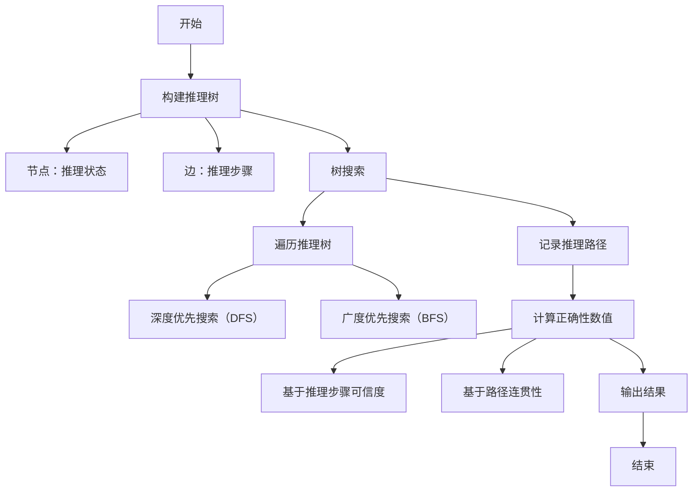

# 使用树搜索自动收集推理路径正确性数值的技术

> 关键词：树搜索、推理路径、正确性数值、自动收集、技术原理

> 摘要：本文围绕使用树搜索自动收集推理路径正确性数值的技术展开深入探讨。首先介绍该技术的背景信息，包括目的、预期读者、文档结构和相关术语。接着阐述核心概念与联系，给出原理和架构的文本示意图及 Mermaid 流程图。详细讲解核心算法原理，并结合 Python 源代码说明具体操作步骤。同时给出数学模型和公式，进行详细讲解和举例。通过项目实战展示代码的实际案例并进行解读分析。探讨该技术的实际应用场景，推荐相关的学习资源、开发工具框架和论文著作。最后总结未来发展趋势与挑战，提供常见问题解答和扩展阅读参考资料，旨在为读者全面呈现这一前沿技术。

## 1. 背景介绍 
### 1.1 目的和范围
在许多领域，如知识图谱推理、自然语言处理中的问答系统、智能决策等，推理过程往往涉及到多个步骤和多条路径。评估这些推理路径的正确性对于提高系统的性能和可靠性至关重要。本技术的目的就是利用树搜索的方法自动收集推理路径的正确性数值，从而为推理系统提供更准确的评估和决策依据。

本技术的范围涵盖了各种基于树结构进行推理的场景，包括但不限于有向无环图（DAG）形式的知识图谱推理、搜索树中的路径探索等。通过对这些场景中的推理路径进行分析和评估，我们可以更好地理解推理过程的合理性和准确性。

### 1.2 预期读者
本文的预期读者包括计算机科学、人工智能、机器学习等领域的研究人员、开发者和爱好者。对于那些正在从事知识图谱推理、自然语言处理、智能决策等相关项目的人员，本文提供的技术和方法将具有一定的参考价值。同时，对于对算法设计和数据分析感兴趣的读者，也可以通过本文了解树搜索和推理路径评估的基本原理和实现方法。

### 1.3 文档结构概述
本文将按照以下结构进行组织：
- 核心概念与联系：介绍树搜索和推理路径正确性数值的核心概念，以及它们之间的联系，并给出相应的文本示意图和 Mermaid 流程图。
- 核心算法原理 & 具体操作步骤：详细讲解使用树搜索自动收集推理路径正确性数值的核心算法原理，并通过 Python 源代码展示具体的操作步骤。
- 数学模型和公式 & 详细讲解 & 举例说明：给出用于评估推理路径正确性的数学模型和公式，并进行详细讲解和举例说明。
- 项目实战：通过一个实际的项目案例，展示如何使用本技术进行推理路径正确性数值的收集，并对代码进行详细解读和分析。
- 实际应用场景：探讨本技术在不同领域的实际应用场景。
- 工具和资源推荐：推荐相关的学习资源、开发工具框架和论文著作。
- 总结：未来发展趋势与挑战：总结本技术的发展趋势和面临的挑战。
- 附录：常见问题与解答：提供常见问题的解答。
- 扩展阅读 & 参考资料：提供扩展阅读的建议和相关参考资料。

### 1.4 术语表
#### 1.4.1 核心术语定义
- **树搜索**：一种在树结构中进行搜索的算法，通过遍历树的节点来寻找满足特定条件的路径或节点。常见的树搜索算法包括深度优先搜索（DFS）、广度优先搜索（BFS）等。
- **推理路径**：在推理过程中，从起始节点到目标节点所经过的一系列节点和边的序列。推理路径可以表示为一个有序的节点列表或边列表。
- **正确性数值**：用于评估推理路径正确性的一个数值指标，通常取值范围在 0 到 1 之间，数值越大表示推理路径越正确。

#### 1.4.2 相关概念解释
- **知识图谱**：一种以图的形式表示知识的方法，其中节点表示实体，边表示实体之间的关系。知识图谱可以用于知识推理、问答系统等应用。
- **搜索树**：一种用于搜索问题的树结构，其中每个节点表示一个搜索状态，边表示状态之间的转移。搜索树可以用于解决各种搜索问题，如路径规划、博弈等。

#### 1.4.3 缩略词列表
- **DFS**：深度优先搜索（Depth-First Search）
- **BFS**：广度优先搜索（Breadth-First Search）
- **DAG**：有向无环图（Directed Acyclic Graph）

## 2. 核心概念与联系 
### 核心概念原理
树搜索是一种基于树结构的搜索算法，它通过遍历树的节点来寻找满足特定条件的路径或节点。在推理过程中，我们可以将推理过程表示为一棵树，其中每个节点表示一个推理状态，边表示推理步骤。通过树搜索算法，我们可以遍历这棵树，找到所有可能的推理路径。

推理路径的正确性数值是用于评估推理路径合理性和准确性的一个指标。这个指标可以基于多种因素进行计算，例如路径中每个推理步骤的可信度、路径的连贯性等。通过自动收集推理路径的正确性数值，我们可以对不同的推理路径进行比较和评估，从而选择最优的推理路径。

### 架构的文本示意图
```plaintext
开始
|
|-- 构建推理树
|   |
|   |-- 节点：推理状态
|   |-- 边：推理步骤
|
|-- 树搜索
|   |
|   |-- 遍历推理树
|   |   |
|   |   |-- 深度优先搜索（DFS）
|   |   |-- 广度优先搜索（BFS）
|   |
|   |-- 记录推理路径
|
|-- 计算正确性数值
|   |
|   |-- 基于推理步骤可信度
|   |-- 基于路径连贯性
|
|-- 输出结果
结束
```

### Mermaid 流程图


## 3. 核心算法原理 & 具体操作步骤 
### 核心算法原理
本技术的核心算法主要包括两个部分：树搜索和正确性数值计算。

#### 树搜索
树搜索的目的是遍历推理树，找到所有可能的推理路径。我们可以使用深度优先搜索（DFS）或广度优先搜索（BFS）来实现树搜索。DFS 会沿着树的深度方向进行搜索，直到到达叶子节点，然后回溯到上一个节点继续搜索；BFS 则会按照树的层次顺序进行搜索，先搜索完同一层的所有节点，再搜索下一层的节点。

#### 正确性数值计算
对于每条推理路径，我们需要计算其正确性数值。这个数值可以基于多种因素进行计算，例如路径中每个推理步骤的可信度、路径的连贯性等。一种简单的计算方法是将路径中每个推理步骤的可信度相乘，得到路径的总可信度。

### 具体操作步骤
以下是使用 Python 实现的具体操作步骤：

```python
# 定义推理树节点类
class TreeNode:
    def __init__(self, state, parent=None, step_credibility=1.0):
        self.state = state  # 推理状态
        self.parent = parent  # 父节点
        self.step_credibility = step_credibility  # 推理步骤可信度
        self.children = []  # 子节点

    def add_child(self, child):
        self.children.append(child)

# 深度优先搜索
def dfs(node, path, all_paths):
    path = path + [node]
    if not node.children:
        all_paths.append(path)
    else:
        for child in node.children:
            dfs(child, path, all_paths)
    return all_paths

# 计算推理路径的正确性数值
def calculate_path_credibility(path):
    credibility = 1.0
    for node in path:
        credibility *= node.step_credibility
    return credibility

# 构建推理树示例
root = TreeNode("State A")
child1 = TreeNode("State B", parent=root, step_credibility=0.8)
child2 = TreeNode("State C", parent=root, step_credibility=0.9)
root.add_child(child1)
root.add_child(child2)

grandchild1 = TreeNode("State D", parent=child1, step_credibility=0.7)
grandchild2 = TreeNode("State E", parent=child1, step_credibility=0.8)
child1.add_child(grandchild1)
child1.add_child(grandchild2)

# 进行深度优先搜索
all_paths = dfs(root, [], [])

# 计算每条路径的正确性数值
for path in all_paths:
    path_states = [node.state for node in path]
    path_credibility = calculate_path_credibility(path)
    print(f"Path: {path_states}, Credibility: {path_credibility}")
```

### 代码解释
1. **TreeNode 类**：定义了推理树的节点类，包含节点的状态、父节点、推理步骤可信度和子节点列表。
2. **dfs 函数**：实现了深度优先搜索算法，用于遍历推理树并记录所有可能的推理路径。
3. **calculate_path_credibility 函数**：计算推理路径的正确性数值，通过将路径中每个节点的推理步骤可信度相乘得到。
4. **构建推理树示例**：创建了一个简单的推理树，并添加了节点和边。
5. **进行深度优先搜索**：调用 dfs 函数进行深度优先搜索，得到所有可能的推理路径。
6. **计算每条路径的正确性数值**：遍历所有推理路径，调用 calculate_path_credibility 函数计算每条路径的正确性数值，并输出结果。

## 4. 数学模型和公式 & 详细讲解 & 举例说明 
### 数学模型
假设我们有一条推理路径 $P = (n_1, n_2, \cdots, n_k)$，其中 $n_i$ 表示路径中的第 $i$ 个节点。每个节点 $n_i$ 对应一个推理步骤，其可信度为 $c_i$。我们可以定义推理路径的正确性数值 $C(P)$ 为：

$$C(P) = \prod_{i=1}^{k} c_i$$

### 详细讲解
这个数学模型的基本思想是，推理路径的正确性取决于路径中每个推理步骤的可信度。如果每个推理步骤的可信度都很高，那么整个推理路径的正确性也会很高；反之，如果某个推理步骤的可信度很低，那么整个推理路径的正确性也会受到影响。

### 举例说明
假设我们有一条推理路径 $P = (n_1, n_2, n_3)$，其中 $n_1$ 的可信度 $c_1 = 0.8$，$n_2$ 的可信度 $c_2 = 0.9$，$n_3$ 的可信度 $c_3 = 0.7$。根据上述数学模型，推理路径 $P$ 的正确性数值为：

$$C(P) = c_1 \times c_2 \times c_3 = 0.8 \times 0.9 \times 0.7 = 0.504$$

这意味着这条推理路径的正确性为 0.504，相对来说可信度不是很高。我们可以通过比较不同推理路径的正确性数值，选择正确性数值较高的路径作为最优推理路径。

## 5. 项目实战：代码实际案例和详细解释说明 
### 5.1  开发环境搭建
为了实现使用树搜索自动收集推理路径正确性数值的技术，我们可以使用 Python 作为开发语言。以下是搭建开发环境的步骤：

1. **安装 Python**：从 Python 官方网站（https://www.python.org/downloads/）下载并安装 Python 3.x 版本。
2. **安装开发工具**：可以选择使用 PyCharm、Visual Studio Code 等集成开发环境（IDE）来编写和运行 Python 代码。

### 5.2  源代码详细实现和代码解读
以下是一个更完整的项目实战代码示例，包括推理树的构建、树搜索和正确性数值计算：

```python
# 定义推理树节点类
class TreeNode:
    def __init__(self, state, parent=None, step_credibility=1.0):
        self.state = state  # 推理状态
        self.parent = parent  # 父节点
        self.step_credibility = step_credibility  # 推理步骤可信度
        self.children = []  # 子节点

    def add_child(self, child):
        self.children.append(child)

# 深度优先搜索
def dfs(node, path, all_paths):
    path = path + [node]
    if not node.children:
        all_paths.append(path)
    else:
        for child in node.children:
            dfs(child, path, all_paths)
    return all_paths

# 计算推理路径的正确性数值
def calculate_path_credibility(path):
    credibility = 1.0
    for node in path:
        credibility *= node.step_credibility
    return credibility

# 构建推理树
def build_inference_tree():
    root = TreeNode("State A")
    child1 = TreeNode("State B", parent=root, step_credibility=0.8)
    child2 = TreeNode("State C", parent=root, step_credibility=0.9)
    root.add_child(child1)
    root.add_child(child2)

    grandchild1 = TreeNode("State D", parent=child1, step_credibility=0.7)
    grandchild2 = TreeNode("State E", parent=child1, step_credibility=0.8)
    child1.add_child(grandchild1)
    child1.add_child(grandchild2)

    grandchild3 = TreeNode("State F", parent=child2, step_credibility=0.6)
    grandchild4 = TreeNode("State G", parent=child2, step_credibility=0.7)
    child2.add_child(grandchild3)
    child2.add_child(grandchild4)

    return root

# 主函数
def main():
    # 构建推理树
    root = build_inference_tree()

    # 进行深度优先搜索
    all_paths = dfs(root, [], [])

    # 计算每条路径的正确性数值
    best_path = None
    best_credibility = 0.0
    for path in all_paths:
        path_states = [node.state for node in path]
        path_credibility = calculate_path_credibility(path)
        print(f"Path: {path_states}, Credibility: {path_credibility}")

        if path_credibility > best_credibility:
            best_credibility = path_credibility
            best_path = path_states

    print(f"Best Path: {best_path}, Best Credibility: {best_credibility}")

if __name__ == "__main__":
    main()
```

### 代码解读与分析
1. **TreeNode 类**：定义了推理树的节点类，包含节点的状态、父节点、推理步骤可信度和子节点列表。
2. **dfs 函数**：实现了深度优先搜索算法，用于遍历推理树并记录所有可能的推理路径。
3. **calculate_path_credibility 函数**：计算推理路径的正确性数值，通过将路径中每个节点的推理步骤可信度相乘得到。
4. **build_inference_tree 函数**：构建一个简单的推理树，包含多个节点和边，并为每个节点设置推理步骤可信度。
5. **main 函数**：
    - 调用 build_inference_tree 函数构建推理树。
    - 调用 dfs 函数进行深度优先搜索，得到所有可能的推理路径。
    - 遍历所有推理路径，调用 calculate_path_credibility 函数计算每条路径的正确性数值，并输出结果。
    - 找出正确性数值最高的推理路径，并输出该路径和对应的正确性数值。

通过这个项目实战，我们可以看到如何使用树搜索自动收集推理路径的正确性数值，并选择最优的推理路径。

## 6. 实际应用场景 
### 知识图谱推理
在知识图谱中，我们可以将实体和关系表示为图的节点和边。推理过程就是在图中寻找从一个实体到另一个实体的路径。使用树搜索自动收集推理路径的正确性数值可以帮助我们评估不同推理路径的合理性，从而选择最优的推理结果。例如，在一个医学知识图谱中，我们可以通过推理来寻找某种疾病的可能病因和治疗方法，通过评估推理路径的正确性数值，我们可以得到更准确的诊断和治疗建议。

### 自然语言处理中的问答系统
在问答系统中，推理路径可以表示为从问题到答案的推理过程。通过树搜索自动收集推理路径的正确性数值，我们可以评估不同推理路径的可信度，从而选择最有可能的答案。例如，在一个基于知识图谱的问答系统中，用户提出一个问题，系统通过推理在知识图谱中寻找可能的答案路径，通过计算这些路径的正确性数值，我们可以选择最合理的答案返回给用户。

### 智能决策
在智能决策系统中，推理路径可以表示为不同的决策方案。通过树搜索自动收集推理路径的正确性数值，我们可以评估不同决策方案的优劣，从而选择最优的决策方案。例如，在一个投资决策系统中，我们可以通过推理不同的投资策略路径，并计算这些路径的正确性数值，来选择最适合的投资方案。

## 7. 工具和资源推荐
### 7.1 学习资源推荐
#### 7.1.1 书籍推荐
- 《人工智能：一种现代的方法》：这是一本经典的人工智能教材，涵盖了人工智能的各个领域，包括搜索算法、推理技术等，对于理解树搜索和推理路径评估有很大的帮助。
- 《Python 机器学习》：这本书介绍了使用 Python 进行机器学习的方法和技术，包括数据处理、模型训练等，对于实现本技术的代码开发有很大的参考价值。

#### 7.1.2 在线课程
- Coursera 上的“人工智能基础”课程：该课程由知名高校的教授授课，系统地介绍了人工智能的基本概念和方法，包括搜索算法、推理技术等。
- edX 上的“Python 数据科学入门”课程：该课程介绍了使用 Python 进行数据科学的基本方法和技术，对于处理推理路径数据和计算正确性数值有很大的帮助。

#### 7.1.3 技术博客和网站
- Medium 上的人工智能相关博客：Medium 上有很多人工智能领域的优秀博客，其中不乏关于搜索算法、推理技术等方面的文章，可以帮助我们了解最新的研究成果和技术动态。
- 人工智能开源社区 GitHub：GitHub 上有很多与人工智能相关的开源项目，我们可以通过学习这些项目的代码来加深对本技术的理解和应用。

### 7.2 开发工具框架推荐
#### 7.2.1 IDE和编辑器
- PyCharm：一款功能强大的 Python 集成开发环境，提供了代码编辑、调试、版本控制等功能，适合专业的 Python 开发者使用。
- Visual Studio Code：一款轻量级的代码编辑器，支持多种编程语言，包括 Python。它具有丰富的插件生态系统，可以根据需要安装各种插件来扩展功能。

#### 7.2.2 调试和性能分析工具
- PyCharm 的调试功能：PyCharm 提供了强大的调试功能，可以帮助我们快速定位代码中的问题。
- cProfile：Python 自带的性能分析工具，可以帮助我们分析代码的性能瓶颈，优化代码性能。

#### 7.2.3 相关框架和库
- NetworkX：一个用于创建、操作和研究复杂网络结构的 Python 库，可以用于构建和处理推理树。
- NumPy：一个用于科学计算的 Python 库，提供了高效的数组操作和数学函数，对于计算推理路径的正确性数值有很大的帮助。

### 7.3 相关论文著作推荐
#### 7.3.1 经典论文
- “A* Search Algorithm”：这篇论文介绍了 A* 搜索算法，是搜索算法领域的经典论文，对于理解树搜索算法有很大的帮助。
- “Probabilistic Reasoning in Intelligent Systems: Networks of Plausible Inference”：这篇论文介绍了概率推理的方法和技术，对于计算推理路径的正确性数值有很大的参考价值。

#### 7.3.2 最新研究成果
- 每年的人工智能顶级会议（如 AAAI、IJCAI、NeurIPS 等）上的相关论文：这些会议上的论文反映了人工智能领域的最新研究成果和技术动态，我们可以关注其中关于搜索算法、推理技术等方面的论文。

#### 7.3.3 应用案例分析
- 一些知名企业（如 Google、Microsoft 等）发布的技术博客和研究报告：这些博客和报告中往往包含了实际应用案例的分析，可以帮助我们了解本技术在实际场景中的应用情况和效果。

## 8. 总结：未来发展趋势与挑战
### 未来发展趋势
- **与深度学习的结合**：将树搜索和推理路径评估技术与深度学习相结合，可以提高推理的准确性和效率。例如，使用深度学习模型来学习推理步骤的可信度，从而更准确地计算推理路径的正确性数值。
- **多模态推理**：未来的推理系统可能会涉及多种模态的数据，如图像、文本、语音等。使用树搜索自动收集推理路径的正确性数值可以扩展到多模态推理场景，提高系统的综合推理能力。
- **实时推理**：在一些实时应用场景中，如智能交通、机器人控制等，需要快速进行推理和决策。未来的技术将更加注重实时性，提高推理路径正确性数值的计算速度。

### 挑战
- **数据质量和规模**：推理路径的正确性数值计算依赖于大量高质量的数据。获取和标注这些数据是一个挑战，尤其是在一些领域数据稀缺的情况下。
- **计算复杂度**：树搜索算法的计算复杂度较高，尤其是在大规模推理树的情况下。如何降低计算复杂度，提高算法的效率是一个需要解决的问题。
- **不确定性处理**：在实际推理过程中，存在很多不确定性因素，如数据的不完整性、推理规则的不确定性等。如何处理这些不确定性，准确地计算推理路径的正确性数值是一个挑战。

## 9. 附录：常见问题与解答
### 问题 1：树搜索算法除了 DFS 和 BFS 还有哪些？
答：除了 DFS 和 BFS 之外，常见的树搜索算法还包括 A* 搜索算法、迭代加深搜索算法、双向搜索算法等。A* 搜索算法结合了启发式搜索和广度优先搜索的优点，可以更快地找到最优路径；迭代加深搜索算法是一种深度优先搜索的变种，通过不断增加搜索深度来避免深度优先搜索可能陷入无限深度的问题；双向搜索算法同时从起始节点和目标节点开始搜索，提高搜索效率。

### 问题 2：如何确定推理步骤的可信度？
答：推理步骤的可信度可以通过多种方法来确定。一种方法是基于专家知识，由领域专家根据经验和专业知识为每个推理步骤赋予一个可信度值。另一种方法是基于数据统计，通过对大量历史数据的分析和学习，计算每个推理步骤的发生概率，将其作为可信度值。还可以使用机器学习模型来学习推理步骤的可信度，通过训练模型来预测推理步骤的可信度。

### 问题 3：如果推理树非常大，如何优化树搜索算法的性能？
答：如果推理树非常大，可以采取以下方法来优化树搜索算法的性能：
- **剪枝策略**：在搜索过程中，通过一些规则来剪掉一些不可能产生最优解的分支，减少搜索空间。
- **启发式搜索**：使用启发式函数来指导搜索方向，优先搜索更有可能产生最优解的分支。
- **并行计算**：利用多核处理器或分布式计算平台，并行地进行树搜索，提高搜索速度。

## 10. 扩展阅读 & 参考资料
### 扩展阅读
- 《人工智能中的搜索算法》：深入介绍了各种搜索算法的原理和应用，对于进一步理解树搜索算法有很大的帮助。
- 《知识图谱：方法、实践与应用》：详细介绍了知识图谱的构建、推理和应用，对于将本技术应用于知识图谱推理有很大的参考价值。

### 参考资料
- 人工智能领域的相关学术期刊，如《Artificial Intelligence》、《Journal of Artificial Intelligence Research》等。
- 人工智能领域的顶级会议论文集，如 AAAI、IJCAI、NeurIPS 等。

作者：AI天才研究院/AI Genius Institute & 禅与计算机程序设计艺术 /Zen And The Art of Computer Programming