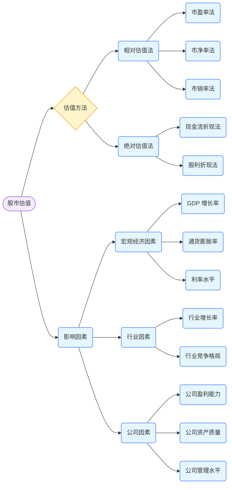

# 俄罗斯股市估值:新兴市场中的特殊案例

> 关键词：俄罗斯股市、新兴市场、股市估值、特殊案例、估值方法

> 摘要：本文聚焦于俄罗斯股市估值这一新兴市场中的特殊案例。首先介绍了研究俄罗斯股市估值的背景，包括目的、预期读者、文档结构和相关术语。接着阐述了股市估值的核心概念、联系及架构，并用 Mermaid 流程图展示。详细讲解了核心算法原理和具体操作步骤，结合 Python 代码进行说明。引入数学模型和公式，辅以举例加深理解。通过项目实战，包括开发环境搭建、源代码实现和解读，进一步剖析俄罗斯股市估值。探讨了其实际应用场景，推荐了学习、开发工具和相关论文著作。最后总结了未来发展趋势与挑战，提供常见问题解答和扩展阅读参考资料，旨在为投资者和研究者全面深入地了解俄罗斯股市估值提供有价值的参考。

## 1. 背景介绍 
### 1.1 目的和范围
研究俄罗斯股市估值在新兴市场中的特殊案例具有多方面的重要目的。一方面，对于全球投资者而言，了解俄罗斯股市的估值情况有助于他们在资产配置中做出更合理的决策，评估俄罗斯股市的投资潜力和风险。另一方面，从学术研究角度来看，俄罗斯作为新兴市场国家，其股市估值的特殊性可以为新兴市场金融理论的发展提供独特的案例和数据支持。

本研究的范围主要涵盖俄罗斯股市的整体估值情况，包括主要指数的估值指标分析，如市盈率（P/E）、市净率（P/B）等。同时，会对比俄罗斯股市与其他新兴市场以及发达市场的估值差异，探究影响俄罗斯股市估值的特殊因素，如政治局势、国际制裁、能源价格波动等。

### 1.2 预期读者
本文的预期读者包括各类投资者，如个人投资者、机构投资者等，他们可以从文章中获取关于俄罗斯股市估值的信息，辅助投资决策。金融研究人员和学者能够通过本文对新兴市场中俄罗斯股市的特殊情况进行深入研究，丰富相关理论。此外，金融从业者，如证券分析师、基金经理等，也可以借鉴本文的分析方法和结论，为其工作提供参考。

### 1.3 文档结构概述
本文将按照以下结构展开：首先介绍背景信息，让读者了解研究的目的、范围、预期读者和文档结构。接着阐述股市估值的核心概念和联系，通过文本示意图和 Mermaid 流程图展示其原理和架构。然后详细讲解核心算法原理和具体操作步骤，结合 Python 代码进行说明。引入数学模型和公式，并举例说明。通过项目实战，包括开发环境搭建、源代码实现和解读，深入剖析俄罗斯股市估值。探讨其实际应用场景，推荐相关的学习资源、开发工具和论文著作。最后总结未来发展趋势与挑战，提供常见问题解答和扩展阅读参考资料。

### 1.4 术语表
#### 1.4.1 核心术语定义
- **股市估值**：指对股票市场整体或个别股票的价值进行评估的过程和方法，常用的估值指标包括市盈率、市净率等。
- **新兴市场**：指发展中国家或地区的股票市场，具有较高的增长潜力，但也伴随着较高的风险和不确定性。
- **市盈率（P/E）**：指股票价格与每股收益的比率，反映了投资者为获取公司每股盈利所愿意支付的价格。
- **市净率（P/B）**：指股票价格与每股净资产的比率，用于衡量股票价格相对于公司净资产的高低。

#### 1.4.2 相关概念解释
- **估值方法**：常见的股市估值方法包括相对估值法和绝对估值法。相对估值法通过与同行业或其他市场的类似股票进行比较来评估股票价值，如市盈率法、市净率法等；绝对估值法则基于股票的内在价值进行评估，如现金流折现法等。
- **风险溢价**：指投资者为承担额外风险而要求的额外回报，在股市估值中，风险溢价是影响估值水平的重要因素之一。

#### 1.4.3 缩略词列表
- **P/E**：市盈率（Price-to-Earnings Ratio）
- **P/B**：市净率（Price-to-Book Ratio）

## 2. 核心概念与联系 
### 股市估值核心概念原理
股市估值的核心目标是确定股票或股票市场的合理价值。从基本原理来看，股票的价值取决于其未来的现金流。投资者购买股票是期望在未来获得股息和资本增值，因此股票的价值可以通过对其未来现金流进行折现来计算。

相对估值法是一种常用的估值方法，它基于市场上类似股票的估值水平来评估目标股票的价值。例如，市盈率法假设同行业或类似公司的市盈率应该相近，如果目标公司的市盈率低于行业平均水平，可能意味着该股票被低估。

绝对估值法，如现金流折现法（DCF），则更为直接地考虑了股票的内在价值。它通过预测公司未来的自由现金流，并将其折现到当前时点，得到股票的内在价值。

### 架构的文本示意图
```plaintext
股市估值
|-- 相对估值法
|   |-- 市盈率法
|   |-- 市净率法
|   |-- 市销率法
|-- 绝对估值法
|   |-- 现金流折现法
|   |-- 股利折现法
|-- 影响因素
|   |-- 宏观经济因素
|   |   |-- GDP 增长率
|   |   |-- 通货膨胀率
|   |   |-- 利率水平
|   |-- 行业因素
|   |   |-- 行业增长率
|   |   |-- 行业竞争格局
|   |-- 公司因素
|   |   |-- 公司盈利能力
|   |   |-- 公司资产质量
|   |   |-- 公司管理水平
```

### Mermaid 流程图


## 3. 核心算法原理 & 具体操作步骤 
### 市盈率法原理
市盈率法是一种简单而常用的相对估值方法。其基本原理是，市场上同行业或类似公司的市盈率具有一定的可比性。如果目标公司的市盈率低于行业平均市盈率，可能意味着该公司的股票被低估；反之，则可能被高估。

市盈率的计算公式为：
$$P/E = \frac{股价}{每股收益}$$

### Python 代码实现
```python
def calculate_pe(stock_price, earnings_per_share):
    """
    计算市盈率
    :param stock_price: 股票价格
    :param earnings_per_share: 每股收益
    :return: 市盈率
    """
    if earnings_per_share == 0:
        return None
    return stock_price / earnings_per_share

# 示例数据
stock_price = 50
earnings_per_share = 5

pe_ratio = calculate_pe(stock_price, earnings_per_share)
print(f"市盈率: {pe_ratio}")
```
### 具体操作步骤
1. **收集数据**：收集目标公司的股票价格和每股收益数据，以及同行业或类似公司的平均市盈率数据。
2. **计算市盈率**：使用上述 Python 代码计算目标公司的市盈率。
3. **比较分析**：将目标公司的市盈率与行业平均市盈率进行比较。如果目标公司的市盈率低于行业平均水平，可能存在投资机会；反之，则需要谨慎考虑。

### 现金流折现法原理
现金流折现法是一种绝对估值方法，它基于公司未来的自由现金流来计算股票的内在价值。其基本原理是，将公司未来各期的自由现金流折现到当前时点，得到公司的内在价值，再除以总股本，得到每股内在价值。

自由现金流的计算公式为：
$$FCF = EBIT(1 - T) + D&A - \Delta WC - CAPEX$$
其中，$EBIT$ 为息税前利润，$T$ 为所得税税率，$D&A$ 为折旧和摊销，$\Delta WC$ 为营运资本变动，$CAPEX$ 为资本支出。

股票内在价值的计算公式为：
$$V = \sum_{t=1}^{n} \frac{FCF_t}{(1 + r)^t} + \frac{TV}{(1 + r)^n}$$
其中，$V$ 为股票内在价值，$FCF_t$ 为第 $t$ 期的自由现金流，$r$ 为折现率，$n$ 为预测期数，$TV$ 为终值。

### Python 代码实现
```python
import numpy as np

def calculate_fcf(ebit, tax_rate, depreciation, working_capital_change, capex):
    """
    计算自由现金流
    :param ebit: 息税前利润
    :param tax_rate: 所得税税率
    :param depreciation: 折旧和摊销
    :param working_capital_change: 营运资本变动
    :param capex: 资本支出
    :return: 自由现金流
    """
    return ebit * (1 - tax_rate) + depreciation - working_capital_change - capex

def calculate_intrinsic_value(fcf_forecasts, discount_rate, terminal_value):
    """
    计算股票内在价值
    :param fcf_forecasts: 自由现金流预测列表
    :param discount_rate: 折现率
    :param terminal_value: 终值
    :return: 股票内在价值
    """
    n = len(fcf_forecasts)
    present_values = []
    for t in range(n):
        present_value = fcf_forecasts[t] / ((1 + discount_rate) ** (t + 1))
        present_values.append(present_value)
    terminal_present_value = terminal_value / ((1 + discount_rate) ** n)
    intrinsic_value = sum(present_values) + terminal_present_value
    return intrinsic_value

# 示例数据
ebit = 100
tax_rate = 0.25
depreciation = 20
working_capital_change = 10
capex = 15
fcf_forecasts = [calculate_fcf(ebit, tax_rate, depreciation, working_capital_change, capex) for _ in range(5)]
discount_rate = 0.1
terminal_value = 500

intrinsic_value = calculate_intrinsic_value(fcf_forecasts, discount_rate, terminal_value)
print(f"股票内在价值: {intrinsic_value}")
```
### 具体操作步骤
1. **预测自由现金流**：根据公司的历史财务数据和业务发展前景，预测未来各期的自由现金流。
2. **确定折现率**：折现率反映了投资者对投资风险的要求，通常可以使用加权平均资本成本（WACC）作为折现率。
3. **计算终值**：终值是指预测期结束后公司的价值，可以使用永续增长模型等方法进行计算。
4. **计算内在价值**：使用上述 Python 代码将各期自由现金流和终值折现到当前时点，得到股票的内在价值。

## 4. 数学模型和公式 & 详细讲解 & 举例说明 
### 市盈率法
#### 公式
$$P/E = \frac{股价}{每股收益}$$

#### 详细讲解
市盈率是衡量股票估值的重要指标之一。它反映了投资者为获取公司每股盈利所愿意支付的价格。一般来说，市盈率越高，说明投资者对公司未来的盈利增长预期越高；反之，则说明投资者对公司的盈利前景不太乐观。

#### 举例说明
假设 A 公司的股票价格为 20 元，每股收益为 2 元，则其市盈率为：
$$P/E = \frac{20}{2} = 10$$
这意味着投资者为获取 A 公司每股 2 元的盈利，愿意支付 20 元的价格，即市盈率为 10 倍。

### 市净率法
#### 公式
$$P/B = \frac{股价}{每股净资产}$$

#### 详细讲解
市净率反映了股票价格相对于公司净资产的高低。市净率较低的股票可能被低估，具有一定的投资价值；反之，市净率较高的股票可能被高估。

#### 举例说明
假设 B 公司的股票价格为 15 元，每股净资产为 5 元，则其市净率为：
$$P/B = \frac{15}{5} = 3$$
这表示 B 公司的股票价格是其每股净资产的 3 倍。

### 现金流折现法
#### 公式
自由现金流计算公式：
$$FCF = EBIT(1 - T) + D&A - \Delta WC - CAPEX$$
股票内在价值计算公式：
$$V = \sum_{t=1}^{n} \frac{FCF_t}{(1 + r)^t} + \frac{TV}{(1 + r)^n}$$

#### 详细讲解
自由现金流是公司在满足了营运资本和资本支出需求后，可供股东和债权人分配的现金流量。通过将未来各期的自由现金流折现到当前时点，可以得到公司的内在价值。

#### 举例说明
假设 C 公司的息税前利润（EBIT）为 200 万元，所得税税率（T）为 25%，折旧和摊销（D&A）为 50 万元，营运资本变动（$\Delta WC$）为 30 万元，资本支出（CAPEX）为 40 万元，则其自由现金流为：
$$FCF = 200\times(1 - 0.25) + 50 - 30 - 40 = 100$$（万元）

假设预测期为 5 年，每年的自由现金流均为 100 万元，折现率（r）为 10%，终值（TV）为 800 万元，则该公司的内在价值为：
$$V = \sum_{t=1}^{5} \frac{100}{(1 + 0.1)^t} + \frac{800}{(1 + 0.1)^5}$$
```python
import numpy as np

fcf = 100
discount_rate = 0.1
terminal_value = 800
n = 5

present_values = []
for t in range(1, n + 1):
    present_value = fcf / ((1 + discount_rate) ** t)
    present_values.append(present_value)
terminal_present_value = terminal_value / ((1 + discount_rate) ** n)
intrinsic_value = sum(present_values) + terminal_present_value

print(f"公司内在价值: {intrinsic_value} 万元")
```

## 5. 项目实战：代码实际案例和详细解释说明 
### 5.1  开发环境搭建
#### 操作系统
可以选择 Windows、Linux 或 macOS 操作系统，建议使用较新的版本以确保兼容性和稳定性。

#### Python 安装
从 Python 官方网站（https://www.python.org/downloads/）下载并安装 Python 3.x 版本。安装过程中建议勾选“Add Python to PATH”选项，以便在命令行中可以直接使用 Python。

#### 安装必要的库
使用以下命令安装所需的 Python 库：
```sh
pip install pandas numpy matplotlib yfinance
```
- `pandas`：用于数据处理和分析。
- `numpy`：提供高效的数值计算功能。
- `matplotlib`：用于数据可视化。
- `yfinance`：用于获取雅虎财经的股票数据。

### 5.2  源代码详细实现和代码解读
```python
import yfinance as yf
import pandas as pd
import matplotlib.pyplot as plt

# 定义函数获取俄罗斯主要股票指数 MOEX 的数据
def get_moex_data(start_date, end_date):
    """
    获取俄罗斯 MOEX 指数的数据
    :param start_date: 开始日期
    :param end_date: 结束日期
    :return: MOEX 指数数据
    """
    ticker = 'IMOEX.ME'
    data = yf.download(ticker, start=start_date, end=end_date)
    return data

# 定义函数计算市盈率
def calculate_pe_ratio(stock_price, earnings_per_share):
    """
    计算市盈率
    :param stock_price: 股票价格
    :param earnings_per_share: 每股收益
    :return: 市盈率
    """
    if earnings_per_share == 0:
        return None
    return stock_price / earnings_per_share

# 主函数
def main():
    start_date = '2020-01-01'
    end_date = '2023-12-31'
    # 获取 MOEX 指数数据
    moex_data = get_moex_data(start_date, end_date)
    # 假设每股收益为 1（这里为简化示例，实际中需要获取真实数据）
    earnings_per_share = 1
    # 计算市盈率
    moex_data['PE Ratio'] = moex_data['Close'].apply(lambda x: calculate_pe_ratio(x, earnings_per_share))
    # 绘制市盈率走势图
    plt.figure(figsize=(12, 6))
    plt.plot(moex_data['PE Ratio'])
    plt.title('MOEX Index PE Ratio')
    plt.xlabel('Date')
    plt.ylabel('PE Ratio')
    plt.grid(True)
    plt.show()

if __name__ == "__main__":
    main()
```

### 5.3  代码解读与分析
#### 数据获取部分
`get_moex_data` 函数使用 `yfinance` 库从雅虎财经获取俄罗斯主要股票指数 MOEX 的数据。用户需要指定开始日期和结束日期，函数将返回一个包含该时间段内 MOEX 指数数据的 `pandas` DataFrame。

#### 市盈率计算部分
`calculate_pe_ratio` 函数用于计算市盈率。它接受股票价格和每股收益作为输入，若每股收益为 0，则返回 `None`，否则返回计算得到的市盈率。

#### 主函数部分
在 `main` 函数中，首先指定了数据的时间范围，然后调用 `get_moex_data` 函数获取 MOEX 指数数据。为了简化示例，假设每股收益为 1，实际应用中需要获取真实的每股收益数据。接着，使用 `apply` 方法计算每天的市盈率，并将结果存储在 DataFrame 的新列 `PE Ratio` 中。最后，使用 `matplotlib` 库绘制市盈率走势图，方便用户直观地观察 MOEX 指数市盈率的变化情况。

## 6. 实际应用场景 
### 投资者决策
对于投资者来说，了解俄罗斯股市估值情况可以帮助他们做出更明智的投资决策。如果通过估值分析发现俄罗斯股市整体或某些股票被低估，投资者可以考虑增加对俄罗斯股市的投资；反之，如果估值过高，则可以减少投资或选择其他市场。

例如，当俄罗斯股市的市盈率低于其他新兴市场或历史平均水平时，可能意味着存在投资机会。投资者可以选择具有良好基本面和发展前景的俄罗斯公司股票进行投资。

### 资产配置
在全球资产配置中，俄罗斯股市作为新兴市场的一部分，可以为投资者提供多元化的投资选择。通过对俄罗斯股市估值的研究，投资者可以合理调整其资产组合中俄罗斯股票的比重，以降低投资组合的风险并提高收益。

例如，当全球经济增长放缓，其他发达市场表现不佳时，俄罗斯股市可能因其独特的经济结构和资源优势而具有一定的抗跌性。此时，投资者可以适当增加俄罗斯股票在资产组合中的比例。

### 金融研究
金融研究人员可以将俄罗斯股市估值作为新兴市场研究的一个特殊案例，深入探究影响股市估值的因素和机制。通过对比俄罗斯股市与其他新兴市场和发达市场的估值差异，研究人员可以发现新兴市场股市估值的特点和规律，为金融理论的发展提供实证支持。

例如，研究人员可以分析俄罗斯政治局势、国际制裁、能源价格波动等特殊因素对股市估值的影响，以及这些因素与其他新兴市场的异同。

### 企业融资
对于俄罗斯本土企业来说，了解股市估值情况有助于它们制定合理的融资策略。如果股市估值较高，企业可以通过发行股票等方式筹集更多的资金；反之，如果估值较低，企业可能会选择其他融资渠道，如债券融资等。

例如，一家俄罗斯能源企业在股市估值较高时，可以通过增发股票来扩大生产规模、进行技术创新或收购其他企业，以提升自身的竞争力。

## 7. 工具和资源推荐
### 7.1 学习资源推荐
#### 7.1.1 书籍推荐
- 《证券分析》（Security Analysis）：由本杰明·格雷厄姆（Benjamin Graham）和大卫·多德（David Dodd）所著，是价值投资领域的经典著作，详细介绍了股票估值的基本方法和理论。
- 《聪明的投资者》（The Intelligent Investor）：同样是本杰明·格雷厄姆的作品，强调了投资者的心态和投资策略，对股市估值和投资决策具有重要的指导意义。
- 《估值：难点、解决方案及相关案例》（Valuation: Measuring and Managing the Value of Companies）：由蒂姆·科勒（Tim Koller）、马克·戈德哈特（Marc Goedhart）和大卫·韦塞尔（David Wessels）所著，全面介绍了企业估值的各种方法和技巧，包括现金流折现法、相对估值法等。

#### 7.1.2 在线课程
- Coursera 上的“投资学原理”（Principles of Investments）课程：由知名大学教授授课，涵盖了股票估值、资产定价等投资学的核心内容。
- edX 上的“金融市场”（Financial Markets）课程：耶鲁大学教授罗伯特·席勒（Robert Shiller）主讲，深入讲解了金融市场的运行机制和股票估值方法。
- 网易云课堂上的“股票估值与投资分析”课程：结合实际案例，详细介绍了股票估值的方法和应用。

#### 7.1.3 技术博客和网站
- Seeking Alpha（https://seekingalpha.com/）：提供全球股市的分析和评论，包括对俄罗斯股市的研究报告和估值分析。
- Bloomberg（https://www.bloomberg.com/）：全球知名的金融资讯网站，提供实时的股票行情、财经新闻和分析报告，有助于了解俄罗斯股市的最新动态。
- Investing.com（https://www.investing.com/）：提供丰富的金融市场数据和分析工具，包括俄罗斯股市的估值指标和图表。

### 7.2 开发工具框架推荐
#### 7.2.1 IDE和编辑器
- PyCharm：一款专业的 Python 集成开发环境，具有强大的代码编辑、调试和分析功能，适合进行 Python 数据分析和开发。
- Jupyter Notebook：一种交互式的开发环境，支持 Python 代码的编写、运行和可视化，非常适合进行数据探索和分析。
- Visual Studio Code：一款轻量级的代码编辑器，支持多种编程语言和插件，可通过安装相关插件来进行 Python 开发和数据分析。

#### 7.2.2 调试和性能分析工具
- pdb：Python 内置的调试器，可以帮助开发者定位代码中的错误和问题。
- cProfile：Python 标准库中的性能分析工具，可以分析代码的运行时间和函数调用情况，帮助优化代码性能。
- Py-Spy：一个跨平台的 Python 性能分析工具，可以实时监测 Python 程序的性能，找出性能瓶颈。

#### 7.2.3 相关框架和库
- pandas：用于数据处理和分析的 Python 库，提供了高效的数据结构和数据操作方法，适合处理股票数据。
- numpy：提供了高效的数值计算功能，是许多数据分析和机器学习库的基础。
- matplotlib：用于数据可视化的 Python 库，可以绘制各种类型的图表，如折线图、柱状图等，方便展示股票估值数据。
- yfinance：用于获取雅虎财经的股票数据，简单易用，支持多种股票市场和指数。

### 7.3 相关论文著作推荐
#### 7.3.1 经典论文
- Fama, E. F., & French, K. R. (1992). The cross-section of expected stock returns. Journal of Finance, 47(2), 427-465. 该论文提出了著名的 Fama-French 三因子模型，对股票收益率的横截面进行了深入研究，对股市估值有重要的理论意义。
- Sharpe, W. F. (1964). Capital asset prices: A theory of market equilibrium under conditions of risk. The Journal of Finance, 19(3), 425-442. 这篇论文提出了资本资产定价模型（CAPM），为股票估值和投资决策提供了重要的理论基础。

#### 7.3.2 最新研究成果
- 通过 Google Scholar 等学术搜索引擎，可以搜索到关于俄罗斯股市估值的最新研究论文。这些论文通常会关注俄罗斯股市的特殊因素，如政治局势、国际制裁等对估值的影响，以及新兴的估值方法和模型在俄罗斯股市的应用。

#### 7.3.3 应用案例分析
- 一些金融研究机构和咨询公司会发布关于俄罗斯股市估值的应用案例分析报告。这些报告通常会结合具体的公司或行业，详细分析其估值情况和投资价值，为投资者提供实际的参考。

## 8. 总结：未来发展趋势与挑战
### 未来发展趋势
#### 经济结构调整
俄罗斯政府一直在推动经济结构调整，减少对能源行业的依赖，发展制造业、科技产业等多元化经济。随着经济结构的优化，俄罗斯股市的行业分布可能会更加均衡，一些新兴产业的股票可能会受到更多关注，从而提升股市的整体估值水平。

#### 国际合作加强
俄罗斯与其他国家和地区的经济合作不断加强，特别是与亚洲国家的贸易往来日益频繁。这将为俄罗斯企业带来更多的发展机遇，提高企业的盈利能力，进而对股市估值产生积极影响。

#### 金融市场改革
俄罗斯政府正在推进金融市场改革，加强市场监管，提高市场透明度和效率。这些改革措施将有助于吸引更多的国内外投资者，增加市场流动性，提升俄罗斯股市的国际竞争力和估值水平。

### 挑战
#### 政治局势不确定性
俄罗斯的政治局势存在一定的不确定性，地缘政治冲突可能会对股市产生负面影响。国际制裁也可能限制俄罗斯企业的发展和融资渠道，导致股市估值下降。

#### 能源价格波动
俄罗斯是能源大国，能源价格的波动对俄罗斯经济和股市影响较大。如果能源价格下跌，可能会导致俄罗斯企业的盈利下降，股市估值受到压力。

#### 全球经济环境变化
全球经济环境的变化，如全球经济衰退、利率上升等，可能会影响投资者对新兴市场的风险偏好，导致资金从俄罗斯股市流出，对股市估值造成冲击。

## 9. 附录：常见问题与解答
### 问题 1：俄罗斯股市估值与其他新兴市场有何不同？
解答：俄罗斯股市估值与其他新兴市场存在多方面的不同。首先，俄罗斯经济对能源行业的依赖程度较高，能源价格波动对股市估值影响较大，而其他新兴市场可能在经济结构上更加多元化。其次，俄罗斯面临的地缘政治局势和国际制裁等特殊因素也会对股市估值产生独特的影响，这与其他新兴市场有所不同。

### 问题 2：如何获取俄罗斯股市的准确估值数据？
解答：可以通过专业的金融数据提供商，如 Bloomberg、Reuters 等获取俄罗斯股市的估值数据。此外，雅虎财经、Investing.com 等网站也提供俄罗斯股市的基本估值指标，如市盈率、市净率等。一些金融研究机构和咨询公司也会发布关于俄罗斯股市估值的研究报告。

### 问题 3：俄罗斯股市估值的变化对投资者有哪些影响？
解答：如果俄罗斯股市估值上升，可能意味着股票价格上涨，投资者的资产价值增加。同时，较高的估值也可能吸引更多的投资者进入市场，进一步推动股价上涨。反之，如果股市估值下降，投资者的资产价值可能会缩水，市场信心可能受到影响，导致资金流出。

### 问题 4：哪些因素会导致俄罗斯股市估值的波动？
解答：影响俄罗斯股市估值波动的因素包括宏观经济因素，如 GDP 增长率、通货膨胀率、利率水平等；行业因素，如能源价格波动、行业竞争格局变化等；公司因素，如公司盈利能力、资产质量等；以及政治因素，如地缘政治冲突、国际制裁等。

## 10. 扩展阅读 & 参考资料
### 扩展阅读
- 《新兴市场投资指南》：深入介绍了新兴市场的投资机会和风险，包括俄罗斯等国家的股市投资。
- 《国际金融市场》：全面介绍了国际金融市场的运行机制和发展趋势，有助于了解俄罗斯股市在全球金融市场中的地位。

### 参考资料
- 俄罗斯联邦统计局官方网站：提供俄罗斯的经济数据和统计信息。
- 俄罗斯中央银行官方网站：发布货币政策、金融市场等方面的信息。
- 相关金融研究报告和学术论文，可通过 Google Scholar、万方数据等学术搜索引擎获取。

作者：AI天才研究院/AI Genius Institute & 禅与计算机程序设计艺术 /Zen And The Art of Computer Programming