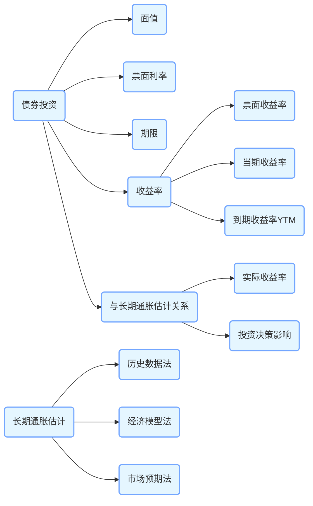

# 债券投资新机遇：收益率超过长期通胀估计的意义

> 关键词：债券投资、收益率、长期通胀估计、投资机遇、经济影响

> 摘要：本文深入探讨了债券投资中收益率超过长期通胀估计这一现象的意义。首先介绍了相关背景知识，包括目的、预期读者和文档结构等。接着阐述了债券投资、收益率以及长期通胀估计等核心概念及其联系，通过Mermaid流程图进行了直观展示。详细讲解了涉及的核心算法原理，并给出Python代码示例。分析了相关数学模型和公式，通过具体例子进行说明。以实际项目案例展示了如何在债券投资中应用这些原理，包括开发环境搭建、源代码实现与解读。探讨了这一现象在实际中的应用场景，推荐了学习、开发所需的工具和资源，包括书籍、在线课程、论文等。最后总结了未来发展趋势与挑战，解答了常见问题，并提供了扩展阅读和参考资料，为投资者把握债券投资新机遇提供了全面且深入的指导。

## 1. 背景介绍 
### 1.1 目的和范围
在当前复杂多变的金融市场环境下，债券投资作为一种重要的投资方式，其收益率与长期通胀估计之间的关系备受关注。本文的目的在于深入剖析债券投资收益率超过长期通胀估计这一情况所蕴含的意义，为投资者、金融从业者以及对金融市场感兴趣的人士提供全面且深入的理解。

范围涵盖了债券投资的基本概念、收益率的计算与分析、长期通胀估计的方法和意义，以及两者之间的相互关系。同时，通过实际案例和数学模型，探讨这一现象在实际投资中的应用和影响。

### 1.2 预期读者
本文的预期读者包括：
- 投资者：希望通过债券投资实现资产增值，了解债券投资新机遇的个人和机构投资者。
- 金融从业者：如银行理财经理、证券分析师、基金经理等，需要深入掌握债券市场动态和投资策略的专业人士。
- 金融研究人员：从事金融市场、宏观经济等领域研究的学者和研究人员，对债券投资与通胀关系感兴趣的人群。
- 金融专业学生：正在学习金融相关课程，希望了解债券投资实践知识的学生。

### 1.3 文档结构概述
本文将按照以下结构进行阐述：
1. 背景介绍：介绍文章的目的、预期读者和文档结构，为后续内容奠定基础。
2. 核心概念与联系：详细解释债券投资、收益率和长期通胀估计等核心概念，并通过文本示意图和Mermaid流程图展示它们之间的联系。
3. 核心算法原理 & 具体操作步骤：讲解计算债券收益率和估计长期通胀的核心算法原理，并给出Python源代码示例。
4. 数学模型和公式 & 详细讲解 & 举例说明：介绍相关的数学模型和公式，通过具体例子进行详细解释。
5. 项目实战：代码实际案例和详细解释说明：通过实际项目案例，展示如何在债券投资中应用上述原理，包括开发环境搭建、源代码实现和代码解读。
6. 实际应用场景：探讨债券投资收益率超过长期通胀估计在实际中的应用场景和意义。
7. 工具和资源推荐：推荐学习和开发所需的工具和资源，包括书籍、在线课程、开发工具、框架和相关论文。
8. 总结：未来发展趋势与挑战：总结债券投资的未来发展趋势和面临的挑战。
9. 附录：常见问题与解答：解答读者在阅读过程中可能遇到的常见问题。
10. 扩展阅读 & 参考资料：提供相关的扩展阅读材料和参考资料，方便读者进一步深入学习。

### 1.4 术语表
#### 1.4.1 核心术语定义
- 债券投资：指投资者购买债券以获取固定利息收入和本金偿还的投资行为。债券是发行人向投资者发行的一种债务凭证，承诺在一定期限内支付利息并偿还本金。
- 收益率：指债券投资所获得的收益与投资成本的比率，通常用百分比表示。常见的收益率指标包括票面收益率、当期收益率、到期收益率等。
- 长期通胀估计：指对未来较长一段时间内通货膨胀率的预测和估计。通货膨胀是指物价水平持续上涨的现象，会影响货币的购买力和投资的实际收益。

#### 1.4.2 相关概念解释
- 实际收益率：指扣除通货膨胀因素后的收益率，反映了投资的实际增值能力。计算公式为：实际收益率 = （1 + 名义收益率）/（1 + 通货膨胀率） - 1。
- 通胀保值债券（TIPS）：一种与通货膨胀挂钩的债券，其本金和利息会根据通货膨胀率进行调整，以保证投资者的实际收益不受通货膨胀的影响。
- 利率期限结构：指不同期限债券的收益率之间的关系，通常用收益率曲线来表示。收益率曲线的形状可以反映市场对未来利率走势的预期。

#### 1.4.3 缩略词列表
- TIPS：Treasury Inflation-Protected Securities，通胀保值债券
- YTM：Yield to Maturity，到期收益率

## 2. 核心概念与联系 

### 核心概念原理
#### 债券投资
债券投资是一种相对稳健的投资方式，投资者通过购买债券，成为债券发行人的债权人，享有按照约定获得利息和本金的权利。债券的发行人可以是政府、金融机构或企业等。债券的基本要素包括面值、票面利率、期限等。

面值是债券的票面金额，是发行人承诺在债券到期时偿还给投资者的本金数额。票面利率是债券发行人每年向投资者支付的利息与面值的比率，决定了投资者每年获得的利息收入。期限是债券从发行到到期的时间长度，不同期限的债券具有不同的风险和收益特征。

#### 收益率
收益率是衡量债券投资收益水平的重要指标。常见的收益率指标包括：
- 票面收益率：指债券票面利率，即债券发行人每年支付的利息与面值的比率。例如，一张面值为1000元、票面利率为5%的债券，每年支付的利息为1000 × 5% = 50元。
- 当期收益率：指债券当前的利息收入与债券当前市场价格的比率。计算公式为：当期收益率 = 年利息收入 / 当前债券市场价格。例如，上述债券当前市场价格为950元，则当期收益率 = 50 / 950 ≈ 5.26%。
- 到期收益率（YTM）：指假设投资者持有债券至到期，期间将收到的利息按照到期收益率进行再投资，并且在到期时收回本金，所获得的平均年化收益率。到期收益率是衡量债券投资收益的最全面指标，考虑了债券的票面利率、市场价格、期限等因素。

#### 长期通胀估计
长期通胀估计是对未来较长一段时间内通货膨胀率的预测和估计。通货膨胀是指物价水平持续上涨的现象，会导致货币的购买力下降。长期通胀估计对于投资者来说非常重要，因为它会影响投资的实际收益。

常见的长期通胀估计方法包括：
- 历史数据法：通过分析过去一段时间内的通货膨胀数据，找出通货膨胀的变化规律和趋势，以此来预测未来的通货膨胀率。
- 经济模型法：利用宏观经济模型，考虑经济增长、货币供应量、利率等因素，对未来的通货膨胀率进行预测。
- 市场预期法：通过观察市场上的通胀保值债券（TIPS）与普通债券的收益率差异，来推断市场对未来通货膨胀率的预期。

### 架构的文本示意图
```plaintext
债券投资
|-- 面值
|-- 票面利率
|-- 期限
|-- 收益率
    |-- 票面收益率
    |-- 当期收益率
    |-- 到期收益率（YTM）
|-- 与长期通胀估计的关系
    |-- 实际收益率
    |-- 投资决策影响

长期通胀估计
|-- 历史数据法
|-- 经济模型法
|-- 市场预期法
```

### Mermaid流程图


## 3. 核心算法原理 & 具体操作步骤 

### 债券收益率计算原理
#### 票面收益率
票面收益率的计算非常简单，直接根据债券的票面利率确定。公式为：
票面收益率 = 票面利率

#### 当期收益率
当期收益率的计算公式为：
当期收益率 = 年利息收入 / 当前债券市场价格

#### 到期收益率（YTM）
到期收益率的计算相对复杂，通常需要使用迭代法或金融计算器来求解。假设债券的面值为 $F$，票面利率为 $C$，期限为 $n$ 年，当前市场价格为 $P$，每年付息次数为 $m$，则到期收益率 $YTM$ 满足以下方程：

$$P = \sum_{t=1}^{mn} \frac{C/F \times F/m}{(1 + YTM/m)^t} + \frac{F}{(1 + YTM/m)^{mn}}$$

### Python代码实现
```python
import numpy as np

# 定义计算当期收益率的函数
def current_yield(annual_interest, current_price):
    """
    计算当期收益率
    :param annual_interest: 年利息收入
    :param current_price: 当前债券市场价格
    :return: 当期收益率
    """
    return annual_interest / current_price

# 定义计算到期收益率的函数（使用牛顿迭代法）
def yield_to_maturity(face_value, coupon_rate, years_to_maturity, price, coupon_frequency=1):
    """
    计算到期收益率
    :param face_value: 债券面值
    :param coupon_rate: 票面利率
    :param years_to_maturity: 剩余期限（年）
    :param price: 当前债券市场价格
    :param coupon_frequency: 每年付息次数
    :return: 到期收益率
    """
    def bond_price(yield_rate):
        """
        计算债券价格
        :param yield_rate: 收益率
        :return: 债券价格
        """
        periods = years_to_maturity * coupon_frequency
        coupon_payment = face_value * coupon_rate / coupon_frequency
        discount_rate = yield_rate / coupon_frequency
        price = 0
        for t in range(1, periods + 1):
            price += coupon_payment / (1 + discount_rate) ** t
        price += face_value / (1 + discount_rate) ** periods
        return price

    def bond_price_derivative(yield_rate):
        """
        计算债券价格对收益率的导数
        :param yield_rate: 收益率
        :return: 导数
        """
        periods = years_to_maturity * coupon_frequency
        coupon_payment = face_value * coupon_rate / coupon_frequency
        discount_rate = yield_rate / coupon_frequency
        derivative = 0
        for t in range(1, periods + 1):
            derivative -= t * coupon_payment / (1 + discount_rate) ** (t + 1) / coupon_frequency
        derivative -= periods * face_value / (1 + discount_rate) ** (periods + 1) / coupon_frequency
        return derivative

    # 初始猜测值
    ytm = coupon_rate
    # 迭代求解
    for _ in range(100):
        price_estimate = bond_price(ytm)
        price_derivative = bond_price_derivative(ytm)
        ytm = ytm - (price_estimate - price) / price_derivative
    return ytm

# 示例
face_value = 1000
coupon_rate = 0.05
years_to_maturity = 5
current_price = 950
annual_interest = face_value * coupon_rate

# 计算当期收益率
cy = current_yield(annual_interest, current_price)
print(f"当期收益率: {cy * 100:.2f}%")

# 计算到期收益率
ytm = yield_to_maturity(face_value, coupon_rate, years_to_maturity, current_price)
print(f"到期收益率: {ytm * 100:.2f}%")
```

### 具体操作步骤
1. 收集债券的相关信息，包括面值、票面利率、期限、当前市场价格等。
2. 根据上述公式和代码，计算债券的票面收益率、当期收益率和到期收益率。
3. 对计算结果进行分析，评估债券的投资价值。

## 4. 数学模型和公式 & 详细讲解 & 举例说明 

### 债券价格与收益率的关系
债券价格与收益率之间存在反向关系，即收益率上升时，债券价格下降；收益率下降时，债券价格上升。这是因为债券的票面利率是固定的，当市场利率上升时，新发行的债券会提供更高的利率，使得已发行债券的吸引力下降，投资者愿意支付的价格也会降低；反之亦然。

债券价格的计算公式为：

$$P = \sum_{t=1}^{n} \frac{C}{(1 + r)^t} + \frac{F}{(1 + r)^n}$$

其中，$P$ 为债券价格，$C$ 为每年支付的利息，$r$ 为市场利率（即收益率），$F$ 为债券面值，$n$ 为剩余期限。

### 实际收益率的计算
实际收益率是扣除通货膨胀因素后的收益率，反映了投资的实际增值能力。计算公式为：

$$实际收益率 = \frac{1 + 名义收益率}{1 + 通货膨胀率} - 1$$

### 举例说明
假设投资者购买了一张面值为1000元、票面利率为5%、期限为5年的债券，当前市场价格为950元。同时，预计未来5年的平均通货膨胀率为3%。

#### 计算名义收益率
- 当期收益率：
年利息收入 = 1000 × 5% = 50元
当期收益率 = 50 / 950 ≈ 5.26%

- 到期收益率：
使用上述Python代码计算得到到期收益率约为6.38%。

#### 计算实际收益率
以到期收益率作为名义收益率，实际收益率为：

$$实际收益率 = \frac{1 + 0.0638}{1 + 0.03} - 1 \approx 3.28\%$$

这意味着投资者在考虑通货膨胀因素后，实际获得的年化收益率约为3.28%。

### 久期和凸性
久期（Duration）和凸性（Convexity）是衡量债券价格对收益率变动敏感性的重要指标。

#### 久期
久期是债券现金流的加权平均到期时间，反映了债券价格对收益率变动的一阶敏感性。计算公式为：

$$D = \frac{\sum_{t=1}^{n} t \times \frac{C}{(1 + r)^t} + n \times \frac{F}{(1 + r)^n}}{P}$$

其中，$D$ 为久期，其他变量含义同上。

#### 凸性
凸性是债券价格对收益率变动的二阶敏感性，反映了久期随收益率变动的变化情况。计算公式为：

$$Cx = \frac{\sum_{t=1}^{n} t(t + 1) \times \frac{C}{(1 + r)^{t + 2}} + n(n + 1) \times \frac{F}{(1 + r)^{n + 2}}}{P}$$

其中，$Cx$ 为凸性。

久期和凸性可以帮助投资者更好地管理债券投资组合的风险，例如通过调整组合的久期来对冲利率风险。

## 5. 项目实战：代码实际案例和详细解释说明 

### 5.1  开发环境搭建
#### 操作系统
可以选择Windows、Linux或macOS等常见操作系统。

#### Python环境
建议使用Python 3.7及以上版本。可以从Python官方网站（https://www.python.org/downloads/）下载并安装Python。

#### 开发工具
可以使用以下开发工具：
- PyCharm：一款功能强大的Python集成开发环境（IDE），提供代码编辑、调试、版本控制等功能。
- Jupyter Notebook：一种交互式的开发环境，适合进行数据分析和代码演示。

#### 安装必要的库
在命令行中使用以下命令安装必要的库：
```sh
pip install numpy
```

### 5.2  源代码详细实现和代码解读
```python
import numpy as np

# 定义计算当期收益率的函数
def current_yield(annual_interest, current_price):
    """
    计算当期收益率
    :param annual_interest: 年利息收入
    :param current_price: 当前债券市场价格
    :return: 当期收益率
    """
    return annual_interest / current_price

# 定义计算到期收益率的函数（使用牛顿迭代法）
def yield_to_maturity(face_value, coupon_rate, years_to_maturity, price, coupon_frequency=1):
    """
    计算到期收益率
    :param face_value: 债券面值
    :param coupon_rate: 票面利率
    :param years_to_maturity: 剩余期限（年）
    :param price: 当前债券市场价格
    :param coupon_frequency: 每年付息次数
    :return: 到期收益率
    """
    def bond_price(yield_rate):
        """
        计算债券价格
        :param yield_rate: 收益率
        :return: 债券价格
        """
        periods = years_to_maturity * coupon_frequency
        coupon_payment = face_value * coupon_rate / coupon_frequency
        discount_rate = yield_rate / coupon_frequency
        price = 0
        for t in range(1, periods + 1):
            price += coupon_payment / (1 + discount_rate) ** t
        price += face_value / (1 + discount_rate) ** periods
        return price

    def bond_price_derivative(yield_rate):
        """
        计算债券价格对收益率的导数
        :param yield_rate: 收益率
        :return: 导数
        """
        periods = years_to_maturity * coupon_frequency
        coupon_payment = face_value * coupon_rate / coupon_frequency
        discount_rate = yield_rate / coupon_frequency
        derivative = 0
        for t in range(1, periods + 1):
            derivative -= t * coupon_payment / (1 + discount_rate) ** (t + 1) / coupon_frequency
        derivative -= periods * face_value / (1 + discount_rate) ** (periods + 1) / coupon_frequency
        return derivative

    # 初始猜测值
    ytm = coupon_rate
    # 迭代求解
    for _ in range(100):
        price_estimate = bond_price(ytm)
        price_derivative = bond_price_derivative(ytm)
        ytm = ytm - (price_estimate - price) / price_derivative
    return ytm

# 示例
face_value = 1000
coupon_rate = 0.05
years_to_maturity = 5
current_price = 950
annual_interest = face_value * coupon_rate

# 计算当期收益率
cy = current_yield(annual_interest, current_price)
print(f"当期收益率: {cy * 100:.2f}%")

# 计算到期收益率
ytm = yield_to_maturity(face_value, coupon_rate, years_to_maturity, current_price)
print(f"到期收益率: {ytm * 100:.2f}%")
```

### 代码解读与分析
#### 当期收益率计算函数 `current_yield`
该函数接受年利息收入和当前债券市场价格作为输入，返回当期收益率。计算公式为年利息收入除以当前债券市场价格。

#### 到期收益率计算函数 `yield_to_maturity`
该函数使用牛顿迭代法求解到期收益率。具体步骤如下：
1. 定义内部函数 `bond_price`，用于根据给定的收益率计算债券价格。
2. 定义内部函数 `bond_price_derivative`，用于计算债券价格对收益率的导数。
3. 初始化到期收益率的猜测值为票面利率。
4. 进行迭代求解，每次迭代根据牛顿迭代公式更新到期收益率的估计值，直到满足收敛条件或达到最大迭代次数。

#### 示例代码
定义了债券的相关参数，包括面值、票面利率、剩余期限和当前市场价格。调用 `current_yield` 和 `yield_to_maturity` 函数分别计算当期收益率和到期收益率，并打印结果。

## 6. 实际应用场景 
### 投资者资产配置
当债券投资收益率超过长期通胀估计时，意味着投资者的实际收益为正，债券投资具有较高的吸引力。投资者可以将一部分资产配置到债券市场，以实现资产的保值增值。例如，在通货膨胀预期较高的时期，投资者可以选择购买通胀保值债券（TIPS），以确保投资的实际收益不受通货膨胀的影响。

### 企业融资决策
对于企业来说，债券市场是重要的融资渠道之一。当债券投资收益率超过长期通胀估计时，企业发行债券的成本相对较低，有利于企业通过发行债券筹集资金。企业可以根据市场情况和自身需求，合理安排债券发行规模和期限，优化融资结构。

### 宏观经济分析
债券投资收益率与长期通胀估计之间的关系可以反映宏观经济的运行状况。如果债券收益率持续超过长期通胀估计，可能意味着经济增长前景较好，市场对未来通货膨胀的预期较低。反之，如果债券收益率低于长期通胀估计，可能暗示经济面临通缩压力或市场对未来通货膨胀的预期较高。政府和央行可以根据这些信息制定相应的宏观经济政策。

### 金融机构风险管理
金融机构如银行、保险公司等持有大量的债券资产。债券投资收益率超过长期通胀估计可以提高金融机构的资产质量和盈利能力。同时，金融机构可以通过合理配置债券资产，利用久期和凸性等指标管理利率风险，确保资产负债的匹配。

## 7. 工具和资源推荐
### 7.1 学习资源推荐
#### 7.1.1 书籍推荐
- 《债券市场：分析与策略》（Bonds: Analysis and Strategies）：作者Frank J. Fabozzi，是债券投资领域的经典教材，涵盖了债券的基本概念、定价、风险管理等方面的内容。
- 《固定收益证券分析》（Analysis of Fixed Income Securities）：作者Bruce Tuckman，深入讲解了固定收益证券的定价、利率期限结构、风险管理等知识，适合有一定金融基础的读者。
- 《通胀目标制：国际经验》（Inflation Targeting: Lessons from International Experience）：作者Ben S. Bernanke等，介绍了通货膨胀目标制的理论和实践，对理解长期通胀估计和货币政策有很大帮助。

#### 7.1.2 在线课程
- Coursera平台上的“固定收益证券分析”课程：由知名大学教授授课，系统讲解了固定收益证券的定价、风险分析等内容。
- edX平台上的“宏观经济学原理”课程：帮助学习者了解宏观经济运行机制，包括通货膨胀、利率等重要概念。
- 中国大学MOOC平台上的“金融市场学”课程：介绍了金融市场的基本理论和实践，包括债券市场的相关知识。

#### 7.1.3 技术博客和网站
- 华尔街见闻（https://wallstreetcn.com/）：提供全球金融市场的实时资讯和分析，包括债券市场动态、通货膨胀数据等。
- 英为财情（https://cn.investing.com/）：提供丰富的金融数据和分析工具，可用于查询债券价格、收益率等信息。
- 中国债券信息网（https://www.chinabond.com.cn/）：是中国债券市场的官方信息平台，提供债券市场的政策法规、发行信息、统计数据等。

### 7.2 开发工具框架推荐
#### 7.2.1 IDE和编辑器
- PyCharm：功能强大的Python集成开发环境，支持代码调试、版本控制等功能，适合专业开发者使用。
- Jupyter Notebook：交互式的开发环境，方便进行数据分析和代码演示，适合初学者和数据科学家使用。
- Visual Studio Code：轻量级的代码编辑器，支持多种编程语言和插件扩展，可用于Python代码的编写和调试。

#### 7.2.2 调试和性能分析工具
- PDB：Python自带的调试工具，可用于调试Python代码，定位问题和查看变量值。
- cProfile：Python的性能分析工具，可用于分析代码的执行时间和函数调用情况，帮助优化代码性能。
- Memory Profiler：用于分析Python代码的内存使用情况，找出内存泄漏和高内存消耗的问题。

#### 7.2.3 相关框架和库
- NumPy：Python的科学计算库，提供了高效的数组操作和数学函数，可用于债券收益率计算等数值计算任务。
- Pandas：用于数据处理和分析的Python库，可用于读取、处理和分析债券市场数据。
- Matplotlib：Python的绘图库，可用于绘制债券收益率曲线、价格走势等图表，直观展示数据。

### 7.3 相关论文著作推荐
#### 7.3.1 经典论文
- Fama, Eugene F., and Robert R. Bliss. "The information in long-maturity forward rates." The American Economic Review 77.4 (1987): 680-692. 该论文研究了长期远期利率所包含的信息，对理解利率期限结构和债券定价有重要意义。
- Campbell, John Y., and Robert J. Shiller. "Yield spreads and interest rate movements: A bird's eye view." The Review of Economic Studies 58.3 (1991): 495-514. 探讨了收益率利差与利率变动之间的关系，为债券投资和风险管理提供了理论支持。

#### 7.3.2 最新研究成果
可以通过学术数据库如IEEE Xplore、ACM Digital Library、SSRN等搜索关于债券投资、通货膨胀预测等方面的最新研究论文。

#### 7.3.3 应用案例分析
- 国际货币基金组织（IMF）的工作报告和研究报告中经常包含债券市场和通货膨胀的应用案例分析，可从IMF官方网站（https://www.imf.org/）获取相关资料。
- 各国央行的研究报告和货币政策文件也提供了丰富的实际应用案例，例如美联储（https://www.federalreserve.gov/）、欧洲央行（https://www.ecb.europa.eu/）等的官方网站。

## 8. 总结：未来发展趋势与挑战
### 未来发展趋势
#### 债券市场创新
随着金融科技的发展，债券市场可能会出现更多的创新产品和服务。例如，区块链技术可以用于债券的发行和交易，提高交易效率和透明度；绿色债券、社会责任债券等可持续金融产品有望得到更广泛的发展，满足投资者对环境和社会影响的关注。

#### 利率市场化深化
利率市场化是金融改革的重要方向。未来，债券市场的利率将更加市场化，债券收益率的形成机制将更加完善。这将使得债券投资更加注重风险管理和定价能力，投资者需要更加关注市场利率的变化和宏观经济形势。

#### 全球债券市场一体化
随着全球经济一体化的深入，全球债券市场的联系将更加紧密。投资者可以更加方便地进行跨境债券投资，分散投资风险。同时，国际债券市场的波动也将对国内债券市场产生更大的影响，需要加强国际间的金融监管合作。

### 挑战
#### 通货膨胀不确定性
尽管长期通胀估计方法不断完善，但通货膨胀仍然具有一定的不确定性。突发的经济事件、政策变化等因素可能导致通货膨胀率偏离预期，从而影响债券投资的实际收益。投资者需要密切关注通货膨胀动态，及时调整投资策略。

#### 利率波动风险
利率是影响债券价格和收益率的重要因素。未来利率的波动可能会更加频繁和剧烈，给债券投资带来较大的风险。投资者需要具备较强的利率风险管理能力，合理运用久期、凸性等工具进行资产配置和风险对冲。

#### 信用风险
债券发行人的信用状况直接影响债券的投资价值。在经济下行周期或市场环境不稳定时，债券发行人的信用风险可能会增加。投资者需要加强对债券发行人的信用分析，选择信用质量较高的债券进行投资。

## 9. 附录：常见问题与解答
### 问题1：债券投资收益率超过长期通胀估计就一定能赚钱吗？
解答：不一定。虽然收益率超过长期通胀估计意味着投资的实际收益为正，但债券投资仍然存在其他风险，如利率风险、信用风险等。如果市场利率上升，债券价格可能会下跌，导致投资者的资本损失；如果债券发行人出现违约情况，投资者可能无法收回本金和利息。因此，投资者在进行债券投资时，需要综合考虑各种风险因素。

### 问题2：如何准确估计长期通货膨胀率？
解答：准确估计长期通货膨胀率是一个具有挑战性的问题，没有一种方法可以完全准确地预测未来的通货膨胀率。可以综合使用多种方法，如历史数据法、经济模型法和市场预期法等。同时，需要关注宏观经济形势、货币政策、供求关系等因素的变化，及时调整通货膨胀估计值。

### 问题3：债券投资和股票投资哪个更好？
解答：债券投资和股票投资各有优缺点，适合不同的投资者和投资目标。债券投资相对稳健，收益相对固定，风险较低，适合风险偏好较低、追求稳定收益的投资者；股票投资具有较高的潜在收益，但风险也相对较高，适合风险偏好较高、追求资本增值的投资者。投资者可以根据自己的风险承受能力、投资目标和投资期限等因素，合理配置债券和股票资产。

### 问题4：什么是债券的久期和凸性，它们有什么作用？
解答：久期是债券现金流的加权平均到期时间，反映了债券价格对收益率变动的一阶敏感性；凸性是债券价格对收益率变动的二阶敏感性，反映了久期随收益率变动的变化情况。久期和凸性可以帮助投资者更好地管理债券投资组合的风险。例如，通过调整组合的久期可以对冲利率风险，当预计市场利率上升时，降低组合的久期；当预计市场利率下降时，增加组合的久期。凸性可以衡量债券价格在收益率变动时的非线性变化，在收益率变动较大时，凸性对债券价格的影响更为明显。

## 10. 扩展阅读 & 参考资料
### 扩展阅读
- 《金融炼金术》（The Alchemy of Finance）：作者George Soros，探讨了金融市场的运行机制和投资者的行为心理，对理解金融市场的复杂性有很大帮助。
- 《聪明的投资者》（The Intelligent Investor）：作者Benjamin Graham，是价值投资的经典著作，介绍了投资的基本原则和方法，对债券投资和股票投资都有指导意义。
- 《黑天鹅：如何应对不可预知的未来》（The Black Swan: The Impact of the Highly Improbable）：作者Nassim Nicholas Taleb，讨论了极端事件对金融市场的影响，提醒投资者要关注不确定性和风险。

### 参考资料
- Fabozzi, Frank J. Bond Markets, Analysis, and Strategies. Pearson, 2019.
- Tuckman, Bruce. Fixed Income Securities: Tools for Today's Markets. Wiley, 2011.
- Bernanke, Ben S., et al. Inflation Targeting: Lessons from International Experience. Princeton University Press, 2001.

作者：AI天才研究院/AI Genius Institute & 禅与计算机程序设计艺术 /Zen And The Art of Computer Programming