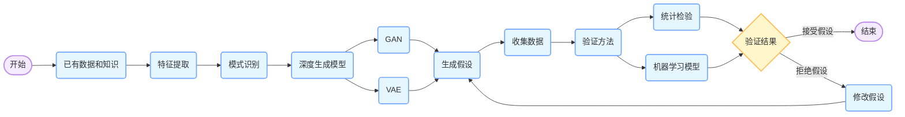

# 假设生成与验证中深度生成模型的应用研究

> 关键词：假设生成与验证、深度生成模型、深度学习、数据生成、模型验证

> 摘要：本文聚焦于深度生成模型在假设生成与验证领域的应用。首先介绍了相关研究的背景信息，包括目的、预期读者、文档结构和术语表。接着阐述了深度生成模型及假设生成与验证的核心概念和它们之间的联系，并给出了相应的文本示意图和Mermaid流程图。详细讲解了核心算法原理，通过Python源代码进行了说明，同时给出了相关的数学模型和公式，并举例分析。在项目实战部分，提供了开发环境搭建的步骤、源代码实现及解读。探讨了深度生成模型在假设生成与验证中的实际应用场景，推荐了学习资源、开发工具框架以及相关论文著作。最后总结了未来发展趋势与挑战，解答了常见问题并列出扩展阅读和参考资料，旨在为相关领域的研究和实践提供全面且深入的指导。

## 1. 背景介绍 
### 1.1 目的和范围
在科学研究、工程实践、商业决策等众多领域，假设生成与验证是一个至关重要的过程。假设生成是提出可能的解释或预测，而验证则是评估这些假设的合理性和有效性。深度生成模型作为近年来深度学习领域的重要成果，具有强大的数据生成能力，能够从给定的数据分布中学习并生成新的数据样本。本研究的目的在于探讨深度生成模型在假设生成与验证过程中的应用，分析其优势和局限性，为相关领域的研究和实践提供理论支持和技术指导。

本研究的范围涵盖了常见的深度生成模型，如生成对抗网络（GAN）、变分自编码器（VAE）等，以及它们在不同领域中的应用场景，包括医学研究、金融分析、图像和文本处理等。

### 1.2 预期读者
本文的预期读者包括计算机科学、统计学、机器学习等领域的研究人员和学生，以及对深度生成模型在实际应用中感兴趣的专业人士，如医学研究人员、金融分析师、数据科学家等。通过阅读本文，读者可以了解深度生成模型在假设生成与验证中的基本原理、算法实现和应用案例，为他们的研究和实践提供参考。

### 1.3 文档结构概述
本文共分为十个部分。第一部分为背景介绍，阐述了研究的目的、范围、预期读者和文档结构。第二部分介绍了深度生成模型和假设生成与验证的核心概念，以及它们之间的联系，并给出了相应的示意图和流程图。第三部分详细讲解了核心算法原理，通过Python源代码进行了说明。第四部分给出了相关的数学模型和公式，并举例分析。第五部分为项目实战，包括开发环境搭建、源代码实现和代码解读。第六部分探讨了深度生成模型在假设生成与验证中的实际应用场景。第七部分推荐了学习资源、开发工具框架以及相关论文著作。第八部分总结了未来发展趋势与挑战。第九部分解答了常见问题。第十部分列出了扩展阅读和参考资料。

### 1.4 术语表
#### 1.4.1 核心术语定义
- **假设生成与验证**：假设生成是指根据已有的数据和知识，提出可能的解释或预测；验证则是通过实验、数据分析等方法，评估这些假设的合理性和有效性。
- **深度生成模型**：一类基于深度学习的模型，能够从给定的数据分布中学习并生成新的数据样本。常见的深度生成模型包括生成对抗网络（GAN）、变分自编码器（VAE）等。
- **生成对抗网络（GAN）**：由生成器和判别器两个神经网络组成，生成器负责生成数据样本，判别器负责判断生成的样本是真实数据还是生成数据，两者通过对抗训练不断提高性能。
- **变分自编码器（VAE）**：一种基于变分推断的自编码器，通过引入潜在变量，能够学习数据的潜在分布，并生成新的数据样本。

#### 1.4.2 相关概念解释
- **潜在空间**：在深度生成模型中，潜在空间是指数据的一种低维表示，通过将高维数据映射到潜在空间，可以学习数据的本质特征和分布。
- **过拟合**：模型在训练数据上表现良好，但在测试数据上表现不佳的现象，通常是由于模型过于复杂，对训练数据的噪声和异常值过于敏感。
- **欠拟合**：模型在训练数据和测试数据上的表现都不佳的现象，通常是由于模型过于简单，无法捕捉数据的复杂特征和分布。

#### 1.4.3 缩略词列表
- **GAN**：Generative Adversarial Network（生成对抗网络）
- **VAE**：Variational Autoencoder（变分自编码器）
- **MLP**：Multilayer Perceptron（多层感知机）

## 2. 核心概念与联系 

### 核心概念原理
#### 深度生成模型
深度生成模型的核心思想是学习数据的概率分布 $p(x)$，其中 $x$ 表示数据样本。通过学习这个分布，模型可以生成新的数据样本，这些样本具有与原始数据相似的特征和统计特性。

- **生成对抗网络（GAN）**：GAN由生成器 $G(z)$ 和判别器 $D(x)$ 组成，其中 $z$ 是随机噪声向量，$x$ 是数据样本。生成器的目标是生成逼真的数据样本，使得判别器无法区分生成的样本和真实数据；判别器的目标是准确判断输入的样本是真实数据还是生成数据。两者通过对抗训练不断提高性能，最终达到一个纳什均衡。
- **变分自编码器（VAE）**：VAE是一种基于变分推断的自编码器，它将输入数据 $x$ 编码为潜在变量 $z$ 的概率分布 $q(z|x)$，然后从这个分布中采样得到 $z$，再通过解码器 $p(x|z)$ 生成重构数据 $\hat{x}$。VAE的目标是最小化重构误差和潜在变量分布与先验分布之间的KL散度。

#### 假设生成与验证
假设生成与验证是一个迭代的过程，通常包括以下步骤：
1. **假设生成**：根据已有的数据和知识，提出可能的解释或预测。这些假设可以是基于经验、理论或直觉。
2. **数据收集**：收集与假设相关的数据，用于验证假设。
3. **假设验证**：使用统计方法或机器学习模型，对假设进行验证。如果假设通过验证，则可以接受该假设；否则，需要修改或重新提出假设。

### 架构的文本示意图
```plaintext
深度生成模型在假设生成与验证中的应用架构

假设生成：
|-- 已有数据和知识
|   |-- 特征提取
|   |-- 模式识别
|-- 深度生成模型
|   |-- GAN
|   |-- VAE
|   |--...
|-- 生成假设

假设验证：
|-- 生成的假设
|-- 收集的数据
|-- 验证方法
|   |-- 统计检验
|   |-- 机器学习模型
|-- 验证结果
|   |-- 接受假设
|   |-- 拒绝假设
|   |-- 修改假设
```

### Mermaid流程图


## 3. 核心算法原理 & 具体操作步骤 

### 生成对抗网络（GAN）原理
GAN的核心思想是通过生成器和判别器的对抗训练来学习数据的分布。生成器 $G(z)$ 接受随机噪声向量 $z$ 作为输入，生成数据样本 $G(z)$；判别器 $D(x)$ 接受数据样本 $x$ 作为输入，输出一个概率值，表示 $x$ 是真实数据的概率。

GAN的训练过程可以分为两个阶段：
1. **训练判别器**：固定生成器的参数，最大化判别器正确分类真实数据和生成数据的能力。判别器的损失函数可以表示为：
$$L_D = -\mathbb{E}_{x\sim p_{data}(x)}[\log D(x)] - \mathbb{E}_{z\sim p(z)}[\log(1 - D(G(z)))]$$
其中，$p_{data}(x)$ 是真实数据的分布，$p(z)$ 是随机噪声的分布。

2. **训练生成器**：固定判别器的参数，最大化判别器将生成数据误分类为真实数据的能力。生成器的损失函数可以表示为：
$$L_G = -\mathbb{E}_{z\sim p(z)}[\log D(G(z))]$$

### Python代码实现
```python
import torch
import torch.nn as nn
import torch.optim as optim
import numpy as np
import matplotlib.pyplot as plt

# 定义生成器
class Generator(nn.Module):
    def __init__(self, input_dim, output_dim):
        super(Generator, self).__init__()
        self.model = nn.Sequential(
            nn.Linear(input_dim, 128),
            nn.LeakyReLU(0.2),
            nn.Linear(128, 256),
            nn.BatchNorm1d(256),
            nn.LeakyReLU(0.2),
            nn.Linear(256, 512),
            nn.BatchNorm1d(512),
            nn.LeakyReLU(0.2),
            nn.Linear(512, output_dim),
            nn.Tanh()
        )

    def forward(self, z):
        return self.model(z)

# 定义判别器
class Discriminator(nn.Module):
    def __init__(self, input_dim):
        super(Discriminator, self).__init__()
        self.model = nn.Sequential(
            nn.Linear(input_dim, 512),
            nn.LeakyReLU(0.2),
            nn.Linear(512, 256),
            nn.LeakyReLU(0.2),
            nn.Linear(256, 1),
            nn.Sigmoid()
        )

    def forward(self, x):
        return self.model(x)

# 超参数设置
input_dim = 100
output_dim = 784
batch_size = 32
epochs = 100
lr = 0.0002

# 初始化生成器和判别器
generator = Generator(input_dim, output_dim)
discriminator = Discriminator(output_dim)

# 定义损失函数和优化器
criterion = nn.BCELoss()
g_optimizer = optim.Adam(generator.parameters(), lr=lr)
d_optimizer = optim.Adam(discriminator.parameters(), lr=lr)

# 模拟数据
real_data = torch.randn(batch_size, output_dim)

# 训练过程
for epoch in range(epochs):
    # 训练判别器
    d_optimizer.zero_grad()
    real_labels = torch.ones(batch_size, 1)
    fake_labels = torch.zeros(batch_size, 1)

    # 计算判别器对真实数据的损失
    real_output = discriminator(real_data)
    d_real_loss = criterion(real_output, real_labels)

    # 生成假数据
    z = torch.randn(batch_size, input_dim)
    fake_data = generator(z)

    # 计算判别器对假数据的损失
    fake_output = discriminator(fake_data.detach())
    d_fake_loss = criterion(fake_output, fake_labels)

    # 总判别器损失
    d_loss = d_real_loss + d_fake_loss
    d_loss.backward()
    d_optimizer.step()

    # 训练生成器
    g_optimizer.zero_grad()
    fake_output = discriminator(fake_data)
    g_loss = criterion(fake_output, real_labels)
    g_loss.backward()
    g_optimizer.step()

    if epoch % 10 == 0:
        print(f'Epoch {epoch}, D_loss: {d_loss.item()}, G_loss: {g_loss.item()}')

# 生成一些样本
z = torch.randn(16, input_dim)
generated_samples = generator(z).detach().numpy()

# 可视化生成的样本
plt.figure(figsize=(4, 4))
for i in range(16):
    plt.subplot(4, 4, i + 1)
    plt.imshow(generated_samples[i].reshape(28, 28), cmap='gray')
    plt.axis('off')
plt.show()
```

### 具体操作步骤
1. **数据准备**：准备真实数据，如MNIST手写数字数据集。
2. **模型定义**：定义生成器和判别器的神经网络结构。
3. **损失函数和优化器定义**：使用二元交叉熵损失函数和Adam优化器。
4. **训练过程**：交替训练判别器和生成器，直到模型收敛。
5. **生成样本**：使用训练好的生成器生成新的数据样本。

## 4. 数学模型和公式 & 详细讲解 & 举例说明 

### 生成对抗网络（GAN）的数学模型
#### 目标函数
GAN的目标是找到生成器 $G$ 和判别器 $D$ 的最优参数，使得判别器无法区分真实数据和生成数据。这个目标可以通过以下的极小极大博弈来实现：
$$\min_G \max_D V(D, G) = \mathbb{E}_{x\sim p_{data}(x)}[\log D(x)] + \mathbb{E}_{z\sim p(z)}[\log(1 - D(G(z)))]$$
其中，$V(D, G)$ 是判别器和生成器的价值函数。

#### 详细讲解
- **判别器的目标**：判别器的目标是最大化 $V(D, G)$，即正确分类真实数据和生成数据。当判别器看到真实数据 $x$ 时，希望 $D(x)$ 接近 1；当判别器看到生成数据 $G(z)$ 时，希望 $D(G(z))$ 接近 0。
- **生成器的目标**：生成器的目标是最小化 $V(D, G)$，即生成逼真的数据样本，使得判别器无法区分生成数据和真实数据。当生成器生成的数据 $G(z)$ 被判别器误分类为真实数据时，$D(G(z))$ 接近 1，此时生成器的损失最小。

#### 举例说明
假设我们有一个简单的一维数据集，真实数据服从正态分布 $N(0, 1)$。生成器接受一个随机噪声 $z$ 作为输入，输出一个一维的生成数据 $G(z)$。判别器接受一个一维的数据 $x$ 作为输入，输出一个概率值 $D(x)$，表示 $x$ 是真实数据的概率。

在训练过程中，判别器会不断学习区分真实数据和生成数据，而生成器会不断学习生成更逼真的数据。最终，当模型收敛时，生成器生成的数据分布会接近真实数据的分布。

### 变分自编码器（VAE）的数学模型
#### 目标函数
VAE的目标是最小化重构误差和潜在变量分布与先验分布之间的KL散度。VAE的损失函数可以表示为：
$$L = -\mathbb{E}_{q(z|x)}[\log p(x|z)] + D_{KL}(q(z|x) || p(z))$$
其中，$q(z|x)$ 是编码器输出的潜在变量分布，$p(x|z)$ 是解码器输出的重构数据分布，$p(z)$ 是潜在变量的先验分布，通常假设为标准正态分布 $N(0, I)$。

#### 详细讲解
- **重构误差**：$-\mathbb{E}_{q(z|x)}[\log p(x|z)]$ 表示重构误差，即解码器生成的重构数据 $\hat{x}$ 与原始数据 $x$ 之间的差异。
- **KL散度**：$D_{KL}(q(z|x) || p(z))$ 表示潜在变量分布 $q(z|x)$ 与先验分布 $p(z)$ 之间的差异。通过最小化KL散度，可以保证潜在变量的分布接近标准正态分布，从而使得潜在空间具有良好的结构。

#### 举例说明
假设我们有一个二维的图像数据集，每个图像可以表示为一个向量 $x$。VAE将输入图像 $x$ 编码为潜在变量 $z$ 的分布 $q(z|x)$，然后从这个分布中采样得到 $z$，再通过解码器生成重构图像 $\hat{x}$。

在训练过程中，VAE会不断调整编码器和解码器的参数，使得重构误差和KL散度同时最小化。最终，当模型收敛时，VAE可以学习到图像数据的潜在结构，并生成新的图像样本。

## 5. 项目实战：代码实际案例和详细解释说明 

### 5.1  开发环境搭建
#### 安装Python
首先，需要安装Python 3.x版本。可以从Python官方网站（https://www.python.org/downloads/）下载并安装适合自己操作系统的Python版本。

#### 安装深度学习框架
本文使用PyTorch作为深度学习框架。可以使用以下命令安装PyTorch：
```bash
pip install torch torchvision
```

#### 安装其他依赖库
还需要安装一些其他的依赖库，如NumPy、Matplotlib等。可以使用以下命令安装：
```bash
pip install numpy matplotlib
```

### 5.2  源代码详细实现和代码解读
#### 数据准备
```python
import torch
import torchvision
import torchvision.transforms as transforms

# 定义数据预处理
transform = transforms.Compose([
    transforms.ToTensor(),
    transforms.Normalize((0.5,), (0.5,))
])

# 加载MNIST数据集
trainset = torchvision.datasets.MNIST(root='./data', train=True,
                                      download=True, transform=transform)
trainloader = torch.utils.data.DataLoader(trainset, batch_size=32,
                                          shuffle=True)
```
**代码解读**：首先定义了数据预处理的操作，包括将图像转换为张量和归一化处理。然后使用`torchvision.datasets.MNIST`加载MNIST数据集，并使用`torch.utils.data.DataLoader`创建数据加载器。

#### 定义生成器和判别器
```python
import torch.nn as nn

# 定义生成器
class Generator(nn.Module):
    def __init__(self, input_dim, output_dim):
        super(Generator, self).__init__()
        self.model = nn.Sequential(
            nn.Linear(input_dim, 128),
            nn.LeakyReLU(0.2),
            nn.Linear(128, 256),
            nn.BatchNorm1d(256),
            nn.LeakyReLU(0.2),
            nn.Linear(256, 512),
            nn.BatchNorm1d(512),
            nn.LeakyReLU(0.2),
            nn.Linear(512, output_dim),
            nn.Tanh()
        )

    def forward(self, z):
        return self.model(z)

# 定义判别器
class Discriminator(nn.Module):
    def __init__(self, input_dim):
        super(Discriminator, self).__init__()
        self.model = nn.Sequential(
            nn.Linear(input_dim, 512),
            nn.LeakyReLU(0.2),
            nn.Linear(512, 256),
            nn.LeakyReLU(0.2),
            nn.Linear(256, 1),
            nn.Sigmoid()
        )

    def forward(self, x):
        return self.model(x)
```
**代码解读**：定义了生成器和判别器的神经网络结构。生成器接受一个随机噪声向量 $z$ 作为输入，通过多层全连接层生成一个784维的图像向量。判别器接受一个784维的图像向量作为输入，通过多层全连接层输出一个概率值，表示输入图像是真实数据的概率。

#### 训练过程
```python
import torch.optim as optim

# 超参数设置
input_dim = 100
output_dim = 784
batch_size = 32
epochs = 100
lr = 0.0002

# 初始化生成器和判别器
generator = Generator(input_dim, output_dim)
discriminator = Discriminator(output_dim)

# 定义损失函数和优化器
criterion = nn.BCELoss()
g_optimizer = optim.Adam(generator.parameters(), lr=lr)
d_optimizer = optim.Adam(discriminator.parameters(), lr=lr)

# 训练过程
for epoch in range(epochs):
    for i, data in enumerate(trainloader, 0):
        real_images, _ = data
        real_images = real_images.view(-1, output_dim)

        # 训练判别器
        d_optimizer.zero_grad()
        real_labels = torch.ones(real_images.size(0), 1)
        fake_labels = torch.zeros(real_images.size(0), 1)

        # 计算判别器对真实数据的损失
        real_output = discriminator(real_images)
        d_real_loss = criterion(real_output, real_labels)

        # 生成假数据
        z = torch.randn(real_images.size(0), input_dim)
        fake_images = generator(z)

        # 计算判别器对假数据的损失
        fake_output = discriminator(fake_images.detach())
        d_fake_loss = criterion(fake_output, fake_labels)

        # 总判别器损失
        d_loss = d_real_loss + d_fake_loss
        d_loss.backward()
        d_optimizer.step()

        # 训练生成器
        g_optimizer.zero_grad()
        fake_output = discriminator(fake_images)
        g_loss = criterion(fake_output, real_labels)
        g_loss.backward()
        g_optimizer.step()

    if epoch % 10 == 0:
        print(f'Epoch {epoch}, D_loss: {d_loss.item()}, G_loss: {g_loss.item()}')
```
**代码解读**：首先设置了超参数，包括输入维度、输出维度、批量大小、训练轮数和学习率。然后初始化生成器和判别器，并定义了损失函数和优化器。在训练过程中，交替训练判别器和生成器，直到模型收敛。

#### 生成样本
```python
import matplotlib.pyplot as plt

# 生成一些样本
z = torch.randn(16, input_dim)
generated_samples = generator(z).detach().numpy()

# 可视化生成的样本
plt.figure(figsize=(4, 4))
for i in range(16):
    plt.subplot(4, 4, i + 1)
    plt.imshow(generated_samples[i].reshape(28, 28), cmap='gray')
    plt.axis('off')
plt.show()
```
**代码解读**：使用训练好的生成器生成16个样本，并使用Matplotlib库将这些样本可视化。

### 5.3  代码解读与分析
#### 生成器和判别器的设计
生成器和判别器都使用了多层全连接层，其中生成器使用了`LeakyReLU`激活函数和`BatchNorm1d`层，以提高模型的稳定性和收敛速度。判别器使用了`Sigmoid`激活函数，输出一个概率值。

#### 训练过程的分析
训练过程中，判别器和生成器交替训练。判别器的目标是正确分类真实数据和生成数据，生成器的目标是生成逼真的数据样本，使得判别器无法区分生成数据和真实数据。通过不断迭代，模型最终会收敛到一个纳什均衡。

#### 生成样本的分析
生成的样本是通过从随机噪声向量中采样得到的。如果模型训练良好，生成的样本应该具有与真实数据相似的特征和统计特性。

## 6. 实际应用场景 
### 医学研究
在医学研究中，深度生成模型可以用于假设生成与验证。例如，通过分析大量的医学影像数据，如X光、CT等，生成可能的疾病诊断假设。然后，使用这些假设对新的患者数据进行验证，评估假设的准确性和有效性。

另外，深度生成模型还可以用于生成虚拟患者数据，这些数据可以用于药物研发、临床试验等领域。通过生成虚拟患者数据，可以减少实际患者的参与，降低研究成本和风险。

### 金融分析
在金融分析中，深度生成模型可以用于预测股票价格、汇率等金融指标。通过分析历史金融数据，生成可能的市场走势假设。然后，使用这些假设对未来的金融市场进行预测，评估假设的合理性和有效性。

此外，深度生成模型还可以用于风险评估和投资组合优化。通过生成不同的市场情景，评估投资组合在不同情景下的表现，从而优化投资组合的配置。

### 图像和文本处理
在图像和文本处理中，深度生成模型可以用于图像生成、文本生成等任务。例如，使用GAN生成逼真的图像，使用VAE生成自然语言文本。这些生成的图像和文本可以用于广告设计、电影制作、游戏开发等领域。

同时，深度生成模型还可以用于图像和文本的修复和增强。通过分析受损的图像和文本数据，生成可能的修复方案，然后使用这些方案对受损数据进行修复和增强。

## 7. 工具和资源推荐
### 7.1 学习资源推荐
#### 7.1.1 书籍推荐
- 《深度学习》（Deep Learning）：由Ian Goodfellow、Yoshua Bengio和Aaron Courville所著，是深度学习领域的经典教材，详细介绍了深度学习的基本概念、算法和应用。
- 《动手学深度学习》（Dive into Deep Learning）：由李沐等人所著，是一本开源的深度学习教材，提供了大量的代码示例和实践项目，适合初学者学习。
- 《生成对抗网络实战》（GANs in Action）：由Jakub Langr和Vladimir Bok所著，详细介绍了生成对抗网络的原理、算法和应用，提供了大量的Python代码示例。

#### 7.1.2 在线课程
- Coursera上的“深度学习专项课程”（Deep Learning Specialization）：由Andrew Ng教授授课，包括五门课程，涵盖了深度学习的各个方面，是学习深度学习的经典课程。
- edX上的“生成对抗网络”（Generative Adversarial Networks）：由Aurélien Géron授课，详细介绍了生成对抗网络的原理、算法和应用。
- 哔哩哔哩上的“李宏毅机器学习”：由李宏毅教授授课，课程内容生动有趣，适合初学者学习。

#### 7.1.3 技术博客和网站
- Medium：是一个技术博客平台，上面有很多深度学习领域的优秀文章和教程。
- arXiv：是一个预印本平台，上面有很多深度学习领域的最新研究成果。
- GitHub：是一个代码托管平台，上面有很多深度学习领域的开源项目和代码示例。

### 7.2 开发工具框架推荐
#### 7.2.1 IDE和编辑器
- PyCharm：是一款专业的Python集成开发环境，提供了丰富的代码编辑、调试和分析功能，适合开发深度学习项目。
- Jupyter Notebook：是一个交互式的笔记本环境，支持Python、R等多种编程语言，适合进行数据分析和模型训练。
- Visual Studio Code：是一款轻量级的代码编辑器，支持多种编程语言和插件，适合快速开发和调试深度学习代码。

#### 7.2.2 调试和性能分析工具
- TensorBoard：是TensorFlow提供的一个可视化工具，用于可视化模型的训练过程、损失函数、准确率等指标。
- PyTorch Profiler：是PyTorch提供的一个性能分析工具，用于分析模型的性能瓶颈和内存使用情况。
- NVIDIA Nsight Systems：是NVIDIA提供的一个性能分析工具，用于分析GPU加速的深度学习模型的性能。

#### 7.2.3 相关框架和库
- PyTorch：是一个开源的深度学习框架，提供了丰富的神经网络层和优化器，支持GPU加速，适合开发深度学习模型。
- TensorFlow：是一个开源的深度学习框架，提供了丰富的工具和库，支持分布式训练，适合大规模深度学习项目。
- Keras：是一个高级神经网络API，基于TensorFlow、Theano等后端，提供了简单易用的接口，适合快速开发深度学习模型。

### 7.3 相关论文著作推荐
#### 7.3.1 经典论文
- “Generative Adversarial Networks”：由Ian Goodfellow等人发表于2014年，首次提出了生成对抗网络的概念。
- “Auto-Encoding Variational Bayes”：由Diederik P. Kingma和Max Welling发表于2013年，首次提出了变分自编码器的概念。
- “Unsupervised Representation Learning with Deep Convolutional Generative Adversarial Networks”：由Alec Radford等人发表于2015年，提出了深度卷积生成对抗网络（DCGAN）的架构。

#### 7.3.2 最新研究成果
- “StyleGAN: A Style-Based Generator Architecture for Generative Adversarial Networks”：由Tero Karras等人发表于2018年，提出了StyleGAN的架构，能够生成高质量的图像。
- “DALL-E: Creating Images from Text”：由OpenAI发表于2021年，提出了DALL-E模型，能够根据文本描述生成图像。
- “StableDiffusion: Text-to-Image Generation with Latent Diffusion Models”：由Robin Rombach等人发表于2022年，提出了StableDiffusion模型，能够根据文本描述生成高质量的图像。

#### 7.3.3 应用案例分析
- “Medical Image Synthesis with Generative Adversarial Networks: A Review”：由Zongwei Zhou等人发表于2020年，对生成对抗网络在医学图像合成中的应用进行了综述。
- “Generative Adversarial Networks in Finance: A Survey”：由Xiaoyan Sun等人发表于2021年，对生成对抗网络在金融领域中的应用进行了综述。
- “Text Generation with Generative Adversarial Networks: A Survey”：由Xiang Zhang等人发表于2020年，对生成对抗网络在文本生成中的应用进行了综述。

## 8. 总结：未来发展趋势与挑战
### 未来发展趋势
#### 模型性能提升
未来，深度生成模型的性能将不断提升，能够生成更加逼真、多样化的数据样本。例如，在图像生成领域，模型将能够生成更高分辨率、更具细节的图像；在文本生成领域，模型将能够生成更加自然、连贯的文本。

#### 跨领域应用拓展
深度生成模型将在更多的领域得到应用，如生物科学、物理学、社会学等。通过与不同领域的知识和数据相结合，深度生成模型将能够解决更加复杂的问题，为科学研究和社会发展提供更强大的支持。

#### 与其他技术融合
深度生成模型将与其他技术，如强化学习、迁移学习、元学习等进行融合，形成更加复杂和强大的模型。例如，将生成对抗网络与强化学习相结合，能够实现更加智能和自主的决策系统。

### 挑战
#### 训练稳定性问题
深度生成模型的训练过程通常比较不稳定，容易出现梯度消失、梯度爆炸、模式崩溃等问题。这些问题会影响模型的性能和收敛速度，需要进一步研究和解决。

#### 数据隐私和安全问题
深度生成模型能够生成逼真的数据样本，这可能会导致数据隐私和安全问题。例如，恶意用户可以使用生成模型生成虚假的图像、视频和文本，用于诈骗、虚假宣传等目的。因此，需要研究有效的数据隐私保护和安全机制。

#### 可解释性问题
深度生成模型通常是黑盒模型，难以解释其生成的数据样本的决策过程和依据。在一些对可解释性要求较高的领域，如医学、金融等，这可能会限制深度生成模型的应用。因此，需要研究深度生成模型的可解释性方法。

## 9. 附录：常见问题与解答
### 问题1：深度生成模型和传统生成模型有什么区别？
深度生成模型是基于深度学习的生成模型，能够自动学习数据的复杂特征和分布，生成更加逼真、多样化的数据样本。传统生成模型通常基于统计模型，如高斯混合模型、隐马尔可夫模型等，需要人工设计特征和模型结构，生成的数据样本相对简单。

### 问题2：生成对抗网络和变分自编码器有什么区别？
生成对抗网络通过生成器和判别器的对抗训练来学习数据的分布，生成的数据样本通常更加逼真。变分自编码器通过变分推断来学习数据的潜在分布，生成的数据样本通常更加平滑和连续。此外，生成对抗网络的训练过程比较不稳定，容易出现模式崩溃等问题；变分自编码器的训练过程相对稳定，但生成的数据样本的质量可能不如生成对抗网络。

### 问题3：如何评估深度生成模型的性能？
评估深度生成模型的性能通常使用一些指标，如生成样本的质量、多样性、与真实数据的相似度等。常用的评估指标包括Inception Score（IS）、Frechet Inception Distance（FID）、Kernel Inception Distance（KID）等。此外，还可以通过人工评估的方式，让人类评判生成样本的质量和逼真度。

### 问题4：深度生成模型在实际应用中需要注意什么？
在实际应用中，需要注意以下几点：
1. **数据质量**：深度生成模型的性能很大程度上取决于训练数据的质量。因此，需要确保训练数据的准确性、完整性和多样性。
2. **模型选择**：不同的深度生成模型适用于不同的应用场景。因此，需要根据具体的应用需求选择合适的模型。
3. **训练参数调整**：深度生成模型的训练过程通常需要调整一些参数，如学习率、批量大小、训练轮数等。需要通过实验和调优，找到最优的训练参数。
4. **模型评估**：在使用深度生成模型之前，需要对模型的性能进行评估，确保模型生成的数据样本符合实际需求。

## 10. 扩展阅读 & 参考资料
### 扩展阅读
- Goodfellow, I. J., Bengio, Y., & Courville, A. (2016). Deep Learning. MIT Press.
- Li, M., Zhang, A., & Li, Z. (2020). Dive into Deep Learning. https://d2l.ai/
- Langr, J., & Bok, V. (2019). GANs in Action. Manning Publications.

### 参考资料
- Goodfellow, I. J., et al. (2014). Generative Adversarial Networks. arXiv preprint arXiv:1406.2661.
- Kingma, D. P., & Welling, M. (2013). Auto-Encoding Variational Bayes. arXiv preprint arXiv:1312.6114.
- Radford, A., Metz, L., & Chintala, S. (2015). Unsupervised Representation Learning with Deep Convolutional Generative Adversarial Networks. arXiv preprint arXiv:1511.06434.
- Karras, T., et al. (2018). StyleGAN: A Style-Based Generator Architecture for Generative Adversarial Networks. arXiv preprint arXiv:1812.04948.
- Rombach, R., et al. (2022). StableDiffusion: Text-to-Image Generation with Latent Diffusion Models. arXiv preprint arXiv:2207.12598.

作者：AI天才研究院/AI Genius Institute & 禅与计算机程序设计艺术 /Zen And The Art of Computer Programming