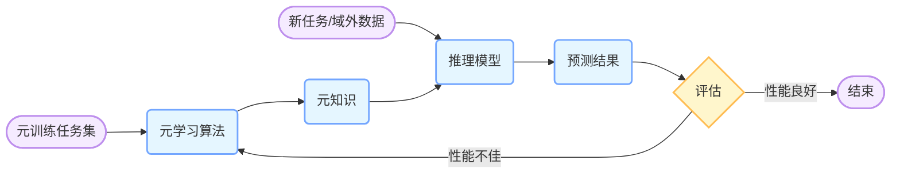

# 元学习优化推理模型的域外泛化与迁移能力

> 关键词：元学习、推理模型、域外泛化、迁移能力、优化策略

> 摘要：本文聚焦于元学习在优化推理模型的域外泛化与迁移能力方面的应用。首先介绍了相关的背景知识，包括目的、预期读者等内容。接着深入探讨了元学习、域外泛化、迁移能力等核心概念及其联系，并给出了相应的原理和架构示意图与流程图。详细阐述了核心算法原理，结合 Python 源代码进行说明，同时介绍了相关的数学模型和公式。通过项目实战，展示了如何在实际中运用元学习优化推理模型，包括开发环境搭建、源代码实现与解读。分析了实际应用场景，推荐了相关的学习资源、开发工具框架以及论文著作。最后总结了未来发展趋势与挑战，解答了常见问题，并提供了扩展阅读与参考资料，旨在为相关领域的研究者和开发者提供全面而深入的技术指导。

## 1. 背景介绍 
### 1.1 目的和范围
在当今的人工智能和机器学习领域，推理模型的性能评估和应用场景日益复杂。传统的机器学习模型往往在训练数据分布内表现良好，但当遇到来自不同分布的域外数据时，其性能会显著下降。元学习作为一种新兴的机器学习范式，旨在通过学习如何学习，使得模型能够快速适应新的任务和数据分布，从而提高推理模型的域外泛化能力和迁移能力。

本文的范围涵盖了元学习的基本概念、核心算法、数学模型，以及如何将其应用于优化推理模型的域外泛化与迁移能力。通过理论分析和实际案例相结合的方式，深入探讨元学习在这一领域的应用原理和实践方法。

### 1.2 预期读者
本文预期读者包括人工智能、机器学习领域的研究人员、开发者，以及对元学习和推理模型优化感兴趣的学生和专业人士。对于有一定机器学习基础的读者，本文将提供深入的技术细节和实践经验；对于初学者，本文也会从基本概念入手，逐步引导读者理解元学习优化推理模型的相关知识。

### 1.3 文档结构概述
本文将按照以下结构进行组织：
1. **背景介绍**：阐述本文的目的、预期读者和文档结构概述，以及相关术语的定义和解释。
2. **核心概念与联系**：介绍元学习、域外泛化、迁移能力等核心概念的原理和架构，并给出相应的示意图和流程图。
3. **核心算法原理 & 具体操作步骤**：详细讲解元学习的核心算法原理，结合 Python 源代码进行说明。
4. **数学模型和公式 & 详细讲解 & 举例说明**：介绍元学习相关的数学模型和公式，并通过具体例子进行详细讲解。
5. **项目实战：代码实际案例和详细解释说明**：通过实际项目案例，展示如何在开发环境中搭建和实现元学习优化推理模型的代码，并进行详细的解读和分析。
6. **实际应用场景**：分析元学习优化推理模型在不同领域的实际应用场景。
7. **工具和资源推荐**：推荐相关的学习资源、开发工具框架和论文著作。
8. **总结：未来发展趋势与挑战**：总结元学习优化推理模型的未来发展趋势和面临的挑战。
9. **附录：常见问题与解答**：解答读者在学习和实践过程中常见的问题。
10. **扩展阅读 & 参考资料**：提供相关的扩展阅读材料和参考资料。

### 1.4 术语表
#### 1.4.1 核心术语定义
- **元学习（Meta - Learning）**：也称为“学习如何学习”，是一种机器学习范式，旨在通过在多个任务上进行学习，获取通用的学习策略和知识，以便快速适应新的任务。
- **推理模型（Inference Model）**：用于根据输入数据进行预测或决策的模型，例如分类模型、回归模型等。
- **域外泛化（Out - of - Domain Generalization）**：指模型在训练数据分布之外的数据上仍然能够保持良好的性能。
- **迁移能力（Transfer Ability）**：指模型能够将在一个任务或领域中学到的知识和技能应用到其他相关任务或领域中的能力。

#### 1.4.2 相关概念解释
- **元知识（Meta - Knowledge）**：元学习中所学习到的关于学习过程的知识，例如学习率、优化器参数等。
- **元训练（Meta - Training）**：在元学习中，使用多个任务进行训练，以学习元知识的过程。
- **元测试（Meta - Testing）**：在元学习中，使用新的任务对学习到的元知识进行测试和评估的过程。

#### 1.4.3 缩略词列表
- **MAML（Model - Agnostic Meta - Learning）**：模型无关元学习，一种经典的元学习算法。
- **FOMAML（First - Order Model - Agnostic Meta - Learning）**：一阶模型无关元学习，MAML 的一阶近似算法。

## 2. 核心概念与联系 

### 元学习原理
元学习的核心思想是通过在多个任务上进行学习，找到一种通用的学习策略，使得模型能够快速适应新的任务。元学习通常分为两个阶段：元训练阶段和元测试阶段。

在元训练阶段，模型会在多个不同的任务上进行训练，学习到如何快速调整模型参数以适应新的任务。在元测试阶段，模型会遇到新的任务，利用在元训练阶段学习到的元知识，快速调整模型参数，以在新任务上取得较好的性能。

### 域外泛化与迁移能力
域外泛化强调模型在训练数据分布之外的数据上的性能，而迁移能力则侧重于模型将在一个任务或领域中学到的知识应用到其他相关任务或领域中的能力。两者都与模型的通用性和适应性密切相关。

元学习可以通过学习不同任务之间的共性，提高模型的域外泛化和迁移能力。例如，通过元学习，模型可以学习到如何在不同的数据分布下进行有效的特征提取和模型调整，从而更好地适应域外数据和新的任务。

### 核心概念架构的文本示意图
元学习、域外泛化和迁移能力之间的关系可以用以下示意图表示：

元学习作为一种学习范式，处于核心位置。它通过学习多个任务的共性，生成元知识。这些元知识可以帮助推理模型提高域外泛化能力，使其在不同的数据分布下都能保持较好的性能。同时，元知识也可以增强推理模型的迁移能力，使其能够将在一个任务中学到的知识应用到其他相关任务中。

### Mermaid 流程图


## 3. 核心算法原理 & 具体操作步骤 

### 模型无关元学习（MAML）算法原理
MAML 是一种经典的元学习算法，其核心思想是找到一组初始参数，使得模型在经过少量的梯度更新后，能够在新的任务上取得较好的性能。

假设我们有一个任务分布 $\mathcal{T}$，其中每个任务 $T_i \in \mathcal{T}$ 都有自己的训练集 $D_{train}^i$ 和测试集 $D_{test}^i$。MAML 的目标是学习一组初始参数 $\theta$，使得对于任意的任务 $T_i$，在使用 $D_{train}^i$ 进行少量梯度更新后，模型在 $D_{test}^i$ 上的损失最小。

### MAML 算法的具体操作步骤
1. **初始化参数**：随机初始化模型的参数 $\theta$。
2. **元训练循环**：
    - 从任务分布 $\mathcal{T}$ 中采样一批任务 $\{T_1, T_2, \cdots, T_n\}$。
    - 对于每个任务 $T_i$：
        - 使用 $D_{train}^i$ 对模型进行一次或多次梯度更新，得到临时参数 $\theta_i'$。
        - 计算模型在 $D_{test}^i$ 上的损失 $L_{test}^i(\theta_i')$。
    - 计算所有任务的测试损失的平均值 $\bar{L}_{test}(\theta) = \frac{1}{n} \sum_{i = 1}^{n} L_{test}^i(\theta_i')$。
    - 使用梯度下降法更新初始参数 $\theta$：$\theta \leftarrow \theta - \alpha \nabla_{\theta} \bar{L}_{test}(\theta)$，其中 $\alpha$ 是学习率。
3. **元测试**：在新的任务上，使用学习到的初始参数 $\theta$，并进行少量的梯度更新，以适应新的任务。

### Python 源代码实现
```python
import torch
import torch.nn as nn
import torch.optim as optim

# 定义一个简单的神经网络模型
class SimpleModel(nn.Module):
    def __init__(self, input_size, hidden_size, output_size):
        super(SimpleModel, self).__init__()
        self.fc1 = nn.Linear(input_size, hidden_size)
        self.relu = nn.ReLU()
        self.fc2 = nn.Linear(hidden_size, output_size)

    def forward(self, x):
        out = self.fc1(x)
        out = self.relu(out)
        out = self.fc2(out)
        return out

# MAML 算法实现
def maml(model, task_distribution, num_tasks, num_inner_steps, inner_lr, meta_lr, num_epochs):
    meta_optimizer = optim.Adam(model.parameters(), lr=meta_lr)

    for epoch in range(num_epochs):
        meta_loss = 0

        # 采样一批任务
        tasks = [task_distribution.sample_task() for _ in range(num_tasks)]

        for task in tasks:
            # 复制模型参数
            fast_weights = list(model.parameters())

            # 内循环更新
            for _ in range(num_inner_steps):
                train_inputs, train_labels = task.get_train_data()
                train_outputs = model.forward(train_inputs)
                train_loss = nn.CrossEntropyLoss()(train_outputs, train_labels)

                gradients = torch.autograd.grad(train_loss, fast_weights)
                fast_weights = [w - inner_lr * g for w, g in zip(fast_weights, gradients)]

            # 计算测试损失
            test_inputs, test_labels = task.get_test_data()
            test_outputs = model.forward_with_weights(test_inputs, fast_weights)
            test_loss = nn.CrossEntropyLoss()(test_outputs, test_labels)

            meta_loss += test_loss

        meta_loss /= num_tasks

        # 元更新
        meta_optimizer.zero_grad()
        meta_loss.backward()
        meta_optimizer.step()

        if (epoch + 1) % 100 == 0:
            print(f'Epoch {epoch + 1}, Meta Loss: {meta_loss.item()}')

    return model
```

## 4. 数学模型和公式 & 详细讲解 & 举例说明 

### MAML 数学模型和公式
MAML 的目标是最小化以下元损失函数：

$$\min_{\theta} \sum_{T_i \in \mathcal{T}} \mathcal{L}_{test}^i(\theta'_i)$$

其中 $\theta$ 是模型的初始参数，$\theta'_i$ 是在任务 $T_i$ 上经过少量梯度更新后的参数。梯度更新的公式为：

$$\theta'_i = \theta - \alpha \nabla_{\theta} \mathcal{L}_{train}^i(\theta)$$

其中 $\alpha$ 是内循环的学习率，$\mathcal{L}_{train}^i(\theta)$ 是任务 $T_i$ 的训练损失。

### 详细讲解
MAML 的核心思想是通过元训练找到一组初始参数 $\theta$，使得模型在经过少量的梯度更新后，能够在不同的任务上取得较好的性能。在元训练过程中，模型会在多个任务上进行训练，每次训练都会先在训练集上进行梯度更新，得到临时参数 $\theta'_i$，然后计算在测试集上的损失。最后，将所有任务的测试损失的平均值作为元损失，使用梯度下降法更新初始参数 $\theta$。

### 举例说明
假设我们有一个简单的分类任务，输入是二维向量，输出是两个类别。我们有多个这样的任务，每个任务的训练集和测试集都不同。

初始时，模型的参数 $\theta$ 是随机初始化的。在元训练过程中，我们从任务分布中采样一批任务，对于每个任务，先在训练集上进行一次梯度更新，得到临时参数 $\theta'_i$，然后计算在测试集上的损失。例如，对于某个任务 $T_i$，训练损失 $\mathcal{L}_{train}^i(\theta)$ 可以通过交叉熵损失函数计算得到。根据梯度更新公式，得到临时参数 $\theta'_i$。最后，计算所有任务的测试损失的平均值，使用梯度下降法更新初始参数 $\theta$。经过多次元训练，模型的初始参数 $\theta$ 会逐渐优化，使得模型在新的任务上能够快速适应。

## 5. 项目实战：代码实际案例和详细解释说明 

### 5.1  开发环境搭建
- **操作系统**：推荐使用 Linux 或 macOS，也可以使用 Windows。
- **Python 版本**：建议使用 Python 3.7 及以上版本。
- **深度学习框架**：使用 PyTorch 作为深度学习框架，可以通过以下命令安装：
```sh
pip install torch torchvision
```
- **其他依赖库**：安装 numpy、matplotlib 等常用库：
```sh
pip install numpy matplotlib
```

### 5.2  源代码详细实现和代码解读
```python
import torch
import torch.nn as nn
import torch.optim as optim
import numpy as np
import matplotlib.pyplot as plt

# 定义一个简单的任务类
class SimpleTask:
    def __init__(self, input_size, output_size):
        self.input_size = input_size
        self.output_size = output_size
        self.train_data = self.generate_data(100)
        self.test_data = self.generate_data(20)

    def generate_data(self, num_samples):
        inputs = torch.randn(num_samples, self.input_size)
        labels = torch.randint(0, self.output_size, (num_samples,))
        return inputs, labels

    def get_train_data(self):
        return self.train_data

    def get_test_data(self):
        return self.test_data

# 定义一个简单的神经网络模型
class SimpleModel(nn.Module):
    def __init__(self, input_size, hidden_size, output_size):
        super(SimpleModel, self).__init__()
        self.fc1 = nn.Linear(input_size, hidden_size)
        self.relu = nn.ReLU()
        self.fc2 = nn.Linear(hidden_size, output_size)

    def forward(self, x):
        out = self.fc1(x)
        out = self.relu(out)
        out = self.fc2(out)
        return out

    def forward_with_weights(self, x, weights):
        fc1_weight, fc1_bias = weights[0], weights[1]
        fc2_weight, fc2_bias = weights[2], weights[3]

        out = nn.functional.linear(x, fc1_weight, fc1_bias)
        out = self.relu(out)
        out = nn.functional.linear(out, fc2_weight, fc2_bias)
        return out

# MAML 算法实现
def maml(model, task_distribution, num_tasks, num_inner_steps, inner_lr, meta_lr, num_epochs):
    meta_optimizer = optim.Adam(model.parameters(), lr=meta_lr)

    meta_losses = []

    for epoch in range(num_epochs):
        meta_loss = 0

        # 采样一批任务
        tasks = [task_distribution() for _ in range(num_tasks)]

        for task in tasks:
            # 复制模型参数
            fast_weights = list(model.parameters())

            # 内循环更新
            for _ in range(num_inner_steps):
                train_inputs, train_labels = task.get_train_data()
                train_outputs = model.forward_with_weights(train_inputs, fast_weights)
                train_loss = nn.CrossEntropyLoss()(train_outputs, train_labels)

                gradients = torch.autograd.grad(train_loss, fast_weights)
                fast_weights = [w - inner_lr * g for w, g in zip(fast_weights, gradients)]

            # 计算测试损失
            test_inputs, test_labels = task.get_test_data()
            test_outputs = model.forward_with_weights(test_inputs, fast_weights)
            test_loss = nn.CrossEntropyLoss()(test_outputs, test_labels)

            meta_loss += test_loss

        meta_loss /= num_tasks

        # 元更新
        meta_optimizer.zero_grad()
        meta_loss.backward()
        meta_optimizer.step()

        meta_losses.append(meta_loss.item())

        if (epoch + 1) % 100 == 0:
            print(f'Epoch {epoch + 1}, Meta Loss: {meta_loss.item()}')

   