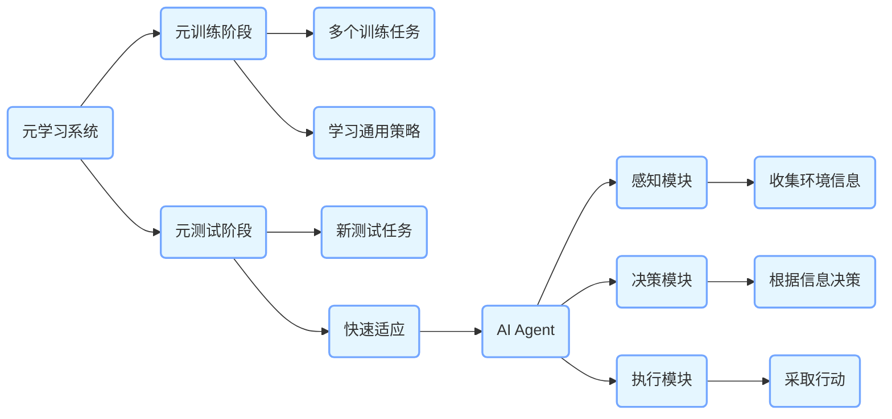

# 元学习在AI Agent快速任务适应中的实践探索

> 关键词：元学习、AI Agent、快速任务适应、模型训练、强化学习

> 摘要：本文聚焦于元学习在AI Agent快速任务适应中的实践应用。首先介绍了元学习和AI Agent的背景知识，明确了文章的目的、范围和预期读者。接着阐述了元学习和AI Agent的核心概念及它们之间的联系，给出了相应的原理和架构示意图以及Mermaid流程图。详细讲解了元学习的核心算法原理，并使用Python源代码进行说明。同时给出了相关的数学模型和公式，并举例说明。通过项目实战，展示了在实际场景中如何实现元学习以帮助AI Agent快速适应任务，包括开发环境搭建、源代码实现和解读。分析了元学习在不同领域的实际应用场景，推荐了学习资源、开发工具框架和相关论文著作。最后总结了元学习在AI Agent快速任务适应中的未来发展趋势与挑战，并解答了常见问题，提供了扩展阅读和参考资料。

## 1. 背景介绍 
### 1.1 目的和范围
在人工智能领域，传统的机器学习模型往往需要大量的数据和长时间的训练才能在特定任务上达到较好的性能。然而，在实际应用中，任务环境可能会快速变化，这就要求AI Agent能够快速适应新的任务。元学习作为一种新兴的学习范式，旨在让模型学会如何学习，从而能够在面对新任务时迅速调整并取得良好的表现。本文的目的是探索元学习在AI Agent快速任务适应中的实践应用，详细介绍元学习的原理、算法和实现步骤，并通过实际案例展示其效果。范围涵盖了元学习的基本概念、核心算法、数学模型、项目实战以及实际应用场景等方面。

### 1.2 预期读者
本文预期读者包括对人工智能、机器学习和元学习感兴趣的研究人员、工程师和学生。对于有一定机器学习基础，想要深入了解元学习在AI Agent快速任务适应中应用的读者，本文将提供全面而深入的技术指导和实践经验。

### 1.3 文档结构概述
本文将按照以下结构展开：首先介绍元学习和AI Agent的核心概念以及它们之间的联系；接着详细讲解元学习的核心算法原理，并给出具体的操作步骤和Python源代码；然后介绍相关的数学模型和公式，并通过举例进行说明；之后通过项目实战展示元学习在AI Agent快速任务适应中的具体实现，包括开发环境搭建、源代码详细实现和代码解读；分析元学习在不同领域的实际应用场景；推荐学习资源、开发工具框架和相关论文著作；最后总结元学习在AI Agent快速任务适应中的未来发展趋势与挑战，解答常见问题，并提供扩展阅读和参考资料。

### 1.4 术语表
#### 1.4.1 核心术语定义
- **元学习（Meta-learning）**：也称为“学习如何学习”，是一种让模型从多个学习任务中学习通用的学习策略和知识，以便能够快速适应新任务的学习范式。
- **AI Agent（人工智能智能体）**：是一种能够感知环境、做出决策并采取行动以实现特定目标的人工智能实体。
- **快速任务适应（Fast task adaptation）**：指AI Agent在面对新任务时，能够在短时间内调整自身的策略和参数，以达到较好的任务执行效果。

#### 1.4.2 相关概念解释
- **元训练（Meta-training）**：在元学习中，元训练阶段是指模型从多个训练任务中学习通用的学习策略和知识的过程。
- **元测试（Meta-testing）**：元测试阶段是指在元训练完成后，模型在新的测试任务上进行测试，以评估其快速任务适应能力的过程。
- **支持集（Support set）**：在元学习中，支持集是指用于在新任务上进行快速调整模型参数的少量数据。
- **查询集（Query set）**：查询集是指用于评估模型在新任务上性能的数据集。

#### 1.4.3 缩略词列表
- **MAML（Model-Agnostic Meta-Learning）**：模型无关元学习，是一种经典的元学习算法。
- **RL（Reinforcement Learning）**：强化学习，是一种通过智能体与环境进行交互并根据奖励信号来学习最优策略的机器学习方法。

## 2. 核心概念与联系 
### 核心概念原理
#### 元学习原理
元学习的核心思想是让模型学习如何学习，即从多个学习任务中提取通用的学习策略和知识。传统的机器学习方法通常是针对单个任务进行训练，而元学习则是在多个任务上进行训练，使得模型能够在面对新任务时快速调整。元学习的训练过程可以分为两个阶段：元训练和元测试。在元训练阶段，模型从多个训练任务中学习通用的学习策略；在元测试阶段，模型使用在元训练阶段学到的知识，在新的测试任务上进行快速适应。

#### AI Agent原理
AI Agent是一种能够感知环境、做出决策并采取行动以实现特定目标的人工智能实体。AI Agent通常由感知模块、决策模块和执行模块组成。感知模块负责收集环境信息，决策模块根据感知到的信息和自身的目标做出决策，执行模块则根据决策采取相应的行动。AI Agent的学习过程可以通过强化学习、监督学习等方法来实现。

### 架构的文本示意图
```plaintext
               +---------------------+
               |     元学习系统      |
               +---------------------+
               | 元训练阶段          |
               | - 多个训练任务      |
               | - 学习通用策略      |
               | 元测试阶段          |
               | - 新测试任务        |
               | - 快速适应          |
               +---------------------+
                          |
                          v
               +---------------------+
               |      AI Agent       |
               +---------------------+
               | 感知模块            |
               | - 收集环境信息      |
               | 决策模块            |
               | - 根据信息决策      |
               | 执行模块            |
               | - 采取行动          |
               +---------------------+
```

### Mermaid流程图


## 3. 核心算法原理 & 具体操作步骤 
### 核心算法原理：MAML（Model-Agnostic Meta-Learning）
MAML是一种经典的元学习算法，其核心思想是找到一组初始参数，使得模型在经过少量的梯度更新后，能够在新任务上取得较好的性能。具体来说，MAML的目标是最小化模型在新任务上经过一次或多次梯度更新后的损失。

### 具体操作步骤
1. **初始化模型参数**：随机初始化模型的参数 $\theta$。
2. **采样任务**：从任务分布 $p(\mathcal{T})$ 中采样一批任务 $\{\mathcal{T}_1, \mathcal{T}_2, \cdots, \mathcal{T}_n\}$。
3. **内循环更新**：对于每个任务 $\mathcal{T}_i$，使用支持集 $S_i$ 进行一次或多次梯度更新，得到临时参数 $\theta_i'$。具体来说，对于第 $k$ 次内循环更新，有：
   $$\theta_i^{'(k)} = \theta^{'(k - 1)} - \alpha \nabla_{\theta^{'(k - 1)}} \mathcal{L}_{S_i}(f_{\theta^{'(k - 1)}})$$
   其中，$\alpha$ 是内循环的学习率，$\mathcal{L}_{S_i}$ 是任务 $\mathcal{T}_i$ 在支持集 $S_i$ 上的损失函数，$f_{\theta}$ 是参数为 $\theta$ 的模型。
4. **外循环更新**：使用所有任务的查询集 $Q_i$ 计算元损失 $\mathcal{L}_{meta}$，并更新模型的参数 $\theta$。具体来说，有：
   $$\theta = \theta - \beta \nabla_{\theta} \sum_{i = 1}^{n} \mathcal{L}_{Q_i}(f_{\theta_i'})$$
   其中，$\beta$ 是外循环的学习率。
5. **重复步骤2 - 4**：直到模型收敛。

### Python源代码实现
```python
import torch
import torch.nn as nn
import torch.optim as optim

# 定义一个简单的神经网络模型
class SimpleModel(nn.Module):
    def __init__(self, input_size, hidden_size, output_size):
        super(SimpleModel, self).__init__()
        self.fc1 = nn.Linear(input_size, hidden_size)
        self.relu = nn.ReLU()
        self.fc2 = nn.Linear(hidden_size, output_size)

    def forward(self, x):
        out = self.fc1(x)
        out = self.relu(out)
        out = self.fc2(out)
        return out

# 内循环更新
def inner_loop(model, support_x, support_y, alpha, num_inner_steps):
    temp_model = SimpleModel(*list(model.parameters())[0].shape[:1] + [model.fc1.out_features, model.fc2.out_features])
    temp_model.load_state_dict(model.state_dict())
    optimizer = optim.SGD(temp_model.parameters(), lr=alpha)
    for _ in range(num_inner_steps):
        output = temp_model(support_x)
        loss = nn.CrossEntropyLoss()(output, support_y)
        optimizer.zero_grad()
        loss.backward()
        optimizer.step()
    return temp_model

# 外循环更新
def outer_loop(model, tasks, beta, alpha, num_inner_steps):
    meta_loss = 0
    for task in tasks:
        support_x, support_y, query_x, query_y = task
        temp_model = inner_loop(model, support_x, support_y, alpha, num_inner_steps)
        output = temp_model(query_x)
        loss = nn.CrossEntropyLoss()(output, query_y)
        meta_loss += loss
    optimizer = optim.Adam(model.parameters(), lr=beta)
    optimizer.zero_grad()
    meta_loss.backward()
    optimizer.step()
    return model

# 训练过程
input_size = 10
hidden_size = 20
output_size = 5
model = SimpleModel(input_size, hidden_size, output_size)
beta = 0.001
alpha = 0.01
num_inner_steps = 5
num_epochs = 100
tasks = []  # 假设已经有了任务数据
for epoch in range(num_epochs):
    model = outer_loop(model, tasks, beta, alpha, num_inner_steps)
    print(f'Epoch {epoch + 1}/{num_epochs} completed')
```

## 4. 数学模型和公式 & 详细讲解 & 举例说明 
### 数学模型和公式
#### 内循环更新公式
内循环更新的目标是在每个任务的支持集上快速调整模型的参数。对于第 $k$ 次内循环更新，参数更新公式为：
$$\theta_i^{'(k)} = \theta^{'(k - 1)} - \alpha \nabla_{\theta^{'(k - 1)}} \mathcal{L}_{S_i}(f_{\theta^{'(k - 1)}})$$
其中，$\theta_i^{'(k)}$ 是任务 $\mathcal{T}_i$ 在第 $k$ 次内循环更新后的临时参数，$\theta^{'(k - 1)}$ 是上一次内循环更新后的参数，$\alpha$ 是内循环的学习率，$\mathcal{L}_{S_i}$ 是任务 $\mathcal{T}_i$ 在支持集 $S_i$ 上的损失函数，$f_{\theta}$ 是参数为 $\theta$ 的模型。

#### 外循环更新公式
外循环更新的目标是最小化模型在所有任务的查询集上的元损失。元损失定义为：
$$\mathcal{L}_{meta} = \sum_{i = 1}^{n} \mathcal{L}_{Q_i}(f_{\theta_i'})$$
其中，$\mathcal{L}_{Q_i}$ 是任务 $\mathcal{T}_i$ 在查询集 $Q_i$ 上的损失函数，$\theta_i'$ 是任务 $\mathcal{T}_i$ 经过内循环更新后的临时参数。参数更新公式为：
$$\theta = \theta - \beta \nabla_{\theta} \mathcal{L}_{meta}$$
其中，$\beta$ 是外循环的学习率。

### 详细讲解
内循环更新的目的是让模型在每个任务的支持集上快速适应，通过多次梯度更新调整参数。外循环更新则是根据所有任务的查询集上的损失来更新模型的初始参数，使得模型能够在新任务上具有更好的泛化能力。

### 举例说明
假设我们有一个分类任务，模型的输入是一个10维的向量，输出是一个5维的向量，表示5个类别。支持集有10个样本，查询集有20个样本。内循环学习率 $\alpha = 0.01$，外循环学习率 $\beta = 0.001$，内循环更新次数为5次。

在每个训练周期中，我们从任务分布中采样一批任务。对于每个任务，先进行内循环更新，使用支持集调整模型的参数。然后，使用查询集计算元损失，并进行外循环更新。经过多次训练，模型的初始参数会逐渐调整，使得模型在新任务上能够快速适应。

## 5. 项目实战：代码实际案例和详细解释说明 
### 5.1  开发环境搭建
#### 安装Python
首先，确保你已经安装了Python 3.6或更高版本。你可以从Python官方网站（https://www.python.org/downloads/）下载并安装Python。

#### 安装依赖库
使用以下命令安装所需的依赖库：
```bash
pip install torch torchvision numpy matplotlib
```
其中，`torch` 和 `torchvision` 是PyTorch深度学习框架，`numpy` 用于数值计算，`matplotlib` 用于可视化。

### 5.2  源代码详细实现和代码解读
```python
import torch
import torch.nn as nn
import torch.optim as optim
import numpy as np
import matplotlib.pyplot as plt

# 定义一个简单的神经网络模型
class SimpleModel(nn.Module):
    def __init__(self, input_size, hidden_size, output_size):
        super(SimpleModel, self).__init__()
        self.fc1 = nn.Linear(input_size, hidden_size)
        self.relu = nn.ReLU()
        self.fc2 = nn.Linear(hidden_size, output_size)

    def forward(self, x):
        out = self.fc1(x)
        out = self.relu(out)
        out = self.fc2(out)
        return out

# 内循环更新
def inner_loop(model, support_x, support_y, alpha, num_inner_steps):
    temp_model = SimpleModel(*list(model.parameters())[0].shape[:1] + [model.fc1.out_features, model.fc2.out_features])
    temp_model.load_state_dict(model.state_dict())
    optimizer = optim.SGD(temp_model.parameters(), lr=alpha)
    for _ in range(num_inner_steps):
        output = temp_model(support_x)
        loss = nn.CrossEntropyLoss()(output, support_y)
        optimizer.zero_grad()
        loss.backward()
        optimizer.step()
    return temp_model

# 外循环更新
def outer_loop(model, tasks, beta, alpha, num_inner_steps):
    meta_loss = 0
    for task in tasks:
        support_x, support_y, query_x, query_y = task
        temp_model = inner_loop(model, support_x, support_y, alpha, num_inner_steps)
        output = temp_model(query_x)
        loss = nn.CrossEntropyLoss()(output, query_y)
        meta_loss += loss
    optimizer = optim.Adam(model.parameters(), lr=beta)
    optimizer.zero_grad()
    meta_loss.backward()
    optimizer.step()
    return model

# 生成任务数据
def generate_tasks(num_tasks, input_size, output_size, support_size, query_size):
    tasks = []
    for _ in range(num_tasks):
        support_x = torch.randn(support_size, input_size)
        support_y = torch.randint(0, output_size, (support_size,))
        query_x = torch.randn(query_size, input_size)
        query_y = torch.randint(0, output_size, (query_size,))
        tasks.append((support_x, support_y, query_x, query_y))
    return tasks

# 训练过程
input_size = 10
hidden_size = 20
output_size = 5
model = SimpleModel(input_size, hidden_size, output_size)
beta = 0.001
alpha = 0.01
num_inner_steps = 5
num_epochs = 100
num_tasks = 10
support_size = 10
query_size = 20

losses = []
for epoch in range(num_epochs):
    tasks = generate_tasks(num_tasks, input_size, output_size, support_size, query_size)
    model = outer_loop(model, tasks, beta, alpha, num_inner_steps)
    total_loss = 0
    for task in tasks:
        support_x, support_y, query_x, query_y = task
        temp_model = inner_loop(model, support_x, support_y, alpha, num_inner_steps)
        output = temp_model(query_x)
        loss = nn.CrossEntropyLoss()(output, query_y)
        total_loss += loss.item()
    avg_loss = total_loss / num_tasks
    losses.append(avg_loss)
    print(f'Epoch {epoch + 1}/{num_epochs}, Average Loss: {avg_loss:.4f}')

# 可视化损失曲线
plt.plot(losses)
plt.xlabel('Epoch')
plt.ylabel('Average Loss')
plt.title('Meta-training Loss Curve')
plt.show()
```

### 代码解读与分析
#### 模型定义
`SimpleModel` 是一个简单的两层神经网络，包含一个输入层、一个隐藏层和一个输出层。

#### 内循环更新
`inner_loop` 函数实现了内循环更新，使用支持集对模型进行多次梯度更新，得到临时参数。

#### 外循环更新
`outer_loop` 函数实现了外循环更新，使用所有任务的查询集计算元损失，并更新模型的参数。

#### 任务数据生成
`generate_tasks` 函数用于生成任务数据，每个任务包含支持集和查询集。

#### 训练过程
在训练过程中，我们不断生成新的任务数据，进行内循环和外循环更新，并记录平均损失。最后，使用 `matplotlib` 可视化损失曲线。

## 6. 实际应用场景 
### 机器人领域
在机器人领域，任务环境可能会快速变化，例如机器人需要在不同的地形上行走、完成不同的操作任务等。元学习可以帮助机器人快速适应新的任务环境，提高机器人的灵活性和智能性。例如，通过元学习，机器人可以在短时间内学会在不同类型的地面上行走，而不需要重新进行长时间的训练。

### 自动驾驶领域
在自动驾驶领域，路况和交通规则可能会因地区和时间的不同而有所变化。元学习可以让自动驾驶车辆快速适应新的路况和交通规则，提高自动驾驶的安全性和可靠性。例如，当车辆进入一个新的城市时，元学习可以帮助车辆快速学习该城市的交通规则和路况特点。

### 医疗领域
在医疗领域，不同的患者可能有不同的病情和治疗需求。元学习可以帮助医疗AI Agent快速适应不同患者的情况，提供个性化的医疗建议和治疗方案。例如，在诊断疾病时，元学习可以让AI Agent根据患者的症状和病史，快速做出准确的诊断。

### 游戏领域
在游戏领域，游戏的规则和场景可能会不断变化。元学习可以让游戏AI Agent快速适应新的游戏规则和场景，提高游戏的趣味性和挑战性。例如，在一款策略游戏中，元学习可以让AI Agent根据对手的策略和游戏的局势，快速调整自己的策略。

## 7. 工具和资源推荐
### 7.1 学习资源推荐
#### 7.1.1 书籍推荐
- 《Deep Learning》（Ian Goodfellow、Yoshua Bengio和Aaron Courville著）：这是一本深度学习领域的经典教材，涵盖了深度学习的基本概念、算法和应用。
- 《Reinforcement Learning: An Introduction》（Richard S. Sutton和Andrew G. Barto著）：这本书是强化学习领域的权威教材，详细介绍了强化学习的理论和算法。
- 《Meta-Learning: A Survey》：这本书对元学习进行了全面的综述，介绍了元学习的各种算法和应用。

#### 7.1.2 在线课程
- Coursera上的“Deep Learning Specialization”：由Andrew Ng教授授课，涵盖了深度学习的各个方面，包括神经网络、卷积神经网络、循环神经网络等。
- edX上的“Reinforcement Learning”：由UC Berkeley的Pieter Abbeel教授授课，深入介绍了强化学习的理论和实践。
- OpenAI的“Spinning Up in Deep Reinforcement Learning”：这是一个开源的强化学习教程，提供了丰富的代码示例和文档。

#### 7.1.3 技术博客和网站
- Towards Data Science：这是一个数据科学和机器学习领域的知名博客，提供了大量的技术文章和教程。
- arXiv：这是一个预印本数据库，包含了计算机科学、物理学等领域的最新研究成果。
- OpenAI Blog：OpenAI的官方博客，发布了许多关于人工智能和机器学习的最新研究和应用。

### 7.2 开发工具框架推荐
#### 7.2.1 IDE和编辑器
- PyCharm：这是一个专业的Python集成开发环境，提供了丰富的代码编辑、调试和项目管理功能。
- Jupyter Notebook：这是一个交互式的开发环境，适合进行数据分析、模型训练和可视化。
- Visual Studio Code：这是一个轻量级的代码编辑器，支持多种编程语言，并且有丰富的插件扩展。

#### 7.2.2 调试和性能分析工具
- PyTorch Profiler：这是PyTorch提供的性能分析工具，可以帮助用户分析模型的训练和推理性能。
- TensorBoard：这是TensorFlow提供的可视化工具，也可以用于PyTorch模型的可视化和调试。
- cProfile：这是Python标准库中的性能分析工具，可以帮助用户分析Python代码的性能瓶颈。

#### 7.2.3 相关框架和库
- PyTorch：这是一个开源的深度学习框架，提供了丰富的神经网络模块和优化算法，易于使用和扩展。
- TensorFlow：这是另一个流行的深度学习框架，具有强大的分布式训练和部署能力。
- OpenAI Gym：这是一个开源的强化学习环境库，提供了多种经典的强化学习任务和环境。

### 7.3 相关论文著作推荐
#### 7.3.1 经典论文
- "Model-Agnostic Meta-Learning for Fast Adaptation of Deep Networks"（Chelsea Finn、Pieter Abbeel和Sergey Levine著）：这篇论文提出了MAML算法，是元学习领域的经典之作。
- "Learning to Learn by Gradient Descent by Gradient Descent"（Marcin Andrychowicz、Misha Denil、Sepp Hochreiter等著）：这篇论文提出了一种基于梯度下降的元学习方法。
- "Matching Networks for One Shot Learning"（Oriol Vinyals、Charles Blundell、Tim Lillicrap等著）：这篇论文提出了匹配网络，用于解决少样本学习问题。

#### 7.3.2 最新研究成果
- 关注arXiv上关于元学习和AI Agent的最新论文，了解该领域的最新研究动态。
- 参加国际机器学习会议（ICML）、神经信息处理系统大会（NeurIPS）等顶级学术会议，获取最新的研究成果。

#### 7.3.3 应用案例分析
- 阅读相关的学术论文和技术博客，了解元学习在不同领域的应用案例和实践经验。
- 参考开源项目和代码库，学习他人在实际项目中如何应用元学习和AI Agent。

## 8. 总结：未来发展趋势与挑战
### 未来发展趋势
#### 与其他技术的融合
元学习有望与强化学习、迁移学习、生成对抗网络等技术进一步融合，形成更强大的学习范式。例如，将元学习与强化学习相结合，可以让AI Agent在复杂的环境中更快地学习最优策略。

#### 应用领域的拓展
随着元学习技术的不断发展，其应用领域将不断拓展。除了机器人、自动驾驶、医疗和游戏等领域，元学习还可能在自然语言处理、计算机视觉、金融等领域得到广泛应用。

#### 理论研究的深入
未来，元学习的理论研究将不断深入，包括元学习的收敛性分析、泛化能力分析等。这些理论研究将为元学习的实际应用提供更坚实的理论基础。

### 挑战
#### 计算资源需求
元学习通常需要大量的计算资源，尤其是在处理大规模任务和复杂模型时。如何降低元学习的计算成本，提高计算效率，是一个亟待解决的问题。

#### 数据稀缺问题
在某些应用场景中，数据可能非常稀缺，这给元学习带来了挑战。如何在数据稀缺的情况下，仍然能够让AI Agent快速适应新任务，是一个需要研究的问题。

#### 模型可解释性
元学习模型通常比较复杂，其决策过程和学习机制难以解释。如何提高元学习模型的可解释性，让用户更好地理解模型的行为和决策，是一个重要的挑战。

## 9. 附录：常见问题与解答
### 问题1：元学习和传统机器学习有什么区别？
传统机器学习通常是针对单个任务进行训练，需要大量的数据和长时间的训练才能达到较好的性能。而元学习则是从多个学习任务中学习通用的学习策略和知识，能够在面对新任务时快速调整，减少对大量数据和长时间训练的依赖。

### 问题2：MAML算法的优点和缺点是什么？
优点：MAML算法具有模型无关性，可以应用于各种类型的模型；能够在少量数据上快速适应新任务。缺点：MAML算法的计算成本较高，尤其是在处理大规模任务和复杂模型时；内循环和外循环的学习率需要手动调整，调参难度较大。

### 问题3：如何选择合适的元学习算法？
选择合适的元学习算法需要考虑任务的特点、数据的规模和质量、计算资源等因素。如果任务是少样本学习问题，可以考虑使用MAML、Matching Networks等算法；如果任务是强化学习问题，可以考虑使用Meta-RL等算法。

### 问题4：元学习在实际应用中需要注意什么？
在实际应用中，需要注意以下几点：确保任务数据的多样性和代表性，以便模型能够学习到通用的学习策略；合理选择内循环和外循环的学习率，避免过拟合和欠拟合；考虑计算资源的限制，选择合适的算法和模型。

## 10. 扩展阅读 & 参考资料
### 扩展阅读
- 《Meta-Learning: Theory and Applications》：这本书对元学习的理论和应用进行了深入的探讨。
- 《Adaptive Machine Learning: A Meta-Learning Perspective》：从元学习的角度介绍了自适应机器学习的相关知识。
- 《Few-Shot Learning: A Survey》：这篇综述文章对少样本学习的各种方法进行了总结和分析。

### 参考资料
- Finn, C., Abbeel, P., & Levine, S. (2017). Model-agnostic meta-learning for fast adaptation of deep networks. In Proceedings of the 34th International Conference on Machine Learning-Volume 70 (pp. 1126-1135). JMLR. org.
- Vinyals, O., Blundell, C., Lillicrap, T., kavukcuoglu, K., & Wierstra, D. (2016). Matching networks for one shot learning. In Advances in neural information processing systems (pp. 3630-3638).
- Andrychowicz, M., Denil, M., Gomez, S., Hoffman, M. W., Pfau, D., Schaul, T.,... & de Freitas, N. (2016). Learning to learn by gradient descent by gradient descent. In Advances in neural information processing systems (pp. 3981-3989).

作者：AI天才研究院/AI Genius Institute & 禅与计算机程序设计艺术 /Zen And The Art of Computer Programming