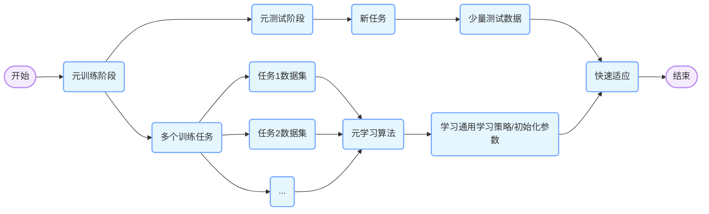

# 元学习在AI Agent快速适应中的应用

> 关键词：元学习、AI Agent、快速适应、机器学习、模型泛化

> 摘要：本文深入探讨了元学习在AI Agent快速适应中的应用。首先介绍了元学习和AI Agent的基本概念及相关背景知识，接着阐述了元学习的核心概念与架构，详细讲解了核心算法原理并给出Python代码示例，还介绍了相关的数学模型和公式。通过项目实战，展示了如何将元学习应用于AI Agent以实现快速适应，并对代码进行了详细解读。分析了元学习在AI Agent快速适应中的实际应用场景，推荐了学习资源、开发工具框架以及相关论文著作。最后总结了元学习在该领域的未来发展趋势与挑战，并对常见问题进行了解答，为读者全面了解和应用元学习提升AI Agent快速适应能力提供了深入的参考。

## 1. 背景介绍 
### 1.1 目的和范围
本文章旨在深入探讨元学习在AI Agent快速适应方面的应用。随着人工智能技术的不断发展，AI Agent需要在各种复杂多变的环境中快速做出反应和适应。传统的机器学习方法往往需要大量的数据和时间进行训练，难以满足快速适应的需求。元学习作为一种新兴的机器学习范式，能够让模型在少量数据上快速学习和适应新的任务，为解决AI Agent快速适应问题提供了有效的途径。本文将从元学习的基本概念、算法原理、数学模型等方面进行详细阐述，并通过实际案例展示其在AI Agent中的应用，同时分析其未来发展趋势和面临的挑战。

### 1.2 预期读者
本文主要面向对人工智能、机器学习领域感兴趣的专业人士，包括人工智能研究者、机器学习工程师、软件开发者等。同时，对于希望深入了解元学习技术及其在AI Agent中应用的学生和爱好者也具有一定的参考价值。

### 1.3 文档结构概述
本文共分为十个部分。第一部分为背景介绍，包括目的和范围、预期读者、文档结构概述以及术语表。第二部分介绍元学习和AI Agent的核心概念与联系，并给出相应的文本示意图和Mermaid流程图。第三部分详细讲解元学习的核心算法原理，并使用Python源代码进行具体操作步骤的阐述。第四部分介绍元学习的数学模型和公式，并进行详细讲解和举例说明。第五部分通过项目实战，展示元学习在AI Agent快速适应中的应用，包括开发环境搭建、源代码详细实现和代码解读。第六部分分析元学习在AI Agent中的实际应用场景。第七部分推荐学习资源、开发工具框架以及相关论文著作。第八部分总结元学习在该领域的未来发展趋势与挑战。第九部分为附录，解答常见问题。第十部分提供扩展阅读和参考资料。

### 1.4 术语表
#### 1.4.1 核心术语定义
- **元学习（Meta-learning）**：也称为“学习如何学习”，是一种让模型在多个任务上进行学习，从而能够快速适应新任务的机器学习范式。元学习的目标是学习到一种通用的学习策略或模型初始化参数，使得模型在面对新任务时能够利用已有的学习经验，在少量数据上快速收敛。
- **AI Agent（人工智能智能体）**：是一种能够感知环境、做出决策并采取行动以实现特定目标的人工智能实体。AI Agent可以是虚拟的软件程序，也可以是物理机器人，它通过与环境进行交互来完成各种任务。
- **快速适应（Fast adaptation）**：指AI Agent在面对新的任务或环境变化时，能够在短时间内调整自身的行为和策略，以达到较好的性能表现。

#### 1.4.2 相关概念解释
- **任务（Task）**：在机器学习中，任务是指一个具体的学习问题，例如图像分类、目标检测、自然语言处理等。每个任务都有自己的数据集和目标函数。
- **元训练（Meta-training）**：元学习中的一个阶段，在这个阶段，模型在多个不同的任务上进行训练，以学习到通用的学习策略或模型初始化参数。
- **元测试（Meta-testing）**：在元训练之后，模型在新的、未见过的任务上进行测试，以评估其快速适应新任务的能力。

#### 1.4.3 缩略词列表
- **MAML（Model-Agnostic Meta-Learning）**：模型无关元学习，是一种经典的元学习算法。
- **AI（Artificial Intelligence）**：人工智能
- **ML（Machine Learning）**：机器学习

## 2. 核心概念与联系 

### 元学习的核心概念
元学习的核心思想是“学习如何学习”。传统的机器学习方法通常是在一个固定的数据集上训练一个模型，以解决特定的任务。而元学习则是在多个不同的任务上进行学习，通过学习这些任务之间的共性和差异，得到一个通用的学习策略或模型初始化参数。当面对新的任务时，模型可以利用这个通用的学习策略或初始化参数，在少量数据上快速学习和适应新任务。

### AI Agent的核心概念
AI Agent是一种能够感知环境、做出决策并采取行动以实现特定目标的人工智能实体。它通常由感知模块、决策模块和执行模块组成。感知模块用于获取环境信息，决策模块根据感知到的信息做出决策，执行模块则根据决策采取相应的行动。AI Agent可以在各种环境中工作，如游戏、机器人控制、自动驾驶等。

### 元学习与AI Agent的联系
元学习可以为AI Agent提供快速适应新任务和环境变化的能力。通过元学习，AI Agent可以学习到通用的学习策略，当遇到新的任务时，能够在少量数据上快速调整自己的行为和策略，以达到较好的性能表现。例如，在一个机器人导航任务中，机器人可以通过元学习学习到在不同环境中导航的通用策略，当进入一个新的环境时，能够快速适应并找到目标位置。

### 文本示意图
```plaintext
元学习系统
├── 元训练阶段
│   ├── 多个训练任务
│   │   ├── 任务1数据集
│   │   ├── 任务2数据集
│   │   └──...
│   └── 元学习算法
│       └── 学习通用学习策略/初始化参数
└── 元测试阶段
    ├── 新任务
    │   └── 少量测试数据
    └── 快速适应
        └── 利用通用学习策略/初始化参数在少量数据上学习
```

### Mermaid流程图


## 3. 核心算法原理 & 具体操作步骤 

### 核心算法原理 - MAML（Model-Agnostic Meta-Learning）
MAML是一种经典的元学习算法，其核心思想是找到一个通用的模型初始化参数，使得模型在经过少量梯度更新后，能够在新的任务上取得较好的性能。具体来说，MAML的训练过程分为两个阶段：元训练和元测试。

在元训练阶段，对于每个训练任务，首先使用当前的模型参数在该任务的支持集（Support set）上进行一次或多次梯度更新，得到一个临时的模型参数。然后，使用这个临时的模型参数在该任务的查询集（Query set）上计算损失函数，并根据这个损失函数对原始的模型参数进行更新。

在元测试阶段，当遇到新的任务时，使用训练好的模型参数在新任务的支持集上进行少量的梯度更新，然后在查询集上进行测试，评估模型的性能。

### 具体操作步骤
以下是使用Python和PyTorch实现MAML算法的具体操作步骤：

```python
import torch
import torch.nn as nn
import torch.optim as optim

# 定义一个简单的神经网络模型
class SimpleNet(nn.Module):
    def __init__(self, input_size, hidden_size, output_size):
        super(SimpleNet, self).__init__()
        self.fc1 = nn.Linear(input_size, hidden_size)
        self.relu = nn.ReLU()
        self.fc2 = nn.Linear(hidden_size, output_size)

    def forward(self, x):
        out = self.fc1(x)
        out = self.relu(out)
        out = self.fc2(out)
        return out

# 元训练函数
def meta_train(model, meta_optimizer, tasks, num_inner_steps, inner_lr, meta_lr):
    meta_loss = 0
    for task in tasks:
        support_set, query_set = task
        # 复制当前模型参数
        fast_weights = dict(model.named_parameters())

        # 内循环，在支持集上进行梯度更新
        for _ in range(num_inner_steps):
            inputs, labels = support_set
            outputs = model.forward(inputs)
            loss = nn.CrossEntropyLoss()(outputs, labels)
            grads = torch.autograd.grad(loss, fast_weights.values(), create_graph=True)
            fast_weights = {name: param - inner_lr * grad for name, param, grad in zip(fast_weights.keys(), fast_weights.values(), grads)}

        # 外循环，在查询集上计算元损失
        inputs, labels = query_set
        outputs = model.forward(inputs)
        loss = nn.CrossEntropyLoss()(outputs, labels)
        meta_loss += loss

    # 元更新
    meta_optimizer.zero_grad()
    meta_loss.backward()
    meta_optimizer.step()

    return meta_loss.item()

# 元测试函数
def meta_test(model, task, num_inner_steps, inner_lr):
    support_set, query_set = task
    # 复制当前模型参数
    fast_weights = dict(model.named_parameters())

    # 内循环，在支持集上进行梯度更新
    for _ in range(num_inner_steps):
        inputs, labels = support_set
        outputs = model.forward(inputs)
        loss = nn.CrossEntropyLoss()(outputs, labels)
        grads = torch.autograd.grad(loss, fast_weights.values())
        fast_weights = {name: param - inner_lr * grad for name, param, grad in zip(fast_weights.keys(), fast_weights.values(), grads)}

    # 在查询集上进行测试
    inputs, labels = query_set
    outputs = model.forward(inputs)
    _, predicted = torch.max(outputs.data, 1)
    correct = (predicted == labels).sum().item()
    total = labels.size(0)
    accuracy = correct / total

    return accuracy

# 主函数
if __name__ == "__main__":
    # 初始化模型
    input_size = 10
    hidden_size = 20
    output_size = 5
    model = SimpleNet(input_size, hidden_size, output_size)

    # 初始化元优化器
    meta_optimizer = optim.Adam(model.parameters(), lr=meta_lr)

    # 模拟一些训练任务
    num_tasks = 10
    tasks = []
    for _ in range(num_tasks):
        support_inputs = torch.randn(20, input_size)
        support_labels = torch.randint(0, output_size, (20,))
        query_inputs = torch.randn(10, input_size)
        query_labels = torch.randint(0, output_size, (10,))
        support_set = (support_inputs, support_labels)
        query_set = (query_inputs, query_labels)
        task = (support_set, query_set)
        tasks.append(task)

    # 元训练
    num_epochs = 100
    num_inner_steps = 5
    inner_lr = 0.01
    meta_lr = 0.001
    for epoch in range(num_epochs):
        meta_loss = meta_train(model, meta_optimizer, tasks, num_inner_steps, inner_lr, meta_lr)
        print(f'Epoch {epoch+1}/{num_epochs}, Meta Loss: {meta_loss}')

    # 模拟一个新任务进行元测试
    support_inputs = torch.randn(20, input_size)
    support_labels = torch.randint(0, output_size, (20,))
    query_inputs = torch.randn(10, input_size)
    query_labels = torch.randint(0, output_size, (10,))
    support_set = (support_inputs, support_labels)
    query_set = (query_inputs, query_labels)
    new_task = (support_set, query_set)
    accuracy = meta_test(model, new_task, num_inner_steps, inner_lr)
    print(f'Meta Test Accuracy: {accuracy}')
```

### 代码解释
1. **模型定义**：定义了一个简单的两层神经网络模型 `SimpleNet`，包含一个输入层、一个隐藏层和一个输出层。
2. **元训练函数 `meta_train`**：在每个训练任务上，首先在支持集上进行少量的梯度更新，得到临时的模型参数。然后，使用临时的模型参数在查询集上计算损失函数，并根据这个损失函数对原始的模型参数进行更新。
3. **元测试函数 `meta_test`**：在新的任务上，使用训练好的模型参数在支持集上进行少量的梯度更新，然后在查询集上进行测试，计算准确率。
4. **主函数**：初始化模型和元优化器，模拟一些训练任务进行元训练，最后模拟一个新任务进行元测试。

## 4. 数学模型和公式 & 详细讲解 & 举例说明 

### 数学模型和公式
#### 元训练阶段
设 $\theta$ 为模型的参数，$T = \{T_1, T_2, \cdots, T_n\}$ 为训练任务的集合，对于每个任务 $T_i$，其支持集为 $S_i$，查询集为 $Q_i$。

在元训练阶段，对于每个任务 $T_i$，首先在支持集 $S_i$ 上进行一次梯度更新，得到临时的模型参数 $\theta_i'$：
$$
\theta_i' = \theta - \alpha \nabla_{\theta} L_{S_i}(f_{\theta})
$$
其中，$\alpha$ 为内循环学习率，$L_{S_i}(f_{\theta})$ 为在支持集 $S_i$ 上的损失函数，$f_{\theta}$ 为模型。

然后，使用临时的模型参数 $\theta_i'$ 在查询集 $Q_i$ 上计算损失函数 $L_{Q_i}(f_{\theta_i'})$，并根据这个损失函数对原始的模型参数 $\theta$ 进行更新：
$$
\theta \leftarrow \theta - \beta \nabla_{\theta} \sum_{i=1}^{n} L_{Q_i}(f_{\theta_i'})
$$
其中，$\beta$ 为外循环学习率。

#### 元测试阶段
当遇到新的任务 $T_{new}$ 时，其支持集为 $S_{new}$，查询集为 $Q_{new}$。首先使用训练好的模型参数 $\theta$ 在支持集 $S_{new}$ 上进行 $k$ 次梯度更新，得到新的模型参数 $\theta_{new}$：
$$
\theta_{new}^{(j+1)} = \theta_{new}^{(j)} - \alpha \nabla_{\theta_{new}^{(j)}} L_{S_{new}}(f_{\theta_{new}^{(j)}}), \quad j = 0, 1, \cdots, k-1
$$
其中，$\theta_{new}^{(0)} = \theta$。

然后，使用新的模型参数 $\theta_{new}$ 在查询集 $Q_{new}$ 上进行测试，计算准确率。

### 详细讲解
- **内循环（支持集上的梯度更新）**：在每个训练任务的支持集上进行梯度更新，目的是让模型快速适应这个任务。通过一次或多次的梯度更新，得到一个临时的模型参数，这个参数更适合当前任务。
- **外循环（查询集上的元更新）**：在查询集上计算损失函数，并根据这个损失函数对原始的模型参数进行更新。这样可以让模型学习到通用的学习策略，使得在面对新任务时，能够快速适应。
- **元测试阶段**：在新任务上，使用训练好的模型参数在支持集上进行少量的梯度更新，然后在查询集上进行测试。由于模型已经学习到了通用的学习策略，所以在少量数据上进行梯度更新后，能够快速适应新任务。

### 举例说明
假设我们有一个图像分类任务，训练任务集合包含多个不同类别的图像分类任务。每个任务的支持集包含少量的图像和对应的标签，查询集也包含一些图像和对应的标签。

在元训练阶段，对于每个任务，首先在支持集上进行梯度更新，得到一个临时的模型参数。例如，对于一个猫和狗的图像分类任务，通过在支持集上的梯度更新，模型可以学习到猫和狗的特征。然后，使用这个临时的模型参数在查询集上计算损失函数，并对原始的模型参数进行更新。

在元测试阶段，当遇到一个新的图像分类任务，如鸟类和鱼类的图像分类任务时，使用训练好的模型参数在支持集上进行少量的梯度更新，然后在查询集上进行测试。由于模型已经学习到了通用的图像分类策略，所以在少量数据上进行梯度更新后，能够快速适应新的鸟类和鱼类图像分类任务。

## 5. 项目实战：代码实际案例和详细解释说明 

### 5.1  开发环境搭建
#### 操作系统
本项目可以在Windows、Linux或Mac OS等主流操作系统上进行开发。建议使用Linux系统，因为它在机器学习开发中具有更好的兼容性和性能。

#### 编程语言和框架
- **Python**：Python是一种广泛使用的编程语言，具有丰富的机器学习库和工具。建议使用Python 3.7及以上版本。
- **PyTorch**：PyTorch是一个开源的深度学习框架，具有动态图机制和强大的自动求导功能。可以使用以下命令安装PyTorch：
```bash
pip install torch torchvision
```

#### 其他依赖库
- **NumPy**：用于数值计算和数组操作。可以使用以下命令安装：
```bash
pip install numpy
```
- **Matplotlib**：用于数据可视化。可以使用以下命令安装：
```bash
pip install matplotlib
```

### 5.2  源代码详细实现和代码解读
以下是一个完整的元学习在AI Agent快速适应中的项目实战代码示例：

```python
import torch
import torch.nn as nn
import torch.optim as optim
import numpy as np
import matplotlib.pyplot as plt

# 定义一个简单的神经网络模型
class SimpleNet(nn.Module):
    def __init__(self, input_size, hidden_size, output_size):
        super(SimpleNet, self).__init__()
        self.fc1 = nn.Linear(input_size, hidden_size)
        self.relu = nn.ReLU()
        self.fc2 = nn.Linear(hidden_size, output_size)

    def forward(self, x):
        out = self.fc1(x)
        out = self.relu(out)
        out = self.fc2(out)
        return out

# 生成任务数据集
def generate_task(num_samples, input_size, output_size):
    inputs = torch.randn(num_samples, input_size)
    labels = torch.randint(0, output_size, (num_samples,))
    return inputs, labels

# 元训练函数
def meta_train(model, meta_optimizer, num_tasks, num_inner_steps, inner_lr, meta_lr, input_size, output_size):
    meta_losses = []
    for epoch in range(num_tasks):
        # 生成一个新的任务
        support_inputs, support_labels = generate_task(20, input_size, output_size)
        query_inputs, query_labels = generate_task(10, input_size, output_size)
        support_set = (support_inputs, support_labels)
        query_set = (query_inputs, query_labels)
        task = (support_set, query_set)

        # 复制当前模型参数
        fast_weights = dict(model.named_parameters())

        # 内循环，在支持集上进行梯度更新
        for _ in range(num_inner_steps):
            inputs, labels = support_set
            outputs = model.forward(inputs)
            loss = nn.CrossEntropyLoss()(outputs, labels)
            grads = torch.autograd.grad(loss, fast_weights.values(), create_graph=True)
            fast_weights = {name: param - inner_lr * grad for name, param, grad in zip(fast_weights.keys(), fast_weights.values(), grads)}

        # 外循环，在查询集上计算元损失
        inputs, labels = query_set
        outputs = model.forward(inputs)
        loss = nn.CrossEntropyLoss()(outputs, labels)

        # 元更新
        meta_optimizer.zero_grad()
        loss.backward()
        meta_optimizer.step()

        meta_losses.append(loss.item())
        if (epoch + 1) % 10 == 0:
            print(f'Epoch {epoch+1}/{num_tasks}, Meta Loss: {loss.item()}')

    return meta_losses

# 元测试函数
def meta_test(model, num_tasks, num_inner_steps, inner_lr, input_size, output_size):
    accuracies = []
    for _ in range(num_tasks):
        # 生成一个新的任务
        support_inputs, support_labels = generate_task(20, input_size, output_size)
        query_inputs, query_labels = generate_task(10, input_size, output_size)
        support_set = (support_inputs, support_labels)
        query_set = (query_inputs, query_labels)
        task = (support_set, query_set)

        # 复制当前模型参数
        fast_weights = dict(model.named_parameters())

        # 内循环，在支持集上进行梯度更新
        for _ in range(num_inner_steps):
            inputs, labels = support_set
            outputs = model.forward(inputs)
            loss = nn.CrossEntropyLoss()(outputs, labels)
            grads = torch.autograd.grad(loss, fast_weights.values())
            fast_weights = {name: param - inner_lr * grad for name, param, grad in zip(fast_weights.keys(), fast_weights.values(), grads)}

        # 在查询集上进行测试
        inputs, labels = query_set
        outputs = model.forward(inputs)
        _, predicted = torch.max(outputs.data, 1)
        correct = (predicted == labels).sum().item()
        total = labels.size(0)
        accuracy = correct / total
        accuracies.append(accuracy)

    average_accuracy = np.mean(accuracies)
    return average_accuracy

# 主函数
if __name__ == "__main__":
    # 初始化模型
    input_size = 10
    hidden_size = 20
    output_size = 5
    model = SimpleNet(input_size, hidden_size, output_size)

    # 初始化元优化器
    meta_optimizer = optim.Adam(model.parameters(), lr=meta_lr)

    # 元训练
    num_tasks = 100
    num_inner_steps = 5
    inner_lr = 0.01
    meta_lr = 0.001
    meta_losses = meta_train(model, meta_optimizer, num_tasks, num_inner_steps, inner_lr, meta_lr, input_size, output_size)

    # 绘制元损失曲线
    plt.plot(meta_losses)
    plt.xlabel('Epoch')
    plt.ylabel('Meta Loss')
    plt.title('Meta Training Loss')
    plt.show()

    # 元测试
    num_test_tasks = 20
    average_accuracy = meta_test(model, num_test_tasks, num_inner_steps, inner_lr, input_size, output_size)
    print(f'Average Meta Test Accuracy: {average_accuracy}')
```

### 代码解读与分析
#### 模型定义
`SimpleNet` 类定义了一个简单的两层神经网络模型，包含一个输入层、一个隐藏层和一个输出层。输入层的大小为 `input_size`，隐藏层的大小为 `hidden_size`，输出层的大小为 `output_size`。

#### 生成任务数据集
`generate_task` 函数用于生成一个任务的数据集，包括输入数据和对应的标签。输入数据是随机生成的，标签是随机整数。

#### 元训练函数
`meta_train` 函数实现了元训练的过程。在每个训练任务中，首先生成一个新的任务数据集，然后在支持集上进行少量的梯度更新，得到临时的模型参数。接着，使用临时的模型参数在查询集上计算损失函数，并根据这个损失函数对原始的模型参数进行更新。最后，记录每个训练任务的元损失，并在每10个训练任务后打印一次元损失。

#### 元测试函数
`meta_test` 函数实现了元测试的过程。在每个测试任务中，首先生成一个新的任务数据集，然后使用训练好的模型参数在支持集上进行少量的梯度更新，得到新的模型参数。接着，使用新的模型参数在查询集上进行测试，计算准确率。最后，计算所有测试任务的平均准确率。

#### 主函数
主函数初始化模型和元优化器，调用 `meta_train` 函数进行元训练，并绘制元损失曲线。然后，调用 `meta_test` 函数进行元测试，计算平均准确率并打印。

## 6. 实际应用场景 
### 机器人领域
在机器人领域，元学习可以帮助机器人快速适应不同的环境和任务。例如，一个机器人需要在不同的地形上进行导航，通过元学习，机器人可以学习到在各种地形上导航的通用策略。当进入一个新的地形时，机器人可以利用已有的学习经验，在少量数据上快速调整自己的导航策略，从而快速适应新的环境。

### 游戏领域
在游戏领域，元学习可以让AI Agent快速适应不同的游戏场景和对手。例如，在一个策略游戏中，AI Agent可以通过元学习学习到不同游戏场景下的通用策略。当遇到新的游戏场景或对手时，AI Agent可以在少量数据上快速调整自己的策略，从而提高游戏性能。

### 医疗领域
在医疗领域，元学习可以帮助医生快速诊断疾病。例如，医生可以通过元学习学习到不同疾病的通用诊断策略。当遇到一个新的患者时，医生可以利用已有的学习经验，在少量的检查数据上快速做出诊断，从而提高诊断效率和准确性。

### 自动驾驶领域
在自动驾驶领域，元学习可以让自动驾驶汽车快速适应不同的路况和交通规则。例如，自动驾驶汽车可以通过元学习学习到在不同路况下的通用驾驶策略。当进入一个新的地区或遇到特殊的交通规则时，自动驾驶汽车可以在少量的数据上快速调整自己的驾驶策略，从而提高行驶安全性和效率。

## 7. 工具和资源推荐
### 7.1 学习资源推荐
#### 7.1.1 书籍推荐
- 《深度学习》（Deep Learning）：由Ian Goodfellow、Yoshua Bengio和Aaron Courville所著，是深度学习领域的经典教材，涵盖了深度学习的基本概念、算法和应用。
- 《机器学习》（Machine Learning: A Probabilistic Perspective）：由Kevin P. Murphy所著，从概率的角度介绍了机器学习的基本概念和算法，内容丰富，适合深入学习。
- 《元学习：理论、算法与应用》（Meta-Learning: Theory, Algorithms, and Applications）：专门介绍元学习的书籍，详细讲解了元学习的理论、算法和应用场景。

#### 7.1.2 在线课程
- Coursera上的“深度学习专项课程”（Deep Learning Specialization）：由Andrew Ng教授主讲，包括深度学习的基础、卷积神经网络、循环神经网络等内容，是学习深度学习的优质课程。
- edX上的“强化学习基础”（Fundamentals of Reinforcement Learning）：介绍了强化学习的基本概念、算法和应用，对于理解AI Agent的决策过程有很大帮助。
- OpenAI的“Spinning Up in Deep Reinforcement Learning”：提供了强化学习的教程和代码实现，适合初学者入门。

#### 7.1.3 技术博客和网站
- Medium上的Towards Data Science：是一个专注于数据科学和机器学习的博客平台，有很多关于元学习和AI Agent的优质文章。
- arXiv.org：是一个预印本平台，提供了大量的学术论文，包括元学习和AI Agent领域的最新研究成果。
- OpenAI官方博客：发布了很多关于人工智能的最新研究和应用案例，对于了解行业动态有很大帮助。

### 7.2 开发工具框架推荐
#### 7.2.1 IDE和编辑器
- PyCharm：是一款专门为Python开发设计的集成开发环境，具有代码编辑、调试、版本控制等功能，适合开发机器学习项目。
- Jupyter Notebook：是一个交互式的开发环境，可以将代码、文本、图表等内容整合在一起，方便进行数据探索和模型实验。
- Visual Studio Code：是一款轻量级的代码编辑器，支持多种编程语言和插件，具有丰富的扩展功能，适合快速开发和调试。

#### 7.2.2 调试和性能分析工具
- TensorBoard：是TensorFlow的可视化工具，可以用于可视化模型的训练过程、损失曲线、准确率等指标，帮助开发者分析模型的性能。
- PyTorch Profiler：是PyTorch的性能分析工具，可以用于分析模型的计算时间、内存使用等情况，帮助开发者优化模型的性能。
- cProfile：是Python的内置性能分析工具，可以用于分析Python代码的执行时间和函数调用次数，帮助开发者找出代码中的性能瓶颈。

#### 7.2.3 相关框架和库
- PyTorch：是一个开源的深度学习框架，具有动态图机制和强大的自动求导功能，广泛应用于元学习和AI Agent的开发。
- TensorFlow：是另一个流行的深度学习框架，具有丰富的工具和库，适合大规模的深度学习项目。
- Scikit-learn：是一个开源的机器学习库，提供了各种机器学习算法和工具，适合进行数据预处理、模型选择和评估等任务。

### 7.3 相关论文著作推荐
#### 7.3.1 经典论文
- "Model-Agnostic Meta-Learning for Fast Adaptation of Deep Networks"：提出了MAML算法，是元学习领域的经典论文。
- "Matching Networks for One Shot Learning"：提出了匹配网络（Matching Networks），用于解决一次性学习问题。
- "Prototypical Networks for Few-shot Learning"：提出了原型网络（Prototypical Networks），是一种简单有效的少样本学习方法。

#### 7.3.2 最新研究成果
- 在arXiv.org上搜索“meta-learning”和“AI agent”，可以找到很多元学习和AI Agent领域的最新研究成果。
- 关注顶级学术会议，如NeurIPS、ICML、CVPR等，这些会议上会发布很多关于元学习和AI Agent的最新研究论文。

#### 7.3.3 应用案例分析
- 一些科技公司的官方博客会发布元学习和AI Agent在实际应用中的案例分析，如Google、OpenAI、DeepMind等公司的博客。
- 一些学术期刊和会议也会发表元学习和AI Agent的应用案例研究，如Journal of Artificial Intelligence Research（JAIR）、Artificial Intelligence等。

## 8. 总结：未来发展趋势与挑战
### 未来发展趋势
#### 与其他技术的融合
元学习将与强化学习、迁移学习、深度学习等技术进行更深入的融合，以提高AI Agent的学习能力和适应能力。例如，将元学习与强化学习相结合，可以让AI Agent在动态环境中更快地学习到最优策略。

#### 应用领域的拓展
元学习在机器人、游戏、医疗、自动驾驶等领域的应用将不断拓展，同时还将应用于更多的领域，如金融、教育、农业等。例如，在金融领域，元学习可以帮助银行快速识别欺诈行为；在教育领域，元学习可以帮助学生快速掌握新知识。

#### 理论研究的深入
元学习的理论研究将不断深入，包括元学习的收敛性分析、泛化能力分析等。这些理论研究将为元学习的应用提供更坚实的理论基础。

### 挑战
#### 计算资源需求
元学习通常需要大量的计算资源，特别是在处理大规模数据集和复杂模型时。如何降低元学习的计算成本，提高计算效率，是一个亟待解决的问题。

#### 数据质量和多样性
元学习的性能很大程度上依赖于数据的质量和多样性。如何获取高质量、多样化的数据，并有效地利用这些数据进行元学习，是一个挑战。

#### 模型可解释性
元学习模型通常比较复杂，缺乏可解释性。如何提高元学习模型的可解释性，让人们更好地理解模型的决策过程，是一个重要的研究方向。

## 9. 附录：常见问题与解答
### 问题1：元学习和传统机器学习有什么区别？
传统机器学习通常是在一个固定的数据集上训练一个模型，以解决特定的任务。而元学习是在多个不同的任务上进行学习，通过学习这些任务之间的共性和差异，得到一个通用的学习策略或模型初始化参数。当面对新的任务时，模型可以利用这个通用的学习策略或初始化参数，在少量数据上快速学习和适应新任务。

### 问题2：元学习需要多少数据？
元学习的优势在于可以在少量数据上快速学习和适应新任务。但是，为了学习到通用的学习策略，元学习通常需要在多个不同的任务上进行训练，每个任务需要一定数量的数据。具体需要多少数据取决于任务的复杂度和模型的类型。

### 问题3：元学习可以应用于哪些领域？
元学习可以应用于很多领域，如机器人、游戏、医疗、自动驾驶、金融、教育等。在这些领域中，元学习可以帮助AI Agent快速适应不同的环境和任务，提高学习效率和性能。

### 问题4：如何选择合适的元学习算法？
选择合适的元学习算法需要考虑多个因素，如任务的类型、数据的规模、模型的复杂度等。常见的元学习算法有MAML、Matching Networks、Prototypical Networks等。对于不同的任务和数据，这些算法的性能可能会有所不同。可以通过实验比较不同算法的性能，选择最合适的算法。

## 10. 扩展阅读 & 参考资料
### 扩展阅读
- "Meta-Learning in Neural Networks: A Survey"：对元学习在神经网络中的应用进行了全面的综述。
- "Few-Shot Learning with Graph Neural Networks"：介绍了图神经网络在少样本学习中的应用。
- "Meta-Reinforcement Learning"：探讨了元学习与强化学习的结合。

### 参考资料
- Goodfellow, I., Bengio, Y., & Courville, A. (2016). Deep Learning. MIT Press.
- Murphy, K. P. (2012). Machine Learning: A Probabilistic Perspective. MIT Press.
- Finn, C., Abbeel, P., & Levine, S. (2017). Model-Agnostic Meta-Learning for Fast Adaptation of Deep Networks. arXiv preprint arXiv:1703.03400.
- Vinyals, O., Blundell, C., Lillicrap, T., kavukcuoglu, K., & Wierstra, D. (2016). Matching Networks for One Shot Learning. arXiv preprint arXiv:1606.04080.
- Snell, J., Swersky, K., & Zemel, R. S. (2017). Prototypical Networks for Few-shot Learning. arXiv preprint arXiv:1703.05175.

作者：AI天才研究院/AI Genius Institute & 禅与计算机程序设计艺术 /Zen And The Art of Computer Programming