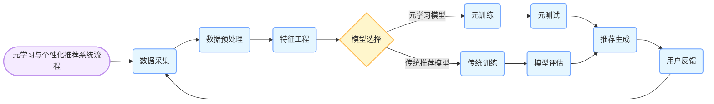

# 元学习在个性化推荐系统中的创新应用

> 关键词：元学习、个性化推荐系统、创新应用、机器学习、用户偏好

> 摘要：本文深入探讨了元学习在个性化推荐系统中的创新应用。首先介绍了相关背景知识，包括目的、预期读者、文档结构和术语表。接着阐述了元学习和个性化推荐系统的核心概念及其联系，给出了原理和架构的文本示意图与 Mermaid 流程图。详细讲解了核心算法原理，并通过 Python 源代码进行了说明。对相关数学模型和公式进行了详细推导和举例。通过项目实战，展示了代码的实际案例并进行解读。分析了元学习在个性化推荐系统中的实际应用场景，推荐了学习资源、开发工具框架和相关论文著作。最后总结了未来发展趋势与挑战，还提供了常见问题解答和扩展阅读参考资料。

## 1. 背景介绍 
### 1.1 目的和范围
在当今信息爆炸的时代，个性化推荐系统成为了帮助用户快速找到感兴趣信息的重要工具。传统的推荐系统在处理复杂多变的用户偏好和数据时存在一定的局限性。元学习作为一种新兴的机器学习范式，具有快速学习和适应新任务的能力，为个性化推荐系统带来了新的发展机遇。本文的目的在于深入研究元学习在个性化推荐系统中的创新应用，探讨其原理、算法、实际案例等方面，为相关领域的研究和实践提供参考。范围涵盖了元学习的基本概念、核心算法，个性化推荐系统的架构和常见算法，以及元学习在推荐系统中的具体应用场景和实现方法。

### 1.2 预期读者
本文预期读者包括从事机器学习、人工智能、信息检索等领域的研究人员和工程师，对个性化推荐系统感兴趣的技术爱好者，以及希望将元学习应用于实际业务的企业技术人员。对于有一定机器学习基础的读者，本文将帮助他们深入理解元学习在推荐系统中的应用；对于初学者，也可以通过本文了解元学习和个性化推荐系统的基本概念和相关技术。

### 1.3 文档结构概述
本文将按照以下结构进行组织：首先介绍核心概念与联系，包括元学习和个性化推荐系统的基本原理和它们之间的关系；接着详细讲解核心算法原理和具体操作步骤，并给出 Python 代码示例；然后阐述相关的数学模型和公式，并进行举例说明；通过项目实战展示元学习在个性化推荐系统中的具体实现和代码解读；分析实际应用场景；推荐学习资源、开发工具框架和相关论文著作；最后总结未来发展趋势与挑战，提供常见问题解答和扩展阅读参考资料。

### 1.4 术语表
#### 1.4.1 核心术语定义
- **元学习（Meta - learning）**：也称为“学习如何学习”，是一种让模型能够从多个任务中学习通用的学习策略，从而在面对新任务时能够快速学习和适应的机器学习方法。
- **个性化推荐系统（Personalized Recommendation System）**：根据用户的历史行为、偏好、上下文等信息，为用户提供个性化的物品或服务推荐的系统。
- **任务（Task）**：在元学习中，任务是指一个具体的学习问题，例如一个特定用户的推荐任务。
- **元训练（Meta - training）**：元学习中的训练过程，模型在多个任务上进行学习，以获取通用的学习能力。
- **元测试（Meta - testing）**：在元训练后，模型在新的任务上进行测试，评估其快速学习和适应新任务的能力。

#### 1.4.2 相关概念解释
- **用户偏好（User Preference）**：用户对不同物品或服务的喜好程度，通常通过用户的历史行为（如购买、浏览、评分等）来体现。
- **特征表示（Feature Representation）**：将用户和物品的信息转换为计算机能够处理的向量表示，以便模型进行学习和预测。
- **过拟合（Overfitting）**：模型在训练数据上表现良好，但在新数据上表现不佳的现象，通常是由于模型过于复杂，学习到了训练数据中的噪声。
- **泛化能力（Generalization Ability）**：模型在新数据上的表现能力，即模型能够将在训练数据上学到的知识应用到新数据上的能力。

#### 1.4.3 缩略词列表
- **ML（Machine Learning）**：机器学习
- **DL（Deep Learning）**：深度学习
- **RL（Reinforcement Learning）**：强化学习
- **MAML（Model - Agnostic Meta - Learning）**：模型无关元学习

## 2. 核心概念与联系 

### 2.1 元学习的原理和架构
元学习的核心思想是让模型学会如何学习，即从多个任务中提取通用的学习策略。传统的机器学习模型通常是在单一任务上进行训练，而元学习则是在多个相关任务上进行训练，以提高模型在新任务上的学习效率和性能。

元学习的一般架构包括元训练和元测试两个阶段。在元训练阶段，模型在多个任务上进行训练，学习到通用的参数初始化或学习策略。在元测试阶段，模型使用学到的通用知识，在新的任务上进行快速学习和适应。

下面是元学习架构的文本示意图：

元训练阶段：
- 输入：多个任务的数据集
- 过程：模型在多个任务上进行训练，更新元参数
- 输出：学到的通用元参数

元测试阶段：
- 输入：新任务的少量数据
- 过程：使用学到的元参数，在新任务上进行快速学习和适应
- 输出：新任务的预测结果

### 2.2 个性化推荐系统的原理和架构
个性化推荐系统的主要目标是根据用户的历史行为和偏好，为用户推荐他们可能感兴趣的物品或服务。常见的推荐算法包括基于内容的推荐、协同过滤推荐、深度学习推荐等。

个性化推荐系统的一般架构包括数据采集、数据预处理、特征工程、模型训练和推荐生成等模块。数据采集模块负责收集用户的历史行为数据和物品信息；数据预处理模块对采集到的数据进行清洗、归一化等处理；特征工程模块将用户和物品的信息转换为特征向量；模型训练模块使用合适的推荐算法对特征向量进行训练；推荐生成模块根据训练好的模型，为用户生成推荐列表。

下面是个性化推荐系统架构的文本示意图：

数据采集：
- 来源：用户行为日志、物品信息数据库等
- 内容：用户的购买、浏览、评分等行为数据，物品的属性信息

数据预处理：
- 操作：数据清洗、缺失值处理、归一化等
- 目的：提高数据质量，便于后续处理

特征工程：
- 方法：提取用户和物品的特征，如用户的年龄、性别、兴趣爱好，物品的类别、价格等
- 输出：特征向量

模型训练：
- 算法：基于内容的推荐、协同过滤推荐、深度学习推荐等
- 过程：使用训练数据对模型进行训练，更新模型参数

推荐生成：
- 输入：用户信息和训练好的模型
- 输出：为用户生成的推荐列表

### 2.3 元学习与个性化推荐系统的联系
元学习与个性化推荐系统的联系在于，元学习可以帮助推荐系统更好地处理用户偏好的动态变化和新用户、新物品的冷启动问题。在传统的推荐系统中，当遇到新用户或新物品时，模型需要大量的训练数据才能进行准确的推荐。而元学习可以通过在多个用户的推荐任务上进行学习，获取通用的学习策略，从而在面对新用户或新物品时，能够快速学习和适应，提高推荐的准确性和效率。

例如，在一个电商推荐系统中，当有新用户注册时，元学习模型可以利用之前在其他用户推荐任务上学到的通用知识，快速为新用户生成初始的推荐列表，随着新用户的行为数据不断积累，模型可以进一步优化推荐结果。

### 2.4 Mermaid 流程图


这个流程图展示了元学习与个性化推荐系统的整体流程，包括数据采集、预处理、特征工程、模型选择、训练、测试、推荐生成和用户反馈等环节。如果选择元学习模型，则进行元训练和元测试；如果选择传统推荐模型，则进行传统训练和模型评估。用户反馈可以用于进一步优化数据和模型。

## 3. 核心算法原理 & 具体操作步骤 

### 3.1 模型无关元学习（MAML）算法原理
模型无关元学习（MAML）是一种经典的元学习算法，其核心思想是找到一个通用的参数初始化，使得模型在新任务上能够通过少量的梯度更新快速收敛到较好的性能。

MAML 的具体步骤如下：

1. **初始化元参数**：随机初始化模型的参数 $\theta$。
2. **元训练循环**：
    - 从任务分布 $\mathcal{T}$ 中采样一批任务 $\{T_1, T_2, \cdots, T_n\}$。
    - 对于每个任务 $T_i$：
        - 从任务 $T_i$ 的训练数据 $D_{i}^{train}$ 中计算梯度 $\nabla_{\theta} L_{T_i}(f_{\theta})$，其中 $L_{T_i}$ 是任务 $T_i$ 的损失函数，$f_{\theta}$ 是参数为 $\theta$ 的模型。
        - 使用梯度更新得到临时参数 $\theta_{i}' = \theta - \alpha \nabla_{\theta} L_{T_i}(f_{\theta})$，其中 $\alpha$ 是内层学习率。
        - 从任务 $T_i$ 的测试数据 $D_{i}^{test}$ 中计算临时参数 $\theta_{i}'$ 下的损失 $L_{T_i}(f_{\theta_{i}'})$。
    - 计算所有任务的平均损失 $\bar{L} = \frac{1}{n} \sum_{i = 1}^{n} L_{T_i}(f_{\theta_{i}'})$。
    - 使用平均损失 $\bar{L}$ 对元参数 $\theta$ 进行更新：$\theta = \theta - \beta \nabla_{\theta} \bar{L}$，其中 $\beta$ 是外层学习率。
3. **元测试**：在新任务上，使用学到的元参数 $\theta$ 进行初始化，然后通过少量的梯度更新来适应新任务。

### 3.2 Python 代码实现 MAML 在个性化推荐系统中的应用
```python
import torch
import torch.nn as nn
import torch.optim as optim

# 定义一个简单的推荐模型
class RecommendationModel(nn.Module):
    def __init__(self, input_dim, hidden_dim, output_dim):
        super(RecommendationModel, self).__init__()
        self.fc1 = nn.Linear(input_dim, hidden_dim)
        self.relu = nn.ReLU()
        self.fc2 = nn.Linear(hidden_dim, output_dim)

    def forward(self, x):
        out = self.fc1(x)
        out = self.relu(out)
        out = self.fc2(out)
        return out

# MAML 算法实现
def maml_recommendation(model, meta_optimizer, tasks, inner_lr, outer_lr, num_meta_iterations):
    for meta_iter in range(num_meta_iterations):
        meta_loss = 0
        for task in tasks:
            # 复制模型参数
            fast_weights = list(model.parameters())

            # 内层更新
            for i in range(len(task['train_data'])):
                x_train, y_train = task['train_data'][i]
                logits = model(x_train)
                loss = nn.MSELoss()(logits, y_train)
                grads = torch.autograd.grad(loss, fast_weights)
                fast_weights = [w - inner_lr * g for w, g in zip(fast_weights, grads)]

            # 外层更新
            x_test, y_test = task['test_data']
            logits = model.forward_with_weights(x_test, fast_weights)
            meta_loss += nn.MSELoss()(logits, y_test)

        meta_loss /= len(tasks)
        meta_optimizer.zero_grad()
        meta_loss.backward()
        meta_optimizer.step()

        if (meta_iter + 1) % 100 == 0:
            print(f"Meta iteration {meta_iter + 1}, Meta loss: {meta_loss.item()}")

    return model

# 示例数据生成
input_dim = 10
hidden_dim = 20
output_dim = 1
model = RecommendationModel(input_dim, hidden_dim, output_dim)
meta_optimizer = optim.Adam(model.parameters(), lr=outer_lr)

# 模拟任务
num_tasks = 10
tasks = []
for _ in range(num_tasks):
    train_data = [(torch.randn(input_dim), torch.randn(output_dim)) for _ in range(5)]
    test_data = (torch.randn(input_dim), torch.randn(output_dim))
    task = {'train_data': train_data, 'test_data': test_data}
    tasks.append(task)

# 超参数设置
inner_lr = 0.01
outer_lr = 0.001
num_meta_iterations = 1000

# 运行 MAML 算法
trained_model = maml_recommendation(model, meta_optimizer, tasks, inner_lr, outer_lr, num_meta_iterations)
```

### 3.3 代码解读
- **RecommendationModel 类**：定义了一个简单的两层全连接神经网络作为推荐模型，包含一个输入层、一个隐藏层和一个输出层。
- **maml_recommendation 函数**：实现了 MAML 算法的核心逻辑。在元训练循环中，对于每个任务，先进行内层更新得到临时参数，然后使用临时参数计算外层损失，最后更新元参数。
- **示例数据生成**：模拟了一些任务数据，每个任务包含训练数据和测试数据。
- **超参数设置**：设置了内层学习率、外层学习率和元训练迭代次数。
- **运行 MAML 算法**：调用 `maml_recommendation` 函数进行元训练，得到训练好的模型。

## 4. 数学模型和公式 & 详细讲解 & 举例说明 

### 4.1 MAML 算法的数学模型
MAML 算法的目标是找到一个通用的参数初始化 $\theta$，使得模型在新任务上能够通过少量的梯度更新快速收敛到较好的性能。具体来说，MAML 的优化目标可以表示为：

$$\min_{\theta} \sum_{T \sim \mathcal{T}} L_{T}(f_{\theta'})$$

其中，$\mathcal{T}$ 是任务分布，$T$ 是从任务分布中采样得到的一个任务，$L_{T}$ 是任务 $T$ 的损失函数，$f_{\theta'}$ 是经过内层更新后的模型，$\theta'$ 是内层更新后的参数，其更新公式为：

$$\theta' = \theta - \alpha \nabla_{\theta} L_{T}(f_{\theta})$$

其中，$\alpha$ 是内层学习率。

### 4.2 详细讲解
- **外层优化目标**：$\min_{\theta} \sum_{T \sim \mathcal{T}} L_{T}(f_{\theta'})$ 表示要找到一个元参数 $\theta$，使得模型在多个任务上经过内层更新后的损失之和最小。这意味着元参数 $\theta$ 应该能够让模型在不同任务上都具有快速学习和适应的能力。
- **内层更新**：$\theta' = \theta - \alpha \nabla_{\theta} L_{T}(f_{\theta})$ 是在每个任务上进行的局部更新，使用任务 $T$ 的训练数据计算梯度，并更新参数。内层学习率 $\alpha$ 控制了每次更新的步长。

### 4.3 举例说明
假设我们有一个简单的线性回归任务，模型为 $f_{\theta}(x) = \theta_0 + \theta_1 x$，损失函数为均方误差损失 $L(y, \hat{y}) = \frac{1}{n} \sum_{i = 1}^{n} (y_i - \hat{y}_i)^2$。

- **初始化元参数**：随机初始化 $\theta = [\theta_0, \theta_1]$。
- **元训练**：
    - 从任务分布中采样一个任务 $T$，其训练数据为 $\{(x_1, y_1), (x_2, y_2), \cdots, (x_n, y_n)\}$。
    - 计算内层梯度：$\nabla_{\theta} L_{T}(f_{\theta}) = \left[\frac{\partial L_{T}}{\partial \theta_0}, \frac{\partial L_{T}}{\partial \theta_1}\right]$。
    - 进行内层更新：$\theta' = \theta - \alpha \nabla_{\theta} L_{T}(f_{\theta})$。
    - 任务 $T$ 的测试数据为 $\{(x_{n + 1}, y_{n + 1}), (x_{n + 2}, y_{n + 2}), \cdots, (x_{m}, y_{m})\}$，计算外层损失 $L_{T}(f_{\theta'})$。
    - 重复上述步骤，对多个任务进行训练，更新元参数 $\theta$。
- **元测试**：在新任务上，使用学到的元参数 $\theta$ 进行初始化，然后通过少量的梯度更新来适应新任务。

### 4.4 其他相关数学模型
除了 MAML，还有一些其他的元学习算法也可以应用于个性化推荐系统，它们都有各自的数学模型。

#### 4.4.1 Reptile 算法
Reptile 算法的目标是通过多次迭代，让模型的参数逐渐接近在多个任务上都表现良好的参数。其更新公式为：

$$\theta \leftarrow \theta + \beta (\theta_{avg} - \theta)$$

其中，$\theta$ 是当前的元参数，$\theta_{avg}$ 是在多个任务上进行局部更新后的参数平均值，$\beta$ 是学习率。

#### 4.4.2 Meta - SGD 算法
Meta - SGD 算法在 MAML 的基础上，为每个参数引入了一个可学习的学习率。其内层更新公式为：

$$\theta' = \theta - \alpha \odot \nabla_{\theta} L_{T}(f_{\theta})$$

其中，$\alpha$ 是可学习的学习率向量，$\odot$ 表示逐元素相乘。外层优化目标是同时优化元参数 $\theta$ 和学习率 $\alpha$。

## 5. 项目实战：代码实际案例和详细解释说明 

### 5.1  开发环境搭建
#### 5.1.1 操作系统
推荐使用 Linux 或 macOS 系统，因为它们对深度学习框架的支持更好。如果使用 Windows 系统，也可以安装相应的开发环境，但可能会遇到一些兼容性问题。

#### 5.1.2 Python 环境
安装 Python 3.6 及以上版本。可以使用 Anaconda 来管理 Python 环境，它可以方便地创建和管理虚拟环境。以下是创建和激活虚拟环境的命令：

```bash
conda create -n recommendation python=3.8
conda activate recommendation
```

#### 5.1.3 深度学习框架
安装 PyTorch 深度学习框架，它是一个广泛使用的深度学习框架，支持 GPU 加速。可以根据自己的 CUDA 版本选择合适的安装命令，例如：

```bash
pip install torch torchvision torchaudio
```

#### 5.1.4 其他依赖库
安装其他必要的依赖库，如 NumPy、Pandas 等：

```bash
pip install numpy pandas
```

### 5.2  源代码详细实现和代码解读
#### 5.2.1 数据加载和预处理
```python
import pandas as pd
import torch
from torch.utils.data import Dataset, DataLoader

# 定义数据集类
class RecommendationDataset(Dataset):
    def __init__(self, data):
        self.data = data
        self.users = data['user_id'].unique()
        self.items = data['item_id'].unique()
        self.user_dict = {user: idx for idx, user in enumerate(self.users)}
        self.item_dict = {item: idx for idx, item in enumerate(self.items)}
        self.num_users = len(self.users)
        self.num_items = len(self.items)

    def __len__(self):
        return len(self.data)

    def __getitem__(self, idx):
        row = self.data.iloc[idx]
        user_id = self.user_dict[row['user_id']]
        item_id = self.item_dict[row['item_id']]
        rating = torch.tensor(row['rating'], dtype=torch.float32)
        user_tensor = torch.tensor(user_id, dtype=torch.long)
        item_tensor = torch.tensor(item_id, dtype=torch.long)
        return user_tensor, item_tensor, rating

# 加载数据
data = pd.read_csv('ratings.csv')

# 划分训练集和测试集
train_data = data.sample(frac=0.8, random_state=42)
test_data = data.drop(train_data.index)

# 创建数据集和数据加载器
train_dataset = RecommendationDataset(train_data)
test_dataset = RecommendationDataset(test_data)
train_loader = DataLoader(train_dataset, batch_size=32, shuffle=True)
test_loader = DataLoader(test_dataset, batch_size=32, shuffle=False)
```

**代码解读**：
- `RecommendationDataset` 类继承自 `torch.utils.data.Dataset`，用于封装推荐数据。在 `__init__` 方法中，对用户和物品进行编号，并记录用户和物品的数量。在 `__getitem__` 方法中，根据索引获取用户、物品和评分信息，并转换为 PyTorch 张量。
- 使用 `pandas` 库加载数据，并将数据划分为训练集和测试集。
- 创建 `DataLoader` 对象，用于批量加载数据。

#### 5.2.2 推荐模型定义
```python
import torch.nn as nn

class MatrixFactorization(nn.Module):
    def __init__(self, num_users, num_items, embedding_dim):
        super(MatrixFactorization, self).__init__()
        self.user_embedding = nn.Embedding(num_users, embedding_dim)
        self.item_embedding = nn.Embedding(num_items, embedding_dim)
        self.bias_user = nn.Parameter(torch.zeros(num_users))
        self.bias_item = nn.Parameter(torch.zeros(num_items))
        self.global_bias = nn.Parameter(torch.zeros(1))

    def forward(self, user_ids, item_ids):
        user_emb = self.user_embedding(user_ids)
        item_emb = self.item_embedding(item_ids)
        dot_product = (user_emb * item_emb).sum(dim=1)
        user_bias = self.bias_user[user_ids]
        item_bias = self.bias_item[item_ids]
        rating = dot_product + user_bias + item_bias + self.global_bias
        return rating
```

**代码解读**：
- `MatrixFactorization` 类继承自 `nn.Module`，实现了矩阵分解推荐模型。使用 `nn.Embedding` 层将用户和物品转换为低维向量表示。同时，引入了用户偏置、物品偏置和全局偏置，以提高模型的表达能力。
- 在 `forward` 方法中，计算用户和物品向量的点积，并加上偏置项，得到预测评分。

#### 5.2.3 MAML 训练过程
```python
import torch.optim as optim

# 超参数设置
embedding_dim = 10
inner_lr = 0.01
outer_lr = 0.001
num_meta_iterations = 1000

# 创建模型和优化器
model = MatrixFactorization(train_dataset.num_users, train_dataset.num_items, embedding_dim)
meta_optimizer = optim.Adam(model.parameters(), lr=outer_lr)

# MAML 训练
for meta_iter in range(num_meta_iterations):
    meta_loss = 0
    for user_id in train_dataset.users:
        # 为每个用户创建一个任务
        user_data = train_data[train_data['user_id'] == user_id]
        user_train_data = user_data.sample(frac=0.8)
        user_test_data = user_data.drop(user_train_data.index)

        user_train_dataset = RecommendationDataset(user_train_data)
        user_train_loader = DataLoader(user_train_dataset, batch_size=32, shuffle=True)

        # 复制模型参数
        fast_weights = list(model.parameters())

        # 内层更新
        for user_x, user_y, user_rating in user_train_loader:
            logits = model.forward_with_weights(user_x, user_y, fast_weights)
            loss = nn.MSELoss()(logits, user_rating)
            grads = torch.autograd.grad(loss, fast_weights)
            fast_weights = [w - inner_lr * g for w, g in zip(fast_weights, grads)]

        # 外层更新
        user_test_dataset = RecommendationDataset(user_test_data)
        user_test_loader = DataLoader(user_test_dataset, batch_size=32, shuffle=False)
        for user_x, user_y, user_rating in user_test_loader:
            logits = model.forward_with_weights(user_x, user_y, fast_weights)
            meta_loss += nn.MSELoss()(logits, user_rating)

    meta_loss /= len(train_dataset.users)
    meta_optimizer.zero_grad()
    meta_loss.backward()
    meta_optimizer.step()

    if (meta_iter + 1) % 100 == 0:
        print(f"Meta iteration {meta_iter + 1}, Meta loss: {meta_loss.item()}")
```

**代码解读**：
- 超参数设置包括嵌入维度、内层学习率、外层学习率和元训练迭代次数。
- 创建矩阵分解模型和元优化器。
- 在元训练循环中，为每个用户创建一个任务，将用户数据划分为训练集和测试集。
- 进行内层更新，使用用户的训练数据更新临时参数。
- 进行外层更新，使用用户的测试数据计算外层损失，并更新元参数。

### 5.3  代码解读与分析
#### 5.3.1 数据加载和预处理部分
- 通过自定义 `RecommendationDataset` 类，将推荐数据封装为 PyTorch 数据集，方便后续使用 `DataLoader` 进行批量加载。
- 对用户和物品进行编号，将用户和物品的 ID 转换为整数索引，便于模型处理。

#### 5.3.2 推荐模型部分
- 矩阵分解模型通过将用户和物品映射到低维向量空间，利用向量的点积和偏置项来预测评分。这种模型简单有效，能够捕捉用户和物品之间的潜在关系。

#### 5.3.3 MAML 训练部分
- MAML 训练过程中，为每个用户创建一个任务，通过内层更新和外层更新来学习通用的元参数。内层更新使用用户的训练数据，外层更新使用用户的测试数据。
- 元优化器使用 Adam 优化器，根据外层损失更新元参数，使得模型在不同用户的任务上都能快速学习和适应。

## 6. 实际应用场景 
### 6.1 电商推荐系统
在电商推荐系统中，元学习可以帮助解决新用户和新商品的冷启动问题。当有新用户注册时，元学习模型可以利用之前在其他用户推荐任务上学到的通用知识，快速为新用户生成初始的推荐列表。对于新上架的商品，模型也可以通过元学习快速适应，为用户推荐这些新商品。例如，亚马逊的推荐系统可以根据用户的历史购买行为、浏览记录等信息，使用元学习算法为用户推荐个性化的商品。

### 6.2 新闻推荐系统
新闻推荐系统需要根据用户的兴趣和偏好，实时为用户推荐感兴趣的新闻。元学习可以帮助系统快速适应用户兴趣的变化，提高推荐的时效性和准确性。例如，今日头条的新闻推荐系统可以利用元学习算法，根据用户的阅读历史、点赞、评论等行为，为用户推荐个性化的新闻文章。

### 6.3 音乐推荐系统
音乐推荐系统需要根据用户的音乐偏好，为用户推荐喜欢的音乐。元学习可以帮助系统处理用户音乐偏好的动态变化，例如用户可能会因为不同的心情、场景而喜欢不同类型的音乐。例如， Spotify 的音乐推荐系统可以利用元学习算法，根据用户的听歌历史、收藏列表等信息，为用户推荐个性化的音乐播放列表。

### 6.4 视频推荐系统
视频推荐系统需要根据用户的观看历史和偏好，为用户推荐感兴趣的视频。元学习可以帮助系统在面对新用户和新视频时，快速提供准确的推荐。例如， YouTube 的视频推荐系统可以利用元学习算法，根据用户的观看历史、点赞、评论等行为，为用户推荐个性化的视频内容。

## 7. 工具和资源推荐
### 7.1 学习资源推荐
#### 7.1.1 书籍推荐
- 《深度学习》（Deep Learning）：由 Ian Goodfellow、Yoshua Bengio 和 Aaron Courville 撰写，是深度学习领域的经典教材，涵盖了深度学习的基本概念、算法和应用。
- 《机器学习》（Machine Learning: A Probabilistic Perspective）：由 Kevin P. Murphy 撰写，从概率的角度介绍了机器学习的基本理论和算法，对理解元学习的原理有很大帮助。
- 《元学习：理论、算法与应用》（Meta - Learning: Theory, Algorithms, and Applications）：专门介绍元学习的书籍，详细讲解了元学习的各种算法和应用场景。

#### 7.1.2 在线课程
- Coursera 上的“深度学习专项课程”（Deep Learning Specialization）：由 Andrew Ng 教授授课，包括神经网络、卷积神经网络、循环神经网络等深度学习的核心内容。
- edX 上的“强化学习基础”（Foundations of Reinforcement Learning）：介绍了强化学习的基本概念和算法，元学习与强化学习有一定的关联，可以帮助理解元学习在动态环境中的应用。
- 网易云课堂上的“元学习实战教程”：专门针对元学习的在线课程，通过实际案例讲解元学习的算法和应用。

#### 7.1.3 技术博客和网站
- arXiv.org：是一个预印本平台，包含了大量的机器学习和人工智能领域的最新研究成果，可以及时了解元学习的最新进展。
- Medium 上的机器学习博客：有很多机器学习领域的专家和爱好者分享他们的研究成果和实践经验，包括元学习在推荐系统中的应用案例。
- 机器之心：是一个专注于人工智能领域的科技媒体，提供了丰富的技术文章和行业动态，对了解元学习和个性化推荐系统的发展趋势有很大帮助。

### 7.2 开发工具框架推荐
#### 7.2.1 IDE和编辑器
- PyCharm：是一款专门为 Python 开发设计的集成开发环境（IDE），具有代码编辑、调试、版本控制等功能，对深度学习项目的开发非常方便。
- Jupyter Notebook：是一个交互式的开发环境，可以将代码、文本、图表等内容集成在一个文档中，适合进行数据分析和模型实验。
- Visual Studio Code：是一款轻量级的代码编辑器，支持多种编程语言和插件扩展，对 Python 开发也有很好的支持。

#### 7.2.2 调试和性能分析工具
- PyTorch Profiler：是 PyTorch 提供的性能分析工具，可以帮助开发者分析模型的运行时间、内存使用等情况，优化模型性能。
- TensorBoard：是 TensorFlow 提供的可视化工具，也可以与 PyTorch 结合使用，用于可视化模型的训练过程、损失曲线、准确率等指标。
- cProfile：是 Python 内置的性能分析工具，可以分析 Python 代码的运行时间和函数调用情况，帮助开发者找出代码中的性能瓶颈。

#### 7.2.3 相关框架和库
- PyTorch：是一个广泛使用的深度学习框架，提供了丰富的神经网络层和优化算法，对元学习的实现非常方便。
- Torchmeta：是一个基于 PyTorch 的元学习库，提供了各种元学习算法的实现和数据集加载工具，方便开发者进行元学习的研究和开发。
- scikit - learn：是一个常用的机器学习库，提供了各种机器学习算法的实现，如分类、回归、聚类等，可以用于推荐系统的特征工程和模型评估。

### 7.3 相关论文著作推荐
#### 7.3.1 经典论文
- "Model - Agnostic Meta - Learning for Fast Adaptation of Deep Networks"：提出了模型无关元学习（MAML）算法，是元学习领域的经典论文。
- "Optimization as a Model for Few - Shot Learning"：介绍了基于优化的元学习方法，为元学习的发展奠定了基础。
- "Matching Networks for One Shot Learning"：提出了匹配网络（Matching Networks）算法，用于解决少样本学习问题，在元学习中有重要应用。

#### 7.3.2 最新研究成果
- 可以关注 NeurIPS、ICML、CVPR 等顶级机器学习和人工智能会议的论文，这些会议每年都会发表大量的元学习相关的最新研究成果。
- arXiv 上也有很多元学习领域的预印本论文，可以及时了解最新的研究动态。

#### 7.3.3 应用案例分析
- 一些知名科技公司的技术博客会分享他们在个性化推荐系统中应用元学习的案例，例如 Google、Facebook、Amazon 等公司的技术博客。
- 学术期刊如 Journal of Artificial Intelligence Research（JAIR）、ACM Transactions on Intelligent Systems and Technology（TIST）等也会发表一些元学习在推荐系统中的应用案例和研究成果。

## 8. 总结：未来发展趋势与挑战
### 8.1 未来发展趋势
#### 8.1.1 与其他技术的融合
元学习将与强化学习、迁移学习、图神经网络等技术进一步融合，以提高个性化推荐系统的性能和适应性。例如，将元学习与强化学习结合，可以让推荐系统在动态环境中更好地学习和决策；将元学习与图神经网络结合，可以更好地处理用户和物品之间的复杂关系。

#### 8.1.2 处理更复杂的数据和任务
随着数据量的不断增加和数据类型的不断丰富，元学习需要能够处理更复杂的数据，如文本、图像、视频等多模态数据。同时，推荐系统的任务也将更加复杂，例如需要考虑用户的实时上下文信息、社交关系等。

#### 8.1.3 应用领域的拓展
元学习在个性化推荐系统中的应用将拓展到更多的领域，如医疗、教育、金融等。例如，在医疗领域，可以根据患者的历史病历和症状，使用元学习算法为患者推荐个性化的治疗方案；在教育领域，可以根据学生的学习历史和能力，为学生推荐个性化的学习资源。

### 8.2 挑战
#### 8.2.1 数据隐私和安全问题
在个性化推荐系统中，需要收集和处理大量的用户数据，这涉及到用户的隐私和安全问题。元学习算法需要在保护用户隐私的前提下，充分利用数据进行学习和推荐。

#### 8.2.2 计算资源和效率问题
元学习算法通常需要在多个任务上进行训练，计算复杂度较高，对计算资源的需求较大。如何提高元学习算法的计算效率，减少计算资源的消耗，是一个亟待解决的问题。

#### 8.2.3 模型可解释性问题
元学习模型通常是深度神经网络，具有较高的复杂度，模型的可解释性较差。在一些应用场景中，如医疗、金融等，需要模型能够提供可解释的推荐结果，以便用户理解和信任推荐系统。

## 9. 附录：常见问题与解答
### 9.1 元学习与传统机器学习有什么区别？
传统机器学习通常是在单一任务上进行训练，模型的泛化能力主要依赖于训练数据的规模和质量。而元学习是在多个相关任务上进行训练，学习到通用的学习策略，能够在面对新任务时快速学习和适应。元学习更注重模型的学习能力和适应性，而传统机器学习更注重模型在特定任务上的性能。

### 9.2 元学习在个性化推荐系统中能解决哪些问题？
元学习在个性化推荐系统中可以解决新用户和新物品的冷启动问题，以及用户偏好的动态变化问题。通过在多个用户的推荐任务上进行学习，元学习模型可以获取通用的知识，在面对新用户或新物品时，能够快速为用户生成准确的推荐列表。同时，元学习可以根据用户的实时行为，快速调整推荐策略，适应用户偏好的变化。

### 9.3 如何选择合适的元学习算法？
选择合适的元学习算法需要考虑多个因素，如任务的特点、数据的规模和质量、计算资源等。如果任务是少样本学习问题，MAML 等基于梯度的元学习算法可能是一个不错的选择；如果任务是连续优化问题，Reptile 算法可能更适合。此外，还可以根据算法的复杂度、收敛速度等因素进行选择。

### 9.4 元学习模型的训练时间和计算资源消耗大吗？
元学习模型通常需要在多个任务上进行训练，计算复杂度较高，训练时间和计算资源消耗相对较大。尤其是在处理大规模数据和复杂任务时，训练时间可能会很长，对计算资源的需求也会很大。为了减少训练时间和计算资源消耗，可以采用一些优化方法，如批量归一化、模型压缩等。

### 9.5 元学习模型的可解释性如何？
元学习模型通常是深度神经网络，具有较高的复杂度，可解释性较差。目前，研究人员正在探索一些方法来提高元学习模型的可解释性，如特征重要性分析、决策树可视化等。在实际应用中，需要根据具体的需求和场景，权衡模型的性能和可解释性。

## 10. 扩展阅读 & 参考资料
- Finn, C., Abbeel, P., & Levine, S. (2017). Model - Agnostic Meta - Learning for Fast Adaptation of Deep Networks. arXiv preprint arXiv:1703.03400.
- Santoro, A., Bartunov, S., Botvinick, M., Wierstra, D., & Lillicrap, T. P. (2016). Meta - learning with memory - augmented neural networks. In Advances in neural information processing systems (pp. 1842 - 1850).
- Vinyals, O., Blundell, C., Lillicrap, T., Wierstra, D., et al. (2016). Matching Networks for One Shot Learning. In Advances in Neural Information Processing Systems (pp. 3630 - 3638).
- Goodfellow, I. J., Bengio, Y., & Courville, A. (2016). Deep learning. MIT press.
- Murphy, K. P. (2012). Machine learning: A probabilistic perspective. MIT press.

作者：AI天才研究院/AI Genius Institute & 禅与计算机程序设计艺术 /Zen And The Art of Computer Programming