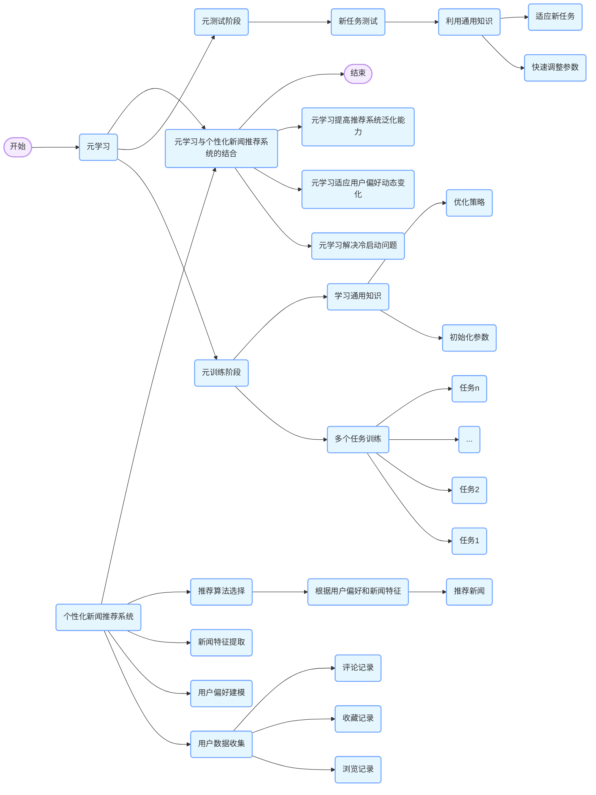

# 元学习在个性化新闻推荐系统中的实现

> 关键词：元学习、个性化新闻推荐系统、模型训练、新闻推荐算法、用户偏好建模

> 摘要：本文聚焦于元学习在个性化新闻推荐系统中的实现。首先介绍了研究背景，包括目的、预期读者、文档结构和相关术语。接着阐述了核心概念与联系，涵盖元学习和个性化新闻推荐系统的原理及架构。详细讲解了核心算法原理和具体操作步骤，结合Python代码进行说明。给出了相关数学模型和公式，并举例解释。通过项目实战，展示了开发环境搭建、源代码实现与解读。探讨了实际应用场景，推荐了学习资源、开发工具框架和相关论文著作。最后总结了未来发展趋势与挑战，还提供了常见问题解答和扩展阅读参考资料，旨在为元学习在个性化新闻推荐系统中的应用提供全面且深入的技术指导。

## 1. 背景介绍 
### 1.1 目的和范围
随着互联网的快速发展，新闻信息呈现爆炸式增长，用户获取有价值新闻的难度也日益增大。个性化新闻推荐系统能够根据用户的兴趣和偏好，为其精准推送新闻，提高用户获取信息的效率。然而，传统的推荐算法在处理用户偏好的动态变化和新用户冷启动问题时存在一定的局限性。元学习作为一种新兴的机器学习方法，旨在让模型能够快速学习新知识，适应新任务。本研究的目的是将元学习应用于个性化新闻推荐系统，以解决传统推荐算法的不足，提高推荐系统的性能和适应性。

本研究的范围主要包括元学习的核心概念和算法原理、个性化新闻推荐系统的架构和流程、将元学习融入推荐系统的具体实现方法，以及通过实际案例验证元学习在个性化新闻推荐中的有效性。

### 1.2 预期读者
本文预期读者包括从事机器学习、人工智能、信息检索等领域的研究人员和开发者，以及对个性化新闻推荐系统感兴趣的技术爱好者。对于希望了解元学习在实际应用中的具体实现和如何提升推荐系统性能的读者来说，本文将提供有价值的参考。

### 1.3 文档结构概述
本文将按照以下结构进行组织：
1. 背景介绍：阐述研究的目的、预期读者、文档结构和相关术语。
2. 核心概念与联系：介绍元学习和个性化新闻推荐系统的核心概念、原理和架构，并通过示意图和流程图展示它们之间的联系。
3. 核心算法原理 & 具体操作步骤：详细讲解元学习的核心算法原理，并给出使用Python实现的具体操作步骤。
4. 数学模型和公式 & 详细讲解 & 举例说明：给出元学习和个性化新闻推荐系统相关的数学模型和公式，并通过具体例子进行详细解释。
5. 项目实战：代码实际案例和详细解释说明：通过一个实际的项目案例，展示如何在个性化新闻推荐系统中实现元学习，包括开发环境搭建、源代码实现和代码解读。
6. 实际应用场景：探讨元学习在个性化新闻推荐系统中的实际应用场景和优势。
7. 工具和资源推荐：推荐相关的学习资源、开发工具框架和论文著作，帮助读者进一步深入学习和研究。
8. 总结：未来发展趋势与挑战：总结元学习在个性化新闻推荐系统中的应用现状，分析未来的发展趋势和面临的挑战。
9. 附录：常见问题与解答：解答读者在学习和实践过程中可能遇到的常见问题。
10. 扩展阅读 & 参考资料：提供相关的扩展阅读材料和参考资料，方便读者进一步探索。

### 1.4 术语表
#### 1.4.1 核心术语定义
- **元学习（Meta-learning）**：也称为“学习如何学习”，是一种让模型能够从多个任务中学习通用知识，从而在新任务上快速学习和适应的机器学习方法。
- **个性化新闻推荐系统（Personalized News Recommendation System）**：根据用户的兴趣和偏好，为用户精准推荐新闻的系统。
- **用户偏好建模（User Preference Modeling）**：通过分析用户的历史行为数据，构建用户的兴趣和偏好模型。
- **冷启动问题（Cold Start Problem）**：在推荐系统中，当新用户或新物品进入系统时，由于缺乏足够的历史数据，导致推荐效果不佳的问题。

#### 1.4.2 相关概念解释
- **任务（Task）**：在元学习中，任务可以理解为一个具体的学习问题，例如针对某个用户的新闻推荐任务。
- **元训练（Meta-training）**：元学习的训练过程，模型在多个任务上进行训练，学习通用的知识和技能。
- **元测试（Meta-testing）**：在元训练完成后，模型在新的任务上进行测试，评估其快速学习和适应的能力。

#### 1.4.3 缩略词列表
- **ML（Machine Learning）**：机器学习
- **DL（Deep Learning）**：深度学习
- **NLP（Natural Language Processing）**：自然语言处理
- **CNN（Convolutional Neural Network）**：卷积神经网络
- **RNN（Recurrent Neural Network）**：循环神经网络

## 2. 核心概念与联系 

### 元学习的原理
元学习的核心思想是让模型能够从多个任务中学习通用的知识和技能，以便在新的任务上能够快速学习和适应。传统的机器学习方法通常是针对单个任务进行训练，而元学习则是在多个任务上进行训练，学习任务之间的共性和规律。

元学习的训练过程可以分为两个阶段：元训练阶段和元测试阶段。在元训练阶段，模型在多个任务上进行训练，学习通用的初始化参数和优化策略。在元测试阶段，模型在新的任务上进行测试，利用元训练阶段学习到的知识，快速调整模型参数，以适应新任务。

### 个性化新闻推荐系统的原理
个性化新闻推荐系统的核心是根据用户的兴趣和偏好，为用户精准推荐新闻。其主要流程包括用户数据收集、用户偏好建模、新闻特征提取和推荐算法选择等步骤。

用户数据收集是指收集用户的历史行为数据，如浏览记录、收藏记录、评论记录等。用户偏好建模是指通过分析用户的历史行为数据，构建用户的兴趣和偏好模型。新闻特征提取是指从新闻文本中提取有用的特征，如关键词、主题等。推荐算法选择是指根据用户偏好模型和新闻特征，选择合适的推荐算法，为用户推荐新闻。

### 元学习与个性化新闻推荐系统的联系
元学习可以为个性化新闻推荐系统带来以下优势：
- **解决冷启动问题**：元学习可以让推荐系统在新用户或新新闻进入系统时，利用元训练阶段学习到的知识，快速适应新情况，为用户提供准确的推荐。
- **适应用户偏好的动态变化**：用户的兴趣和偏好会随着时间的推移而发生变化，元学习可以让推荐系统快速学习用户偏好的变化，及时调整推荐策略。
- **提高推荐系统的泛化能力**：元学习可以让推荐系统学习到不同用户和新闻之间的共性和规律，提高推荐系统的泛化能力，从而在不同的场景下都能提供准确的推荐。

### 核心概念原理和架构的文本示意图
```plaintext
元学习
|-- 元训练阶段
|   |-- 多个任务训练
|   |   |-- 任务1
|   |   |-- 任务2
|   |   |--...
|   |   |-- 任务n
|   |-- 学习通用知识
|       |-- 初始化参数
|       |-- 优化策略
|-- 元测试阶段
    |-- 新任务测试
    |   |-- 利用通用知识
    |   |   |-- 快速调整参数
    |   |-- 适应新任务

个性化新闻推荐系统
|-- 用户数据收集
|   |-- 浏览记录
|   |-- 收藏记录
|   |-- 评论记录
|-- 用户偏好建模
|-- 新闻特征提取
|-- 推荐算法选择
|   |-- 根据用户偏好和新闻特征
|   |-- 推荐新闻

元学习与个性化新闻推荐系统的结合
|-- 元学习解决冷启动问题
|-- 元学习适应用户偏好动态变化
|-- 元学习提高推荐系统泛化能力
```

### Mermaid 流程图


## 3. 核心算法原理 & 具体操作步骤 

### 元学习的核心算法原理
元学习有多种算法，其中比较经典的是模型无关元学习（Model-Agnostic Meta-Learning，MAML）。MAML的核心思想是找到一个通用的初始化参数，使得模型在经过少量的梯度更新后，能够在新的任务上取得较好的性能。

MAML的训练过程可以分为以下几个步骤：
1. **随机初始化模型参数 $\theta$**：在训练开始时，随机初始化模型的参数 $\theta$。
2. **采样任务**：从任务分布 $p(\mathcal{T})$ 中采样一组任务 $\{\mathcal{T}_1, \mathcal{T}_2, \cdots, \mathcal{T}_n\}$。
3. **对于每个任务 $\mathcal{T}_i$**：
    - 从任务 $\mathcal{T}_i$ 中采样一个支持集（Support Set） $S_i$ 和一个查询集（Query Set） $Q_i$。
    - 使用支持集 $S_i$ 对模型进行一次或多次梯度更新，得到临时参数 $\theta_i'$：
      $$\theta_i' = \theta - \alpha \nabla_{\theta} \mathcal{L}_{\mathcal{T}_i}(f_{\theta}(x), y)$$
      其中，$\alpha$ 是学习率，$\mathcal{L}_{\mathcal{T}_i}$ 是任务 $\mathcal{T}_i$ 的损失函数，$f_{\theta}$ 是参数为 $\theta$ 的模型。
    - 使用查询集 $Q_i$ 计算临时参数 $\theta_i'$ 下的损失 $\mathcal{L}_{\mathcal{T}_i}(f_{\theta_i'}(x), y)$。
4. **更新模型参数 $\theta$**：
    - 计算所有任务的查询集损失的总和：
      $$\mathcal{L}_{meta}(\theta) = \sum_{i=1}^{n} \mathcal{L}_{\mathcal{T}_i}(f_{\theta_i'}(x), y)$$
    - 使用梯度下降法更新模型参数 $\theta$：
      $$\theta = \theta - \beta \nabla_{\theta} \mathcal{L}_{meta}(\theta)$$
      其中，$\beta$ 是元学习率。

### 具体操作步骤及Python代码实现
以下是使用Python和PyTorch实现MAML算法的示例代码：

```python
import torch
import torch.nn as nn
import torch.optim as optim

# 定义一个简单的神经网络模型
class SimpleModel(nn.Module):
    def __init__(self):
        super(SimpleModel, self).__init__()
        self.fc1 = nn.Linear(10, 20)
        self.fc2 = nn.Linear(20, 1)

    def forward(self, x):
        x = torch.relu(self.fc1(x))
        x = self.fc2(x)
        return x

# 初始化模型和优化器
model = SimpleModel()
meta_optimizer = optim.Adam(model.parameters(), lr=0.001)

# 模拟任务分布
num_tasks = 10
tasks = [torch.randn(20, 10), torch.randn(20, 1)] * num_tasks

# 元训练阶段
num_epochs = 10
inner_lr = 0.01
outer_lr = 0.001

for epoch in range(num_epochs):
    meta_loss = 0
    for task in tasks:
        support_x, support_y = task[:10], task[10:]
        query_x, query_y = task[10:], task[:10]

        # 复制模型参数
        fast_weights = list(model.parameters())

        # 内层循环，使用支持集进行梯度更新
        for _ in range(1):
            output = model(support_x)
            loss = nn.MSELoss()(output, support_y)
            grads = torch.autograd.grad(loss, fast_weights)
            fast_weights = [w - inner_lr * g for w, g in zip(fast_weights, grads)]

        # 外层循环，使用查询集计算元损失
        output = model.forward(query_x)
        query_loss = nn.MSELoss()(output, query_y)
        meta_loss += query_loss

    # 更新模型参数
    meta_optimizer.zero_grad()
    meta_loss.backward()
    meta_optimizer.step()

    print(f'Epoch {epoch + 1}, Meta Loss: {meta_loss.item()}')
```

### 代码解释
1. **模型定义**：定义了一个简单的两层全连接神经网络 `SimpleModel`。
2. **初始化**：初始化模型和元优化器。
3. **模拟任务分布**：模拟了一个包含10个任务的任务分布。
4. **元训练阶段**：
    - 对于每个任务，将数据分为支持集和查询集。
    - 在内层循环中，使用支持集对模型进行一次梯度更新，得到临时参数。
    - 在外层循环中，使用查询集计算临时参数下的损失，并累加到元损失中。
    - 使用元优化器更新模型参数。

## 4. 数学模型和公式 & 详细讲解 & 举例说明 

### 元学习的数学模型和公式
#### 模型无关元学习（MAML）
MAML的目标是找到一个通用的初始化参数 $\theta$，使得模型在经过少量的梯度更新后，能够在新的任务上取得较好的性能。具体来说，MAML的目标函数可以表示为：

$$\min_{\theta} \sum_{\mathcal{T}_i \sim p(\mathcal{T})} \mathcal{L}_{\mathcal{T}_i}(f_{\theta_i'}(x), y)$$

其中，$\mathcal{T}_i$ 是从任务分布 $p(\mathcal{T})$ 中采样的任务，$\theta_i'$ 是在任务 $\mathcal{T}_i$ 上经过一次或多次梯度更新后得到的临时参数，$f_{\theta_i'}$ 是参数为 $\theta_i'$ 的模型，$\mathcal{L}_{\mathcal{T}_i}$ 是任务 $\mathcal{T}_i$ 的损失函数。

#### 梯度更新公式
在MAML中，临时参数 $\theta_i'$ 是通过在任务 $\mathcal{T}_i$ 上对模型进行一次或多次梯度更新得到的。具体来说，对于第 $k$ 次梯度更新，临时参数 $\theta_i^{(k)}$ 可以表示为：

$$\theta_i^{(k)} = \theta_i^{(k-1)} - \alpha \nabla_{\theta_i^{(k-1)}} \mathcal{L}_{\mathcal{T}_i}(f_{\theta_i^{(k-1)}}(x), y)$$

其中，$\alpha$ 是学习率，$\theta_i^{(0)} = \theta$。

### 详细讲解
MAML的核心思想是通过在多个任务上进行训练，学习一个通用的初始化参数 $\theta$，使得模型在新的任务上能够快速适应。在元训练阶段，模型在每个任务上进行少量的梯度更新，得到临时参数 $\theta_i'$，然后使用查询集计算临时参数下的损失。通过最小化所有任务的查询集损失的总和，更新模型的初始化参数 $\theta$。

### 举例说明
假设我们有一个简单的线性回归任务，任务的目标是学习一个线性函数 $y = wx + b$。我们有两个任务 $\mathcal{T}_1$ 和 $\mathcal{T}_2$，每个任务都有一个支持集和一个查询集。

#### 任务 $\mathcal{T}_1$
- 支持集：$\{(x_1^{(1)}, y_1^{(1)}), (x_2^{(1)}, y_2^{(1)})\}$
- 查询集：$\{(x_3^{(1)}, y_3^{(1)}), (x_4^{(1)}, y_4^{(1)})\}$

#### 任务 $\mathcal{T}_2$
- 支持集：$\{(x_1^{(2)}, y_1^{(2)}), (x_2^{(2)}, y_2^{(2)})\}$
- 查询集：$\{(x_3^{(2)}, y_3^{(2)}), (x_4^{(2)}, y_4^{(2)})\}$

在元训练阶段，我们首先随机初始化模型的参数 $\theta = [w, b]$。然后，对于每个任务 $\mathcal{T}_i$，我们使用支持集对模型进行一次梯度更新，得到临时参数 $\theta_i'$。例如，对于任务 $\mathcal{T}_1$，我们有：

$$\theta_1' = \theta - \alpha \nabla_{\theta} \mathcal{L}_{\mathcal{T}_1}(f_{\theta}(x), y)$$

其中，$\mathcal{L}_{\mathcal{T}_1}$ 是任务 $\mathcal{T}_1$ 的损失函数，例如均方误差损失函数：

$$\mathcal{L}_{\mathcal{T}_1}(f_{\theta}(x), y) = \frac{1}{2} \sum_{j=1}^{2} (f_{\theta}(x_j^{(1)}) - y_j^{(1)})^2$$

然后，我们使用查询集计算临时参数 $\theta_1'$ 下的损失：

$$\mathcal{L}_{\mathcal{T}_1}(f_{\theta_1'}(x), y) = \frac{1}{2} \sum_{j=3}^{4} (f_{\theta_1'}(x_j^{(1)}) - y_j^{(1)})^2$$

同样地，对于任务 $\mathcal{T}_2$，我们也可以得到临时参数 $\theta_2'$ 和查询集损失 $\mathcal{L}_{\mathcal{T}_2}(f_{\theta_2'}(x), y)$。最后，我们计算所有任务的查询集损失的总和：

$$\mathcal{L}_{meta}(\theta) = \mathcal{L}_{\mathcal{T}_1}(f_{\theta_1'}(x), y) + \mathcal{L}_{\mathcal{T}_2}(f_{\theta_2'}(x), y)$$

并使用梯度下降法更新模型的初始化参数 $\theta$：

$$\theta = \theta - \beta \nabla_{\theta} \mathcal{L}_{meta}(\theta)$$

其中，$\beta$ 是元学习率。

## 5. 项目实战：代码实际案例和详细解释说明 

### 5.1  开发环境搭建
#### 安装Python
首先，确保你已经安装了Python 3.6或更高版本。你可以从Python官方网站（https://www.python.org/downloads/）下载并安装Python。

#### 安装依赖库
我们需要安装一些必要的Python库，包括PyTorch、NumPy、Pandas等。可以使用以下命令进行安装：

```sh
pip install torch numpy pandas
```

### 5.2  源代码详细实现和代码解读
以下是一个使用元学习实现个性化新闻推荐系统的完整代码示例：

```python
import torch
import torch.nn as nn
import torch.optim as optim
import numpy as np
import pandas as pd

# 定义新闻特征提取模型
class NewsFeatureExtractor(nn.Module):
    def __init__(self, input_size, hidden_size, output_size):
        super(NewsFeatureExtractor, self).__init__()
        self.fc1 = nn.Linear(input_size, hidden_size)
        self.fc2 = nn.Linear(hidden_size, output_size)

    def forward(self, x):
        x = torch.relu(self.fc1(x))
        x = self.fc2(x)
        return x

# 定义用户偏好建模模型
class UserPreferenceModel(nn.Module):
    def __init__(self, input_size, hidden_size, output_size):
        super(UserPreferenceModel, self).__init__()
        self.fc1 = nn.Linear(input_size, hidden_size)
        self.fc2 = nn.Linear(hidden_size, output_size)

    def forward(self, x):
        x = torch.relu(self.fc1(x))
        x = self.fc2(x)
        return x

# 定义元学习模型
class MetaLearningModel(nn.Module):
    def __init__(self, news_extractor, user_model):
        super(MetaLearningModel, self).__init__()
        self.news_extractor = news_extractor
        self.user_model = user_model

    def forward(self, news_features, user_features):
        news_embeddings = self.news_extractor(news_features)
        user_embeddings = self.user_model(user_features)
        scores = torch.matmul(news_embeddings, user_embeddings.T)
        return scores

# 模拟数据
num_news = 100
num_users = 10
news_features = torch.randn(num_news, 10)
user_features = torch.randn(num_users, 10)
labels = torch.randint(0, 2, (num_users, num_news))

# 初始化模型和优化器
news_extractor = NewsFeatureExtractor(10, 20, 10)
user_model = UserPreferenceModel(10, 20, 10)
meta_model = MetaLearningModel(news_extractor, user_model)
meta_optimizer = optim.Adam(meta_model.parameters(), lr=0.001)

# 元训练阶段
num_epochs = 10
inner_lr = 0.01
outer_lr = 0.001

for epoch in range(num_epochs):
    meta_loss = 0
    for user_id in range(num_users):
        user_news_features = news_features
        user_labels = labels[user_id]

        # 复制模型参数
        fast_weights = list(meta_model.parameters())

        # 内层循环，使用支持集进行梯度更新
        for _ in range(1):
            scores = meta_model(user_news_features, user_features[user_id].unsqueeze(0))
            loss = nn.BCEWithLogitsLoss()(scores.squeeze(), user_labels.float())
            grads = torch.autograd.grad(loss, fast_weights)
            fast_weights = [w - inner_lr * g for w, g in zip(fast_weights, grads)]

        # 外层循环，使用查询集计算元损失
        scores = meta_model(user_news_features, user_features[user_id].unsqueeze(0))
        query_loss = nn.BCEWithLogitsLoss()(scores.squeeze(), user_labels.float())
        meta_loss += query_loss

    # 更新模型参数
    meta_optimizer.zero_grad()
    meta_loss.backward()
    meta_optimizer.step()

    print(f'Epoch {epoch + 1}, Meta Loss: {meta_loss.item()}')
```

### 5.3  代码解读与分析
#### 模型定义
- `NewsFeatureExtractor`：用于提取新闻的特征，将新闻的输入特征映射到低维的嵌入空间。
- `UserPreferenceModel`：用于建模用户的偏好，将用户的输入特征映射到低维的嵌入空间。
- `MetaLearningModel`：将新闻特征提取模型和用户偏好建模模型结合起来，计算新闻和用户之间的匹配分数。

#### 数据模拟
模拟了新闻特征、用户特征和用户对新闻的标签数据。

#### 元训练阶段
- 对于每个用户，将其对应的新闻特征和标签作为一个任务。
- 在内层循环中，使用支持集（即当前用户的新闻特征和标签）对模型进行一次梯度更新，得到临时参数。
- 在外层循环中，使用查询集（同样是当前用户的新闻特征和标签）计算临时参数下的损失，并累加到元损失中。
- 使用元优化器更新模型的参数。

通过这种方式，模型可以学习到不同用户和新闻之间的共性和规律，从而提高在新用户和新新闻上的推荐性能。

## 6. 实际应用场景 
### 新用户冷启动
当新用户进入个性化新闻推荐系统时，由于缺乏历史行为数据，传统的推荐算法很难为其提供准确的推荐。元学习可以利用在多个任务上学习到的通用知识，快速为新用户构建偏好模型，从而为其推荐感兴趣的新闻。例如，在新用户注册后，系统可以根据元学习模型快速推断出该用户可能感兴趣的新闻类别，为其提供个性化的新闻推荐。

### 用户偏好动态变化
用户的兴趣和偏好会随着时间的推移而发生变化，例如用户可能对某一领域的新闻兴趣逐渐降低，而对另一领域的新闻兴趣增加。元学习可以让推荐系统快速学习用户偏好的变化，及时调整推荐策略。例如，当系统检测到用户近期浏览了大量科技类新闻，而很少浏览娱乐类新闻时，元学习模型可以快速调整推荐权重，为用户推荐更多的科技类新闻。

### 多平台推荐
在不同的平台上，用户的行为和偏好可能会有所不同。元学习可以让推荐系统在多个平台上进行学习，学习到不同平台之间的共性和规律，从而提高在不同平台上的推荐性能。例如，在手机端和电脑端，用户的浏览习惯和兴趣可能会有所差异，元学习模型可以根据不同平台的数据进行学习，为用户在不同平台上提供更准确的推荐。

### 小众新闻推荐
对于一些小众的新闻类别，由于用户数量较少，传统的推荐算法很难为这些新闻找到合适的受众。元学习可以通过学习不同新闻类别之间的共性和规律，为小众新闻找到潜在的感兴趣用户。例如，对于一些特定领域的专业新闻，元学习模型可以根据用户的历史行为和其他相关信息，推断出哪些用户可能对这些新闻感兴趣，从而为这些新闻推荐给合适的用户。

## 7. 工具和资源推荐
### 7.1 学习资源推荐
#### 7.1.1 书籍推荐
- 《深度学习》（Deep Learning）：由Ian Goodfellow、Yoshua Bengio和Aaron Courville所著，是深度学习领域的经典教材，涵盖了深度学习的基本概念、算法和应用。
- 《机器学习》（Machine Learning: A Probabilistic Perspective）：由Kevin P. Murphy所著，从概率的角度介绍了机器学习的基本概念和算法，内容丰富，适合初学者和有一定基础的读者。
- 《元学习：原理与算法》（Meta-Learning: Principles and Algorithms）：专门介绍元学习的书籍，详细讲解了元学习的原理、算法和应用，是学习元学习的重要参考资料。

#### 7.1.2 在线课程
- Coursera上的“深度学习专项课程”（Deep Learning Specialization）：由Andrew Ng教授授课，包括深度学习的基础、卷积神经网络、循环神经网络等内容，是学习深度学习的经典在线课程。
- edX上的“强化学习”（Reinforcement Learning）：由David Silver教授授课，介绍了强化学习的基本概念、算法和应用，对于理解元学习中的一些概念有很大帮助。
- OpenAI的“Spinning Up in Deep Reinforcement Learning”：提供了深度学习强化学习的教程和代码实现，适合有一定编程基础的读者学习。

#### 7.1.3 技术博客和网站
- arXiv：一个预印本平台，提供了大量的学术论文，包括元学习、机器学习和人工智能等领域的最新研究成果。
- Medium：一个技术博客平台，有很多关于元学习、机器学习和人工智能的优秀文章，可以帮助读者了解最新的技术动态和研究进展。
- Towards Data Science：专注于数据科学和机器学习的博客平台，提供了很多实用的教程和案例分析。

### 7.2 开发工具框架推荐
#### 7.2.1 IDE和编辑器
- PyCharm：一款专门为Python开发设计的集成开发环境（IDE），提供了丰富的功能，如代码自动补全、调试、版本控制等，适合开发大型的Python项目。
- Jupyter Notebook：一个交互式的开发环境，支持Python、R等多种编程语言，适合进行数据分析、模型训练和实验验证等工作。
- Visual Studio Code：一款轻量级的代码编辑器，支持多种编程语言和插件扩展，适合快速开发和调试代码。

#### 7.2.2 调试和性能分析工具
- PyTorch Profiler：PyTorch提供的性能分析工具，可以帮助开发者分析模型的运行时间、内存使用情况等，找出性能瓶颈。
- TensorBoard：TensorFlow提供的可视化工具，也可以用于PyTorch项目，用于可视化模型的训练过程、损失曲线、模型结构等。
- cProfile：Python内置的性能分析工具，可以帮助开发者分析代码的运行时间和函数调用情况。

#### 7.2.3 相关框架和库
- PyTorch：一个开源的深度学习框架，提供了丰富的神经网络层和优化算法，支持GPU加速，是开发深度学习模型的首选框架之一。
- NumPy：一个用于科学计算的Python库，提供了高效的多维数组对象和数学函数，是数据处理和数值计算的基础库。
- Pandas：一个用于数据处理和分析的Python库，提供了数据结构和数据操作工具，方便进行数据清洗、转换和分析。

### 7.3 相关论文著作推荐
#### 7.3.1 经典论文
- "Model-Agnostic Meta-Learning for Fast Adaptation of Deep Networks"：介绍了模型无关元学习（MAML）算法，是元学习领域的经典论文。
- "Matching Networks for One Shot Learning"：提出了匹配网络（Matching Networks）算法，用于解决一次性学习问题。
- "Prototypical Networks for Few-shot Learning"：提出了原型网络（Prototypical Networks）算法，用于少样本学习。

#### 7.3.2 最新研究成果
- 在arXiv上搜索“meta learning”和“personalized news recommendation”等关键词，可以找到元学习在个性化新闻推荐系统中的最新研究成果。
- 参加机器学习和人工智能领域的顶级会议，如NeurIPS、ICML、CVPR等，了解最新的研究动态和技术进展。

#### 7.3.3 应用案例分析
- 一些科技公司的技术博客会分享元学习在实际应用中的案例分析，例如Google、Facebook等公司的技术博客，可以从中了解元学习在个性化推荐系统中的具体应用和实践经验。

## 8. 总结：未来发展趋势与挑战
### 未来发展趋势
#### 与其他技术的融合
元学习可能会与强化学习、迁移学习、图神经网络等技术进一步融合，以提高个性化新闻推荐系统的性能和适应性。例如，将元学习与强化学习相结合，可以让推荐系统根据用户的实时反馈动态调整推荐策略；将元学习与迁移学习相结合，可以更好地利用跨领域的数据，提高模型的泛化能力。

#### 多模态信息的利用
随着多媒体技术的发展，新闻数据不仅包括文本信息，还包括图片、视频等多模态信息。未来的个性化新闻推荐系统可能会利用元学习技术，更好地处理和融合多模态信息，为用户提供更加丰富和个性化的新闻推荐。

#### 可解释性和公平性
随着人工智能技术的广泛应用，模型的可解释性和公平性越来越受到关注。未来的元学习在个性化新闻推荐系统中的应用可能会更加注重模型的可解释性和公平性，例如通过引入可解释的元学习算法，让用户了解推荐结果的生成过程，同时避免推荐系统对某些群体的歧视。

### 面临的挑战
#### 数据质量和规模
元学习需要大量的任务数据来学习通用的知识和技能，因此数据的质量和规模对元学习的性能至关重要。在个性化新闻推荐系统中，获取高质量和大规模的新闻数据和用户行为数据是一个挑战，同时还需要解决数据的标注和清洗问题。

#### 计算资源和效率
元学习的训练过程通常需要大量的计算资源和时间，特别是在处理大规模数据和复杂模型时。如何提高元学习的计算效率，减少训练时间和计算资源的消耗，是一个需要解决的问题。

#### 模型的稳定性和鲁棒性
元学习模型在面对新的任务和数据时，可能会出现性能不稳定和鲁棒性差的问题。例如，当数据中存在噪声或异常值时，元学习模型的性能可能会受到影响。如何提高元学习模型的稳定性和鲁棒性，是未来研究的一个重要方向。

## 9. 附录：常见问题与解答
### 1. 元学习和传统机器学习有什么区别？
传统机器学习通常是针对单个任务进行训练，模型在训练过程中只学习该任务的特定知识和技能。而元学习则是在多个任务上进行训练，学习任务之间的共性和规律，以便在新的任务上能够快速学习和适应。元学习的目标是让模型具备“学习如何学习”的能力，而传统机器学习则更注重在单个任务上的性能优化。

### 2. 元学习能完全解决个性化新闻推荐系统的冷启动问题吗？
元学习可以在一定程度上缓解个性化新闻推荐系统的冷启动问题，但不能完全解决。元学习通过学习多个任务的通用知识，能够在新用户或新新闻进入系统时，快速为其构建初始的偏好模型或特征表示。然而，由于缺乏足够的历史数据，元学习模型的初始推荐可能并不十分准确。在实际应用中，还需要结合其他方法，如用户注册信息、社交网络信息等，来进一步提高冷启动问题的解决效果。

### 3. 元学习的训练过程复杂吗？
元学习的训练过程相对传统机器学习来说更为复杂。元学习通常需要在多个任务上进行训练，并且需要进行内层和外层的梯度更新。内层梯度更新用于在每个任务上快速调整模型参数，外层梯度更新用于更新模型的通用初始化参数。此外，元学习的训练过程还需要合理设置学习率、任务采样策略等超参数，这些都增加了训练过程的复杂性。不过，随着深度学习框架的不断发展，元学习的实现变得越来越方便，开发者可以利用现有的框架和工具来简化训练过程。

### 4. 元学习在个性化新闻推荐系统中的应用有哪些局限性？
元学习在个性化新闻推荐系统中的应用存在一些局限性，主要包括以下几个方面：
- **数据依赖**：元学习需要大量的任务数据来学习通用知识，数据的质量和规模对模型的性能影响较大。如果数据不足或质量不高，元学习模型的性能可能会受到影响。
- **计算资源消耗**：元学习的训练过程通常需要大量的计算资源和时间，特别是在处理大规模数据和复杂模型时。这对于一些资源有限的应用场景来说可能是一个挑战。
- **模型可解释性**：元学习模型通常是基于深度学习的黑盒模型，其决策过程难以解释。在一些对可解释性要求较高的应用场景中，这可能会限制元学习的应用。

### 5. 如何评估元学习在个性化新闻推荐系统中的性能？
可以从以下几个方面评估元学习在个性化新闻推荐系统中的性能：
- **准确性**：使用准确率、召回率、F1值等指标来评估推荐结果的准确性，即推荐的新闻是否符合用户的兴趣和偏好。
- **多样性**：评估推荐结果的多样性，避免推荐结果过于单一。可以使用信息熵、基尼系数等指标来衡量推荐结果的多样性。
- **新颖性**：评估推荐结果的新颖性，即推荐的新闻是否是用户之前没有接触过的。可以使用新颖度指标来衡量推荐结果的新颖性。
- **实时性**：评估推荐系统的实时性能，即推荐系统能否及时响应用户的行为变化，为用户提供实时的推荐。

## 10. 扩展阅读 & 参考资料
### 扩展阅读
- "Few-Shot Learning with Meta-Learning for Personalized Healthcare"：介绍了元学习在个性化医疗领域的应用，与个性化新闻推荐系统有一定的相似性，可以从中获取一些启发。
- "Meta-Learning for Multi-Task and Lifelong Learning"：深入探讨了元学习在多任务学习和终身学习中的应用，对于理解元学习的原理和应用场景有很大帮助。
- "Deep Reinforcement Learning and Meta-Learning for Adaptive Recommendation"：研究了深度强化学习和元学习在自适应推荐系统中的应用，为个性化新闻推荐系统的发展提供了新的思路。

### 参考资料
- Finn, C., Abbeel, P., & Levine, S. (2017). Model-agnostic meta-learning for fast adaptation of deep networks. In Proceedings of the 34th International Conference on Machine Learning-Volume 70 (pp. 1126-1135). JMLR. org.
- Vinyals, O., Blundell, C., Lillicrap, T., kavukcuoglu, K., & Wierstra, D. (2016). Matching networks for one shot learning. In Advances in neural information processing systems (pp. 3630-3638).
- Snell, J., Swersky, K., & Zemel, R. S. (2017). Prototypical networks for few-shot learning. In Advances in neural information processing systems (pp. 4077-4087).

作者：AI天才研究院/AI Genius Institute & 禅与计算机程序设计艺术 /Zen And The Art of Computer Programming