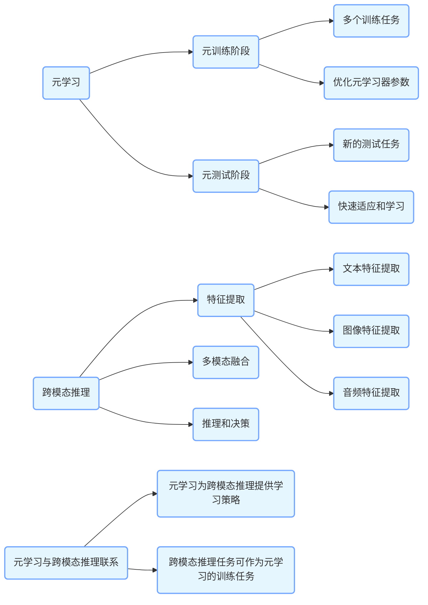

# 元学习在跨模态推理任务中的效果研究

> 关键词：元学习、跨模态推理、效果研究、机器学习、人工智能

> 摘要：本文聚焦于元学习在跨模态推理任务中的效果研究。首先介绍了研究的背景信息，包括目的、预期读者、文档结构和相关术语。接着阐述了元学习和跨模态推理的核心概念及其联系，并给出了相应的文本示意图和Mermaid流程图。详细讲解了核心算法原理，通过Python代码进行了具体实现，同时给出了相关的数学模型和公式，并举例说明。在项目实战部分，搭建了开发环境，给出了源代码的详细实现和解读。探讨了元学习在跨模态推理任务中的实际应用场景，推荐了相关的学习资源、开发工具框架和论文著作。最后总结了未来发展趋势与挑战，解答了常见问题，并提供了扩展阅读和参考资料。

## 1. 背景介绍 
### 1.1 目的和范围
本研究的目的是深入探究元学习在跨模态推理任务中的效果。跨模态推理任务涉及到处理不同模态的数据，如文本、图像、音频等，并从中进行推理和决策。元学习作为一种能够快速学习新知识的方法，有望在跨模态推理任务中发挥重要作用。本研究将涵盖元学习的基本原理、跨模态推理的任务特点，以及如何将元学习应用到跨模态推理中，并评估其效果。

### 1.2 预期读者
本文预期读者包括人工智能、机器学习领域的研究人员、工程师，以及对元学习和跨模态推理感兴趣的学生。这些读者应具备一定的机器学习和编程基础，熟悉基本的深度学习概念和算法。

### 1.3 文档结构概述
本文将按照以下结构进行组织：首先介绍相关的核心概念和联系，包括元学习和跨模态推理的原理和架构；接着详细讲解核心算法原理和具体操作步骤，并给出Python代码实现；然后阐述相关的数学模型和公式，并举例说明；在项目实战部分，搭建开发环境，给出源代码的详细实现和解读；探讨元学习在跨模态推理任务中的实际应用场景；推荐相关的学习资源、开发工具框架和论文著作；最后总结未来发展趋势与挑战，解答常见问题，并提供扩展阅读和参考资料。

### 1.4 术语表
#### 1.4.1 核心术语定义
- **元学习（Meta-learning）**：也称为“学习如何学习”，是一种让模型能够从多个学习任务中快速学习新知识的方法。元学习的目标是学习一个通用的学习策略，使得模型能够在新的任务上快速适应和学习。
- **跨模态推理（Cross-modal reasoning）**：指的是在不同模态的数据之间进行推理和决策的任务。例如，根据图像和文本信息进行联合推理，或者从音频和视频数据中提取有价值的信息。
- **模态（Modality）**：表示数据的不同形式，如文本、图像、音频、视频等。不同模态的数据具有不同的特征和表示方式。

#### 1.4.2 相关概念解释
- **少样本学习（Few-shot learning）**：是元学习中的一个重要应用场景，指的是在只有少量样本的情况下进行学习和分类。元学习可以帮助模型在少样本情况下快速学习和泛化。
- **多模态融合（Multi-modal fusion）**：是跨模态推理中的一个关键步骤，指的是将不同模态的数据进行融合，以获取更全面和准确的信息。

#### 1.4.3 缩略词列表
- **ML（Machine Learning）**：机器学习
- **DL（Deep Learning）**：深度学习
- **MAML（Model-Agnostic Meta-Learning）**：模型无关元学习

## 2. 核心概念与联系 

### 元学习原理
元学习的核心思想是通过在多个任务上进行训练，学习一个通用的学习策略，使得模型能够在新的任务上快速适应和学习。元学习通常分为两个阶段：元训练阶段和元测试阶段。在元训练阶段，模型在多个训练任务上进行学习，优化元学习器的参数；在元测试阶段，模型在新的测试任务上进行快速适应和学习。

### 跨模态推理原理
跨模态推理的目标是在不同模态的数据之间进行推理和决策。通常需要进行以下步骤：首先，对不同模态的数据进行特征提取，将其转换为低维的特征表示；然后，进行多模态融合，将不同模态的特征进行融合；最后，利用融合后的特征进行推理和决策。

### 核心概念联系
元学习可以为跨模态推理提供有效的学习策略，帮助模型在不同模态的数据上快速学习和适应。例如，在少样本的跨模态推理任务中，元学习可以帮助模型利用先前的学习经验，快速学习新的跨模态推理任务。

### 文本示意图
```plaintext
元学习
|-- 元训练阶段
|   |-- 多个训练任务
|   |-- 优化元学习器参数
|-- 元测试阶段
|   |-- 新的测试任务
|   |-- 快速适应和学习

跨模态推理
|-- 特征提取
|   |-- 文本特征提取
|   |-- 图像特征提取
|   |-- 音频特征提取
|-- 多模态融合
|-- 推理和决策

元学习与跨模态推理联系
|-- 元学习为跨模态推理提供学习策略
|-- 跨模态推理任务可作为元学习的训练任务
```

### Mermaid流程图


## 3. 核心算法原理 & 具体操作步骤 

### 核心算法原理：模型无关元学习（MAML）
模型无关元学习（MAML）是一种经典的元学习算法，其核心思想是通过在多个任务上进行训练，学习一个初始化参数，使得模型在新的任务上能够通过少量的梯度更新快速收敛。

### 具体操作步骤
1. **元训练阶段**
    - 随机采样一批训练任务。
    - 对于每个训练任务，使用当前的元学习器参数进行前向传播，计算损失函数。
    - 对损失函数进行一次梯度更新，得到新的参数。
    - 使用新的参数在该任务上进行前向传播，计算新的损失函数。
    - 对所有任务的新损失函数进行求和，得到元损失函数。
    - 使用元损失函数对元学习器的参数进行更新。

2. **元测试阶段**
    - 给定一个新的测试任务。
    - 使用元学习器的参数进行前向传播，计算损失函数。
    - 对损失函数进行少量的梯度更新，得到适应后的参数。
    - 使用适应后的参数进行推理和决策。

### Python源代码实现
```python
import torch
import torch.nn as nn
import torch.optim as optim

# 定义一个简单的神经网络模型
class SimpleModel(nn.Module):
    def __init__(self, input_size, hidden_size, output_size):
        super(SimpleModel, self).__init__()
        self.fc1 = nn.Linear(input_size, hidden_size)
        self.relu = nn.ReLU()
        self.fc2 = nn.Linear(hidden_size, output_size)

    def forward(self, x):
        out = self.fc1(x)
        out = self.relu(out)
        out = self.fc2(out)
        return out

# 元训练函数
def meta_train(model, meta_optimizer, tasks, inner_lr, num_inner_steps):
    meta_loss = 0
    for task in tasks:
        # 复制模型参数
        fast_weights = list(model.parameters())
        # 内循环更新
        for _ in range(num_inner_steps):
            inputs, labels = task
            logits = model.forward(inputs)
            loss = nn.CrossEntropyLoss()(logits, labels)
            grads = torch.autograd.grad(loss, fast_weights)
            fast_weights = [w - inner_lr * g for w, g in zip(fast_weights, grads)]
        # 计算元损失
        inputs, labels = task
        logits = model.forward(inputs)
        meta_loss += nn.CrossEntropyLoss()(logits, labels)
    # 元更新
    meta_optimizer.zero_grad()
    meta_loss.backward()
    meta_optimizer.step()
    return meta_loss.item()

# 元测试函数
def meta_test(model, test_task, inner_lr, num_inner_steps):
    fast_weights = list(model.parameters())
    # 内循环更新
    for _ in range(num_inner_steps):
        inputs, labels = test_task
        logits = model.forward(inputs)
        loss = nn.CrossEntropyLoss()(logits, labels)
        grads = torch.autograd.grad(loss, fast_weights)
        fast_weights = [w - inner_lr * g for w, g in zip(fast_weights, grads)]
    # 测试
    inputs, labels = test_task
    logits = model.forward(inputs)
    predictions = torch.argmax(logits, dim=1)
    accuracy = (predictions == labels).float().mean().item()
    return accuracy

# 示例使用
input_size = 10
hidden_size = 20
output_size = 5
model = SimpleModel(input_size, hidden_size, output_size)
meta_optimizer = optim.Adam(model.parameters(), lr=0.001)
tasks = [(torch.randn(32, input_size), torch.randint(0, output_size, (32,))) for _ in range(10)]
test_task = (torch.randn(32, input_size), torch.randint(0, output_size, (32,)))
inner_lr = 0.01
num_inner_steps = 5

# 元训练
for epoch in range(100):
    meta_loss = meta_train(model, meta_optimizer, tasks, inner_lr, num_inner_steps)
    print(f'Epoch {epoch}: Meta Loss = {meta_loss}')

# 元测试
accuracy = meta_test(model, test_task, inner_lr, num_inner_steps)
print(f'Test Accuracy = {accuracy}')
```

## 4. 数学模型和公式 & 详细讲解 & 举例说明 

### 元学习的数学模型
设 $\mathcal{T} = \{T_1, T_2, \cdots, T_N\}$ 是一组训练任务，每个任务 $T_i$ 由输入数据 $X_i$ 和标签 $Y_i$ 组成。元学习的目标是学习一个初始化参数 $\theta$，使得模型在新的任务上能够通过少量的梯度更新快速收敛。

### 模型无关元学习（MAML）的数学公式
在元训练阶段，对于每个任务 $T_i$，首先使用当前的元学习器参数 $\theta$ 进行前向传播，计算损失函数 $L_{T_i}(\theta)$。然后对损失函数进行一次梯度更新，得到新的参数 $\theta_i'$：
$$\theta_i' = \theta - \alpha \nabla_{\theta} L_{T_i}(\theta)$$
其中 $\alpha$ 是内循环的学习率。

接着使用新的参数 $\theta_i'$ 在该任务上进行前向传播，计算新的损失函数 $L_{T_i}(\theta_i')$。最后对所有任务的新损失函数进行求和，得到元损失函数 $\mathcal{L}(\theta)$：
$$\mathcal{L}(\theta) = \sum_{i=1}^{N} L_{T_i}(\theta_i')$$

使用元损失函数对元学习器的参数 $\theta$ 进行更新：
$$\theta \leftarrow \theta - \beta \nabla_{\theta} \mathcal{L}(\theta)$$
其中 $\beta$ 是元学习率。

### 详细讲解
在元训练阶段，我们的目标是找到一个初始化参数 $\theta$，使得模型在新的任务上能够通过少量的梯度更新快速收敛。为了实现这个目标，我们在每个训练任务上进行一次梯度更新，得到新的参数 $\theta_i'$。然后使用新的参数 $\theta_i'$ 计算新的损失函数 $L_{T_i}(\theta_i')$，并将所有任务的新损失函数求和得到元损失函数 $\mathcal{L}(\theta)$。最后使用元损失函数对元学习器的参数 $\theta$ 进行更新。

### 举例说明
假设我们有两个训练任务 $T_1$ 和 $T_2$，每个任务有 10 个样本。模型的输入维度是 10，输出维度是 2。当前的元学习器参数 $\theta$ 是一个随机初始化的参数。

对于任务 $T_1$，我们使用当前的参数 $\theta$ 进行前向传播，计算损失函数 $L_{T_1}(\theta)$。然后对损失函数进行一次梯度更新，得到新的参数 $\theta_1'$。

对于任务 $T_2$，我们同样使用当前的参数 $\theta$ 进行前向传播，计算损失函数 $L_{T_2}(\theta)$。然后对损失函数进行一次梯度更新，得到新的参数 $\theta_2'$。

最后，我们计算新的损失函数 $L_{T_1}(\theta_1')$ 和 $L_{T_2}(\theta_2')$，并将它们求和得到元损失函数 $\mathcal{L}(\theta)$。使用元损失函数对元学习器的参数 $\theta$ 进行更新。

## 5. 项目实战：代码实际案例和详细解释说明 

### 5.1  开发环境搭建
- **操作系统**：推荐使用 Ubuntu 18.04 或更高版本，或者 Windows 10。
- **Python 版本**：推荐使用 Python 3.7 或更高版本。
- **深度学习框架**：使用 PyTorch 1.7 或更高版本。可以使用以下命令安装 PyTorch：
```bash
pip install torch torchvision
```
- **其他依赖库**：安装 numpy、matplotlib 等常用库：
```bash
pip install numpy matplotlib
```

### 5.2  源代码详细实现和代码解读
```python
import torch
import torch.nn as nn
import torch.optim as optim
import numpy as np
import matplotlib.pyplot as plt

# 定义一个简单的跨模态神经网络模型
class CrossModalModel(nn.Module):
    def __init__(self, text_input_size, image_input_size, hidden_size, output_size):
        super(CrossModalModel, self).__init__()
        # 文本特征提取层
        self.text_fc1 = nn.Linear(text_input_size, hidden_size)
        # 图像特征提取层
        self.image_fc1 = nn.Linear(image_input_size, hidden_size)
        self.relu = nn.ReLU()
        # 融合层
        self.fc2 = nn.Linear(2 * hidden_size, hidden_size)
        # 输出层
        self.fc3 = nn.Linear(hidden_size, output_size)

    def forward(self, text_input, image_input):
        # 文本特征提取
        text_out = self.text_fc1(text_input)
        text_out = self.relu(text_out)
        # 图像特征提取
        image_out = self.image_fc1(image_input)
        image_out = self.relu(image_out)
        # 多模态融合
        combined = torch.cat((text_out, image_out), dim=1)
        combined_out = self.fc2(combined)
        combined_out = self.relu(combined_out)
        # 输出
        out = self.fc3(combined_out)
        return out

# 元训练函数
def meta_train(model, meta_optimizer, tasks, inner_lr, num_inner_steps):
    meta_loss = 0
    for task in tasks:
        text_inputs, image_inputs, labels = task
        # 复制模型参数
        fast_weights = list(model.parameters())
        # 内循环更新
        for _ in range(num_inner_steps):
            logits = model.forward(text_inputs, image_inputs)
            loss = nn.CrossEntropyLoss()(logits, labels)
            grads = torch.autograd.grad(loss, fast_weights)
            fast_weights = [w - inner_lr * g for w, g in zip(fast_weights, grads)]
        # 计算元损失
        logits = model.forward(text_inputs, image_inputs)
        meta_loss += nn.CrossEntropyLoss()(logits, labels)
    # 元更新
    meta_optimizer.zero_grad()
    meta_loss.backward()
    meta_optimizer.step()
    return meta_loss.item()

# 元测试函数
def meta_test(model, test_task, inner_lr, num_inner_steps):
    text_inputs, image_inputs, labels = test_task
    fast_weights = list(model.parameters())
    # 内循环更新
    for _ in range(num_inner_steps):
        logits = model.forward(text_inputs, image_inputs)
        loss = nn.CrossEntropyLoss()(logits, labels)
        grads = torch.autograd.grad(loss, fast_weights)
        fast_weights = [w - inner_lr * g for w, g in zip(fast_weights, grads)]
    # 测试
    logits = model.forward(text_inputs, image_inputs)
    predictions = torch.argmax(logits, dim=1)
    accuracy = (predictions == labels).float().mean().item()
    return accuracy

# 生成示例数据
text_input_size = 20
image_input_size = 30
hidden_size = 50
output_size = 5
num_tasks = 10
num_samples_per_task = 32

tasks = []
for _ in range(num_tasks):
    text_inputs = torch.randn(num_samples_per_task, text_input_size)
    image_inputs = torch.randn(num_samples_per_task, image_input_size)
    labels = torch.randint(0, output_size, (num_samples_per_task,))
    tasks.append((text_inputs, image_inputs, labels))

test_task = (torch.randn(num_samples_per_task, text_input_size),
             torch.randn(num_samples_per_task, image_input_size),
             torch.randint(0, output_size, (num_samples_per_task,)))

# 初始化模型和优化器
model = CrossModalModel(text_input_size, image_input_size, hidden_size, output_size)
meta_optimizer = optim.Adam(model.parameters(), lr=0.001)
inner_lr = 0.01
num_inner_steps = 5

# 元训练
meta_losses = []
for epoch in range(100):
    meta_loss = meta_train(model, meta_optimizer, tasks, inner_lr, num_inner_steps)
    meta_losses.append(meta_loss)
    print(f'Epoch {epoch}: Meta Loss = {meta_loss}')

# 绘制元损失曲线
plt.plot(meta_losses)
plt.xlabel('Epoch')
plt.ylabel('Meta Loss')
plt.title('Meta Training Loss')
plt.show()

# 元测试
accuracy = meta_test(model, test_task, inner_lr, num_inner_steps)
print(f'Test Accuracy = {accuracy}')
```

### 5.3  代码解读与分析
- **模型定义**：`CrossModalModel` 类定义了一个简单的跨模态神经网络模型。该模型包含文本特征提取层、图像特征提取层、融合层和输出层。
- **元训练函数**：`meta_train` 函数实现了元训练的过程。在每个训练任务上进行一次梯度更新，得到新的参数，然后计算元损失并更新元学习器的参数。
- **元测试函数**：`meta_test` 函数实现了元测试的过程。在新的测试任务上进行少量的梯度更新，然后进行推理和决策，计算准确率。
- **数据生成**：生成了示例的训练任务和测试任务，每个任务包含文本输入、图像输入和标签。
- **训练和测试**：进行元训练和元测试，并绘制元损失曲线。

## 6. 实际应用场景 
### 智能问答系统
在智能问答系统中，用户可能会以文本、图像或语音的形式提出问题。元学习可以帮助系统在不同模态的数据上快速学习和适应，提高问答的准确性和效率。例如，当系统遇到一个新的领域或问题类型时，元学习可以利用先前的学习经验，快速调整模型的参数，以更好地回答用户的问题。

### 图像和文本联合检索
在图像和文本联合检索任务中，用户可能会输入文本描述来检索相关的图像，或者上传图像来检索相关的文本信息。元学习可以帮助模型在不同模态的数据上进行快速学习和推理，提高检索的准确性和召回率。例如，通过元学习，模型可以学习到不同模态数据之间的关联，从而更好地理解用户的查询意图。

### 多模态情感分析
在多模态情感分析任务中，需要综合考虑文本、语音和面部表情等多种模态的数据来判断用户的情感状态。元学习可以帮助模型在不同模态的数据上进行快速学习和融合，提高情感分析的准确性。例如，当遇到新的情感类型或数据集时，元学习可以帮助模型快速适应，提高模型的泛化能力。

### 自动驾驶
在自动驾驶系统中，需要处理来自摄像头、雷达、激光雷达等多种传感器的数据。元学习可以帮助系统在不同模态的数据上进行快速学习和推理，提高自动驾驶的安全性和可靠性。例如，当遇到新的路况或场景时，元学习可以帮助系统快速调整模型的参数，以更好地应对各种情况。

## 7. 工具和资源推荐
### 7.1 学习资源推荐
#### 7.1.1 书籍推荐
- 《深度学习》（Deep Learning）：由 Ian Goodfellow、Yoshua Bengio 和 Aaron Courville 编写，是深度学习领域的经典教材，涵盖了深度学习的基本概念、算法和应用。
- 《机器学习》（Machine Learning: A Probabilistic Perspective）：由 Kevin P. Murphy 编写，从概率的角度介绍了机器学习的基本概念和算法，对理解元学习的理论基础有很大帮助。
- 《人工智能：一种现代的方法》（Artificial Intelligence: A Modern Approach）：由 Stuart Russell 和 Peter Norvig 编写，是人工智能领域的经典教材，涵盖了人工智能的各个方面，包括机器学习、自然语言处理、计算机视觉等。

#### 7.1.2 在线课程
- Coursera 上的“深度学习专项课程”（Deep Learning Specialization）：由 Andrew Ng 教授讲授，包括深度学习的基础、卷积神经网络、循环神经网络等内容，是学习深度学习的优质课程。
- edX 上的“人工智能导论”（Introduction to Artificial Intelligence）：由 MIT 教授讲授，介绍了人工智能的基本概念、算法和应用，对理解元学习和跨模态推理的背景有很大帮助。
- Kaggle 上的“机器学习微课程”（Machine Learning Micro-Course）：提供了机器学习的基础知识和实践经验，适合初学者快速入门。

#### 7.1.3 技术博客和网站
- Medium 上的 Towards Data Science：是一个专注于数据科学和机器学习的技术博客，提供了很多关于元学习和跨模态推理的最新研究成果和实践经验。
- arXiv.org：是一个预印本平台，提供了很多关于人工智能和机器学习的最新研究论文，可以及时了解元学习和跨模态推理的最新进展。
- OpenAI 的官方博客：OpenAI 是人工智能领域的领先研究机构，其官方博客提供了很多关于人工智能的前沿研究和应用案例。

### 7.2 开发工具框架推荐
#### 7.2.1 IDE和编辑器
- PyCharm：是一款专门为 Python 开发设计的集成开发环境（IDE），提供了丰富的代码编辑、调试和项目管理功能，适合开发元学习和跨模态推理项目。
- Jupyter Notebook：是一个交互式的开发环境，适合进行数据探索、模型训练和结果可视化，在机器学习和深度学习领域广泛使用。
- Visual Studio Code：是一款轻量级的代码编辑器，支持多种编程语言和插件，提供了丰富的代码编辑和调试功能，也可以用于开发元学习和跨模态推理项目。

#### 7.2.2 调试和性能分析工具
- PyTorch Profiler：是 PyTorch 提供的性能分析工具，可以帮助开发者分析模型的运行时间、内存使用等情况，优化模型的性能。
- TensorBoard：是 TensorFlow 提供的可视化工具，也可以与 PyTorch 集成，用于可视化模型的训练过程、损失曲线、准确率等信息。
- NVIDIA Nsight Systems：是 NVIDIA 提供的性能分析工具，适合分析 GPU 加速的深度学习模型的性能，帮助开发者优化模型的 GPU 利用率。

#### 7.2.3 相关框架和库
- PyTorch：是一个开源的深度学习框架，提供了丰富的神经网络层、优化器和工具，支持元学习和跨模态推理的开发。
- TensorFlow：是另一个广泛使用的深度学习框架，也提供了丰富的功能和工具，适合开发元学习和跨模态推理项目。
- Hugging Face Transformers：是一个用于自然语言处理的开源库，提供了很多预训练的语言模型，如 BERT、GPT 等，可以用于跨模态推理中的文本处理任务。

### 7.3 相关论文著作推荐
#### 7.3.1 经典论文
- "Model-Agnostic Meta-Learning for Fast Adaptation of Deep Networks"：介绍了模型无关元学习（MAML）算法，是元学习领域的经典论文。
- "Learning to Compare: Relation Network for Few-Shot Learning"：提出了关系网络（Relation Network）用于少样本学习，为跨模态推理中的少样本问题提供了一种解决方案。
- "Multimodal Deep Learning"：综述了多模态深度学习的研究进展，介绍了多模态数据的融合方法和应用场景。

#### 7.3.2 最新研究成果
- 关注 arXiv.org 上关于元学习和跨模态推理的最新论文，了解该领域的最新研究动态。
- 参加国际人工智能和机器学习会议，如 NeurIPS、ICML、CVPR 等，获取最新的研究成果和技术趋势。

#### 7.3.3 应用案例分析
- 研究一些实际应用中的元学习和跨模态推理案例，了解如何将理论方法应用到实际问题中。例如，分析一些智能问答系统、图像和文本联合检索系统的实现原理和技术细节。

## 8. 总结：未来发展趋势与挑战
### 未来发展趋势
- **多模态融合技术的进一步发展**：未来的研究将致力于开发更有效的多模态融合技术，以更好地整合不同模态的数据，提高跨模态推理的性能。例如，探索基于注意力机制的多模态融合方法，能够更加灵活地处理不同模态数据之间的关系。
- **元学习算法的不断优化**：随着研究的深入，元学习算法将不断优化，提高模型的学习效率和泛化能力。例如，开发更高效的元学习优化器，能够更快地收敛到最优解。
- **跨模态推理在更多领域的应用**：元学习在跨模态推理任务中的应用将扩展到更多领域，如医疗、金融、交通等。例如，在医疗领域，利用跨模态推理技术可以综合分析医学图像、病历文本等多模态数据，辅助医生进行疾病诊断。
- **与其他技术的融合**：元学习和跨模态推理将与其他技术，如强化学习、迁移学习等进行融合，以解决更复杂的问题。例如，结合强化学习和元学习，使模型能够在动态环境中进行跨模态推理和决策。

### 挑战
- **数据获取和标注的困难**：跨模态推理任务需要大量的多模态数据，而这些数据的获取和标注往往比较困难。例如，获取高质量的图像和文本配对数据需要耗费大量的人力和物力。
- **计算资源的需求**：元学习和跨模态推理通常需要大量的计算资源，特别是在处理大规模数据集和复杂模型时。这对硬件设备和计算平台提出了很高的要求。
- **模型可解释性的问题**：元学习和跨模态推理模型往往比较复杂，其决策过程难以解释。这在一些对可解释性要求较高的领域，如医疗、金融等，可能会限制其应用。
- **不同模态数据的异质性**：不同模态的数据具有不同的特征和表示方式，如何有效地处理这些异质性是一个挑战。例如，文本数据是离散的，而图像数据是连续的，需要开发合适的方法来进行特征提取和融合。

## 9. 附录：常见问题与解答
### 问题1：元学习和传统机器学习有什么区别？
元学习的目标是学习一个通用的学习策略，使得模型能够在新的任务上快速适应和学习。而传统机器学习通常是在一个固定的数据集上进行训练，模型的泛化能力主要依赖于训练数据的质量和数量。元学习通过在多个任务上进行训练，能够更好地利用先前的学习经验，提高模型在新任务上的学习效率和泛化能力。

### 问题2：跨模态推理中如何进行多模态融合？
常见的多模态融合方法包括早期融合、晚期融合和中间融合。早期融合是在特征提取之前将不同模态的数据进行融合；晚期融合是在特征提取之后将不同模态的特征进行融合；中间融合是在特征提取的过程中进行融合。此外，还可以使用注意力机制、深度学习模型等方法来进行多模态融合，以更好地处理不同模态数据之间的关系。

### 问题3：元学习在跨模态推理中的效果如何评估？
可以使用准确率、召回率、F1 值等指标来评估元学习在跨模态推理中的分类效果。对于回归任务，可以使用均方误差（MSE）、平均绝对误差（MAE）等指标。此外，还可以通过比较不同元学习算法在相同数据集上的性能，以及与传统机器学习算法的对比，来评估元学习的效果。

### 问题4：如何选择合适的元学习算法？
选择合适的元学习算法需要考虑任务的特点、数据的规模和分布、计算资源等因素。例如，对于少样本学习任务，模型无关元学习（MAML）是一个不错的选择；对于具有特定结构的任务，可以选择基于模型结构的元学习算法。此外，还可以通过实验比较不同算法的性能，选择最适合的算法。

## 10. 扩展阅读 & 参考资料
### 扩展阅读
- 《深度学习进阶：算法与应用》：进一步深入介绍了深度学习的算法和应用，包括元学习和跨模态推理的相关内容。
- 《多模态机器学习：基础与应用》：系统介绍了多模态机器学习的基本概念、算法和应用，对理解跨模态推理有很大帮助。
- 《元学习：理论与实践》：详细介绍了元学习的理论和实践方法，包括元学习的算法、应用场景和评估指标等。

### 参考资料
- Goodfellow, I., Bengio, Y., & Courville, A. (2016). Deep Learning. MIT Press.
- Murphy, K. P. (2012). Machine Learning: A Probabilistic Perspective. MIT Press.
- Russell, S., & Norvig, P. (2009). Artificial Intelligence: A Modern Approach. Pearson Education.
- Finn, C., Abbeel, P., & Levine, S. (2017). Model-Agnostic Meta-Learning for Fast Adaptation of Deep Networks. Proceedings of the 34th International Conference on Machine Learning-Volume 70.
- Sung, F., Yang, Y., Zhang, L., Xiang, T., Torr, P. H., & Hospedales, T. M. (2018). Learning to Compare: Relation Network for Few-Shot Learning. Proceedings of the IEEE Conference on Computer Vision and Pattern Recognition.
- Baltrušaitis, T., Ahuja, C., & Morency, L.-P. (2018). Multimodal Deep Learning. Proceedings of the IEEE.

作者：AI天才研究院/AI Genius Institute & 禅与计算机程序设计艺术 /Zen And The Art of Computer Programming