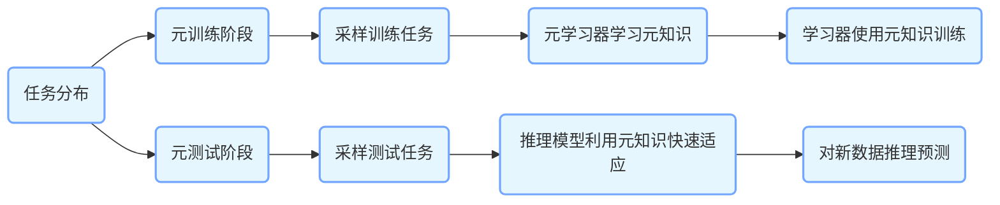

# 元学习框架下推理模型的快速适应

> 关键词：元学习、推理模型、快速适应、少样本学习、模型泛化

> 摘要：本文聚焦于元学习框架下推理模型的快速适应问题。在当今复杂多变的现实场景中，传统机器学习模型往往需要大量数据和长时间训练才能适应新任务，而元学习为解决这一难题提供了有效途径。文章首先介绍了元学习及推理模型快速适应的背景，接着深入探讨核心概念及其联系，详细阐述核心算法原理与操作步骤，结合数学模型和公式进行理论分析，通过项目实战案例展示具体实现过程，列举实际应用场景，推荐相关工具和资源，最后对未来发展趋势与挑战进行总结，并提供常见问题解答和扩展阅读参考资料，旨在帮助读者全面理解和掌握元学习框架下推理模型快速适应的相关知识和技术。

## 1. 背景介绍 

### 1.1 目的和范围
传统的机器学习模型在面对新的任务或环境时，通常需要大量的标注数据进行重新训练，这不仅耗费大量的时间和计算资源，而且在一些数据稀缺的场景下难以实现。元学习（Meta - learning），也被称为“学习如何学习”，旨在让模型能够从过往的学习经验中快速学习新任务，减少对大量数据的依赖，实现推理模型的快速适应。本文的目的在于深入探讨元学习框架下推理模型快速适应的原理、算法、实现方法以及应用场景，为相关领域的研究和实践提供全面的指导。范围涵盖元学习的基本概念、核心算法、数学模型、实际项目案例以及未来发展趋势等方面。

### 1.2 预期读者
本文预期读者包括对人工智能、机器学习、元学习等领域感兴趣的研究人员、开发者、学生以及相关从业人员。无论是希望深入了解元学习理论的学术研究者，还是致力于将元学习技术应用到实际项目中的开发者，都能从本文中获取有价值的信息和技术指导。

### 1.3 文档结构概述
本文将按照以下结构展开：首先介绍元学习及推理模型快速适应的相关背景知识，包括目的、预期读者和文档结构等；接着阐述核心概念及其联系，通过文本示意图和 Mermaid 流程图进行直观展示；然后详细讲解核心算法原理和具体操作步骤，并使用 Python 源代码进行说明；之后介绍数学模型和公式，并举例说明；再通过项目实战案例，包括开发环境搭建、源代码实现和解读等方面，深入分析如何实现推理模型的快速适应；随后列举实际应用场景；推荐相关的学习资源、开发工具框架和论文著作；最后对未来发展趋势与挑战进行总结，提供常见问题解答和扩展阅读参考资料。

### 1.4 术语表

#### 1.4.1 核心术语定义
- **元学习（Meta - learning）**：一种让模型学习如何学习的技术，通过在多个任务上进行训练，使模型能够快速适应新的任务。
- **推理模型（Inference model）**：用于对新数据进行预测或决策的模型。
- **快速适应（Fast adaptation）**：模型在面对新任务时，能够在少量数据和短时间内进行有效学习和调整，以达到较好的性能。
- **少样本学习（Few - shot learning）**：在仅有少量标注样本的情况下进行学习的任务，是元学习的一个重要应用场景。
- **元训练（Meta - training）**：在元学习中，使用多个训练任务来训练元学习器的过程。
- **元测试（Meta - testing）**：在元学习中，使用新的测试任务来评估元学习器快速适应能力的过程。

#### 1.4.2 相关概念解释
- **学习器（Learner）**：在元学习中，学习器是具体执行学习任务的模型。在元训练过程中，学习器根据元学习器提供的信息进行任务学习；在元测试时，学习器需要快速适应新任务。
- **元学习器（Meta - learner）**：负责学习如何调整学习器的参数或优化策略，以使其能够快速适应新任务。元学习器通过在多个任务上的训练，学习到通用的学习模式和知识。
- **任务分布（Task distribution）**：表示所有可能任务的概率分布。元学习的目标是在这个任务分布上学习到通用的学习能力，以便能够快速适应从该分布中采样得到的新任务。

#### 1.4.3 缩略词列表
- **MAML（Model - Agnostic Meta - Learning）**：模型无关元学习，是一种经典的元学习算法。
- **FOMAML（First - Order Model - Agnostic Meta - Learning）**：一阶模型无关元学习，是 MAML 的简化版本。
- **ProtoNet（Prototypical Networks）**：原型网络，一种用于少样本学习的元学习模型。

## 2. 核心概念与联系 

### 核心概念原理
元学习的核心思想是通过在多个任务上进行学习，让模型学会如何快速适应新任务。传统的机器学习模型通常是针对单一任务进行训练，而元学习则考虑了任务之间的共性和差异，旨在学习到一种通用的学习能力。

在元学习框架下，推理模型的快速适应主要基于以下原理：
- **元知识的学习**：元学习器在元训练阶段，通过对多个训练任务的学习，提取出任务之间的通用模式和特征，这些通用信息被称为元知识。元知识可以是模型的初始化参数、优化策略、学习率等。
- **快速调整**：当遇到新的测试任务时，推理模型可以利用元知识，在少量数据上进行快速的参数调整或模型更新，以适应新任务的需求。这种快速调整的能力使得模型能够在少样本的情况下仍然取得较好的性能。

### 架构的文本示意图
以下是元学习框架下推理模型快速适应的架构示意图：

元学习系统主要由元学习器和学习器组成。在元训练阶段，从任务分布中采样多个训练任务，每个训练任务包含训练数据和标签。元学习器根据这些训练任务，学习到元知识，并将其传递给学习器。学习器使用元知识对每个训练任务进行学习和训练。

在元测试阶段，从任务分布中采样新的测试任务。推理模型（即学习器）利用之前学习到的元知识，在测试任务的少量数据上进行快速适应和调整，最终对新数据进行推理和预测。

### Mermaid 流程图


这个流程图清晰地展示了元学习框架下推理模型快速适应的过程，从任务分布中采样训练任务和测试任务，分别进行元训练和元测试，最终实现对新数据的推理预测。

## 3. 核心算法原理 & 具体操作步骤 

### 模型无关元学习（MAML）算法原理
MAML 是一种经典的元学习算法，其核心思想是找到一个通用的模型初始化参数，使得模型在经过少量的梯度更新后，能够在新任务上取得较好的性能。

#### 算法原理详细阐述
假设我们有一个任务分布 $\mathcal{T}$，从该分布中采样 $N$ 个训练任务 $\{T_1, T_2, \cdots, T_N\}$。对于每个任务 $T_i$，有训练数据 $D_{train}^i$ 和测试数据 $D_{test}^i$。

MAML 的目标是找到一个初始化参数 $\theta$，使得在每个任务 $T_i$ 上，经过一次或多次梯度更新后的参数 $\theta_i'$ 能够在该任务的测试数据上取得最小的损失。

具体来说，对于每个任务 $T_i$，我们首先使用训练数据 $D_{train}^i$ 对模型进行一次或多次梯度更新，得到更新后的参数 $\theta_i'$：

$\theta_i' = \theta - \alpha \nabla_{\theta} \mathcal{L}(f_{\theta}, D_{train}^i)$

其中，$\alpha$ 是内部学习率，$\mathcal{L}(f_{\theta}, D_{train}^i)$ 是模型 $f_{\theta}$ 在任务 $T_i$ 的训练数据上的损失函数。

然后，我们计算更新后的参数 $\theta_i'$ 在任务 $T_i$ 的测试数据上的损失 $\mathcal{L}(f_{\theta_i'}, D_{test}^i)$。MAML 的目标是最小化所有任务的测试损失之和：

$\min_{\theta} \sum_{i = 1}^{N} \mathcal{L}(f_{\theta_i'}, D_{test}^i)$

#### Python 源代码实现
```python
import torch
import torch.nn as nn
import torch.optim as optim

# 定义一个简单的神经网络模型
class SimpleModel(nn.Module):
    def __init__(self):
        super(SimpleModel, self).__init__()
        self.fc1 = nn.Linear(10, 20)
        self.fc2 = nn.Linear(20, 1)

    def forward(self, x):
        x = torch.relu(self.fc1(x))
        x = self.fc2(x)
        return x

# 内部学习率
alpha = 0.01
# 外部学习率
beta = 0.001
# 任务数量
N = 5
# 训练轮数
epochs = 10

# 初始化模型参数
model = SimpleModel()
meta_optimizer = optim.Adam(model.parameters(), lr=beta)

for epoch in range(epochs):
    meta_loss = 0
    for i in range(N):
        # 模拟采样一个任务的训练数据和测试数据
        train_data = torch.randn(100, 10)
        train_labels = torch.randn(100, 1)
        test_data = torch.randn(20, 10)
        test_labels = torch.randn(20, 1)

        # 保存原始参数
        fast_weights = list(model.parameters())

        # 内部更新
        for _ in range(1):  # 一次梯度更新
            output = model(train_data)
            loss = nn.MSELoss()(output, train_labels)
            grads = torch.autograd.grad(loss, fast_weights)
            fast_weights = [w - alpha * g for w, g in zip(fast_weights, grads)]

        # 计算更新后参数在测试数据上的损失
        test_output = model.forward(test_data)
        test_loss = nn.MSELoss()(test_output, test_labels)
        meta_loss += test_loss

    # 元更新
    meta_optimizer.zero_grad()
    meta_loss.backward()
    meta_optimizer.step()

    print(f'Epoch {epoch + 1}, Meta Loss: {meta_loss.item()}')
```

### 具体操作步骤
1. **初始化模型参数**：随机初始化模型的参数 $\theta$。
2. **元训练循环**：
    - 从任务分布中采样 $N$ 个训练任务。
    - 对于每个训练任务 $T_i$：
        - 使用训练数据 $D_{train}^i$ 对模型进行一次或多次梯度更新，得到更新后的参数 $\theta_i'$。
        - 计算更新后的参数 $\theta_i'$ 在任务 $T_i$ 的测试数据上的损失 $\mathcal{L}(f_{\theta_i'}, D_{test}^i)$。
    - 计算所有任务的测试损失之和作为元损失。
    - 使用元优化器（如 Adam）对元损失进行反向传播和参数更新。
3. **元测试阶段**：
    - 从任务分布中采样新的测试任务。
    - 使用学习到的初始化参数 $\theta$，在测试任务的少量数据上进行快速适应和调整。
    - 对新数据进行推理和预测。

## 4. 数学模型和公式 & 详细讲解 & 举例说明 

### MAML 数学模型和公式
#### 内部更新公式
在 MAML 中，对于每个任务 $T_i$，内部更新公式为：

$\theta_i' = \theta - \alpha \nabla_{\theta} \mathcal{L}(f_{\theta}, D_{train}^i)$

其中，$\theta$ 是模型的初始化参数，$\alpha$ 是内部学习率，$\nabla_{\theta} \mathcal{L}(f_{\theta}, D_{train}^i)$ 是模型 $f_{\theta}$ 在任务 $T_i$ 的训练数据上的损失函数关于参数 $\theta$ 的梯度。

#### 外部优化目标
MAML 的外部优化目标是最小化所有任务的测试损失之和：

$\min_{\theta} \sum_{i = 1}^{N} \mathcal{L}(f_{\theta_i'}, D_{test}^i)$

其中，$\theta_i'$ 是经过内部更新后的参数，$\mathcal{L}(f_{\theta_i'}, D_{test}^i)$ 是更新后的模型在任务 $T_i$ 的测试数据上的损失函数。

### 详细讲解
- **内部更新**：内部更新的目的是在每个任务的训练数据上对模型进行快速调整。通过一次或多次梯度更新，模型可以根据当前任务的特点对参数进行优化。内部学习率 $\alpha$ 控制了每次更新的步长，较小的 $\alpha$ 可以使模型更新更加稳定，但可能需要更多的更新步数；较大的 $\alpha$ 可以使模型快速适应任务，但可能会导致更新不稳定。
- **外部优化**：外部优化的目标是找到一个通用的初始化参数 $\theta$，使得模型在经过内部更新后，能够在各个任务的测试数据上取得较好的性能。通过最小化所有任务的测试损失之和，元学习器可以学习到任务之间的共性和通用模式。

### 举例说明
假设我们有一个简单的回归任务，输入是一个 10 维的向量，输出是一个标量。我们使用一个简单的两层神经网络作为模型，包含一个输入层、一个隐藏层和一个输出层。

我们有 5 个训练任务，每个任务有 100 个训练样本和 20 个测试样本。内部学习率 $\alpha = 0.01$，外部学习率 $\beta = 0.001$。

在元训练过程中，我们首先随机初始化模型的参数 $\theta$。对于每个训练任务，我们使用训练数据进行一次内部更新，得到更新后的参数 $\theta_i'$。然后计算 $\theta_i'$ 在测试数据上的损失 $\mathcal{L}(f_{\theta_i'}, D_{test}^i)$。最后，将所有任务的测试损失之和作为元损失，使用 Adam 优化器对元损失进行反向传播和参数更新。

经过多次元训练迭代后，模型学习到的初始化参数 $\theta$ 能够使模型在新的测试任务上快速适应，只需要在少量数据上进行几次梯度更新，就可以取得较好的回归性能。

## 5. 项目实战：代码实际案例和详细解释说明 

### 5.1 开发环境搭建
#### 操作系统
推荐使用 Linux 系统（如 Ubuntu 18.04 或更高版本），因为 Linux 系统在机器学习开发中具有良好的兼容性和稳定性。当然，Windows 和 macOS 系统也可以使用，但可能需要进行一些额外的配置。

#### 编程语言和版本
使用 Python 3.7 或更高版本。Python 是机器学习领域最常用的编程语言，具有丰富的库和工具。

#### 深度学习框架
使用 PyTorch 深度学习框架。PyTorch 提供了动态计算图和丰富的神经网络模块，非常适合元学习的开发。可以使用以下命令安装 PyTorch：
```bash
pip install torch torchvision
```

#### 其他依赖库
安装 numpy、matplotlib 等常用的科学计算和可视化库：
```bash
pip install numpy matplotlib
```

### 5.2 源代码详细实现和代码解读
#### 完整代码
```python
import torch
import torch.nn as nn
import torch.optim as optim
import numpy as np
import matplotlib.pyplot as plt

# 定义一个简单的神经网络模型
class SimpleModel(nn.Module):
    def __init__(self):
        super(SimpleModel, self).__init__()
        self.fc1 = nn.Linear(1, 10)
        self.fc2 = nn.Linear(10, 1)

    def forward(self, x):
        x = torch.relu(self.fc1(x))
        x = self.fc2(x)
        return x

# 生成任务数据
def generate_task():
    slope = np.random.uniform(-5, 5)
    intercept = np.random.uniform(-5, 5)
    train_x = torch.randn(10, 1)
    train_y = slope * train_x + intercept
    test_x = torch.randn(5, 1)
    test_y = slope * test_x + intercept
    return train_x, train_y, test_x, test_y

# 内部学习率
alpha = 0.01
# 外部学习率
beta = 0.001
# 任务数量
N = 10
# 训练轮数
epochs = 200

# 初始化模型参数
model = SimpleModel()
meta_optimizer = optim.Adam(model.parameters(), lr=beta)

meta_losses = []

for epoch in range(epochs):
    meta_loss = 0
    for i in range(N):
        train_x, train_y, test_x, test_y = generate_task()

        # 保存原始参数
        fast_weights = list(model.parameters())

        # 内部更新
        for _ in range(1):  # 一次梯度更新
            output = model(train_x)
            loss = nn.MSELoss()(output, train_y)
            grads = torch.autograd.grad(loss, fast_weights)
            fast_weights = [w - alpha * g for w, g in zip(fast_weights, grads)]

        # 计算更新后参数在测试数据上的损失
        test_output = model.forward(test_x)
        test_loss = nn.MSELoss()(test_output, test_y)
        meta_loss += test_loss

    # 元更新
    meta_optimizer.zero_grad()
    meta_loss.backward()
    meta_optimizer.step()

    meta_losses.append(meta_loss.item())
    if epoch % 10 == 0:
        print(f'Epoch {epoch}, Meta Loss: {meta_loss.item()}')

# 绘制元损失曲线
plt.plot(meta_losses)
plt.xlabel('Epoch')
plt.ylabel('Meta Loss')
plt.title('Meta Learning Loss Curve')
plt.show()

# 元测试阶段
test_train_x, test_train_y, test_test_x, test_test_y = generate_task()

# 保存原始参数
fast_weights = list(model.parameters())

# 内部更新
for _ in range(1):  # 一次梯度更新
    output = model(test_train_x)
    loss = nn.MSELoss()(output, test_train_y)
    grads = torch.autograd.grad(loss, fast_weights)
    fast_weights = [w - alpha * g for w, g in zip(fast_weights, grads)]

# 使用更新后的参数进行预测
test_output = model.forward(test_test_x)
test_loss = nn.MSELoss()(test_output, test_test_y)
print(f'Test Loss: {test_loss.item()}')
```

#### 代码解读
1. **模型定义**：定义了一个简单的两层神经网络 `SimpleModel`，包含一个输入层、一个隐藏层和一个输出层。输入维度为 1，输出维度为 1。
2. **任务数据生成**：`generate_task` 函数用于生成一个线性回归任务的数据，包括训练数据和测试数据。每个任务的斜率和截距是随机生成的。
3. **超参数设置**：设置内部学习率 $\alpha$、外部学习率 $\beta$、任务数量 $N$ 和训练轮数 `epochs`。
4. **元训练循环**：在每个训练轮次中，从任务分布中采样 $N$ 个任务，对每个任务进行内部更新，计算更新后参数在测试数据上的损失，将所有任务的测试损失之和作为元损失，使用元优化器进行反向传播和参数更新。
5. **元损失曲线绘制**：使用 `matplotlib` 库绘制元损失随训练轮次的变化曲线，以便观察元学习的训练过程。
6. **元测试阶段**：生成一个新的测试任务，使用学习到的初始化参数进行内部更新，然后计算更新后参数在测试数据上的损失，评估模型的快速适应能力。

### 5.3 代码解读与分析
#### 模型设计分析
使用简单的两层神经网络作为模型，适合处理简单的线性回归任务。在实际应用中，可以根据任务的复杂程度选择更复杂的模型，如卷积神经网络（CNN）、循环神经网络（RNN）等。

#### 内部更新分析
内部更新使用一次梯度更新，这是为了模拟在少样本情况下的快速适应。在实际应用中，可以根据任务的难度和数据量，增加内部更新的次数。

#### 元损失分析
元损失反映了模型在多个任务上的综合性能。随着训练轮次的增加，元损失逐渐下降，说明模型在不断学习任务之间的共性和通用模式，提高了快速适应新任务的能力。

#### 元测试结果分析
在元测试阶段，模型能够在少量数据上进行快速适应，取得较低的测试损失，说明元学习框架有效地提高了推理模型的快速适应能力。

## 6. 实际应用场景 
### 少样本图像分类
在图像分类任务中，标注大量的图像数据是非常耗时和昂贵的。元学习可以在少量标注样本的情况下，让模型快速适应新的图像类别。例如，在医学图像分类中，某些罕见疾病的图像样本数量非常有限，使用元学习可以利用已有的常见疾病图像数据学习到通用的特征和分类模式，从而在少量罕见疾病图像样本上进行快速分类。

### 自然语言处理中的文本分类
在文本分类任务中，不同的领域和主题可能需要不同的分类模型。元学习可以让模型从多个领域的文本数据中学习到通用的文本特征和分类策略，当遇到新的领域或主题时，能够在少量标注文本数据上快速适应，进行准确的文本分类。例如，在新闻文本分类中，不同类型的新闻（如政治、经济、体育等）可以看作不同的任务，元学习可以帮助模型快速适应新类型的新闻分类。

### 机器人的快速技能学习
在机器人领域，机器人需要学习各种不同的技能，如抓取、移动、导航等。每个技能的学习通常需要大量的试错和数据收集。元学习可以让机器人从过往的技能学习经验中学习到通用的学习模式，当需要学习新的技能时，能够在少量的训练数据和短时间内快速掌握。例如，机器人在学习抓取不同形状和材质的物体时，使用元学习可以快速适应新的物体特征，提高抓取的成功率。

### 个性化推荐系统
在个性化推荐系统中，每个用户的兴趣和偏好都不同，传统的推荐模型需要大量的用户数据来进行个性化推荐。元学习可以让推荐系统从多个用户的历史数据中学习到通用的推荐模式，当遇到新用户时，能够在少量的用户交互数据上快速调整推荐策略，为用户提供个性化的推荐服务。例如，在电商推荐系统中，新用户的购买行为数据较少，使用元学习可以根据已有用户的购买模式，快速为新用户推荐合适的商品。

## 7. 工具和资源推荐
### 7.1 学习资源推荐
#### 7.1.1 书籍推荐
- 《深度学习》（Deep Learning）：由 Ian Goodfellow、Yoshua Bengio 和 Aaron Courville 所著，是深度学习领域的经典教材，涵盖了深度学习的基本概念、算法和应用。
- 《元学习：理论与实践》（Meta - Learning: Theory and Practice）：专门介绍元学习的书籍，详细讲解了元学习的原理、算法和应用场景。
- 《机器学习》（Machine Learning）：由 Tom Mitchell 所著，是机器学习领域的经典入门书籍，对机器学习的基本概念和算法进行了系统的介绍。

#### 7.1.2 在线课程
- Coursera 上的“深度学习专项课程”（Deep Learning Specialization）：由 Andrew Ng 教授授课，涵盖了深度学习的各个方面，包括神经网络、卷积神经网络、循环神经网络等。
- edX 上的“元学习基础”（Foundations of Meta - Learning）：专门介绍元学习的在线课程，由元学习领域的专家授课，深入讲解了元学习的原理和算法。
- Udemy 上的“Python 机器学习实战”（Machine Learning A-Z™: Hands - On Python & R In Data Science）：通过实际案例介绍机器学习和深度学习的应用，适合初学者入门。

#### 7.1.3 技术博客和网站
- arXiv：一个预印本论文库，包含了最新的机器学习和元学习研究成果。可以在上面搜索相关的论文和研究报告。
- Medium：一个技术博客平台，有很多机器学习和元学习领域的专家分享他们的研究成果和实践经验。
- Towards Data Science：专注于数据科学和机器学习领域的技术博客，提供了大量的教程、案例和研究文章。

### 7.2 开发工具框架推荐
#### 7.2.1 IDE和编辑器
- PyCharm：是一款专门为 Python 开发设计的集成开发环境（IDE），具有强大的代码编辑、调试和自动补全功能，适合开发大型的机器学习项目。
- Jupyter Notebook：是一个交互式的开发环境，支持 Python、R 等多种编程语言。可以在浏览器中编写和运行代码，方便进行数据分析和模型调试。
- Visual Studio Code：是一款轻量级的代码编辑器，支持多种编程语言和插件。可以通过安装相关的插件来进行机器学习开发，如 Python 插件、Jupyter 插件等。

#### 7.2.2 调试和性能分析工具
- TensorBoard：是 TensorFlow 提供的一个可视化工具，也可以用于 PyTorch 项目。可以用于可视化模型的训练过程、损失曲线、准确率等指标，帮助开发者分析模型的性能。
- PyTorch Profiler：是 PyTorch 提供的一个性能分析工具，可以帮助开发者分析模型的运行时间、内存使用情况等，找出性能瓶颈并进行优化。
- cProfile：是 Python 标准库中的一个性能分析工具，可以用于分析 Python 代码的运行时间和函数调用情况。

#### 7.2.3 相关框架和库
- PyTorch：是一个开源的深度学习框架，具有动态计算图和丰富的神经网络模块，非常适合元学习的开发。
- Torchmeta：是一个基于 PyTorch 的元学习库，提供了各种元学习算法的实现和数据集加载工具，方便开发者进行元学习实验。
- Scikit - learn：是一个常用的机器学习库，提供了各种机器学习算法的实现和数据处理工具，可用于辅助元学习项目的开发。

### 7.3 相关论文著作推荐
#### 7.3.1 经典论文
- "Model - Agnostic Meta - Learning for Fast Adaptation of Deep Networks"：提出了 MAML 算法，是元学习领域的经典论文之一。
- "Prototypical Networks for Few - Shot Learning"：介绍了原型网络（ProtoNet），是一种用于少样本学习的有效方法。
- "Matching Networks for One Shot Learning"：提出了匹配网络，用于解决一次性学习问题。

#### 7.3.2 最新研究成果
可以在 arXiv、NeurIPS、ICML 等学术会议和预印本平台上搜索最新的元学习研究成果。例如，一些最新的研究致力于改进元学习算法的效率和性能，或者将元学习应用到新的领域和任务中。

#### 7.3.3 应用案例分析
可以在相关的学术论文和技术博客中找到元学习在不同领域的应用案例分析。例如，在医学图像分析、自然语言处理、机器人等领域，元学习的应用案例可以帮助开发者更好地理解和应用元学习技术。

## 8. 总结：未来发展趋势与挑战
### 未来发展趋势
#### 与其他技术的融合
元学习有望与强化学习、迁移学习、生成对抗网络等其他机器学习技术进行更深入的融合。例如，将元学习与强化学习相结合，可以让智能体在不同的环境中快速学习最优策略；将元学习与迁移学习相结合，可以进一步提高模型在不同任务之间的迁移能力。

#### 应用领域的拓展
随着元学习技术的不断发展，其应用领域将不断拓展。除了目前的少样本学习、图像分类、自然语言处理等领域，元学习还可以应用到自动驾驶、生物信息学、金融科技等更多领域，为这些领域带来更高效的学习和决策方法。

#### 理论研究的深入
元学习的理论研究将不断深入，包括元学习的泛化能力分析、收敛性证明、复杂度分析等方面。更深入的理论研究将有助于更好地理解元学习的本质，为元学习算法的设计和优化提供更坚实的理论基础。

### 挑战
#### 计算资源需求
元学习通常需要在多个任务上进行训练，计算量较大，对计算资源的需求较高。特别是在处理大规模数据集和复杂模型时，计算资源的限制可能会影响元学习的训练效率和性能。

#### 数据质量和分布
元学习的性能高度依赖于训练数据的质量和分布。如果训练数据存在噪声、偏差或分布不均衡等问题，可能会导致元学习模型的泛化能力下降。因此，如何获取高质量、具有代表性的训练数据是元学习面临的一个挑战。

#### 模型可解释性
元学习模型通常比较复杂，其决策过程和学习机制难以解释。在一些对模型可解释性要求较高的应用场景中，如医疗诊断、金融风险评估等，模型的可解释性问题可能会限制元学习的应用。

## 9. 附录：常见问题与解答
### 1. 元学习和传统机器学习有什么区别？
传统机器学习通常是针对单一任务进行训练，需要大量的标注数据才能达到较好的性能。而元学习的目标是让模型学习如何学习，通过在多个任务上进行训练，模型能够快速适应新的任务，减少对大量数据的依赖。

### 2. MAML 算法的复杂度如何？
MAML 算法的复杂度主要取决于内部更新的次数和任务的数量。每次内部更新需要计算一次梯度，因此内部更新的次数越多，计算复杂度越高。此外，任务的数量也会影响元损失的计算复杂度。

### 3. 元学习可以应用于无监督学习任务吗？
可以。元学习不仅可以应用于有监督学习任务，还可以应用于无监督学习任务，如聚类、降维等。在无监督学习中，元学习可以帮助模型快速适应新的数据集，学习到更通用的特征表示。

### 4. 如何选择合适的内部学习率和外部学习率？
内部学习率和外部学习率的选择通常需要通过实验来确定。一般来说，较小的内部学习率可以使模型更新更加稳定，但可能需要更多的更新步数；较大的内部学习率可以使模型快速适应任务，但可能会导致更新不稳定。外部学习率的选择也需要根据具体的任务和模型进行调整。

### 5. 元学习模型的可扩展性如何？
元学习模型的可扩展性取决于模型的架构和算法。一些元学习算法，如 MAML，在处理大规模数据集和复杂模型时可能会面临计算资源和时间的挑战。因此，需要对算法进行优化和改进，以提高模型的可扩展性。

## 10. 扩展阅读 & 参考资料
### 扩展阅读
- "Meta - Learning with Differentiable Closed - Form Solvers"：介绍了一种基于可微闭式求解器的元学习方法。
- "Meta - Reinforcement Learning of Structured Exploration Strategies"：探讨了元学习在强化学习中的应用，特别是结构化探索策略的学习。
- "Meta - Learning for Semi - Supervised Few - Shot Classification"：研究了元学习在半监督少样本分类任务中的应用。

### 参考资料
- Goodfellow, I., Bengio, Y., & Courville, A. (2016). Deep Learning. MIT Press.
- Finn, C., Abbeel, P., & Levine, S. (2017). Model - Agnostic Meta - Learning for Fast Adaptation of Deep Networks. arXiv preprint arXiv:1703.03400.
- Snell, J., Swersky, K., & Zemel, R. S. (2017). Prototypical Networks for Few - Shot Learning. arXiv preprint arXiv:1703.05175.

作者：AI天才研究院/AI Genius Institute & 禅与计算机程序设计艺术 /Zen And The Art of Computer Programming