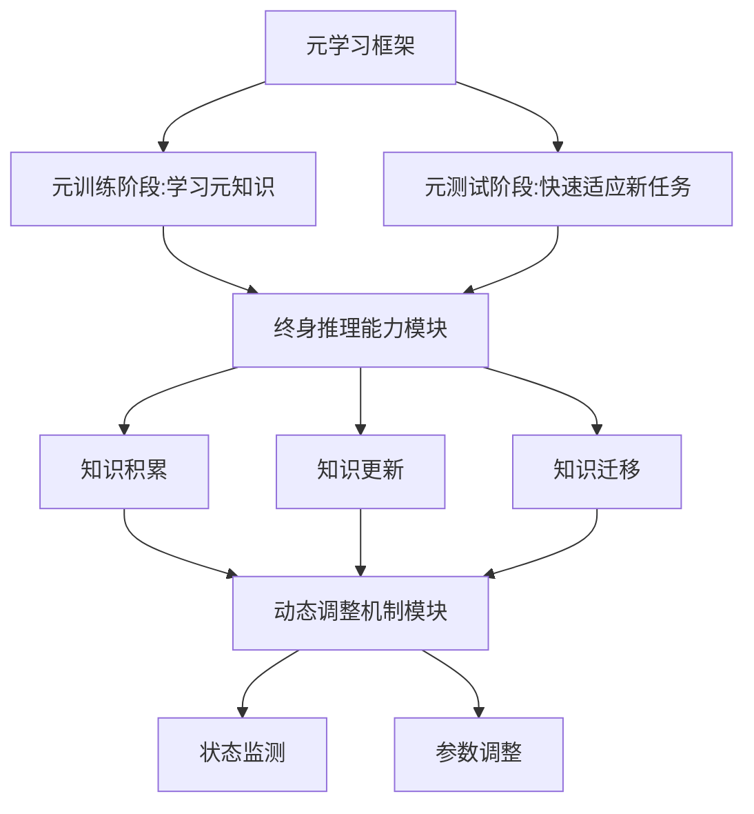

# 元学习框架下的终身推理能力动态调整机制设计

> 关键词：元学习、终身推理能力、动态调整机制、机器学习、智能系统

> 摘要：本文聚焦于元学习框架下的终身推理能力动态调整机制设计。首先介绍了相关背景知识，包括目的、预期读者、文档结构和术语表等。接着阐述了核心概念及其联系，给出了原理和架构的文本示意图与 Mermaid 流程图。详细讲解了核心算法原理和具体操作步骤，并用 Python 代码进行了阐述。同时，对数学模型和公式进行了详细讲解并举例说明。通过项目实战，展示了代码实际案例并进行深入解释。分析了实际应用场景，推荐了相关工具和资源。最后总结了未来发展趋势与挑战，提供了常见问题解答和扩展阅读参考资料。旨在为构建具有高效终身推理能力的智能系统提供理论和实践指导。

## 1. 背景介绍 
### 1.1 目的和范围
在当今人工智能快速发展的时代，智能系统面临着不断变化的环境和复杂的任务。传统的机器学习模型往往只能在固定的数据集上进行训练，难以适应新的任务和数据分布的变化。元学习作为一种新的机器学习范式，旨在让模型能够快速学习新任务，具有更强的泛化能力。而终身推理能力则要求智能系统在整个生命周期内持续学习和推理，不断适应新的情况。本研究的目的是设计一种在元学习框架下的终身推理能力动态调整机制，使智能系统能够根据不同的任务和环境动态调整自身的推理能力，提高系统的灵活性和适应性。

本研究的范围主要涵盖元学习理论、终身推理能力的概念和评估、动态调整机制的设计与实现，以及相关的实验验证和应用场景分析。

### 1.2 预期读者
本文的预期读者包括人工智能领域的研究人员、工程师、研究生等。对于对元学习、终身学习和智能系统感兴趣的人士，本文可以提供深入的技术知识和实践经验。对于正在从事相关项目开发的人员，本文的项目实战部分可以提供具体的代码实现和分析，具有一定的参考价值。

### 1.3 文档结构概述
本文共分为 10 个部分。第一部分为背景介绍，阐述了研究的目的、范围、预期读者和文档结构。第二部分介绍核心概念与联系，包括元学习、终身推理能力等核心概念的原理和架构，并给出相应的示意图和流程图。第三部分详细讲解核心算法原理和具体操作步骤，并用 Python 代码进行实现。第四部分介绍数学模型和公式，对相关原理进行深入分析并举例说明。第五部分通过项目实战展示代码实际案例，并进行详细解释和分析。第六部分分析实际应用场景。第七部分推荐相关的工具和资源，包括学习资源、开发工具框架和相关论文著作。第八部分总结未来发展趋势与挑战。第九部分为附录，提供常见问题与解答。第十部分为扩展阅读与参考资料。

### 1.4 术语表
#### 1.4.1 核心术语定义
- **元学习（Meta-learning）**：也称为“学习如何学习”，是一种让模型能够快速学习新任务的机器学习范式。它通过在多个任务上进行训练，学习到通用的学习策略和知识，从而能够在面对新任务时快速适应。
- **终身推理能力（Lifelong reasoning ability）**：指智能系统在整个生命周期内持续学习和推理的能力，能够不断适应新的任务和环境变化，保持良好的推理性能。
- **动态调整机制（Dynamic adjustment mechanism）**：一种能够根据系统的运行状态、任务需求和环境变化等因素，实时调整系统参数和行为的机制。

#### 1.4.2 相关概念解释
- **少样本学习（Few-shot learning）**：是元学习的一个重要应用场景，指在仅有少量样本的情况下，模型能够快速学习并完成新任务的能力。
- **元知识（Meta-knowledge）**：元学习过程中学习到的通用知识和策略，用于指导模型在新任务上的学习。
- **推理（Reasoning）**：从已知信息中得出结论的过程，在人工智能中通常指模型根据输入数据进行预测和判断的过程。

#### 1.4.3 缩略词列表
- **MAML（Model-Agnostic Meta-Learning）**：模型无关元学习，一种经典的元学习算法。
- **LSTM（Long Short-Term Memory）**：长短期记忆网络，一种常用于处理序列数据的循环神经网络。
- **CNN（Convolutional Neural Network）**：卷积神经网络，一种常用于图像处理和模式识别的神经网络。

## 2. 核心概念与联系 

### 核心概念原理

#### 元学习原理
元学习的核心思想是在多个任务上进行训练，学习到通用的学习策略和知识，使得模型能够快速适应新任务。常见的元学习方法包括基于模型的元学习、基于优化的元学习和基于度量的元学习。以基于优化的元学习中的 MAML 算法为例，其原理是通过在多个任务上进行内循环和外循环的优化，使得模型的初始参数能够在新任务上通过少量的梯度更新就能够取得较好的性能。

#### 终身推理能力原理
终身推理能力强调智能系统在整个生命周期内持续学习和推理的能力。它需要系统能够不断地从新的数据中学习新知识，同时保留旧知识，以应对不同的任务和环境变化。为了实现终身推理能力，系统需要具备知识积累、知识更新和知识迁移等能力。

#### 动态调整机制原理
动态调整机制的原理是根据系统的运行状态、任务需求和环境变化等因素，实时调整系统的参数和行为。在元学习框架下，动态调整机制可以根据新任务的特点和难度，调整模型的学习率、训练步数等参数，以提高模型在新任务上的学习效率和性能。

### 架构的文本示意图

```plaintext
+---------------------+
|     元学习框架      |
| +-----------------+ |
| | 元训练阶段      | |
| | 学习元知识      | |
| +-----------------+ |
| +-----------------+ |
| | 元测试阶段      | |
| | 快速适应新任务  | |
| +-----------------+ |
+---------------------+
          |
          v
+---------------------+
| 终身推理能力模块   |
| +-----------------+ |
| | 知识积累        | |
| | 知识更新        | |
| | 知识迁移        | |
| +-----------------+ |
+---------------------+
          |
          v
+---------------------+
| 动态调整机制模块   |
| +-----------------+ |
| | 状态监测        | |
| | 参数调整        | |
| +-----------------+ |
+---------------------+
```

### Mermaid 流程图



## 3. 核心算法原理 & 具体操作步骤 

### 核心算法原理

我们以 MAML 算法为例，介绍元学习的核心算法原理。MAML 算法的目标是找到一个通用的初始参数 $\theta$，使得模型在新任务上通过少量的梯度更新就能够取得较好的性能。具体步骤如下：

1. **元训练阶段**：
   - 从任务分布 $\mathcal{T}$ 中采样一个任务 $T_i$。
   - 在任务 $T_i$ 上进行内循环优化，通过梯度下降更新模型参数 $\theta$ 得到 $\theta_i'$：
     - 计算损失函数 $L_{T_i}(f_{\theta})$，其中 $f_{\theta}$ 是参数为 $\theta$ 的模型。
     - 根据损失函数计算梯度 $\nabla_{\theta} L_{T_i}(f_{\theta})$。
     - 更新参数 $\theta_i' = \theta - \alpha \nabla_{\theta} L_{T_i}(f_{\theta})$，其中 $\alpha$ 是内循环学习率。
   - 在任务 $T_i$ 的验证集上计算损失函数 $L_{T_i}^{val}(f_{\theta_i'})$。
   - 重复以上步骤多次，直到采样完所有任务。
   - 进行外循环优化，更新初始参数 $\theta$：
     - 计算所有任务验证集上的总损失函数 $\sum_{i} L_{T_i}^{val}(f_{\theta_i'})$。
     - 根据总损失函数计算梯度 $\nabla_{\theta} \sum_{i} L_{T_i}^{val}(f_{\theta_i'})$。
     - 更新参数 $\theta = \theta - \beta \nabla_{\theta} \sum_{i} L_{T_i}^{val}(f_{\theta_i'})$，其中 $\beta$ 是外循环学习率。

2. **元测试阶段**：
   - 当遇到新任务 $T_{new}$ 时，使用初始参数 $\theta$ 作为模型的初始状态。
   - 在新任务 $T_{new}$ 上进行少量的梯度更新，得到适应新任务的参数 $\theta_{new}'$。
   - 使用参数 $\theta_{new}'$ 进行推理。

### 具体操作步骤

#### 1. 数据准备
准备多个任务的数据集，每个任务的数据集包括训练集和验证集。

#### 2. 模型定义
定义一个神经网络模型 $f_{\theta}$，可以是 CNN、LSTM 等。

#### 3. 元训练
```python
import torch
import torch.nn as nn
import torch.optim as optim

# 定义模型
class Model(nn.Module):
    def __init__(self):
        super(Model, self).__init__()
        # 定义模型结构
        self.fc1 = nn.Linear(10, 20)
        self.fc2 = nn.Linear(20, 1)

    def forward(self, x):
        x = torch.relu(self.fc1(x))
        x = self.fc2(x)
        return x

# 初始化模型参数
model = Model()
theta = list(model.parameters())

# 定义内循环学习率和外循环学习率
alpha = 0.01
beta = 0.001

# 定义优化器
outer_optimizer = optim.Adam(theta, lr=beta)

# 元训练阶段
num_epochs = 100
for epoch in range(num_epochs):
    total_loss = 0
    # 采样任务
    for task in task_distribution:
        # 复制模型参数
        theta_prime = [param.clone() for param in theta]
        # 内循环优化
        inner_optimizer = optim.SGD(theta_prime, lr=alpha)
        for _ in range(5):  # 内循环步数
            inputs, labels = task.train_data()
            outputs = model(inputs)
            loss = nn.MSELoss()(outputs, labels)
            inner_optimizer.zero_grad()
            loss.backward()
            inner_optimizer.step()
        # 计算验证集损失
        inputs_val, labels_val = task.val_data()
        outputs_val = model(inputs_val)
        val_loss = nn.MSELoss()(outputs_val, labels_val)
        total_loss += val_loss
    # 外循环优化
    outer_optimizer.zero_grad()
    total_loss.backward()
    outer_optimizer.step()
    print(f'Epoch {epoch+1}, Loss: {total_loss.item()}')
```

#### 4. 元测试
```python
# 遇到新任务
new_task = get_new_task()
# 复制初始参数
theta_new = [param.clone() for param in theta]
# 在新任务上进行少量梯度更新
new_optimizer = optim.SGD(theta_new, lr=alpha)
for _ in range(3):  # 少量更新步数
    inputs_new, labels_new = new_task.train_data()
    outputs_new = model(inputs_new)
    loss_new = nn.MSELoss()(outputs_new, labels_new)
    new_optimizer.zero_grad()
    loss_new.backward()
    new_optimizer.step()
# 使用更新后的参数进行推理
inputs_test, _ = new_task.test_data()
outputs_test = model(inputs_test)
```

## 4. 数学模型和公式 & 详细讲解 & 举例说明 

### 数学模型和公式

#### MAML 算法的数学模型

在 MAML 算法中，我们的目标是找到一个通用的初始参数 $\theta$，使得模型在新任务上通过少量的梯度更新就能够取得较好的性能。具体来说，我们需要最小化以下目标函数：

$$
\min_{\theta} \sum_{T_i \in \mathcal{T}} L_{T_i}^{val}(f_{\theta_i'})
$$

其中，$\mathcal{T}$ 是任务分布，$L_{T_i}^{val}(f_{\theta_i'})$ 是任务 $T_i$ 在验证集上的损失函数，$\theta_i'$ 是在任务 $T_i$ 上进行内循环优化后得到的参数，其更新公式为：

$$
\theta_i' = \theta - \alpha \nabla_{\theta} L_{T_i}(f_{\theta})
$$

### 详细讲解

#### 目标函数的含义
目标函数 $\min_{\theta} \sum_{T_i \in \mathcal{T}} L_{T_i}^{val}(f_{\theta_i'})$ 的含义是，我们希望找到一个初始参数 $\theta$，使得在所有任务上，经过内循环优化后得到的参数 $\theta_i'$ 在验证集上的损失函数之和最小。这样，当遇到新任务时，使用这个初始参数 $\theta$ 进行少量的梯度更新，就能够快速适应新任务。

#### 内循环优化的作用
内循环优化的作用是在每个任务上对初始参数 $\theta$ 进行微调，得到适应该任务的参数 $\theta_i'$。通过内循环优化，模型能够学习到每个任务的特定知识。

#### 外循环优化的作用
外循环优化的作用是根据所有任务的验证集损失，更新初始参数 $\theta$。通过外循环优化，模型能够学习到通用的知识和学习策略，使得初始参数 $\theta$ 能够在新任务上快速适应。

### 举例说明

假设我们有一个简单的回归任务，输入是一个 10 维的向量，输出是一个标量。我们有 10 个不同的回归任务，每个任务的数据集包括 100 个训练样本和 20 个验证样本。

在元训练阶段，我们从这 10 个任务中采样一个任务，例如任务 $T_1$。在任务 $T_1$ 上进行内循环优化，通过梯度下降更新模型参数 $\theta$ 得到 $\theta_1'$。然后在任务 $T_1$ 的验证集上计算损失函数 $L_{T_1}^{val}(f_{\theta_1'})$。重复以上步骤，对所有任务进行处理，最后计算所有任务验证集上的总损失函数 $\sum_{i} L_{T_i}^{val}(f_{\theta_i'})$，并根据总损失函数更新初始参数 $\theta$。

在元测试阶段，当遇到新任务 $T_{new}$ 时，使用初始参数 $\theta$ 作为模型的初始状态，在新任务 $T_{new}$ 上进行少量的梯度更新，得到适应新任务的参数 $\theta_{new}'$，然后使用参数 $\theta_{new}'$ 进行推理。

## 5. 项目实战：代码实际案例和详细解释说明 

### 5.1  开发环境搭建

#### 操作系统
建议使用 Linux 或 macOS 操作系统，因为它们对 Python 和深度学习框架的支持更好。

#### Python 版本
使用 Python 3.7 或以上版本。

#### 深度学习框架
使用 PyTorch 深度学习框架，安装命令如下：
```sh
pip install torch torchvision
```

#### 其他依赖库
安装 numpy、matplotlib 等常用库：
```sh
pip install numpy matplotlib
```

### 5.2  源代码详细实现和代码解读

#### 数据生成
```python
import numpy as np

# 生成任务数据集
def generate_task_data(num_tasks, num_train_samples, num_val_samples, input_dim):
    tasks = []
    for _ in range(num_tasks):
        # 生成随机权重和偏置
        true_w = np.random.randn(input_dim, 1)
        true_b = np.random.randn(1)
        # 生成训练数据
        train_x = np.random.randn(num_train_samples, input_dim)
        train_y = np.dot(train_x, true_w) + true_b + 0.1 * np.random.randn(num_train_samples, 1)
        # 生成验证数据
        val_x = np.random.randn(num_val_samples, input_dim)
        val_y = np.dot(val_x, true_w) + true_b + 0.1 * np.random.randn(num_val_samples, 1)
        tasks.append((train_x, train_y, val_x, val_y))
    return tasks

# 生成任务分布
num_tasks = 10
num_train_samples = 100
num_val_samples = 20
input_dim = 10
task_distribution = generate_task_data(num_tasks, num_train_samples, num_val_samples, input_dim)
```
**代码解读**：这段代码用于生成任务数据集。首先定义了一个函数 `generate_task_data`，它接受任务数量、训练样本数量、验证样本数量和输入维度作为参数。在函数内部，对于每个任务，生成随机的权重和偏置，然后根据这些参数生成训练数据和验证数据。最后返回一个包含所有任务数据的列表。

#### 模型定义
```python
import torch
import torch.nn as nn

# 定义模型
class Model(nn.Module):
    def __init__(self, input_dim):
        super(Model, self).__init__()
        self.fc1 = nn.Linear(input_dim, 20)
        self.fc2 = nn.Linear(20, 1)

    def forward(self, x):
        x = torch.relu(self.fc1(x))
        x = self.fc2(x)
        return x

# 初始化模型
model = Model(input_dim)
```
**代码解读**：这段代码定义了一个简单的神经网络模型，包含一个输入层、一个隐藏层和一个输出层。输入层的维度由 `input_dim` 决定，隐藏层有 20 个神经元，输出层有 1 个神经元。在 `forward` 方法中，定义了模型的前向传播过程，使用 ReLU 激活函数。

#### 元训练
```python
import torch.optim as optim

# 定义内循环学习率和外循环学习率
alpha = 0.01
beta = 0.001

# 定义优化器
outer_optimizer = optim.Adam(model.parameters(), lr=beta)

# 元训练阶段
num_epochs = 100
for epoch in range(num_epochs):
    total_loss = 0
    # 采样任务
    for task in task_distribution:
        train_x, train_y, val_x, val_y = task
        train_x = torch.tensor(train_x, dtype=torch.float32)
        train_y = torch.tensor(train_y, dtype=torch.float32)
        val_x = torch.tensor(val_x, dtype=torch.float32)
        val_y = torch.tensor(val_y, dtype=torch.float32)
        # 复制模型参数
        theta_prime = [param.clone() for param in model.parameters()]
        # 内循环优化
        inner_optimizer = optim.SGD(theta_prime, lr=alpha)
        for _ in range(5):  # 内循环步数
            outputs = model(train_x)
            loss = nn.MSELoss()(outputs, train_y)
            inner_optimizer.zero_grad()
            loss.backward()
            inner_optimizer.step()
        # 计算验证集损失
        outputs_val = model(val_x)
        val_loss = nn.MSELoss()(outputs_val, val_y)
        total_loss += val_loss
    # 外循环优化
    outer_optimizer.zero_grad()
    total_loss.backward()
    outer_optimizer.step()
    print(f'Epoch {epoch+1}, Loss: {total_loss.item()}')
```
**代码解读**：这段代码实现了元训练过程。首先定义了内循环学习率 `alpha` 和外循环学习率 `beta`，并使用 Adam 优化器进行外循环优化。在每个 epoch 中，遍历所有任务，对于每个任务，先将数据转换为 PyTorch 张量，然后复制模型参数进行内循环优化。内循环使用 SGD 优化器，进行 5 步梯度更新。接着计算验证集损失，并将所有任务的验证集损失累加。最后进行外循环优化，更新模型的初始参数。

#### 元测试
```python
# 生成新任务
new_task = generate_task_data(1, num_train_samples, num_val_samples, input_dim)[0]
train_x_new, train_y_new, test_x_new, test_y_new = new_task
train_x_new = torch.tensor(train_x_new, dtype=torch.float32)
train_y_new = torch.tensor(train_y_new, dtype=torch.float32)
test_x_new = torch.tensor(test_x_new, dtype=torch.float32)
test_y_new = torch.tensor(test_y_new, dtype=torch.float32)

# 复制初始参数
theta_new = [param.clone() for param in model.parameters()]
# 在新任务上进行少量梯度更新
new_optimizer = optim.SGD(theta_new, lr=alpha)
for _ in range(3):  # 少量更新步数
    outputs_new = model(train_x_new)
    loss_new = nn.MSELoss()(outputs_new, train_y_new)
    new_optimizer.zero_grad()
    loss_new.backward()
    new_optimizer.step()
# 使用更新后的参数进行推理
outputs_test = model(test_x_new)
test_loss = nn.MSELoss()(outputs_test, test_y_new)
print(f'Test Loss: {test_loss.item()}')
```
**代码解读**：这段代码实现了元测试过程。首先生成一个新任务，将数据转换为 PyTorch 张量。然后复制模型的初始参数，在新任务上进行少量的梯度更新，使用 SGD 优化器进行 3 步更新。最后使用更新后的参数进行推理，计算测试集损失并输出。

### 5.3  代码解读与分析

#### 数据生成部分
数据生成部分通过随机生成权重和偏置，模拟了不同的回归任务。这样可以让模型在多个不同的任务上进行训练，学习到通用的学习策略。

#### 模型定义部分
模型定义部分使用了一个简单的全连接神经网络，包含一个隐藏层。这种结构可以处理简单的回归任务，同时也方便进行梯度计算和参数更新。

#### 元训练部分
元训练部分通过内循环和外循环的优化，使得模型的初始参数能够在新任务上快速适应。内循环优化在每个任务上对初始参数进行微调，外循环优化根据所有任务的验证集损失更新初始参数。

#### 元测试部分
元测试部分在新任务上进行少量的梯度更新，使用更新后的参数进行推理。通过比较测试集损失，可以评估模型在新任务上的适应能力。

## 6. 实际应用场景 

### 机器人领域
在机器人领域，机器人需要在不同的环境中执行各种任务，如导航、抓取、操作等。元学习框架下的终身推理能力动态调整机制可以让机器人快速适应新的环境和任务。例如，当机器人进入一个新的房间时，它可以利用元学习学到的知识，快速调整自己的导航策略；当遇到新的物体时，它可以通过少量的尝试学习到抓取该物体的方法。

### 医疗领域
在医疗领域，疾病的诊断和治疗需要根据患者的个体差异和病情变化进行调整。元学习框架下的终身推理能力动态调整机制可以帮助医生和医疗系统更好地应对这些变化。例如，对于一种新的疾病，医疗系统可以利用元学习学到的知识，快速制定初步的诊断和治疗方案；在治疗过程中，根据患者的反应动态调整治疗方案。

### 金融领域
在金融领域，市场环境和客户需求不断变化，金融机构需要及时调整投资策略和风险评估模型。元学习框架下的终身推理能力动态调整机制可以让金融机构快速适应这些变化。例如，当市场出现新的趋势时，投资模型可以利用元学习学到的知识，快速调整投资组合；在评估客户信用风险时，根据客户的新信息动态调整风险评估模型。

### 智能家居领域
在智能家居领域，用户的生活习惯和需求会随着时间和环境的变化而变化。元学习框架下的终身推理能力动态调整机制可以让智能家居系统更好地满足用户的需求。例如，智能家居系统可以根据用户的日常作息时间，自动调整室内温度、灯光等设备的状态；当用户有新的需求时，系统可以通过学习快速适应并提供相应的服务。

## 7. 工具和资源推荐
### 7.1 学习资源推荐
#### 7.1.1 书籍推荐
- 《深度学习》（Deep Learning）：由 Ian Goodfellow、Yoshua Bengio 和 Aaron Courville 所著，是深度学习领域的经典教材，涵盖了深度学习的基本概念、算法和应用。
- 《机器学习》（Machine Learning: A Probabilistic Perspective）：由 Kevin P. Murphy 所著，从概率的角度介绍了机器学习的各种算法和模型，内容全面且深入。
- 《元学习：原理与应用》（Meta-Learning: Principles and Applications）：专门介绍元学习的书籍，详细讲解了元学习的原理、算法和应用场景。

#### 7.1.2 在线课程
- Coursera 上的“深度学习专项课程”（Deep Learning Specialization）：由 Andrew Ng 教授授课，包括神经网络、卷积神经网络、循环神经网络等深度学习的核心内容。
- edX 上的“强化学习基础”（Fundamentals of Reinforcement Learning）：介绍了强化学习的基本概念和算法，对于理解智能系统的学习和决策过程有很大帮助。
- OpenAI 的“Spinning Up in Deep Reinforcement Learning”：提供了强化学习的入门教程和代码实现，适合初学者快速上手。

#### 7.1.3 技术博客和网站
- Medium 上的 Towards Data Science：汇集了大量的数据科学和机器学习相关的文章，涵盖了最新的研究成果和实践经验。
- arXiv.org：是一个预印本平台，提供了大量的学术论文，包括人工智能、机器学习等领域的最新研究。
- AI Research：专注于人工智能研究的博客，分享了许多关于元学习、终身学习等前沿技术的文章。

### 7.2 开发工具框架推荐
#### 7.2.1 IDE和编辑器
- PyCharm：是一款专门为 Python 开发设计的集成开发环境，提供了丰富的代码编辑、调试和项目管理功能。
- Jupyter Notebook：是一个交互式的开发环境，适合进行数据分析、模型实验和代码演示。
- Visual Studio Code：是一款轻量级的代码编辑器，支持多种编程语言和插件，具有良好的扩展性。

#### 7.2.2 调试和性能分析工具
- PyTorch Profiler：是 PyTorch 提供的性能分析工具，可以帮助开发者分析模型的运行时间、内存使用等情况。
- TensorBoard：是 TensorFlow 提供的可视化工具，也可以用于 PyTorch 模型的可视化分析，包括训练过程的可视化、模型结构的可视化等。
- cProfile：是 Python 内置的性能分析工具，可以帮助开发者找出代码中的性能瓶颈。

#### 7.2.3 相关框架和库
- PyTorch：是一个开源的深度学习框架，具有动态图、易于使用等优点，广泛应用于学术界和工业界。
- TensorFlow：是另一个著名的深度学习框架，具有强大的分布式训练和部署能力。
- Scikit-learn：是一个用于机器学习的 Python 库，提供了各种机器学习算法和工具，如分类、回归、聚类等。

### 7.3 相关论文著作推荐
#### 7.3.1 经典论文
- "Model-Agnostic Meta-Learning for Fast Adaptation of Deep Networks"：提出了 MAML 算法，是元学习领域的经典论文。
- "Learning to Learn by Gradient Descent by Gradient Descent"：介绍了通过梯度下降来学习学习策略的方法，为元学习提供了新的思路。
- "Lifelong Machine Learning"：探讨了终身机器学习的概念和方法，对终身推理能力的研究有重要的启示。

#### 7.3.2 最新研究成果
- 每年在顶级学术会议（如 NeurIPS、ICML、CVPR 等）上发表的关于元学习、终身学习的论文，反映了该领域的最新研究进展。
- 一些知名研究机构（如 OpenAI、DeepMind 等）发布的研究报告和技术博客，分享了他们在元学习和智能系统方面的最新成果。

#### 7.3.3 应用案例分析
- 一些实际应用领域（如机器人、医疗、金融等）的学术论文和技术报告，介绍了元学习和终身推理能力在这些领域的应用案例和效果评估。

## 8. 总结：未来发展趋势与挑战

### 未来发展趋势

#### 更强大的元学习算法
未来，研究人员将继续探索更强大的元学习算法，提高模型在新任务上的学习效率和性能。例如，结合强化学习和元学习，让模型能够在动态环境中更好地学习和决策。

#### 与其他技术的融合
元学习将与其他技术（如计算机视觉、自然语言处理、知识图谱等）深度融合，拓展其应用场景。例如，在计算机视觉中，元学习可以用于少样本图像分类和目标检测；在自然语言处理中，元学习可以用于快速适应新的语言任务。

#### 终身学习系统的普及
随着人工智能技术的不断发展，终身学习系统将越来越普及。智能设备（如手机、机器人等）将具备终身推理能力，能够不断学习和适应新的环境和任务。

### 挑战

#### 数据隐私和安全问题
在终身学习过程中，模型需要不断地从新的数据中学习，这可能涉及到用户的隐私和数据安全问题。如何在保证数据隐私和安全的前提下，实现有效的终身学习是一个亟待解决的问题。

#### 计算资源的限制
元学习和终身推理需要大量的计算资源，尤其是在处理大规模数据集和复杂任务时。如何优化算法和模型结构，降低计算成本，是提高系统效率的关键。

#### 知识的有效积累和更新
在终身学习过程中，如何有效地积累和更新知识，避免灾难性遗忘，是一个挑战。需要研究新的知识表示和存储方法，以及有效的知识更新策略。

## 9. 附录：常见问题与解答

### 问题 1：元学习和传统机器学习有什么区别？
**解答**：传统机器学习通常在固定的数据集上进行训练，模型的泛化能力主要依赖于训练数据的多样性和质量。而元学习的目标是让模型能够快速学习新任务，通过在多个任务上进行训练，学习到通用的学习策略和知识，从而在面对新任务时能够快速适应。

### 问题 2：终身推理能力和元学习有什么关系？
**解答**：元学习为实现终身推理能力提供了一种有效的方法。通过元学习，模型可以学习到通用的学习策略和知识，使得在终身学习过程中，能够快速适应新的任务和环境变化，从而实现持续的推理能力。

### 问题 3：动态调整机制在元学习中有什么作用？
**解答**：动态调整机制可以根据系统的运行状态、任务需求和环境变化等因素，实时调整模型的参数和行为。在元学习中，动态调整机制可以根据新任务的特点和难度，调整模型的学习率、训练步数等参数，提高模型在新任务上的学习效率和性能。

### 问题 4：如何评估元学习模型的性能？
**解答**：常见的评估指标包括准确率、召回率、F1 值等。在元学习中，还可以使用少样本学习的评估指标，如在少量样本情况下的分类准确率、回归误差等。此外，还可以通过比较模型在新任务上的学习速度和适应能力来评估其性能。

## 10. 扩展阅读 & 参考资料

### 扩展阅读
- 《人工智能：一种现代的方法》（Artificial Intelligence: A Modern Approach）：全面介绍了人工智能的各个领域，包括搜索算法、知识表示、机器学习等。
- 《神经网络与深度学习》（Neural Networks and Deep Learning）：由 Michael Nielsen 所著，以通俗易懂的方式介绍了神经网络和深度学习的基本原理和算法。
- 《强化学习：原理与Python实现》：详细介绍了强化学习的理论和实践，包括各种强化学习算法的Python实现。

### 参考资料
- Finn, C., Abbeel, P., & Levine, S. (2017). Model-Agnostic Meta-Learning for Fast Adaptation of Deep Networks. arXiv preprint arXiv:1703.03400.
- Andrychowicz, M., Denil, M., Gomez, S., Hoffman, M. W., Pfau, D., Schaul, T.,... & De Freitas, N. (2016). Learning to learn by gradient descent by gradient descent. In Advances in neural information processing systems (pp. 3981-3989).
- Thrun, S., & Mitchell, T. (1995). Lifelong learning algorithms. In Machine learning: proceedings of the twelfth international conference (Vol. 12, pp. 181-188).

作者：AI天才研究院/AI Genius Institute & 禅与计算机程序设计艺术 /Zen And The Art of Computer Programming