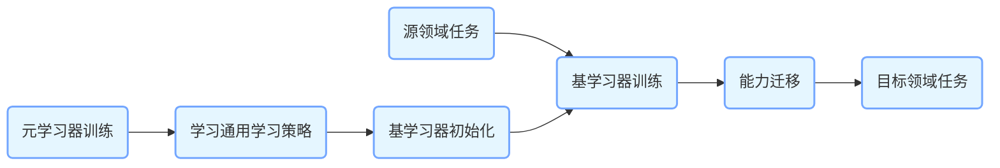

# 元学习驱动的跨领域推理能力迁移

> 关键词：元学习、跨领域推理、能力迁移、机器学习、人工智能

> 摘要：本文聚焦于元学习驱动的跨领域推理能力迁移这一前沿课题。详细阐述了元学习、跨领域推理及能力迁移的核心概念及其相互联系，深入剖析了相关核心算法原理，并结合Python代码进行具体实现。同时，给出了涉及的数学模型和公式，并通过实际案例进行说明。在项目实战部分，展示了开发环境搭建、源代码实现及代码解读。此外，探讨了该技术的实际应用场景，推荐了相关的学习资源、开发工具框架以及论文著作。最后，对未来发展趋势与挑战进行总结，并提供常见问题解答和扩展阅读参考资料。

## 1. 背景介绍 
### 1.1 目的和范围
随着人工智能技术的飞速发展，机器学习模型在各个领域都取得了显著的成果。然而，传统的机器学习方法往往需要大量的标注数据，且模型的泛化能力有限，难以在不同领域之间进行有效的知识迁移。元学习作为一种新兴的机器学习范式，旨在让模型具备快速学习和适应新任务的能力。本文章的目的在于探讨如何利用元学习驱动跨领域推理能力的迁移，提高模型在不同领域的性能和泛化能力。文章的范围涵盖了元学习和跨领域推理的核心概念、相关算法原理、数学模型、项目实战、实际应用场景以及未来发展趋势等方面。

### 1.2 预期读者
本文主要面向对人工智能、机器学习领域感兴趣的研究人员、工程师和学生。对于希望深入了解元学习和跨领域推理技术的专业人士，本文提供了系统的理论知识和实践指导；对于初学者，本文通过通俗易懂的语言和详细的代码示例，帮助他们快速入门并掌握相关技术。

### 1.3 文档结构概述
本文共分为十个部分。第一部分为背景介绍，阐述了文章的目的、范围、预期读者和文档结构。第二部分介绍核心概念与联系，包括元学习、跨领域推理和能力迁移的原理和架构，并通过文本示意图和Mermaid流程图进行展示。第三部分详细讲解核心算法原理，并给出Python源代码实现。第四部分介绍数学模型和公式，并进行详细讲解和举例说明。第五部分是项目实战，包括开发环境搭建、源代码实现和代码解读。第六部分探讨实际应用场景。第七部分推荐相关的学习资源、开发工具框架和论文著作。第八部分总结未来发展趋势与挑战。第九部分是附录，提供常见问题与解答。第十部分为扩展阅读和参考资料。

### 1.4 术语表
#### 1.4.1 核心术语定义
- **元学习（Meta-learning）**：也称为“学习如何学习”，是一种让模型从多个任务中学习通用的学习策略和知识，以便能够快速适应新任务的机器学习范式。
- **跨领域推理（Cross-domain reasoning）**：指模型在不同领域之间进行知识迁移和推理的能力，能够利用在一个领域学到的知识来解决另一个领域的问题。
- **能力迁移（Capability transfer）**：将模型在一个领域或任务中学习到的能力应用到其他领域或任务中的过程。

#### 1.4.2 相关概念解释
- **基学习器（Base learner）**：在元学习中，基学习器是用于解决具体任务的学习模型。
- **元学习器（Meta-learner）**：负责学习如何调整基学习器的参数，以使其能够快速适应新任务。
- **任务分布（Task distribution）**：表示一组相关任务的概率分布，元学习模型通常在多个任务分布上进行训练。

#### 1.4.3 缩略词列表
- **MAML（Model-Agnostic Meta-Learning）**：模型无关元学习，是一种经典的元学习算法。
- **FOMAML（First-Order Model-Agnostic Meta-Learning）**：一阶模型无关元学习，是MAML的简化版本。

## 2. 核心概念与联系 

### 2.1 核心概念原理
#### 2.1.1 元学习
元学习的核心思想是让模型从多个任务中学习通用的学习策略和知识，以便能够快速适应新任务。传统的机器学习模型通常是在单一任务上进行训练，而元学习模型则是在多个任务组成的任务分布上进行训练。在训练过程中，元学习器通过优化元目标函数，学习如何调整基学习器的参数，使得基学习器在面对新任务时能够快速收敛到较好的性能。

#### 2.1.2 跨领域推理
跨领域推理是指模型在不同领域之间进行知识迁移和推理的能力。在实际应用中，不同领域的数据往往具有不同的分布和特征，传统的机器学习模型很难直接应用于新领域。跨领域推理通过利用在源领域学到的知识和模式，来解决目标领域的问题，从而提高模型在新领域的性能。

#### 2.1.3 能力迁移
能力迁移是将模型在一个领域或任务中学习到的能力应用到其他领域或任务中的过程。能力迁移可以分为正向迁移和负向迁移。正向迁移是指在源领域学到的知识和能力有助于解决目标领域的问题，而负向迁移则是指在源领域学到的知识和能力对解决目标领域的问题产生负面影响。

### 2.2 架构示意图
以下是元学习驱动的跨领域推理能力迁移的架构示意图：

```plaintext
+------------------+
| 元学习器         |
| (Meta-learner)   |
+------------------+
        |
        | 学习通用学习策略
        v
+------------------+
| 基学习器         |
| (Base-learner)   |
+------------------+
        |
        | 适应新任务
        v
+------------------+
| 目标领域任务     |
| (Target domain task) |
+------------------+
```

### 2.3 Mermaid流程图


## 3. 核心算法原理 & 具体操作步骤 

### 3.1 模型无关元学习（MAML）算法原理
模型无关元学习（MAML）是一种经典的元学习算法，其核心思想是通过在多个任务上进行训练，找到一组初始参数，使得基学习器在这些任务上进行少量的梯度更新后，能够快速适应新任务。

#### 3.1.1 算法步骤
1. **初始化参数**：随机初始化基学习器的参数 $\theta$。
2. **采样任务**：从任务分布 $p(\mathcal{T})$ 中采样一组任务 $\{\mathcal{T}_1, \mathcal{T}_2, \cdots, \mathcal{T}_n\}$。
3. **内循环更新**：对于每个任务 $\mathcal{T}_i$，从任务 $\mathcal{T}_i$ 中采样一个支持集 $S_i$，使用支持集 $S_i$ 对基学习器进行一次或多次梯度更新，得到更新后的参数 $\theta_i'$。
4. **外循环更新**：从任务 $\mathcal{T}_i$ 中采样一个查询集 $Q_i$，计算在查询集 $Q_i$ 上的损失 $L(\theta_i')$，并使用梯度下降法更新基学习器的参数 $\theta$。
5. **重复步骤2-4**：直到满足停止条件。

### 3.2 Python代码实现
```python
import torch
import torch.nn as nn
import torch.optim as optim

# 定义基学习器
class BaseLearner(nn.Module):
    def __init__(self, input_size, hidden_size, output_size):
        super(BaseLearner, self).__init__()
        self.fc1 = nn.Linear(input_size, hidden_size)
        self.relu = nn.ReLU()
        self.fc2 = nn.Linear(hidden_size, output_size)

    def forward(self, x):
        out = self.fc1(x)
        out = self.relu(out)
        out = self.fc2(out)
        return out

# 定义元学习器
class MetaLearner:
    def __init__(self, base_learner, meta_lr, inner_lr, num_inner_steps):
        self.base_learner = base_learner
        self.meta_optimizer = optim.Adam(self.base_learner.parameters(), lr=meta_lr)
        self.inner_lr = inner_lr
        self.num_inner_steps = num_inner_steps

    def meta_train(self, task_distribution, num_tasks):
        for _ in range(num_tasks):
            # 采样任务
            task = task_distribution.sample_task()
            support_set, query_set = task.get_support_query_sets()

            # 内循环更新
            fast_weights = list(self.base_learner.parameters())
            for _ in range(self.num_inner_steps):
                support_inputs, support_labels = support_set
                support_outputs = self.base_learner(support_inputs)
                support_loss = nn.CrossEntropyLoss()(support_outputs, support_labels)
                grads = torch.autograd.grad(support_loss, fast_weights)
                fast_weights = [w - self.inner_lr * g for w, g in zip(fast_weights, grads)]

            # 外循环更新
            query_inputs, query_labels = query_set
            query_outputs = self.base_learner.forward_with_weights(query_inputs, fast_weights)
            query_loss = nn.CrossEntropyLoss()(query_outputs, query_labels)
            self.meta_optimizer.zero_grad()
            query_loss.backward()
            self.meta_optimizer.step()

# 示例使用
input_size = 10
hidden_size = 20
output_size = 5
base_learner = BaseLearner(input_size, hidden_size, output_size)
meta_lr = 0.001
inner_lr = 0.01
num_inner_steps = 5
meta_learner = MetaLearner(base_learner, meta_lr, inner_lr, num_inner_steps)

# 假设 task_distribution 是一个任务分布对象
# num_tasks 是训练的任务数量
task_distribution = None
num_tasks = 100
meta_learner.meta_train(task_distribution, num_tasks)
```

### 3.3 代码解释
- `BaseLearner` 类定义了基学习器，这里使用了一个简单的两层全连接神经网络。
- `MetaLearner` 类定义了元学习器，包含元优化器和内循环学习率等参数。
- `meta_train` 方法实现了MAML算法的训练过程，包括内循环更新和外循环更新。

## 4. 数学模型和公式 & 详细讲解 & 举例说明 

### 4.1 内循环更新公式
在MAML算法中，内循环更新的目标是找到一组快速适应新任务的参数 $\theta_i'$。对于任务 $\mathcal{T}_i$，内循环更新的公式如下：

$$
\theta_i' = \theta - \alpha \nabla_{\theta} L(\theta; S_i)
$$

其中，$\theta$ 是基学习器的初始参数，$\alpha$ 是内循环学习率，$L(\theta; S_i)$ 是在支持集 $S_i$ 上的损失函数。

### 4.2 外循环更新公式
外循环更新的目标是更新基学习器的初始参数 $\theta$，使得基学习器在多个任务上都能快速适应。外循环更新的公式如下：

$$
\theta \leftarrow \theta - \beta \nabla_{\theta} \sum_{i=1}^{n} L(\theta_i'; Q_i)
$$

其中，$\beta$ 是元学习率，$L(\theta_i'; Q_i)$ 是在查询集 $Q_i$ 上的损失函数。

### 4.3 举例说明
假设我们有一个二分类任务，输入数据的维度为 $2$，基学习器是一个简单的线性分类器 $f(x) = \mathbf{w}^T x + b$，其中 $\mathbf{w}$ 是权重向量，$b$ 是偏置项。

- **内循环更新**：
  - 初始参数 $\theta = (\mathbf{w}, b)$。
  - 支持集 $S_i$ 包含 $m$ 个样本 $\{(x_1, y_1), (x_2, y_2), \cdots, (x_m, y_m)\}$。
  - 损失函数 $L(\theta; S_i) = \frac{1}{m} \sum_{j=1}^{m} \ell(f(x_j; \theta), y_j)$，其中 $\ell$ 是交叉熵损失函数。
  - 计算梯度 $\nabla_{\theta} L(\theta; S_i)$。
  - 更新参数 $\theta_i' = \theta - \alpha \nabla_{\theta} L(\theta; S_i)$。

- **外循环更新**：
  - 查询集 $Q_i$ 包含 $k$ 个样本 $\{(x_1', y_1'), (x_2', y_2'), \cdots, (x_k', y_k')\}$。
  - 计算损失 $L(\theta_i'; Q_i) = \frac{1}{k} \sum_{j=1}^{k} \ell(f(x_j'; \theta_i'), y_j')$。
  - 计算梯度 $\nabla_{\theta} \sum_{i=1}^{n} L(\theta_i'; Q_i)$。
  - 更新参数 $\theta \leftarrow \theta - \beta \nabla_{\theta} \sum_{i=1}^{n} L(\theta_i'; Q_i)$。

## 5. 项目实战：代码实际案例和详细解释说明 

### 5.1  开发环境搭建
#### 5.1.1 安装Python
首先，确保你已经安装了Python 3.6或更高版本。你可以从Python官方网站（https://www.python.org/downloads/）下载并安装Python。

#### 5.1.2 安装依赖库
使用以下命令安装项目所需的依赖库：
```sh
pip install torch torchvision numpy matplotlib
```

### 5.2  源代码详细实现和代码解读
#### 5.2.1 数据集生成
```python
import torch
import numpy as np

# 生成数据集
def generate_dataset(num_tasks, num_samples_per_task, input_size, output_size):
    datasets = []
    for _ in range(num_tasks):
        inputs = torch.randn(num_samples_per_task, input_size)
        labels = torch.randint(0, output_size, (num_samples_per_task,))
        datasets.append((inputs, labels))
    return datasets

# 示例使用
num_tasks = 10
num_samples_per_task = 100
input_size = 10
output_size = 5
datasets = generate_dataset(num_tasks, num_samples_per_task, input_size, output_size)
```
代码解释：`generate_dataset` 函数用于生成一组任务的数据集，每个任务包含一定数量的样本。

#### 5.2.2 基学习器和元学习器定义
```python
import torch
import torch.nn as nn
import torch.optim as optim

# 定义基学习器
class BaseLearner(nn.Module):
    def __init__(self, input_size, hidden_size, output_size):
        super(BaseLearner, self).__init__()
        self.fc1 = nn.Linear(input_size, hidden_size)
        self.relu = nn.ReLU()
        self.fc2 = nn.Linear(hidden_size, output_size)

    def forward(self, x):
        out = self.fc1(x)
        out = self.relu(out)
        out = self.fc2(out)
        return out

# 定义元学习器
class MetaLearner:
    def __init__(self, base_learner, meta_lr, inner_lr, num_inner_steps):
        self.base_learner = base_learner
        self.meta_optimizer = optim.Adam(self.base_learner.parameters(), lr=meta_lr)
        self.inner_lr = inner_lr
        self.num_inner_steps = num_inner_steps

    def meta_train(self, datasets, num_epochs):
        for epoch in range(num_epochs):
            meta_loss = 0
            for task_data in datasets:
                # 划分支持集和查询集
                support_size = int(len(task_data[0]) * 0.8)
                support_inputs, support_labels = task_data[0][:support_size], task_data[1][:support_size]
                query_inputs, query_labels = task_data[0][support_size:], task_data[1][support_size:]

                # 内循环更新
                fast_weights = list(self.base_learner.parameters())
                for _ in range(self.num_inner_steps):
                    support_outputs = self.base_learner(support_inputs)
                    support_loss = nn.CrossEntropyLoss()(support_outputs, support_labels)
                    grads = torch.autograd.grad(support_loss, fast_weights)
                    fast_weights = [w - self.inner_lr * g for w, g in zip(fast_weights, grads)]

                # 外循环更新
                query_outputs = self.base_learner.forward_with_weights(query_inputs, fast_weights)
                query_loss = nn.CrossEntropyLoss()(query_outputs, query_labels)
                meta_loss += query_loss

            self.meta_optimizer.zero_grad()
            meta_loss.backward()
            self.meta_optimizer.step()
            print(f'Epoch {epoch+1}/{num_epochs}, Meta Loss: {meta_loss.item()}')

# 示例使用
input_size = 10
hidden_size = 20
output_size = 5
base_learner = BaseLearner(input_size, hidden_size, output_size)
meta_lr = 0.001
inner_lr = 0.01
num_inner_steps = 5
meta_learner = MetaLearner(base_learner, meta_lr, inner_lr, num_inner_steps)
num_epochs = 10
meta_learner.meta_train(datasets, num_epochs)
```
代码解释：
- `BaseLearner` 类定义了基学习器，使用了一个简单的两层全连接神经网络。
- `MetaLearner` 类定义了元学习器，包含元优化器和内循环学习率等参数。
- `meta_train` 方法实现了元学习的训练过程，包括内循环更新和外循环更新。

### 5.3  代码解读与分析
#### 5.3.1 数据集生成
通过 `generate_dataset` 函数生成了一组任务的数据集，每个任务的样本是随机生成的。在实际应用中，可以使用真实的数据集。

#### 5.3.2 基学习器和元学习器
基学习器 `BaseLearner` 是一个简单的两层全连接神经网络，用于解决具体的任务。元学习器 `MetaLearner` 负责学习如何调整基学习器的参数，以使其能够快速适应新任务。

#### 5.3.3 训练过程
在 `meta_train` 方法中，首先将每个任务的数据集划分为支持集和查询集。然后进行内循环更新，使用支持集对基学习器进行多次梯度更新，得到快速适应的参数。最后进行外循环更新，使用查询集计算损失并更新基学习器的初始参数。

## 6. 实际应用场景 
### 6.1 医疗领域
在医疗领域，不同疾病的诊断和治疗需要不同的模型和数据。元学习驱动的跨领域推理能力迁移可以帮助医生利用已有的医疗数据和模型，快速适应新的疾病诊断和治疗任务。例如，在一种新的传染病爆发时，医生可以利用之前在其他传染病上训练的模型，通过元学习快速调整模型参数，以适应新传染病的诊断和治疗。

### 6.2 金融领域
在金融领域，不同的金融产品和市场具有不同的特点和风险。元学习驱动的跨领域推理能力迁移可以帮助金融机构利用已有的金融数据和模型，快速适应新的金融产品和市场。例如，在推出一种新的金融产品时，金融机构可以利用之前在其他金融产品上训练的模型，通过元学习快速调整模型参数，以评估新金融产品的风险和收益。

### 6.3 自动驾驶领域
在自动驾驶领域，不同的驾驶场景和环境具有不同的特点和挑战。元学习驱动的跨领域推理能力迁移可以帮助自动驾驶系统利用已有的驾驶数据和模型，快速适应新的驾驶场景和环境。例如，在进入一个新的城市或地区时，自动驾驶系统可以利用之前在其他城市或地区训练的模型，通过元学习快速调整模型参数，以适应新的道路规则和交通状况。

## 7. 工具和资源推荐
### 7.1 学习资源推荐
#### 7.1.1 书籍推荐
- 《深度学习》（Deep Learning）：由Ian Goodfellow、Yoshua Bengio和Aaron Courville所著，是深度学习领域的经典教材，涵盖了深度学习的基本原理、算法和应用。
- 《机器学习》（Machine Learning: A Probabilistic Perspective）：由Kevin P. Murphy所著，从概率的角度介绍了机器学习的基本原理和算法，内容丰富，适合初学者和有一定基础的读者。
- 《元学习：理论与实践》（Meta-Learning: Theory and Practice）：专门介绍元学习的书籍，涵盖了元学习的核心概念、算法和应用。

#### 7.1.2 在线课程
- Coursera上的“深度学习专项课程”（Deep Learning Specialization）：由Andrew Ng教授主讲，是深度学习领域最受欢迎的在线课程之一，涵盖了深度学习的各个方面。
- edX上的“人工智能基础”（Introduction to Artificial Intelligence）：由MIT的Patrick H. Winston教授主讲，介绍了人工智能的基本概念、算法和应用。
- 网易云课堂上的“元学习实战教程”：专门介绍元学习的在线课程，通过实际案例讲解元学习的算法和应用。

#### 7.1.3 技术博客和网站
- Medium上的Towards Data Science：是一个专注于数据科学和机器学习的技术博客，经常发布关于元学习和跨领域推理的文章。
- arXiv.org：是一个预印本服务器，提供了大量关于元学习和跨领域推理的最新研究论文。
- GitHub：是一个开源代码托管平台，上面有很多关于元学习和跨领域推理的开源项目和代码实现。

### 7.2 开发工具框架推荐
#### 7.2.1 IDE和编辑器
- PyCharm：是一款专门为Python开发设计的集成开发环境（IDE），提供了丰富的代码编辑、调试和测试功能。
- Jupyter Notebook：是一个基于Web的交互式开发环境，适合进行数据分析和机器学习实验。
- Visual Studio Code：是一款轻量级的代码编辑器，支持多种编程语言和插件，适合快速开发和调试。

#### 7.2.2 调试和性能分析工具
- PyTorch Profiler：是PyTorch官方提供的性能分析工具，可以帮助开发者分析模型的性能瓶颈和优化方向。
- TensorBoard：是TensorFlow官方提供的可视化工具，也可以用于PyTorch模型的可视化和调试。
- cProfile：是Python标准库中的性能分析工具，可以帮助开发者分析代码的运行时间和内存使用情况。

#### 7.2.3 相关框架和库
- PyTorch：是一个开源的深度学习框架，提供了丰富的神经网络层和优化算法，支持GPU加速。
- TensorFlow：是另一个开源的深度学习框架，具有广泛的应用和社区支持。
- Scikit-learn：是一个开源的机器学习库，提供了丰富的机器学习算法和工具，适合初学者和快速开发。

### 7.3 相关论文著作推荐
#### 7.3.1 经典论文
- "Model-Agnostic Meta-Learning for Fast Adaptation of Deep Networks"：提出了模型无关元学习（MAML）算法，是元学习领域的经典论文。
- "Learning to Learn by Gradient Descent by Gradient Descent"：提出了通过梯度下降来学习如何学习的方法，为元学习的发展奠定了基础。
- "One-Shot Learning with Memory-Augmented Neural Networks"：提出了基于记忆增强神经网络的一次性学习方法，在元学习和少样本学习领域具有重要意义。

#### 7.3.2 最新研究成果
- 关注arXiv.org上的最新研究论文，了解元学习和跨领域推理的最新进展。
- 参加相关的学术会议，如NeurIPS、ICML、CVPR等，听取最新的研究报告和分享。

#### 7.3.3 应用案例分析
- 阅读相关的学术论文和技术博客，了解元学习和跨领域推理在不同领域的应用案例和实践经验。
- 参与开源项目和竞赛，学习他人的代码实现和解决方案。

## 8. 总结：未来发展趋势与挑战
### 8.1 未来发展趋势
#### 8.1.1 多模态元学习
随着人工智能技术的发展，多模态数据（如图像、文本、音频等）的处理和分析变得越来越重要。未来，元学习将与多模态数据处理相结合，实现多模态元学习，提高模型在多模态数据上的学习和推理能力。

#### 8.1.2 自适应元学习
自适应元学习将根据不同的任务和环境自动调整元学习的策略和参数，提高模型的灵活性和适应性。例如，在不同的数据集和任务上，模型可以自动选择合适的元学习算法和超参数。

#### 8.1.3 元学习与强化学习的结合
元学习和强化学习都是机器学习领域的重要研究方向，未来两者将更加紧密地结合。元学习可以帮助强化学习智能体快速学习和适应新的环境和任务，提高强化学习的效率和性能。

### 8.2 挑战
#### 8.2.1 数据稀缺问题
元学习通常需要大量的任务数据来学习通用的学习策略和知识。然而，在实际应用中，某些领域的数据可能非常稀缺，这给元学习的应用带来了挑战。解决数据稀缺问题是未来元学习研究的一个重要方向。

#### 8.2.2 模型可解释性问题
元学习模型通常是复杂的神经网络，其决策过程和学习策略往往难以解释。在一些对模型可解释性要求较高的领域，如医疗和金融，模型可解释性问题是元学习应用的一个重要障碍。提高元学习模型的可解释性是未来研究的一个重要方向。

#### 8.2.3 计算资源需求问题
元学习模型的训练通常需要大量的计算资源和时间。在实际应用中，计算资源的限制可能会影响元学习模型的训练和部署。如何降低元学习模型的计算资源需求是未来研究的一个重要方向。

## 9. 附录：常见问题与解答
### 9.1 什么是元学习？
元学习是一种让模型从多个任务中学习通用的学习策略和知识，以便能够快速适应新任务的机器学习范式。它的核心思想是“学习如何学习”。

### 9.2 元学习和传统机器学习有什么区别？
传统机器学习通常是在单一任务上进行训练，模型的泛化能力有限，难以在不同领域之间进行有效的知识迁移。而元学习是在多个任务组成的任务分布上进行训练，能够学习到通用的学习策略和知识，从而快速适应新任务。

### 9.3 什么是跨领域推理？
跨领域推理是指模型在不同领域之间进行知识迁移和推理的能力。它能够利用在一个领域学到的知识来解决另一个领域的问题，提高模型在新领域的性能。

### 9.4 元学习驱动的跨领域推理能力迁移有哪些应用场景？
元学习驱动的跨领域推理能力迁移在医疗、金融、自动驾驶等领域都有广泛的应用。例如，在医疗领域可以帮助医生快速适应新的疾病诊断和治疗任务；在金融领域可以帮助金融机构评估新金融产品的风险和收益；在自动驾驶领域可以帮助自动驾驶系统适应新的驾驶场景和环境。

### 9.5 如何选择合适的元学习算法？
选择合适的元学习算法需要考虑多个因素，如任务的特点、数据的分布、计算资源的限制等。常见的元学习算法有MAML、FOMAML、Reptile等。对于简单的任务和小规模数据集，可以选择FOMAML等简化算法；对于复杂的任务和大规模数据集，可以选择MAML等更强大的算法。

## 10. 扩展阅读 & 参考资料
### 10.1 扩展阅读
- "Meta-Learning in Neural Networks: A Survey"：一篇关于元学习在神经网络中的综述文章，涵盖了元学习的各种算法和应用。
- "Few-Shot Learning: A Review"：一篇关于少样本学习的综述文章，介绍了少样本学习的各种方法和技术，其中包括元学习方法。

### 10.2 参考资料
- Goodfellow, I., Bengio, Y., & Courville, A. (2016). Deep Learning. MIT Press.
- Murphy, K. P. (2012). Machine Learning: A Probabilistic Perspective. MIT Press.
- Finn, C., Abbeel, P., & Levine, S. (2017). Model-Agnostic Meta-Learning for Fast Adaptation of Deep Networks. arXiv preprint arXiv:1703.03400.

作者：AI天才研究院/AI Genius Institute & 禅与计算机程序设计艺术 /Zen And The Art of Computer Programming