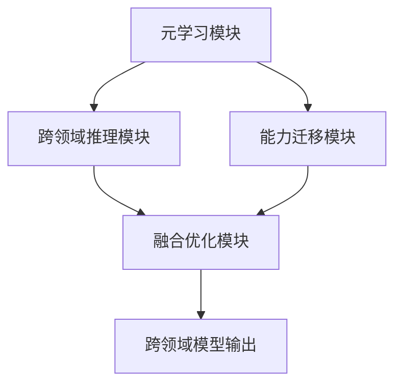

# 元学习驱动的跨领域推理能力迁移与融合优化

> 关键词：元学习、跨领域推理、能力迁移、融合优化、机器学习

> 摘要：本文聚焦于元学习驱动的跨领域推理能力迁移与融合优化这一前沿课题。首先介绍了研究的背景、目的、预期读者和文档结构，明确了核心术语和相关概念。接着阐述了元学习、跨领域推理、能力迁移与融合优化等核心概念及其联系，给出了相应的文本示意图和 Mermaid 流程图。详细讲解了核心算法原理，并通过 Python 代码进行了具体实现。运用数学模型和公式对相关理论进行了深入剖析，并举例说明。通过项目实战，展示了代码的实际应用和详细解读。探讨了该技术在多个实际场景中的应用，推荐了学习资源、开发工具框架以及相关论文著作。最后总结了未来发展趋势与挑战，提供了常见问题解答和扩展阅读参考资料，旨在为相关领域的研究和实践提供全面而深入的指导。

## 1. 背景介绍 
### 1.1 目的和范围
在当今的人工智能和机器学习领域，数据的多样性和复杂性不断增加，不同领域之间的数据特征和分布存在显著差异。传统的机器学习方法往往在单一领域表现良好，但在面对跨领域的任务时，其性能会大幅下降。元学习作为一种新兴的学习范式，旨在通过学习如何学习，让模型能够快速适应新的任务和领域。本研究的目的在于探索如何利用元学习驱动跨领域推理能力的迁移与融合优化，使模型能够在不同领域之间高效地共享和利用知识，提高模型在跨领域任务中的泛化能力和推理性能。

本研究的范围涵盖了元学习的基本理论、跨领域推理的方法、能力迁移与融合的技术，以及相关算法的设计与实现。通过理论分析、实验验证和实际应用案例，全面深入地探讨元学习驱动的跨领域推理能力迁移与融合优化的可行性和有效性。

### 1.2 预期读者
本文预期读者包括人工智能、机器学习、计算机科学等领域的研究人员、工程师和学生。对于希望深入了解元学习和跨领域推理技术的专业人士，本文将提供系统的理论知识和实践经验；对于初学者，本文将从基础概念入手，逐步引导读者理解和掌握相关技术。

### 1.3 文档结构概述
本文将按照以下结构进行组织：
- 核心概念与联系：介绍元学习、跨领域推理、能力迁移与融合优化等核心概念，并阐述它们之间的联系，给出相应的文本示意图和 Mermaid 流程图。
- 核心算法原理 & 具体操作步骤：详细讲解核心算法的原理，并通过 Python 代码实现具体操作步骤。
- 数学模型和公式 & 详细讲解 & 举例说明：运用数学模型和公式对相关理论进行深入分析，并通过具体例子进行说明。
- 项目实战：代码实际案例和详细解释说明：通过实际项目案例，展示代码的实现过程和应用效果，并对代码进行详细解读。
- 实际应用场景：探讨元学习驱动的跨领域推理能力迁移与融合优化在实际场景中的应用。
- 工具和资源推荐：推荐学习资源、开发工具框架以及相关论文著作。
- 总结：未来发展趋势与挑战：总结研究成果，分析未来发展趋势和面临的挑战。
- 附录：常见问题与解答：提供常见问题的解答，帮助读者更好地理解和应用相关技术。
- 扩展阅读 & 参考资料：提供扩展阅读的建议和相关参考资料，方便读者进一步深入研究。

### 1.4 术语表
#### 1.4.1 核心术语定义
- **元学习（Meta-learning）**：也称为“学习如何学习”，是一种让模型能够从多个任务中学习通用的学习策略和知识，以便快速适应新任务的学习范式。
- **跨领域推理（Cross-domain reasoning）**：指模型在不同领域之间进行推理和决策的能力，能够将一个领域的知识和经验应用到另一个领域。
- **能力迁移（Ability transfer）**：将模型在一个领域中学习到的能力和知识迁移到另一个领域，以提高模型在新领域的性能。
- **融合优化（Fusion optimization）**：将不同领域的知识和信息进行融合，并通过优化算法提高模型的整体性能。

#### 1.4.2 相关概念解释
- **任务（Task）**：在机器学习中，任务是指需要模型完成的具体目标，例如图像分类、语音识别等。
- **领域（Domain）**：指具有相似特征和分布的数据集合，例如医疗数据、金融数据等。
- **元知识（Meta-knowledge）**：元学习中学习到的通用知识和策略，可用于快速适应新任务。

#### 1.4.3 缩略词列表
- **ML（Machine Learning）**：机器学习
- **DL（Deep Learning）**：深度学习
- **MAML（Model-Agnostic Meta-Learning）**：模型无关元学习

## 2. 核心概念与联系 

### 核心概念原理
#### 元学习
元学习的核心思想是通过学习多个任务的经验，找到一种通用的学习策略，使得模型能够在面对新任务时快速适应。传统的机器学习方法通常在一个固定的数据集上进行训练，而元学习则在多个不同的任务上进行训练，学习任务之间的共性和差异。例如，在图像分类任务中，元学习可以学习到不同类别图像的特征表示方法，以及如何根据不同的任务调整模型的参数。

#### 跨领域推理
跨领域推理是指模型能够在不同领域之间进行推理和决策的能力。不同领域的数据往往具有不同的特征和分布，传统的机器学习模型在跨领域任务中容易出现过拟合或泛化能力不足的问题。跨领域推理需要模型能够识别不同领域之间的关联和差异，并将一个领域的知识和经验应用到另一个领域。例如，在医疗领域和金融领域，虽然数据的特征和含义不同，但都可以使用一些通用的数据分析方法和模型进行推理。

#### 能力迁移
能力迁移是将模型在一个领域中学习到的能力和知识迁移到另一个领域的过程。通过能力迁移，模型可以利用已有的知识和经验快速适应新领域的任务，减少在新领域中的训练时间和数据需求。例如，在图像识别领域训练的模型可以将其特征提取能力迁移到视频识别领域，提高视频识别的性能。

#### 融合优化
融合优化是将不同领域的知识和信息进行融合，并通过优化算法提高模型的整体性能。在跨领域任务中，不同领域的数据可能具有不同的重要性和可靠性，融合优化需要考虑如何合理地融合这些数据，以提高模型的准确性和稳定性。例如，在多模态数据处理中，融合优化可以将图像、文本和语音等不同模态的数据进行融合，提高模型的综合性能。

### 架构的文本示意图
```plaintext
              +-----------------+
              |    元学习模块    |
              +-----------------+
                    |
                    v
+-------------------+-------------------+
|   跨领域推理模块  |   能力迁移模块    |
+-------------------+-------------------+
                    |
                    v
              +-----------------+
              |   融合优化模块  |
              +-----------------+
                    |
                    v
              +-----------------+
              |  跨领域模型输出 |
              +-----------------+
```

### Mermaid 流程图


## 3. 核心算法原理 & 具体操作步骤 

### 核心算法原理
本研究采用模型无关元学习（MAML）作为核心算法。MAML 的核心思想是找到一组初始参数，使得模型在经过少量的梯度更新后，能够在新任务上取得较好的性能。具体来说，MAML 在训练过程中通过两个阶段的梯度更新来学习通用的初始参数：

#### 内循环
在内循环中，对于每个任务，使用当前的初始参数进行少量的梯度更新，得到每个任务的适应参数。

#### 外循环
在外循环中，使用所有任务的适应参数计算梯度，并更新初始参数，使得模型在所有任务上都能快速适应。

### 具体操作步骤及 Python 代码实现
```python
import torch
import torch.nn as nn
import torch.optim as optim

# 定义一个简单的神经网络模型
class SimpleModel(nn.Module):
    def __init__(self):
        super(SimpleModel, self).__init__()
        self.fc1 = nn.Linear(10, 20)
        self.fc2 = nn.Linear(20, 1)

    def forward(self, x):
        x = torch.relu(self.fc1(x))
        x = self.fc2(x)
        return x

# 定义 MAML 算法
class MAML:
    def __init__(self, model, lr_inner=0.01, lr_outer=0.001, num_inner_steps=1):
        self.model = model
        self.lr_inner = lr_inner
        self.lr_outer = lr_outer
        self.num_inner_steps = num_inner_steps
        self.optimizer = optim.Adam(self.model.parameters(), lr=lr_outer)

    def inner_loop(self, task_data):
        # 复制当前模型参数
        fast_weights = [p.clone() for p in self.model.parameters()]
        criterion = nn.MSELoss()
        for _ in range(self.num_inner_steps):
            inputs, targets = task_data
            outputs = self.model.forward_with_weights(inputs, fast_weights)
            loss = criterion(outputs, targets)
            # 计算梯度
            grads = torch.autograd.grad(loss, fast_weights)
            # 更新参数
            fast_weights = [w - self.lr_inner * g for w, g in zip(fast_weights, grads)]
        return fast_weights

    def outer_loop(self, tasks):
        meta_loss = 0
        for task_data in tasks:
            fast_weights = self.inner_loop(task_data)
            inputs, targets = task_data
            outputs = self.model.forward_with_weights(inputs, fast_weights)
            criterion = nn.MSELoss()
            loss = criterion(outputs, targets)
            meta_loss += loss
        meta_loss /= len(tasks)
        # 外循环更新参数
        self.optimizer.zero_grad()
        meta_loss.backward()
        self.optimizer.step()
        return meta_loss

# 使用示例
model = SimpleModel()
maml = MAML(model)
# 模拟一些任务数据
tasks = [
    (torch.randn(10, 10), torch.randn(10, 1)),
    (torch.randn(10, 10), torch.randn(10, 1))
]
for epoch in range(10):
    loss = maml.outer_loop(tasks)
    print(f'Epoch {epoch}, Loss: {loss.item()}')
```

### 代码解释
- `SimpleModel` 类定义了一个简单的神经网络模型，包含两个全连接层。
- `MAML` 类实现了 MAML 算法的核心逻辑，包括内循环和外循环。
    - `inner_loop` 方法实现了内循环的梯度更新，使用当前的初始参数进行少量的梯度更新，得到每个任务的适应参数。
    - `outer_loop` 方法实现了外循环的梯度更新，使用所有任务的适应参数计算梯度，并更新初始参数。
- 在使用示例中，我们创建了一个 `SimpleModel` 实例和一个 `MAML` 实例，模拟了一些任务数据，并进行了 10 个 epoch 的训练。

## 4. 数学模型和公式 & 详细讲解 & 举例说明 

### 数学模型和公式
#### 内循环
设模型的参数为 $\theta$，对于第 $i$ 个任务，其训练数据为 $(x_i, y_i)$，损失函数为 $L_i$。在内循环中，使用当前的参数 $\theta$ 进行 $k$ 步的梯度更新，得到适应参数 $\theta_i'$：

$$
\theta_{i}^{'}=\theta - \alpha \nabla_{\theta} L_i(f_{\theta}(x_i), y_i)
$$

其中，$\alpha$ 是内循环的学习率，$f_{\theta}$ 是模型的函数。

#### 外循环
在外循环中，使用所有任务的适应参数 $\theta_i'$ 计算元损失 $L_{meta}$：

$$
L_{meta}=\frac{1}{N}\sum_{i=1}^{N} L_i(f_{\theta_{i}^{'}}(x_i), y_i)
$$

其中，$N$ 是任务的数量。然后，使用元损失 $L_{meta}$ 对参数 $\theta$ 进行更新：

$$
\theta=\theta - \beta \nabla_{\theta} L_{meta}
$$

其中，$\beta$ 是外循环的学习率。

### 详细讲解
内循环的目的是让模型在每个任务上进行快速适应，通过少量的梯度更新得到每个任务的适应参数。外循环的目的是让模型学习到通用的初始参数，使得模型在所有任务上都能快速适应。通过不断地迭代内循环和外循环，模型可以学习到一种通用的学习策略，提高在新任务上的泛化能力。

### 举例说明
假设我们有两个任务，任务 1 和任务 2。每个任务的训练数据分别为 $(x_1, y_1)$ 和 $(x_2, y_2)$。初始参数为 $\theta$，内循环的学习率为 $\alpha = 0.01$，外循环的学习率为 $\beta = 0.001$。

#### 内循环
对于任务 1，计算损失 $L_1(f_{\theta}(x_1), y_1)$，并根据梯度更新公式得到适应参数 $\theta_1'$：

$$
\theta_{1}^{'}=\theta - 0.01 \nabla_{\theta} L_1(f_{\theta}(x_1), y_1)
$$

对于任务 2，同样计算损失 $L_2(f_{\theta}(x_2), y_2)$，并得到适应参数 $\theta_2'$：

$$
\theta_{2}^{'}=\theta - 0.01 \nabla_{\theta} L_2(f_{\theta}(x_2), y_2)
$$

#### 外循环
计算元损失 $L_{meta}$：

$$
L_{meta}=\frac{1}{2}(L_1(f_{\theta_{1}^{'}}(x_1), y_1)+L_2(f_{\theta_{2}^{'}}(x_2), y_2))
$$

然后，根据元损失更新初始参数 $\theta$：

$$
\theta=\theta - 0.001 \nabla_{\theta} L_{meta}
$$

通过不断地迭代内循环和外循环，模型可以学习到通用的初始参数，提高在新任务上的泛化能力。

## 5. 项目实战：代码实际案例和详细解释说明 

### 5.1  开发环境搭建
#### 安装 Python
首先，确保你已经安装了 Python 3.6 或更高版本。可以从 Python 官方网站（https://www.python.org/downloads/）下载并安装。

#### 安装依赖库
使用以下命令安装所需的依赖库：
```sh
pip install torch torchvision numpy matplotlib
```

### 5.2  源代码详细实现和代码解读
```python
import torch
import torch.nn as nn
import torch.optim as optim
import numpy as np
import matplotlib.pyplot as plt

# 定义一个简单的神经网络模型
class SimpleModel(nn.Module):
    def __init__(self):
        super(SimpleModel, self).__init__()
        self.fc1 = nn.Linear(1, 10)
        self.fc2 = nn.Linear(10, 1)

    def forward(self, x):
        x = torch.relu(self.fc1(x))
        x = self.fc2(x)
        return x

    def forward_with_weights(self, x, weights):
        # 使用给定的权重进行前向传播
        x = torch.relu(nn.functional.linear(x, weights[0], weights[1]))
        x = nn.functional.linear(x, weights[2], weights[3])
        return x

# 定义 MAML 算法
class MAML:
    def __init__(self, model, lr_inner=0.01, lr_outer=0.001, num_inner_steps=1):
        self.model = model
        self.lr_inner = lr_inner
        self.lr_outer = lr_outer
        self.num_inner_steps = num_inner_steps
        self.optimizer = optim.Adam(self.model.parameters(), lr=lr_outer)

    def inner_loop(self, task_data):
        # 复制当前模型参数
        fast_weights = [p.clone() for p in self.model.parameters()]
        criterion = nn.MSELoss()
        for _ in range(self.num_inner_steps):
            inputs, targets = task_data
            outputs = self.model.forward_with_weights(inputs, fast_weights)
            loss = criterion(outputs, targets)
            # 计算梯度
            grads = torch.autograd.grad(loss, fast_weights)
            # 更新参数
            fast_weights = [w - self.lr_inner * g for w, g in zip(fast_weights, grads)]
        return fast_weights

    def outer_loop(self, tasks):
        meta_loss = 0
        for task_data in tasks:
            fast_weights = self.inner_loop(task_data)
            inputs, targets = task_data
            outputs = self.model.forward_with_weights(inputs, fast_weights)
            criterion = nn.MSELoss()
            loss = criterion(outputs, targets)
            meta_loss += loss
        meta_loss /= len(tasks)
        # 外循环更新参数
        self.optimizer.zero_grad()
        meta_loss.backward()
        self.optimizer.step()
        return meta_loss

# 生成任务数据
def generate_tasks(num_tasks, num_points):
    tasks = []
    for _ in range(num_tasks):
        slope = np.random.uniform(-5, 5)
        intercept = np.random.uniform(-5, 5)
        x = torch.randn(num_points, 1)
        y = slope * x + intercept
        tasks.append((x, y))
    return tasks

# 训练模型
model = SimpleModel()
maml = MAML(model)
num_tasks = 10
num_points = 10
tasks = generate_tasks(num_tasks, num_points)
num_epochs = 100
losses = []
for epoch in range(num_epochs):
    loss = maml.outer_loop(tasks)
    losses.append(loss.item())
    if epoch % 10 == 0:
        print(f'Epoch {epoch}, Loss: {loss.item()}')

# 绘制损失曲线
plt.plot(losses)
plt.xlabel('Epoch')
plt.ylabel('Loss')
plt.title('MAML Training Loss')
plt.show()
```

### 5.3  代码解读与分析
#### 模型定义
- `SimpleModel` 类定义了一个简单的神经网络模型，包含一个输入层、一个隐藏层和一个输出层。`forward` 方法实现了正常的前向传播，`forward_with_weights` 方法实现了使用给定权重进行前向传播。

#### MAML 算法实现
- `MAML` 类实现了 MAML 算法的核心逻辑，包括内循环和外循环。`inner_loop` 方法实现了内循环的梯度更新，`outer_loop` 方法实现了外循环的梯度更新。

#### 数据生成
- `generate_tasks` 函数用于生成多个任务的数据，每个任务的目标函数是一个线性函数，斜率和截距随机生成。

#### 训练过程
- 在训练过程中，我们使用 `MAML` 类的 `outer_loop` 方法进行训练，并记录每个 epoch 的损失。最后，绘制损失曲线，观察模型的训练效果。

## 6. 实际应用场景 
### 医疗领域
在医疗领域，不同的疾病诊断和治疗任务可能具有不同的数据特征和分布。元学习驱动的跨领域推理能力迁移与融合优化可以帮助医生快速诊断新的疾病，提高诊断的准确性和效率。例如，将在一种疾病诊断任务中学习到的特征提取和分类能力迁移到另一种疾病的诊断中，减少对新疾病数据的需求。

### 金融领域
在金融领域，不同的投资策略和风险评估任务可能需要处理不同类型的数据。元学习可以帮助金融机构快速适应新的市场环境，提高投资决策的准确性和风险控制能力。例如，将在股票市场投资任务中学习到的模型参数和策略迁移到债券市场或期货市场的投资中。

### 自动驾驶领域
在自动驾驶领域，不同的驾驶场景和环境可能具有不同的视觉、雷达和传感器数据特征。元学习可以帮助自动驾驶车辆快速适应新的驾驶场景，提高自动驾驶的安全性和可靠性。例如，将在城市道路驾驶任务中学习到的决策和控制能力迁移到高速公路或乡村道路的驾驶中。

### 教育领域
在教育领域，不同的学科和教学任务可能需要不同的教学方法和策略。元学习可以帮助教师快速适应新的教学任务，提高教学效果和学生的学习成绩。例如，将在数学教学任务中学习到的教学方法和评估策略迁移到语文或英语教学中。

## 7. 工具和资源推荐
### 7.1 学习资源推荐
#### 7.1.1 书籍推荐
- 《深度学习》（Deep Learning）：由 Ian Goodfellow、Yoshua Bengio 和 Aaron Courville 编写，是深度学习领域的经典教材，涵盖了深度学习的基本原理、算法和应用。
- 《机器学习》（Machine Learning）：由 Tom Mitchell 编写，是机器学习领域的经典教材，系统地介绍了机器学习的基本概念、算法和应用。
- 《元学习：理论与实践》（Meta-Learning: Theory and Practice）：详细介绍了元学习的理论和方法，包括模型无关元学习、基于度量的元学习等。

#### 7.1.2 在线课程
- Coursera 上的“深度学习专项课程”（Deep Learning Specialization）：由 Andrew Ng 教授授课，涵盖了深度学习的各个方面，包括神经网络、卷积神经网络、循环神经网络等。
- edX 上的“人工智能导论”（Introduction to Artificial Intelligence）：由麻省理工学院（MIT）的 Patrick Winston 教授授课，系统地介绍了人工智能的基本概念、算法和应用。
- 百度飞桨的“元学习教程”：提供了元学习的基础知识和实践案例，帮助学习者快速掌握元学习的方法和应用。

#### 7.1.3 技术博客和网站
- Medium 上的“Towards Data Science”：是一个专注于数据科学和机器学习的技术博客，提供了大量的技术文章和实践案例。
- arXiv.org：是一个预印本论文库，包含了计算机科学、物理学、数学等领域的最新研究成果，是获取最新技术信息的重要来源。
- OpenAI 的官方博客：提供了 OpenAI 在人工智能领域的最新研究成果和技术进展。

### 7.2 开发工具框架推荐
#### 7.2.1 IDE和编辑器
- PyCharm：是一款专业的 Python 集成开发环境（IDE），提供了丰富的代码编辑、调试和分析功能，适合开发大规模的 Python 项目。
- Jupyter Notebook：是一个交互式的开发环境，支持 Python、R 等多种编程语言，适合进行数据探索、模型训练和可视化。
- Visual Studio Code：是一款轻量级的代码编辑器，支持多种编程语言和插件扩展，适合快速开发和调试代码。

#### 7.2.2 调试和性能分析工具
- PyTorch Profiler：是 PyTorch 提供的性能分析工具，可以帮助开发者分析模型的训练时间、内存使用情况等，优化模型的性能。
- TensorBoard：是 TensorFlow 提供的可视化工具，也可以用于 PyTorch 模型的可视化，帮助开发者观察模型的训练过程和性能指标。
- cProfile：是 Python 内置的性能分析工具，可以帮助开发者分析代码的运行时间和函数调用情况，找出性能瓶颈。

#### 7.2.3 相关框架和库
- PyTorch：是一个开源的深度学习框架，提供了丰富的神经网络层和优化算法，支持 GPU 加速，适合进行深度学习模型的开发和训练。
- TensorFlow：是另一个开源的深度学习框架，由 Google 开发，提供了高度灵活的模型构建和部署功能，广泛应用于工业界和学术界。
- Scikit-learn：是一个开源的机器学习库，提供了丰富的机器学习算法和工具，适合进行传统机器学习任务的开发和实验。

### 7.3 相关论文著作推荐
#### 7.3.1 经典论文
- "Model-Agnostic Meta-Learning for Fast Adaptation of Deep Networks"：介绍了模型无关元学习（MAML）算法，是元学习领域的经典论文之一。
- "Matching Networks for One Shot Learning"：提出了基于度量的元学习方法，通过学习样本之间的相似度进行少样本学习。
- "Prototypical Networks for Few-shot Learning"：提出了原型网络（Prototypical Networks），用于解决少样本学习问题。

#### 7.3.2 最新研究成果
- 可以关注 arXiv.org 上的最新论文，以及顶级学术会议（如 NeurIPS、ICML、CVPR 等）上的研究成果，了解元学习和跨领域推理的最新发展动态。

#### 7.3.3 应用案例分析
- 可以参考一些实际应用案例的论文，了解元学习和跨领域推理在不同领域的应用方法和效果，如医疗、金融、自动驾驶等领域。

## 8. 总结：未来发展趋势与挑战
### 未来发展趋势
- **与其他技术的融合**：元学习将与强化学习、迁移学习、联邦学习等技术进一步融合，形成更加强大的学习范式，提高模型的泛化能力和适应性。
- **应用领域的拓展**：元学习将在更多的领域得到应用，如自然语言处理、计算机视觉、生物信息学等，为解决复杂的实际问题提供有效的方法。
- **理论研究的深入**：随着元学习的广泛应用，对其理论基础的研究将更加深入，如元学习的收敛性分析、泛化误差界等，为元学习的发展提供更加坚实的理论支持。

### 挑战
- **数据的多样性和复杂性**：跨领域任务的数据往往具有不同的特征和分布，如何处理数据的多样性和复杂性是元学习面临的一个重要挑战。
- **计算资源的需求**：元学习通常需要在多个任务上进行训练，计算资源的需求较大，如何提高元学习的计算效率是一个亟待解决的问题。
- **模型的可解释性**：元学习模型通常比较复杂，其决策过程难以解释，如何提高元学习模型的可解释性是一个重要的研究方向。

## 9. 附录：常见问题与解答
### 问题 1：元学习和传统机器学习有什么区别？
传统机器学习通常在一个固定的数据集上进行训练，模型的泛化能力主要依赖于训练数据的质量和数量。而元学习则在多个不同的任务上进行训练，学习任务之间的共性和差异，使得模型能够快速适应新任务。元学习可以看作是一种“学习如何学习”的方法，通过学习通用的学习策略来提高模型的泛化能力。

### 问题 2：MAML 算法的复杂度如何？
MAML 算法的复杂度主要取决于内循环和外循环的迭代次数、模型的参数数量以及任务的数量。内循环的复杂度主要是计算梯度和更新参数的复杂度，外循环的复杂度主要是计算元损失和更新初始参数的复杂度。一般来说，MAML 算法的复杂度较高，尤其是在处理大规模任务和复杂模型时。

### 问题 3：如何选择合适的内循环和外循环学习率？
内循环和外循环学习率的选择通常需要通过实验进行调优。一般来说，内循环学习率可以选择较大的值，以便模型能够快速适应新任务；外循环学习率可以选择较小的值，以保证模型的稳定性。可以使用网格搜索、随机搜索等方法来寻找合适的学习率组合。

### 问题 4：元学习在少样本学习中的应用效果如何？
元学习在少样本学习中具有很好的应用效果。由于元学习可以学习到通用的学习策略，使得模型能够在少量样本的情况下快速适应新任务。在一些少样本学习的基准数据集上，元学习方法往往能够取得比传统机器学习方法更好的性能。

## 10. 扩展阅读 & 参考资料
### 扩展阅读
- 可以进一步阅读关于强化学习、迁移学习、联邦学习等相关技术的书籍和论文，了解它们与元学习的关系和融合方法。
- 关注人工智能领域的最新研究动态和技术进展，了解元学习在不同领域的应用案例和实践经验。

### 参考资料
- 本文中引用的所有论文、书籍、在线课程和技术博客等资料都可以作为参考资料，进一步深入研究元学习和跨领域推理的相关知识。

作者：AI天才研究院/AI Genius Institute & 禅与计算机程序设计艺术 /Zen And The Art of Computer Programming