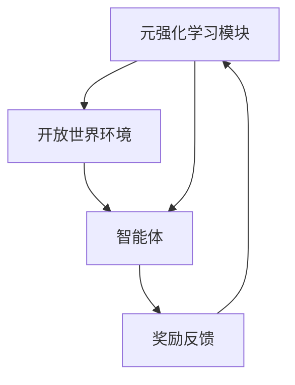

# 元强化学习在开放世界推理中的应用

> 关键词：元强化学习、开放世界推理、强化学习算法、智能决策、自适应学习

> 摘要：本文深入探讨了元强化学习在开放世界推理中的应用。首先介绍了元强化学习和开放世界推理的背景知识，包括目的、预期读者、文档结构和相关术语。接着阐述了核心概念及其联系，给出了原理和架构的文本示意图与 Mermaid 流程图。详细讲解了核心算法原理，并用 Python 代码进行说明，同时介绍了相关的数学模型和公式。通过项目实战，展示了代码的实际案例和详细解释。分析了元强化学习在开放世界推理中的实际应用场景，推荐了学习资源、开发工具框架和相关论文著作。最后总结了未来发展趋势与挑战，并提供了常见问题解答和扩展阅读参考资料，旨在为读者全面了解元强化学习在开放世界推理中的应用提供深入的技术指导。

## 1. 背景介绍 
### 1.1 目的和范围
元强化学习作为强化学习领域的前沿技术，旨在让智能体能够快速适应新的任务和环境变化。开放世界推理则面临着环境复杂、信息不完全、任务动态变化等挑战。本文的目的是探讨如何将元强化学习应用于开放世界推理中，提高智能体在开放世界环境下的决策能力和适应性。范围涵盖了元强化学习的核心概念、算法原理、数学模型，以及在实际开放世界场景中的应用案例。

### 1.2 预期读者
本文预期读者包括对人工智能、强化学习、机器学习等领域感兴趣的研究人员、开发者、学生。尤其是那些希望深入了解元强化学习在复杂开放环境中应用的专业人士，以及正在从事相关领域研究和项目开发的人员。

### 1.3 文档结构概述
本文将按照以下结构进行阐述：首先介绍核心概念与联系，帮助读者建立基本的理论框架；接着详细讲解核心算法原理和具体操作步骤，并用 Python 代码进行实现；然后介绍相关的数学模型和公式，并举例说明；通过项目实战展示代码的实际应用和详细解释；分析元强化学习在开放世界推理中的实际应用场景；推荐学习资源、开发工具框架和相关论文著作；最后总结未来发展趋势与挑战，提供常见问题解答和扩展阅读参考资料。

### 1.4 术语表
#### 1.4.1 核心术语定义
- **元强化学习（Meta-Reinforcement Learning）**：是一种让智能体能够从多个任务中学习到通用的学习策略，从而能够快速适应新任务的强化学习方法。
- **开放世界推理（Open World Reasoning）**：指在环境信息不完全、任务动态变化、存在大量未知因素的开放世界环境中，智能体进行推理和决策的过程。
- **强化学习（Reinforcement Learning）**：智能体通过与环境进行交互，根据环境反馈的奖励信号来学习最优策略的机器学习方法。
- **智能体（Agent）**：在强化学习中，与环境进行交互并做出决策的实体。
- **环境（Environment）**：智能体所处的外部世界，智能体的行为会影响环境，环境会反馈奖励信号给智能体。

#### 1.4.2 相关概念解释
- **策略（Policy）**：智能体在不同状态下选择动作的规则。在强化学习中，目标是学习到最优策略，使得智能体在环境中获得最大的累积奖励。
- **奖励（Reward）**：环境反馈给智能体的数值信号，用于表示智能体的行为在当前环境下的好坏程度。智能体的目标是最大化累积奖励。
- **状态（State）**：环境在某一时刻的特征描述，智能体根据当前状态选择动作。

#### 1.4.3 缩略词列表
- **MDP（Markov Decision Process）**：马尔可夫决策过程，是一种用于描述强化学习问题的数学模型。
- **RL（Reinforcement Learning）**：强化学习。
- **Meta-RL（Meta-Reinforcement Learning）**：元强化学习。

## 2. 核心概念与联系 

### 核心概念原理
#### 元强化学习原理
元强化学习的核心思想是让智能体在多个任务上进行训练，学习到一种通用的学习策略，使得智能体在面对新任务时能够快速适应。传统的强化学习通常是针对单个任务进行训练，当任务发生变化时，智能体需要重新进行大量的训练才能适应新任务。而元强化学习通过在多个任务上的学习，能够捕捉到任务之间的共性和规律，从而在新任务上快速学习。

#### 开放世界推理原理
开放世界推理是在环境信息不完全、任务动态变化的情况下，智能体根据已有的知识和观察到的信息进行推理和决策。在开放世界中，智能体可能会遇到未知的情况和新的任务，需要具备一定的推理能力和适应性。智能体需要不断地探索环境，收集信息，更新自己的知识和策略，以应对各种变化。

### 架构的文本示意图
```plaintext
元强化学习在开放世界推理中的架构

+---------------------+
| 元强化学习模块      |
| - 元策略网络        |
| - 元优化器          |
+---------------------+
         |
         v
+---------------------+
| 开放世界环境        |
| - 动态任务          |
| - 不完全信息        |
+---------------------+
         |
         v
+---------------------+
| 智能体              |
| - 策略网络          |
| - 动作选择          |
+---------------------+
         |
         v
+---------------------+
| 奖励反馈            |
| - 环境奖励          |
| - 任务奖励          |
+---------------------+
```

### Mermaid 流程图


## 3. 核心算法原理 & 具体操作步骤 

### 核心算法原理
元强化学习中常用的算法是基于模型无关的方法，如 MAML（Model-Agnostic Meta-Learning）。MAML 的核心思想是找到一个初始的模型参数，使得在经过少量的梯度更新后，模型能够在新任务上取得较好的性能。

### 具体操作步骤
1. **任务采样**：从任务分布中采样一批任务。
2. **内循环更新**：对于每个采样的任务，使用当前的模型参数进行训练，得到每个任务的梯度。
3. **外循环更新**：根据内循环得到的梯度，更新模型的初始参数。
4. **重复步骤 1 - 3**：直到模型收敛。

### Python 代码实现
```python
import torch
import torch.nn as nn
import torch.optim as optim

# 定义一个简单的策略网络
class PolicyNetwork(nn.Module):
    def __init__(self, input_size, output_size):
        super(PolicyNetwork, self).__init__()
        self.fc1 = nn.Linear(input_size, 64)
        self.fc2 = nn.Linear(64, output_size)

    def forward(self, x):
        x = torch.relu(self.fc1(x))
        x = self.fc2(x)
        return x

# 定义 MAML 算法
class MAML:
    def __init__(self, model, lr_inner, lr_outer):
        self.model = model
        self.lr_inner = lr_inner
        self.lr_outer = lr_outer
        self.optimizer = optim.Adam(self.model.parameters(), lr=lr_outer)

    def inner_update(self, task_data, inner_steps):
        temp_model = PolicyNetwork(*list(self.model.parameters())[0].shape)
        temp_model.load_state_dict(self.model.state_dict())
        inner_optimizer = optim.SGD(temp_model.parameters(), lr=self.lr_inner)
        for _ in range(inner_steps):
            states, actions, rewards = task_data
            outputs = temp_model(states)
            loss = nn.MSELoss()(outputs, rewards)
            inner_optimizer.zero_grad()
            loss.backward()
            inner_optimizer.step()
        return temp_model

    def outer_update(self, tasks, inner_steps):
        meta_loss = 0
        for task in tasks:
            temp_model = self.inner_update(task, inner_steps)
            states, actions, rewards = task
            outputs = temp_model(states)
            loss = nn.MSELoss()(outputs, rewards)
            meta_loss += loss
        self.optimizer.zero_grad()
        meta_loss.backward()
        self.optimizer.step()

# 示例使用
input_size = 10
output_size = 5
model = PolicyNetwork(input_size, output_size)
maml = MAML(model, lr_inner=0.01, lr_outer=0.001)

# 模拟一些任务数据
tasks = []
for _ in range(10):
    states = torch.randn(20, input_size)
    actions = torch.randint(0, output_size, (20,))
    rewards = torch.randn(20, output_size)
    tasks.append((states, actions, rewards))

# 进行元训练
for _ in range(100):
    maml.outer_update(tasks, inner_steps=5)
```

## 4. 数学模型和公式 & 详细讲解 & 举例说明 

### 马尔可夫决策过程（MDP）
马尔可夫决策过程是强化学习中常用的数学模型，它可以用一个五元组 $<S, A, P, R, \gamma>$ 表示，其中：
- $S$ 是状态空间，表示环境的所有可能状态。
- $A$ 是动作空间，表示智能体可以采取的所有动作。
- $P: S \times A \times S \rightarrow [0, 1]$ 是状态转移概率函数，表示在状态 $s$ 采取动作 $a$ 后转移到状态 $s'$ 的概率。
- $R: S \times A \rightarrow \mathbb{R}$ 是奖励函数，表示在状态 $s$ 采取动作 $a$ 后获得的奖励。
- $\gamma \in [0, 1]$ 是折扣因子，用于衡量未来奖励的重要性。

### 策略梯度定理
策略梯度定理是强化学习中用于优化策略的重要定理。策略 $\pi_{\theta}$ 是一个参数化的策略，其中 $\theta$ 是策略的参数。策略梯度定理给出了策略梯度的计算公式：
$$\nabla_{\theta} J(\theta) = \mathbb{E}_{\tau \sim \pi_{\theta}} \left[ \sum_{t=0}^{T} \nabla_{\theta} \log \pi_{\theta}(a_t|s_t) Q^{\pi_{\theta}}(s_t, a_t) \right]$$
其中，$\tau = (s_0, a_0, r_0, s_1, a_1, r_1, \cdots, s_T, a_T, r_T)$ 是一个轨迹，$Q^{\pi_{\theta}}(s_t, a_t)$ 是动作价值函数，表示在状态 $s_t$ 采取动作 $a_t$ 后，遵循策略 $\pi_{\theta}$ 所能获得的期望累积奖励。

### 举例说明
假设我们有一个简单的网格世界环境，智能体的目标是从起点移动到终点。状态空间 $S$ 是网格世界中的所有位置，动作空间 $A$ 是上下左右四个方向的移动。状态转移概率 $P$ 表示智能体在某个位置采取某个动作后移动到下一个位置的概率。奖励函数 $R$ 可以定义为到达终点获得正奖励，撞到障碍物获得负奖励。

我们可以使用策略梯度算法来优化智能体的策略。首先，初始化策略的参数 $\theta$，然后根据策略 $\pi_{\theta}$ 与环境进行交互，收集轨迹数据。根据策略梯度定理计算策略梯度 $\nabla_{\theta} J(\theta)$，并使用梯度上升法更新策略的参数 $\theta$。经过多次迭代，智能体的策略会逐渐优化，最终能够找到从起点到终点的最优路径。

## 5. 项目实战：代码实际案例和详细解释说明 

### 5.1  开发环境搭建
- **操作系统**：推荐使用 Linux 或 macOS 系统，也可以使用 Windows 系统。
- **Python 版本**：建议使用 Python 3.7 及以上版本。
- **依赖库安装**：使用以下命令安装所需的依赖库：
```bash
pip install torch numpy gym
```
其中，`torch` 是 PyTorch 深度学习框架，`numpy` 是用于数值计算的库，`gym` 是 OpenAI 提供的强化学习环境库。

### 5.2  源代码详细实现和代码解读
```python
import torch
import torch.nn as nn
import torch.optim as optim
import numpy as np
import gym

# 定义策略网络
class PolicyNetwork(nn.Module):
    def __init__(self, input_size, output_size):
        super(PolicyNetwork, self).__init__()
        self.fc1 = nn.Linear(input_size, 64)
        self.fc2 = nn.Linear(64, output_size)

    def forward(self, x):
        x = torch.relu(self.fc1(x))
        x = self.fc2(x)
        return torch.softmax(x, dim=-1)

# 定义元强化学习智能体
class MetaAgent:
    def __init__(self, input_size, output_size, lr_inner, lr_outer):
        self.model = PolicyNetwork(input_size, output_size)
        self.lr_inner = lr_inner
        self.lr_outer = lr_outer
        self.optimizer = optim.Adam(self.model.parameters(), lr=lr_outer)

    def inner_update(self, task_env, inner_steps):
        temp_model = PolicyNetwork(*list(self.model.parameters())[0].shape)
        temp_model.load_state_dict(self.model.state_dict())
        inner_optimizer = optim.SGD(temp_model.parameters(), lr=self.lr_inner)
        for _ in range(inner_steps):
            state = task_env.reset()
            done = False
            while not done:
                state = torch.FloatTensor(state).unsqueeze(0)
                probs = temp_model(state)
                action = torch.multinomial(probs, 1).item()
                next_state, reward, done, _ = task_env.step(action)
                loss = -torch.log(probs.squeeze(0)[action]) * reward
                inner_optimizer.zero_grad()
                loss.backward()
                inner_optimizer.step()
                state = next_state
        return temp_model

    def outer_update(self, tasks, inner_steps):
        meta_loss = 0
        for task in tasks:
            task_env = gym.make(task)
            temp_model = self.inner_update(task_env, inner_steps)
            state = task_env.reset()
            done = False
            total_reward = 0
            while not done:
                state = torch.FloatTensor(state).unsqueeze(0)
                probs = temp_model(state)
                action = torch.multinomial(probs, 1).item()
                next_state, reward, done, _ = task_env.step(action)
                total_reward += reward
                state = next_state
            meta_loss += -total_reward
        self.optimizer.zero_grad()
        meta_loss.backward()
        self.optimizer.step()

# 主函数
if __name__ == "__main__":
    input_size = 4
    output_size = 2
    lr_inner = 0.01
    lr_outer = 0.001
    agent = MetaAgent(input_size, output_size, lr_inner, lr_outer)
    tasks = ["CartPole-v1", "MountainCar-v0"]
    for _ in range(100):
        agent.outer_update(tasks, inner_steps=5)
```

### 代码解读与分析
- **策略网络定义**：`PolicyNetwork` 类定义了一个简单的全连接神经网络，用于输出动作的概率分布。
- **元强化学习智能体**：`MetaAgent` 类实现了元强化学习的核心逻辑，包括内循环更新和外循环更新。
    - **内循环更新**：`inner_update` 方法在单个任务上对临时模型进行训练，使用 SGD 优化器进行梯度更新。
    - **外循环更新**：`outer_update` 方法在多个任务上进行元训练，根据内循环得到的临时模型在任务上的表现计算元损失，并使用 Adam 优化器更新主模型的参数。
- **主函数**：在主函数中，我们创建了一个元强化学习智能体，并在两个不同的任务上进行训练。

## 6. 实际应用场景 
### 机器人导航
在机器人导航领域，开放世界环境充满了各种未知因素，如障碍物的位置、动态的人流等。元强化学习可以帮助机器人快速适应不同的环境布局和任务要求。例如，机器人在一个新的建筑物中导航，通过元强化学习，它可以利用之前在其他建筑物中学习到的经验，快速规划出到达目标地点的路径。

### 游戏智能体
在复杂的游戏环境中，如策略游戏、角色扮演游戏等，游戏规则和任务可能会不断变化。元强化学习可以使游戏智能体快速适应新的游戏场景和任务。例如，在一款策略游戏中，当游戏更新了新的地图和资源系统时，智能体可以利用元强化学习快速调整自己的策略，提高游戏表现。

### 自动驾驶
自动驾驶汽车面临着开放世界的复杂交通环境，包括不同的道路条件、交通规则和其他车辆的行为。元强化学习可以帮助自动驾驶汽车快速适应不同的驾驶场景，如城市道路、高速公路、乡村道路等。例如，当自动驾驶汽车进入一个新的城市时，它可以利用元强化学习快速学习该城市的交通规则和驾驶习惯。

## 7. 工具和资源推荐
### 7.1 学习资源推荐
#### 7.1.1 书籍推荐
- 《Reinforcement Learning: An Introduction》：由 Richard S. Sutton 和 Andrew G. Barto 编写，是强化学习领域的经典教材，涵盖了强化学习的基本概念、算法和应用。
- 《Deep Reinforcement Learning Hands-On》：由 Maxim Lapan 编写，介绍了深度强化学习的实践方法，包括使用 PyTorch 实现各种强化学习算法。

#### 7.1.2 在线课程
- Coursera 上的《Reinforcement Learning Specialization》：由 University of Alberta 提供，系统地介绍了强化学习的理论和实践。
- Udemy 上的《Deep Reinforcement Learning in Python》：通过实际案例讲解如何使用 Python 和 PyTorch 实现深度强化学习算法。

#### 7.1.3 技术博客和网站
- OpenAI Blog：OpenAI 官方博客，发布了许多关于强化学习和人工智能的最新研究成果和应用案例。
- Medium 上的 Towards Data Science：包含了大量关于机器学习、强化学习的技术文章和教程。

### 7.2 开发工具框架推荐
#### 7.2.1 IDE和编辑器
- PyCharm：一款专业的 Python 集成开发环境，提供了丰富的代码编辑、调试和分析功能。
- Jupyter Notebook：交互式的开发环境，适合进行数据分析、模型训练和实验验证。

#### 7.2.2 调试和性能分析工具
- TensorBoard：TensorFlow 提供的可视化工具，可以用于监控模型的训练过程、可视化损失函数和指标等。
- Py-Spy：一个用于分析 Python 代码性能的工具，可以帮助找出代码中的性能瓶颈。

#### 7.2.3 相关框架和库
- PyTorch：一个开源的深度学习框架，提供了丰富的神经网络模块和优化算法，广泛应用于强化学习领域。
- Gym：OpenAI 提供的强化学习环境库，包含了各种经典的强化学习环境，方便开发者进行算法测试和验证。

### 7.3 相关论文著作推荐
#### 7.3.1 经典论文
- "Model-Agnostic Meta-Learning for Fast Adaptation of Deep Networks"：介绍了 MAML 算法，是元强化学习领域的经典论文。
- "Deep Reinforcement Learning with Double Q-learning"：提出了 Double Q-learning 算法，用于解决传统 Q-learning 算法中的过估计问题。

#### 7.3.2 最新研究成果
- 关注 arXiv 上关于元强化学习和开放世界推理的最新论文，了解该领域的前沿研究动态。

#### 7.3.3 应用案例分析
- 查看各大人工智能会议（如 NeurIPS、ICML、AAAI 等）上的相关论文，了解元强化学习在不同领域的实际应用案例。

## 8. 总结：未来发展趋势与挑战
### 未来发展趋势
- **多模态融合**：将元强化学习与多模态信息（如视觉、听觉、触觉等）相结合，使智能体能够在更复杂的开放世界环境中进行推理和决策。
- **与人类协作**：元强化学习智能体将与人类进行更紧密的协作，例如在医疗、教育、工业等领域，智能体可以辅助人类完成任务，并从人类的反馈中快速学习。
- **可解释性增强**：提高元强化学习模型的可解释性，使人们能够理解智能体的决策过程和推理逻辑，从而更好地应用于实际场景。

### 挑战
- **计算资源需求**：元强化学习通常需要大量的计算资源和时间进行训练，如何在有限的计算资源下提高训练效率是一个挑战。
- **泛化能力**：在开放世界环境中，智能体需要具备更强的泛化能力，能够适应各种未知的情况和任务。如何提高智能体的泛化能力是当前研究的重点。
- **伦理和安全问题**：随着元强化学习智能体在实际场景中的应用越来越广泛，伦理和安全问题也日益凸显。例如，智能体的决策可能会对人类产生影响，如何确保智能体的行为符合伦理和安全标准是一个重要的挑战。

## 9. 附录：常见问题与解答
### 问题 1：元强化学习和传统强化学习有什么区别？
答：传统强化学习通常是针对单个任务进行训练，当任务发生变化时，智能体需要重新进行大量的训练才能适应新任务。而元强化学习通过在多个任务上进行训练，学习到一种通用的学习策略，使得智能体在面对新任务时能够快速适应。

### 问题 2：MAML 算法的优缺点是什么？
答：优点：MAML 算法具有模型无关性，可以应用于各种类型的模型；能够在少量的梯度更新后快速适应新任务。缺点：MAML 算法的训练过程比较复杂，需要大量的计算资源和时间；对于一些复杂的任务，可能需要更多的训练数据和迭代次数才能取得较好的效果。

### 问题 3：如何评估元强化学习智能体在开放世界推理中的性能？
答：可以使用多种指标来评估智能体的性能，如累积奖励、成功率、平均步数等。此外，还可以通过在不同的开放世界环境和任务上进行测试，评估智能体的泛化能力和适应性。

## 10. 扩展阅读 & 参考资料
- Sutton, R. S., & Barto, A. G. (2018). Reinforcement Learning: An Introduction. MIT press.
- Lapan, M. (2018). Deep Reinforcement Learning Hands-On. Packt Publishing.
- Finn, C., Abbeel, P., & Levine, S. (2017). Model-Agnostic Meta-Learning for Fast Adaptation of Deep Networks. arXiv preprint arXiv:1703.03400.
- Hasselt, H. V., Guez, A., & Silver, D. (2015). Deep Reinforcement Learning with Double Q-learning. arXiv preprint arXiv:1509.06461.

作者：AI天才研究院/AI Genius Institute & 禅与计算机程序设计艺术 /Zen And The Art of Computer Programming