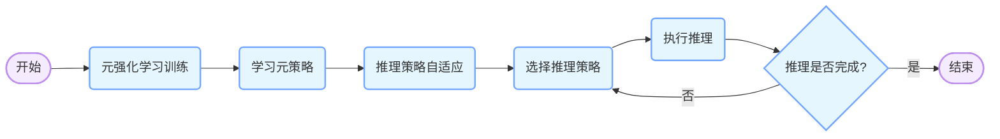

# 元强化学习在推理策略自适应中的创新应用

> 关键词：元强化学习、推理策略自适应、强化学习算法、智能决策、自适应系统

> 摘要：本文深入探讨了元强化学习在推理策略自适应中的创新应用。首先介绍了相关背景知识，包括目的、预期读者、文档结构和术语表。接着阐述了核心概念与联系，给出了原理和架构的示意图及流程图。详细讲解了核心算法原理，并用 Python 代码进行了说明。还介绍了数学模型和公式，并举例说明。通过项目实战展示了代码的实际应用和详细解读。分析了实际应用场景，推荐了学习资源、开发工具框架和相关论文著作。最后总结了未来发展趋势与挑战，提供了常见问题解答和扩展阅读参考资料，旨在为读者全面呈现元强化学习在推理策略自适应领域的应用情况。

## 1. 背景介绍 
### 1.1 目的和范围
元强化学习作为强化学习领域的前沿研究方向，旨在让智能体能够快速学习和适应新的任务和环境。推理策略自适应则是在复杂多变的场景中，使推理过程能够根据实际情况动态调整策略。本文的目的是深入研究元强化学习如何在推理策略自适应中发挥创新作用，探讨其原理、算法、应用场景等方面的内容。范围涵盖了从基础概念的介绍到实际项目的案例分析，以及相关工具和资源的推荐。

### 1.2 预期读者
本文预期读者包括计算机科学、人工智能、机器学习等领域的研究人员、工程师和学生。对于对元强化学习和推理策略自适应感兴趣，希望深入了解其技术原理和应用实践的人士具有较高的参考价值。

### 1.3 文档结构概述
本文首先介绍背景知识，为读者建立基本的认知框架。接着阐述核心概念与联系，使读者理解元强化学习和推理策略自适应的本质和关联。然后详细讲解核心算法原理和具体操作步骤，通过 Python 代码进行说明。随后介绍数学模型和公式，并举例进行详细讲解。通过项目实战展示代码的实际应用和解读。分析实际应用场景，为读者提供实际的应用参考。推荐相关的学习资源、开发工具框架和论文著作。最后总结未来发展趋势与挑战，提供常见问题解答和扩展阅读参考资料。

### 1.4 术语表
#### 1.4.1 核心术语定义
- **元强化学习（Meta-Reinforcement Learning）**：是一种强化学习的扩展，旨在让智能体学习如何快速学习新的任务，通过在多个相关任务上进行训练，从而在面对新任务时能够更高效地调整策略。
- **推理策略自适应（Reasoning Strategy Adaptation）**：指在推理过程中，根据不同的环境和任务需求，动态调整推理策略，以提高推理的准确性和效率。
- **强化学习（Reinforcement Learning）**：一种机器学习范式，智能体通过与环境进行交互，根据环境反馈的奖励信号来学习最优策略。

#### 1.4.2 相关概念解释
- **智能体（Agent）**：在强化学习和元强化学习中，智能体是与环境进行交互的实体，它根据当前的状态选择行动，并根据环境的反馈进行学习和调整。
- **环境（Environment）**：智能体所处的外部世界，它为智能体提供状态信息，并根据智能体的行动给出奖励信号。
- **策略（Policy）**：智能体在不同状态下选择行动的规则，它决定了智能体的行为方式。

#### 1.4.3 缩略词列表
- **RL**：Reinforcement Learning，强化学习
- **MRL**：Meta-Reinforcement Learning，元强化学习

## 2. 核心概念与联系 

### 核心概念原理
元强化学习的核心原理在于让智能体学习一种通用的学习能力，而不仅仅是针对特定任务的策略。通过在多个相关任务上进行训练，智能体可以学习到任务之间的共性和差异，从而在面对新任务时能够快速调整策略。推理策略自适应则是在推理过程中，根据不同的情况动态选择合适的推理策略。例如，在知识图谱推理中，根据图谱的结构和查询的特点，选择不同的推理算法。

元强化学习与推理策略自适应的联系在于，元强化学习可以为推理策略自适应提供一种有效的方法。通过元强化学习，智能体可以学习到在不同的推理场景下如何选择最优的推理策略，从而提高推理的性能。

### 架构的文本示意图
```plaintext
+-------------------+
| 元强化学习模块    |
|  - 元策略网络     |
|  - 元学习算法     |
+-------------------+
       |
       v
+-------------------+
| 推理策略自适应模块 |
|  - 策略选择器     |
|  - 推理策略库     |
+-------------------+
       |
       v
+-------------------+
| 推理引擎          |
|  - 知识图谱推理   |
|  - 逻辑推理       |
+-------------------+
```

### Mermaid 流程图


## 3. 核心算法原理 & 具体操作步骤 

### 核心算法原理
元强化学习中常用的算法之一是模型无关元学习（Model-Agnostic Meta-Learning，MAML）。MAML 的核心思想是通过在多个任务上进行训练，找到一个初始参数，使得在新任务上进行少量的梯度更新后，能够快速收敛到较好的性能。

具体来说，MAML 的目标是最小化在新任务上经过少量梯度更新后的损失函数。设 $\theta$ 是初始参数，$\tau$ 是一个任务，$\mathcal{L}(\tau,\theta')$ 是在任务 $\tau$ 上使用参数 $\theta'$ 的损失函数。MAML 的目标可以表示为：

$$\min_{\theta} \sum_{\tau \in \mathcal{T}} \mathcal{L}(\tau, \theta - \alpha \nabla_{\theta} \mathcal{L}(\tau, \theta))$$

其中，$\mathcal{T}$ 是任务集合，$\alpha$ 是内循环的学习率。

### 具体操作步骤
1. **任务采样**：从任务集合 $\mathcal{T}$ 中随机采样一批任务。
2. **内循环更新**：对于每个采样的任务 $\tau$，使用当前参数 $\theta$ 进行一次或多次梯度更新，得到新的参数 $\theta' = \theta - \alpha \nabla_{\theta} \mathcal{L}(\tau, \theta)$。
3. **外循环更新**：计算在新参数 $\theta'$ 下的损失函数 $\mathcal{L}(\tau, \theta')$，并对初始参数 $\theta$ 进行梯度更新。
4. **重复步骤 1 - 3**：直到收敛。

### Python 代码实现
```python
import torch
import torch.nn as nn
import torch.optim as optim

# 定义一个简单的神经网络
class SimpleNet(nn.Module):
    def __init__(self):
        super(SimpleNet, self).__init__()
        self.fc1 = nn.Linear(10, 20)
        self.fc2 = nn.Linear(20, 1)

    def forward(self, x):
        x = torch.relu(self.fc1(x))
        x = self.fc2(x)
        return x

# 定义 MAML 算法
def maml(train_tasks, num_iterations=100, alpha=0.01, beta=0.001):
    model = SimpleNet()
    meta_optimizer = optim.Adam(model.parameters(), lr=beta)

    for iteration in range(num_iterations):
        meta_loss = 0
        for task in train_tasks:
            # 内循环更新
            inner_optimizer = optim.SGD(model.parameters(), lr=alpha)
            task_loss = nn.MSELoss()(model(task['inputs']), task['labels'])
            inner_optimizer.zero_grad()
            task_loss.backward()
            inner_optimizer.step()

            # 计算外循环损失
            new_loss = nn.MSELoss()(model(task['inputs']), task['labels'])
            meta_loss += new_loss

        # 外循环更新
        meta_optimizer.zero_grad()
        meta_loss.backward()
        meta_optimizer.step()

        if iteration % 10 == 0:
            print(f'Iteration {iteration}, Meta Loss: {meta_loss.item()}')

    return model

# 示例任务数据
train_tasks = [
    {'inputs': torch.randn(10, 10), 'labels': torch.randn(10, 1)},
    {'inputs': torch.randn(10, 10), 'labels': torch.randn(10, 1)}
]

# 训练模型
trained_model = maml(train_tasks)
```

## 4. 数学模型和公式 & 详细讲解 & 举例说明 

### 数学模型和公式
#### 强化学习基础公式
在强化学习中，智能体与环境的交互可以用马尔可夫决策过程（Markov Decision Process，MDP）来描述。一个 MDP 可以表示为一个五元组 $\langle S, A, P, R, \gamma \rangle$，其中：
- $S$ 是状态集合。
- $A$ 是行动集合。
- $P(s'|s, a)$ 是状态转移概率，表示在状态 $s$ 采取行动 $a$ 后转移到状态 $s'$ 的概率。
- $R(s, a)$ 是奖励函数，表示在状态 $s$ 采取行动 $a$ 后获得的奖励。
- $\gamma \in [0, 1]$ 是折扣因子，用于平衡短期和长期奖励。

智能体的目标是学习一个策略 $\pi(a|s)$，使得长期累积奖励最大化。长期累积奖励可以表示为：

$$G_t = \sum_{k=0}^{\infty} \gamma^k R_{t+k+1}$$

#### 元强化学习公式
如前面所述，MAML 的目标是最小化在新任务上经过少量梯度更新后的损失函数：

$$\min_{\theta} \sum_{\tau \in \mathcal{T}} \mathcal{L}(\tau, \theta - \alpha \nabla_{\theta} \mathcal{L}(\tau, \theta))$$

### 详细讲解
#### 强化学习公式讲解
$G_t$ 表示从时间步 $t$ 开始的长期累积奖励，通过折扣因子 $\gamma$ 对未来的奖励进行折扣，使得智能体更关注近期的奖励。策略 $\pi(a|s)$ 表示在状态 $s$ 下选择行动 $a$ 的概率。

#### 元强化学习公式讲解
在 MAML 中，$\theta$ 是初始参数，$\alpha$ 是内循环的学习率。内循环中，对于每个任务 $\tau$，使用当前参数 $\theta$ 进行梯度更新得到新的参数 $\theta'$。外循环中，计算在新参数 $\theta'$ 下的损失函数，并对初始参数 $\theta$ 进行更新。这样可以使得初始参数 $\theta$ 具有更好的泛化能力，能够在新任务上快速收敛。

### 举例说明
假设我们有一个简单的网格世界环境，智能体的目标是从起点到达终点。状态 $s$ 表示智能体在网格中的位置，行动 $a$ 表示智能体的移动方向（上、下、左、右）。奖励函数 $R(s, a)$ 在到达终点时为正奖励，否则为负奖励。

在元强化学习中，我们可以有多个不同的网格世界任务，每个任务的起点、终点和障碍物分布不同。通过 MAML 算法，智能体可以学习到一个通用的初始参数，使得在面对新的网格世界任务时，能够快速调整策略并找到最优路径。

## 5. 项目实战：代码实际案例和详细解释说明 

### 5.1  开发环境搭建
#### 安装 Python
首先需要安装 Python，建议使用 Python 3.7 及以上版本。可以从 Python 官方网站（https://www.python.org/downloads/）下载并安装。

#### 安装必要的库
使用以下命令安装必要的库：
```bash
pip install torch numpy matplotlib
```

### 5.2  源代码详细实现和代码解读
#### 完整代码
```python
import torch
import torch.nn as nn
import torch.optim as optim
import numpy as np
import matplotlib.pyplot as plt

# 定义一个简单的神经网络
class SimpleNet(nn.Module):
    def __init__(self):
        super(SimpleNet, self).__init__()
        self.fc1 = nn.Linear(10, 20)
        self.fc2 = nn.Linear(20, 1)

    def forward(self, x):
        x = torch.relu(self.fc1(x))
        x = self.fc2(x)
        return x

# 定义 MAML 算法
def maml(train_tasks, num_iterations=100, alpha=0.01, beta=0.001):
    model = SimpleNet()
    meta_optimizer = optim.Adam(model.parameters(), lr=beta)
    losses = []

    for iteration in range(num_iterations):
        meta_loss = 0
        for task in train_tasks:
            # 内循环更新
            inner_optimizer = optim.SGD(model.parameters(), lr=alpha)
            task_loss = nn.MSELoss()(model(task['inputs']), task['labels'])
            inner_optimizer.zero_grad()
            task_loss.backward()
            inner_optimizer.step()

            # 计算外循环损失
            new_loss = nn.MSELoss()(model(task['inputs']), task['labels'])
            meta_loss += new_loss

        # 外循环更新
        meta_optimizer.zero_grad()
        meta_loss.backward()
        meta_optimizer.step()

        losses.append(meta_loss.item())
        if iteration % 10 == 0:
            print(f'Iteration {iteration}, Meta Loss: {meta_loss.item()}')

    # 绘制损失曲线
    plt.plot(losses)
    plt.xlabel('Iteration')
    plt.ylabel('Meta Loss')
    plt.show()

    return model

# 生成示例任务数据
def generate_tasks(num_tasks, num_samples):
    tasks = []
    for _ in range(num_tasks):
        inputs = torch.randn(num_samples, 10)
        labels = torch.randn(num_samples, 1)
        tasks.append({'inputs': inputs, 'labels': labels})
    return tasks

# 生成任务数据
train_tasks = generate_tasks(num_tasks=5, num_samples=10)

# 训练模型
trained_model = maml(train_tasks)
```

#### 代码解读
1. **定义神经网络**：`SimpleNet` 类定义了一个简单的两层神经网络，用于处理输入数据。
2. **定义 MAML 算法**：`maml` 函数实现了 MAML 算法的核心逻辑，包括内循环更新和外循环更新。
3. **生成任务数据**：`generate_tasks` 函数用于生成示例任务数据，每个任务包含输入数据和标签。
4. **训练模型**：调用 `maml` 函数进行模型训练，并绘制损失曲线。

### 5.3  代码解读与分析
#### 内循环更新
在每个任务上，使用当前参数 $\theta$ 进行一次梯度更新，得到新的参数 $\theta'$。这一步骤的目的是让模型快速适应每个任务的特点。

#### 外循环更新
计算在新参数 $\theta'$ 下的损失函数，并对初始参数 $\theta$ 进行更新。这一步骤的目的是让初始参数 $\theta$ 具有更好的泛化能力，能够在新任务上快速收敛。

#### 损失曲线分析
通过绘制损失曲线，可以观察到模型的训练过程。如果损失曲线逐渐下降，说明模型在不断学习和优化。

## 6. 实际应用场景 
### 机器人导航
在机器人导航中，环境可能会发生变化，例如出现新的障碍物或路径被封锁。元强化学习可以让机器人快速学习新的导航策略，根据环境的变化自适应地调整推理策略，从而更高效地到达目标位置。

### 金融投资决策
金融市场是复杂多变的，不同的市场条件需要不同的投资策略。元强化学习可以帮助投资者根据市场的实时变化，快速选择最优的投资策略，提高投资收益。

### 智能医疗诊断
在医疗诊断中，患者的病情可能具有多样性和复杂性。元强化学习可以让医疗系统根据患者的症状和检查结果，自适应地选择合适的诊断推理策略，提高诊断的准确性和效率。

## 7. 工具和资源推荐
### 7.1 学习资源推荐
#### 7.1.1 书籍推荐
- 《Reinforcement Learning: An Introduction》：强化学习领域的经典教材，全面介绍了强化学习的基本概念、算法和应用。
- 《Meta-Learning: A Survey》：对元学习进行了系统的综述，包括元学习的定义、算法和应用。

#### 7.1.2 在线课程
- Coursera 上的《Reinforcement Learning Specialization》：由著名学者 Richard Sutton 授课，深入讲解了强化学习的理论和实践。
- edX 上的《Meta-Learning: Learning to Learn》：专门介绍元学习的课程，包括元学习的算法和应用。

#### 7.1.3 技术博客和网站
- OpenAI Blog：OpenAI 发布的技术博客，包含了许多关于强化学习和元学习的最新研究成果。
- DeepMind Blog：DeepMind 发布的技术博客，分享了在人工智能领域的前沿研究和应用。

### 7.2 开发工具框架推荐
#### 7.2.1 IDE和编辑器
- PyCharm：功能强大的 Python IDE，提供了丰富的代码编辑、调试和分析功能。
- Jupyter Notebook：交互式的开发环境，适合进行数据分析和模型实验。

#### 7.2.2 调试和性能分析工具
- TensorBoard：用于可视化深度学习模型的训练过程和性能指标。
- Py-Spy：用于分析 Python 代码的性能瓶颈。

#### 7.2.3 相关框架和库
- PyTorch：开源的深度学习框架，提供了丰富的神经网络模型和优化算法。
- OpenAI Gym：用于开发和比较强化学习算法的工具包，包含了许多经典的强化学习环境。

### 7.3 相关论文著作推荐
#### 7.3.1 经典论文
- "Model-Agnostic Meta-Learning for Fast Adaptation of Deep Networks"：提出了 MAML 算法，是元强化学习领域的经典论文。
- "Learning to Reinforcement Learn"：探讨了如何使用元学习来改进强化学习算法。

#### 7.3.2 最新研究成果
- 关注 arXiv 上的最新论文，例如关于元强化学习在自然语言处理、计算机视觉等领域的应用研究。

#### 7.3.3 应用案例分析
- 查阅相关的学术会议和期刊，了解元强化学习在实际应用中的案例和经验。

## 8. 总结：未来发展趋势与挑战
### 未来发展趋势
- **多模态融合**：将元强化学习与多模态数据（如图像、文本、语音）相结合，提高智能体在复杂环境中的学习和适应能力。
- **与深度学习的深度融合**：进一步探索元强化学习与深度学习的结合方式，开发更高效的算法和模型。
- **应用领域拓展**：将元强化学习应用到更多的领域，如自动驾驶、智能家居等。

### 挑战
- **计算资源需求**：元强化学习通常需要大量的计算资源和时间，如何降低计算成本是一个挑战。
- **可解释性**：元强化学习模型的决策过程往往比较复杂，如何提高模型的可解释性是一个重要的问题。
- **数据质量和数量**：元强化学习需要大量高质量的数据进行训练，如何获取和处理这些数据是一个挑战。

## 9. 附录：常见问题与解答
### 问题 1：元强化学习和传统强化学习有什么区别？
答：传统强化学习通常针对特定的任务进行训练，智能体需要在每个新任务上重新学习。而元强化学习旨在让智能体学习一种通用的学习能力，能够在面对新任务时快速调整策略，减少学习时间和数据需求。

### 问题 2：MAML 算法的复杂度如何？
答：MAML 算法的复杂度主要取决于任务的数量、内循环和外循环的迭代次数。一般来说，MAML 算法的复杂度较高，需要大量的计算资源和时间。

### 问题 3：元强化学习在实际应用中遇到的最大挑战是什么？
答：元强化学习在实际应用中遇到的最大挑战包括计算资源需求、可解释性和数据质量和数量等问题。如何解决这些问题是推动元强化学习在实际应用中发展的关键。

## 10. 扩展阅读 & 参考资料
- "Meta-Reinforcement Learning with Latent Variable Models"
- "Adaptive Reasoning Strategies for Knowledge Graphs"
- OpenAI 官方文档：https://openai.com/docs/
- PyTorch 官方文档：https://pytorch.org/docs/stable/

作者：AI天才研究院/AI Genius Institute & 禅与计算机程序设计艺术 /Zen And The Art of Computer Programming