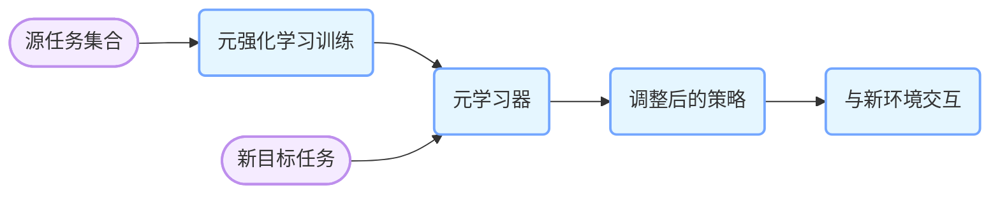

# 元强化学习在推理策略转移中的研究

> 关键词：元强化学习、推理策略转移、强化学习、策略泛化、元学习

> 摘要：本文深入探讨了元强化学习在推理策略转移方面的研究。首先介绍了相关背景知识，包括目的、预期读者、文档结构和术语表。接着阐述了核心概念及其联系，通过文本示意图和Mermaid流程图进行清晰展示。详细讲解了核心算法原理，并用Python源代码进行说明，同时给出了数学模型和公式，并举例解释。通过项目实战，展示了代码实际案例并进行详细解读。分析了实际应用场景，推荐了相关的学习资源、开发工具框架和论文著作。最后总结了未来发展趋势与挑战，提供了常见问题解答和扩展阅读参考资料，旨在为研究者和开发者提供全面且深入的元强化学习在推理策略转移方面的知识体系。

## 1. 背景介绍 
### 1.1 目的和范围
元强化学习在推理策略转移中的研究旨在解决传统强化学习在面对新环境或任务时，需要大量数据和长时间训练才能学习到有效策略的问题。通过元强化学习，智能体能够从过往的学习经验中快速学习和适应新的推理任务，实现策略的有效转移。本研究的范围涵盖了元强化学习的基本概念、核心算法、数学模型，以及在实际项目中的应用和相关工具资源的介绍。

### 1.2 预期读者
本文预期读者包括对强化学习、元学习感兴趣的研究人员、高校学生，以及从事人工智能相关领域开发的工程师。无论是想要深入了解元强化学习理论的学术研究者，还是希望将元强化学习应用到实际项目中的开发者，都能从本文中获得有价值的信息。

### 1.3 文档结构概述
本文首先介绍背景知识，为读者搭建起基本的认知框架。接着详细阐述核心概念与联系，让读者对元强化学习和推理策略转移有清晰的认识。然后讲解核心算法原理和具体操作步骤，并用Python代码进行说明。随后给出数学模型和公式，加深读者对理论的理解。通过项目实战部分，展示如何将理论应用到实际代码中。分析实际应用场景，让读者了解其实际价值。推荐相关的工具和资源，帮助读者进一步学习和研究。最后总结未来发展趋势与挑战，提供常见问题解答和扩展阅读参考资料。

### 1.4 术语表
#### 1.4.1 核心术语定义
- **元强化学习（Meta-Reinforcement Learning）**：是强化学习和元学习的结合，元学习旨在让智能体学会如何学习，在强化学习的基础上，通过在多个任务上进行训练，使智能体能够快速适应新的任务。
- **推理策略转移（Inference Policy Transfer）**：指将在一个或多个源任务上学习到的推理策略应用到新的目标任务中的过程，以减少在新任务上的学习时间和数据需求。
- **强化学习（Reinforcement Learning）**：智能体通过与环境进行交互，根据环境反馈的奖励信号来学习最优策略的机器学习方法。
- **策略（Policy）**：智能体在给定状态下选择动作的规则，通常表示为一个函数 $\pi(a|s)$，其中 $s$ 是状态，$a$ 是动作。

#### 1.4.2 相关概念解释
- **元学习（Meta-Learning）**：也称为“学习如何学习”，其目标是让模型能够快速适应新的任务，通过在多个任务上进行训练，学习到通用的学习策略。
- **任务（Task）**：在强化学习中，任务可以看作是一个特定的环境和对应的奖励函数，智能体的目标是在该任务中学习到最优策略。
- **泛化（Generalization）**：模型在未见过的数据或任务上表现良好的能力，在推理策略转移中，泛化能力指的是策略在新任务上的有效性。

#### 1.4.3 缩略词列表
- **RL**：Reinforcement Learning（强化学习）
- **MRL**：Meta-Reinforcement Learning（元强化学习）
- **SAC**：Soft Actor-Critic（软演员 - 评论家算法）

## 2. 核心概念与联系 

### 核心概念原理
元强化学习的核心思想是通过在多个任务上进行训练，学习到一种通用的学习策略，使得智能体能够在面对新任务时快速适应。在推理策略转移中，智能体首先在一组源任务上进行学习，积累经验和知识。当遇到新的目标任务时，智能体利用在源任务上学习到的知识，快速调整策略，以适应新任务的要求。

推理策略转移的关键在于找到一种有效的方式来表示和转移策略。一种常见的方法是使用元学习器，元学习器可以学习到任务之间的共性和差异，从而能够根据新任务的特征，对已有的策略进行调整。

### 架构的文本示意图
```plaintext
源任务集合 --> 元强化学习训练 --> 元学习器
新目标任务 --> 元学习器 --> 调整后的策略 --> 与新环境交互
```

### Mermaid 流程图


## 3. 核心算法原理 & 具体操作步骤 

### 核心算法原理
一种常见的元强化学习算法是基于模型无关的方法，如Soft Actor-Critic（SAC）的元强化学习版本。SAC是一种基于最大熵的强化学习算法，它不仅追求最大的累积奖励，还最大化策略的熵，使得策略更加随机和灵活。

在元强化学习中，我们将SAC扩展到多个任务上。具体来说，我们有一个元学习器，它的输入是任务的描述和当前的状态，输出是策略的参数。元学习器通过在多个任务上进行训练，学习到如何根据不同的任务和状态调整策略参数。

### 具体操作步骤
1. **数据收集**：在多个源任务上运行随机策略，收集状态、动作、奖励和下一个状态的数据。
2. **元学习器训练**：使用收集到的数据训练元学习器，目标是最小化在多个任务上的累积损失。
3. **新任务适应**：当遇到新的目标任务时，使用元学习器根据新任务的描述和初始状态生成初始策略参数。
4. **策略微调**：在新任务上使用生成的初始策略与环境交互，根据环境反馈的奖励信号微调策略参数。

### Python源代码详细阐述
```python
import torch
import torch.nn as nn
import torch.optim as optim
import numpy as np

# 定义策略网络
class PolicyNetwork(nn.Module):
    def __init__(self, input_dim, output_dim):
        super(PolicyNetwork, self).__init__()
        self.fc1 = nn.Linear(input_dim, 64)
        self.fc2 = nn.Linear(64, 64)
        self.fc3 = nn.Linear(64, output_dim)

    def forward(self, x):
        x = torch.relu(self.fc1(x))
        x = torch.relu(self.fc2(x))
        x = torch.tanh(self.fc3(x))
        return x

# 定义元学习器
class MetaLearner(nn.Module):
    def __init__(self, input_dim, output_dim):
        super(MetaLearner, self).__init__()
        self.fc1 = nn.Linear(input_dim, 64)
        self.fc2 = nn.Linear(64, 64)
        self.fc3 = nn.Linear(64, output_dim)

    def forward(self, task_description, state):
        x = torch.cat([task_description, state], dim=-1)
        x = torch.relu(self.fc1(x))
        x = torch.relu(self.fc2(x))
        params = self.fc3(x)
        return params

# 元强化学习训练
def meta_rl_training(meta_learner, policy_network, tasks, num_epochs, lr):
    optimizer = optim.Adam(meta_learner.parameters(), lr=lr)
    for epoch in range(num_epochs):
        total_loss = 0
        for task in tasks:
            task_description = task['description']
            states = task['states']
            actions = task['actions']
            rewards = task['rewards']
            next_states = task['next_states']

            for i in range(len(states)):
                state = states[i]
                action = actions[i]
                reward = rewards[i]
                next_state = next_states[i]

                # 生成策略参数
                params = meta_learner(task_description, state)
                # 更新策略网络参数
                for j, param in enumerate(policy_network.parameters()):
                    param.data = params[j * param.numel(): (j + 1) * param.numel()].view(param.shape)

                # 计算损失
                predicted_action = policy_network(state)
                loss = nn.MSELoss()(predicted_action, action)
                total_loss += loss.item()

                # 反向传播
                optimizer.zero_grad()
                loss.backward()
                optimizer.step()

        print(f'Epoch {epoch + 1}, Loss: {total_loss / len(tasks)}')

# 新任务适应
def adapt_to_new_task(meta_learner, policy_network, new_task_description, initial_state):
    params = meta_learner(new_task_description, initial_state)
    for j, param in enumerate(policy_network.parameters()):
        param.data = params[j * param.numel(): (j + 1) * param.numel()].view(param.shape)
    return policy_network

# 示例任务数据
tasks = [
    {
        'description': torch.tensor([1.0, 0.0]),
        'states': [torch.tensor([0.1, 0.2]), torch.tensor([0.3, 0.4])],
        'actions': [torch.tensor([0.5, 0.6]), torch.tensor([0.7, 0.8])],
        'rewards': [1.0, 2.0],
        'next_states': [torch.tensor([0.9, 1.0]), torch.tensor([1.1, 1.2])]
    },
    {
        'description': torch.tensor([0.0, 1.0]),
        'states': [torch.tensor([0.2, 0.3]), torch.tensor([0.4, 0.5])],
        'actions': [torch.tensor([0.6, 0.7]), torch.tensor([0.8, 0.9])],
        'rewards': [2.0, 3.0],
        'next_states': [torch.tensor([1.0, 1.1]), torch.tensor([1.2, 1.3])]
    }
]

# 初始化网络
input_dim = 2
output_dim = 2
policy_network = PolicyNetwork(input_dim, output_dim)
meta_learner = MetaLearner(input_dim + 2, sum(p.numel() for p in policy_network.parameters()))

# 训练元学习器
meta_rl_training(meta_learner, policy_network, tasks, num_epochs=10, lr=0.001)

# 新任务适应
new_task_description = torch.tensor([0.5, 0.5])
initial_state = torch.tensor([0.1, 0.2])
adapted_policy = adapt_to_new_task(meta_learner, policy_network, new_task_description, initial_state)
```

## 4. 数学模型和公式 & 详细讲解 & 举例说明 

### 数学模型和公式
在元强化学习中，我们的目标是学习一个元学习器 $\phi$，它可以根据任务描述 $\tau$ 和状态 $s$ 生成策略 $\pi_{\theta}$ 的参数 $\theta$。

设 $D_{\tau}$ 是任务 $\tau$ 上的数据集合，包括状态、动作、奖励和下一个状态。我们的目标是最小化在多个任务上的累积损失：

$$
\min_{\phi} \sum_{\tau} \mathcal{L}(\pi_{\phi(\tau, s)}, D_{\tau})
$$

其中 $\mathcal{L}$ 是损失函数，例如均方误差损失：

$$
\mathcal{L}(\pi_{\theta}, D_{\tau}) = \frac{1}{|D_{\tau}|} \sum_{(s, a) \in D_{\tau}} || \pi_{\theta}(s) - a ||^2
$$

### 详细讲解
元学习器 $\phi$ 的作用是根据任务描述和状态，为策略网络生成合适的参数。通过在多个任务上最小化损失函数，元学习器可以学习到任务之间的共性和差异，从而能够在新任务上快速调整策略。

均方误差损失函数用于衡量策略网络的输出和实际动作之间的差异。在训练过程中，我们通过反向传播算法更新元学习器的参数，使得损失函数逐渐减小。

### 举例说明
假设我们有两个任务 $\tau_1$ 和 $\tau_2$，任务描述分别为 $\tau_1 = [1, 0]$ 和 $\tau_2 = [0, 1]$。在任务 $\tau_1$ 上，我们有数据 $(s_1, a_1)$ 和 $(s_2, a_2)$，在任务 $\tau_2$ 上，我们有数据 $(s_3, a_3)$ 和 $(s_4, a_4)$。

我们首先使用元学习器 $\phi$ 根据任务描述和状态生成策略参数 $\theta_1 = \phi(\tau_1, s_1)$，$\theta_2 = \phi(\tau_1, s_2)$，$\theta_3 = \phi(\tau_2, s_3)$ 和 $\theta_4 = \phi(\tau_2, s_4)$。

然后计算损失：

$$
\mathcal{L}(\pi_{\theta_1}, \{(s_1, a_1)\}) = || \pi_{\theta_1}(s_1) - a_1 ||^2
$$
$$
\mathcal{L}(\pi_{\theta_2}, \{(s_2, a_2)\}) = || \pi_{\theta_2}(s_2) - a_2 ||^2
$$
$$
\mathcal{L}(\pi_{\theta_3}, \{(s_3, a_3)\}) = || \pi_{\theta_3}(s_3) - a_3 ||^2
$$
$$
\mathcal{L}(\pi_{\theta_4}, \{(s_4, a_4)\}) = || \pi_{\theta_4}(s_4) - a_4 ||^2
$$

最终的目标是最小化：

$$
\min_{\phi} \mathcal{L}(\pi_{\theta_1}, \{(s_1, a_1)\}) + \mathcal{L}(\pi_{\theta_2}, \{(s_2, a_2)\}) + \mathcal{L}(\pi_{\theta_3}, \{(s_3, a_3)\}) + \mathcal{L}(\pi_{\theta_4}, \{(s_4, a_4)\})
$$

## 5. 项目实战：代码实际案例和详细解释说明 

### 5.1  开发环境搭建
- **操作系统**：推荐使用Linux系统，如Ubuntu 18.04或更高版本，也可以使用Windows 10或macOS。
- **Python版本**：使用Python 3.7或更高版本。
- **深度学习框架**：使用PyTorch 1.7或更高版本，可以通过以下命令安装：
```bash
pip install torch torchvision
```
- **其他依赖库**：可以使用`numpy`进行数值计算，使用`matplotlib`进行数据可视化，安装命令如下：
```bash
pip install numpy matplotlib
```

### 5.2  源代码详细实现和代码解读
以下是上述Python代码的详细解读：

```python
import torch
import torch.nn as nn
import torch.optim as optim
import numpy as np

# 定义策略网络
class PolicyNetwork(nn.Module):
    def __init__(self, input_dim, output_dim):
        super(PolicyNetwork, self).__init__()
        # 定义全连接层
        self.fc1 = nn.Linear(input_dim, 64)
        self.fc2 = nn.Linear(64, 64)
        self.fc3 = nn.Linear(64, output_dim)

    def forward(self, x):
        # 前向传播
        x = torch.relu(self.fc1(x))
        x = torch.relu(self.fc2(x))
        x = torch.tanh(self.fc3(x))
        return x

# 定义元学习器
class MetaLearner(nn.Module):
    def __init__(self, input_dim, output_dim):
        super(MetaLearner, self).__init__()
        # 定义全连接层
        self.fc1 = nn.Linear(input_dim, 64)
        self.fc2 = nn.Linear(64, 64)
        self.fc3 = nn.Linear(64, output_dim)

    def forward(self, task_description, state):
        # 拼接任务描述和状态
        x = torch.cat([task_description, state], dim=-1)
        x = torch.relu(self.fc1(x))
        x = torch.relu(self.fc2(x))
        # 输出策略参数
        params = self.fc3(x)
        return params

# 元强化学习训练
def meta_rl_training(meta_learner, policy_network, tasks, num_epochs, lr):
    # 定义优化器
    optimizer = optim.Adam(meta_learner.parameters(), lr=lr)
    for epoch in range(num_epochs):
        total_loss = 0
        for task in tasks:
            task_description = task['description']
            states = task['states']
            actions = task['actions']
            rewards = task['rewards']
            next_states = task['next_states']

            for i in range(len(states)):
                state = states[i]
                action = actions[i]
                reward = rewards[i]
                next_state = next_states[i]

                # 生成策略参数
                params = meta_learner(task_description, state)
                # 更新策略网络参数
                for j, param in enumerate(policy_network.parameters()):
                    param.data = params[j * param.numel(): (j + 1) * param.numel()].view(param.shape)

                # 计算损失
                predicted_action = policy_network(state)
                loss = nn.MSELoss()(predicted_action, action)
                total_loss += loss.item()

                # 反向传播
                optimizer.zero_grad()
                loss.backward()
                optimizer.step()

        print(f'Epoch {epoch + 1}, Loss: {total_loss / len(tasks)}')

# 新任务适应
def adapt_to_new_task(meta_learner, policy_network, new_task_description, initial_state):
    # 生成策略参数
    params = meta_learner(new_task_description, initial_state)
    # 更新策略网络参数
    for j, param in enumerate(policy_network.parameters()):
        param.data = params[j * param.numel(): (j + 1) * param.numel()].view(param.shape)
    return policy_network

# 示例任务数据
tasks = [
    {
        'description': torch.tensor([1.0, 0.0]),
        'states': [torch.tensor([0.1, 0.2]), torch.tensor([0.3, 0.4])],
        'actions': [torch.tensor([0.5, 0.6]), torch.tensor([0.7, 0.8])],
        'rewards': [1.0, 2.0],
        'next_states': [torch.tensor([0.9, 1.0]), torch.tensor([1.1, 1.2])]
    },
    {
        'description': torch.tensor([0.0, 1.0]),
        'states': [torch.tensor([0.2, 0.3]), torch.tensor([0.4, 0.5])],
        'actions': [torch.tensor([0.6, 0.7]), torch.tensor([0.8, 0.9])],
        'rewards': [2.0, 3.0],
        'next_states': [torch.tensor([1.0, 1.1]), torch.tensor([1.2, 1.3])]
    }
]

# 初始化网络
input_dim = 2
output_dim = 2
policy_network = PolicyNetwork(input_dim, output_dim)
meta_learner = MetaLearner(input_dim + 2, sum(p.numel() for p in policy_network.parameters()))

# 训练元学习器
meta_rl_training(meta_learner, policy_network, tasks, num_epochs=10, lr=0.001)

# 新任务适应
new_task_description = torch.tensor([0.5, 0.5])
initial_state = torch.tensor([0.1, 0.2])
adapted_policy = adapt_to_new_task(meta_learner, policy_network, new_task_description, initial_state)
```

### 代码解读与分析
- **策略网络（PolicyNetwork）**：定义了一个简单的三层全连接神经网络，用于根据状态生成动作。
- **元学习器（MetaLearner）**：也是一个三层全连接神经网络，输入是任务描述和状态，输出是策略网络的参数。
- **元强化学习训练（meta_rl_training）**：在多个任务上训练元学习器，通过最小化策略网络的输出和实际动作之间的均方误差损失来更新元学习器的参数。
- **新任务适应（adapt_to_new_task）**：当遇到新任务时，使用元学习器根据新任务的描述和初始状态生成策略参数，并更新策略网络。

通过这个项目实战，我们可以看到如何使用元强化学习实现推理策略转移，使得智能体能够快速适应新的任务。

## 6. 实际应用场景 
### 机器人控制
在机器人控制领域，机器人需要在不同的环境中执行各种任务，如导航、抓取等。传统的强化学习方法需要为每个新环境和任务重新训练策略，耗时耗力。元强化学习可以让机器人从过往的任务中学习到通用的学习策略，当遇到新的环境或任务时，能够快速调整策略，实现高效的控制。

### 游戏智能体
在游戏领域，游戏环境和规则经常变化。元强化学习可以使游戏智能体在不同的游戏场景中快速学习和适应，提高游戏表现。例如，在即时战略游戏中，智能体可以通过元强化学习快速适应不同的地图和对手策略。

### 自动驾驶
自动驾驶汽车需要在各种不同的道路条件和交通场景中行驶。元强化学习可以帮助自动驾驶系统从以往的驾驶经验中学习，当遇到新的路况或交通规则时，快速调整驾驶策略，提高驾驶的安全性和效率。

### 金融投资
在金融投资领域，市场环境和资产价格波动频繁。元强化学习可以让投资策略根据不同的市场条件快速调整，提高投资回报率。例如，根据不同的宏观经济环境和行业趋势，智能体可以快速调整投资组合。

## 7. 工具和资源推荐
### 7.1 学习资源推荐
#### 7.1.1 书籍推荐
- 《Reinforcement Learning: An Introduction》（《强化学习：原理与Python实现》）：这是强化学习领域的经典教材，详细介绍了强化学习的基本概念、算法和应用。
- 《Meta-Learning: Foundations and Trends® in Machine Learning》：全面介绍了元学习的理论和方法，是元学习领域的权威著作。

#### 7.1.2 在线课程
- Coursera上的“Reinforcement Learning Specialization”：由著名学者Richard Sutton和Andrew Barto授课，系统讲解了强化学习的理论和实践。
- edX上的“Meta-Learning for AI”：专门介绍了元学习在人工智能领域的应用。

#### 7.1.3 技术博客和网站
- OpenAI博客：提供了最新的人工智能研究成果和技术动态，包括元强化学习的相关内容。
- DeepMind博客：发布了许多关于强化学习和元学习的研究论文和技术文章。

### 7.2 开发工具框架推荐
#### 7.2.1 IDE和编辑器
- PyCharm：是一款专业的Python集成开发环境，提供了丰富的代码编辑、调试和版本控制功能。
- Jupyter Notebook：是一个交互式的开发环境，适合进行数据探索、模型训练和结果可视化。

#### 7.2.2 调试和性能分析工具
- TensorBoard：是TensorFlow的可视化工具，也可以用于PyTorch项目。它可以帮助我们可视化训练过程中的损失曲线、参数分布等信息。
- Py-Spy：是一个轻量级的Python性能分析工具，可以帮助我们找出代码中的性能瓶颈。

#### 7.2.3 相关框架和库
- PyTorch：是一个广泛使用的深度学习框架，提供了丰富的神经网络模块和优化算法，方便我们实现元强化学习算法。
- Gym：是OpenAI开发的一个强化学习环境库，提供了各种不同的任务环境，方便我们进行强化学习实验。

### 7.3 相关论文著作推荐
#### 7.3.1 经典论文
- “Model-Agnostic Meta-Learning for Fast Adaptation of Deep Networks”：提出了模型无关的元学习方法，是元学习领域的经典论文。
- “Soft Actor-Critic: Off-Policy Maximum Entropy Deep Reinforcement Learning with a Stochastic Actor”：介绍了Soft Actor-Critic算法，是基于最大熵的强化学习算法的代表。

#### 7.3.2 最新研究成果
- 关注NeurIPS、ICML、AAAI等顶级人工智能会议的论文，这些会议上会发布最新的元强化学习研究成果。

#### 7.3.3 应用案例分析
- 可以在ACM Transactions on Intelligent Systems and Technology等期刊上找到元强化学习在不同领域的应用案例分析。

## 8. 总结：未来发展趋势与挑战
### 未来发展趋势
- **多模态元强化学习**：结合视觉、听觉、触觉等多种模态的信息，使智能体能够在更复杂的环境中学习和适应。
- **与其他技术的融合**：与深度学习、进化算法、迁移学习等技术相结合，进一步提高元强化学习的性能和应用范围。
- **应用领域的拓展**：在医疗、教育、能源等更多领域得到应用，为解决实际问题提供更有效的方法。

### 挑战
- **数据效率问题**：元强化学习仍然需要大量的数据进行训练，如何提高数据效率是一个重要的挑战。
- **可解释性问题**：元强化学习模型通常是黑盒模型，如何提高模型的可解释性，让人们更好地理解模型的决策过程，是一个亟待解决的问题。
- **任务泛化问题**：虽然元强化学习可以实现一定程度的策略转移，但在面对复杂多样的任务时，如何提高任务泛化能力仍然是一个挑战。

## 9. 附录：常见问题与解答
### 问题1：元强化学习和传统强化学习有什么区别？
答：传统强化学习在面对新任务时，需要从头开始学习，需要大量的数据和时间。而元强化学习通过在多个任务上进行训练，学习到一种通用的学习策略，能够在新任务上快速适应，减少学习时间和数据需求。

### 问题2：如何选择合适的元学习算法？
答：选择合适的元学习算法需要考虑任务的特点、数据的规模和计算资源等因素。如果任务是连续控制任务，可以考虑使用基于策略梯度的元学习算法；如果任务是离散动作任务，可以考虑使用基于价值函数的元学习算法。

### 问题3：元强化学习的训练时间会很长吗？
答：元强化学习的训练时间通常比传统强化学习要长，因为需要在多个任务上进行训练。但是，通过合理设计算法和优化训练过程，可以在一定程度上减少训练时间。

### 问题4：元强化学习在实际应用中有哪些限制？
答：元强化学习在实际应用中的限制包括数据效率问题、可解释性问题和任务泛化问题等。此外，元强化学习的实现需要一定的计算资源和专业知识，对硬件和人员要求较高。

## 10. 扩展阅读 & 参考资料
### 扩展阅读
- 《Deep Reinforcement Learning Hands-On》：深入介绍了深度强化学习的实践技巧和应用案例。
- 《The Hundred-Page Machine Learning Book》：对机器学习的核心概念和算法进行了简洁而全面的介绍。

### 参考资料
- Sutton, R. S., & Barto, A. G. (2018). Reinforcement Learning: An Introduction. MIT press.
- Finn, C., Abbeel, P., & Levine, S. (2017). Model-Agnostic Meta-Learning for Fast Adaptation of Deep Networks. arXiv preprint arXiv:1703.03400.
- Haarnoja, T., Zhou, A., Abbeel, P., & Levine, S. (2018). Soft Actor-Critic: Off-Policy Maximum Entropy Deep Reinforcement Learning with a Stochastic Actor. arXiv preprint arXiv:1801.01290.

作者：AI天才研究院/AI Genius Institute & 禅与计算机程序设计艺术 /Zen And The Art of Computer Programming