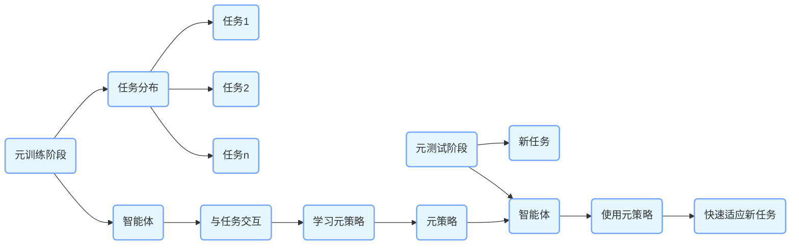

# 元强化学习在自动化AI训练中的应用

> 关键词：元强化学习、自动化AI训练、强化学习、智能体、元学习

> 摘要：本文深入探讨了元强化学习在自动化AI训练中的应用。首先介绍了元强化学习及自动化AI训练的背景知识，包括目的、预期读者、文档结构和相关术语。接着详细阐述了核心概念、算法原理、数学模型，并通过Python代码示例进行说明。然后给出项目实战案例，涵盖开发环境搭建、源代码实现与解读。分析了元强化学习在多个实际场景中的应用，推荐了相关学习资源、开发工具框架和论文著作。最后总结了元强化学习的未来发展趋势与挑战，解答了常见问题，并提供了扩展阅读和参考资料，旨在为读者全面呈现元强化学习在自动化AI训练领域的理论与实践。

## 1. 背景介绍 
### 1.1 目的和范围
元强化学习作为一种新兴的技术，旨在让智能体能够快速适应新的任务和环境。在自动化AI训练中，元强化学习可以显著提高训练效率，减少人工干预，使AI系统能够更灵活地应对不同的场景。本文的目的是深入探讨元强化学习在自动化AI训练中的应用原理、方法和实际案例，范围涵盖从基础概念到实际项目开发的全过程。

### 1.2 预期读者
本文预期读者包括对人工智能、强化学习和元学习感兴趣的研究人员、工程师和学生。具备一定的机器学习和编程基础将有助于更好地理解本文内容，但即使是初学者也可以通过本文了解元强化学习在自动化AI训练中的基本概念和应用。

### 1.3 文档结构概述
本文首先介绍相关背景知识，包括术语定义等。接着阐述核心概念及它们之间的联系，通过示意图和流程图展示。然后讲解核心算法原理和具体操作步骤，结合Python代码。再介绍数学模型和公式，并举例说明。之后通过项目实战案例详细介绍开发过程。分析实际应用场景，推荐学习资源、开发工具框架和相关论文著作。最后总结未来发展趋势与挑战，解答常见问题并提供扩展阅读和参考资料。

### 1.4 术语表
#### 1.4.1 核心术语定义
- **元强化学习（Meta-Reinforcement Learning）**：是一种让智能体能够从多个任务中学习通用的学习策略，以便在新的任务中快速适应和学习的技术。
- **自动化AI训练（Automated AI Training）**：指通过算法和系统自动完成AI模型的训练过程，减少人工干预。
- **强化学习（Reinforcement Learning）**：智能体通过与环境进行交互，根据环境反馈的奖励信号来学习最优行为策略。
- **智能体（Agent）**：在强化学习中，能够感知环境状态并采取行动的实体。
- **元学习（Meta-Learning）**：也称为“学习如何学习”，旨在让模型能够快速学习新的任务，通过利用先前的学习经验。

#### 1.4.2 相关概念解释
- **任务分布（Task Distribution）**：在元强化学习中，多个不同的任务构成一个任务分布，智能体需要从这个分布中学习通用的学习策略。
- **快速适应（Fast Adaptation）**：智能体在面对新任务时，能够在少量的交互步骤内快速调整自己的策略，以获得较好的性能。
- **元策略（Meta-Policy）**：是元强化学习中学习到的通用策略，用于指导智能体在不同任务中的学习过程。

#### 1.4.3 缩略词列表
- **RL**：Reinforcement Learning（强化学习）
- **MRL**：Meta-Reinforcement Learning（元强化学习）
- **AI**：Artificial Intelligence（人工智能）

## 2. 核心概念与联系 
### 核心概念原理
元强化学习结合了元学习和强化学习的思想。传统的强化学习中，智能体需要在一个特定的任务上进行大量的交互和试错，才能学习到一个较好的策略。而元强化学习的目标是让智能体能够从多个不同的任务中学习到通用的学习策略，这样在面对新的任务时，智能体可以利用之前学到的通用策略快速适应新环境。

元强化学习的核心原理是在元训练阶段，智能体在多个任务上进行训练，学习到一个元策略。这个元策略可以帮助智能体在新任务上快速调整自己的策略。在元测试阶段，智能体使用学到的元策略来快速适应新的任务。

### 架构的文本示意图
```plaintext
元训练阶段
|
|-- 任务分布
|   |-- 任务1
|   |-- 任务2
|   |--...
|   |-- 任务n
|
|-- 智能体
|   |-- 与任务交互
|   |-- 学习元策略
|
|-- 元策略

元测试阶段
|
|-- 新任务
|
|-- 智能体
|   |-- 使用元策略
|   |-- 快速适应新任务
```

### Mermaid流程图


## 3. 核心算法原理 & 具体操作步骤 
### 核心算法原理
元强化学习中一个常见的算法是Model-Agnostic Meta-Learning (MAML) 的扩展版本用于强化学习，即Meta-Actor-Critic (MAC)。

在MAC算法中，我们有一个元策略网络 $\pi_{\theta}$，其中 $\theta$ 是网络的参数。在元训练阶段，我们从任务分布 $\mathcal{T}$ 中采样一个任务 $T$。对于每个任务 $T$，我们在该任务上进行一定数量的交互步骤，得到一个轨迹 $\tau$。根据这个轨迹，我们计算策略梯度 $\nabla_{\theta} J(\pi_{\theta}, T)$，其中 $J(\pi_{\theta}, T)$ 是任务 $T$ 下策略 $\pi_{\theta}$ 的期望累积奖励。

然后，我们使用这个梯度来更新元策略网络的参数 $\theta$。更新公式为：
$\theta' = \theta - \alpha \nabla_{\theta} J(\pi_{\theta}, T)$
其中 $\alpha$ 是学习率。

在元测试阶段，当遇到新任务 $T'$ 时，我们使用元策略网络 $\pi_{\theta}$ 作为初始策略，然后在新任务上进行少量的梯度更新，得到适应新任务的策略 $\pi_{\theta'}$。

### 具体操作步骤
1. **初始化元策略网络参数 $\theta$**：随机初始化元策略网络的参数。
2. **元训练阶段**：
    - 从任务分布 $\mathcal{T}$ 中采样一个任务 $T$。
    - 在任务 $T$ 上使用当前的元策略网络 $\pi_{\theta}$ 进行 $K$ 步交互，得到轨迹 $\tau$。
    - 根据轨迹 $\tau$ 计算策略梯度 $\nabla_{\theta} J(\pi_{\theta}, T)$。
    - 使用梯度更新元策略网络的参数：$\theta = \theta - \beta \nabla_{\theta} J(\pi_{\theta}, T)$，其中 $\beta$ 是元学习率。
3. **元测试阶段**：
    - 遇到新任务 $T'$。
    - 使用元策略网络 $\pi_{\theta}$ 作为初始策略。
    - 在新任务 $T'$ 上进行 $M$ 步交互，得到轨迹 $\tau'$。
    - 根据轨迹 $\tau'$ 计算策略梯度 $\nabla_{\theta} J(\pi_{\theta}, T')$。
    - 使用梯度更新策略网络的参数：$\theta' = \theta - \alpha \nabla_{\theta} J(\pi_{\theta}, T')$，其中 $\alpha$ 是学习率。

### Python源代码示例
```python
import torch
import torch.nn as nn
import torch.optim as optim

# 定义策略网络
class PolicyNetwork(nn.Module):
    def __init__(self, input_dim, output_dim):
        super(PolicyNetwork, self).__init__()
        self.fc1 = nn.Linear(input_dim, 64)
        self.fc2 = nn.Linear(64, output_dim)

    def forward(self, x):
        x = torch.relu(self.fc1(x))
        x = torch.softmax(self.fc2(x), dim=-1)
        return x

# 初始化元策略网络
input_dim = 10
output_dim = 5
meta_policy = PolicyNetwork(input_dim, output_dim)
meta_optimizer = optim.Adam(meta_policy.parameters(), lr=0.001)

# 元训练阶段
num_meta_episodes = 100
num_interaction_steps = 10
meta_lr = 0.001

for meta_episode in range(num_meta_episodes):
    # 采样一个任务（这里简化为随机生成奖励函数）
    reward_function = lambda state, action: torch.randn(1)

    # 在任务上进行交互
    states = []
    actions = []
    rewards = []
    state = torch.randn(input_dim)
    for step in range(num_interaction_steps):
        action_probs = meta_policy(state)
        action = torch.multinomial(action_probs, 1).item()
        reward = reward_function(state, action)
        states.append(state)
        actions.append(action)
        rewards.append(reward)
        state = torch.randn(input_dim)

    # 计算策略梯度
    log_probs = []
    for i in range(num_interaction_steps):
        action_probs = meta_policy(states[i])
        log_prob = torch.log(action_probs[actions[i]])
        log_probs.append(log_prob)
    log_probs = torch.stack(log_probs)
    rewards = torch.stack(rewards)
    loss = -torch.sum(log_probs * rewards)

    # 更新元策略网络
    meta_optimizer.zero_grad()
    loss.backward()
    meta_optimizer.step()

# 元测试阶段
new_reward_function = lambda state, action: torch.randn(1)
state = torch.randn(input_dim)
adapted_policy = meta_policy
adapted_optimizer = optim.Adam(adapted_policy.parameters(), lr=0.01)
num_adaptation_steps = 5

for step in range(num_adaptation_steps):
    action_probs = adapted_policy(state)
    action = torch.multinomial(action_probs, 1).item()
    reward = new_reward_function(state, action)
    log_prob = torch.log(action_probs[action])
    loss = -log_prob * reward
    adapted_optimizer.zero_grad()
    loss.backward()
    adapted_optimizer.step()
```

## 4. 数学模型和公式 & 详细讲解 & 举例说明 
### 数学模型和公式
#### 策略梯度公式
在强化学习中，策略梯度定理给出了策略网络参数 $\theta$ 的更新公式。策略 $\pi_{\theta}(a|s)$ 表示在状态 $s$ 下采取动作 $a$ 的概率。期望累积奖励 $J(\pi_{\theta})$ 可以表示为：
$$J(\pi_{\theta}) = \mathbb{E}_{\tau \sim \pi_{\theta}} \left[ \sum_{t=0}^{T} r(s_t, a_t) \right]$$
其中 $\tau = (s_0, a_0, r_0, s_1, a_1, r_1, \cdots, s_T, a_T, r_T)$ 是一个轨迹，$r(s_t, a_t)$ 是在状态 $s_t$ 下采取动作 $a_t$ 得到的奖励。

策略梯度 $\nabla_{\theta} J(\pi_{\theta})$ 可以通过以下公式计算：
$$\nabla_{\theta} J(\pi_{\theta}) = \mathbb{E}_{\tau \sim \pi_{\theta}} \left[ \sum_{t=0}^{T} \nabla_{\theta} \log \pi_{\theta}(a_t|s_t) \sum_{k=t}^{T} r(s_k, a_k) \right]$$

#### 元学习更新公式
在元强化学习中，我们使用元学习率 $\beta$ 来更新元策略网络的参数 $\theta$。对于一个任务 $T$，元更新公式为：
$$\theta = \theta - \beta \nabla_{\theta} J(\pi_{\theta}, T)$$

### 详细讲解
策略梯度公式的核心思想是通过增加那些能够带来高奖励的动作的概率，减少那些带来低奖励的动作的概率。在元强化学习中，我们不仅要在单个任务上优化策略，还要在多个任务上学习一个通用的元策略。

元学习更新公式的作用是让元策略网络能够从多个任务中学习到通用的学习策略。通过不断地在不同任务上进行梯度更新，元策略网络能够适应不同任务的特点，从而在新任务上能够快速适应。

### 举例说明
假设我们有一个简单的机器人导航任务，机器人需要在一个二维网格中从起点移动到终点。每个任务的起点和终点位置不同，并且网格中可能存在不同的障碍物分布。

在元训练阶段，我们从多个这样的任务中采样，让机器人使用当前的元策略进行导航。根据导航过程中得到的奖励（例如到达终点得到正奖励，撞到障碍物得到负奖励），计算策略梯度并更新元策略网络的参数。

在元测试阶段，当遇到一个新的导航任务时，机器人使用元策略作为初始策略，然后在新任务上进行少量的梯度更新，就可以快速找到到达终点的路径。

## 5. 项目实战：代码实际案例和详细解释说明 
### 5.1  开发环境搭建
#### 安装Python
首先需要安装Python，建议使用Python 3.7及以上版本。可以从Python官方网站（https://www.python.org/downloads/）下载安装包进行安装。

#### 安装必要的库
我们需要安装一些常用的机器学习和深度学习库，如PyTorch、NumPy等。可以使用以下命令进行安装：
```bash
pip install torch numpy
```

### 5.2  源代码详细实现和代码解读
```python
import torch
import torch.nn as nn
import torch.optim as optim
import numpy as np

# 定义策略网络
class PolicyNetwork(nn.Module):
    def __init__(self, input_dim, output_dim):
        super(PolicyNetwork, self).__init__()
        self.fc1 = nn.Linear(input_dim, 64)
        self.fc2 = nn.Linear(64, output_dim)

    def forward(self, x):
        x = torch.relu(self.fc1(x))
        x = torch.softmax(self.fc2(x), dim=-1)
        return x

# 定义环境类
class Environment:
    def __init__(self, input_dim):
        self.input_dim = input_dim
        self.state = np.random.randn(input_dim)

    def reset(self):
        self.state = np.random.randn(self.input_dim)
        return self.state

    def step(self, action):
        # 简单模拟奖励
        reward = np.random.randn()
        next_state = np.random.randn(self.input_dim)
        done = False
        return next_state, reward, done

# 初始化元策略网络
input_dim = 10
output_dim = 5
meta_policy = PolicyNetwork(input_dim, output_dim)
meta_optimizer = optim.Adam(meta_policy.parameters(), lr=0.001)

# 元训练阶段
num_meta_episodes = 100
num_interaction_steps = 10
meta_lr = 0.001

for meta_episode in range(num_meta_episodes):
    # 创建一个环境实例
    env = Environment(input_dim)
    state = env.reset()

    # 在任务上进行交互
    states = []
    actions = []
    rewards = []
    for step in range(num_interaction_steps):
        state_tensor = torch.FloatTensor(state)
        action_probs = meta_policy(state_tensor)
        action = torch.multinomial(action_probs, 1).item()
        next_state, reward, done = env.step(action)
        states.append(state)
        actions.append(action)
        rewards.append(reward)
        state = next_state

    # 计算策略梯度
    log_probs = []
    for i in range(num_interaction_steps):
        state_tensor = torch.FloatTensor(states[i])
        action_probs = meta_policy(state_tensor)
        log_prob = torch.log(action_probs[actions[i]])
        log_probs.append(log_prob)
    log_probs = torch.stack(log_probs)
    rewards = torch.FloatTensor(rewards)
    loss = -torch.sum(log_probs * rewards)

    # 更新元策略网络
    meta_optimizer.zero_grad()
    loss.backward()
    meta_optimizer.step()

# 元测试阶段
new_env = Environment(input_dim)
state = new_env.reset()
adapted_policy = meta_policy
adapted_optimizer = optim.Adam(adapted_policy.parameters(), lr=0.01)
num_adaptation_steps = 5

for step in range(num_adaptation_steps):
    state_tensor = torch.FloatTensor(state)
    action_probs = adapted_policy(state_tensor)
    action = torch.multinomial(action_probs, 1).item()
    next_state, reward, done = new_env.step(action)
    log_prob = torch.log(action_probs[action])
    loss = -log_prob * reward
    adapted_optimizer.zero_grad()
    loss.backward()
    adapted_optimizer.step()
    state = next_state
```

### 代码解读与分析
#### 策略网络定义
`PolicyNetwork` 类定义了一个简单的两层全连接神经网络，用于表示策略。输入是状态，输出是动作的概率分布。

#### 环境类定义
`Environment` 类模拟了一个简单的环境，包括重置环境和执行动作的方法。在实际应用中，这个类可以替换为真实的环境，如OpenAI Gym中的环境。

#### 元训练阶段
在元训练阶段，我们从任务分布中采样一个任务（这里通过创建一个新的环境实例来模拟），使用当前的元策略网络与环境进行交互，得到轨迹。根据轨迹计算策略梯度并更新元策略网络的参数。

#### 元测试阶段
在元测试阶段，我们遇到一个新的任务（创建一个新的环境实例），使用元策略网络作为初始策略，在新任务上进行少量的梯度更新，得到适应新任务的策略。

## 6. 实际应用场景 
### 机器人控制
在机器人控制领域，元强化学习可以让机器人快速适应不同的任务和环境。例如，一个机器人需要在不同的地形上进行导航，或者执行不同的操作任务。通过元强化学习，机器人可以从多个任务中学习到通用的学习策略，在遇到新的地形或任务时，能够快速调整自己的行为策略。

### 游戏AI
在游戏领域，元强化学习可以让游戏AI快速适应不同的游戏场景和对手。例如，在一个策略游戏中，不同的关卡可能有不同的地图布局和敌人配置。使用元强化学习，游戏AI可以学习到通用的策略，在新的关卡中快速制定出有效的战术。

### 自动驾驶
在自动驾驶领域，元强化学习可以帮助自动驾驶车辆快速适应不同的路况和交通规则。例如，在不同的城市或国家，交通规则和路况可能会有所不同。通过元强化学习，自动驾驶车辆可以从多个场景中学习到通用的驾驶策略，在遇到新的路况时能够快速做出正确的决策。

### 资源管理
在云计算和数据中心等领域，元强化学习可以用于资源管理。例如，根据不同的工作负载和资源需求，动态地分配计算资源、存储资源等。通过元强化学习，系统可以学习到通用的资源分配策略，在面对新的工作负载时能够快速调整资源分配方案。

## 7. 工具和资源推荐
### 7.1 学习资源推荐
#### 7.1.1 书籍推荐
- 《Reinforcement Learning: An Introduction》（Richard S. Sutton和Andrew G. Barto著）：这是一本经典的强化学习教材，全面介绍了强化学习的基本概念、算法和应用。
- 《Meta-Learning: A Survey》（Antreas Antoniou等著）：对元学习进行了系统的综述，包括元学习的方法、应用和未来发展方向。

#### 7.1.2 在线课程
- Coursera上的“Reinforcement Learning Specialization”：由UC Berkeley的教授授课，提供了强化学习的深入学习内容。
- edX上的“Meta-Learning: Learning to Learn”：专门介绍元学习的原理和方法。

#### 7.1.3 技术博客和网站
- OpenAI博客（https://openai.com/blog/）：经常发布关于人工智能和强化学习的最新研究成果和应用案例。
- Distill.pub（https://distill.pub/）：提供了高质量的机器学习和人工智能相关的技术文章和可视化解释。

### 7.2 开发工具框架推荐
#### 7.2.1 IDE和编辑器
- PyCharm：一款功能强大的Python集成开发环境，提供了代码编辑、调试、版本控制等功能。
- Jupyter Notebook：适合进行交互式编程和数据分析，方便进行模型的开发和实验。

#### 7.2.2 调试和性能分析工具
- TensorBoard：用于可视化深度学习模型的训练过程和性能指标，帮助调试和优化模型。
- PyTorch Profiler：可以对PyTorch模型进行性能分析，找出性能瓶颈。

#### 7.2.3 相关框架和库
- PyTorch：一个广泛使用的深度学习框架，提供了丰富的工具和函数，方便进行元强化学习的开发。
- OpenAI Gym：一个用于开发和比较强化学习算法的工具包，包含了多种不同的环境。

### 7.3 相关论文著作推荐
#### 7.3.1 经典论文
- “Model-Agnostic Meta-Learning for Fast Adaptation of Deep Networks”（Chelsea Finn等著）：提出了MAML算法，是元学习领域的经典论文。
- “Meta-Reinforcement Learning of Structured Exploration Strategies”（Kate Rakelly等著）：介绍了元强化学习在探索策略学习中的应用。

#### 7.3.2 最新研究成果
- 关注顶级人工智能会议如NeurIPS、ICML、CVPR等的论文，了解元强化学习的最新研究进展。
- arXiv.org上也经常有关于元强化学习的预印本论文发布。

#### 7.3.3 应用案例分析
- 可以在IEEE Xplore、ACM Digital Library等数据库中搜索元强化学习在不同领域的应用案例，学习实际项目中的经验和方法。

## 8. 总结：未来发展趋势与挑战
### 未来发展趋势
- **更复杂任务的适应**：元强化学习将能够处理更复杂、更具挑战性的任务，如多智能体协作任务、具有不确定性和动态性的环境等。
- **与其他技术的融合**：与深度学习、计算机视觉、自然语言处理等技术的融合将更加深入，产生更强大的智能系统。
- **应用领域的拓展**：除了现有的机器人控制、游戏AI、自动驾驶等领域，元强化学习将在医疗、金融、教育等更多领域得到应用。

### 挑战
- **样本效率问题**：元强化学习通常需要大量的样本进行训练，如何提高样本效率是一个重要的挑战。
- **可解释性问题**：元强化学习模型通常比较复杂，难以解释其决策过程和学习机制，这在一些对安全性和可靠性要求较高的领域是一个障碍。
- **计算资源需求**：训练元强化学习模型需要大量的计算资源，如何降低计算成本也是一个需要解决的问题。

## 9. 附录：常见问题与解答
### 元强化学习和传统强化学习有什么区别？
传统强化学习通常针对一个特定的任务进行训练，智能体需要在该任务上进行大量的交互和试错才能学习到一个较好的策略。而元强化学习的目标是让智能体从多个不同的任务中学习到通用的学习策略，在面对新的任务时能够快速适应。

### 元强化学习需要多少个任务进行训练？
任务的数量取决于具体的应用场景和任务的复杂度。一般来说，任务数量越多，元强化学习模型能够学习到的通用策略就越强大。但同时，任务数量过多也会增加训练的时间和计算成本。

### 如何选择合适的元学习率和学习率？
元学习率和学习率的选择通常需要通过实验来确定。可以使用网格搜索、随机搜索等方法在一定的范围内尝试不同的学习率，选择能够在验证集上取得最好性能的学习率。

## 10. 扩展阅读 & 参考资料
### 扩展阅读
- “Hierarchical Meta-Reinforcement Learning”：介绍了层次化元强化学习的方法和应用。
- “Meta-Learning with Memory-Augmented Neural Networks”：探讨了使用记忆增强神经网络进行元学习的技术。

### 参考资料
- Finn, C., Abbeel, P., & Levine, S. (2017). Model-agnostic meta-learning for fast adaptation of deep networks. In Proceedings of the 34th International Conference on Machine Learning-Volume 70 (pp. 1126-1135).
- Rakelly, K., Zhou, A., Quillen, D., Finn, C., & Levine, S. (2019). Meta-reinforcement learning of structured exploration strategies. In Advances in Neural Information Processing Systems (pp. 5689-5700).

作者：AI天才研究院/AI Genius Institute & 禅与计算机程序设计艺术 /Zen And The Art of Computer Programming