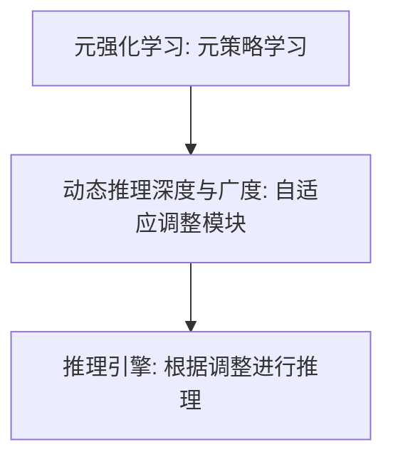

# 元强化学习驱动的动态推理深度与广度自适应调整

> 关键词：元强化学习、动态推理、深度自适应调整、广度自适应调整、智能决策

> 摘要：本文聚焦于元强化学习驱动的动态推理深度与广度自适应调整这一前沿技术。首先介绍了该技术提出的背景、目的、适用读者群体以及文档结构。详细阐述了核心概念，包括元强化学习、动态推理深度与广度的原理和架构，并通过文本示意图和 Mermaid 流程图进行直观展示。深入讲解了核心算法原理，结合 Python 源代码进行详细说明。给出了相关的数学模型和公式，并举例说明其应用。通过项目实战，介绍了开发环境搭建、源代码实现及代码解读。探讨了该技术的实际应用场景，推荐了学习资源、开发工具框架以及相关论文著作。最后总结了未来发展趋势与挑战，还提供了常见问题解答和扩展阅读参考资料，旨在为相关领域的研究者和开发者提供全面深入的技术指导。

## 1. 背景介绍 
### 1.1 目的和范围
在当今复杂多变的环境中，智能系统面临着不同的任务需求和动态变化的场景。传统的推理方法往往采用固定的推理深度和广度，无法根据实际情况进行灵活调整，导致在某些情况下效率低下或无法满足任务要求。元强化学习驱动的动态推理深度与广度自适应调整技术旨在解决这一问题，使智能系统能够根据环境反馈和任务需求，动态地调整推理的深度和广度，从而提高推理效率和准确性。

本文的范围涵盖了该技术的核心概念、算法原理、数学模型、项目实战、实际应用场景等方面，旨在为读者提供一个全面的技术视角，帮助读者深入理解和掌握这一技术。

### 1.2 预期读者
本文预期读者包括人工智能、机器学习、强化学习等领域的研究者、开发者，以及对智能推理技术感兴趣的专业人士。无论是从事学术研究，还是进行实际项目开发，本文都能为读者提供有价值的技术参考。

### 1.3 文档结构概述
本文将按照以下结构进行阐述：
1. **背景介绍**：介绍技术的目的、适用读者和文档结构。
2. **核心概念与联系**：详细解释元强化学习、动态推理深度与广度的概念，并展示其原理和架构。
3. **核心算法原理 & 具体操作步骤**：结合 Python 代码讲解核心算法的原理和实现步骤。
4. **数学模型和公式 & 详细讲解 & 举例说明**：给出相关的数学模型和公式，并通过具体例子进行说明。
5. **项目实战：代码实际案例和详细解释说明**：介绍开发环境搭建、源代码实现及代码解读。
6. **实际应用场景**：探讨该技术在不同领域的实际应用。
7. **工具和资源推荐**：推荐学习资源、开发工具框架和相关论文著作。
8. **总结：未来发展趋势与挑战**：总结技术的发展趋势和面临的挑战。
9. **附录：常见问题与解答**：解答读者可能遇到的常见问题。
10. **扩展阅读 & 参考资料**：提供进一步学习的扩展阅读材料和参考资料。

### 1.4 术语表
#### 1.4.1 核心术语定义
- **元强化学习**：元强化学习是一种能够学习如何学习的强化学习方法。它通过在多个任务或环境中进行学习，使得智能体能够快速适应新的任务或环境。元强化学习的核心思想是学习一个元策略，该策略可以根据当前的任务或环境信息，动态地调整智能体的行为策略。
- **动态推理深度**：指在推理过程中，推理步骤的数量或层次的深度可以根据实际情况进行动态调整。在不同的任务和环境下，可能需要不同的推理深度来达到最佳的推理效果。
- **动态推理广度**：指在推理过程中，每次推理步骤所考虑的可能选项或分支的数量可以根据实际情况进行动态调整。不同的任务和环境可能需要不同的推理广度来保证推理的准确性和效率。

#### 1.4.2 相关概念解释
- **强化学习**：强化学习是一种机器学习方法，智能体通过与环境进行交互，根据环境反馈的奖励信号来学习最优的行为策略。在强化学习中，智能体的目标是最大化长期累积奖励。
- **推理**：推理是指从已知信息中得出结论的过程。在人工智能领域，推理通常涉及到知识表示、逻辑推理、搜索算法等技术，以解决各种问题。

#### 1.4.3 缩略词列表
- **RL**：Reinforcement Learning，强化学习
- **Meta-RL**：Meta Reinforcement Learning，元强化学习

## 2. 核心概念与联系 

### 核心概念原理
#### 元强化学习原理
元强化学习的核心在于学习一个元策略 $\pi_{\theta}$，其中 $\theta$ 是策略的参数。元策略的输入是任务相关的信息 $T$ 和环境状态 $s$，输出是智能体的动作 $a$。元强化学习的学习过程通常分为两个阶段：元训练阶段和元测试阶段。

在元训练阶段，智能体在多个不同的任务或环境中进行学习，通过优化元策略的参数 $\theta$，使得智能体能够快速适应新的任务。具体来说，智能体在每个任务上进行多次交互，收集奖励信号 $r$，并使用强化学习算法（如策略梯度算法）来更新元策略的参数。

在元测试阶段，智能体遇到一个新的任务，使用训练好的元策略来快速适应这个新任务。元策略能够根据新任务的信息和环境状态，动态地调整智能体的行为，从而提高学习效率。

#### 动态推理深度与广度原理
动态推理深度和广度的核心思想是根据当前的任务需求和环境状态，动态地调整推理的深度和广度。在推理过程中，智能体可以根据环境反馈的信息，判断当前的推理深度和广度是否合适。如果推理深度过浅，可能无法得到准确的结论；如果推理深度过深，会增加计算成本。同样，如果推理广度过窄，可能会遗漏重要的信息；如果推理广度过宽，也会增加计算负担。

智能体通过元强化学习来学习如何根据不同的任务和环境，动态地调整推理的深度和广度。在每个推理步骤中，智能体根据当前的状态和任务信息，使用元策略来决定是否继续加深推理深度或扩大推理广度。

### 架构示意图
#### 文本示意图
```plaintext
+----------------------+
|      元强化学习      |
|      元策略学习      |
+----------------------+
          |
          v
+----------------------+
|  动态推理深度与广度  |
|    自适应调整模块    |
+----------------------+
          |
          v
+----------------------+
|      推理引擎        |
|  根据调整进行推理    |
+----------------------+
```

#### Mermaid 流程图


这个流程图展示了元强化学习、动态推理深度与广度自适应调整模块和推理引擎之间的关系。元强化学习模块学习元策略，然后将策略信息传递给动态推理深度与广度自适应调整模块，该模块根据元策略动态调整推理的深度和广度，最后推理引擎根据调整后的参数进行推理。

## 3. 核心算法原理 & 具体操作步骤 

### 核心算法原理
我们采用基于策略梯度的元强化学习算法来实现动态推理深度与广度的自适应调整。策略梯度算法的核心思想是通过优化策略的参数，使得智能体的行为能够最大化长期累积奖励。

具体来说，我们定义元策略 $\pi_{\theta}(a|s, T)$ 为在任务 $T$ 和状态 $s$ 下选择动作 $a$ 的概率分布。元策略的参数 $\theta$ 通过最大化以下目标函数来进行优化：

$$J(\theta) = \mathbb{E}_{\tau \sim \pi_{\theta}} \left[ \sum_{t=0}^{T-1} r_t \right]$$

其中，$\tau = (s_0, a_0, r_0, s_1, a_1, r_1, \cdots, s_{T-1}, a_{T-1}, r_{T-1})$ 是一个轨迹，$r_t$ 是在时间步 $t$ 获得的奖励。

为了更新元策略的参数 $\theta$，我们使用策略梯度定理，计算目标函数的梯度：

$$\nabla_{\theta} J(\theta) = \mathbb{E}_{\tau \sim \pi_{\theta}} \left[ \sum_{t=0}^{T-1} \nabla_{\theta} \log \pi_{\theta}(a_t|s_t, T) r_t \right]$$

然后使用梯度上升法来更新参数：

$$\theta \leftarrow \theta + \alpha \nabla_{\theta} J(\theta)$$

其中，$\alpha$ 是学习率。

### 具体操作步骤
以下是使用 Python 实现基于策略梯度的元强化学习算法来实现动态推理深度与广度自适应调整的具体步骤和代码示例：

```python
import torch
import torch.nn as nn
import torch.optim as optim
import numpy as np

# 定义元策略网络
class MetaPolicyNetwork(nn.Module):
    def __init__(self, input_dim, output_dim):
        super(MetaPolicyNetwork, self).__init__()
        self.fc1 = nn.Linear(input_dim, 128)
        self.fc2 = nn.Linear(128, output_dim)
        self.softmax = nn.Softmax(dim=-1)

    def forward(self, x):
        x = torch.relu(self.fc1(x))
        x = self.fc2(x)
        x = self.softmax(x)
        return x

# 定义环境类（示例）
class Environment:
    def __init__(self):
        self.state_dim = 10
        self.action_dim = 2  # 假设动作空间为 2 维，分别控制推理深度和广度的调整

    def reset(self):
        return np.random.randn(self.state_dim)

    def step(self, action):
        # 这里简单模拟环境反馈
        reward = np.random.rand()
        next_state = np.random.randn(self.state_dim)
        done = False
        return next_state, reward, done

# 元强化学习训练函数
def meta_rl_training(num_episodes, learning_rate):
    env = Environment()
    input_dim = env.state_dim
    output_dim = env.action_dim
    policy_network = MetaPolicyNetwork(input_dim, output_dim)
    optimizer = optim.Adam(policy_network.parameters(), lr=learning_rate)

    for episode in range(num_episodes):
        state = env.reset()
        states, actions, rewards = [], [], []
        done = False

        while not done:
            state_tensor = torch.FloatTensor(state).unsqueeze(0)
            action_probs = policy_network(state_tensor)
            action = torch.multinomial(action_probs, 1).item()

            next_state, reward, done = env.step(action)

            states.append(state)
            actions.append(action)
            rewards.append(reward)

            state = next_state

        # 计算累积奖励
        discounted_rewards = []
        cumulative_reward = 0
        for reward in reversed(rewards):
            cumulative_reward = reward + cumulative_reward
            discounted_rewards.insert(0, cumulative_reward)
        discounted_rewards = torch.FloatTensor(discounted_rewards)

        # 计算策略梯度
        states_tensor = torch.FloatTensor(states)
        actions_tensor = torch.LongTensor(actions)
        action_probs = policy_network(states_tensor)
        log_probs = torch.log(action_probs.gather(1, actions_tensor.unsqueeze(1)).squeeze(1))
        loss = -(log_probs * discounted_rewards).mean()

        # 更新策略网络参数
        optimizer.zero_grad()
        loss.backward()
        optimizer.step()

        if episode % 10 == 0:
            print(f"Episode {episode}: Loss = {loss.item()}")

    return policy_network

# 训练元策略网络
policy_network = meta_rl_training(num_episodes=100, learning_rate=0.001)
```

### 代码解释
1. **MetaPolicyNetwork 类**：定义了元策略网络，它是一个简单的两层全连接神经网络，输入是环境状态，输出是动作的概率分布。
2. **Environment 类**：模拟了一个环境，包含状态维度和动作维度。`reset` 方法用于重置环境状态，`step` 方法用于执行动作并返回下一个状态、奖励和是否完成的标志。
3. **meta_rl_training 函数**：实现了元强化学习的训练过程。在每个回合中，智能体与环境进行交互，收集状态、动作和奖励。然后计算累积奖励和策略梯度，使用梯度上升法更新元策略网络的参数。

## 4. 数学模型和公式 & 详细讲解 & 举例说明 

### 数学模型和公式
#### 策略梯度公式
在元强化学习中，我们使用策略梯度算法来优化元策略 $\pi_{\theta}(a|s, T)$。策略梯度定理给出了目标函数 $J(\theta)$ 的梯度计算公式：

$$\nabla_{\theta} J(\theta) = \mathbb{E}_{\tau \sim \pi_{\theta}} \left[ \sum_{t=0}^{T-1} \nabla_{\theta} \log \pi_{\theta}(a_t|s_t, T) r_t \right]$$

其中，$\tau = (s_0, a_0, r_0, s_1, a_1, r_1, \cdots, s_{T-1}, a_{T-1}, r_{T-1})$ 是一个轨迹，$r_t$ 是在时间步 $t$ 获得的奖励。

#### 动态推理深度与广度调整公式
假设在时间步 $t$，推理深度为 $d_t$，推理广度为 $b_t$。元策略 $\pi_{\theta}$ 根据当前状态 $s_t$ 和任务 $T$ 输出动作 $a_t = (a_{d,t}, a_{b,t})$，其中 $a_{d,t}$ 是调整推理深度的动作，$a_{b,t}$ 是调整推理广度的动作。

推理深度和广度的更新公式如下：

$$d_{t+1} = d_t + \Delta d(a_{d,t})$$

$$b_{t+1} = b_t + \Delta b(a_{b,t})$$

其中，$\Delta d(a_{d,t})$ 和 $\Delta b(a_{b,t})$ 是根据动作 $a_{d,t}$ 和 $a_{b,t}$ 计算得到的深度和广度的增量。

### 详细讲解
#### 策略梯度公式讲解
策略梯度公式的核心思想是通过计算策略的对数概率的梯度乘以奖励，来估计目标函数的梯度。对数概率的梯度表示策略在当前状态下选择动作的敏感性，奖励表示该动作的好坏程度。通过将两者相乘并求和，我们可以得到目标函数的梯度，从而使用梯度上升法来更新策略的参数。

#### 动态推理深度与广度调整公式讲解
动态推理深度与广度调整公式根据元策略输出的动作来更新推理的深度和广度。动作 $a_{d,t}$ 和 $a_{b,t}$ 可以是离散的（如增加 1、减少 1）或连续的（如增加一个小数），根据具体的任务和环境来确定。通过不断地调整推理的深度和广度，智能体可以在不同的任务和环境中找到最优的推理策略。

### 举例说明
假设我们有一个简单的推理任务，需要从一组数据中找到满足某个条件的元素。初始推理深度 $d_0 = 1$，推理广度 $b_0 = 2$。

在时间步 $t = 0$，智能体的状态 $s_0$ 包含了当前数据的一些特征，元策略 $\pi_{\theta}$ 根据 $s_0$ 输出动作 $a_0 = (1, 1)$，表示增加推理深度和推理广度各 1。

根据动态推理深度与广度调整公式，我们可以得到：

$$d_1 = d_0 + \Delta d(a_{d,0}) = 1 + 1 = 2$$

$$b_1 = b_0 + \Delta b(a_{b,0}) = 2 + 1 = 3$$

在时间步 $t = 1$，智能体继续根据新的状态 $s_1$ 和元策略输出新的动作，不断调整推理的深度和广度，直到找到满足条件的元素或达到最大推理步数。

## 5. 项目实战：代码实际案例和详细解释说明 

### 5.1  开发环境搭建
#### 安装 Python
首先，确保你已经安装了 Python 3.6 或更高版本。你可以从 Python 官方网站（https://www.python.org/downloads/）下载并安装适合你操作系统的 Python 版本。

#### 安装必要的库
我们需要安装一些必要的 Python 库，包括 PyTorch、NumPy 等。可以使用以下命令来安装：

```sh
pip install torch numpy
```

### 5.2  源代码详细实现和代码解读
以下是一个完整的项目实战代码示例，实现了元强化学习驱动的动态推理深度与广度自适应调整：

```python
import torch
import torch.nn as nn
import torch.optim as optim
import numpy as np

# 定义元策略网络
class MetaPolicyNetwork(nn.Module):
    def __init__(self, input_dim, output_dim):
        super(MetaPolicyNetwork, self).__init__()
        self.fc1 = nn.Linear(input_dim, 128)
        self.fc2 = nn.Linear(128, output_dim)
        self.softmax = nn.Softmax(dim=-1)

    def forward(self, x):
        x = torch.relu(self.fc1(x))
        x = self.fc2(x)
        x = self.softmax(x)
        return x

# 定义推理环境类
class InferenceEnvironment:
    def __init__(self, max_depth=5, max_breadth=5):
        self.max_depth = max_depth
        self.max_breadth = max_breadth
        self.state_dim = 10
        self.action_dim = 4  # 动作空间：增加深度、减少深度、增加广度、减少广度
        self.current_depth = 1
        self.current_breadth = 1

    def reset(self):
        self.current_depth = 1
        self.current_breadth = 1
        return np.random.randn(self.state_dim)

    def step(self, action):
        # 根据动作调整推理深度和广度
        if action == 0 and self.current_depth < self.max_depth:
            self.current_depth += 1
        elif action == 1 and self.current_depth > 1:
            self.current_depth -= 1
        elif action == 2 and self.current_breadth < self.max_breadth:
            self.current_breadth += 1
        elif action == 3 and self.current_breadth > 1:
            self.current_breadth -= 1

        # 简单模拟推理结果和奖励
        reward = np.random.rand()
        next_state = np.random.randn(self.state_dim)
        done = False
        return next_state, reward, done

# 元强化学习训练函数
def meta_rl_training(num_episodes, learning_rate):
    env = InferenceEnvironment()
    input_dim = env.state_dim
    output_dim = env.action_dim
    policy_network = MetaPolicyNetwork(input_dim, output_dim)
    optimizer = optim.Adam(policy_network.parameters(), lr=learning_rate)

    for episode in range(num_episodes):
        state = env.reset()
        states, actions, rewards = [], [], []
        done = False

        while not done:
            state_tensor = torch.FloatTensor(state).unsqueeze(0)
            action_probs = policy_network(state_tensor)
            action = torch.multinomial(action_probs, 1).item()

            next_state, reward, done = env.step(action)

            states.append(state)
            actions.append(action)
            rewards.append(reward)

            state = next_state

        # 计算累积奖励
        discounted_rewards = []
        cumulative_reward = 0
        for reward in reversed(rewards):
            cumulative_reward = reward + cumulative_reward
            discounted_rewards.insert(0, cumulative_reward)
        discounted_rewards = torch.FloatTensor(discounted_rewards)

        # 计算策略梯度
        states_tensor = torch.FloatTensor(states)
        actions_tensor = torch.LongTensor(actions)
        action_probs = policy_network(states_tensor)
        log_probs = torch.log(action_probs.gather(1, actions_tensor.unsqueeze(1)).squeeze(1))
        loss = -(log_probs * discounted_rewards).mean()

        # 更新策略网络参数
        optimizer.zero_grad()
        loss.backward()
        optimizer.step()

        if episode % 10 == 0:
            print(f"Episode {episode}: Loss = {loss.item()}")

    return policy_network

# 训练元策略网络
policy_network = meta_rl_training(num_episodes=100, learning_rate=0.001)
```

### 代码解读与分析
#### 元策略网络（MetaPolicyNetwork）
- 这是一个简单的两层全连接神经网络，输入是环境状态，输出是动作的概率分布。
- `fc1` 和 `fc2` 是全连接层，`relu` 是激活函数，`softmax` 用于将输出转换为概率分布。

#### 推理环境类（InferenceEnvironment）
- `max_depth` 和 `max_breadth` 分别表示推理深度和广度的最大值。
- `state_dim` 是环境状态的维度，`action_dim` 是动作空间的维度。
- `reset` 方法用于重置环境状态和推理深度、广度。
- `step` 方法根据动作调整推理深度和广度，并返回下一个状态、奖励和是否完成的标志。

#### 元强化学习训练函数（meta_rl_training）
- 该函数实现了元强化学习的训练过程。
- 在每个回合中，智能体与环境进行交互，收集状态、动作和奖励。
- 计算累积奖励和策略梯度，使用梯度上升法更新元策略网络的参数。

通过这个项目实战，我们可以看到如何使用元强化学习来实现动态推理深度与广度的自适应调整。

## 6. 实际应用场景 
### 智能问答系统
在智能问答系统中，动态推理深度与广度的自适应调整可以根据问题的复杂程度和用户的反馈，动态地调整推理的深度和广度。对于简单的问题，可以采用较浅的推理深度和较窄的推理广度，快速给出答案；对于复杂的问题，可以适当增加推理深度和广度，进行更深入的推理，以提高答案的准确性。

### 游戏AI
在游戏中，游戏AI需要根据不同的游戏场景和对手的行为，动态地调整推理的深度和广度。例如，在棋类游戏中，AI可以根据当前棋局的局势，决定搜索的深度和广度，以找到最优的落子位置。在实时战略游戏中，AI可以根据战场的情况，动态地调整资源分配和部队行动的推理深度和广度。

### 自动驾驶
在自动驾驶中，车辆需要根据不同的路况和交通信息，动态地调整决策的推理深度和广度。例如，在高速公路上，车辆可以采用较浅的推理深度和较窄的推理广度，快速做出决策；在复杂的城市道路中，车辆需要增加推理深度和广度，考虑更多的因素，如行人、自行车、交通信号灯等，以确保行驶安全。

### 医疗诊断
在医疗诊断中，医生需要根据患者的症状、检查结果等信息，进行推理和诊断。动态推理深度与广度的自适应调整可以帮助医生根据病情的复杂程度，动态地调整诊断的推理深度和广度。对于常见疾病，可以采用较浅的推理深度和较窄的推理广度，快速做出诊断；对于罕见疾病或复杂病情，需要增加推理深度和广度，进行更全面的分析和诊断。

## 7. 工具和资源推荐
### 7.1 学习资源推荐
#### 7.1.1 书籍推荐
- 《Reinforcement Learning: An Introduction》（Richard S. Sutton 和 Andrew G. Barto 著）：这是一本强化学习领域的经典教材，详细介绍了强化学习的基本概念、算法和应用。
- 《Deep Reinforcement Learning Hands-On》（Max Lapan 著）：这本书提供了大量的实践案例，帮助读者深入理解深度强化学习的原理和实现。
- 《Meta-Learning: A Survey》（Antreas Antoniou 等著）：该论文对元学习进行了全面的综述，涵盖了元学习的各种方法和应用。

#### 7.1.2 在线课程
- Coursera 上的 “Reinforcement Learning Specialization”：由 University of Alberta 提供，包括强化学习的基础课程和高级课程。
- edX 上的 “Introduction to Artificial Intelligence”：麻省理工学院（MIT）提供的人工智能入门课程，其中包含了强化学习的相关内容。
- OpenAI Gym 的官方文档和教程：OpenAI Gym 是一个用于开发和比较强化学习算法的工具包，其官方文档和教程提供了丰富的学习资源。

#### 7.1.3 技术博客和网站
- Towards Data Science：这是一个专注于数据科学和机器学习的博客平台，上面有很多关于强化学习和元学习的优质文章。
- Medium 上的 “Reinforcement Learning” 主题：Medium 上有很多机器学习领域的专家分享他们的经验和见解，“Reinforcement Learning” 主题下有很多有价值的文章。
- ArXiv.org：这是一个预印本服务器，上面有很多最新的机器学习和人工智能研究论文，可以及时了解该领域的最新进展。

### 7.2 开发工具框架推荐
#### 7.2.1 IDE和编辑器
- PyCharm：这是一个专门为 Python 开发设计的集成开发环境（IDE），提供了丰富的代码编辑、调试和项目管理功能。
- Jupyter Notebook：这是一个交互式的开发环境，适合进行数据分析、模型训练和代码演示。它支持 Python、R 等多种编程语言。
- Visual Studio Code：这是一个轻量级的代码编辑器，支持多种编程语言和插件扩展。它具有丰富的代码高亮、自动补全和调试功能。

#### 7.2.2 调试和性能分析工具
- TensorBoard：这是一个用于可视化深度学习模型训练过程的工具，可以帮助开发者监控模型的损失函数、准确率等指标，以及可视化模型的结构和参数。
- Py-Spy：这是一个用于分析 Python 程序性能的工具，可以帮助开发者找出程序中的性能瓶颈。
- cProfile：这是 Python 标准库中的一个性能分析工具，可以帮助开发者分析程序的运行时间和函数调用次数。

#### 7.2.3 相关框架和库
- PyTorch：这是一个开源的深度学习框架，提供了丰富的神经网络层和优化算法，支持 GPU 加速。
- TensorFlow：这是另一个广泛使用的深度学习框架，具有强大的分布式训练和部署能力。
- OpenAI Gym：这是一个用于开发和比较强化学习算法的工具包，提供了各种模拟环境和基准测试。

### 7.3 相关论文著作推荐
#### 7.3.1 经典论文
- “Policy Gradient Methods for Reinforcement Learning with Function Approximation”（Richard S. Sutton 等著）：这篇论文提出了策略梯度算法，是强化学习领域的经典之作。
- “Model-Agnostic Meta-Learning for Fast Adaptation of Deep Networks”（Chelsea Finn 等著）：这篇论文提出了模型无关元学习（MAML）算法，是元学习领域的重要突破。
- “Proximal Policy Optimization Algorithms”（John Schulman 等著）：这篇论文提出了近端策略优化（PPO）算法，是一种高效的策略梯度算法。

#### 7.3.2 最新研究成果
- 关注 ArXiv.org 上关于元强化学习和动态推理的最新论文，了解该领域的最新研究进展。
- 参加相关的学术会议，如 NeurIPS、ICML、AAAI 等，听取最新的研究报告和分享。

#### 7.3.3 应用案例分析
- 阅读相关的技术博客和论文，了解元强化学习驱动的动态推理深度与广度自适应调整在不同领域的应用案例，学习他人的实践经验。
- 参考开源项目和代码库，了解如何将该技术应用到实际项目中。

## 8. 总结：未来发展趋势与挑战
### 未来发展趋势
#### 与其他技术的融合
元强化学习驱动的动态推理深度与广度自适应调整技术有望与其他技术（如深度学习、知识图谱、自然语言处理等）进行更深入的融合。例如，结合深度学习的强大特征提取能力和元强化学习的自适应学习能力，可以提高智能系统的推理效率和准确性；结合知识图谱的语义信息和动态推理技术，可以实现更复杂的知识推理和决策。

#### 应用领域的拓展
该技术将在更多的领域得到应用，如金融、教育、工业制造等。在金融领域，可以用于风险评估、投资决策等；在教育领域，可以用于个性化学习、智能辅导等；在工业制造领域，可以用于生产调度、质量控制等。

#### 算法的优化和改进
未来，研究人员将继续优化和改进元强化学习算法，提高算法的学习效率和泛化能力。例如，开发更高效的策略梯度算法、探索新的元学习方法等。

### 挑战
#### 计算资源的需求
元强化学习和动态推理通常需要大量的计算资源，特别是在处理复杂的任务和大规模的数据时。如何降低计算成本，提高算法的计算效率，是一个亟待解决的问题。

#### 数据的获取和标注
在实际应用中，获取高质量的数据和准确的标注是一个挑战。特别是在一些领域，如医疗、金融等，数据的隐私和安全问题也需要考虑。

#### 模型的可解释性
元强化学习和动态推理模型通常是黑盒模型，缺乏可解释性。在一些对安全性和可靠性要求较高的领域，如自动驾驶、医疗诊断等，模型的可解释性是一个重要的问题。

## 9. 附录：常见问题与解答
### 问题 1：元强化学习和传统强化学习有什么区别？
元强化学习和传统强化学习的主要区别在于学习的目标和方式。传统强化学习通常是在一个固定的任务或环境中学习最优的行为策略，而元强化学习的目标是学习如何学习，即在多个不同的任务或环境中学习一个元策略，使得智能体能够快速适应新的任务。

### 问题 2：动态推理深度和广度的调整是如何实现的？
动态推理深度和广度的调整是通过元强化学习来实现的。元策略根据当前的任务和环境状态，输出调整推理深度和广度的动作。推理引擎根据这些动作，动态地调整推理的深度和广度。

### 问题 3：该技术在实际应用中需要注意什么？
在实际应用中，需要注意以下几点：
1. 数据的质量和数量：数据的质量和数量对模型的性能有很大的影响，需要确保数据的准确性和多样性。
2. 计算资源的管理：元强化学习和动态推理通常需要大量的计算资源，需要合理管理计算资源，提高计算效率。
3. 模型的评估和调优：需要对模型进行充分的评估和调优，确保模型在不同的任务和环境中都能取得良好的性能。

### 问题 4：如何选择合适的学习率和其他超参数？
选择合适的学习率和其他超参数通常需要进行实验和调优。可以采用网格搜索、随机搜索等方法，在不同的超参数组合上进行实验，选择性能最好的超参数组合。

## 10. 扩展阅读 & 参考资料
### 扩展阅读
- 《Artificial Intelligence: A Modern Approach》（Stuart Russell 和 Peter Norvig 著）：这是一本人工智能领域的经典教材，涵盖了人工智能的各个方面，包括知识表示、推理、机器学习等。
- 《Deep Learning》（Ian Goodfellow、Yoshua Bengio 和 Aaron Courville 著）：这本书是深度学习领域的权威教材，详细介绍了深度学习的原理、算法和应用。
- 《Reinforcement Learning in Robotics: A Survey》（Nadia Figueroa 等著）：该论文对强化学习在机器人领域的应用进行了全面的综述，介绍了强化学习在机器人控制、导航等方面的应用。

### 参考资料
- OpenAI Gym 官方文档：https://gym.openai.com/docs/
- PyTorch 官方文档：https://pytorch.org/docs/stable/index.html
- TensorFlow 官方文档：https://www.tensorflow.org/api_docs

作者：AI天才研究院/AI Genius Institute & 禅与计算机程序设计艺术 /Zen And The Art of Computer Programming