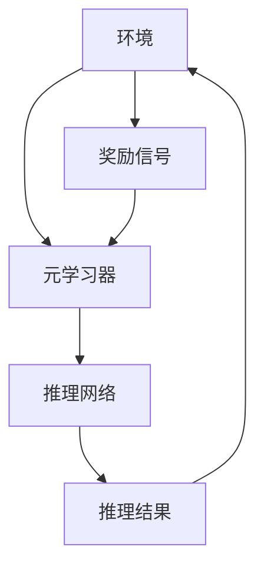

# 元强化学习驱动的动态推理深度与广度调整

> 关键词：元强化学习、动态推理、推理深度、推理广度、智能决策

> 摘要：本文聚焦于元强化学习驱动的动态推理深度与广度调整这一前沿技术。详细阐述了元强化学习和动态推理的核心概念及其内在联系，深入剖析了相关核心算法原理，并给出了具体的Python实现步骤。同时，引入了数学模型和公式对其进行严谨的理论支持。通过项目实战，展示了如何在实际中应用该技术进行开发，并分析了代码的实现细节。此外，探讨了该技术在多个实际场景中的应用，推荐了相关的学习资源、开发工具和论文著作。最后，总结了其未来发展趋势与挑战，并提供了常见问题的解答和扩展阅读的参考资料，旨在为读者全面深入地了解该技术提供一个系统的指南。

## 1. 背景介绍 
### 1.1 目的和范围
在当今的人工智能领域，深度神经网络在诸多任务中取得了显著的成果。然而，传统的神经网络在推理过程中往往采用固定的深度和广度，这在面对复杂多变的环境时，可能会导致计算资源的浪费或推理性能的不足。元强化学习驱动的动态推理深度与广度调整技术旨在解决这一问题，通过学习在不同环境下动态地调整推理的深度和广度，以实现更高效、更智能的推理过程。本文的范围将涵盖该技术的核心概念、算法原理、数学模型、实际应用等多个方面，旨在为读者提供一个全面而深入的了解。

### 1.2 预期读者
本文预期读者包括人工智能、机器学习领域的研究人员、开发者，以及对元强化学习和动态推理技术感兴趣的学生和爱好者。对于有一定编程基础和机器学习知识的读者，将更容易理解文中的技术细节和代码实现。

### 1.3 文档结构概述
本文将按照以下结构进行组织：首先介绍核心概念与联系，包括元强化学习和动态推理的原理及架构；接着阐述核心算法原理，并给出具体的Python操作步骤；然后引入数学模型和公式进行理论支持；通过项目实战展示代码的实际案例和详细解释；探讨该技术在实际场景中的应用；推荐相关的工具和资源；最后总结未来发展趋势与挑战，提供常见问题解答和扩展阅读参考资料。

### 1.4 术语表
#### 1.4.1 核心术语定义
- **元强化学习（Meta-Reinforcement Learning）**：一种能够在不同的强化学习任务中快速学习和适应的学习方法，它通过学习如何学习，使智能体能够在新的任务中更快地找到最优策略。
- **动态推理（Dynamic Inference）**：在推理过程中，根据当前的输入和环境信息，动态地调整推理的过程和参数，以实现更高效和准确的推理。
- **推理深度（Inference Depth）**：指在推理过程中神经网络的层数或计算步骤的数量。
- **推理广度（Inference Breadth）**：指在推理过程中神经网络每层的神经元数量或分支数量。

#### 1.4.2 相关概念解释
- **强化学习（Reinforcement Learning）**：一种通过智能体与环境进行交互，根据环境反馈的奖励信号来学习最优策略的机器学习方法。
- **策略网络（Policy Network）**：在强化学习中，用于生成智能体动作的神经网络。
- **价值网络（Value Network）**：用于估计智能体在某个状态下的价值的神经网络。

#### 1.4.3 缩略词列表
- **MDP（Markov Decision Process）**：马尔可夫决策过程
- **Q-Learning**：一种无模型的强化学习算法
- **PPO（Proximal Policy Optimization）**：近端策略优化算法

## 2. 核心概念与联系 
### 核心概念原理
#### 元强化学习
元强化学习的核心思想是让智能体在多个不同的强化学习任务中学习到通用的学习策略。传统的强化学习通常是针对单个任务进行训练，而元强化学习则是在多个任务的分布上进行学习，使得智能体能够在新的任务中快速适应。例如，智能体在学习了多个不同的迷宫导航任务后，能够在遇到新的迷宫时更快地找到出口。

元强化学习的实现通常基于元学习的框架，通过元训练和元测试两个阶段。在元训练阶段，智能体在多个训练任务上进行学习，更新元学习器的参数；在元测试阶段，智能体在新的测试任务上进行快速适应。

#### 动态推理
动态推理的目标是根据输入数据和当前环境的信息，动态地调整推理过程的深度和广度。传统的神经网络在推理时通常采用固定的结构，而动态推理可以根据不同的输入选择不同的推理路径和计算资源。例如，对于简单的输入数据，可以选择较浅的网络深度和较少的神经元数量进行快速推理；对于复杂的输入数据，则可以增加网络深度和神经元数量以提高推理的准确性。

### 架构的文本示意图
元强化学习驱动的动态推理深度与广度调整系统主要由以下几个部分组成：
- **元学习器**：负责学习如何在不同的任务中调整推理的深度和广度。它接收当前任务的环境信息和历史推理数据，输出一个策略，用于指导推理过程的调整。
- **推理网络**：根据元学习器输出的策略，动态地调整自身的深度和广度进行推理。推理网络可以是一个深度神经网络，如卷积神经网络（CNN）或循环神经网络（RNN）。
- **环境**：提供任务的输入数据和反馈信息。环境可以是一个模拟的游戏环境、图像识别任务或自然语言处理任务等。

### Mermaid流程图


## 3. 核心算法原理 & 具体操作步骤 
### 核心算法原理
本文采用近端策略优化（PPO）算法作为元强化学习的核心算法。PPO是一种基于策略梯度的强化学习算法，它通过限制策略更新的步长，避免了传统策略梯度算法中可能出现的不稳定问题。

PPO算法的核心思想是最大化一个受约束的目标函数，该目标函数由策略的优势函数和一个约束项组成。优势函数表示当前策略相对于旧策略的优势，约束项用于限制策略更新的幅度。

### 具体操作步骤
#### 步骤1：初始化
- 初始化推理网络的参数 $\theta$ 和元学习器的参数 $\phi$。
- 初始化经验回放缓冲区 $D$。

#### 步骤2：与环境交互
- 在每个时间步 $t$，元学习器根据当前环境状态 $s_t$ 生成一个策略 $\pi_{\phi}(a_t|s_t)$。
- 推理网络根据策略 $\pi_{\phi}(a_t|s_t)$ 调整自身的深度和广度，对输入数据进行推理，得到动作 $a_t$。
- 执行动作 $a_t$，与环境交互，得到下一个状态 $s_{t+1}$ 和奖励 $r_t$。
- 将 $(s_t, a_t, r_t, s_{t+1})$ 存储到经验回放缓冲区 $D$ 中。

#### 步骤3：更新元学习器
- 从经验回放缓冲区 $D$ 中采样一批数据 $(s_i, a_i, r_i, s_{i+1})$。
- 计算优势函数 $A(s_i, a_i)$。
- 计算PPO的目标函数：
$$L^{PPO}(\phi) = \min\left( \frac{\pi_{\phi}(a_i|s_i)}{\pi_{\phi_{old}}(a_i|s_i)} A(s_i, a_i), \text{clip}\left(\frac{\pi_{\phi}(a_i|s_i)}{\pi_{\phi_{old}}(a_i|s_i)}, 1 - \epsilon, 1 + \epsilon\right) A(s_i, a_i)\right)$$
其中，$\pi_{\phi_{old}}$ 是旧的策略，$\epsilon$ 是一个超参数，用于限制策略更新的幅度。
- 使用梯度上升法更新元学习器的参数 $\phi$：
$$\phi \leftarrow \phi + \alpha \nabla_{\phi} L^{PPO}(\phi)$$
其中，$\alpha$ 是学习率。

#### 步骤4：更新推理网络
- 根据元学习器输出的策略，更新推理网络的参数 $\theta$，以适应新的推理深度和广度。

### Python源代码实现
```python
import torch
import torch.nn as nn
import torch.optim as optim
import numpy as np

# 定义推理网络
class InferenceNetwork(nn.Module):
    def __init__(self, input_dim, hidden_dim, output_dim):
        super(InferenceNetwork, self).__init__()
        self.fc1 = nn.Linear(input_dim, hidden_dim)
        self.fc2 = nn.Linear(hidden_dim, output_dim)
        self.relu = nn.ReLU()

    def forward(self, x):
        x = self.relu(self.fc1(x))
        x = self.fc2(x)
        return x

# 定义元学习器
class MetaLearner(nn.Module):
    def __init__(self, state_dim, action_dim):
        super(MetaLearner, self).__init__()
        self.fc1 = nn.Linear(state_dim, 64)
        self.fc2 = nn.Linear(64, action_dim)
        self.relu = nn.ReLU()

    def forward(self, x):
        x = self.relu(self.fc1(x))
        x = self.fc2(x)
        return torch.softmax(x, dim=-1)

# 定义PPO算法
class PPO:
    def __init__(self, state_dim, action_dim, lr=0.001, gamma=0.99, epsilon=0.2):
        self.policy = MetaLearner(state_dim, action_dim)
        self.optimizer = optim.Adam(self.policy.parameters(), lr=lr)
        self.gamma = gamma
        self.epsilon = epsilon

    def update(self, states, actions, rewards):
        states = torch.FloatTensor(states)
        actions = torch.LongTensor(actions)
        rewards = torch.FloatTensor(rewards)

        # 计算优势函数
        advantages = rewards - rewards.mean()

        # 计算旧策略的概率
        old_probs = self.policy(states).gather(1, actions.unsqueeze(1)).squeeze(1).detach()

        # 计算新策略的概率
        new_probs = self.policy(states).gather(1, actions.unsqueeze(1)).squeeze(1)

        # 计算PPO目标函数
        ratio = new_probs / old_probs
        surr1 = ratio * advantages
        surr2 = torch.clamp(ratio, 1 - self.epsilon, 1 + self.epsilon) * advantages
        loss = -torch.min(surr1, surr2).mean()

        # 更新元学习器的参数
        self.optimizer.zero_grad()
        loss.backward()
        self.optimizer.step()

# 主训练循环
def train():
    input_dim = 10
    hidden_dim = 20
    output_dim = 5
    state_dim = 10
    action_dim = 3
    num_episodes = 100

    inference_network = InferenceNetwork(input_dim, hidden_dim, output_dim)
    ppo = PPO(state_dim, action_dim)

    for episode in range(num_episodes):
        states = []
        actions = []
        rewards = []

        state = np.random.rand(state_dim)
        for t in range(100):
            states.append(state)

            # 元学习器生成策略
            state_tensor = torch.FloatTensor(state).unsqueeze(0)
            action_probs = ppo.policy(state_tensor).detach().numpy().squeeze()
            action = np.random.choice(action_dim, p=action_probs)
            actions.append(action)

            # 推理网络进行推理
            input_data = np.random.rand(input_dim)
            input_tensor = torch.FloatTensor(input_data).unsqueeze(0)
            output = inference_network(input_tensor)

            # 与环境交互
            next_state = np.random.rand(state_dim)
            reward = np.random.rand()
            rewards.append(reward)

            state = next_state

        # 更新元学习器
        ppo.update(states, actions, rewards)

if __name__ == "__main__":
    train()
```

## 4. 数学模型和公式 & 详细讲解 & 举例说明 
### 马尔可夫决策过程（MDP）
元强化学习通常可以用马尔可夫决策过程（MDP）来描述。MDP是一个五元组 $(S, A, P, R, \gamma)$，其中：
- $S$ 是状态空间，表示环境的所有可能状态。
- $A$ 是动作空间，表示智能体可以采取的所有可能动作。
- $P(s_{t+1}|s_t, a_t)$ 是状态转移概率，表示在状态 $s_t$ 采取动作 $a_t$ 后转移到状态 $s_{t+1}$ 的概率。
- $R(s_t, a_t)$ 是奖励函数，表示在状态 $s_t$ 采取动作 $a_t$ 后获得的奖励。
- $\gamma \in [0, 1]$ 是折扣因子，用于衡量未来奖励的重要性。

### 策略梯度算法
策略梯度算法的目标是最大化智能体在MDP中的累计折扣奖励：
$$J(\theta) = \mathbb{E}_{\tau \sim \pi_{\theta}} \left[ \sum_{t=0}^{\infty} \gamma^t R(s_t, a_t) \right]$$
其中，$\tau = (s_0, a_0, s_1, a_1, \cdots)$ 是一个轨迹，$\pi_{\theta}$ 是策略网络，$\theta$ 是策略网络的参数。

策略梯度算法通过梯度上升法更新策略网络的参数：
$$\theta \leftarrow \theta + \alpha \nabla_{\theta} J(\theta)$$
其中，$\alpha$ 是学习率。

### PPO算法的数学推导
PPO算法的目标函数为：
$$L^{PPO}(\phi) = \min\left( \frac{\pi_{\phi}(a_i|s_i)}{\pi_{\phi_{old}}(a_i|s_i)} A(s_i, a_i), \text{clip}\left(\frac{\pi_{\phi}(a_i|s_i)}{\pi_{\phi_{old}}(a_i|s_i)}, 1 - \epsilon, 1 + \epsilon\right) A(s_i, a_i)\right)$$
其中，$\pi_{\phi}$ 是新的策略，$\pi_{\phi_{old}}$ 是旧的策略，$A(s_i, a_i)$ 是优势函数。

优势函数 $A(s_i, a_i)$ 表示当前动作 $a_i$ 在状态 $s_i$ 下相对于平均动作的优势，可以通过以下公式计算：
$$A(s_i, a_i) = Q(s_i, a_i) - V(s_i)$$
其中，$Q(s_i, a_i)$ 是动作价值函数，表示在状态 $s_i$ 采取动作 $a_i$ 的期望累计折扣奖励，$V(s_i)$ 是状态价值函数，表示在状态 $s_i$ 的期望累计折扣奖励。

### 举例说明
假设我们有一个简单的迷宫导航任务，智能体需要在一个二维迷宫中找到出口。状态空间 $S$ 可以表示为智能体在迷宫中的位置，动作空间 $A$ 可以表示为智能体的四个移动方向（上、下、左、右）。奖励函数 $R(s_t, a_t)$ 可以设置为：如果智能体到达出口，奖励为1；否则，奖励为0。

在训练过程中，元学习器根据当前状态 $s_t$ 生成一个策略 $\pi_{\phi}(a_t|s_t)$，推理网络根据策略调整自身的深度和广度进行推理，选择一个动作 $a_t$。智能体执行动作 $a_t$ 后，与环境交互，得到下一个状态 $s_{t+1}$ 和奖励 $r_t$。根据这些数据，元学习器使用PPO算法更新自身的参数 $\phi$，以提高策略的性能。

## 5. 项目实战：代码实际案例和详细解释说明 
### 5.1  开发环境搭建
#### 安装Python
首先，确保你已经安装了Python 3.6或更高版本。你可以从Python官方网站（https://www.python.org/downloads/） 下载并安装Python。

#### 安装依赖库
使用以下命令安装所需的依赖库：
```bash
pip install torch numpy
```

### 5.2  源代码详细实现和代码解读
以下是项目实战的完整代码：
```python
import torch
import torch.nn as nn
import torch.optim as optim
import numpy as np

# 定义推理网络
class InferenceNetwork(nn.Module):
    def __init__(self, input_dim, hidden_dim, output_dim):
        super(InferenceNetwork, self).__init__()
        self.fc1 = nn.Linear(input_dim, hidden_dim)
        self.fc2 = nn.Linear(hidden_dim, output_dim)
        self.relu = nn.ReLU()

    def forward(self, x):
        x = self.relu(self.fc1(x))
        x = self.fc2(x)
        return x

# 定义元学习器
class MetaLearner(nn.Module):
    def __init__(self, state_dim, action_dim):
        super(MetaLearner, self).__init__()
        self.fc1 = nn.Linear(state_dim, 64)
        self.fc2 = nn.Linear(64, action_dim)
        self.relu = nn.ReLU()

    def forward(self, x):
        x = self.relu(self.fc1(x))
        x = self.fc2(x)
        return torch.softmax(x, dim=-1)

# 定义PPO算法
class PPO:
    def __init__(self, state_dim, action_dim, lr=0.001, gamma=0.99, epsilon=0.2):
        self.policy = MetaLearner(state_dim, action_dim)
        self.optimizer = optim.Adam(self.policy.parameters(), lr=lr)
        self.gamma = gamma
        self.epsilon = epsilon

    def update(self, states, actions, rewards):
        states = torch.FloatTensor(states)
        actions = torch.LongTensor(actions)
        rewards = torch.FloatTensor(rewards)

        # 计算优势函数
        advantages = rewards - rewards.mean()

        # 计算旧策略的概率
        old_probs = self.policy(states).gather(1, actions.unsqueeze(1)).squeeze(1).detach()

        # 计算新策略的概率
        new_probs = self.policy(states).gather(1, actions.unsqueeze(1)).squeeze(1)

        # 计算PPO目标函数
        ratio = new_probs / old_probs
        surr1 = ratio * advantages
        surr2 = torch.clamp(ratio, 1 - self.epsilon, 1 + self.epsilon) * advantages
        loss = -torch.min(surr1, surr2).mean()

        # 更新元学习器的参数
        self.optimizer.zero_grad()
        loss.backward()
        self.optimizer.step()

# 主训练循环
def train():
    input_dim = 10
    hidden_dim = 20
    output_dim = 5
    state_dim = 10
    action_dim = 3
    num_episodes = 100

    inference_network = InferenceNetwork(input_dim, hidden_dim, output_dim)
    ppo = PPO(state_dim, action_dim)

    for episode in range(num_episodes):
        states = []
        actions = []
        rewards = []

        state = np.random.rand(state_dim)
        for t in range(100):
            states.append(state)

            # 元学习器生成策略
            state_tensor = torch.FloatTensor(state).unsqueeze(0)
            action_probs = ppo.policy(state_tensor).detach().numpy().squeeze()
            action = np.random.choice(action_dim, p=action_probs)
            actions.append(action)

            # 推理网络进行推理
            input_data = np.random.rand(input_dim)
            input_tensor = torch.FloatTensor(input_data).unsqueeze(0)
            output = inference_network(input_tensor)

            # 与环境交互
            next_state = np.random.rand(state_dim)
            reward = np.random.rand()
            rewards.append(reward)

            state = next_state

        # 更新元学习器
        ppo.update(states, actions, rewards)

if __name__ == "__main__":
    train()
```

### 5.3  代码解读与分析
#### 推理网络（InferenceNetwork）
推理网络是一个简单的两层全连接神经网络，用于对输入数据进行推理。它接收一个输入向量，通过两个全连接层和一个ReLU激活函数，输出一个结果向量。

#### 元学习器（MetaLearner）
元学习器也是一个两层全连接神经网络，用于生成策略。它接收当前环境状态作为输入，输出一个动作概率分布。

#### PPO算法（PPO）
PPO类实现了近端策略优化算法。在 `update` 方法中，首先计算优势函数，然后计算旧策略和新策略的概率，接着计算PPO目标函数，最后使用梯度上升法更新元学习器的参数。

#### 主训练循环（train）
在主训练循环中，我们进行了多个回合的训练。每个回合中，智能体与环境进行交互，收集状态、动作和奖励数据。然后，使用PPO算法更新元学习器的参数。

## 6. 实际应用场景 
### 图像识别
在图像识别任务中，不同的图像可能具有不同的复杂度。对于简单的图像，如纯色背景上的单一物体，可以使用较浅的网络深度和较少的神经元数量进行快速推理；对于复杂的图像，如包含多个物体和复杂背景的图像，则可以增加网络深度和神经元数量以提高识别的准确性。元强化学习驱动的动态推理深度与广度调整技术可以根据图像的复杂度动态地调整推理过程，从而提高推理效率和准确性。

### 自然语言处理
在自然语言处理任务中，如文本分类、机器翻译等，不同的文本长度和语义复杂度也需要不同的推理资源。对于短文本和简单的语义，可以使用较浅的网络和较少的计算资源；对于长文本和复杂的语义，则需要增加网络深度和计算资源。该技术可以根据文本的特征动态地调整推理过程，以适应不同的任务需求。

### 机器人导航
在机器人导航任务中，机器人需要在不同的环境中找到最优的路径。不同的环境可能具有不同的复杂度，如障碍物的数量、地形的起伏等。元强化学习驱动的动态推理深度与广度调整技术可以让机器人根据当前环境的信息动态地调整推理过程，选择最优的导航策略，从而提高导航的效率和成功率。

## 7. 工具和资源推荐
### 7.1 学习资源推荐
#### 7.1.1 书籍推荐
- 《强化学习：原理与Python实现》：这本书详细介绍了强化学习的基本原理和算法，并提供了Python代码实现。
- 《深度学习》：由Ian Goodfellow、Yoshua Bengio和Aaron Courville所著，是深度学习领域的经典教材，涵盖了神经网络、卷积神经网络、循环神经网络等多个方面的内容。
- 《元学习：理论与实践》：专门介绍元学习的相关理论和方法，对于深入理解元强化学习有很大的帮助。

#### 7.1.2 在线课程
- Coursera上的“强化学习专项课程”：由DeepMind的研究人员授课，内容涵盖了强化学习的基础知识、算法和应用。
- edX上的“深度学习微硕士课程”：提供了深度学习的全面学习资源，包括神经网络、卷积神经网络、循环神经网络等多个方面的内容。
- OpenAI的Spinning Up：提供了强化学习算法的详细实现和教程，适合初学者学习。

#### 7.1.3 技术博客和网站
- Medium上的“Towards Data Science”：有很多关于机器学习、深度学习和强化学习的优秀文章。
- OpenAI的官方博客：发布了很多关于人工智能和强化学习的最新研究成果。
- arXiv.org：一个预印本论文平台，提供了大量关于人工智能和机器学习的最新研究论文。

### 7.2 开发工具框架推荐
#### 7.2.1 IDE和编辑器
- PyCharm：一款专业的Python集成开发环境，提供了丰富的代码编辑、调试和分析功能。
- Jupyter Notebook：一个交互式的笔记本环境，适合进行数据探索、模型训练和可视化。
- Visual Studio Code：一款轻量级的代码编辑器，支持多种编程语言和插件扩展。

#### 7.2.2 调试和性能分析工具
- TensorBoard：一个可视化工具，用于监控和分析深度学习模型的训练过程和性能。
- PyTorch Profiler：PyTorch提供的性能分析工具，用于分析模型的计算时间和内存使用情况。
- cProfile：Python标准库中的性能分析工具，用于分析Python代码的执行时间。

#### 7.2.3 相关框架和库
- PyTorch：一个开源的深度学习框架，提供了丰富的神经网络模块和优化算法。
- TensorFlow：另一个广泛使用的深度学习框架，具有强大的分布式训练和部署能力。
- Stable Baselines3：一个基于PyTorch的强化学习库，提供了多种强化学习算法的实现。

### 7.3 相关论文著作推荐
#### 7.3.1 经典论文
- “Proximal Policy Optimization Algorithms”：介绍了近端策略优化算法（PPO）的原理和实现。
- “Model-Agnostic Meta-Learning for Fast Adaptation of Deep Networks”：提出了模型无关元学习（MAML）的方法，是元学习领域的经典论文。
- “Deep Reinforcement Learning with Double Q-learning”：提出了Double Q-learning算法，用于解决传统Q-learning算法中的高估问题。

#### 7.3.2 最新研究成果
- 关注NeurIPS、ICML、CVPR等顶级人工智能会议的论文，了解元强化学习和动态推理领域的最新研究进展。
- 关注知名研究机构（如OpenAI、DeepMind、Google Research等）的官方网站，获取最新的研究成果和技术报告。

#### 7.3.3 应用案例分析
- 查找相关领域的应用案例，如在图像识别、自然语言处理、机器人导航等领域的应用，了解该技术在实际中的应用效果和挑战。

## 8. 总结：未来发展趋势与挑战
### 未来发展趋势
- **多模态融合**：将元强化学习驱动的动态推理技术应用于多模态数据（如图像、文本、音频等），实现更智能的跨模态推理。
- **与其他技术的结合**：与知识图谱、迁移学习等技术相结合，进一步提高推理的效率和准确性。
- **自主智能系统**：在自主智能系统（如自动驾驶汽车、智能机器人等）中广泛应用，实现更加灵活和高效的决策。

### 挑战
- **计算资源需求**：动态推理需要在推理过程中实时调整网络结构，这可能会增加计算资源的需求，如何在有限的计算资源下实现高效的动态推理是一个挑战。
- **数据稀缺性**：元强化学习需要大量的训练数据，而在某些实际应用场景中，数据可能非常稀缺，如何在数据稀缺的情况下进行有效的元学习是一个亟待解决的问题。
- **可解释性**：元强化学习和动态推理的决策过程往往比较复杂，缺乏可解释性，如何提高模型的可解释性，让用户更好地理解模型的决策过程是一个重要的挑战。

## 9. 附录：常见问题与解答
### 问题1：元强化学习和传统强化学习有什么区别？
元强化学习的目标是在多个不同的强化学习任务中学习到通用的学习策略，使得智能体能够在新的任务中快速适应。而传统强化学习通常是针对单个任务进行训练，缺乏在不同任务之间的迁移能力。

### 问题2：动态推理的优势是什么？
动态推理可以根据输入数据和当前环境的信息，动态地调整推理过程的深度和广度，从而提高推理效率和准确性。相比于传统的固定结构推理，动态推理可以在不同的任务和环境中更加灵活地分配计算资源。

### 问题3：PPO算法的优势是什么？
PPO算法通过限制策略更新的步长，避免了传统策略梯度算法中可能出现的不稳定问题。它在训练过程中更加稳定，收敛速度更快，并且在实际应用中取得了很好的效果。

### 问题4：如何选择合适的推理深度和广度？
推理深度和广度的选择通常需要根据具体的任务和数据特点进行调整。可以通过实验和调优的方法，找到在不同任务下的最优推理深度和广度。元强化学习可以帮助智能体自动学习在不同环境下的最优推理深度和广度。

## 10. 扩展阅读 & 参考资料
- Sutton, R. S., & Barto, A. G. (2018). Reinforcement learning: An introduction. MIT press.
- Goodfellow, I., Bengio, Y., & Courville, A. (2016). Deep learning. MIT press.
- Finn, C., Abbeel, P., & Levine, S. (2017). Model-agnostic meta-learning for fast adaptation of deep networks. In Proceedings of the 34th International Conference on Machine Learning-Volume 70 (pp. 1126-1135). JMLR. org.
- Schulman, J., Wolski, F., Dhariwal, P., Radford, A., & Klimov, O. (2017). Proximal policy optimization algorithms. arXiv preprint arXiv:1707.06347.

作者：AI天才研究院/AI Genius Institute & 禅与计算机程序设计艺术 /Zen And The Art of Computer Programming