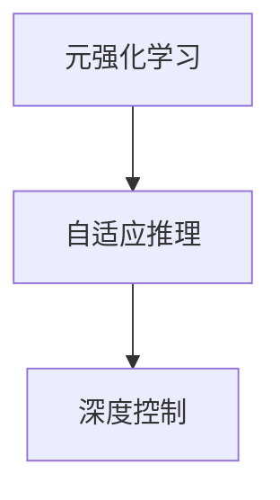

# 元强化学习驱动的自适应推理深度控制

> 关键词：元强化学习、自适应推理、深度控制、智能决策、环境适应

> 摘要：本文聚焦于元强化学习驱动的自适应推理深度控制这一前沿领域。首先介绍了该研究的背景，包括目的、预期读者、文档结构和相关术语。接着阐述了核心概念及其联系，给出了原理和架构的文本示意图与 Mermaid 流程图。详细讲解了核心算法原理，并用 Python 代码进行了具体实现。同时，介绍了相关的数学模型和公式，并举例说明。通过项目实战，展示了代码的实际应用和详细解释。探讨了实际应用场景，推荐了学习资源、开发工具框架和相关论文著作。最后总结了未来发展趋势与挑战，还提供了常见问题解答和扩展阅读参考资料，旨在为读者全面深入地理解和应用元强化学习驱动的自适应推理深度控制提供指导。

## 1. 背景介绍 
### 1.1 目的和范围
在当今复杂多变的环境中，智能系统需要具备快速适应新情况并做出有效决策的能力。传统的强化学习方法在面对动态变化的任务和环境时，往往需要大量的训练数据和时间来重新学习，效率较低。元强化学习驱动的自适应推理深度控制旨在解决这一问题，通过让智能体学习如何快速适应新任务，在不同环境中高效地进行推理和决策。

本文的范围涵盖了元强化学习驱动的自适应推理深度控制的核心概念、算法原理、数学模型、项目实战、应用场景以及相关的工具和资源推荐等方面。通过全面深入的探讨，帮助读者理解这一领域的关键技术和应用方法。

### 1.2 预期读者
本文预期读者包括人工智能、机器学习、控制理论等领域的研究人员和开发者，对智能决策和自适应系统感兴趣的工程师，以及相关专业的学生。无论是希望深入了解元强化学习理论的学者，还是想要将其应用到实际项目中的实践者，都能从本文中获得有价值的信息。

### 1.3 文档结构概述
本文将按照以下结构进行组织：
1. **背景介绍**：阐述研究的目的、预期读者、文档结构和相关术语。
2. **核心概念与联系**：介绍元强化学习、自适应推理和深度控制的核心概念，以及它们之间的联系，并给出原理和架构的文本示意图与 Mermaid 流程图。
3. **核心算法原理 & 具体操作步骤**：详细讲解核心算法原理，并用 Python 代码进行具体实现。
4. **数学模型和公式 & 详细讲解 & 举例说明**：介绍相关的数学模型和公式，并通过具体例子进行说明。
5. **项目实战：代码实际案例和详细解释说明**：通过一个实际项目，展示代码的开发环境搭建、源代码实现和详细解读。
6. **实际应用场景**：探讨元强化学习驱动的自适应推理深度控制在不同领域的实际应用场景。
7. **工具和资源推荐**：推荐学习资源、开发工具框架和相关论文著作。
8. **总结：未来发展趋势与挑战**：总结该领域的未来发展趋势和面临的挑战。
9. **附录：常见问题与解答**：解答读者可能遇到的常见问题。
10. **扩展阅读 & 参考资料**：提供扩展阅读的建议和相关参考资料。

### 1.4 术语表
#### 1.4.1 核心术语定义
- **元强化学习（Meta-Reinforcement Learning）**：一种强化学习方法，旨在让智能体学习如何快速适应新任务，通过在多个任务上进行训练，学习到通用的学习策略。
- **自适应推理（Adaptive Inference）**：智能体根据当前环境和任务的变化，动态调整推理过程和策略，以提高决策的准确性和效率。
- **深度控制（Deep Control）**：利用深度神经网络来实现对系统的控制，通过学习复杂的映射关系，实现高效的控制策略。
- **智能体（Agent）**：在环境中进行交互和决策的实体，通过感知环境状态，采取行动并获得奖励。
- **环境（Environment）**：智能体所处的外部世界，提供状态信息和奖励反馈。

#### 1.4.2 相关概念解释
- **策略网络（Policy Network）**：用于生成智能体的行动策略，根据当前环境状态输出行动概率分布。
- **价值网络（Value Network）**：用于评估当前状态的价值，预测在该状态下采取不同行动所能获得的长期奖励。
- **经验回放（Experience Replay）**：一种训练技巧，将智能体的经验存储在经验池中，随机从中采样进行训练，以提高训练的稳定性和效率。

#### 1.4.3 缩略词列表
- **RL（Reinforcement Learning）**：强化学习
- **MAML（Model-Agnostic Meta-Learning）**：模型无关元学习
- **PPO（Proximal Policy Optimization）**：近端策略优化
- **DQN（Deep Q-Network）**：深度 Q 网络

## 2. 核心概念与联系 
### 核心概念原理
#### 元强化学习
元强化学习的核心思想是让智能体在多个任务上进行训练，学习到一种通用的学习策略，使得在面对新任务时能够快速适应。传统的强化学习方法通常针对单个任务进行训练，当任务发生变化时，需要重新进行大量的训练。而元强化学习通过在多个任务上的学习，能够捕捉到任务之间的共性和规律，从而在新任务上快速调整策略。

#### 自适应推理
自适应推理强调智能体能够根据当前环境和任务的变化，动态调整推理过程和策略。在复杂多变的环境中，固定的推理策略可能无法适应新的情况，因此需要智能体能够实时感知环境变化，并相应地调整推理方法。例如，在机器人导航任务中，当遇到新的障碍物或环境布局发生变化时，智能体能够快速调整导航策略。

#### 深度控制
深度控制利用深度神经网络来实现对系统的控制。深度神经网络具有强大的表达能力，能够学习到复杂的映射关系。通过将深度神经网络应用于控制领域，可以实现高效的控制策略。例如，在自动驾驶中，深度神经网络可以根据传感器数据实时预测车辆的行驶方向和速度，实现精确的控制。

### 核心概念架构的文本示意图
```plaintext
+---------------------+
|      元强化学习      |
|  学习通用学习策略   |
+---------------------+
          |
          v
+---------------------+
|    自适应推理       |
|  根据环境调整策略  |
+---------------------+
          |
          v
+---------------------+
|      深度控制       |
|  用深度网络实现控制 |
+---------------------+
```

### Mermaid 流程图


## 3. 核心算法原理 & 具体操作步骤 
### 核心算法原理
本文将介绍一种基于 MAML（Model-Agnostic Meta-Learning）的元强化学习算法。MAML 是一种模型无关的元学习方法，其核心思想是找到一个初始参数，使得在新任务上进行少量的梯度更新后，能够快速收敛到较好的策略。

具体来说，MAML 的训练过程分为两个阶段：元训练和元测试。在元训练阶段，智能体在多个任务上进行训练，通过多次梯度更新找到一个通用的初始参数。在元测试阶段，智能体在新任务上使用这个初始参数，并进行少量的梯度更新，以快速适应新任务。

### 具体操作步骤
1. **数据收集**：在多个任务上收集智能体的经验数据，包括状态、行动、奖励等。
2. **元训练**：
    - 初始化策略网络的参数 $\theta$。
    - 对于每个任务 $T_i$：
        - 从任务 $T_i$ 中采样一批数据。
        - 使用这些数据进行一次或多次梯度更新，得到临时参数 $\theta_i'$。
        - 计算在任务 $T_i$ 上使用临时参数 $\theta_i'$ 的损失 $L(\theta_i')$。
    - 对所有任务的损失进行求和，得到元损失 $L_{meta}=\sum_{i}L(\theta_i')$。
    - 使用元损失对初始参数 $\theta$ 进行梯度更新。
3. **元测试**：
    - 在新任务上使用初始参数 $\theta$。
    - 从新任务中采样少量数据，进行一次或多次梯度更新，得到适应新任务的参数 $\theta_{new}$。
    - 使用参数 $\theta_{new}$ 进行决策。

### Python 代码实现
```python
import torch
import torch.nn as nn
import torch.optim as optim

# 定义策略网络
class PolicyNetwork(nn.Module):
    def __init__(self, input_dim, output_dim):
        super(PolicyNetwork, self).__init__()
        self.fc1 = nn.Linear(input_dim, 64)
        self.fc2 = nn.Linear(64, output_dim)

    def forward(self, x):
        x = torch.relu(self.fc1(x))
        x = torch.softmax(self.fc2(x), dim=-1)
        return x

# 元训练函数
def meta_train(policy_network, tasks, num_iterations, inner_lr, outer_lr):
    outer_optimizer = optim.Adam(policy_network.parameters(), lr=outer_lr)

    for iteration in range(num_iterations):
        meta_loss = 0
        for task in tasks:
            # 复制当前参数
            fast_weights = {name: param.clone() for name, param in policy_network.named_parameters()}

            # 内循环更新
            for _ in range(1):
                states, actions, rewards = task.sample_data()
                logits = policy_network(states)
                log_probs = torch.log(logits.gather(1, actions.unsqueeze(1)))
                loss = -(log_probs * rewards.unsqueeze(1)).mean()

                gradients = torch.autograd.grad(loss, fast_weights.values())
                fast_weights = {name: param - inner_lr * grad for (name, param), grad in zip(fast_weights.items(), gradients)}

            # 计算元损失
            states, actions, rewards = task.sample_data()
            logits = policy_network.forward_with_weights(states, fast_weights)
            log_probs = torch.log(logits.gather(1, actions.unsqueeze(1)))
            meta_loss += -(log_probs * rewards.unsqueeze(1)).mean()

        # 外循环更新
        outer_optimizer.zero_grad()
        meta_loss.backward()
        outer_optimizer.step()

        if iteration % 10 == 0:
            print(f'Iteration {iteration}, Meta Loss: {meta_loss.item()}')

    return policy_network

# 元测试函数
def meta_test(policy_network, new_task, num_adapt_steps, inner_lr):
    fast_weights = {name: param.clone() for name, param in policy_network.named_parameters()}

    for _ in range(num_adapt_steps):
        states, actions, rewards = new_task.sample_data()
        logits = policy_network.forward_with_weights(states, fast_weights)
        log_probs = torch.log(logits.gather(1, actions.unsqueeze(1)))
        loss = -(log_probs * rewards.unsqueeze(1)).mean()

        gradients = torch.autograd.grad(loss, fast_weights.values())
        fast_weights = {name: param - inner_lr * grad for (name, param), grad in zip(fast_weights.items(), gradients)}

    return fast_weights
```

## 4. 数学模型和公式 & 详细讲解 & 举例说明 
### 数学模型和公式
#### 策略网络
策略网络 $\pi_{\theta}(a|s)$ 表示在状态 $s$ 下采取行动 $a$ 的概率分布，其中 $\theta$ 是策略网络的参数。我们可以使用神经网络来近似这个概率分布，例如：
$$\pi_{\theta}(a|s) = \text{softmax}(W_2\text{ReLU}(W_1s + b_1) + b_2)$$
其中 $W_1, b_1, W_2, b_2$ 是神经网络的权重和偏置。

#### 元损失
元损失 $L_{meta}$ 是在多个任务上的损失之和，用于更新初始参数 $\theta$。对于每个任务 $T_i$，我们首先使用初始参数 $\theta$ 进行一次或多次梯度更新，得到临时参数 $\theta_i'$，然后计算在任务 $T_i$ 上使用临时参数 $\theta_i'$ 的损失 $L(\theta_i')$。元损失可以表示为：
$$L_{meta}=\sum_{i}L(\theta_i')$$

#### 梯度更新
在元训练和元测试阶段，我们都需要进行梯度更新。梯度更新的公式为：
$$\theta_{new} = \theta - \alpha\nabla_{\theta}L(\theta)$$
其中 $\alpha$ 是学习率，$\nabla_{\theta}L(\theta)$ 是损失函数 $L(\theta)$ 关于参数 $\theta$ 的梯度。

### 详细讲解
#### 策略网络
策略网络的作用是根据当前状态生成行动概率分布。通过神经网络的非线性变换，策略网络能够学习到复杂的状态-行动映射关系。softmax 函数用于将神经网络的输出转换为概率分布，确保所有行动的概率之和为 1。

#### 元损失
元损失的计算是 MAML 算法的核心。通过在多个任务上进行训练，我们希望找到一个初始参数 $\theta$，使得在新任务上进行少量的梯度更新后，能够快速收敛到较好的策略。元损失的最小化过程就是寻找这个最优初始参数的过程。

#### 梯度更新
梯度更新是神经网络训练的基本方法。通过计算损失函数关于参数的梯度，我们可以知道参数应该朝着哪个方向进行调整，以减小损失函数的值。学习率 $\alpha$ 控制了每次更新的步长，过大的学习率可能导致训练不稳定，过小的学习率则会导致训练速度缓慢。

### 举例说明
假设我们有两个任务 $T_1$ 和 $T_2$，每个任务都有自己的状态空间和行动空间。我们的目标是找到一个通用的初始参数 $\theta$，使得在新任务上能够快速适应。

在元训练阶段，我们首先初始化参数 $\theta$。对于任务 $T_1$，我们从任务中采样一批数据，使用这些数据进行一次梯度更新，得到临时参数 $\theta_1'$。然后计算在任务 $T_1$ 上使用临时参数 $\theta_1'$ 的损失 $L(\theta_1')$。同样地，对于任务 $T_2$，我们得到临时参数 $\theta_2'$ 和损失 $L(\theta_2')$。元损失 $L_{meta}=L(\theta_1') + L(\theta_2')$。

使用元损失对初始参数 $\theta$ 进行梯度更新，得到新的参数 $\theta_{new}$。在元测试阶段，当遇到新任务时，我们使用初始参数 $\theta_{new}$，并进行少量的梯度更新，以快速适应新任务。

## 5. 项目实战：代码实际案例和详细解释说明 
### 5.1  开发环境搭建
#### 操作系统
本文的项目可以在 Linux、Windows 或 macOS 操作系统上运行。建议使用 Linux 系统，因为它在机器学习开发中具有更好的稳定性和兼容性。

#### Python 环境
使用 Python 3.7 或更高版本。可以使用 Anaconda 来管理 Python 环境，具体步骤如下：
1. 下载并安装 Anaconda：https://www.anaconda.com/products/individual
2. 创建一个新的 Python 环境：
```bash
conda create -n meta_rl python=3.8
conda activate meta_rl
```

#### 依赖库安装
安装必要的 Python 库，包括 PyTorch、NumPy 等：
```bash
pip install torch numpy
```

### 5.2  源代码详细实现和代码解读
```python
import torch
import torch.nn as nn
import torch.optim as optim
import numpy as np

# 定义任务类
class Task:
    def __init__(self, input_dim, output_dim):
        self.input_dim = input_dim
        self.output_dim = output_dim

    def sample_data(self):
        states = torch.randn(10, self.input_dim)
        actions = torch.randint(0, self.output_dim, (10,))
        rewards = torch.randn(10)
        return states, actions, rewards

# 定义策略网络
class PolicyNetwork(nn.Module):
    def __init__(self, input_dim, output_dim):
        super(PolicyNetwork, self).__init__()
        self.fc1 = nn.Linear(input_dim, 64)
        self.fc2 = nn.Linear(64, output_dim)

    def forward(self, x):
        x = torch.relu(self.fc1(x))
        x = torch.softmax(self.fc2(x), dim=-1)
        return x

    def forward_with_weights(self, x, weights):
        x = torch.relu(nn.functional.linear(x, weights['fc1.weight'], weights['fc1.bias']))
        x = torch.softmax(nn.functional.linear(x, weights['fc2.weight'], weights['fc2.bias']), dim=-1)
        return x

# 元训练函数
def meta_train(policy_network, tasks, num_iterations, inner_lr, outer_lr):
    outer_optimizer = optim.Adam(policy_network.parameters(), lr=outer_lr)

    for iteration in range(num_iterations):
        meta_loss = 0
        for task in tasks:
            # 复制当前参数
            fast_weights = {name: param.clone() for name, param in policy_network.named_parameters()}

            # 内循环更新
            for _ in range(1):
                states, actions, rewards = task.sample_data()
                logits = policy_network.forward_with_weights(states, fast_weights)
                log_probs = torch.log(logits.gather(1, actions.unsqueeze(1)))
                loss = -(log_probs * rewards.unsqueeze(1)).mean()

                gradients = torch.autograd.grad(loss, fast_weights.values())
                fast_weights = {name: param - inner_lr * grad for (name, param), grad in zip(fast_weights.items(), gradients)}

            # 计算元损失
            states, actions, rewards = task.sample_data()
            logits = policy_network.forward_with_weights(states, fast_weights)
            log_probs = torch.log(logits.gather(1, actions.unsqueeze(1)))
            meta_loss += -(log_probs * rewards.unsqueeze(1)).mean()

        # 外循环更新
        outer_optimizer.zero_grad()
        meta_loss.backward()
        outer_optimizer.step()

        if iteration % 10 == 0:
            print(f'Iteration {iteration}, Meta Loss: {meta_loss.item()}')

    return policy_network

# 元测试函数
def meta_test(policy_network, new_task, num_adapt_steps, inner_lr):
    fast_weights = {name: param.clone() for name, param in policy_network.named_parameters()}

    for _ in range(num_adapt_steps):
        states, actions, rewards = new_task.sample_data()
        logits = policy_network.forward_with_weights(states, fast_weights)
        log_probs = torch.log(logits.gather(1, actions.unsqueeze(1)))
        loss = -(log_probs * rewards.unsqueeze(1)).mean()

        gradients = torch.autograd.grad(loss, fast_weights.values())
        fast_weights = {name: param - inner_lr * grad for (name, param), grad in zip(fast_weights.items(), gradients)}

    return fast_weights

# 主函数
if __name__ == '__main__':
    input_dim = 10
    output_dim = 5
    num_tasks = 5
    num_iterations = 100
    inner_lr = 0.01
    outer_lr = 0.001
    num_adapt_steps = 5

    # 创建任务
    tasks = [Task(input_dim, output_dim) for _ in range(num_tasks)]
    new_task = Task(input_dim, output_dim)

    # 创建策略网络
    policy_network = PolicyNetwork(input_dim, output_dim)

    # 元训练
    policy_network = meta_train(policy_network, tasks, num_iterations, inner_lr, outer_lr)

    # 元测试
    adapted_weights = meta_test(policy_network, new_task, num_adapt_steps, inner_lr)
```

### 5.3  代码解读与分析
#### 任务类（Task）
任务类用于生成任务数据，包括状态、行动和奖励。在实际应用中，任务类可以根据具体的任务需求进行实现。

#### 策略网络（PolicyNetwork）
策略网络是一个简单的两层神经网络，用于生成行动概率分布。`forward` 方法用于正常的前向传播，`forward_with_weights` 方法用于使用指定的参数进行前向传播。

#### 元训练函数（meta_train）
元训练函数实现了 MAML 算法的元训练阶段。在每个迭代中，对于每个任务，首先进行内循环更新，得到临时参数，然后计算元损失，最后进行外循环更新。

#### 元测试函数（meta_test）
元测试函数实现了 MAML 算法的元测试阶段。在新任务上，使用初始参数进行少量的梯度更新，得到适应新任务的参数。

#### 主函数
主函数创建了任务和策略网络，进行元训练和元测试。通过调整参数，可以观察到不同的训练效果。

## 6. 实际应用场景 
### 机器人控制
在机器人控制领域，元强化学习驱动的自适应推理深度控制可以让机器人快速适应不同的任务和环境。例如，在机器人导航任务中，机器人可能会遇到不同的地形和障碍物，通过元强化学习，机器人可以学习到通用的导航策略，在新的环境中快速调整导航路线。

### 自动驾驶
自动驾驶车辆需要在复杂多变的交通环境中做出决策。元强化学习可以帮助自动驾驶车辆快速适应不同的交通场景，如拥堵路段、雨天行驶等。通过自适应推理，车辆可以根据实时的交通信息和环境变化，动态调整行驶策略。

### 金融投资
在金融投资领域，市场环境复杂多变，传统的投资策略可能无法适应新的市场情况。元强化学习驱动的自适应推理深度控制可以让投资智能体学习到通用的投资策略，在不同的市场环境中快速调整投资组合，提高投资收益。

### 游戏智能体
在游戏开发中，元强化学习可以让游戏智能体快速适应不同的游戏关卡和对手策略。例如，在策略游戏中，智能体可以通过元学习，学习到通用的游戏策略，在新的关卡中快速制定有效的战术。

## 7. 工具和资源推荐
### 7.1 学习资源推荐
#### 7.1.1 书籍推荐
- 《Reinforcement Learning: An Introduction》：这是一本经典的强化学习教材，详细介绍了强化学习的基本概念、算法和应用。
- 《Deep Learning》：由 Ian Goodfellow、Yoshua Bengio 和 Aaron Courville 合著，是深度学习领域的权威教材，涵盖了深度学习的各个方面。
- 《Meta-Learning: A Survey》：对元学习进行了全面的综述，介绍了元学习的各种方法和应用。

#### 7.1.2 在线课程
- Coursera 上的《Reinforcement Learning Specialization》：由 University of Alberta 提供，是一个系统的强化学习课程，包括多个子课程，适合初学者和有一定基础的学习者。
- edX 上的《Deep Learning Fundamentals》：介绍了深度学习的基本原理和方法，是学习深度学习的入门课程。
- OpenAI Gym 官方文档：提供了丰富的强化学习环境和示例代码，是学习强化学习实践的重要资源。

#### 7.1.3 技术博客和网站
- Towards Data Science：一个专注于数据科学和机器学习的博客平台，有很多关于元强化学习和自适应推理的文章。
- ArXiv.org：一个预印本服务器，提供了大量的学术论文，包括元学习和强化学习领域的最新研究成果。
- Distill.pub：一个专注于机器学习可视化和解释的网站，有很多关于深度学习和强化学习的可视化文章，有助于深入理解算法原理。

### 7.2 开发工具框架推荐
#### 7.2.1 IDE和编辑器
- PyCharm：一个功能强大的 Python 集成开发环境，提供了代码编辑、调试、版本控制等功能，适合开发大型的 Python 项目。
- Jupyter Notebook：一个交互式的开发环境，适合进行数据分析和模型实验。可以在浏览器中编写和运行代码，方便展示和分享结果。
- Visual Studio Code：一个轻量级的代码编辑器，支持多种编程语言和插件，具有丰富的扩展功能，适合快速开发和调试代码。

#### 7.2.2 调试和性能分析工具
- TensorBoard：一个用于可视化深度学习训练过程的工具，可以实时监控损失函数、准确率等指标，帮助调试和优化模型。
- PyTorch Profiler：PyTorch 提供的性能分析工具，可以分析模型的运行时间、内存使用等情况，帮助找出性能瓶颈。
- cProfile：Python 内置的性能分析工具，可以分析 Python 代码的运行时间和函数调用情况，帮助优化代码性能。

#### 7.2.3 相关框架和库
- PyTorch：一个开源的深度学习框架，提供了丰富的神经网络层和优化算法，支持 GPU 加速，是目前最流行的深度学习框架之一。
- TensorFlow：另一个开源的深度学习框架，具有强大的分布式训练和部署能力，广泛应用于工业界和学术界。
- OpenAI Gym：一个用于开发和比较强化学习算法的工具包，提供了大量的强化学习环境，方便进行算法实验和评估。

### 7.3 相关论文著作推荐
#### 7.3.1 经典论文
- Finn, C., Abbeel, P., & Levine, S. (2017). Model-agnostic meta-learning for fast adaptation of deep networks. In Proceedings of the 34th International Conference on Machine Learning-Volume 70 (pp. 1126-1135).
- Schulman, J., Wolski, F., Dhariwal, P., Radford, A., & Klimov, O. (2017). Proximal policy optimization algorithms. arXiv preprint arXiv:1707.06347.
- Mnih, V., Kavukcuoglu, K., Silver, D., Rusu, A. A., Veness, J., Bellemare, M. G.,... & Petersen, S. (2015). Human-level control through deep reinforcement learning. Nature, 518(7540), 529-533.

#### 7.3.2 最新研究成果
- You can search for the latest research papers on ArXiv.org using keywords such as "meta-reinforcement learning", "adaptive inference", and "deep control".

#### 7.3.3 应用案例分析
- There are many application case studies in the field of robotics, autonomous driving, and finance. You can find relevant papers and reports on academic databases and industry websites.

## 8. 总结：未来发展趋势与挑战
### 未来发展趋势
#### 更强大的元学习算法
随着研究的深入，未来可能会出现更强大的元学习算法，能够更高效地学习通用的学习策略，在更少的训练数据和时间内适应新任务。

#### 与其他技术的融合
元强化学习可能会与其他技术如迁移学习、进化算法等进行融合，进一步提高智能体的适应能力和学习效率。

#### 更广泛的应用领域
元强化学习驱动的自适应推理深度控制将在更多的领域得到应用，如医疗保健、能源管理、农业等，为解决复杂的实际问题提供有效的方法。

### 挑战
#### 计算资源需求
元强化学习通常需要大量的计算资源进行训练，特别是在处理复杂的任务和大规模数据集时。如何降低计算资源需求，提高训练效率是一个重要的挑战。

#### 数据收集和标注
在实际应用中，收集和标注大量的高质量数据是一项艰巨的任务。如何有效地利用有限的数据进行元学习，是需要解决的问题。

#### 可解释性和安全性
元强化学习模型的可解释性和安全性也是一个重要的挑战。在一些关键领域，如自动驾驶和医疗保健，需要确保模型的决策是可解释的，并且不会对人类造成危害。

## 9. 附录：常见问题与解答
### Q1：元强化学习和传统强化学习有什么区别？
A1：传统强化学习通常针对单个任务进行训练，当任务发生变化时，需要重新进行大量的训练。而元强化学习通过在多个任务上进行训练，学习到通用的学习策略，使得在面对新任务时能够快速适应，减少了训练时间和数据需求。

### Q2：MAML 算法的优缺点是什么？
A2：优点：MAML 是一种模型无关的元学习方法，可以应用于各种不同的模型和任务。它能够在新任务上快速收敛到较好的策略，具有较强的泛化能力。缺点：MAML 算法的训练过程比较复杂，需要进行多次梯度更新，计算资源需求较大。同时，MAML 算法对超参数比较敏感，需要仔细调整。

### Q3：如何选择合适的学习率？
A3：学习率的选择是一个经验性的问题，通常需要进行实验来确定。一般来说，可以先尝试不同的学习率，观察训练过程中的损失函数变化和模型性能。如果学习率过大，训练可能会不稳定，损失函数可能会波动较大；如果学习率过小，训练速度会很慢，模型可能需要很长时间才能收敛。可以使用学习率衰减策略，在训练过程中逐渐减小学习率，以提高训练效果。

### Q4：元强化学习在实际应用中有哪些限制？
A4：元强化学习在实际应用中可能面临计算资源需求大、数据收集和标注困难、可解释性和安全性等问题。此外，元强化学习模型的性能也受到任务的复杂性和多样性的影响，在一些复杂任务上可能表现不佳。

## 10. 扩展阅读 & 参考资料
### 扩展阅读
- Sutton, R. S., & Barto, A. G. (2018). Reinforcement learning: An introduction. MIT press.
- Bengio, Y., Goodfellow, I. J., & Courville, A. (2016). Deep learning. MIT press.
- Finn, C., Abbeel, P., & Levine, S. (2017). Model-agnostic meta-learning for fast adaptation of deep networks. In Proceedings of the 34th International Conference on Machine Learning-Volume 70 (pp. 1126-1135).

### 参考资料
- OpenAI Gym: https://gym.openai.com/
- PyTorch Documentation: https://pytorch.org/docs/stable/index.html
- TensorFlow Documentation: https://www.tensorflow.org/api_docs

作者：AI天才研究院/AI Genius Institute & 禅与计算机程序设计艺术 /Zen And The Art of Computer Programming