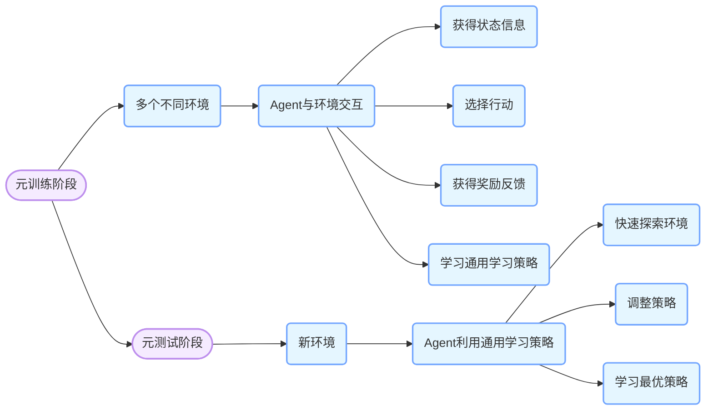

# 元强化学习：快速适应新环境的AI Agent

> 关键词：元强化学习、AI Agent、快速适应、新环境、强化学习算法

> 摘要：本文围绕元强化学习展开，旨在深入探讨这一前沿技术如何助力AI Agent快速适应新环境。首先介绍元强化学习的背景，包括目的、预期读者、文档结构和相关术语。接着阐述核心概念及其联系，给出原理和架构的示意图与流程图。详细讲解核心算法原理，并通过Python代码展示具体操作步骤。同时介绍相关数学模型和公式，并举例说明。通过项目实战，给出代码案例及详细解释。分析元强化学习的实际应用场景，推荐学习资源、开发工具框架和相关论文著作。最后总结其未来发展趋势与挑战，解答常见问题并提供扩展阅读和参考资料，帮助读者全面了解元强化学习。

## 1. 背景介绍 
### 1.1 目的和范围
元强化学习作为强化学习领域的新兴分支，其核心目的是使AI Agent能够在面对全新环境时迅速调整自身策略，高效地进行学习和决策。传统强化学习算法在解决特定任务时表现出色，但当环境发生变化时，往往需要大量的样本和时间进行重新训练。元强化学习旨在打破这一局限，通过学习如何学习，让Agent具备快速适应新环境的能力。

本文的范围涵盖元强化学习的基本概念、核心算法原理、数学模型、实际应用场景以及相关的工具和资源。通过深入剖析这些方面，帮助读者全面理解元强化学习的工作机制和应用价值。

### 1.2 预期读者
本文预期读者包括人工智能、机器学习、强化学习领域的研究人员、开发者和爱好者。对于希望深入了解元强化学习技术的专业人士，本文提供了系统的知识体系和详细的技术讲解；对于初学者，本文从基础概念入手，逐步引导读者理解元强化学习的核心内容，是一份具有较高参考价值的学习资料。

### 1.3 文档结构概述
本文将按照以下结构进行组织：首先介绍元强化学习的背景知识，包括目的、预期读者和文档结构等；接着阐述核心概念及其联系，通过文本示意图和Mermaid流程图直观展示；详细讲解核心算法原理，并使用Python代码实现具体操作步骤；介绍相关数学模型和公式，并结合实例进行说明；通过项目实战，给出代码案例及详细解释；分析元强化学习的实际应用场景；推荐学习资源、开发工具框架和相关论文著作；最后总结元强化学习的未来发展趋势与挑战，解答常见问题并提供扩展阅读和参考资料。

### 1.4 术语表
#### 1.4.1 核心术语定义
- **元强化学习（Meta-Reinforcement Learning）**：一种让AI Agent学习如何学习的强化学习方法，旨在使Agent能够在新环境中快速适应并学习最优策略。
- **AI Agent**：在强化学习中，Agent是能够感知环境状态、采取行动并根据环境反馈获得奖励的智能体。
- **强化学习（Reinforcement Learning）**：一种通过智能体与环境进行交互，根据环境反馈的奖励信号来学习最优策略的机器学习方法。
- **策略（Policy）**：Agent在给定环境状态下选择行动的规则。
- **环境（Environment）**：Agent所处的外部世界，Agent通过与环境交互获得状态信息和奖励反馈。

#### 1.4.2 相关概念解释
- **元学习（Meta-Learning）**：元学习是一种更广泛的学习范式，旨在让模型学习如何学习，能够在少量数据上快速适应新任务。元强化学习是元学习在强化学习领域的具体应用。
- **快速适应（Fast Adaptation）**：指AI Agent在面对新环境时，能够在短时间内调整自身策略，以较好地完成任务的能力。

#### 1.4.3 缩略词列表
- **MDP**：Markov Decision Process，马尔可夫决策过程，是强化学习中常用的数学模型。
- **PPO**：Proximal Policy Optimization，近端策略优化算法，是一种常用的强化学习算法。
- **TRPO**：Trust Region Policy Optimization，信赖域策略优化算法，也是一种强化学习算法。

## 2. 核心概念与联系 
元强化学习的核心思想是让AI Agent学习如何学习，从而能够在新环境中快速适应。其基本原理是通过在多个不同但相关的环境中进行训练，让Agent学习到通用的学习策略，以便在遇到新环境时能够利用这些策略快速学习。

### 核心概念原理

元强化学习的核心在于元训练和元测试两个阶段。在元训练阶段，Agent在多个不同的环境中进行训练，通过与环境交互获得状态、行动和奖励信息，学习如何根据这些信息调整自身策略。在这个过程中，Agent会学习到一些通用的学习策略，例如如何快速探索环境、如何利用已有的经验等。

在元测试阶段，Agent会被放置到一个全新的环境中。此时，Agent会利用在元训练阶段学习到的通用学习策略，快速适应新环境并学习最优策略。通过这种方式，Agent能够在新环境中更快地收敛到较好的策略，减少学习所需的样本数量和时间。

### 架构的文本示意图

```plaintext
元训练阶段
|
|-- 多个不同环境
|   |-- Agent与环境交互
|   |   |-- 获得状态信息
|   |   |-- 选择行动
|   |   |-- 获得奖励反馈
|   |
|   |-- 学习通用学习策略
|
元测试阶段
|
|-- 新环境
|   |-- Agent利用通用学习策略
|   |   |-- 快速探索环境
|   |   |-- 调整策略
|   |   |-- 学习最优策略
```

### Mermaid流程图



## 3. 核心算法原理 & 具体操作步骤 

### 核心算法原理

元强化学习中有多种算法，这里以基于模型无关的元强化学习算法（Model-Free Meta-Reinforcement Learning）为例进行讲解。这类算法不依赖于环境的具体模型，通过直接学习策略来实现快速适应。

一种常见的基于模型无关的元强化学习算法是使用循环神经网络（RNN）来建模Agent的策略。RNN能够处理序列数据，适合用于处理强化学习中的时序信息。在元训练阶段，RNN会学习如何根据历史的状态、行动和奖励信息来调整策略。在元测试阶段，RNN会利用之前学习到的知识，快速适应新环境。

### 具体操作步骤及Python代码实现

以下是一个简单的基于RNN的元强化学习算法的Python代码示例：

```python
import torch
import torch.nn as nn
import torch.optim as optim

# 定义RNN策略网络
class RNNPolicy(nn.Module):
    def __init__(self, input_size, hidden_size, output_size):
        super(RNNPolicy, self).__init__()
        self.rnn = nn.RNN(input_size, hidden_size, batch_first=True)
        self.fc = nn.Linear(hidden_size, output_size)

    def forward(self, x, h):
        out, h = self.rnn(x, h)
        out = self.fc(out[:, -1, :])
        return out, h

# 初始化网络参数
input_size = 5  # 输入状态的维度
hidden_size = 32
output_size = 2  # 输出行动的维度
policy = RNNPolicy(input_size, hidden_size, output_size)
optimizer = optim.Adam(policy.parameters(), lr=0.001)

# 元训练阶段
num_meta_episodes = 100
for meta_episode in range(num_meta_episodes):
    # 随机选择一个环境
    # 这里假设环境返回的状态是一个长度为input_size的向量
    h = torch.zeros(1, 1, hidden_size)
    total_reward = 0
    for step in range(100):
        state = torch.randn(1, 1, input_size)  # 随机生成状态
        action_logits, h = policy(state, h)
        action = torch.argmax(action_logits, dim=1)
        # 假设环境返回奖励
        reward = torch.randn(1)
        total_reward += reward.item()
        # 计算损失并更新参数
        loss = -action_logits.gather(1, action.unsqueeze(1)).mean()
        optimizer.zero_grad()
        loss.backward()
        optimizer.step()
    print(f"Meta Episode {meta_episode}: Total Reward = {total_reward}")

# 元测试阶段
new_h = torch.zeros(1, 1, hidden_size)
new_total_reward = 0
for step in range(100):
    new_state = torch.randn(1, 1, input_size)
    new_action_logits, new_h = policy(new_state, new_h)
    new_action = torch.argmax(new_action_logits, dim=1)
    new_reward = torch.randn(1)
    new_total_reward += new_reward.item()
print(f"Meta Test: Total Reward = {new_total_reward}")
```

### 代码解释

1. **RNNPolicy类**：定义了一个简单的RNN策略网络，包含一个RNN层和一个全连接层。
2. **元训练阶段**：在多个元训练回合中，Agent与不同的环境进行交互，根据环境反馈的奖励信息更新策略网络的参数。
3. **元测试阶段**：将Agent放置到一个新环境中，利用在元训练阶段学习到的策略进行决策，计算总奖励。

## 4. 数学模型和公式 & 详细讲解 & 举例说明 

### 马尔可夫决策过程（MDP）

元强化学习通常基于马尔可夫决策过程（MDP）进行建模。MDP是一个五元组 $(S, A, P, R, \gamma)$，其中：
- $S$ 是状态空间，表示环境的所有可能状态。
- $A$ 是行动空间，表示Agent可以采取的所有可能行动。
- $P: S \times A \times S \to [0, 1]$ 是状态转移概率函数，表示在状态 $s \in S$ 下采取行动 $a \in A$ 后转移到状态 $s' \in S$ 的概率。
- $R: S \times A \to \mathbb{R}$ 是奖励函数，表示在状态 $s$ 下采取行动 $a$ 所获得的即时奖励。
- $\gamma \in [0, 1]$ 是折扣因子，用于权衡即时奖励和未来奖励。

### 策略和价值函数

在MDP中，策略 $\pi: S \to A$ 定义了Agent在每个状态下选择行动的规则。价值函数用于评估策略的好坏，常见的价值函数有状态价值函数 $V^{\pi}(s)$ 和动作价值函数 $Q^{\pi}(s, a)$。

状态价值函数 $V^{\pi}(s)$ 表示在状态 $s$ 下，遵循策略 $\pi$ 所能获得的期望累积折扣奖励：
$$V^{\pi}(s) = \mathbb{E}_{\pi}\left[\sum_{t=0}^{\infty} \gamma^t R(s_t, a_t) \mid s_0 = s\right]$$

动作价值函数 $Q^{\pi}(s, a)$ 表示在状态 $s$ 下采取行动 $a$，然后遵循策略 $\pi$ 所能获得的期望累积折扣奖励：
$$Q^{\pi}(s, a) = \mathbb{E}_{\pi}\left[\sum_{t=0}^{\infty} \gamma^t R(s_t, a_t) \mid s_0 = s, a_0 = a\right]$$

### 元强化学习中的优化目标

在元强化学习中，优化目标是最大化在多个不同环境下的期望累积奖励。假设我们有 $N$ 个不同的环境 $\mathcal{E}_1, \mathcal{E}_2, \cdots, \mathcal{E}_N$，每个环境的MDP为 $(S_i, A_i, P_i, R_i, \gamma_i)$，策略为 $\pi$。则元强化学习的优化目标可以表示为：
$$\max_{\pi} \sum_{i=1}^{N} \mathbb{E}_{\pi}\left[\sum_{t=0}^{\infty} \gamma_i^t R_i(s_{i,t}, a_{i,t}) \mid s_{i,0} \sim \mu_i\right]$$
其中 $\mu_i$ 是环境 $\mathcal{E}_i$ 的初始状态分布。

### 举例说明

假设我们有一个简单的网格世界环境，状态空间 $S$ 是网格中的所有位置，行动空间 $A$ 是上下左右四个方向的移动。奖励函数 $R$ 定义为到达目标位置获得正奖励，碰到障碍物获得负奖励。在元训练阶段，我们可以在多个不同布局的网格世界环境中训练Agent，让它学习如何快速找到目标。在元测试阶段，将Agent放置到一个新布局的网格世界环境中，它可以利用之前学习到的经验快速适应并找到目标。

## 5. 项目实战：代码实际案例和详细解释说明 

### 5.1  开发环境搭建

为了实现元强化学习的项目实战，我们需要搭建相应的开发环境。以下是具体步骤：

1. **安装Python**：建议使用Python 3.7及以上版本。可以从Python官方网站（https://www.python.org/downloads/）下载并安装。
2. **安装深度学习框架**：我们使用PyTorch作为深度学习框架。可以通过以下命令安装：
```sh
pip install torch torchvision
```
3. **安装强化学习库**：可以使用OpenAI Gym作为强化学习环境库，通过以下命令安装：
```sh
pip install gym
```

### 5.2  源代码详细实现和代码解读

以下是一个基于OpenAI Gym的元强化学习项目实战代码示例：

```python
import torch
import torch.nn as nn
import torch.optim as optim
import gym

# 定义RNN策略网络
class RNNPolicy(nn.Module):
    def __init__(self, input_size, hidden_size, output_size):
        super(RNNPolicy, self).__init__()
        self.rnn = nn.RNN(input_size, hidden_size, batch_first=True)
        self.fc = nn.Linear(hidden_size, output_size)

    def forward(self, x, h):
        out, h = self.rnn(x, h)
        out = self.fc(out[:, -1, :])
        return out, h

# 初始化网络参数
env = gym.make('CartPole-v1')
input_size = env.observation_space.shape[0]
output_size = env.action_space.n
hidden_size = 32
policy = RNNPolicy(input_size, hidden_size, output_size)
optimizer = optim.Adam(policy.parameters(), lr=0.001)

# 元训练阶段
num_meta_episodes = 100
for meta_episode in range(num_meta_episodes):
    h = torch.zeros(1, 1, hidden_size)
    total_reward = 0
    state = env.reset()
    for step in range(500):
        state_tensor = torch.FloatTensor(state).unsqueeze(0).unsqueeze(0)
        action_logits, h = policy(state_tensor, h)
        action_probs = torch.softmax(action_logits, dim=1)
        action = torch.multinomial(action_probs, 1).item()
        next_state, reward, done, _ = env.step(action)
        total_reward += reward
        loss = -torch.log(action_probs.gather(1, torch.tensor([[action]])).squeeze())
        optimizer.zero_grad()
        loss.backward()
        optimizer.step()
        if done:
            break
        state = next_state
    print(f"Meta Episode {meta_episode}: Total Reward = {total_reward}")

# 元测试阶段
new_h = torch.zeros(1, 1, hidden_size)
new_total_reward = 0
state = env.reset()
for step in range(500):
    state_tensor = torch.FloatTensor(state).unsqueeze(0).unsqueeze(0)
    action_logits, new_h = policy(state_tensor, new_h)
    action_probs = torch.softmax(action_logits, dim=1)
    action = torch.multinomial(action_probs, 1).item()
    next_state, reward, done, _ = env.step(action)
    new_total_reward += reward
    if done:
        break
    state = next_state
print(f"Meta Test: Total Reward = {new_total_reward}")

env.close()
```

### 代码解读

1. **RNNPolicy类**：定义了一个基于RNN的策略网络，用于根据环境状态输出行动的概率分布。
2. **元训练阶段**：在多个元训练回合中，Agent与OpenAI Gym的CartPole-v1环境进行交互。通过RNN网络根据当前状态选择行动，根据环境反馈的奖励信息计算损失并更新策略网络的参数。
3. **元测试阶段**：将Agent放置到相同的环境中，利用在元训练阶段学习到的策略进行决策，计算总奖励。

### 5.3  代码解读与分析

- **RNN的作用**：RNN能够处理序列数据，在元强化学习中可以利用历史的状态、行动和奖励信息来调整策略，从而更好地适应环境的变化。
- **损失函数**：使用负对数似然损失函数来优化策略网络，使得Agent选择获得更高奖励的行动的概率增大。
- **探索与利用**：在选择行动时，使用 `torch.multinomial` 函数根据行动的概率分布进行采样，既保证了一定的探索性，又能逐渐利用已学习到的知识。

## 6. 实际应用场景 

元强化学习具有广泛的实际应用场景，以下是一些常见的应用领域：

### 机器人控制
在机器人控制中，元强化学习可以让机器人快速适应不同的任务和环境。例如，一个机器人在不同的地形上行走，或者执行不同的抓取任务。通过元强化学习，机器人可以在短时间内学习到适应新环境的策略，提高任务执行的效率和灵活性。

### 游戏领域
在游戏中，元强化学习可以使AI Agent快速适应新的游戏规则和对手策略。例如，在实时策略游戏中，Agent可以根据不同的地图布局和对手的战术，迅速调整自己的战略。在竞技游戏中，Agent可以在面对新的对手时，快速学习对手的风格并制定应对策略。

### 自动驾驶
自动驾驶车辆需要在各种复杂的交通环境中行驶，元强化学习可以帮助车辆快速适应不同的路况、天气条件和交通规则。例如，在不同国家或地区，交通规则可能存在差异，元强化学习可以使自动驾驶车辆在短时间内适应这些变化，确保行驶安全。

### 资源管理
在云计算、数据中心等领域，资源管理是一个重要的问题。元强化学习可以用于动态调整资源分配策略，以适应不同的工作负载和系统状态。例如，根据不同时间段的用户需求，自动调整服务器的分配，提高资源利用率和系统性能。

## 7. 工具和资源推荐
### 7.1 学习资源推荐
#### 7.1.1 书籍推荐
- 《Reinforcement Learning: An Introduction》：这是强化学习领域的经典教材，详细介绍了强化学习的基本概念、算法和应用。虽然主要侧重于传统强化学习，但对于理解元强化学习的基础非常有帮助。
- 《Deep Reinforcement Learning Hands-On》：这本书结合实际代码案例，介绍了深度学习在强化学习中的应用，包括一些元强化学习的相关内容。

#### 7.1.2 在线课程
- Coursera上的“Reinforcement Learning Specialization”：由知名教授授课，系统地介绍了强化学习的各个方面，包括元强化学习的基础知识。
- edX上的“Introduction to Artificial Intelligence”：该课程涵盖了人工智能的多个领域，其中也包括强化学习和元强化学习的相关内容。

#### 7.1.3 技术博客和网站
- OpenAI Blog：OpenAI是人工智能领域的领先研究机构，其博客上经常发布关于强化学习和元强化学习的最新研究成果和技术文章。
- DeepMind Blog：DeepMind在强化学习领域取得了很多重要的成果，其博客提供了丰富的技术资料和研究报告。

### 7.2 开发工具框架推荐
#### 7.2.1 IDE和编辑器
- PyCharm：是一款专业的Python集成开发环境，提供了丰富的代码编辑、调试和分析功能，适合用于开发元强化学习项目。
- Jupyter Notebook：可以将代码、文本和可视化结果集成在一个文档中，方便进行实验和数据探索，常用于强化学习算法的实现和调试。

#### 7.2.2 调试和性能分析工具
- TensorBoard：是TensorFlow提供的可视化工具，可以用于监控训练过程中的损失函数、奖励曲线等指标，帮助调试和优化模型。
- PyTorch Profiler：PyTorch提供的性能分析工具，可以分析模型的运行时间、内存使用等情况，帮助发现性能瓶颈。

#### 7.2.3 相关框架和库
- PyTorch：是一个广泛使用的深度学习框架，提供了丰富的神经网络层和优化算法，适合用于实现元强化学习算法。
- OpenAI Gym：是一个用于开发和比较强化学习算法的工具包，提供了各种不同类型的环境，方便进行实验和测试。

### 7.3 相关论文著作推荐
#### 7.3.1 经典论文
- “Model-Agnostic Meta-Learning for Fast Adaptation of Deep Networks”：这篇论文提出了模型无关的元学习方法，为元强化学习的发展奠定了基础。
- “Proximal Policy Optimization Algorithms”：介绍了近端策略优化算法（PPO），是一种高效的强化学习算法，在元强化学习中也有广泛的应用。

#### 7.3.2 最新研究成果
- 可以关注NeurIPS、ICML、AAAI等顶级人工智能会议的论文，这些会议上经常会有关于元强化学习的最新研究成果发布。

#### 7.3.3 应用案例分析
- 一些知名研究机构和企业会发布元强化学习在实际应用中的案例分析，例如Google、OpenAI等公司的技术报告，可以从中了解元强化学习在不同领域的应用实践和效果。

## 8. 总结：未来发展趋势与挑战
### 未来发展趋势
- **与其他技术的融合**：元强化学习将与深度学习、迁移学习、进化算法等技术进一步融合，以提高AI Agent的学习能力和适应能力。例如，结合深度学习的强大特征提取能力和元强化学习的快速适应能力，可以使Agent在更复杂的环境中表现出色。
- **应用领域的拓展**：随着技术的不断发展，元强化学习将在更多领域得到应用，如医疗保健、金融、农业等。在医疗保健领域，元强化学习可以用于个性化医疗方案的制定；在金融领域，可以用于投资策略的优化。
- **理论基础的完善**：研究人员将继续深入研究元强化学习的理论基础，提出更有效的算法和模型，提高算法的收敛速度和稳定性。

### 挑战
- **计算资源需求**：元强化学习通常需要大量的计算资源来进行训练，尤其是在处理复杂环境和大规模数据时。如何降低计算成本，提高算法的效率是一个亟待解决的问题。
- **样本效率**：虽然元强化学习旨在提高Agent的快速适应能力，但在某些情况下，仍然需要大量的样本才能学习到有效的策略。提高样本效率，减少学习所需的样本数量是一个重要的挑战。
- **可解释性**：元强化学习模型通常是复杂的神经网络，其决策过程难以解释。在一些对安全性和可靠性要求较高的应用场景中，如自动驾驶和医疗诊断，模型的可解释性是一个关键问题。

## 9. 附录：常见问题与解答
### 问题1：元强化学习与传统强化学习有什么区别？
传统强化学习在面对新环境时，通常需要重新进行大量的训练才能学习到有效的策略。而元强化学习通过在多个不同环境中进行训练，学习到通用的学习策略，能够在新环境中快速适应，减少学习所需的样本数量和时间。

### 问题2：元强化学习需要哪些数学基础？
元强化学习需要掌握概率论、线性代数、微积分等数学知识，同时需要了解马尔可夫决策过程、动态规划等强化学习的基本理论。

### 问题3：如何评估元强化学习算法的性能？
可以使用多种指标来评估元强化学习算法的性能，如在新环境中的累积奖励、学习所需的样本数量、收敛速度等。同时，可以与传统强化学习算法进行对比，以评估元强化学习算法的优势。

### 问题4：元强化学习在实际应用中有哪些限制？
元强化学习在实际应用中面临一些限制，如计算资源需求大、样本效率低、模型可解释性差等。此外，在一些复杂的现实环境中，环境的不确定性和动态性也会给元强化学习带来挑战。

## 10. 扩展阅读 & 参考资料
- Sutton, R. S., & Barto, A. G. (2018). Reinforcement Learning: An Introduction. MIT press.
- Finn, C., Abbeel, P., & Levine, S. (2017). Model-Agnostic Meta-Learning for Fast Adaptation of Deep Networks. arXiv preprint arXiv:1703.03400.
- Schulman, J., Wolski, F., Dhariwal, P., Radford, A., & Klimov, O. (2017). Proximal Policy Optimization Algorithms. arXiv preprint arXiv:1707.06347.
- OpenAI Gym官方文档：https://gym.openai.com/docs/
- PyTorch官方文档：https://pytorch.org/docs/stable/index.html

作者：AI天才研究院/AI Genius Institute & 禅与计算机程序设计艺术 /Zen And The Art of Computer Programming