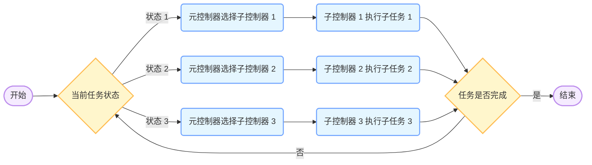

# 元控制器在复杂推理任务协调中的应用

> 关键词：元控制器、复杂推理任务、任务协调、强化学习、认知架构

> 摘要：本文深入探讨了元控制器在复杂推理任务协调中的应用。首先介绍了相关背景，包括目的范围、预期读者等。接着阐述了元控制器及复杂推理任务的核心概念与联系，给出了原理和架构的文本示意图及 Mermaid 流程图。详细讲解了核心算法原理，并用 Python 代码进行阐述，同时介绍了相关数学模型和公式。通过项目实战，展示了代码的实际案例并进行详细解释。分析了元控制器在多个实际应用场景中的作用，还推荐了相关的学习资源、开发工具框架以及论文著作。最后总结了未来发展趋势与挑战，并提供了常见问题解答和扩展阅读参考资料，旨在为相关领域的研究和实践提供全面而深入的指导。

## 1. 背景介绍 
### 1.1 目的和范围
在当今的人工智能和计算机科学领域，复杂推理任务变得越来越普遍，例如自然语言处理中的多跳推理、机器人的复杂决策规划等。这些任务往往需要协调多个子任务和推理步骤，对系统的智能水平和任务协调能力提出了很高的要求。元控制器作为一种能够对其他控制器进行管理和协调的机制，为解决复杂推理任务的协调问题提供了新的思路和方法。

本文的目的是全面深入地探讨元控制器在复杂推理任务协调中的应用，具体范围包括元控制器的核心概念、算法原理、数学模型、实际应用案例，以及相关的工具和资源推荐等。通过对这些方面的研究，帮助读者理解元控制器如何在复杂推理任务中发挥作用，以及如何在实际项目中应用元控制器来提高任务协调的效率和质量。

### 1.2 预期读者
本文预期读者主要包括以下几类人群：
- **研究人员**：从事人工智能、机器学习、认知科学等领域研究的学者和科研人员，他们对复杂推理任务和元控制器的理论和技术感兴趣，希望通过本文了解最新的研究进展和应用案例。
- **开发者**：涉及自然语言处理、机器人控制、智能决策系统等领域的软件开发人员，他们在实际项目中面临复杂推理任务的协调问题，希望借鉴元控制器的思想和方法来解决实际问题。
- **学生**：计算机科学、人工智能等相关专业的本科生和研究生，他们希望通过阅读本文拓宽知识面，了解前沿技术和研究方向。

### 1.3 文档结构概述
本文的结构如下：
- **核心概念与联系**：介绍元控制器和复杂推理任务的核心概念，以及它们之间的联系，通过文本示意图和 Mermaid 流程图进行直观展示。
- **核心算法原理 & 具体操作步骤**：详细讲解元控制器的核心算法原理，并用 Python 代码实现具体操作步骤。
- **数学模型和公式 & 详细讲解 & 举例说明**：给出元控制器相关的数学模型和公式，并进行详细讲解和举例说明。
- **项目实战：代码实际案例和详细解释说明**：通过一个实际项目案例，展示元控制器在复杂推理任务协调中的应用，包括开发环境搭建、源代码实现和代码解读。
- **实际应用场景**：分析元控制器在不同实际应用场景中的作用和优势。
- **工具和资源推荐**：推荐相关的学习资源、开发工具框架和论文著作。
- **总结：未来发展趋势与挑战**：总结元控制器在复杂推理任务协调中的应用现状，分析未来发展趋势和面临的挑战。
- **附录：常见问题与解答**：提供常见问题的解答，帮助读者更好地理解和应用本文内容。
- **扩展阅读 & 参考资料**：列出相关的扩展阅读材料和参考资料，方便读者进一步深入研究。

### 1.4 术语表
#### 1.4.1 核心术语定义
- **元控制器（Meta - Controller）**：一种能够对其他控制器进行管理和协调的高层控制机制，它可以根据任务的整体目标和当前状态，动态地选择和调度合适的子控制器来完成任务。
- **复杂推理任务（Complex Reasoning Task）**：需要进行多步骤、多维度推理和决策的任务，通常涉及多个子任务和知识源，例如多跳问答、复杂规划等。
- **任务协调（Task Coordination）**：在复杂推理任务中，合理安排和调度各个子任务的执行顺序和资源分配，以确保任务能够高效、准确地完成。
- **强化学习（Reinforcement Learning）**：一种机器学习方法，智能体通过与环境进行交互，根据环境反馈的奖励信号来学习最优的行为策略。

#### 1.4.2 相关概念解释
- **子控制器（Sub - Controller）**：负责执行具体子任务的控制器，在元控制器的协调下完成特定的功能。
- **状态空间（State Space）**：系统所有可能状态的集合，在复杂推理任务中，状态空间通常包括任务的当前进度、可用资源、环境信息等。
- **动作空间（Action Space）**：智能体可以采取的所有可能动作的集合，在元控制器中，动作空间包括选择不同的子控制器、调整子控制器的参数等。

#### 1.4.3 缩略词列表
- **RL**：Reinforcement Learning（强化学习）
- **MDP**：Markov Decision Process（马尔可夫决策过程）

## 2. 核心概念与联系 
### 核心概念原理
#### 元控制器
元控制器的核心思想是在高层对任务进行抽象和管理，它不直接执行具体的子任务，而是根据任务的整体目标和当前状态，选择合适的子控制器来完成任务。元控制器可以看作是一个智能的调度器，它能够根据不同的情况动态地调整子控制器的使用，以达到最优的任务执行效果。

元控制器通常基于强化学习算法进行训练，通过与环境进行交互，学习到在不同状态下选择最优动作（即选择合适的子控制器）的策略。在训练过程中，元控制器会根据环境反馈的奖励信号来调整自己的策略，以最大化长期累积奖励。

#### 复杂推理任务
复杂推理任务通常具有以下特点：
- **多步骤性**：需要进行多个推理步骤才能完成任务，每个步骤可能依赖于前一个步骤的结果。
- **多维度性**：涉及多个维度的信息和知识，需要综合考虑不同维度的因素进行推理和决策。
- **不确定性**：任务中可能存在不确定性因素，例如环境的变化、信息的不完整性等，需要智能体具备一定的应对能力。

### 架构的文本示意图
```plaintext
                      +----------------+
                      |   元控制器    |
                      +----------------+
                            |
                            | 选择子控制器
                            v
+----------------+  +----------------+  +----------------+
|  子控制器 1   |  |  子控制器 2   |  |  子控制器 3   |
+----------------+  +----------------+  +----------------+
      |                   |                   |
      | 执行子任务         | 执行子任务         | 执行子任务
      v                   v                   v
+----------------+  +----------------+  +----------------+
|  子任务 1       |  |  子任务 2       |  |  子任务 3       |
+----------------+  +----------------+  +----------------+
```

### Mermaid 流程图


## 3. 核心算法原理 & 具体操作步骤 
### 核心算法原理
元控制器通常基于强化学习算法进行设计，其中最常用的是马尔可夫决策过程（MDP）。MDP 是一个离散时间的随机控制过程，由以下几个要素组成：
- **状态空间 $S$**：系统所有可能状态的集合。
- **动作空间 $A$**：智能体可以采取的所有可能动作的集合。
- **状态转移概率 $P(s'|s,a)$**：在状态 $s$ 下采取动作 $a$ 后转移到状态 $s'$ 的概率。
- **奖励函数 $R(s,a,s')$**：在状态 $s$ 下采取动作 $a$ 并转移到状态 $s'$ 时获得的奖励。
- **折扣因子 $\gamma$**：用于权衡当前奖励和未来奖励的重要性，取值范围为 $[0,1]$。

元控制器的目标是学习一个最优策略 $\pi^*(s)$，使得在每个状态 $s$ 下选择的动作 $a$ 能够最大化长期累积奖励。长期累积奖励可以用以下公式表示：
$$G_t = \sum_{k = 0}^{\infty} \gamma^k R_{t + k + 1}$$

其中，$G_t$ 表示从时间步 $t$ 开始的长期累积奖励，$R_{t + k + 1}$ 表示时间步 $t + k + 1$ 获得的奖励。

常用的强化学习算法，如 Q - learning、Deep Q - Network（DQN）等，可以用于学习最优策略。以 Q - learning 为例，其核心思想是通过迭代更新 Q 值来逼近最优 Q 值函数 $Q^*(s,a)$，Q 值表示在状态 $s$ 下采取动作 $a$ 后的期望累积奖励。Q - learning 的更新公式如下：
$$Q(s,a) \leftarrow Q(s,a) + \alpha [R(s,a,s') + \gamma \max_{a'} Q(s',a') - Q(s,a)]$$

其中，$\alpha$ 是学习率，控制每次更新的步长。

### 具体操作步骤
以下是使用 Python 实现基于 Q - learning 的元控制器的具体操作步骤：

```python
import numpy as np

# 定义状态空间和动作空间
state_space = [0, 1, 2]  # 假设有 3 个状态
action_space = [0, 1, 2]  # 假设有 3 个子控制器可供选择

# 初始化 Q 表
Q = np.zeros((len(state_space), len(action_space)))

# 定义参数
alpha = 0.1  # 学习率
gamma = 0.9  # 折扣因子
epsilon = 0.1  # 探索率
num_episodes = 1000  # 训练的回合数

# 定义奖励函数
def reward_function(state, action, next_state):
    # 这里简单假设奖励为随机值，实际应用中需要根据具体任务定义
    return np.random.randint(-1, 2)

# Q - learning 算法
for episode in range(num_episodes):
    # 初始化状态
    state = np.random.choice(state_space)
    done = False

    while not done:
        # epsilon - greedy 策略选择动作
        if np.random.uniform(0, 1) < epsilon:
            action = np.random.choice(action_space)
        else:
            action = np.argmax(Q[state, :])

        # 执行动作，得到下一个状态和奖励
        next_state = np.random.choice(state_space)
        reward = reward_function(state, action, next_state)

        # 更新 Q 表
        Q[state, action] = Q[state, action] + alpha * (reward + gamma * np.max(Q[next_state, :]) - Q[state, action])

        # 更新状态
        state = next_state

        # 判断是否结束
        if np.random.uniform(0, 1) < 0.1:  # 简单假设以 10% 的概率结束回合
            done = True

# 打印训练后的 Q 表
print("训练后的 Q 表：")
print(Q)
```

### 代码解释
1. **状态空间和动作空间定义**：定义了状态空间和动作空间，分别表示系统的可能状态和元控制器可以选择的子控制器。
2. **Q 表初始化**：初始化一个全零的 Q 表，用于存储每个状态 - 动作对的 Q 值。
3. **参数设置**：设置学习率 $\alpha$、折扣因子 $\gamma$、探索率 $\epsilon$ 和训练的回合数。
4. **奖励函数定义**：定义了一个简单的奖励函数，实际应用中需要根据具体任务进行定义。
5. **Q - learning 训练**：使用 Q - learning 算法进行训练，通过迭代更新 Q 表来学习最优策略。
6. **epsilon - greedy 策略**：在选择动作时，使用 epsilon - greedy 策略进行探索和利用的平衡。
7. **Q 表更新**：根据 Q - learning 的更新公式更新 Q 表。
8. **结果输出**：打印训练后的 Q 表。

## 4. 数学模型和公式 & 详细讲解 & 举例说明 
### 马尔可夫决策过程（MDP）
#### 数学模型
马尔可夫决策过程可以用一个五元组 $(S, A, P, R, \gamma)$ 表示，其中：
- $S$ 是状态空间，是一个有限或可数的集合，表示系统所有可能的状态。
- $A$ 是动作空间，也是一个有限或可数的集合，表示智能体可以采取的所有可能动作。
- $P(s'|s,a)$ 是状态转移概率，定义了在状态 $s$ 下采取动作 $a$ 后转移到状态 $s'$ 的概率，满足 $\sum_{s' \in S} P(s'|s,a) = 1$。
- $R(s,a,s')$ 是奖励函数，定义了在状态 $s$ 下采取动作 $a$ 并转移到状态 $s'$ 时获得的奖励。
- $\gamma$ 是折扣因子，用于权衡当前奖励和未来奖励的重要性，取值范围为 $[0,1]$。

#### 详细讲解
MDP 的核心假设是马尔可夫性，即系统的下一个状态只依赖于当前状态和当前动作，而与历史状态和动作无关。这一假设使得 MDP 可以用动态规划的方法进行求解。

在 MDP 中，智能体的目标是学习一个最优策略 $\pi^*(s)$，使得在每个状态 $s$ 下选择的动作 $a$ 能够最大化长期累积奖励 $G_t$。长期累积奖励的计算公式为：
$$G_t = \sum_{k = 0}^{\infty} \gamma^k R_{t + k + 1}$$

其中，$G_t$ 表示从时间步 $t$ 开始的长期累积奖励，$R_{t + k + 1}$ 表示时间步 $t + k + 1$ 获得的奖励。

为了求解最优策略，通常引入价值函数的概念。价值函数分为状态价值函数 $V^{\pi}(s)$ 和动作价值函数 $Q^{\pi}(s,a)$：
- 状态价值函数 $V^{\pi}(s)$ 表示在策略 $\pi$ 下，从状态 $s$ 开始的期望累积奖励：
$$V^{\pi}(s) = \mathbb{E}_{\pi} \left[ G_t | S_t = s \right]$$
- 动作价值函数 $Q^{\pi}(s,a)$ 表示在策略 $\pi$ 下，从状态 $s$ 采取动作 $a$ 后的期望累积奖励：
$$Q^{\pi}(s,a) = \mathbb{E}_{\pi} \left[ G_t | S_t = s, A_t = a \right]$$

最优状态价值函数 $V^*(s)$ 和最优动作价值函数 $Q^*(s,a)$ 分别定义为所有策略下的最大价值函数：
$$V^*(s) = \max_{\pi} V^{\pi}(s)$$
$$Q^*(s,a) = \max_{\pi} Q^{\pi}(s,a)$$

#### 举例说明
假设有一个简单的机器人导航任务，机器人在一个二维网格世界中移动，目标是到达指定的目标位置。状态空间 $S$ 可以表示为机器人在网格中的位置，动作空间 $A$ 可以表示为机器人的移动方向（上、下、左、右）。状态转移概率 $P(s'|s,a)$ 表示机器人在位置 $s$ 采取动作 $a$ 后移动到位置 $s'$ 的概率，奖励函数 $R(s,a,s')$ 可以根据机器人是否到达目标位置、是否撞到障碍物等情况进行定义。例如，如果机器人到达目标位置，奖励为 10；如果撞到障碍物，奖励为 - 5；其他情况奖励为 - 1。折扣因子 $\gamma$ 可以设置为 0.9，表示更看重近期的奖励。

### Q - learning 算法
#### 数学模型
Q - learning 是一种无模型的强化学习算法，用于求解 MDP 的最优策略。Q - learning 的核心是通过迭代更新 Q 值来逼近最优 Q 值函数 $Q^*(s,a)$。Q - learning 的更新公式如下：
$$Q(s,a) \leftarrow Q(s,a) + \alpha [R(s,a,s') + \gamma \max_{a'} Q(s',a') - Q(s,a)]$$

其中，$Q(s,a)$ 表示状态 $s$ 下采取动作 $a$ 的 Q 值，$\alpha$ 是学习率，控制每次更新的步长，$R(s,a,s')$ 是奖励函数，$\gamma$ 是折扣因子，$\max_{a'} Q(s',a')$ 表示在状态 $s'$ 下所有可能动作的最大 Q 值。

#### 详细讲解
Q - learning 算法的基本思想是通过不断地与环境进行交互，根据环境反馈的奖励信号来更新 Q 值。在每个时间步，智能体根据当前的 Q 值选择一个动作，执行该动作后得到下一个状态和奖励，然后根据更新公式更新 Q 值。

学习率 $\alpha$ 控制了每次更新的步长，如果 $\alpha$ 过大，算法可能会不稳定；如果 $\alpha$ 过小，算法的收敛速度会很慢。折扣因子 $\gamma$ 权衡了当前奖励和未来奖励的重要性，$\gamma$ 越接近 1，表示更看重未来的奖励；$\gamma$ 越接近 0，表示更看重当前的奖励。

#### 举例说明
继续以上述机器人导航任务为例，假设机器人当前处于状态 $s$，选择动作 $a$ 后移动到状态 $s'$，获得奖励 $R(s,a,s') = - 1$。当前的 Q 值 $Q(s,a) = 0$，在状态 $s'$ 下所有可能动作的最大 Q 值 $\max_{a'} Q(s',a') = 2$，学习率 $\alpha = 0.1$，折扣因子 $\gamma = 0.9$。根据 Q - learning 的更新公式，更新后的 Q 值为：
$$Q(s,a) = 0 + 0.1 \times [-1 + 0.9 \times 2 - 0] = 0.08$$

## 5. 项目实战：代码实际案例和详细解释说明 
### 5.1  开发环境搭建
#### 安装 Python
首先需要安装 Python 环境，建议使用 Python 3.6 及以上版本。可以从 Python 官方网站（https://www.python.org/downloads/）下载并安装适合自己操作系统的 Python 版本。

#### 安装必要的库
本项目需要使用 numpy 库进行数值计算，可以使用以下命令进行安装：
```sh
pip install numpy
```

### 5.2  源代码详细实现和代码解读
以下是一个更完整的基于 Q - learning 的元控制器在复杂推理任务协调中的代码示例：

```python
import numpy as np

# 定义状态空间和动作空间
state_space = [i for i in range(5)]  # 假设有 5 个状态
action_space = [i for i in range(3)]  # 假设有 3 个子控制器可供选择

# 初始化 Q 表
Q = np.zeros((len(state_space), len(action_space)))

# 定义参数
alpha = 0.1  # 学习率
gamma = 0.9  # 折扣因子
epsilon = 0.1  # 探索率
num_episodes = 2000  # 训练的回合数

# 定义奖励函数
def reward_function(state, action, next_state):
    # 简单示例：如果状态和动作匹配，奖励为 1，否则为 -1
    if (state % 3) == action:
        return 1
    else:
        return -1

# Q - learning 算法
for episode in range(num_episodes):
    # 初始化状态
    state = np.random.choice(state_space)
    done = False

    while not done:
        # epsilon - greedy 策略选择动作
        if np.random.uniform(0, 1) < epsilon:
            action = np.random.choice(action_space)
        else:
            action = np.argmax(Q[state, :])

        # 执行动作，得到下一个状态
        next_state = (state + action + 1) % len(state_space)

        # 计算奖励
        reward = reward_function(state, action, next_state)

        # 更新 Q 表
        Q[state, action] = Q[state, action] + alpha * (reward + gamma * np.max(Q[next_state, :]) - Q[state, action])

        # 更新状态
        state = next_state

        # 判断是否结束
        if np.random.uniform(0, 1) < 0.1:  # 简单假设以 10% 的概率结束回合
            done = True

# 测试阶段
test_episodes = 10
total_reward = 0
for episode in range(test_episodes):
    state = np.random.choice(state_space)
    done = False
    episode_reward = 0
    while not done:
        action = np.argmax(Q[state, :])
        next_state = (state + action + 1) % len(state_space)
        reward = reward_function(state, action, next_state)
        episode_reward += reward
        state = next_state
        if np.random.uniform(0, 1) < 0.1:
            done = True
    total_reward += episode_reward

average_reward = total_reward / test_episodes
print("训练后的 Q 表：")
print(Q)
print("平均测试奖励：", average_reward)
```

### 5.3  代码解读与分析
#### 状态空间和动作空间
- `state_space` 定义了系统的状态空间，这里假设有 5 个状态。
- `action_space` 定义了元控制器可以选择的子控制器，这里假设有 3 个子控制器。

#### Q 表初始化
`Q` 表是一个二维数组，用于存储每个状态 - 动作对的 Q 值，初始值都为 0。

#### 参数设置
- `alpha` 是学习率，控制每次 Q 值更新的步长。
- `gamma` 是折扣因子，权衡当前奖励和未来奖励的重要性。
- `epsilon` 是探索率，用于在训练过程中进行探索和利用的平衡。
- `num_episodes` 是训练的回合数。

#### 奖励函数
`reward_function` 根据状态和动作的匹配情况返回不同的奖励值，如果状态和动作匹配，奖励为 1，否则为 - 1。

#### Q - learning 训练
在每个回合中，智能体从随机状态开始，使用 epsilon - greedy 策略选择动作，执行动作后得到下一个状态和奖励，然后根据 Q - learning 的更新公式更新 Q 表。当满足结束条件时，回合结束。

#### 测试阶段
在训练完成后，进行测试。智能体根据训练得到的 Q 表选择动作，计算每个回合的奖励，最后计算平均测试奖励。

#### 结果分析
通过观察训练后的 Q 表和平均测试奖励，可以评估元控制器的学习效果。如果平均测试奖励较高，说明元控制器能够学习到较好的策略来协调子控制器完成任务。

## 6. 实际应用场景 
### 自然语言处理中的多跳推理
在自然语言处理中，多跳推理任务需要从多个文本段落中获取信息，并进行多步骤的推理来回答问题。元控制器可以用于协调不同的子任务，例如实体识别、关系抽取、逻辑推理等。在不同的推理步骤中，元控制器可以根据当前的问题和已有的信息，选择合适的子控制器来执行相应的任务，从而提高推理的准确性和效率。

### 机器人的复杂决策规划
机器人在执行复杂任务时，需要进行决策规划，例如路径规划、任务分配、动作选择等。元控制器可以对这些子任务进行协调，根据机器人的当前状态（如位置、电量、负载等）和任务目标，选择合适的子控制器来完成相应的任务。例如，当机器人需要前往一个目标位置时，元控制器可以根据地图信息和障碍物情况，选择合适的路径规划算法（如 A* 算法、Dijkstra 算法等）。

### 智能客服系统
智能客服系统需要处理各种复杂的用户问题，包括解答常见问题、引导用户操作、处理投诉等。元控制器可以协调不同的子模块，如问题分类器、知识检索模块、对话生成模块等。根据用户的问题类型和当前对话状态，元控制器可以选择合适的子模块来处理问题，提高客服系统的响应速度和服务质量。

### 金融投资决策
在金融投资领域，投资者需要根据市场信息、经济数据、公司财务状况等多个因素进行决策。元控制器可以协调不同的分析模型和策略，如基本面分析、技术分析、风险评估等。根据当前的市场情况和投资目标，元控制器可以选择合适的分析模型和策略来进行投资决策，降低投资风险，提高投资收益。

## 7. 工具和资源推荐
### 7.1 学习资源推荐
#### 7.1.1 书籍推荐
- 《Reinforcement Learning: An Introduction》（《强化学习：原理与Python实现》）：这是一本强化学习领域的经典教材，详细介绍了强化学习的基本概念、算法和应用，对于理解元控制器的核心算法原理非常有帮助。
- 《Artificial Intelligence: A Modern Approach》（《人工智能：一种现代的方法》）：全面介绍了人工智能的各个领域，包括搜索、知识表示、推理、机器学习等，对于了解复杂推理任务和元控制器的应用场景有很大的帮助。

#### 7.1.2 在线课程
- Coursera 上的《Reinforcement Learning Specialization》：由美国华盛顿大学的教授授课，系统地介绍了强化学习的理论和实践，包括马尔可夫决策过程、Q - learning、策略梯度等算法。
- edX 上的《Artificial Intelligence》：由麻省理工学院的教授授课，涵盖了人工智能的多个方面，包括搜索算法、机器学习、自然语言处理等。

#### 7.1.3 技术博客和网站
- OpenAI Blog（https://openai.com/blog/）：OpenAI 发布的最新研究成果和技术文章，对于了解人工智能领域的前沿动态非常有帮助。
- Medium 上的 Towards Data Science（https://towardsdatascience.com/）：有很多关于机器学习、强化学习等领域的技术文章和案例分析。

### 7.2 开发工具框架推荐
#### 7.2.1 IDE和编辑器
- PyCharm：一款功能强大的 Python 集成开发环境，提供了代码编辑、调试、版本控制等功能，适合开发基于 Python 的元控制器项目。
- Jupyter Notebook：一种交互式的开发环境，支持代码、文本、图像等多种形式的展示，非常适合进行算法实验和数据分析。

#### 7.2.2 调试和性能分析工具
- PDB：Python 自带的调试器，可以帮助开发者定位代码中的问题。
- cProfile：Python 自带的性能分析工具，可以分析代码的运行时间和函数调用情况，帮助开发者优化代码性能。

#### 7.2.3 相关框架和库
- OpenAI Gym：一个用于开发和比较强化学习算法的工具包，提供了多种环境和基准测试，方便开发者进行算法实验。
- Stable Baselines：一个基于 TensorFlow 的强化学习库，提供了多种预训练的强化学习算法，如 PPO、A2C 等，可以方便地应用于元控制器的开发。

### 7.3 相关论文著作推荐
#### 7.3.1 经典论文
- "Q - learning" by Watkins and Dayan：这是 Q - learning 算法的经典论文，详细介绍了 Q - learning 的原理和算法实现。
- "Policy Gradient Methods for Reinforcement Learning with Function Approximation" by Sutton et al.：提出了策略梯度算法，为基于策略的强化学习方法奠定了基础。

#### 7.3.2 最新研究成果
- 每年在 NeurIPS、ICML、AAAI 等顶级人工智能会议上发表的关于元学习、强化学习和复杂推理任务的论文，反映了该领域的最新研究进展。

#### 7.3.3 应用案例分析
- 一些实际应用案例的论文，如在自然语言处理、机器人控制等领域应用元控制器的论文，可以帮助读者了解元控制器在实际项目中的应用方法和效果。

## 8. 总结：未来发展趋势与挑战
### 未来发展趋势
#### 与深度学习的深度融合
随着深度学习技术的不断发展，元控制器可以与深度学习模型进行更深度的融合。例如，使用深度神经网络来表示元控制器的策略和价值函数，提高元控制器的学习能力和表达能力。同时，深度学习模型可以用于处理复杂的输入数据，如图像、语音等，使得元控制器能够应用于更广泛的领域。

#### 多智能体协作
在复杂的现实场景中，往往需要多个智能体进行协作来完成任务。元控制器可以扩展到多智能体系统中，用于协调多个智能体之间的行为。例如，在机器人团队协作、自动驾驶车队等场景中，元控制器可以根据各个智能体的状态和任务需求，合理分配任务和资源，实现高效的协作。

#### 迁移学习和元学习
迁移学习和元学习可以帮助元控制器更快地适应新的任务和环境。通过在多个相关任务上进行学习，元控制器可以学习到通用的知识和策略，在面对新任务时能够快速调整和适应。例如，在自然语言处理中，元控制器可以在多个不同领域的问答任务上进行学习，提高在新领域问答任务中的性能。

### 挑战
#### 计算资源需求
基于深度学习的元控制器通常需要大量的计算资源进行训练和推理。在实际应用中，特别是在资源受限的设备上，如移动机器人、嵌入式系统等，如何在有限的计算资源下实现高效的元控制器是一个挑战。

#### 可解释性
元控制器的决策过程往往比较复杂，特别是使用深度神经网络时，其决策过程难以解释。在一些对可解释性要求较高的领域，如医疗、金融等，如何提高元控制器的可解释性是一个亟待解决的问题。

#### 环境适应性
复杂推理任务的环境往往是动态变化的，元控制器需要能够快速适应环境的变化。例如，在自然语言处理中，用户的问题类型和表达方式可能会随时变化，元控制器需要能够及时调整策略来处理这些变化。

## 9. 附录：常见问题与解答
### 元控制器和普通控制器有什么区别？
普通控制器通常直接负责执行具体的任务，而元控制器则是对其他控制器进行管理和协调。元控制器不直接执行具体的子任务，而是根据任务的整体目标和当前状态，选择合适的子控制器来完成任务。可以将元控制器看作是一个高层的调度器，它能够根据不同的情况动态地调整子控制器的使用，以达到最优的任务执行效果。

### 元控制器一定需要使用强化学习算法吗？
不一定。虽然强化学习是元控制器中常用的算法，但并不是唯一的选择。元控制器也可以基于其他方法进行设计，如基于规则的方法、基于模型的方法等。强化学习的优势在于能够通过与环境进行交互，自动学习到最优的策略，但在一些简单的场景中，基于规则的方法可能更加简单和有效。

### 如何评估元控制器的性能？
可以从以下几个方面评估元控制器的性能：
- **任务完成率**：元控制器能够成功完成任务的比例。
- **执行效率**：完成任务所需的时间和资源消耗。
- **奖励累积**：在任务执行过程中获得的累积奖励，反映了元控制器的决策质量。
- **适应性**：元控制器在不同环境和任务下的适应能力。

### 元控制器在实际应用中会遇到哪些问题？
在实际应用中，元控制器可能会遇到以下问题：
- **环境不确定性**：实际环境往往存在不确定性因素，如传感器噪声、环境变化等，这可能会影响元控制器的决策。
- **数据不足**：在一些场景中，可能难以获取足够的训练数据，导致元控制器的学习效果不佳。
- **计算资源限制**：基于深度学习的元控制器通常需要大量的计算资源，在资源受限的设备上可能无法正常运行。

## 10. 扩展阅读 & 参考资料
### 扩展阅读
- 《Meta - Reinforcement Learning》：深入探讨了元强化学习的理论和应用，对于理解元控制器的强化学习方法有很大的帮助。
- 《Cognitive Architectures》：介绍了认知架构的相关知识，元控制器可以看作是认知架构中的一部分，了解认知架构可以帮助读者更好地理解元控制器的设计思想。

### 参考资料
- Sutton, R. S., & Barto, A. G. (2018). Reinforcement Learning: An Introduction. MIT Press.
- Russell, S. J., & Norvig, P. (2020). Artificial Intelligence: A Modern Approach. Pearson.
- Watkins, C. J., & Dayan, P. (1992). Q - learning. Machine learning, 8(3 - 4), 279 - 292.
- Sutton, R. S., McAllester, D. A., Singh, S. P., & Mansour, Y. (2000). Policy gradient methods for reinforcement learning with function approximation. In Advances in neural information processing systems (pp. 1057 - 1063).

作者：AI天才研究院/AI Genius Institute & 禅与计算机程序设计艺术 /Zen And The Art of Computer Programming