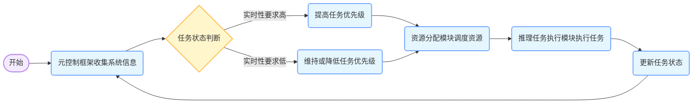

# 元控制框架下的推理任务动态优先级调度

> 关键词：元控制框架、推理任务、动态优先级调度、资源分配、性能优化

> 摘要：本文围绕元控制框架下的推理任务动态优先级调度展开深入研究。首先介绍了相关背景，包括目的、预期读者、文档结构和术语表。接着阐述了核心概念与联系，通过文本示意图和 Mermaid 流程图展示其原理和架构。详细讲解了核心算法原理，并给出 Python 源代码示例。同时，对涉及的数学模型和公式进行详细说明并举例。通过项目实战，展示了开发环境搭建、源代码实现及解读。探讨了实际应用场景，推荐了相关工具和资源。最后总结了未来发展趋势与挑战，并提供常见问题解答和扩展阅读参考资料，旨在为该领域的研究和实践提供全面的技术指导。

## 1. 背景介绍 
### 1.1 目的和范围
在当今的人工智能和计算机系统中，推理任务的处理效率和资源利用率至关重要。推理任务往往具有不同的特性和需求，例如实时性要求、计算复杂度等。传统的静态优先级调度方法难以适应动态变化的任务环境，无法充分发挥系统的性能。元控制框架下的推理任务动态优先级调度旨在解决这一问题，通过动态调整推理任务的优先级，实现更高效的资源分配和任务处理，提高系统的整体性能和响应能力。

本文的范围涵盖了元控制框架下推理任务动态优先级调度的基本概念、核心算法、数学模型、项目实战、应用场景以及相关工具和资源等方面，为读者提供全面深入的技术知识和实践指导。

### 1.2 预期读者
本文预期读者包括人工智能领域的研究人员、软件开发工程师、系统架构师以及对推理任务调度和资源管理感兴趣的技术爱好者。对于希望深入了解如何优化推理任务处理效率、提高系统性能的专业人士，本文将提供有价值的技术参考。

### 1.3 文档结构概述
本文将按照以下结构进行组织：
1. **背景介绍**：阐述研究的目的、预期读者、文档结构和术语表。
2. **核心概念与联系**：介绍元控制框架、推理任务、动态优先级调度等核心概念，并展示其原理和架构。
3. **核心算法原理 & 具体操作步骤**：详细讲解动态优先级调度的核心算法，并给出 Python 源代码示例。
4. **数学模型和公式 & 详细讲解 & 举例说明**：介绍相关的数学模型和公式，并通过具体例子进行说明。
5. **项目实战：代码实际案例和详细解释说明**：通过一个实际项目，展示开发环境搭建、源代码实现及解读。
6. **实际应用场景**：探讨元控制框架下推理任务动态优先级调度的实际应用场景。
7. **工具和资源推荐**：推荐相关的学习资源、开发工具框架和论文著作。
8. **总结：未来发展趋势与挑战**：总结该领域的未来发展趋势和面临的挑战。
9. **附录：常见问题与解答**：解答读者可能遇到的常见问题。
10. **扩展阅读 & 参考资料**：提供扩展阅读的建议和相关参考资料。

### 1.4 术语表
#### 1.4.1 核心术语定义
- **元控制框架**：一种用于管理和控制其他系统或组件的高级框架，通过收集系统状态信息和任务特征，进行决策和调度。
- **推理任务**：在人工智能和机器学习中，根据已有的模型和输入数据，进行预测、分类等操作的任务。
- **动态优先级调度**：根据任务的实时状态和系统资源情况，动态调整任务的优先级，以实现更高效的任务处理。
- **资源分配**：将系统的计算资源（如 CPU、GPU 等）分配给不同的任务，以满足任务的需求。

#### 1.4.2 相关概念解释
- **静态优先级调度**：在任务开始执行前，为每个任务分配固定的优先级，在任务执行过程中优先级保持不变。
- **实时性要求**：任务需要在规定的时间内完成的要求，例如实时视频处理、自动驾驶等任务对实时性要求较高。
- **计算复杂度**：任务执行所需的计算资源和时间的度量，通常与任务的算法和数据规模有关。

#### 1.4.3 缩略词列表
- **CPU**：中央处理器（Central Processing Unit）
- **GPU**：图形处理器（Graphics Processing Unit）
- **QoS**：服务质量（Quality of Service）

## 2. 核心概念与联系 

### 核心概念原理
元控制框架下的推理任务动态优先级调度主要基于以下原理：
- **元控制**：元控制框架作为一个高级的控制层，负责收集系统的各种信息，包括任务的状态、资源的使用情况等。通过对这些信息的分析和处理，元控制框架可以做出决策，调整推理任务的优先级。
- **动态优先级**：与传统的静态优先级调度不同，动态优先级调度根据任务的实时状态和系统资源情况，动态地调整任务的优先级。例如，对于实时性要求较高的任务，在其接近截止时间时，提高其优先级，以确保任务能够及时完成。
- **资源分配优化**：通过动态调整任务的优先级，实现更合理的资源分配。将更多的资源分配给优先级较高的任务，提高系统的整体性能和资源利用率。

### 架构的文本示意图
```plaintext
+---------------------+
|    元控制框架       |
|  (信息收集与决策)   |
+---------------------+
       |
       | 收集系统信息
       v
+---------------------+
|  任务管理模块       |
| (任务状态监控)      |
+---------------------+
       |
       | 任务优先级调整
       v
+---------------------+
|  资源分配模块       |
| (资源调度)          |
+---------------------+
       |
       | 资源分配结果
       v
+---------------------+
|  推理任务执行模块   |
| (任务执行)          |
+---------------------+
```

### Mermaid 流程图


## 3. 核心算法原理 & 具体操作步骤 

### 核心算法原理
元控制框架下的推理任务动态优先级调度算法主要基于任务的实时性要求、计算复杂度和系统资源情况来动态调整任务的优先级。以下是一个简化的算法思路：

1. **任务特征提取**：收集每个推理任务的特征，包括实时性要求（如截止时间）、计算复杂度（如所需的计算资源和时间）等。
2. **系统资源监控**：实时监控系统的资源使用情况，如 CPU 利用率、GPU 利用率等。
3. **优先级计算**：根据任务的特征和系统资源情况，计算每个任务的优先级。优先级的计算可以采用以下公式：

$Priority = w_1 \times \frac{Deadline - CurrentTime}{Deadline} + w_2 \times \frac{ComputationalComplexity}{TotalSystemResources}$

其中，$w_1$ 和 $w_2$ 是权重系数，$Deadline$ 是任务的截止时间，$CurrentTime$ 是当前时间，$ComputationalComplexity$ 是任务的计算复杂度，$TotalSystemResources$ 是系统的总资源。

4. **任务调度**：根据计算得到的优先级，对任务进行调度。将优先级较高的任务分配更多的资源，优先执行。

### 具体操作步骤
以下是使用 Python 实现上述算法的具体代码：

```python
import time

# 定义任务类
class Task:
    def __init__(self, id, deadline, computational_complexity):
        self.id = id
        self.deadline = deadline
        self.computational_complexity = computational_complexity
        self.priority = 0

    def calculate_priority(self, current_time, total_system_resources, w1=0.6, w2=0.4):
        # 计算优先级
        self.priority = w1 * ((self.deadline - current_time) / self.deadline) + w2 * (self.computational_complexity / total_system_resources)
        return self.priority

# 定义元控制框架类
class MetaControlFramework:
    def __init__(self, total_system_resources):
        self.total_system_resources = total_system_resources
        self.tasks = []

    def add_task(self, task):
        self.tasks.append(task)

    def schedule_tasks(self):
        current_time = time.time()
        # 计算每个任务的优先级
        for task in self.tasks:
            task.calculate_priority(current_time, self.total_system_resources)

        # 按优先级对任务进行排序
        sorted_tasks = sorted(self.tasks, key=lambda x: x.priority, reverse=True)

        # 模拟任务执行
        for task in sorted_tasks:
            print(f"执行任务 {task.id}，优先级: {task.priority}")

# 示例使用
if __name__ == "__main__":
    total_system_resources = 100
    framework = MetaControlFramework(total_system_resources)

    # 创建任务
    task1 = Task(1, time.time() + 60, 20)
    task2 = Task(2, time.time() + 30, 30)
    task3 = Task(3, time.time() + 90, 10)

    # 添加任务到框架
    framework.add_task(task1)
    framework.add_task(task2)
    framework.add_task(task3)

    # 调度任务
    framework.schedule_tasks()
```

### 代码解释
1. **Task 类**：表示推理任务，包含任务的 ID、截止时间、计算复杂度和优先级。`calculate_priority` 方法用于计算任务的优先级。
2. **MetaControlFramework 类**：表示元控制框架，包含系统的总资源和任务列表。`add_task` 方法用于添加任务到框架，`schedule_tasks` 方法用于调度任务。
3. **主程序**：创建元控制框架，添加任务，然后调用 `schedule_tasks` 方法进行任务调度。

## 4. 数学模型和公式 & 详细讲解 & 举例说明 

### 数学模型和公式
在元控制框架下的推理任务动态优先级调度中，我们使用以下数学模型和公式来计算任务的优先级：

$Priority = w_1 \times \frac{Deadline - CurrentTime}{Deadline} + w_2 \times \frac{ComputationalComplexity}{TotalSystemResources}$

其中：
- $Priority$ 是任务的优先级，取值范围为 $[0, 1]$。
- $w_1$ 和 $w_2$ 是权重系数，满足 $w_1 + w_2 = 1$，用于调整实时性要求和计算复杂度对优先级的影响。
- $Deadline$ 是任务的截止时间，单位为秒。
- $CurrentTime$ 是当前时间，单位为秒。
- $ComputationalComplexity$ 是任务的计算复杂度，例如所需的 CPU 周期数或 GPU 显存。
- $TotalSystemResources$ 是系统的总资源，例如 CPU 的总核心数或 GPU 的总显存。

### 详细讲解
- **实时性要求部分**：$\frac{Deadline - CurrentTime}{Deadline}$ 表示任务剩余时间占总时间的比例。当任务接近截止时间时，该比例趋近于 0，优先级会相应提高，以确保任务能够及时完成。
- **计算复杂度部分**：$\frac{ComputationalComplexity}{TotalSystemResources}$ 表示任务所需的计算资源占系统总资源的比例。计算复杂度越高，该比例越大，优先级也会相应提高。
- **权重系数**：$w_1$ 和 $w_2$ 用于调整实时性要求和计算复杂度对优先级的影响。例如，当 $w_1$ 较大时，实时性要求对优先级的影响更大；当 $w_2$ 较大时，计算复杂度对优先级的影响更大。

### 举例说明
假设系统的总资源为 100，当前时间为 0 秒，有以下两个任务：
- 任务 A：截止时间为 60 秒，计算复杂度为 20。
- 任务 B：截止时间为 30 秒，计算复杂度为 30。

取 $w_1 = 0.6$，$w_2 = 0.4$，则任务 A 和任务 B 的优先级计算如下：

#### 任务 A
$Priority_A = 0.6 \times \frac{60 - 0}{60} + 0.4 \times \frac{20}{100} = 0.6 + 0.08 = 0.68$

#### 任务 B
$Priority_B = 0.6 \times \frac{30 - 0}{30} + 0.4 \times \frac{30}{100} = 0.6 + 0.12 = 0.72$

由于 $Priority_B > Priority_A$，任务 B 的优先级更高，在任务调度时会优先执行。

## 5. 项目实战：代码实际案例和详细解释说明 

### 5.1  开发环境搭建
在进行元控制框架下的推理任务动态优先级调度项目实战时，我们需要搭建以下开发环境：

#### 操作系统
推荐使用 Linux 系统，如 Ubuntu 18.04 或更高版本，因为 Linux 系统对开发和部署人工智能应用具有良好的支持。

#### 编程语言
使用 Python 作为开发语言，Python 具有丰富的科学计算和机器学习库，适合进行任务调度算法的实现。

#### 依赖库安装
安装以下 Python 依赖库：
```bash
pip install numpy
```

### 5.2  源代码详细实现和代码解读
以下是一个更完整的项目实战代码示例，包括任务的模拟执行和资源管理：

```python
import time
import numpy as np

# 定义任务类
class Task:
    def __init__(self, id, deadline, computational_complexity):
        self.id = id
        self.deadline = deadline
        self.computational_complexity = computational_complexity
        self.priority = 0
        self.start_time = None
        self.end_time = None
        self.is_completed = False

    def calculate_priority(self, current_time, total_system_resources, w1=0.6, w2=0.4):
        # 计算优先级
        self.priority = w1 * ((self.deadline - current_time) / self.deadline) + w2 * (self.computational_complexity / total_system_resources)
        return self.priority

    def execute(self, resource_allocation):
        # 模拟任务执行
        self.start_time = time.time()
        execution_time = self.computational_complexity / resource_allocation
        time.sleep(execution_time)
        self.end_time = time.time()
        self.is_completed = True
        print(f"任务 {self.id} 执行完成，耗时: {self.end_time - self.start_time} 秒")

# 定义元控制框架类
class MetaControlFramework:
    def __init__(self, total_system_resources):
        self.total_system_resources = total_system_resources
        self.tasks = []
        self.available_resources = total_system_resources

    def add_task(self, task):
        self.tasks.append(task)

    def schedule_tasks(self):
        while self.tasks:
            current_time = time.time()
            # 计算每个任务的优先级
            for task in self.tasks:
                task.calculate_priority(current_time, self.total_system_resources)

            # 按优先级对任务进行排序
            sorted_tasks = sorted(self.tasks, key=lambda x: x.priority, reverse=True)

            # 分配资源并执行任务
            for task in sorted_tasks:
                if self.available_resources >= task.computational_complexity:
                    self.available_resources -= task.computational_complexity
                    task.execute(task.computational_complexity)
                    self.available_resources += task.computational_complexity
                    self.tasks.remove(task)
                    break

# 示例使用
if __name__ == "__main__":
    total_system_resources = 100
    framework = MetaControlFramework(total_system_resources)

    # 创建任务
    task1 = Task(1, time.time() + 60, 20)
    task2 = Task(2, time.time() + 30, 30)
    task3 = Task(3, time.time() + 90, 10)

    # 添加任务到框架
    framework.add_task(task1)
    framework.add_task(task2)
    framework.add_task(task3)

    # 调度任务
    framework.schedule_tasks()
```

### 5.3  代码解读与分析
1. **Task 类**：除了之前的属性和方法外，增加了 `start_time`、`end_time` 和 `is_completed` 属性，用于记录任务的执行时间和完成状态。`execute` 方法模拟任务的执行，根据分配的资源计算执行时间，并使用 `time.sleep` 模拟任务执行过程。
2. **MetaControlFramework 类**：增加了 `available_resources` 属性，用于记录当前可用的系统资源。`schedule_tasks` 方法在循环中不断调度任务，直到所有任务执行完成。在分配资源时，会检查当前可用资源是否足够，如果足够则分配资源并执行任务，执行完成后释放资源。
3. **主程序**：创建元控制框架，添加任务，然后调用 `schedule_tasks` 方法进行任务调度。

通过这个项目实战，我们可以看到如何在元控制框架下实现推理任务的动态优先级调度，并模拟任务的执行和资源管理。

## 6. 实际应用场景 
元控制框架下的推理任务动态优先级调度在许多实际应用场景中具有重要的作用，以下是一些常见的应用场景：

### 实时视频处理
在实时视频处理系统中，如视频监控、视频直播等，需要对大量的视频帧进行实时处理，包括目标检测、人脸识别等推理任务。不同的推理任务可能具有不同的实时性要求，例如关键区域的目标检测任务需要更高的实时性。通过动态优先级调度，可以根据任务的实时性要求和计算复杂度，动态调整任务的优先级，确保关键任务能够及时完成，提高视频处理的质量和效率。

### 自动驾驶
在自动驾驶系统中，需要进行大量的传感器数据处理和推理任务，如障碍物检测、路径规划等。这些任务对实时性要求极高，任何延迟都可能导致严重的后果。元控制框架下的推理任务动态优先级调度可以根据车辆的行驶状态、传感器数据的紧急程度等因素，动态调整推理任务的优先级，确保自动驾驶系统的安全性和可靠性。

### 云计算数据中心
在云计算数据中心中，会同时处理大量的用户请求和推理任务。不同的用户请求可能具有不同的服务质量要求，例如一些对响应时间要求较高的在线服务。通过动态优先级调度，可以根据用户请求的实时性要求和计算复杂度，合理分配计算资源，提高数据中心的资源利用率和服务质量。

### 工业物联网
在工业物联网系统中，需要对大量的传感器数据进行实时分析和推理，如设备状态监测、故障预测等。不同的推理任务可能具有不同的重要性和实时性要求，例如关键设备的故障预测任务需要更高的优先级。通过动态优先级调度，可以确保重要的推理任务能够及时处理，提高工业生产的效率和可靠性。

## 7. 工具和资源推荐
### 7.1 学习资源推荐
#### 7.1.1 书籍推荐
- 《人工智能：一种现代的方法》：这是一本经典的人工智能教材，涵盖了人工智能的各个方面，包括搜索算法、机器学习、自然语言处理等，对于理解推理任务的基本原理和方法有很大的帮助。
- 《Python 机器学习》：介绍了使用 Python 进行机器学习的方法和技术，包括各种机器学习算法的实现和应用，适合初学者学习和实践。
- 《实时系统设计与分析》：详细介绍了实时系统的设计和分析方法，包括任务调度、资源管理等方面的内容，对于理解实时性要求较高的推理任务调度有很大的帮助。

#### 7.1.2 在线课程
- Coursera 上的“人工智能基础”课程：由知名高校的教授授课，系统地介绍了人工智能的基本概念、算法和应用，适合初学者入门。
- edX 上的“机器学习”课程：由斯坦福大学的教授授课，深入讲解了机器学习的各种算法和技术，对于提高机器学习的实践能力有很大的帮助。
- Udemy 上的“Python 数据科学和机器学习实战”课程：通过实际项目，介绍了使用 Python 进行数据科学和机器学习的方法和技术，适合有一定编程基础的学习者。

#### 7.1.3 技术博客和网站
- Medium：一个技术博客平台，上面有很多关于人工智能、机器学习、任务调度等方面的优秀文章，可以帮助读者了解最新的技术动态和研究成果。
- arXiv：一个预印本论文平台，上面有很多关于人工智能和计算机科学的最新研究论文，可以帮助读者了解该领域的前沿研究。
- AI 研习社：一个专注于人工智能领域的社区，提供了大量的技术文章、教程、案例等资源，适合人工智能爱好者学习和交流。

### 7.2 开发工具框架推荐
#### 7.2.1 IDE和编辑器
- PyCharm：一款专业的 Python 集成开发环境，提供了丰富的代码编辑、调试、版本控制等功能，适合 Python 开发者使用。
- Jupyter Notebook：一个交互式的开发环境，支持 Python、R 等多种编程语言，适合进行数据探索、模型训练和实验验证。
- Visual Studio Code：一款轻量级的代码编辑器，支持多种编程语言和插件扩展，适合快速开发和调试代码。

#### 7.2.2 调试和性能分析工具
- pdb：Python 自带的调试器，可以帮助开发者定位和解决代码中的问题。
- cProfile：Python 自带的性能分析工具，可以分析代码的运行时间和函数调用情况，帮助开发者优化代码性能。
- TensorBoard：一个用于可视化深度学习模型训练过程的工具，可以帮助开发者监控模型的训练进度、损失函数变化等情况。

#### 7.2.3 相关框架和库
- NumPy：一个用于科学计算的 Python 库，提供了高效的数组操作和数学函数，是许多机器学习和数据科学库的基础。
- Pandas：一个用于数据处理和分析的 Python 库，提供了高效的数据结构和数据操作方法，适合处理和分析各种类型的数据。
- Scikit-learn：一个用于机器学习的 Python 库，提供了各种机器学习算法的实现和工具，适合进行机器学习模型的训练和评估。

### 7.3 相关论文著作推荐
#### 7.3.1 经典论文
- “A New Approach to Job Shop Scheduling”：提出了一种新的作业车间调度方法，对于理解任务调度的基本原理和方法有很大的帮助。
- “Dynamic Task Scheduling in Real - Time Systems”：介绍了实时系统中动态任务调度的方法和技术，对于研究实时性要求较高的推理任务调度有重要的参考价值。
- “Resource Allocation and Task Scheduling in Cloud Computing Environments”：探讨了云计算环境下的资源分配和任务调度问题，对于理解云计算数据中心中的推理任务调度有很大的帮助。

#### 7.3.2 最新研究成果
- 关注顶级学术会议如 NeurIPS、ICML、CVPR 等上发表的关于任务调度、资源管理和人工智能的最新研究论文，了解该领域的前沿研究成果。
- 关注知名学术期刊如 Journal of Artificial Intelligence Research (JAIR)、Artificial Intelligence 等上发表的相关研究论文。

#### 7.3.3 应用案例分析
- 一些大型科技公司如 Google、Microsoft、Amazon 等会在其官方博客或技术报告中分享他们在推理任务调度和资源管理方面的应用案例，可以从中学习到实际应用中的经验和方法。

## 8. 总结：未来发展趋势与挑战
### 未来发展趋势
- **智能化调度**：随着人工智能技术的不断发展，元控制框架将更加智能化，能够自动学习和适应不同的任务环境和系统状态，实现更精准的任务优先级调度和资源分配。
- **多模态融合调度**：未来的推理任务将越来越多地涉及多模态数据，如图像、语音、文本等。元控制框架需要能够处理多模态数据的推理任务，实现多模态融合调度，提高系统的整体性能和应用效果。
- **边缘计算与云协同调度**：边缘计算和云计算的结合将成为未来的发展趋势。元控制框架需要能够实现边缘计算设备和云服务器之间的协同调度，根据任务的实时性要求和计算复杂度，合理分配任务到边缘设备或云服务器上执行，提高系统的响应能力和资源利用率。

### 挑战
- **系统复杂性**：随着系统规模的不断扩大和任务的多样化，元控制框架面临着更高的系统复杂性。如何有效地收集和处理系统信息，做出准确的决策，是一个巨大的挑战。
- **实时性保证**：在一些对实时性要求极高的应用场景中，如自动驾驶、实时视频处理等，如何确保推理任务能够在规定的时间内完成，是一个关键的挑战。需要进一步研究和优化动态优先级调度算法，提高系统的实时性。
- **资源竞争与冲突**：在多任务环境下，不同的推理任务可能会竞争系统的资源，导致资源冲突。如何有效地解决资源竞争和冲突问题，实现公平、高效的资源分配，是一个需要解决的难题。

## 9. 附录：常见问题与解答
### 问题 1：如何选择合适的权重系数 $w_1$ 和 $w_2$？
答：权重系数 $w_1$ 和 $w_2$ 的选择需要根据具体的应用场景和任务需求来确定。如果任务对实时性要求较高，可以适当增大 $w_1$ 的值；如果任务对计算复杂度更为敏感，可以适当增大 $w_2$ 的值。通常可以通过实验和调优的方法，找到最合适的权重系数组合。

### 问题 2：如何处理任务的动态变化，如任务的新增、删除和修改？
答：在元控制框架中，可以通过监控任务队列，实时检测任务的动态变化。当有新任务加入时，将其添加到任务队列中，并重新计算所有任务的优先级；当任务完成或被删除时，从任务队列中移除该任务；当任务的属性发生修改时，更新任务的属性并重新计算其优先级。

### 问题 3：如何提高系统的实时性？
答：可以从以下几个方面提高系统的实时性：优化动态优先级调度算法，确保实时性要求较高的任务能够优先执行；采用高效的资源分配策略，减少资源分配的延迟；优化任务执行的代码，提高任务的执行效率；使用高性能的硬件设备，如 GPU、FPGA 等，加速任务的计算过程。

### 问题 4：如何处理资源竞争和冲突？
答：可以采用以下方法处理资源竞争和冲突：设置资源的使用规则和优先级，优先满足优先级较高的任务的资源需求；采用资源预留和分配机制，提前为关键任务预留足够的资源；动态调整任务的优先级和资源分配，根据任务的实时状态和资源使用情况，灵活调整任务的执行顺序和资源分配量。

## 10. 扩展阅读 & 参考资料
### 扩展阅读
- 《深入理解计算机系统》：深入介绍了计算机系统的底层原理和工作机制，对于理解任务调度和资源管理的底层实现有很大的帮助。
- 《深度学习》：详细介绍了深度学习的基本原理、算法和应用，对于理解推理任务的深度学习模型有很大的帮助。
- 《并行计算导论》：介绍了并行计算的基本概念、算法和编程方法，对于理解如何利用多核 CPU 和 GPU 进行并行任务调度有很大的帮助。

### 参考资料
- [Python 官方文档](https://docs.python.org/3/)
- [NumPy 官方文档](https://numpy.org/doc/)
- [Pandas 官方文档](https://pandas.pydata.org/docs/)
- [Scikit-learn 官方文档](https://scikit-learn.org/stable/documentation.html)

作者：AI天才研究院/AI Genius Institute & 禅与计算机程序设计艺术 /Zen And The Art of Computer Programming