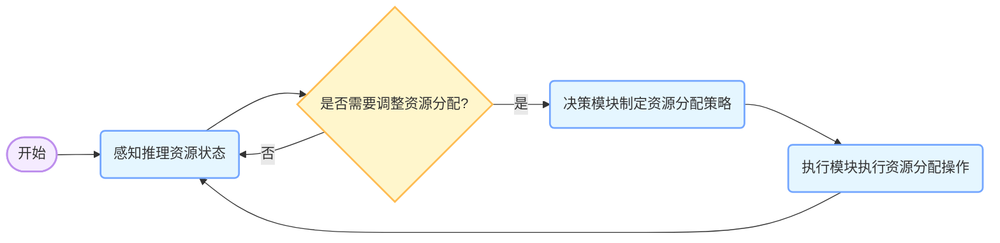

# 元控制框架下的推理资源动态分配与优化策略

> 关键词：元控制框架、推理资源、动态分配、优化策略、人工智能

> 摘要：本文聚焦于元控制框架下的推理资源动态分配与优化策略。首先介绍了该研究的背景、目的、预期读者等信息，接着阐述了核心概念及其联系，包括元控制框架和推理资源的原理与架构，并通过Mermaid流程图展示。详细讲解了核心算法原理，使用Python代码进行说明，同时给出了相关数学模型和公式。通过项目实战，展示了代码实现和解读，分析了代码的运行逻辑。探讨了该策略在实际中的应用场景，推荐了学习、开发相关的工具和资源，包括书籍、在线课程、开发框架等。最后总结了未来发展趋势与挑战，解答了常见问题，并提供了扩展阅读和参考资料，旨在为相关领域的研究和实践提供全面的技术指导。

## 1. 背景介绍 
### 1.1 目的和范围
在当今人工智能和机器学习飞速发展的时代，推理任务变得越来越复杂和多样化。推理资源，如计算能力、内存、网络带宽等，成为了限制系统性能和效率的关键因素。元控制框架作为一种高级的控制机制，能够根据系统的状态和目标，动态地管理和分配资源。本研究的目的是深入探讨在元控制框架下如何实现推理资源的动态分配与优化，以提高系统的整体性能、降低资源消耗，并适应不同的推理任务需求。

本研究的范围涵盖了元控制框架的基本原理、推理资源的分类和特点、动态分配与优化策略的设计和实现。同时，通过实际案例和实验，验证这些策略的有效性和可行性。

### 1.2 预期读者
本文的预期读者包括人工智能领域的研究人员、工程师、软件开发者，以及对资源管理和优化感兴趣的技术爱好者。对于从事机器学习模型推理、分布式计算、云计算等相关工作的人员，本文将提供有价值的技术参考和实践指导。

### 1.3 文档结构概述
本文将按照以下结构进行组织：
1. **背景介绍**：阐述研究的目的、范围、预期读者和文档结构，同时介绍相关术语和概念。
2. **核心概念与联系**：详细解释元控制框架和推理资源的核心概念，展示它们之间的联系，并通过示意图和流程图进行可视化。
3. **核心算法原理 & 具体操作步骤**：介绍实现推理资源动态分配与优化的核心算法，使用Python代码详细说明算法的具体实现步骤。
4. **数学模型和公式 & 详细讲解 & 举例说明**：建立描述推理资源分配和优化问题的数学模型，给出相关公式，并通过具体例子进行解释。
5. **项目实战：代码实际案例和详细解释说明**：通过一个实际的项目案例，展示如何在元控制框架下实现推理资源的动态分配与优化，包括开发环境搭建、源代码实现和代码解读。
6. **实际应用场景**：探讨该策略在不同领域的实际应用场景，分析其优势和挑战。
7. **工具和资源推荐**：推荐学习和开发过程中有用的工具和资源，包括书籍、在线课程、开发框架等。
8. **总结：未来发展趋势与挑战**：总结本文的主要内容，展望元控制框架下推理资源动态分配与优化策略的未来发展趋势，并分析面临的挑战。
9. **附录：常见问题与解答**：解答读者在阅读和实践过程中可能遇到的常见问题。
10. **扩展阅读 & 参考资料**：提供相关的扩展阅读材料和参考资料，方便读者深入研究。

### 1.4 术语表
#### 1.4.1 核心术语定义
- **元控制框架**：一种高级的控制机制，通过对系统的全局状态和目标进行感知和分析，动态地调整系统的行为和资源分配策略。
- **推理资源**：在推理过程中所需要的各种资源，包括计算资源（如CPU、GPU）、内存资源、网络带宽等。
- **动态分配**：根据系统的实时状态和任务需求，实时地调整资源的分配方案，以提高资源的利用率和系统的性能。
- **优化策略**：为了达到特定的目标（如最小化资源消耗、最大化系统吞吐量等），设计的一系列资源分配和管理方法。

#### 1.4.2 相关概念解释
- **推理任务**：使用训练好的模型对输入数据进行预测或分类的过程。
- **资源利用率**：指实际使用的资源量与总资源量的比值，反映了资源的使用效率。
- **系统吞吐量**：单位时间内系统能够处理的推理任务数量，是衡量系统性能的重要指标之一。

#### 1.4.3 缩略词列表
- **CPU**：Central Processing Unit，中央处理器
- **GPU**：Graphics Processing Unit，图形处理器
- **RAM**：Random Access Memory，随机存取存储器
- **QoS**：Quality of Service，服务质量

## 2. 核心概念与联系 
### 2.1 元控制框架原理
元控制框架的核心思想是通过对系统的全局状态进行感知和分析，动态地调整系统的行为和资源分配策略。它通常由以下几个部分组成：

- **感知模块**：负责收集系统的各种状态信息，包括推理任务的类型、数量、优先级，以及系统的资源使用情况（如CPU使用率、内存占用率等）。
- **决策模块**：根据感知模块收集到的信息，结合系统的目标和约束条件，制定资源分配和管理策略。
- **执行模块**：将决策模块制定的策略转化为具体的操作，对系统的资源进行分配和调整。

### 2.2 推理资源分类与特点
推理资源可以分为以下几类：

- **计算资源**：主要包括CPU和GPU。CPU具有较强的通用性，适用于处理复杂的逻辑运算和控制任务；GPU则具有强大的并行计算能力，特别适合处理大规模的矩阵运算，常用于深度学习模型的推理。
- **内存资源**：用于存储推理过程中所需的数据和模型参数。内存的大小和读写速度会直接影响推理的性能。
- **网络带宽**：在分布式推理系统中，网络带宽用于数据的传输。高带宽的网络可以减少数据传输的延迟，提高系统的整体性能。

### 2.3 元控制框架与推理资源的联系
元控制框架通过感知推理资源的使用情况和推理任务的需求，动态地调整资源的分配。例如，当某个推理任务对计算资源要求较高时，元控制框架可以将更多的CPU或GPU资源分配给该任务；当系统的内存资源紧张时，元控制框架可以采取内存优化策略，如数据压缩、缓存管理等。

### 2.4 文本示意图
```plaintext
+----------------+        +----------------+        +----------------+
|  感知模块      | -----> |  决策模块      | -----> |  执行模块      |
+----------------+        +----------------+        +----------------+
          |                           |                           |
          v                           v                           v
+----------------+        +----------------+        +----------------+
|  推理资源状态  |        |  资源分配策略  |        |  资源分配操作  |
+----------------+        +----------------+        +----------------+
          |                           |                           |
          v                           v                           v
+----------------+        +----------------+        +----------------+
|  CPU使用率      |        |  任务A分配X%CPU |        |  调整CPU资源   |
|  GPU使用率      |        |  任务B分配Y%GPU |        |  调整GPU资源   |
|  内存占用率    |        |  任务C分配Z%内存|        |  调整内存资源   |
|  网络带宽      |        | ...            |        |  调整网络带宽  |
+----------------+        +----------------+        +----------------+
```

### 2.5 Mermaid流程图


## 3. 核心算法原理 & 具体操作步骤 
### 3.1 核心算法原理
本研究采用的核心算法是基于动态规划的资源分配算法。动态规划是一种通过将复杂问题分解为多个子问题，并保存子问题的解来避免重复计算的算法。在推理资源分配问题中，我们可以将其看作是一个多阶段决策问题，每个阶段对应一个推理任务，目标是在满足系统资源约束的前提下，最大化系统的整体性能。

### 3.2 具体操作步骤
以下是基于动态规划的推理资源分配算法的具体操作步骤：

1. **定义状态**：定义系统的状态，包括当前可用的资源量和已经分配的任务集合。
2. **定义决策**：对于每个状态，定义可能的决策，即可以分配给当前任务的资源量。
3. **定义状态转移方程**：根据当前状态和决策，计算下一个状态。
4. **定义目标函数**：定义一个目标函数，用于衡量系统的性能，如系统吞吐量、资源利用率等。
5. **求解最优解**：使用动态规划算法，从初始状态开始，逐步求解每个状态的最优决策，直到达到最终状态。

### 3.3 Python源代码实现
```python
import numpy as np

# 定义推理任务的资源需求和优先级
tasks = [
    {"id": 1, "cpu_demand": 2, "gpu_demand": 0, "priority": 3},
    {"id": 2, "cpu_demand": 1, "gpu_demand": 1, "priority": 2},
    {"id": 3, "cpu_demand": 0, "gpu_demand": 2, "priority": 1}
]

# 定义系统的可用资源
total_cpu = 3
total_gpu = 2

# 定义状态空间
states = [(cpu, gpu) for cpu in range(total_cpu + 1) for gpu in range(total_gpu + 1)]

# 初始化动态规划表
dp = np.zeros((len(states), len(tasks) + 1))

# 定义状态转移函数
def state_transition(state, task):
    cpu, gpu = state
    new_cpu = cpu - task["cpu_demand"]
    new_gpu = gpu - task["gpu_demand"]
    if new_cpu < 0 or new_gpu < 0:
        return None
    return (new_cpu, new_gpu)

# 动态规划求解
for i in range(len(tasks)):
    task = tasks[i]
    for j, state in enumerate(states):
        next_state = state_transition(state, task)
        if next_state is not None:
            next_state_index = states.index(next_state)
            dp[j, i + 1] = max(dp[j, i], dp[next_state_index, i] + task["priority"])
        else:
            dp[j, i + 1] = dp[j, i]

# 回溯找到最优分配方案
optimal_allocation = []
current_state = (total_cpu, total_gpu)
for i in range(len(tasks) - 1, -1, -1):
    task = tasks[i]
    next_state = state_transition(current_state, task)
    if next_state is not None:
        next_state_index = states.index(next_state)
        if dp[states.index(current_state), i + 1] > dp[states.index(current_state), i]:
            optimal_allocation.append(task["id"])
            current_state = next_state

optimal_allocation.reverse()
print("最优分配方案:", optimal_allocation)
```

### 3.4 代码解释
1. **任务和资源定义**：定义了推理任务的资源需求和优先级，以及系统的可用资源。
2. **状态空间初始化**：生成所有可能的系统状态。
3. **动态规划表初始化**：初始化一个二维数组`dp`，用于保存每个状态和任务组合的最优值。
4. **状态转移函数**：定义了状态转移函数`state_transition`，用于计算下一个状态。
5. **动态规划求解**：使用双重循环遍历所有状态和任务，根据状态转移方程更新`dp`表。
6. **回溯找到最优分配方案**：从最终状态开始，回溯找到最优的资源分配方案。

## 4. 数学模型和公式 & 详细讲解 & 举例说明 
### 4.1 数学模型
设 $T = \{t_1, t_2, \cdots, t_n\}$ 为推理任务集合，每个任务 $t_i$ 有资源需求向量 $\mathbf{r}_i = (r_{i1}, r_{i2}, \cdots, r_{im})$，其中 $r_{ij}$ 表示任务 $t_i$ 对第 $j$ 种资源的需求。设 $R = (R_1, R_2, \cdots, R_m)$ 为系统的可用资源向量。

定义一个决策变量 $x_{ij}$，表示任务 $t_i$ 是否分配第 $j$ 种资源，$x_{ij} \in \{0, 1\}$。目标是最大化系统的整体性能 $P$，可以表示为：

$$
\max P = \sum_{i = 1}^{n} w_i f_i(\mathbf{x}_i)
$$

其中 $w_i$ 是任务 $t_i$ 的优先级，$f_i(\mathbf{x}_i)$ 是任务 $t_i$ 的性能函数，$\mathbf{x}_i = (x_{i1}, x_{i2}, \cdots, x_{im})$。

同时，需要满足资源约束条件：

$$
\sum_{i = 1}^{n} x_{ij} r_{ij} \leq R_j, \quad j = 1, 2, \cdots, m
$$

### 4.2 公式详细讲解
- **目标函数**：$\sum_{i = 1}^{n} w_i f_i(\mathbf{x}_i)$ 表示系统的整体性能是每个任务的性能乘以其优先级的总和。通过最大化这个目标函数，可以使得高优先级的任务得到更多的资源分配，从而提高系统的整体性能。
- **资源约束条件**：$\sum_{i = 1}^{n} x_{ij} r_{ij} \leq R_j$ 表示每种资源的分配总量不能超过系统的可用资源量。

### 4.3 举例说明
假设有两个推理任务 $t_1$ 和 $t_2$，资源需求分别为 $\mathbf{r}_1 = (2, 1)$ 和 $\mathbf{r}_2 = (1, 2)$，系统的可用资源为 $R = (3, 3)$。任务的优先级分别为 $w_1 = 3$ 和 $w_2 = 2$。

设 $x_{11}$ 和 $x_{12}$ 分别表示任务 $t_1$ 是否分配第一种和第二种资源，$x_{21}$ 和 $x_{22}$ 分别表示任务 $t_2$ 是否分配第一种和第二种资源。

目标函数为：

$$
\max P = 3 f_1(x_{11}, x_{12}) + 2 f_2(x_{21}, x_{22})
$$

资源约束条件为：

$$
2x_{11} + x_{21} \leq 3
$$
$$
x_{12} + 2x_{22} \leq 3
$$

通过求解这个数学模型，可以得到最优的资源分配方案。

## 5. 项目实战：代码实际案例和详细解释说明 
### 5.1  开发环境搭建
#### 5.1.1 操作系统
本项目可以在多种操作系统上运行，如Windows、Linux（如Ubuntu）等。建议使用Linux系统，因为它在开发和部署方面具有更好的稳定性和兼容性。

#### 5.1.2 Python环境
安装Python 3.7及以上版本。可以使用Anaconda来管理Python环境，具体安装步骤如下：

1. 从Anaconda官网（https://www.anaconda.com/products/individual）下载适合自己操作系统的Anaconda安装包。
2. 运行安装包，按照提示进行安装。
3. 安装完成后，打开终端或命令提示符，输入以下命令创建一个新的Python环境：

```bash
conda create -n resource_allocation python=3.8
```

4. 激活新创建的环境：

```bash
conda activate resource_allocation
```

#### 5.1.3 依赖库安装
在激活的Python环境中，安装项目所需的依赖库：

```bash
pip install numpy
```

### 5.2  源代码详细实现和代码解读
以下是一个完整的项目代码示例，用于在元控制框架下实现推理资源的动态分配与优化：

```python
import numpy as np

# 定义推理任务的资源需求和优先级
tasks = [
    {"id": 1, "cpu_demand": 2, "gpu_demand": 0, "priority": 3},
    {"id": 2, "cpu_demand": 1, "gpu_demand": 1, "priority": 2},
    {"id": 3, "cpu_demand": 0, "gpu_demand": 2, "priority": 1}
]

# 定义系统的可用资源
total_cpu = 3
total_gpu = 2

# 定义状态空间
states = [(cpu, gpu) for cpu in range(total_cpu + 1) for gpu in range(total_gpu + 1)]

# 初始化动态规划表
dp = np.zeros((len(states), len(tasks) + 1))

# 定义状态转移函数
def state_transition(state, task):
    cpu, gpu = state
    new_cpu = cpu - task["cpu_demand"]
    new_gpu = gpu - task["gpu_demand"]
    if new_cpu < 0 or new_gpu < 0:
        return None
    return (new_cpu, new_gpu)

# 动态规划求解
for i in range(len(tasks)):
    task = tasks[i]
    for j, state in enumerate(states):
        next_state = state_transition(state, task)
        if next_state is not None:
            next_state_index = states.index(next_state)
            dp[j, i + 1] = max(dp[j, i], dp[next_state_index, i] + task["priority"])
        else:
            dp[j, i + 1] = dp[j, i]

# 回溯找到最优分配方案
optimal_allocation = []
current_state = (total_cpu, total_gpu)
for i in range(len(tasks) - 1, -1, -1):
    task = tasks[i]
    next_state = state_transition(current_state, task)
    if next_state is not None:
        next_state_index = states.index(next_state)
        if dp[states.index(current_state), i + 1] > dp[states.index(current_state), i]:
            optimal_allocation.append(task["id"])
            current_state = next_state

optimal_allocation.reverse()
print("最优分配方案:", optimal_allocation)
```

### 5.3  代码解读与分析
#### 5.3.1 任务和资源定义
```python
tasks = [
    {"id": 1, "cpu_demand": 2, "gpu_demand": 0, "priority": 3},
    {"id": 2, "cpu_demand": 1, "gpu_demand": 1, "priority": 2},
    {"id": 3, "cpu_demand": 0, "gpu_demand": 2, "priority": 1}
]

total_cpu = 3
total_gpu = 2
```
这部分代码定义了推理任务的资源需求和优先级，以及系统的可用资源。每个任务用一个字典表示，包含任务的ID、CPU需求、GPU需求和优先级。

#### 5.3.2 状态空间初始化
```python
states = [(cpu, gpu) for cpu in range(total_cpu + 1) for gpu in range(total_gpu + 1)]
```
这行代码生成了所有可能的系统状态，每个状态用一个二元组`(cpu, gpu)`表示，表示当前可用的CPU和GPU资源量。

#### 5.3.3 动态规划表初始化
```python
dp = np.zeros((len(states), len(tasks) + 1))
```
这行代码初始化了一个二维数组`dp`，用于保存每个状态和任务组合的最优值。`dp[i, j]`表示在状态`states[i]`下，处理前`j`个任务的最优值。

#### 5.3.4 状态转移函数
```python
def state_transition(state, task):
    cpu, gpu = state
    new_cpu = cpu - task["cpu_demand"]
    new_gpu = gpu - task["gpu_demand"]
    if new_cpu < 0 or new_gpu < 0:
        return None
    return (new_cpu, new_gpu)
```
这个函数用于计算从当前状态`state`分配任务`task`后的下一个状态。如果分配后资源不足，则返回`None`。

#### 5.3.5 动态规划求解
```python
for i in range(len(tasks)):
    task = tasks[i]
    for j, state in enumerate(states):
        next_state = state_transition(state, task)
        if next_state is not None:
            next_state_index = states.index(next_state)
            dp[j, i + 1] = max(dp[j, i], dp[next_state_index, i] + task["priority"])
        else:
            dp[j, i + 1] = dp[j, i]
```
这部分代码使用双重循环遍历所有状态和任务，根据状态转移方程更新`dp`表。如果可以分配任务，则选择分配和不分配两种情况下的最优值。

#### 5.3.6 回溯找到最优分配方案
```python
optimal_allocation = []
current_state = (total_cpu, total_gpu)
for i in range(len(tasks) - 1, -1, -1):
    task = tasks[i]
    next_state = state_transition(current_state, task)
    if next_state is not None:
        next_state_index = states.index(next_state)
        if dp[states.index(current_state), i + 1] > dp[states.index(current_state), i]:
            optimal_allocation.append(task["id"])
            current_state = next_state

optimal_allocation.reverse()
print("最优分配方案:", optimal_allocation)
```
这部分代码从最终状态开始，回溯找到最优的资源分配方案。如果分配任务可以提高最优值，则将该任务加入分配方案中。

## 6. 实际应用场景 
### 6.1 云计算数据中心
在云计算数据中心中，存在大量的推理任务，如机器学习模型的预测、图像识别、自然语言处理等。这些任务对资源的需求各不相同，有些任务需要大量的计算资源，有些任务则需要更多的内存或网络带宽。元控制框架下的推理资源动态分配与优化策略可以根据任务的实时需求，动态地分配资源，提高数据中心的资源利用率和系统吞吐量。例如，当某个用户提交了一个高优先级的图像识别任务时，元控制框架可以快速将更多的GPU资源分配给该任务，以确保任务能够及时完成。

### 6.2 边缘计算场景
在边缘计算场景中，设备的资源有限，如边缘服务器、物联网设备等。同时，边缘设备需要实时处理大量的推理任务，如视频监控、智能交通等。元控制框架可以根据边缘设备的实时资源状态和任务需求，动态地分配资源，避免资源的浪费和任务的积压。例如，在一个智能交通系统中，多个路口的摄像头会实时采集视频数据并进行目标检测。元控制框架可以根据每个路口的交通流量和摄像头的性能，动态地分配计算资源，提高目标检测的准确性和实时性。

### 6.3 分布式深度学习推理
在分布式深度学习推理中，模型通常被分割成多个部分，分布在不同的节点上进行计算。每个节点的资源情况和计算能力可能不同，因此需要合理地分配推理任务和资源。元控制框架可以通过感知节点的资源状态和任务的依赖关系，动态地调整任务的分配和资源的使用，提高分布式推理的效率和性能。例如，在一个大规模的图像分类任务中，元控制框架可以根据节点的GPU性能和网络带宽，将不同的图像块分配到合适的节点上进行推理，减少数据传输的延迟和计算时间。

## 7. 工具和资源推荐
### 7.1 学习资源推荐
#### 7.1.1 书籍推荐
- 《人工智能：一种现代的方法》：这本书是人工智能领域的经典教材，全面介绍了人工智能的基本概念、算法和应用。其中包括资源管理和优化的相关内容，对于理解元控制框架和推理资源分配有很大的帮助。
- 《Python机器学习实战》：通过实际案例介绍了如何使用Python进行机器学习模型的开发和推理。书中包含了很多关于资源管理和优化的技巧，适合初学者入门。
- 《算法导论》：这本书是算法领域的经典著作，详细介绍了各种算法的原理和实现。其中动态规划算法是本研究中核心算法的基础，对于深入理解算法原理有很大的帮助。

#### 7.1.2 在线课程
- Coursera上的“人工智能基础”课程：由知名高校的教授授课，系统地介绍了人工智能的基本概念、算法和应用。课程内容丰富，适合初学者和有一定基础的学习者。
- edX上的“深度学习”课程：深入介绍了深度学习的原理和应用，包括模型的训练和推理。课程中涉及到了资源管理和优化的相关内容，对于理解推理资源分配有很大的帮助。
- 中国大学MOOC上的“算法设计与分析”课程：详细介绍了各种算法的设计和分析方法，包括动态规划算法。课程内容通俗易懂，适合初学者学习。

#### 7.1.3 技术博客和网站
- Medium：上面有很多关于人工智能、机器学习和资源管理的技术博客，作者来自世界各地的技术专家和研究人员。可以从中获取最新的技术动态和研究成果。
- arXiv：一个预印本数据库，包含了很多关于人工智能和机器学习的最新研究论文。可以从中了解到最前沿的研究方向和技术。
- 开源中国：国内知名的开源技术社区，上面有很多关于人工智能和机器学习的开源项目和技术文章。可以从中学习到实际的开发经验和技巧。

### 7.2 开发工具框架推荐
#### 7.2.1 IDE和编辑器
- PyCharm：一款专门为Python开发设计的集成开发环境（IDE），具有强大的代码编辑、调试和自动补全功能。适合开发Python项目，特别是机器学习和人工智能项目。
- Visual Studio Code：一款轻量级的代码编辑器，支持多种编程语言和插件扩展。可以通过安装Python插件来进行Python开发，同时还可以使用其强大的调试和版本控制功能。
- Jupyter Notebook：一种交互式的开发环境，适合进行数据分析和机器学习模型的开发。可以在浏览器中编写和运行代码，同时还可以添加文本说明和可视化图表，方便代码的展示和分享。

#### 7.2.2 调试和性能分析工具
- Py-Spy：一款轻量级的Python性能分析工具，可以实时监测Python程序的CPU使用率和函数调用情况。通过分析性能数据，可以找出程序中的性能瓶颈，进行优化。
- cProfile：Python标准库中的性能分析模块，可以对Python程序进行详细的性能分析，包括函数调用次数、执行时间等。可以帮助开发者找出程序中的性能问题。
- TensorBoard：TensorFlow的可视化工具，可以用于可视化深度学习模型的训练过程和性能指标。通过TensorBoard，可以直观地观察模型的训练效果和资源使用情况，进行模型的优化。

#### 7.2.3 相关框架和库
- TensorFlow：一个开源的深度学习框架，提供了丰富的工具和库，用于构建和训练深度学习模型。同时，TensorFlow还支持分布式训练和推理，可以方便地进行大规模的推理任务。
- PyTorch：另一个流行的深度学习框架，具有简洁易用的API和动态图机制。PyTorch在学术界和工业界都有广泛的应用，适合进行深度学习模型的开发和研究。
- NumPy：Python的科学计算库，提供了高效的多维数组对象和数学函数。在推理资源分配和优化中，NumPy可以用于处理和计算大规模的数据。

### 7.3 相关论文著作推荐
#### 7.3.1 经典论文
- “Dynamic Resource Allocation in Cloud Computing: A Survey”：这篇论文对云计算中的动态资源分配进行了全面的综述，介绍了各种资源分配算法和策略，对于理解云计算中的资源管理有很大的帮助。
- “Deep Learning Inference in OpenCL and OpenMP on CPUs and GPUs”：该论文介绍了在CPU和GPU上进行深度学习推理的方法和技术，包括资源分配和优化策略。可以从中学习到如何在不同的硬件平台上进行高效的推理。
- “Meta-Reinforcement Learning for Adaptive Resource Allocation in Cloud Computing”：这篇论文提出了一种基于元强化学习的云计算资源分配方法，通过学习环境的动态变化，自适应地调整资源分配策略。

#### 7.3.2 最新研究成果
- 在顶级学术会议（如NeurIPS、ICML、CVPR等）上发表的关于推理资源分配和优化的研究论文。这些论文通常代表了该领域的最新研究成果和技术趋势。
- 一些知名研究机构（如MIT、斯坦福大学、谷歌研究院等）发布的预印本论文。这些论文往往在正式发表之前就可以在arXiv上获取，能够让读者及时了解到最新的研究进展。

#### 7.3.3 应用案例分析
- 一些大型科技公司（如谷歌、亚马逊、微软等）发布的技术博客和案例分析，介绍了他们在实际应用中如何使用推理资源分配和优化策略来提高系统的性能和效率。
- 开源项目的文档和代码示例，如TensorFlow Serving、PyTorch Lightning等。这些项目通常包含了实际的推理资源分配和优化的实现，通过学习这些项目可以了解到实际应用中的最佳实践。

## 8. 总结：未来发展趋势与挑战
### 8.1 未来发展趋势
#### 8.1.1 与人工智能技术的深度融合
随着人工智能技术的不断发展，元控制框架将与深度学习、强化学习等技术深度融合。通过强化学习算法，元控制框架可以自动学习和优化资源分配策略，以适应不同的推理任务和环境。例如，在一个动态变化的推理场景中，强化学习可以根据实时的资源状态和任务需求，动态地调整资源分配方案，提高系统的自适应能力。

#### 8.1.2 支持更多类型的推理任务
未来的元控制框架将支持更多类型的推理任务，如量子计算推理、联邦学习推理等。这些新型推理任务对资源的需求和分配方式与传统任务有所不同，需要元控制框架进行相应的优化和调整。例如，量子计算推理需要特殊的量子计算资源，元控制框架需要能够有效地管理和分配这些资源。

#### 8.1.3 跨平台和跨设备的资源管理
随着云计算、边缘计算和物联网的发展，推理任务将在不同的平台和设备上进行。未来的元控制框架需要能够实现跨平台和跨设备的资源管理，将不同平台和设备上的资源进行整合和优化，提高资源的利用率和系统的整体性能。例如，在一个混合云环境中，元控制框架可以将公有云和私有云的资源进行统一管理和分配。

### 8.2 挑战
#### 8.2.1 资源状态感知的准确性
元控制框架需要准确地感知系统的资源状态，包括CPU使用率、内存占用率、网络带宽等。然而，在实际应用中，资源状态的感知可能存在误差和延迟，这会影响资源分配策略的准确性。例如，由于传感器故障或网络延迟，可能会导致资源状态信息的不准确，从而影响资源的合理分配。

#### 8.2.2 复杂环境下的策略优化
在复杂的环境中，如多用户、多任务、动态变化的场景下，设计和优化资源分配策略是一个具有挑战性的问题。需要考虑的因素众多，如任务的优先级、资源的可用性、任务的依赖关系等。同时，还需要保证策略的实时性和可扩展性。例如，在一个大规模的云计算数据中心中，可能同时存在数千个推理任务，如何快速地为这些任务分配资源是一个亟待解决的问题。

#### 8.2.3 安全和隐私问题
在资源分配和优化过程中，需要处理大量的敏感信息，如用户的任务数据、资源使用情况等。如何保证这些信息的安全和隐私是一个重要的挑战。例如，在一个联邦学习推理场景中，不同参与方的数据需要进行保护，防止数据泄露和恶意攻击。

## 9. 附录：常见问题与解答
### 9.1 如何选择合适的资源分配算法？
选择合适的资源分配算法需要考虑多个因素，如任务的特点、系统的资源状况、目标函数等。如果任务具有明确的优先级和资源需求，可以使用基于优先级的分配算法；如果任务之间存在依赖关系，可以使用基于图论的分配算法；如果需要在动态变化的环境中进行资源分配，可以使用基于强化学习的算法。

### 9.2 如何处理资源冲突问题？
当出现资源冲突时，可以采取以下几种方法进行处理：
- **优先级排序**：根据任务的优先级，优先分配资源给高优先级的任务。
- **资源共享**：通过资源共享的方式，让多个任务共享同一份资源，提高资源的利用率。
- **任务调度**：调整任务的执行顺序，避免同时使用同一资源。

### 9.3 如何评估资源分配策略的性能？
可以使用以下几个指标来评估资源分配策略的性能：
- **资源利用率**：反映了资源的使用效率，即实际使用的资源量与总资源量的比值。
- **系统吞吐量**：单位时间内系统能够处理的推理任务数量，衡量了系统的整体性能。
- **任务完成时间**：每个推理任务从开始到完成所花费的时间，反映了任务的执行效率。

### 9.4 如何提高元控制框架的实时性？
为了提高元控制框架的实时性，可以采取以下措施：
- **优化感知模块**：使用高效的传感器和数据采集方法，减少资源状态感知的延迟。
- **简化决策模块**：设计简单有效的决策算法，减少决策时间。
- **并行执行**：采用并行计算的方式，同时处理多个任务的资源分配。

## 10. 扩展阅读 & 参考资料
### 10.1 扩展阅读
- 《云计算与物联网》：深入介绍了云计算和物联网的基本概念、技术和应用，对于理解云计算数据中心和边缘计算场景中的资源管理有很大的帮助。
- 《量子计算导论》：了解量子计算的基本原理和应用，为未来支持量子计算推理的元控制框架研究提供基础。
- 《强化学习入门》：学习强化学习的基本概念、算法和应用，为元控制框架与强化学习的融合提供理论支持。

### 10.2 参考资料
- 相关学术会议论文集，如NeurIPS、ICML、CVPR等。
- 知名研究机构发布的技术报告和研究成果，如MIT CSAIL、斯坦福人工智能实验室等。
- 开源项目的官方文档和代码仓库，如TensorFlow、PyTorch等。

作者：AI天才研究院/AI Genius Institute & 禅与计算机程序设计艺术 /Zen And The Art of Computer Programming