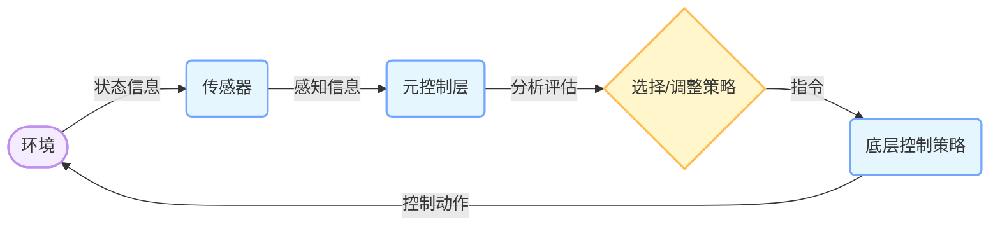

# 元控制策略在动态环境适应中的作用

> 关键词：元控制策略、动态环境适应、智能系统、决策机制、自适应能力

> 摘要：本文深入探讨了元控制策略在动态环境适应中的重要作用。首先介绍了研究的背景、目的、预期读者以及文档结构等信息。接着详细阐述了元控制策略和动态环境适应的核心概念及其联系，并通过文本示意图和Mermaid流程图进行直观展示。然后讲解了核心算法原理，给出Python源代码示例。对涉及的数学模型和公式进行了详细推导和举例说明。通过项目实战案例，展示了元控制策略在实际中的应用和代码实现。分析了元控制策略的实际应用场景，推荐了相关的学习资源、开发工具框架以及论文著作。最后总结了元控制策略的未来发展趋势与挑战，解答了常见问题并提供了扩展阅读和参考资料。

## 1. 背景介绍 
### 1.1 目的和范围
在当今复杂多变的世界中，许多系统需要在动态环境中运行，如机器人导航、智能交通系统、金融市场交易等。这些环境的特点是不断变化，包含不确定性和不可预测性。传统的控制策略往往难以适应这种动态变化，而元控制策略作为一种更高级的控制机制，旨在解决这些问题。本文的目的是全面深入地研究元控制策略在动态环境适应中的作用，探讨其原理、算法、应用场景等方面的内容。研究范围涵盖了元控制策略的基本概念、核心算法、数学模型，以及在不同领域的实际应用案例。

### 1.2 预期读者
本文预期读者包括计算机科学、控制工程、人工智能等领域的研究人员和学生，他们希望深入了解元控制策略及其在动态环境中的应用。同时，对于从事智能系统开发、机器人技术、金融科技等行业的工程师和技术人员也具有一定的参考价值，有助于他们在实际项目中应用元控制策略来提高系统的适应能力。

### 1.3 文档结构概述
本文将按照以下结构进行组织：首先介绍元控制策略和动态环境适应的核心概念及其联系，通过文本示意图和流程图进行直观展示；接着详细讲解核心算法原理，并给出Python源代码示例；然后阐述涉及的数学模型和公式，进行详细推导和举例说明；通过项目实战案例，展示元控制策略在实际中的应用和代码实现；分析元控制策略的实际应用场景；推荐相关的学习资源、开发工具框架以及论文著作；最后总结元控制策略的未来发展趋势与挑战，解答常见问题并提供扩展阅读和参考资料。

### 1.4 术语表
#### 1.4.1 核心术语定义
- **元控制策略**：是一种高级的控制机制，它能够根据环境的变化和系统的状态，动态地调整底层控制策略，以实现更好的系统性能和环境适应能力。
- **动态环境**：指的是环境的状态和参数随时间不断变化，具有不确定性和不可预测性的环境。
- **适应能力**：系统在动态环境中能够调整自身行为，以保持良好性能和实现目标的能力。

#### 1.4.2 相关概念解释
- **控制策略**：是指系统为了实现特定目标而采取的一系列控制动作和规则。
- **智能系统**：具备感知、学习、决策和行动能力的系统，能够在一定程度上自主地适应环境变化。

#### 1.4.3 缩略词列表
- **RL**：Reinforcement Learning，强化学习
- **MDP**：Markov Decision Process，马尔可夫决策过程

## 2. 核心概念与联系 

### 核心概念原理
元控制策略的核心思想是在传统的控制策略之上增加一层元控制层。元控制层负责监控环境的变化和系统的状态，根据这些信息动态地选择或调整底层的控制策略。例如，在一个机器人导航系统中，底层的控制策略可能包括不同的路径规划算法，而元控制层可以根据环境中的障碍物分布、目标位置的变化等因素，选择最合适的路径规划算法。

动态环境适应则是指系统能够在不断变化的环境中调整自身的行为，以保持良好的性能和实现目标。这需要系统具备感知环境变化的能力、对变化进行分析和决策的能力，以及根据决策调整自身行为的能力。

### 架构的文本示意图
元控制策略与动态环境适应的架构可以描述如下：

环境与系统之间存在交互，系统通过传感器感知环境的状态信息。这些信息被传递到元控制层，元控制层对环境状态进行分析和评估。根据评估结果，元控制层选择或调整底层的控制策略。底层控制策略根据元控制层的指令，生成具体的控制动作，并将这些动作作用于环境。环境根据系统的动作发生变化，产生新的状态信息，从而形成一个闭环的反馈系统。

### Mermaid流程图


这个流程图展示了元控制策略在动态环境适应中的工作流程。环境的状态信息通过传感器被系统感知，元控制层对这些信息进行分析和评估，然后做出选择或调整底层控制策略的决策。底层控制策略根据决策生成控制动作，作用于环境，形成一个闭环的反馈过程。

## 3. 核心算法原理 & 具体操作步骤 

### 核心算法原理
元控制策略的核心算法通常基于强化学习（RL）和马尔可夫决策过程（MDP）。强化学习是一种通过智能体与环境进行交互，不断尝试不同的动作，以最大化累积奖励的学习方法。马尔可夫决策过程是一种用于描述动态系统决策问题的数学模型，它假设系统的下一状态只与当前状态和当前动作有关。

在元控制策略中，智能体可以看作是元控制层，环境则是动态环境。智能体通过与环境的交互，不断学习不同环境状态下的最优控制策略。具体来说，智能体在每个时间步根据当前的环境状态选择一个动作（即选择或调整底层控制策略），环境根据智能体的动作产生一个奖励和一个新的状态。智能体的目标是通过不断地尝试不同的动作，找到能够最大化累积奖励的策略。

### 具体操作步骤
1. **定义状态空间**：确定环境的状态表示，包括环境的各种特征和系统的状态信息。例如，在机器人导航系统中，状态空间可以包括机器人的位置、速度、障碍物的分布等。
2. **定义动作空间**：确定智能体可以采取的动作，即元控制层可以选择或调整的底层控制策略。例如，在机器人导航系统中，动作空间可以包括不同的路径规划算法。
3. **定义奖励函数**：奖励函数用于衡量智能体采取某个动作后环境给予的奖励。奖励函数的设计应该与系统的目标相关，例如，在机器人导航系统中，奖励函数可以根据机器人到达目标的距离和时间来设计。
4. **初始化策略**：可以使用随机策略作为初始策略，智能体在开始时随机选择动作。
5. **与环境交互**：智能体在每个时间步根据当前的状态选择一个动作，环境根据智能体的动作产生一个奖励和一个新的状态。
6. **更新策略**：根据智能体与环境的交互结果，使用强化学习算法（如Q-learning、Policy Gradient等）更新策略，使得智能体能够逐渐学习到最优策略。
7. **重复步骤5和6**：不断重复与环境的交互和策略更新过程，直到策略收敛或达到预设的训练次数。

### Python源代码示例
以下是一个简单的使用Q-learning算法实现元控制策略的Python代码示例：

```python
import numpy as np

# 定义状态空间和动作空间
state_space = 10
action_space = 3

# 初始化Q表
Q_table = np.zeros((state_space, action_space))

# 定义超参数
alpha = 0.1  # 学习率
gamma = 0.9  # 折扣因子
epsilon = 0.1  # 探索率
episodes = 1000

# 定义奖励函数
def reward_function(state, action):
    # 这里简单假设奖励是随机的，实际应用中需要根据具体问题设计
    return np.random.randint(1, 10)

# Q-learning算法
for episode in range(episodes):
    state = np.random.randint(0, state_space)  # 随机初始化状态
    done = False
    while not done:
        if np.random.uniform(0, 1) < epsilon:
            action = np.random.randint(0, action_space)  # 探索
        else:
            action = np.argmax(Q_table[state, :])  # 利用

        reward = reward_function(state, action)
        next_state = np.random.randint(0, state_space)  # 随机生成下一个状态

        # 更新Q表
        Q_table[state, action] = (1 - alpha) * Q_table[state, action] + alpha * (reward + gamma * np.max(Q_table[next_state, :]))

        state = next_state

        # 简单假设达到某个条件就结束当前episode
        if np.random.uniform(0, 1) < 0.1:
            done = True

print("最终的Q表：")
print(Q_table)
```

在这个代码示例中，我们使用Q-learning算法实现了一个简单的元控制策略。首先定义了状态空间和动作空间，并初始化了Q表。然后设置了超参数，包括学习率、折扣因子和探索率。在每个episode中，智能体根据当前状态选择一个动作，与环境交互得到奖励和下一个状态，然后更新Q表。重复这个过程，直到达到预设的训练次数。最后输出最终的Q表。

## 4. 数学模型和公式 & 详细讲解 & 举例说明 

### 马尔可夫决策过程（MDP）
马尔可夫决策过程可以用一个五元组 $(S, A, P, R, \gamma)$ 来表示，其中：
- $S$ 是状态空间，表示环境的所有可能状态。
- $A$ 是动作空间，表示智能体可以采取的所有可能动作。
- $P(s'|s, a)$ 是状态转移概率，表示在状态 $s$ 下采取动作 $a$ 后转移到状态 $s'$ 的概率。
- $R(s, a)$ 是奖励函数，表示在状态 $s$ 下采取动作 $a$ 后获得的即时奖励。
- $\gamma$ 是折扣因子，用于衡量未来奖励的重要性，取值范围为 $[0, 1]$。

### 价值函数
在MDP中，有两种重要的价值函数：状态价值函数 $V(s)$ 和动作价值函数 $Q(s, a)$。

状态价值函数 $V(s)$ 表示从状态 $s$ 开始，遵循某个策略 $\pi$ 所能获得的期望累积奖励：
$$V^{\pi}(s) = \mathbb{E}_{\pi}\left[\sum_{t=0}^{\infty}\gamma^{t}R(S_t, A_t) \mid S_0 = s\right]$$

动作价值函数 $Q(s, a)$ 表示在状态 $s$ 下采取动作 $a$，然后遵循某个策略 $\pi$ 所能获得的期望累积奖励：
$$Q^{\pi}(s, a) = \mathbb{E}_{\pi}\left[\sum_{t=0}^{\infty}\gamma^{t}R(S_t, A_t) \mid S_0 = s, A_0 = a\right]$$

### 贝尔曼方程
贝尔曼方程是MDP中的核心方程，它描述了价值函数的递归关系。

状态价值函数的贝尔曼方程为：
$$V^{\pi}(s) = \sum_{a \in A}\pi(a|s)\left[R(s, a) + \gamma\sum_{s' \in S}P(s'|s, a)V^{\pi}(s')\right]$$

动作价值函数的贝尔曼方程为：
$$Q^{\pi}(s, a) = R(s, a) + \gamma\sum_{s' \in S}P(s'|s, a)\sum_{a' \in A}\pi(a'|s')Q^{\pi}(s', a')$$

### 最优价值函数和最优策略
最优状态价值函数 $V^*(s)$ 是所有策略下状态价值函数的最大值：
$$V^*(s) = \max_{\pi}V^{\pi}(s)$$

最优动作价值函数 $Q^*(s, a)$ 是所有策略下动作价值函数的最大值：
$$Q^*(s, a) = \max_{\pi}Q^{\pi}(s, a)$$

最优策略 $\pi^*$ 是能够使状态价值函数或动作价值函数达到最优的策略。

### 举例说明
假设我们有一个简单的MDP，状态空间 $S = \{s_1, s_2\}$，动作空间 $A = \{a_1, a_2\}$，状态转移概率和奖励函数如下：

$P(s_1|s_1, a_1) = 0.8$，$P(s_2|s_1, a_1) = 0.2$，$R(s_1, a_1) = 1$

$P(s_1|s_1, a_2) = 0.3$，$P(s_2|s_1, a_2) = 0.7$，$R(s_1, a_2) = 2$

$P(s_1|s_2, a_1) = 0.4$，$P(s_2|s_2, a_1) = 0.6$，$R(s_2, a_1) = 3$

$P(s_1|s_2, a_2) = 0.1$，$P(s_2|s_2, a_2) = 0.9$，$R(s_2, a_2) = 4$

折扣因子 $\gamma = 0.9$。

我们可以使用贝尔曼方程来计算状态价值函数和动作价值函数。假设初始时 $V(s_1) = V(s_2) = 0$，我们可以迭代更新：

对于状态 $s_1$：
- 当采取动作 $a_1$ 时：
  - $Q(s_1, a_1) = R(s_1, a_1) + \gamma\left[P(s_1|s_1, a_1)V(s_1) + P(s_2|s_1, a_1)V(s_2)\right] = 1 + 0.9\times(0.8\times0 + 0.2\times0) = 1$
- 当采取动作 $a_2$ 时：
  - $Q(s_1, a_2) = R(s_1, a_2) + \gamma\left[P(s_1|s_1, a_2)V(s_1) + P(s_2|s_1, a_2)V(s_2)\right] = 2 + 0.9\times(0.3\times0 + 0.7\times0) = 2$

$V(s_1) = \max\{Q(s_1, a_1), Q(s_1, a_2)\} = 2$

对于状态 $s_2$：
- 当采取动作 $a_1$ 时：
  - $Q(s_2, a_1) = R(s_2, a_1) + \gamma\left[P(s_1|s_2, a_1)V(s_1) + P(s_2|s_2, a_1)V(s_2)\right] = 3 + 0.9\times(0.4\times2 + 0.6\times0) = 3 + 0.72 = 3.72$
- 当采取动作 $a_2$ 时：
  - $Q(s_2, a_2) = R(s_2, a_2) + \gamma\left[P(s_1|s_2, a_2)V(s_1) + P(s_2|s_2, a_2)V(s_2)\right] = 4 + 0.9\times(0.1\times2 + 0.9\times0) = 4 + 0.18 = 4.18$

$V(s_2) = \max\{Q(s_2, a_1), Q(s_2, a_2)\} = 4.18$

通过不断迭代更新，我们可以得到更精确的状态价值函数和动作价值函数，从而找到最优策略。

## 5. 项目实战：代码实际案例和详细解释说明 

### 5.1  开发环境搭建
为了实现元控制策略的项目实战，我们需要搭建以下开发环境：

- **操作系统**：可以选择Windows、Linux或Mac OS。
- **编程语言**：Python 3.x，因为Python具有丰富的科学计算库和机器学习库，适合用于实现元控制策略。
- **开发工具**：可以使用Jupyter Notebook或PyCharm等集成开发环境（IDE）。
- **相关库**：需要安装NumPy、Pandas、Matplotlib等科学计算库，以及OpenAI Gym等强化学习库。

可以使用以下命令安装所需的库：
```bash
pip install numpy pandas matplotlib gym
```

### 5.2  源代码详细实现和代码解读
我们以OpenAI Gym中的CartPole环境为例，实现一个基于元控制策略的智能体。CartPole环境是一个经典的强化学习环境，智能体的目标是通过控制小车的左右移动，使杆子保持平衡。

```python
import gym
import numpy as np

# 创建CartPole环境
env = gym.make('CartPole-v1')

# 定义超参数
alpha = 0.1  # 学习率
gamma = 0.9  # 折扣因子
epsilon = 0.1  # 探索率
episodes = 1000

# 定义状态离散化函数
def discretize_state(state):
    # 将连续的状态空间离散化
    bins = [np.linspace(-4.8, 4.8, 10),
            np.linspace(-4, 4, 10),
            np.linspace(-0.418, 0.418, 10),
            np.linspace(-4, 4, 10)]
    discretized = []
    for i in range(len(state)):
        discretized.append(np.digitize(state[i], bins[i]) - 1)
    return tuple(discretized)

# 初始化Q表
state_space = (10, 10, 10, 10)
action_space = env.action_space.n
Q_table = np.zeros(state_space + (action_space,))

# Q-learning算法
for episode in range(episodes):
    state = env.reset()
    state = discretize_state(state)
    done = False
    total_reward = 0
    while not done:
        if np.random.uniform(0, 1) < epsilon:
            action = env.action_space.sample()  # 探索
        else:
            action = np.argmax(Q_table[state])  # 利用

        next_state, reward, done, _ = env.step(action)
        next_state = discretize_state(next_state)

        # 更新Q表
        Q_table[state][action] = (1 - alpha) * Q_table[state][action] + alpha * (reward + gamma * np.max(Q_table[next_state]))

        state = next_state
        total_reward += reward

    if episode % 100 == 0:
        print(f"Episode {episode}: Total reward = {total_reward}")

env.close()
```

### 代码解读与分析
1. **环境创建**：使用 `gym.make('CartPole-v1')` 创建CartPole环境。
2. **超参数定义**：定义学习率 `alpha`、折扣因子 `gamma` 和探索率 `epsilon`，以及训练的回合数 `episodes`。
3. **状态离散化**：由于CartPole环境的状态空间是连续的，而Q-learning算法通常适用于离散状态空间，因此需要将连续的状态空间离散化。`discretize_state` 函数将连续的状态转换为离散的状态。
4. **Q表初始化**：根据离散化后的状态空间和动作空间初始化Q表。
5. **Q-learning算法实现**：在每个回合中，智能体根据当前状态选择一个动作，与环境交互得到奖励和下一个状态，然后更新Q表。重复这个过程，直到回合结束。
6. **奖励记录**：在每个回合结束后，记录总奖励，并每隔100个回合打印一次总奖励，以便观察训练过程。

通过这个项目实战，我们可以看到元控制策略（这里使用Q-learning算法）在动态环境（CartPole环境）中的应用。智能体通过不断地与环境交互和学习，逐渐提高了在环境中的表现，即能够使杆子保持更长时间的平衡。

## 6. 实际应用场景 
元控制策略在许多实际应用场景中都具有重要的作用，以下是一些常见的应用场景：

### 机器人导航
在机器人导航中，环境通常是动态的，包含障碍物的移动、地形的变化等。元控制策略可以根据环境的变化，动态地选择或调整路径规划算法。例如，当遇到新的障碍物时，元控制层可以选择更适合避障的路径规划算法；当环境较为空旷时，选择更高效的全局路径规划算法。这样可以提高机器人的导航效率和安全性。

### 智能交通系统
智能交通系统需要应对交通流量的变化、交通事故等动态情况。元控制策略可以用于交通信号控制、车辆调度等方面。例如，根据实时的交通流量数据，动态地调整交通信号灯的时长，以优化交通流畅性；根据车辆的位置和目的地，动态地调度车辆的行驶路线，减少拥堵。

### 金融市场交易
金融市场是一个高度动态和不确定的环境，价格波动频繁。元控制策略可以用于投资决策和风险管理。例如，根据市场的行情变化，动态地调整投资组合的比例；当市场风险增加时，采取更保守的投资策略。

### 工业自动化
在工业自动化生产中，生产环境可能会受到原材料质量、设备故障等因素的影响。元控制策略可以用于生产过程的优化和控制。例如，根据原材料的质量变化，动态地调整生产参数；当设备出现故障时，及时调整生产计划，以保证生产的连续性和质量。

## 7. 工具和资源推荐
### 7.1 学习资源推荐
#### 7.1.1 书籍推荐
- 《Reinforcement Learning: An Introduction》（《强化学习：原理与Python实现》）：这是一本强化学习领域的经典教材，详细介绍了强化学习的基本概念、算法和应用。
- 《Artificial Intelligence: A Modern Approach》（《人工智能：一种现代的方法》）：涵盖了人工智能的各个方面，包括强化学习、元控制策略等内容，是一本全面的人工智能教材。

#### 7.1.2 在线课程
- Coursera上的“Reinforcement Learning Specialization”：由顶尖大学的教授授课，系统地介绍了强化学习的理论和实践。
- edX上的“Artificial Intelligence Nanodegree”：包含了人工智能的多个领域，包括强化学习和元控制策略的相关内容。

#### 7.1.3 技术博客和网站
- OpenAI官方博客：提供了强化学习和人工智能领域的最新研究成果和应用案例。
- Medium上的“Towards Data Science”：有许多关于强化学习和元控制策略的技术文章和教程。

### 7.2 开发工具框架推荐
#### 7.2.1 IDE和编辑器
- PyCharm：是一款专业的Python集成开发环境，具有代码编辑、调试、版本控制等功能，适合用于开发强化学习和元控制策略的项目。
- Jupyter Notebook：是一个交互式的开发环境，支持Python代码的编写、运行和可视化，非常适合用于实验和研究。

#### 7.2.2 调试和性能分析工具
- TensorBoard：是TensorFlow提供的可视化工具，可以用于监控训练过程中的指标变化，如损失函数、奖励等。
- Py-Spy：是一个Python性能分析工具，可以帮助分析代码的性能瓶颈。

#### 7.2.3 相关框架和库
- OpenAI Gym：是一个用于开发和比较强化学习算法的工具包，提供了许多经典的强化学习环境。
- Stable Baselines3：是一个基于PyTorch的强化学习库，提供了多种强化学习算法的实现，方便用户快速开发和测试元控制策略。

### 7.3 相关论文著作推荐
#### 7.3.1 经典论文
- Richard S. Sutton和Andrew G. Barto的“Reinforcement Learning: An Introduction”：这篇论文奠定了强化学习的理论基础，对元控制策略的研究也具有重要的指导意义。
- Leslie Pack Kaelbling、Michael L. Littman和Andrew W. Moore的“Reinforcement Learning: A Survey”：对强化学习的发展历程、算法和应用进行了全面的综述。

#### 7.3.2 最新研究成果
- 在顶级学术会议如NeurIPS、ICML、AAAI等上发表的关于元控制策略和动态环境适应的论文，代表了该领域的最新研究成果。

#### 7.3.3 应用案例分析
- 一些行业报告和学术论文中会分析元控制策略在实际应用场景中的案例，如机器人导航、智能交通系统等，这些案例可以帮助我们更好地理解元控制策略的实际应用。

## 8. 总结：未来发展趋势与挑战
### 未来发展趋势
- **与深度学习的融合**：随着深度学习的发展，将元控制策略与深度学习相结合是一个重要的发展趋势。深度学习可以用于处理复杂的感知任务，如图像识别、语音识别等，而元控制策略可以根据深度学习的输出进行决策和控制，从而提高系统在动态环境中的适应能力。
- **多智能体系统**：在许多实际应用场景中，需要多个智能体协同工作，如机器人团队协作、智能交通系统中的多车辆协调等。元控制策略可以用于多智能体系统的协调和决策，实现智能体之间的有效协作。
- **应用领域的拓展**：元控制策略将在更多的领域得到应用，如医疗保健、农业、能源管理等。例如，在医疗保健领域，元控制策略可以用于个性化医疗方案的制定和医疗资源的分配。

### 挑战
- **环境建模的复杂性**：动态环境往往具有高度的复杂性和不确定性，准确地建模环境是一个挑战。环境的变化可能是难以预测的，而且不同的环境因素之间可能存在复杂的相互作用。
- **计算资源的需求**：元控制策略通常需要大量的计算资源来进行学习和决策。特别是在与深度学习相结合的情况下，计算资源的需求会进一步增加。如何在有限的计算资源下实现高效的元控制策略是一个需要解决的问题。
- **可解释性问题**：许多元控制策略基于强化学习和深度学习算法，这些算法往往是黑盒模型，缺乏可解释性。在一些对安全性和可靠性要求较高的应用场景中，如医疗、交通等，需要元控制策略具有可解释性，以便用户理解和信任系统的决策。

## 9. 附录：常见问题与解答
### 问题1：元控制策略与传统控制策略有什么区别？
传统控制策略通常是基于固定的规则和模型，在设计时就确定了控制动作。而元控制策略能够根据环境的变化和系统的状态，动态地调整底层的控制策略，具有更强的适应能力和灵活性。

### 问题2：元控制策略一定能提高系统的性能吗？
不一定。元控制策略的效果取决于多个因素，如环境的复杂性、算法的选择、超参数的设置等。在一些简单的环境中，传统控制策略可能已经能够满足需求，使用元控制策略可能会增加系统的复杂性和计算成本。

### 问题3：如何选择合适的强化学习算法来实现元控制策略？
选择合适的强化学习算法需要考虑多个因素，如环境的特点（离散或连续状态空间、离散或连续动作空间等）、算法的复杂度、收敛速度等。一般来说，可以先尝试一些经典的算法，如Q-learning、Policy Gradient等，然后根据实验结果进行调整和优化。

### 问题4：元控制策略在实际应用中面临的最大挑战是什么？
元控制策略在实际应用中面临的最大挑战之一是环境建模的复杂性。准确地建模动态环境是非常困难的，因为环境的变化可能是难以预测的，而且不同的环境因素之间可能存在复杂的相互作用。另一个挑战是计算资源的需求，元控制策略通常需要大量的计算资源来进行学习和决策。

## 10. 扩展阅读 & 参考资料
### 扩展阅读
- 关于强化学习和元控制策略的更深入的研究论文和技术报告。
- 相关领域的最新研究成果和应用案例，如机器人技术、智能交通系统等。

### 参考资料
- Richard S. Sutton和Andrew G. Barto的《Reinforcement Learning: An Introduction》。
- OpenAI官方文档和博客文章。
- 相关学术会议（如NeurIPS、ICML、AAAI等）上的论文。

作者：AI天才研究院/AI Genius Institute & 禅与计算机程序设计艺术 /Zen And The Art of Computer Programming