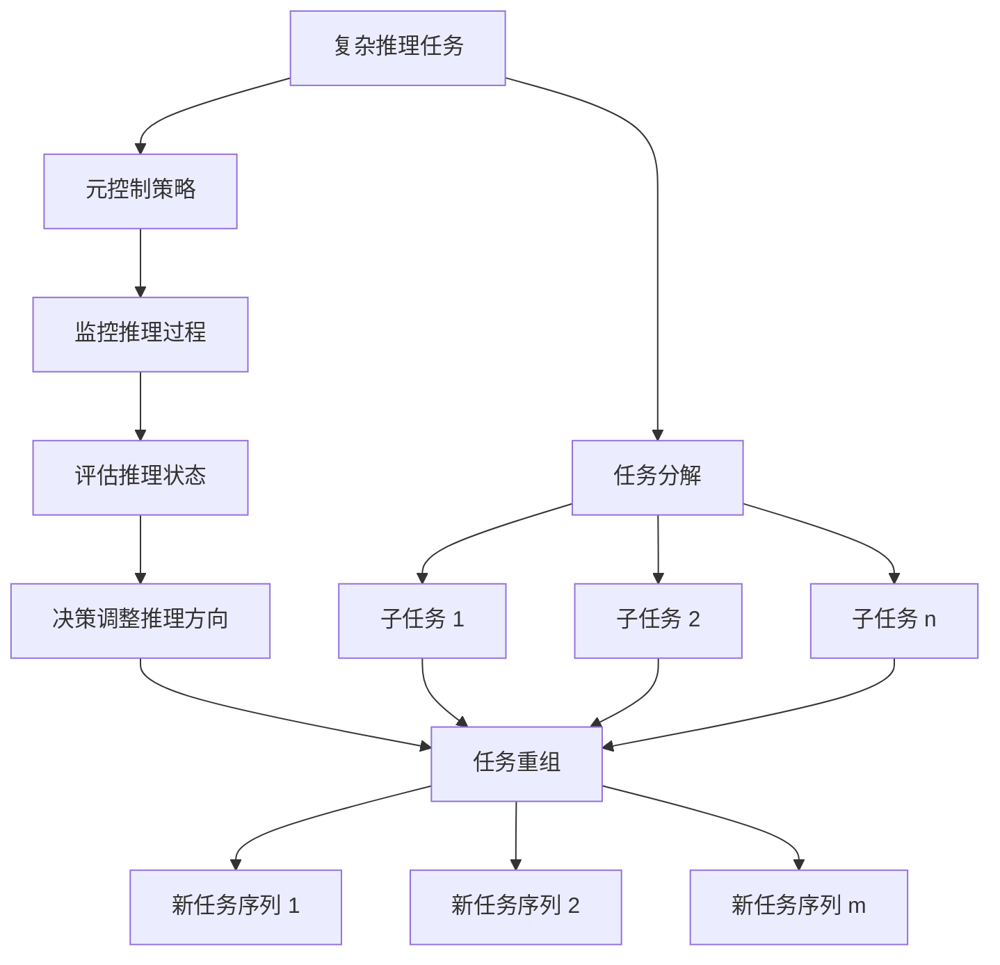

# 元控制策略在复杂推理任务分解与重组中的应用

> 关键词：元控制策略、复杂推理任务、任务分解、任务重组、推理效率

> 摘要：本文深入探讨了元控制策略在复杂推理任务分解与重组中的应用。首先介绍了研究的背景、目的、预期读者、文档结构和相关术语。接着阐述了核心概念及其联系，包括元控制策略、任务分解和重组的原理，并通过文本示意图和 Mermaid 流程图进行直观展示。详细讲解了核心算法原理，使用 Python 源代码进行了具体说明。同时给出了相关的数学模型和公式，并举例进行解释。通过项目实战，展示了代码的实际案例、开发环境搭建、源代码实现和解读。分析了该技术在不同领域的实际应用场景，推荐了学习资源、开发工具框架和相关论文著作。最后总结了未来发展趋势与挑战，并提供了常见问题解答和扩展阅读参考资料。

## 1. 背景介绍 
### 1.1 目的和范围
在当今复杂的信息时代，许多领域都面临着复杂推理任务，如科学研究、工程设计、智能决策等。这些任务往往具有高度的复杂性和不确定性，传统的推理方法难以有效处理。元控制策略作为一种高级的控制机制，可以对推理过程进行动态管理和优化。本研究的目的是深入探讨元控制策略在复杂推理任务分解与重组中的应用，通过合理地将复杂任务分解为子任务，并根据实际情况进行重组，提高推理的效率和准确性。研究范围涵盖了元控制策略的原理、算法实现、实际应用场景以及相关工具和资源的推荐。

### 1.2 预期读者
本文预期读者包括人工智能领域的研究人员、程序员、软件架构师、CTO 等技术专业人士，以及对复杂推理任务和元控制策略感兴趣的学生和爱好者。对于希望深入了解如何优化复杂推理过程、提高推理效率的读者，本文将提供有价值的参考。

### 1.3 文档结构概述
本文共分为十个部分。第一部分是背景介绍，阐述研究的目的、范围、预期读者和文档结构。第二部分介绍核心概念与联系，包括元控制策略、任务分解和重组的原理，并通过示意图和流程图进行展示。第三部分讲解核心算法原理，并使用 Python 源代码进行详细说明。第四部分给出数学模型和公式，并举例进行解释。第五部分通过项目实战，展示代码的实际案例、开发环境搭建、源代码实现和解读。第六部分分析该技术在不同领域的实际应用场景。第七部分推荐学习资源、开发工具框架和相关论文著作。第八部分总结未来发展趋势与挑战。第九部分提供常见问题解答。第十部分给出扩展阅读和参考资料。

### 1.4 术语表
#### 1.4.1 核心术语定义
- **元控制策略**：一种高级的控制机制，用于对推理过程进行动态管理和优化，根据任务的状态和环境信息，调整推理的方向和步骤。
- **复杂推理任务**：具有高度复杂性和不确定性的推理任务，通常需要多个步骤和多种知识的综合运用。
- **任务分解**：将复杂推理任务拆分为多个相对简单的子任务的过程，以便于分别处理和解决。
- **任务重组**：根据推理的需要，将分解后的子任务重新组合成新的任务序列，以实现更高效的推理。

#### 1.4.2 相关概念解释
- **推理效率**：指在完成推理任务时，所消耗的时间、资源等成本与推理结果的质量之间的关系。提高推理效率意味着在保证推理结果准确性的前提下，尽可能减少时间和资源的消耗。
- **动态管理**：根据任务的实时状态和环境变化，对推理过程进行实时调整和优化，以适应不同的情况。

#### 1.4.3 缩略词列表
- **AI**：Artificial Intelligence，人工智能
- **ML**：Machine Learning，机器学习

## 2. 核心概念与联系 

### 核心概念原理
#### 元控制策略
元控制策略是一种基于元认知的控制机制，它可以对推理过程进行监控和调节。元控制策略通过收集推理过程中的各种信息，如任务的状态、推理的进度、资源的使用情况等，对推理过程进行评估和决策。根据评估结果，元控制策略可以调整推理的方向、选择合适的推理方法、分配资源等，以提高推理的效率和准确性。

#### 任务分解
任务分解是将复杂推理任务拆分为多个相对简单的子任务的过程。通过任务分解，可以将一个复杂的问题转化为多个易于处理的子问题，降低问题的难度。任务分解的原则是根据任务的结构和性质，将其分解为具有相对独立性和完整性的子任务。每个子任务都可以单独进行处理和解决，从而提高推理的效率。

#### 任务重组
任务重组是根据推理的需要，将分解后的子任务重新组合成新的任务序列的过程。任务重组的目的是优化推理过程，提高推理的效率和准确性。在任务重组过程中，需要考虑子任务之间的依赖关系、资源的分配情况、推理的目标等因素，以确定最优的任务序列。

### 架构的文本示意图
```plaintext
复杂推理任务
|
|-- 元控制策略
|   |-- 监控推理过程
|   |-- 评估推理状态
|   |-- 决策调整推理方向
|
|-- 任务分解
|   |-- 拆分为子任务 1
|   |-- 拆分为子任务 2
|   |--...
|   |-- 拆分为子任务 n
|
|-- 任务重组
|   |-- 组合子任务为新序列 1
|   |-- 组合子任务为新序列 2
|   |--...
|   |-- 组合子任务为新序列 m
```

### Mermaid 流程图


## 3. 核心算法原理 & 具体操作步骤 

### 核心算法原理
元控制策略在复杂推理任务分解与重组中的核心算法主要包括任务分解算法、任务评估算法和任务重组算法。

#### 任务分解算法
任务分解算法的目的是将复杂推理任务拆分为多个相对简单的子任务。一种常用的任务分解算法是基于图论的方法，将任务表示为一个有向图，其中节点表示任务的子步骤，边表示子步骤之间的依赖关系。通过对图进行分析和划分，可以将任务拆分为多个子图，每个子图对应一个子任务。

#### 任务评估算法
任务评估算法用于对分解后的子任务进行评估，以确定每个子任务的重要性和难度。常用的评估指标包括任务的复杂度、执行时间、资源需求等。根据评估结果，可以对任务进行排序和优先级分配。

#### 任务重组算法
任务重组算法根据任务评估的结果和推理的目标，将分解后的子任务重新组合成新的任务序列。一种常用的任务重组算法是基于贪心算法的方法，每次选择当前最优的子任务进行组合，直到形成一个完整的任务序列。

### 具体操作步骤
#### 步骤 1：任务表示
将复杂推理任务表示为一个有向图 $G=(V, E)$，其中 $V$ 是节点集合，表示任务的子步骤，$E$ 是边集合，表示子步骤之间的依赖关系。

#### 步骤 2：任务分解
使用任务分解算法对图 $G$ 进行划分，得到多个子图 $G_1, G_2,..., G_n$，每个子图对应一个子任务。

#### 步骤 3：任务评估
对每个子任务进行评估，计算其复杂度、执行时间、资源需求等指标。根据评估结果，对任务进行排序和优先级分配。

#### 步骤 4：任务重组
使用任务重组算法，根据任务评估的结果和推理的目标，将子任务重新组合成新的任务序列。

#### 步骤 5：推理执行
按照重组后的任务序列进行推理执行，同时使用元控制策略对推理过程进行监控和调节。

### Python 源代码实现
```python
import networkx as nx

# 步骤 1：任务表示
def create_task_graph():
    G = nx.DiGraph()
    # 添加节点
    G.add_nodes_from([1, 2, 3, 4, 5])
    # 添加边
    G.add_edges_from([(1, 2), (2, 3), (3, 4), (4, 5)])
    return G

# 步骤 2：任务分解
def task_decomposition(G):
    # 简单的分解方法，将图拆分为单个节点的子图
    sub_tasks = []
    for node in G.nodes():
        sub_graph = nx.DiGraph()
        sub_graph.add_node(node)
        sub_tasks.append(sub_graph)
    return sub_tasks

# 步骤 3：任务评估
def task_evaluation(sub_tasks):
    evaluations = []
    for sub_task in sub_tasks:
        # 简单的评估方法，以节点数量作为复杂度
        complexity = len(sub_task.nodes())
        evaluations.append(complexity)
    return evaluations

# 步骤 4：任务重组
def task_recombination(sub_tasks, evaluations):
    sorted_indices = sorted(range(len(evaluations)), key=lambda k: evaluations[k])
    new_task_sequence = [sub_tasks[i] for i in sorted_indices]
    return new_task_sequence

# 步骤 5：推理执行
def inference_execution(new_task_sequence):
    for sub_task in new_task_sequence:
        print(f"Executing sub-task: {sub_task.nodes()}")

# 主函数
if __name__ == "__main__":
    # 创建任务图
    task_graph = create_task_graph()
    # 任务分解
    sub_tasks = task_decomposition(task_graph)
    # 任务评估
    evaluations = task_evaluation(sub_tasks)
    # 任务重组
    new_task_sequence = task_recombination(sub_tasks, evaluations)
    # 推理执行
    inference_execution(new_task_sequence)
```

## 4. 数学模型和公式 & 详细讲解 & 举例说明 

### 数学模型
设复杂推理任务 $T$ 可以表示为一个有向图 $G=(V, E)$，其中 $V$ 是节点集合，$E$ 是边集合。任务分解后得到 $n$ 个子任务 $T_1, T_2,..., T_n$，每个子任务可以表示为一个子图 $G_i=(V_i, E_i)$，其中 $V_i \subseteq V$，$E_i \subseteq E$。

### 任务评估公式
设子任务 $T_i$ 的复杂度为 $C_i$，执行时间为 $t_i$，资源需求为 $r_i$。可以定义一个综合评估指标 $S_i$ 来评估子任务的重要性和难度：

$$S_i = \alpha C_i + \beta t_i + \gamma r_i$$

其中 $\alpha$，$\beta$，$\gamma$ 是权重系数，满足 $\alpha + \beta + \gamma = 1$。

### 详细讲解
- **复杂度 $C_i$**：表示子任务的复杂程度，可以通过子图的节点数量、边数量等指标来衡量。
- **执行时间 $t_i$**：表示执行子任务所需的时间，可以通过实验或经验估计得到。
- **资源需求 $r_i$**：表示执行子任务所需的资源，如内存、计算能力等。

### 举例说明
假设有一个复杂推理任务 $T$，分解后得到三个子任务 $T_1$，$T_2$，$T_3$。已知：

- $C_1 = 3$，$t_1 = 2$，$r_1 = 1$
- $C_2 = 2$，$t_2 = 3$，$r_2 = 2$
- $C_3 = 4$，$t_3 = 1$，$r_3 = 3$

设 $\alpha = 0.5$，$\beta = 0.3$，$\gamma = 0.2$，则可以计算每个子任务的综合评估指标：

$$S_1 = 0.5 \times 3 + 0.3 \times 2 + 0.2 \times 1 = 2.3$$

$$S_2 = 0.5 \times 2 + 0.3 \times 3 + 0.2 \times 2 = 2.3$$

$$S_3 = 0.5 \times 4 + 0.3 \times 1 + 0.2 \times 3 = 2.9$$

根据评估结果，可以对任务进行排序和优先级分配，优先执行综合评估指标较高的子任务。

## 5. 项目实战：代码实际案例和详细解释说明 

### 5.1  开发环境搭建
#### 安装 Python
首先需要安装 Python 环境，建议使用 Python 3.7 及以上版本。可以从 Python 官方网站（https://www.python.org/downloads/）下载并安装。

#### 安装必要的库
本项目需要使用 `networkx` 库来处理图数据。可以使用以下命令进行安装：
```sh
pip install networkx
```

### 5.2  源代码详细实现和代码解读
```python
import networkx as nx

# 步骤 1：任务表示
def create_task_graph():
    G = nx.DiGraph()
    # 添加节点
    G.add_nodes_from([1, 2, 3, 4, 5])
    # 添加边
    G.add_edges_from([(1, 2), (2, 3), (3, 4), (4, 5)])
    return G

# 步骤 2：任务分解
def task_decomposition(G):
    # 简单的分解方法，将图拆分为单个节点的子图
    sub_tasks = []
    for node in G.nodes():
        sub_graph = nx.DiGraph()
        sub_graph.add_node(node)
        sub_tasks.append(sub_graph)
    return sub_tasks

# 步骤 3：任务评估
def task_evaluation(sub_tasks):
    evaluations = []
    for sub_task in sub_tasks:
        # 简单的评估方法，以节点数量作为复杂度
        complexity = len(sub_task.nodes())
        evaluations.append(complexity)
    return evaluations

# 步骤 4：任务重组
def task_recombination(sub_tasks, evaluations):
    sorted_indices = sorted(range(len(evaluations)), key=lambda k: evaluations[k])
    new_task_sequence = [sub_tasks[i] for i in sorted_indices]
    return new_task_sequence

# 步骤 5：推理执行
def inference_execution(new_task_sequence):
    for sub_task in new_task_sequence:
        print(f"Executing sub-task: {sub_task.nodes()}")

# 主函数
if __name__ == "__main__":
    # 创建任务图
    task_graph = create_task_graph()
    # 任务分解
    sub_tasks = task_decomposition(task_graph)
    # 任务评估
    evaluations = task_evaluation(sub_tasks)
    # 任务重组
    new_task_sequence = task_recombination(sub_tasks, evaluations)
    # 推理执行
    inference_execution(new_task_sequence)
```

### 代码解读与分析
#### `create_task_graph` 函数
该函数用于创建一个有向图来表示复杂推理任务。通过 `nx.DiGraph()` 创建一个空的有向图，然后使用 `add_nodes_from` 方法添加节点，使用 `add_edges_from` 方法添加边。

#### `task_decomposition` 函数
该函数用于将任务图分解为多个子任务。这里采用了简单的分解方法，将图拆分为单个节点的子图。遍历任务图的节点，为每个节点创建一个新的子图，并将其添加到子任务列表中。

#### `task_evaluation` 函数
该函数用于对分解后的子任务进行评估。这里采用了简单的评估方法，以子图的节点数量作为复杂度。遍历子任务列表，计算每个子任务的复杂度，并将其添加到评估结果列表中。

#### `task_recombination` 函数
该函数用于将分解后的子任务重新组合成新的任务序列。根据任务评估的结果，对任务进行排序，然后按照排序后的顺序将子任务组合成新的任务序列。

#### `inference_execution` 函数
该函数用于按照重组后的任务序列进行推理执行。遍历新的任务序列，打印出每个子任务的节点信息。

#### 主函数
主函数依次调用上述函数，完成任务表示、任务分解、任务评估、任务重组和推理执行的整个过程。

## 6. 实际应用场景 
### 科学研究
在科学研究中，经常需要进行复杂的推理和分析，如数据分析、模型构建、理论推导等。元控制策略可以帮助研究人员将复杂的研究任务分解为多个子任务，如数据预处理、特征提取、模型训练等。通过对每个子任务进行评估和重组，可以优化研究过程，提高研究效率和准确性。

### 工程设计
在工程设计中，如建筑设计、机械设计、电路设计等，需要考虑多个因素和约束条件。元控制策略可以将设计任务分解为多个子任务，如结构设计、功能设计、外观设计等。通过对每个子任务进行评估和重组，可以确保设计方案的合理性和可行性。

### 智能决策
在智能决策系统中，如金融决策、医疗决策、交通决策等，需要处理大量的信息和不确定性。元控制策略可以将决策任务分解为多个子任务，如信息收集、数据分析、模型预测等。通过对每个子任务进行评估和重组，可以提高决策的准确性和效率。

### 自然语言处理
在自然语言处理中，如机器翻译、文本生成、问答系统等，需要进行复杂的语义理解和推理。元控制策略可以将自然语言处理任务分解为多个子任务，如词法分析、句法分析、语义理解等。通过对每个子任务进行评估和重组，可以提高自然语言处理的性能和质量。

## 7. 工具和资源推荐
### 7.1 学习资源推荐
#### 7.1.1 书籍推荐
- 《人工智能：一种现代的方法》：全面介绍了人工智能的基本概念、算法和应用，包括推理、搜索、机器学习等方面的内容。
- 《机器学习》：详细讲解了机器学习的各种算法和模型，如决策树、神经网络、支持向量机等，对于理解复杂推理任务的解决方法有很大帮助。
- 《图论及其应用》：介绍了图论的基本概念、算法和应用，对于理解任务分解和重组的图论方法有重要作用。

#### 7.1.2 在线课程
- Coursera 上的 “人工智能基础” 课程：由知名教授授课，系统介绍了人工智能的基本概念和方法。
- edX 上的 “机器学习” 课程：提供了丰富的机器学习理论和实践内容。
- 中国大学 MOOC 上的 “图论” 课程：详细讲解了图论的基础知识和应用。

#### 7.1.3 技术博客和网站
- Medium 上的人工智能相关博客：有很多专家和学者分享人工智能领域的最新研究成果和实践经验。
- arXiv 网站：提供了大量的学术论文，涵盖了人工智能、机器学习等多个领域。
- 知乎上的人工智能话题：有很多专业人士和爱好者讨论人工智能的相关问题和技术。

### 7.2 开发工具框架推荐
#### 7.2.1 IDE和编辑器
- PyCharm：一款功能强大的 Python 集成开发环境，提供了代码编辑、调试、版本控制等多种功能。
- Jupyter Notebook：一个交互式的开发环境，适合进行数据分析、模型训练等工作。
- Visual Studio Code：一款轻量级的代码编辑器，支持多种编程语言和插件扩展。

#### 7.2.2 调试和性能分析工具
- PDB：Python 自带的调试工具，可以帮助开发者定位和解决代码中的问题。
- cProfile：Python 标准库中的性能分析工具，可以分析代码的运行时间和性能瓶颈。
- Py-Spy：一个快速的 Python 性能分析工具，可以实时监控 Python 程序的性能。

#### 7.2.3 相关框架和库
- NetworkX：一个用于创建、操作和研究复杂网络的 Python 库，适合处理任务分解和重组中的图数据。
- Scikit-learn：一个简单而高效的机器学习工具库，提供了多种机器学习算法和模型。
- TensorFlow：一个开源的机器学习框架，广泛应用于深度学习领域。

### 7.3 相关论文著作推荐
#### 7.3.1 经典论文
- “A General Framework for Meta-Controlled Reasoning”：提出了元控制推理的一般框架，为元控制策略的研究奠定了基础。
- “Task Decomposition and Recombination for Complex Problem Solving”：详细讨论了复杂问题解决中的任务分解和重组方法。
- “Graph-Based Task Decomposition in Artificial Intelligence”：介绍了基于图论的任务分解方法在人工智能中的应用。

#### 7.3.2 最新研究成果
- 每年在人工智能领域的顶级会议上，如 AAAI、IJCAI、NeurIPS 等，都会有关于元控制策略、任务分解和重组的最新研究成果发表。
- 一些知名学术期刊，如 Artificial Intelligence、Journal of Artificial Intelligence Research 等，也会刊登相关的研究论文。

#### 7.3.3 应用案例分析
- 许多实际应用项目的案例分析报告可以在相关的技术论坛和网站上找到，这些案例分析可以帮助读者了解元控制策略在实际应用中的具体实现和效果。

## 8. 总结：未来发展趋势与挑战
### 未来发展趋势
#### 智能化程度不断提高
随着人工智能技术的不断发展，元控制策略将更加智能化。它将能够自动学习和适应不同的任务和环境，根据实时数据动态调整推理过程，提高推理的效率和准确性。

#### 与其他技术的融合
元控制策略将与其他技术，如机器学习、深度学习、大数据等，进行更深入的融合。通过结合这些技术的优势，可以更好地处理复杂推理任务，实现更高级的智能决策。

#### 应用领域不断拓展
元控制策略在复杂推理任务分解与重组中的应用将不断拓展到更多领域，如医疗、金融、交通、教育等。它将为这些领域的发展提供更强大的支持，推动各行业的智能化升级。

### 挑战
#### 复杂任务的表示和建模
如何准确地表示和建模复杂推理任务是一个挑战。复杂任务往往具有高度的不确定性和动态性，需要开发更有效的表示方法和模型，以提高任务分解和重组的准确性。

#### 元控制策略的优化
元控制策略的优化是一个复杂的问题。需要考虑多个因素，如推理效率、准确性、资源消耗等，同时要适应不同的任务和环境。如何设计出更高效、更灵活的元控制策略是未来研究的重点。

#### 数据的质量和可用性
元控制策略的有效性依赖于高质量的数据。在实际应用中，数据往往存在噪声、缺失等问题，影响了推理的准确性。如何获取高质量的数据，并进行有效的预处理和清洗，是一个亟待解决的问题。

## 9. 附录：常见问题与解答
### 问题 1：元控制策略与传统控制策略有什么区别？
传统控制策略通常是基于固定的规则和算法，对系统进行控制。而元控制策略是一种高级的控制机制，它可以对推理过程进行动态管理和优化。元控制策略可以根据任务的状态和环境信息，实时调整推理的方向和步骤，以提高推理的效率和准确性。

### 问题 2：任务分解和重组的原则是什么？
任务分解的原则是根据任务的结构和性质，将其分解为具有相对独立性和完整性的子任务。每个子任务都可以单独进行处理和解决，从而降低问题的难度。任务重组的原则是根据推理的需要，将分解后的子任务重新组合成新的任务序列，以优化推理过程，提高推理的效率和准确性。

### 问题 3：如何评估任务的复杂度和重要性？
可以使用多种指标来评估任务的复杂度和重要性，如任务的节点数量、边数量、执行时间、资源需求等。可以定义一个综合评估指标，将这些指标进行加权求和，以得到任务的综合评估结果。

### 问题 4：元控制策略在实际应用中可能会遇到哪些问题？
元控制策略在实际应用中可能会遇到以下问题：
- 复杂任务的表示和建模困难。
- 元控制策略的优化难度较大。
- 数据的质量和可用性问题。
- 系统的实时性和稳定性要求较高。

## 10. 扩展阅读 & 参考资料
### 扩展阅读
- 《人工智能中的不确定性推理》：深入介绍了人工智能中不确定性推理的方法和技术，对于理解复杂推理任务有很大帮助。
- 《复杂网络：结构与动力学》：详细讲解了复杂网络的结构和动力学特性，对于理解任务分解和重组的图论方法有重要参考价值。
- 《智能决策支持系统》：介绍了智能决策支持系统的原理、方法和应用，对于了解元控制策略在决策领域的应用有很大帮助。

### 参考资料
- 人工智能相关的学术论文和研究报告。
- 网络上的技术博客和论坛。
- 相关的书籍和教材。

作者：AI天才研究院/AI Genius Institute & 禅与计算机程序设计艺术 /Zen And The Art of Computer Programming