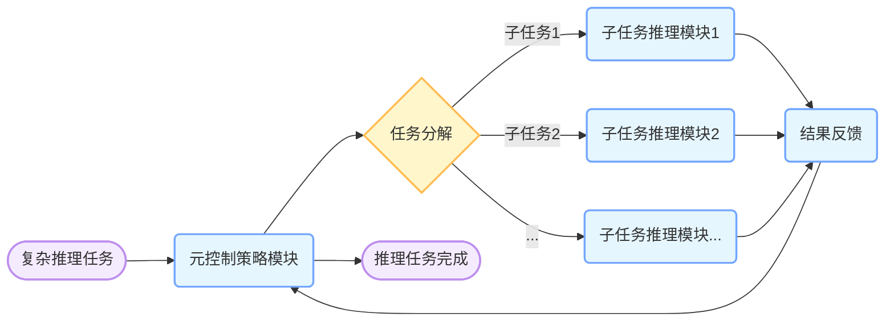

# 元控制策略在复杂推理任务分解中的应用

> 关键词：元控制策略、复杂推理任务、任务分解、人工智能、推理算法

> 摘要：本文深入探讨了元控制策略在复杂推理任务分解中的应用。首先介绍了研究的背景、目的、预期读者以及文档结构等内容。接着阐述了核心概念及其联系，包括元控制策略和复杂推理任务分解的原理与架构，并给出了相应的文本示意图和 Mermaid 流程图。详细讲解了核心算法原理和具体操作步骤，结合 Python 源代码进行说明。同时，介绍了相关的数学模型和公式，并举例说明其应用。通过项目实战，展示了代码的实际案例和详细解释。分析了元控制策略在复杂推理任务分解中的实际应用场景，推荐了相关的学习资源、开发工具框架以及论文著作。最后总结了未来发展趋势与挑战，并提供了常见问题与解答以及扩展阅读和参考资料。

## 1. 背景介绍 
### 1.1 目的和范围
在当今的人工智能和计算机科学领域，复杂推理任务日益增多，如自然语言处理中的长文本推理、智能机器人的复杂决策推理等。这些任务往往具有高度的复杂性和不确定性，直接处理难度极大。元控制策略作为一种有效的控制机制，能够对推理过程进行宏观调控，通过将复杂推理任务分解为多个子任务，降低任务的复杂度，提高推理效率和准确性。本文的目的就是深入研究元控制策略在复杂推理任务分解中的应用，探讨其原理、算法、实际应用场景等方面的内容，为相关领域的研究和实践提供理论支持和技术指导。

### 1.2 预期读者
本文预期读者包括人工智能领域的研究人员、计算机科学专业的学生、软件开发者以及对复杂推理任务和元控制策略感兴趣的技术爱好者。对于研究人员来说，本文可以为他们的研究提供新的思路和方法；对于学生而言，有助于他们深入理解相关领域的知识；对于软件开发者，能够为他们在实际项目中应用元控制策略提供参考。

### 1.3 文档结构概述
本文共分为十个部分。第一部分是背景介绍，包括目的和范围、预期读者、文档结构概述以及术语表。第二部分阐述核心概念与联系，给出核心概念的原理和架构，并配有文本示意图和 Mermaid 流程图。第三部分详细讲解核心算法原理和具体操作步骤，通过 Python 源代码进行说明。第四部分介绍数学模型和公式，并举例说明其应用。第五部分进行项目实战，包括开发环境搭建、源代码详细实现和代码解读。第六部分分析实际应用场景。第七部分推荐相关的工具和资源，包括学习资源、开发工具框架和论文著作。第八部分总结未来发展趋势与挑战。第九部分是附录，提供常见问题与解答。第十部分是扩展阅读和参考资料。

### 1.4 术语表
#### 1.4.1 核心术语定义
- **元控制策略**：一种高层次的控制机制，用于管理和协调推理过程，根据任务的状态和目标，动态地调整推理的方向和资源分配。
- **复杂推理任务**：具有高度复杂性、不确定性和多约束条件的推理任务，通常需要综合运用多种知识和推理方法才能解决。
- **任务分解**：将一个复杂的推理任务拆分为多个相对简单的子任务的过程，以便于分别处理和解决。

#### 1.4.2 相关概念解释
- **推理过程**：从已知信息出发，通过一定的推理规则和方法，推导出新的结论的过程。
- **子任务**：复杂推理任务分解后得到的相对独立的小任务，每个子任务具有明确的目标和输入输出。

#### 1.4.3 缩略词列表
- **AI**：Artificial Intelligence，人工智能
- **NLP**：Natural Language Processing，自然语言处理

## 2. 核心概念与联系 
### 核心概念原理
#### 元控制策略原理
元控制策略的核心思想是在推理过程中引入一个高层次的控制模块，该模块能够对推理的整个过程进行监控和管理。它根据任务的当前状态、目标以及可用的资源等信息，动态地调整推理的方向和资源分配。例如，在面对一个复杂的推理任务时，元控制策略可以根据任务的难度和重要性，决定优先处理哪些子任务，以及为每个子任务分配多少计算资源。

#### 复杂推理任务分解原理
复杂推理任务分解的原理是将一个复杂的推理任务按照一定的规则和方法拆分为多个相对简单的子任务。这些子任务之间可能存在一定的依赖关系，通过合理的组织和调度，可以逐步完成整个推理任务。例如，在自然语言处理中的长文本推理任务中，可以将文本按照段落、句子等进行划分，每个子任务负责处理一部分文本的推理。

### 架构示意图
#### 文本示意图
元控制策略与复杂推理任务分解的架构可以描述为：元控制策略作为一个核心控制模块，负责接收复杂推理任务，并对其进行分析和评估。根据评估结果，元控制策略将复杂推理任务分解为多个子任务，并为每个子任务分配相应的资源和优先级。子任务在各自的推理模块中进行处理，处理结果反馈给元控制策略模块。元控制策略模块根据子任务的执行情况，动态调整后续的推理过程，直到整个复杂推理任务完成。

#### Mermaid 流程图


## 3. 核心算法原理 & 具体操作步骤 
### 核心算法原理
元控制策略在复杂推理任务分解中主要采用启发式搜索算法和动态规划算法。启发式搜索算法用于在任务分解的过程中，根据任务的特征和目标，快速找到一个较优的分解方案。动态规划算法用于在子任务的执行过程中，根据子任务的执行情况和资源的使用情况，动态地调整推理的策略和资源分配。

### 具体操作步骤
#### 步骤 1：任务分析
接收复杂推理任务，对任务的特征、目标、约束条件等进行分析，提取关键信息。例如，对于一个自然语言推理任务，需要分析文本的长度、主题、语言结构等信息。

#### 步骤 2：任务分解
根据任务分析的结果，使用启发式搜索算法将复杂推理任务分解为多个子任务。在分解过程中，需要考虑子任务之间的依赖关系和复杂度。例如，可以根据文本的段落结构将自然语言推理任务分解为多个子任务，每个子任务负责处理一个段落的推理。

#### 步骤 3：资源分配
为每个子任务分配相应的资源，包括计算资源、时间资源等。资源分配的原则是根据子任务的重要性和复杂度，优先为重要和复杂的子任务分配更多的资源。

#### 步骤 4：子任务执行
每个子任务在各自的推理模块中进行处理，推理模块根据子任务的输入和目标，采用相应的推理方法进行推理。例如，对于自然语言推理任务，可以使用机器学习模型进行推理。

#### 步骤 5：结果反馈与调整
子任务的处理结果反馈给元控制策略模块，元控制策略模块根据反馈结果，使用动态规划算法动态地调整后续的推理过程。例如，如果某个子任务的执行结果不理想，元控制策略模块可以重新分配资源，或者调整任务分解方案。

### Python 源代码实现
```python
# 定义复杂推理任务类
class ComplexReasoningTask:
    def __init__(self, task_info):
        self.task_info = task_info

# 定义元控制策略类
class MetaControlStrategy:
    def __init__(self):
        self.sub_tasks = []

    def analyze_task(self, task):
        # 任务分析，这里简单返回任务信息
        return task.task_info

    def decompose_task(self, task_info):
        # 任务分解，这里简单将任务分解为两个子任务
        sub_task1 = f"Sub-task 1 of {task_info}"
        sub_task2 = f"Sub-task 2 of {task_info}"
        self.sub_tasks = [sub_task1, sub_task2]
        return self.sub_tasks

    def allocate_resources(self, sub_tasks):
        # 资源分配，这里简单为每个子任务分配相同的资源
        resources = {}
        for sub_task in sub_tasks:
            resources[sub_task] = 1
        return resources

    def execute_sub_tasks(self, sub_tasks, resources):
        # 子任务执行，这里简单打印子任务和分配的资源
        for sub_task, resource in resources.items():
            print(f"Executing {sub_task} with resource {resource}")

    def feedback_and_adjust(self, results):
        # 结果反馈与调整，这里简单打印结果
        print(f"Received results: {results}")

# 主函数
def main():
    task = ComplexReasoningTask("Complex reasoning task example")
    meta_control = MetaControlStrategy()

    # 任务分析
    task_info = meta_control.analyze_task(task)

    # 任务分解
    sub_tasks = meta_control.decompose_task(task_info)

    # 资源分配
    resources = meta_control.allocate_resources(sub_tasks)

    # 子任务执行
    meta_control.execute_sub_tasks(sub_tasks, resources)

    # 模拟结果反馈
    results = ["Result 1", "Result 2"]
    meta_control.feedback_and_adjust(results)

if __name__ == "__main__":
    main()
```

## 4. 数学模型和公式 & 详细讲解 & 举例说明 
### 数学模型
元控制策略在复杂推理任务分解中的数学模型可以表示为一个优化问题。设复杂推理任务为 $T$，将其分解为 $n$ 个子任务 $T_1, T_2, \cdots, T_n$。每个子任务 $T_i$ 有一个执行成本 $c_i$ 和一个重要性权重 $w_i$。推理任务的总执行成本为 $C = \sum_{i=1}^{n} c_i$，推理任务的总重要性为 $W = \sum_{i=1}^{n} w_i$。元控制策略的目标是在满足一定约束条件下，使得总执行成本最小，总重要性最大。

### 数学公式
#### 目标函数
$$
\min C = \sum_{i=1}^{n} c_i
$$
$$
\max W = \sum_{i=1}^{n} w_i
$$

#### 约束条件
约束条件可以包括资源约束、时间约束等。例如，资源约束可以表示为 $\sum_{i=1}^{n} r_i \leq R$，其中 $r_i$ 是子任务 $T_i$ 所需的资源，$R$ 是可用的总资源。

### 详细讲解
目标函数中的总执行成本 $C$ 表示完成所有子任务所需的总成本，包括计算资源、时间资源等。总重要性 $W$ 表示所有子任务的重要性之和，重要性权重 $w_i$ 可以根据子任务对整个推理任务的贡献程度来确定。约束条件用于限制推理过程中的资源使用和时间消耗，确保推理任务在合理的范围内完成。

### 举例说明
假设有一个复杂推理任务 $T$，需要分解为三个子任务 $T_1, T_2, T_3$。每个子任务的执行成本和重要性权重如下表所示：

| 子任务 | 执行成本 $c_i$ | 重要性权重 $w_i$ | 所需资源 $r_i$ |
| ---- | ---- | ---- | ---- |
| $T_1$ | 10 | 0.3 | 2 |
| $T_2$ | 15 | 0.5 | 3 |
| $T_3$ | 8 | 0.2 | 1 |

可用的总资源 $R = 5$。则目标函数为：
$$
\min C = 10 + 15 + 8 = 33
$$
$$
\max W = 0.3 + 0.5 + 0.2 = 1
$$
约束条件为：
$$
2 + 3 + 1 = 6 > 5
$$
由于不满足资源约束条件，需要调整任务分解方案或资源分配方案。例如，可以考虑减少子任务 $T_2$ 的资源分配，或者重新分解任务，使得总资源使用不超过 $R$。

## 5. 项目实战：代码实际案例和详细解释说明 
### 5.1  开发环境搭建
#### 操作系统
本项目可以在 Windows、Linux 或 macOS 操作系统上进行开发。建议使用 Linux 操作系统，如 Ubuntu 18.04 或更高版本，因为 Linux 系统在开发和部署方面具有更好的稳定性和兼容性。

#### Python 环境
安装 Python 3.7 或更高版本。可以从 Python 官方网站（https://www.python.org/downloads/）下载并安装 Python。安装完成后，建议使用虚拟环境来管理项目的依赖。可以使用 `venv` 模块创建虚拟环境：
```bash
python3 -m venv myenv
source myenv/bin/activate  # 在 Linux 或 macOS 上
.\myenv\Scripts\activate  # 在 Windows 上
```

#### 依赖库安装
本项目需要安装一些常用的 Python 库，如 `numpy`、`pandas` 等。可以使用 `pip` 命令进行安装：
```bash
pip install numpy pandas
```

### 5.2  源代码详细实现和代码解读
```python
import numpy as np

# 定义复杂推理任务类
class ComplexReasoningTask:
    def __init__(self, task_info, total_resources):
        self.task_info = task_info
        self.total_resources = total_resources

# 定义元控制策略类
class MetaControlStrategy:
    def __init__(self):
        self.sub_tasks = []
        self.resources = {}

    def analyze_task(self, task):
        # 任务分析，返回任务信息和总资源
        return task.task_info, task.total_resources

    def decompose_task(self, task_info, num_sub_tasks):
        # 任务分解，将任务分解为指定数量的子任务
        for i in range(num_sub_tasks):
            sub_task = f"Sub-task {i+1} of {task_info}"
            self.sub_tasks.append(sub_task)
        return self.sub_tasks

    def allocate_resources(self, sub_tasks, total_resources):
        # 资源分配，根据子任务数量平均分配资源
        resource_per_task = total_resources / len(sub_tasks)
        for sub_task in sub_tasks:
            self.resources[sub_task] = resource_per_task
        return self.resources

    def execute_sub_tasks(self, sub_tasks, resources):
        # 子任务执行，模拟子任务执行过程
        results = []
        for sub_task, resource in resources.items():
            # 模拟执行结果，这里简单返回资源的平方
            result = resource ** 2
            results.append(result)
            print(f"Executing {sub_task} with resource {resource}, result: {result}")
        return results

    def feedback_and_adjust(self, results):
        # 结果反馈与调整，根据结果调整资源分配
        mean_result = np.mean(results)
        if mean_result < 10:
            # 如果平均结果小于 10，增加每个子任务的资源
            for sub_task in self.resources:
                self.resources[sub_task] *= 1.2
        else:
            # 如果平均结果大于等于 10，减少每个子任务的资源
            for sub_task in self.resources:
                self.resources[sub_task] *= 0.8
        print(f"Adjusted resources: {self.resources}")

# 主函数
def main():
    task = ComplexReasoningTask("Complex reasoning task for project", 10)
    meta_control = MetaControlStrategy()

    # 任务分析
    task_info, total_resources = meta_control.analyze_task(task)

    # 任务分解
    num_sub_tasks = 3
    sub_tasks = meta_control.decompose_task(task_info, num_sub_tasks)

    # 资源分配
    resources = meta_control.allocate_resources(sub_tasks, total_resources)

    # 子任务执行
    results = meta_control.execute_sub_tasks(sub_tasks, resources)

    # 结果反馈与调整
    meta_control.feedback_and_adjust(results)

if __name__ == "__main__":
    main()
```

### 5.3  代码解读与分析
#### 类和函数说明
- `ComplexReasoningTask` 类：表示复杂推理任务，包含任务信息和总资源。
- `MetaControlStrategy` 类：表示元控制策略，包含任务分析、任务分解、资源分配、子任务执行和结果反馈与调整等方法。
  - `analyze_task` 方法：接收复杂推理任务，返回任务信息和总资源。
  - `decompose_task` 方法：将复杂推理任务分解为指定数量的子任务。
  - `allocate_resources` 方法：根据子任务数量平均分配资源。
  - `execute_sub_tasks` 方法：模拟子任务的执行过程，返回执行结果。
  - `feedback_and_adjust` 方法：根据子任务的执行结果，动态调整资源分配。

#### 代码执行流程
1. 创建 `ComplexReasoningTask` 对象，初始化任务信息和总资源。
2. 创建 `MetaControlStrategy` 对象。
3. 调用 `analyze_task` 方法进行任务分析。
4. 调用 `decompose_task` 方法将任务分解为指定数量的子任务。
5. 调用 `allocate_resources` 方法为子任务分配资源。
6. 调用 `execute_sub_tasks` 方法执行子任务，获取执行结果。
7. 调用 `feedback_and_adjust` 方法根据执行结果调整资源分配。

## 6. 实际应用场景 
### 自然语言处理
在自然语言处理中，长文本推理是一个复杂的任务。例如，在问答系统中，用户提出一个复杂的问题，需要从一篇长文本中寻找答案。元控制策略可以将长文本按照段落、句子等进行划分，每个子任务负责处理一部分文本的推理。通过动态调整推理的方向和资源分配，可以提高推理的效率和准确性。

### 智能机器人决策
智能机器人在执行复杂任务时，需要进行复杂的决策推理。例如，机器人在探索未知环境时，需要根据环境信息、任务目标等进行决策。元控制策略可以将复杂的决策任务分解为多个子任务，如路径规划、障碍物识别等。通过对这些子任务的动态管理和协调，可以使机器人更加高效地完成任务。

### 金融风险评估
在金融领域，风险评估是一个复杂的推理任务。需要考虑多个因素，如市场趋势、企业财务状况等。元控制策略可以将风险评估任务分解为多个子任务，每个子任务负责评估一个因素。通过对这些子任务的综合分析和动态调整，可以更准确地评估金融风险。

## 7. 工具和资源推荐
### 7.1 学习资源推荐
#### 7.1.1 书籍推荐
- 《人工智能：一种现代的方法》：这本书是人工智能领域的经典教材，涵盖了人工智能的各个方面，包括推理、搜索、机器学习等。对于理解元控制策略和复杂推理任务分解的理论基础有很大帮助。
- 《Python 机器学习》：介绍了如何使用 Python 进行机器学习的开发，包括各种机器学习算法的实现和应用。在复杂推理任务分解中，机器学习算法可以用于子任务的推理和结果预测。

#### 7.1.2 在线课程
- Coursera 上的“人工智能基础”课程：由知名教授授课，系统地介绍了人工智能的基本概念、方法和技术。
- edX 上的“自然语言处理”课程：深入讲解了自然语言处理的原理和应用，对于理解自然语言推理任务的分解和处理有很大帮助。

#### 7.1.3 技术博客和网站
- Medium 上的人工智能相关博客：有很多人工智能领域的专家和爱好者分享他们的研究成果和实践经验。
- 开源中国：提供了大量的开源项目和技术文章，对于学习和实践元控制策略和复杂推理任务分解有很大帮助。

### 7.2 开发工具框架推荐
#### 7.2.1 IDE和编辑器
- PyCharm：一款专业的 Python 集成开发环境，具有代码编辑、调试、版本控制等功能，适合开发复杂的 Python 项目。
- Visual Studio Code：一款轻量级的代码编辑器，支持多种编程语言，通过安装插件可以实现 Python 开发的各种功能。

#### 7.2.2 调试和性能分析工具
- pdb：Python 自带的调试工具，可以帮助开发者定位代码中的问题。
- cProfile：Python 标准库中的性能分析工具，可以分析代码的执行时间和函数调用情况，帮助开发者优化代码性能。

#### 7.2.3 相关框架和库
- TensorFlow：一个开源的机器学习框架，提供了丰富的机器学习算法和工具，可用于复杂推理任务的建模和训练。
- PyTorch：另一个流行的机器学习框架，具有动态图的优势，适合快速开发和实验。

### 7.3 相关论文著作推荐
#### 7.3.1 经典论文
- “A Survey of Automated Reasoning”：对自动推理领域进行了全面的综述，介绍了各种推理方法和技术。
- “Meta-Reasoning in Artificial Intelligence”：深入探讨了元推理在人工智能中的应用，为元控制策略的研究提供了理论基础。

#### 7.3.2 最新研究成果
- 在 AAAI、IJCAI 等顶级人工智能会议上发表的关于复杂推理任务分解和元控制策略的研究论文，反映了该领域的最新研究动态。

#### 7.3.3 应用案例分析
- 一些实际应用案例的分析文章，如智能机器人在工业生产中的应用、金融风险评估系统的开发等，对于理解元控制策略在实际场景中的应用有很大帮助。

## 8. 总结：未来发展趋势与挑战
### 未来发展趋势
#### 与深度学习的融合
随着深度学习技术的不断发展，元控制策略与深度学习的融合将成为未来的一个重要发展趋势。深度学习模型可以用于子任务的推理和特征提取，元控制策略可以对深度学习模型的训练和推理过程进行宏观调控，提高模型的性能和效率。

#### 多模态推理任务的应用
未来的复杂推理任务将不仅仅局限于文本推理，还将涉及图像、音频、视频等多模态数据的推理。元控制策略需要能够处理多模态数据的任务分解和推理，以满足不同领域的需求。

#### 强化学习的应用
强化学习可以用于优化元控制策略的决策过程。通过强化学习算法，元控制策略可以在不断的试错过程中学习到最优的控制策略，提高复杂推理任务的解决能力。

### 挑战
#### 任务分解的合理性
如何合理地将复杂推理任务分解为多个子任务是一个挑战。任务分解的不合理可能会导致子任务之间的依赖关系过于复杂，增加推理的难度和时间成本。

#### 资源分配的优化
在资源有限的情况下，如何优化资源分配是一个关键问题。元控制策略需要在满足任务需求的前提下，尽可能地提高资源的利用效率。

#### 不确定性的处理
复杂推理任务往往具有不确定性，如数据的不完整性、推理规则的不确定性等。元控制策略需要能够有效地处理这些不确定性，提高推理的准确性和可靠性。

## 9. 附录：常见问题与解答
### 问题 1：元控制策略与传统控制策略有什么区别？
传统控制策略通常是基于固定的规则和模型进行控制，缺乏灵活性和适应性。而元控制策略是一种高层次的控制机制，能够根据任务的状态和目标，动态地调整推理的方向和资源分配，具有更强的灵活性和适应性。

### 问题 2：如何确定子任务的重要性权重？
子任务的重要性权重可以根据子任务对整个推理任务的贡献程度来确定。例如，在自然语言推理任务中，如果某个子任务负责处理关键信息的推理，那么它的重要性权重可以设置得较高。

### 问题 3：元控制策略在处理大规模复杂推理任务时是否有效？
元控制策略在处理大规模复杂推理任务时具有一定的优势。通过将任务分解为多个子任务，并对推理过程进行动态调控，可以降低任务的复杂度，提高推理的效率和准确性。但是，在处理大规模任务时，也需要考虑资源的限制和计算的复杂度。

## 10. 扩展阅读 & 参考资料
### 扩展阅读
- 《人工智能前沿技术》：介绍了人工智能领域的最新前沿技术，包括元控制策略、复杂推理等方面的内容。
- 《机器学习实战》：通过实际案例介绍了机器学习算法的应用，对于理解复杂推理任务中的机器学习方法有很大帮助。

### 参考资料
- [1] Russell, S. J., & Norvig, P. (2009). Artificial Intelligence: A Modern Approach. Prentice Hall.
- [2] Raschka, S. (2015). Python Machine Learning. Packt Publishing.
- [3] AAAI Proceedings. Retrieved from https://www.aaai.org/Conferences/AAAI/aaai.php
- [4] IJCAI Proceedings. Retrieved from https://ijcai.org/

作者：AI天才研究院/AI Genius Institute & 禅与计算机程序设计艺术 /Zen And The Art of Computer Programming