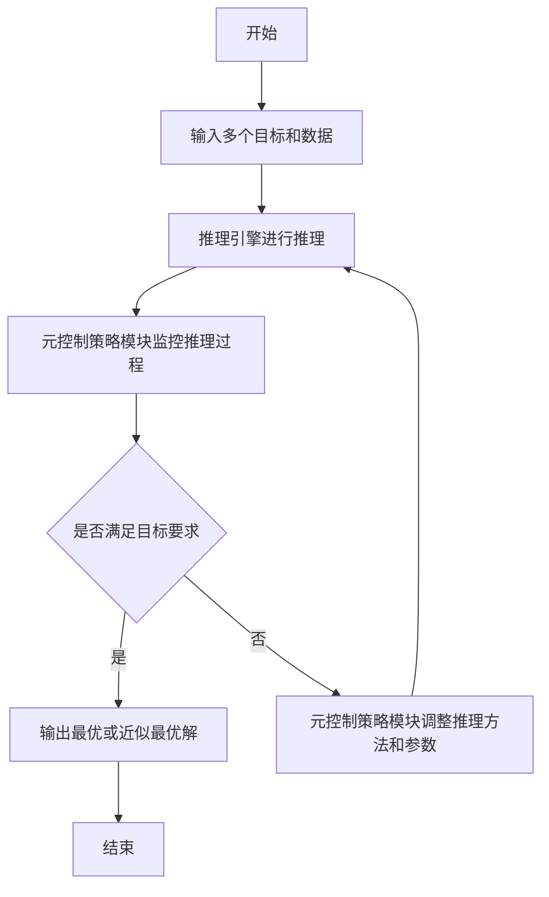

# 元控制策略在多目标推理优化中的应用

> 关键词：元控制策略、多目标推理优化、智能决策、算法原理、实际应用

> 摘要：本文深入探讨了元控制策略在多目标推理优化中的应用。首先介绍了研究的背景、目的、预期读者和文档结构，对相关术语进行了清晰定义。接着阐述了核心概念及其联系，给出了原理和架构的文本示意图与 Mermaid 流程图。详细讲解了核心算法原理，通过 Python 源代码进行说明，并分析了数学模型和公式。通过项目实战，展示了代码的实际案例和详细解释。探讨了元控制策略在多目标推理优化中的实际应用场景，推荐了学习资源、开发工具框架和相关论文著作。最后总结了未来发展趋势与挑战，解答了常见问题，并提供了扩展阅读和参考资料。

## 1. 背景介绍 
### 1.1 目的和范围
在当今复杂的决策环境中，多目标推理优化问题无处不在。例如，在交通规划中，需要同时考虑减少交通拥堵、降低能源消耗和提高出行效率等多个目标；在金融投资中，要兼顾收益最大化和风险最小化。传统的优化方法往往难以有效地处理多个相互冲突的目标，而元控制策略为解决这类问题提供了新的思路。

本文的目的是全面深入地研究元控制策略在多目标推理优化中的应用，包括核心概念、算法原理、数学模型、实际案例以及未来发展趋势等方面。通过对这些内容的探讨，旨在为研究人员和实践者提供一个系统的知识体系，帮助他们更好地理解和应用元控制策略来解决多目标推理优化问题。

### 1.2 预期读者
本文预期读者包括计算机科学、运筹学、控制理论等领域的研究人员，他们可以从本文中获取关于元控制策略和多目标推理优化的最新研究成果和技术方法，为自己的研究提供参考。同时，也适合从事实际项目开发的工程师和技术人员，帮助他们在实际工作中应用元控制策略来解决多目标推理优化问题。此外，对人工智能和优化算法感兴趣的学生和爱好者也可以通过本文了解相关领域的知识。

### 1.3 文档结构概述
本文共分为十个部分。第一部分为背景介绍，阐述了研究的目的、预期读者和文档结构。第二部分介绍核心概念与联系，给出了元控制策略和多目标推理优化的原理和架构示意图。第三部分详细讲解核心算法原理，并通过 Python 源代码进行说明。第四部分分析数学模型和公式，并举例说明。第五部分进行项目实战，包括开发环境搭建、源代码实现和代码解读。第六部分探讨实际应用场景。第七部分推荐学习资源、开发工具框架和相关论文著作。第八部分总结未来发展趋势与挑战。第九部分为附录，解答常见问题。第十部分提供扩展阅读和参考资料。

### 1.4 术语表
#### 1.4.1 核心术语定义
- **元控制策略**：元控制策略是一种高级的控制策略，它通过对推理过程进行监控和调整，以实现对多目标推理优化的有效管理。元控制策略可以根据当前的推理状态和目标要求，动态地选择合适的推理方法和参数，从而提高推理效率和质量。
- **多目标推理优化**：多目标推理优化是指在多个相互冲突的目标下，通过推理过程找到最优或近似最优的解决方案。这些目标可能包括准确性、效率、成本等，需要在推理过程中进行综合考虑。

#### 1.4.2 相关概念解释
- **推理**：推理是指从已知信息中得出新结论的过程。在多目标推理优化中，推理过程通常涉及到对各种知识和数据的处理和分析，以找到满足多个目标的解决方案。
- **优化**：优化是指在一定的约束条件下，寻找使目标函数达到最优值的过程。在多目标推理优化中，由于存在多个目标，优化过程需要考虑这些目标之间的权衡和协调。

#### 1.4.3 缩略词列表
- **MORO**：Multi - Objective Reasoning Optimization（多目标推理优化）
- **MCS**：Meta - Control Strategy（元控制策略）

## 2. 核心概念与联系 
### 核心概念原理
元控制策略的核心思想是通过引入一个元层次的控制机制，对推理过程进行动态的监控和调整。在多目标推理优化中，推理过程通常会面临多个相互冲突的目标，如准确性和效率。元控制策略可以根据当前的推理状态和目标要求，选择合适的推理方法和参数，以平衡这些目标。

例如，在一个基于规则的推理系统中，元控制策略可以根据当前的推理任务和目标，决定是采用深度优先搜索还是广度优先搜索，以及在搜索过程中如何设置剪枝策略。通过这种方式，元控制策略可以提高推理效率，同时保证推理结果的准确性。

多目标推理优化的原理是在多个目标之间进行权衡和协调，找到一个最优或近似最优的解决方案。这通常需要使用多目标优化算法，如遗传算法、粒子群算法等。这些算法可以在搜索空间中寻找满足多个目标的解，并通过迭代的方式不断优化解的质量。

### 架构的文本示意图
```plaintext
+---------------------+
| 多目标推理优化系统  |
+---------------------+
| 推理引擎            |
| 元控制策略模块      |
| 目标评估模块        |
| 数据存储模块        |
+---------------------+
| 输入：多个目标和数据 |
| 输出：最优或近似最优解 |
+---------------------+
```

### Mermaid 流程图


## 3. 核心算法原理 & 具体操作步骤 
### 核心算法原理
元控制策略在多目标推理优化中通常采用基于反馈的控制机制。具体来说，元控制策略模块会实时监控推理过程的状态，如推理时间、推理结果的准确性等，并根据这些反馈信息调整推理方法和参数。

一种常见的元控制策略是基于强化学习的方法。强化学习是一种通过智能体与环境进行交互，不断学习最优策略的方法。在多目标推理优化中，智能体可以将推理过程视为环境，将推理结果的质量作为奖励信号，通过不断地尝试和学习，找到最优的推理策略。

### 具体操作步骤
1. **初始化**：初始化推理引擎和元控制策略模块的参数，包括推理方法、搜索策略、学习率等。
2. **输入目标和数据**：将多个目标和相关数据输入到多目标推理优化系统中。
3. **推理过程**：推理引擎根据当前的推理方法和参数进行推理，并将推理过程的状态信息反馈给元控制策略模块。
4. **元控制策略调整**：元控制策略模块根据推理过程的状态信息和目标要求，调整推理方法和参数。
5. **目标评估**：目标评估模块对推理结果进行评估，判断是否满足目标要求。
6. **终止条件判断**：如果满足终止条件（如达到最大推理时间、推理结果的质量达到一定阈值等），则输出最优或近似最优解；否则，返回步骤 3 继续进行推理。

### Python 源代码实现
```python
import random

# 定义推理引擎类
class ReasoningEngine:
    def __init__(self, methods):
        self.methods = methods
        self.current_method = random.choice(methods)

    def reason(self):
        # 模拟推理过程
        result = self.current_method()
        return result

# 定义元控制策略模块类
class MetaControlStrategy:
    def __init__(self, methods):
        self.methods = methods
        self.best_method = None
        self.best_result = float('-inf')

    def monitor(self, result):
        # 监控推理结果
        if result > self.best_result:
            self.best_result = result
            self.best_method = self.methods.index(result)

    def adjust(self, engine):
        # 调整推理方法
        engine.current_method = self.methods[self.best_method]

# 定义目标评估模块类
class GoalEvaluationModule:
    def __init__(self, target):
        self.target = target

    def evaluate(self, result):
        # 评估推理结果
        return result >= self.target

# 定义示例推理方法
def method1():
    return random.randint(1, 10)

def method2():
    return random.randint(5, 15)

# 主函数
def main():
    methods = [method1, method2]
    engine = ReasoningEngine(methods)
    mcs = MetaControlStrategy(methods)
    gem = GoalEvaluationModule(12)

    max_iterations = 10
    for i in range(max_iterations):
        result = engine.reason()
        mcs.monitor(result)
        mcs.adjust(engine)
        if gem.evaluate(result):
            print(f"找到满足目标的解: {result}")
            break
    else:
        print(f"未找到满足目标的解，最佳结果: {mcs.best_result}")

if __name__ == "__main__":
    main()
```

## 4. 数学模型和公式 & 详细讲解 & 举例说明 
### 数学模型
在多目标推理优化中，通常可以将问题表示为一个多目标优化问题。设 $x$ 为决策变量，$f_i(x)$ 为第 $i$ 个目标函数，$i = 1,2,\cdots,k$，则多目标优化问题可以表示为：

$$
\begin{cases}
\min_{x \in X} [f_1(x), f_2(x), \cdots, f_k(x)] \\
\text{s.t. } g_j(x) \leq 0, j = 1,2,\cdots,m \\
h_l(x) = 0, l = 1,2,\cdots,n
\end{cases}
$$

其中，$X$ 为决策变量的可行域，$g_j(x)$ 为不等式约束条件，$h_l(x)$ 为等式约束条件。

元控制策略的目标是通过调整推理过程的参数，使得多目标优化问题的解尽可能接近 Pareto 最优解。Pareto 最优解是指在不降低其他目标的前提下，无法进一步提高某个目标的解。

### 详细讲解
- **目标函数**：目标函数 $f_i(x)$ 表示第 $i$ 个目标的评价指标。例如，在交通规划中，$f_1(x)$ 可以表示交通拥堵程度，$f_2(x)$ 可以表示能源消耗。
- **约束条件**：约束条件 $g_j(x)$ 和 $h_l(x)$ 表示决策变量 $x$ 需要满足的条件。例如，在资源分配问题中，$g_j(x)$ 可以表示资源的上限约束。
- **Pareto 最优解**：Pareto 最优解是多目标优化问题的核心概念。对于两个解 $x_1$ 和 $x_2$，如果对于所有的目标函数 $f_i(x)$，都有 $f_i(x_1) \leq f_i(x_2)$，且至少存在一个目标函数 $f_j(x)$，使得 $f_j(x_1) < f_j(x_2)$，则称 $x_1$ 支配 $x_2$。Pareto 最优解是指不被其他解支配的解。

### 举例说明
考虑一个简单的多目标优化问题，有两个目标函数：

$$
f_1(x) = x^2
$$

$$
f_2(x) = (x - 2)^2
$$

可行域为 $X = [-1, 3]$。

首先，我们可以画出这两个目标函数的图像：

```python
import numpy as np
import matplotlib.pyplot as plt

x = np.linspace(-1, 3, 100)
f1 = x**2
f2 = (x - 2)**2

plt.plot(x, f1, label='f1(x)')
plt.plot(x, f2, label='f2(x)')
plt.xlabel('x')
plt.ylabel('f(x)')
plt.legend()
plt.show()
```

从图像中可以看出，当 $x = 1$ 时，$f_1(1) = 1$，$f_2(1) = 1$，此时两个目标函数的值都比较小。我们可以通过计算来验证：

- 当 $x = 0$ 时，$f_1(0) = 0$，$f_2(0) = 4$。
- 当 $x = 2$ 时，$f_1(2) = 4$，$f_2(2) = 0$。

可以发现，$x = 1$ 是一个 Pareto 最优解，因为在不增加另一个目标函数值的前提下，无法进一步降低某个目标函数的值。

## 5. 项目实战：代码实际案例和详细解释说明 
### 5.1  开发环境搭建
为了实现元控制策略在多目标推理优化中的应用，我们可以使用 Python 语言进行开发。以下是开发环境搭建的步骤：

1. **安装 Python**：从 Python 官方网站（https://www.python.org/downloads/）下载并安装 Python 3.x 版本。
2. **安装必要的库**：我们需要安装一些必要的 Python 库，如 `numpy`、`matplotlib` 等。可以使用以下命令进行安装：

```sh
pip install numpy matplotlib
```

### 5.2  源代码详细实现和代码解读
```python
import numpy as np
import random

# 定义多目标优化问题的目标函数
def objective_functions(x):
    f1 = x[0]**2
    f2 = (x[1] - 2)**2
    return np.array([f1, f2])

# 定义推理引擎类
class ReasoningEngine:
    def __init__(self, bounds, step_size):
        self.bounds = bounds
        self.step_size = step_size
        self.current_solution = np.array([random.uniform(bounds[0][0], bounds[0][1]),
                                          random.uniform(bounds[1][0], bounds[1][1])])

    def reason(self):
        # 随机生成一个邻域解
        new_solution = self.current_solution + np.random.uniform(-self.step_size, self.step_size, 2)
        # 确保解在可行域内
        new_solution[0] = np.clip(new_solution[0], self.bounds[0][0], self.bounds[0][1])
        new_solution[1] = np.clip(new_solution[1], self.bounds[1][0], self.bounds[1][1])
        return new_solution

# 定义元控制策略模块类
class MetaControlStrategy:
    def __init__(self):
        self.best_solution = None
        self.best_objectives = np.array([float('inf'), float('inf')])

    def monitor(self, solution, objectives):
        # 判断是否为 Pareto 最优解
        if self.best_solution is None or (objectives[0] < self.best_objectives[0] and objectives[1] <= self.best_objectives[1]) or (objectives[1] < self.best_objectives[1] and objectives[0] <= self.best_objectives[0]):
            self.best_solution = solution
            self.best_objectives = objectives

    def adjust(self, engine):
        # 调整推理引擎的当前解
        engine.current_solution = self.best_solution

# 主函数
def main():
    bounds = [[-1, 3], [-1, 3]]
    step_size = 0.1
    engine = ReasoningEngine(bounds, step_size)
    mcs = MetaControlStrategy()

    max_iterations = 100
    for i in range(max_iterations):
        new_solution = engine.reason()
        objectives = objective_functions(new_solution)
        mcs.monitor(new_solution, objectives)
        mcs.adjust(engine)

    print(f"最优解: {mcs.best_solution}")
    print(f"最优目标值: {mcs.best_objectives}")

if __name__ == "__main__":
    main()
```

### 代码解读与分析
1. **目标函数**：`objective_functions` 函数定义了多目标优化问题的两个目标函数 $f_1(x)$ 和 $f_2(x)$。
2. **推理引擎类**：`ReasoningEngine` 类负责生成邻域解。在 `reason` 方法中，通过随机扰动当前解生成一个新的解，并确保新解在可行域内。
3. **元控制策略模块类**：`MetaControlStrategy` 类负责监控推理过程，并根据 Pareto 最优原则调整推理引擎的当前解。在 `monitor` 方法中，判断新解是否为 Pareto 最优解，如果是，则更新最优解和最优目标值。在 `adjust` 方法中，将推理引擎的当前解调整为最优解。
4. **主函数**：在 `main` 函数中，初始化推理引擎和元控制策略模块，并进行迭代推理。在每次迭代中，生成新解，计算目标值，监控推理过程并调整推理引擎的当前解。最后输出最优解和最优目标值。

## 6. 实际应用场景 
### 交通规划
在交通规划中，需要同时考虑多个目标，如减少交通拥堵、降低能源消耗和提高出行效率等。元控制策略可以根据实时的交通数据和目标要求，动态地调整交通信号控制策略、道路规划和公共交通线路等。例如，在高峰时段，元控制策略可以优先考虑减少交通拥堵，通过调整交通信号的时间间隔和流量分配，提高道路的通行能力。

### 金融投资
在金融投资中，投资者通常需要兼顾收益最大化和风险最小化。元控制策略可以根据市场行情和投资者的风险偏好，动态地调整投资组合。例如，当市场行情不稳定时，元控制策略可以增加债券等低风险资产的比例；当市场行情向好时，可以增加股票等高收益资产的比例。

### 智能制造
在智能制造中，需要同时考虑生产效率、产品质量和成本等多个目标。元控制策略可以根据生产设备的状态、原材料的供应情况和订单需求等信息，动态地调整生产计划和调度策略。例如，当生产设备出现故障时，元控制策略可以及时调整生产计划，避免生产延误。

## 7. 工具和资源推荐
### 7.1 学习资源推荐
#### 7.1.1 书籍推荐
- 《多目标优化》：这本书全面介绍了多目标优化的理论和方法，包括 Pareto 最优性、多目标进化算法等内容。
- 《强化学习：原理与 Python 实现》：该书详细讲解了强化学习的基本原理和算法，并通过 Python 代码进行实现，有助于读者深入理解强化学习在元控制策略中的应用。

#### 7.1.2 在线课程
- Coursera 上的“多目标优化”课程：由知名教授授课，系统地介绍了多目标优化的相关知识和算法。
- edX 上的“强化学习基础”课程：提供了强化学习的基础知识和实践案例，帮助读者掌握强化学习的应用。

#### 7.1.3 技术博客和网站
- arXiv：一个开放的预印本服务器，提供了大量关于多目标优化和元控制策略的最新研究成果。
- Medium：上面有许多技术博客，分享了多目标优化和元控制策略的实践经验和案例。

### 7.2 开发工具框架推荐
#### 7.2.1 IDE和编辑器
- PyCharm：一款功能强大的 Python IDE，提供了代码编辑、调试、版本控制等功能，适合开发多目标推理优化项目。
- Jupyter Notebook：一个交互式的开发环境，支持 Python 代码的编写和运行，方便进行数据探索和模型验证。

#### 7.2.2 调试和性能分析工具
- pdb：Python 自带的调试工具，可以帮助开发者定位代码中的问题。
- cProfile：Python 的性能分析工具，可以分析代码的运行时间和内存使用情况，帮助开发者优化代码性能。

#### 7.2.3 相关框架和库
- DEAP：一个用于实现进化算法的 Python 框架，提供了多目标优化算法的实现，如 NSGA - II 等。
- OpenAI Gym：一个用于开发和比较强化学习算法的工具包，提供了丰富的环境和接口，方便开发者进行强化学习实验。

### 7.3 相关论文著作推荐
#### 7.3.1 经典论文
- “A Fast and Elitist Multiobjective Genetic Algorithm: NSGA - II”：提出了著名的 NSGA - II 多目标进化算法，是多目标优化领域的经典论文。
- “Reinforcement Learning: An Introduction”：强化学习领域的经典著作，系统地介绍了强化学习的基本概念和算法。

#### 7.3.2 最新研究成果
- 关注顶级学术会议，如 AAAI、IJCAI、NeurIPS 等，这些会议上会发表多目标优化和元控制策略的最新研究成果。
- 查阅知名学术期刊，如《Journal of Artificial Intelligence Research》《Artificial Intelligence》等，获取最新的研究论文。

#### 7.3.3 应用案例分析
- 可以在 IEEE Xplore、ACM Digital Library 等数据库中搜索多目标推理优化在实际应用中的案例分析论文，了解元控制策略在不同领域的应用效果和实践经验。

## 8. 总结：未来发展趋势与挑战
### 未来发展趋势
- **与深度学习的融合**：深度学习在处理复杂数据和模式识别方面具有强大的能力，将元控制策略与深度学习相结合，可以进一步提高多目标推理优化的性能。例如，使用深度学习模型来预测推理过程的状态，从而更准确地调整推理策略。
- **多智能体系统的应用**：在多智能体系统中，每个智能体都有自己的目标和任务，需要通过协作来实现整体的多目标优化。元控制策略可以用于协调多智能体之间的行为，提高系统的整体性能。
- **实时在线优化**：随着物联网和大数据技术的发展，越来越多的应用需要实时在线优化。元控制策略可以根据实时数据动态地调整推理策略，满足实时性要求。

### 挑战
- **计算复杂度**：多目标推理优化问题通常具有较高的计算复杂度，特别是在处理大规模数据和复杂问题时。如何降低计算复杂度，提高算法的效率是一个挑战。
- **目标冲突处理**：在多目标推理优化中，不同目标之间可能存在冲突。如何有效地处理这些冲突，找到一个合理的权衡方案是一个关键问题。
- **不确定性处理**：实际应用中，数据和环境往往存在不确定性。如何在不确定性的情况下，设计有效的元控制策略，保证推理结果的可靠性是一个挑战。

## 9. 附录：常见问题与解答
### 问题 1：元控制策略和传统控制策略有什么区别？
元控制策略是一种高级的控制策略，它通过对推理过程进行监控和调整，以实现对多目标推理优化的有效管理。与传统控制策略相比，元控制策略更加灵活和智能，可以根据当前的推理状态和目标要求，动态地选择合适的推理方法和参数。

### 问题 2：多目标推理优化问题一定能找到最优解吗？
不一定。多目标推理优化问题通常存在多个相互冲突的目标，很难找到一个解能够同时优化所有目标。因此，通常只能找到一个 Pareto 最优解，即在不降低其他目标的前提下，无法进一步提高某个目标的解。

### 问题 3：如何选择合适的多目标优化算法？
选择合适的多目标优化算法需要考虑问题的特点、计算复杂度和求解精度等因素。常见的多目标优化算法包括遗传算法、粒子群算法、NSGA - II 等。对于简单的问题，可以选择一些经典的算法；对于复杂的问题，可以考虑使用一些先进的算法或结合多种算法进行求解。

## 10. 扩展阅读 & 参考资料
### 扩展阅读
- 《人工智能：一种现代方法》：全面介绍了人工智能的基本概念、算法和应用，有助于读者拓宽知识面。
- 《优化理论与方法》：深入探讨了优化理论和方法，包括线性规划、非线性规划等内容。

### 参考资料
- 相关学术论文和研究报告，如前面推荐的经典论文和最新研究成果。
- 相关书籍和在线课程，如前面推荐的学习资源。

作者：AI天才研究院/AI Genius Institute & 禅与计算机程序设计艺术 /Zen And The Art of Computer Programming