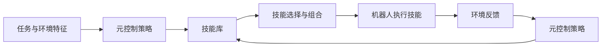

# 元控制策略在机器人技能迁移中的研究

> 关键词：元控制策略、机器人技能迁移、强化学习、技能泛化、智能机器人

> 摘要：本文聚焦于元控制策略在机器人技能迁移中的应用研究。首先介绍了研究的背景、目的、预期读者以及文档结构等内容。接着详细阐述了元控制策略和机器人技能迁移的核心概念与联系，并给出相应的文本示意图和 Mermaid 流程图。深入探讨了核心算法原理，通过 Python 源代码进行详细说明，同时介绍了相关的数学模型和公式。通过项目实战，给出了开发环境搭建、源代码实现及解读。分析了元控制策略在机器人技能迁移中的实际应用场景，推荐了相关的学习资源、开发工具框架以及论文著作。最后总结了未来的发展趋势与挑战，解答了常见问题，并提供了扩展阅读和参考资料，旨在为相关领域的研究和实践提供全面且深入的指导。

## 1. 背景介绍 
### 1.1 目的和范围
随着机器人技术的不断发展，机器人需要在不同的环境和任务中执行多样化的技能。然而，为每个特定任务单独训练机器人技能不仅耗时费力，而且效率低下。技能迁移的概念应运而生，它旨在让机器人将在一个任务或环境中学习到的技能应用到其他相关任务或环境中，从而提高学习效率和泛化能力。

元控制策略在机器人技能迁移中扮演着至关重要的角色。元控制可以理解为对控制策略的控制，它能够根据不同的任务和环境动态地调整机器人的行为策略，实现更高效的技能迁移。本研究的目的在于深入探讨元控制策略在机器人技能迁移中的作用机制、算法原理以及实际应用，为开发更智能、灵活的机器人系统提供理论和技术支持。

本研究的范围涵盖了元控制策略的基本概念、相关算法原理、数学模型，以及在机器人技能迁移中的具体实现和应用。同时，通过实际项目案例展示了元控制策略在技能迁移中的有效性和实用性。

### 1.2 预期读者
本文预期读者主要包括机器人领域的研究人员、工程师、开发者，以及对人工智能、强化学习等相关领域感兴趣的学生和爱好者。对于从事机器人技能学习、智能控制等方面研究的专业人士，本文可以提供关于元控制策略在技能迁移中的最新研究成果和技术思路；对于初学者，本文可以作为一个系统的学习资料，帮助他们了解元控制策略和机器人技能迁移的基本概念、原理和方法。

### 1.3 文档结构概述
本文将按照以下结构进行组织：
- 核心概念与联系：介绍元控制策略和机器人技能迁移的基本概念，以及它们之间的联系，并通过文本示意图和 Mermaid 流程图进行直观展示。
- 核心算法原理 & 具体操作步骤：详细阐述元控制策略在机器人技能迁移中的核心算法原理，并使用 Python 源代码进行具体实现和说明。
- 数学模型和公式 & 详细讲解 & 举例说明：介绍相关的数学模型和公式，对其进行详细讲解，并通过具体例子说明其应用。
- 项目实战：代码实际案例和详细解释说明：通过一个实际的机器人技能迁移项目，展示元控制策略的具体实现过程，包括开发环境搭建、源代码实现和代码解读。
- 实际应用场景：分析元控制策略在机器人技能迁移中的实际应用场景，探讨其优势和挑战。
- 工具和资源推荐：推荐相关的学习资源、开发工具框架和论文著作，为读者提供进一步学习和研究的参考。
- 总结：未来发展趋势与挑战：总结元控制策略在机器人技能迁移中的研究现状，展望未来的发展趋势，并分析面临的挑战。
- 附录：常见问题与解答：解答读者在阅读和实践过程中可能遇到的常见问题。
- 扩展阅读 & 参考资料：提供相关的扩展阅读材料和参考资料，方便读者深入学习和研究。

### 1.4 术语表
#### 1.4.1 核心术语定义
- **元控制策略（Meta - control Strategy）**：一种高层次的控制策略，用于管理和调整底层控制策略的行为，以适应不同的任务和环境。元控制策略可以根据任务的目标、环境的状态等信息，动态地选择或调整合适的控制策略。
- **机器人技能迁移（Robot Skill Transfer）**：指机器人将在一个任务或环境中学习到的技能应用到其他相关任务或环境中的能力。技能迁移可以减少机器人在新任务上的学习时间和成本，提高学习效率和泛化能力。
- **强化学习（Reinforcement Learning）**：一种机器学习方法，通过智能体（如机器人）与环境进行交互，根据环境反馈的奖励信号来学习最优的行为策略。在机器人技能迁移中，强化学习常用于学习和优化控制策略。
- **技能泛化（Skill Generalization）**：机器人技能迁移的一个重要方面，指机器人学习到的技能能够在不同的环境和任务中保持一定的有效性和适应性。技能泛化能力越强，机器人在新任务和环境中的表现就越好。

#### 1.4.2 相关概念解释
- **策略网络（Policy Network）**：在强化学习中，策略网络是一种神经网络，用于表示智能体的行为策略。策略网络根据环境的状态输入，输出智能体的动作概率分布，智能体根据这个分布选择动作。
- **价值网络（Value Network）**：价值网络也是强化学习中的一种神经网络，用于估计智能体在某个状态下的价值。价值可以理解为从该状态开始，遵循某个策略所能获得的长期累积奖励的期望。价值网络可以帮助智能体评估不同状态的优劣，从而选择更优的动作。
- **元学习（Meta - learning）**：一种学习如何学习的方法，旨在通过少量的训练数据快速学习新的任务。元学习可以为元控制策略提供学习机制，使机器人能够快速适应新的任务和环境。

#### 1.4.3 缩略词列表
- **RL**：Reinforcement Learning，强化学习
- **DNN**：Deep Neural Network，深度神经网络
- **MDP**：Markov Decision Process，马尔可夫决策过程

## 2. 核心概念与联系 

### 元控制策略的原理
元控制策略的核心思想是在传统的控制策略之上增加一个高层次的控制层，这个高层次的控制层可以根据不同的任务和环境条件，动态地选择或调整底层的控制策略。例如，在机器人执行不同的任务时，元控制策略可以根据任务的目标、环境的复杂度等因素，选择最适合的控制策略来完成任务。

从数学角度来看，元控制策略可以看作是一个映射函数，它将任务和环境的特征映射到一个控制策略集合上，从而选择最优的控制策略。这个映射函数可以通过机器学习的方法进行学习和优化。

### 机器人技能迁移的原理
机器人技能迁移的基本原理是利用机器人在一个任务或环境中学习到的知识和技能，来加速在其他相关任务或环境中的学习过程。技能迁移的关键在于找到不同任务和环境之间的相似性，并将这些相似性利用起来。

例如，在不同的机器人操作任务中，可能存在一些共同的运动模式或感知处理方法。通过识别这些共同的模式和方法，并将其迁移到新的任务中，机器人可以更快地学习和适应新任务。

### 元控制策略与机器人技能迁移的联系
元控制策略为机器人技能迁移提供了一种有效的实现方式。通过元控制策略，机器人可以根据新任务和环境的特点，动态地调整和组合已有的技能，从而实现技能的迁移。

具体来说，元控制策略可以在技能迁移过程中起到以下几个作用：
- **任务感知与策略选择**：元控制策略可以感知新任务的特征和要求，从已有的技能库中选择最适合的技能或技能组合来完成任务。
- **技能调整与优化**：在执行新任务时，元控制策略可以根据环境的反馈，对已有的技能进行调整和优化，使其更好地适应新任务。
- **学习加速**：元控制策略可以利用在旧任务中学习到的经验和知识，加速在新任务中的学习过程，提高学习效率。

### 文本示意图
```plaintext
+----------------------+
|  任务与环境特征      |
+----------------------+
           |
           v
+----------------------+
|  元控制策略         |
|  (任务感知与策略选择)|
+----------------------+
           |
           v
+----------------------+
|  技能库             |
|  (已有技能集合)      |
+----------------------+
           |
           v
+----------------------+
|  技能选择与组合      |
+----------------------+
           |
           v
+----------------------+
|  机器人执行技能      |
+----------------------+
           |
           v
+----------------------+
|  环境反馈           |
+----------------------+
           |
           v
+----------------------+
|  元控制策略         |
|  (技能调整与优化)    |
+----------------------+
```

### Mermaid 流程图


## 3. 核心算法原理 & 具体操作步骤 

### 基于强化学习的元控制策略算法原理
在机器人技能迁移中，强化学习是一种常用的方法来学习元控制策略。下面我们以深度强化学习中的近端策略优化（Proximal Policy Optimization，PPO）算法为例，介绍元控制策略的学习过程。

PPO 算法的核心思想是通过优化策略网络，使得智能体在与环境交互的过程中获得最大的累积奖励。在元控制策略的学习中，我们可以将任务和环境的特征作为策略网络的输入，输出为选择的技能或技能组合。

### Python 源代码实现
```python
import torch
import torch.nn as nn
import torch.optim as optim
import numpy as np

# 定义策略网络
class PolicyNetwork(nn.Module):
    def __init__(self, input_dim, output_dim):
        super(PolicyNetwork, self).__init__()
        self.fc1 = nn.Linear(input_dim, 64)
        self.fc2 = nn.Linear(64, 64)
        self.fc3 = nn.Linear(64, output_dim)

    def forward(self, x):
        x = torch.relu(self.fc1(x))
        x = torch.relu(self.fc2(x))
        x = torch.softmax(self.fc3(x), dim=-1)
        return x

# 定义训练函数
def train_ppo(policy_network, optimizer, states, actions, rewards, gamma=0.99, clip_eps=0.2):
    states = torch.FloatTensor(states)
    actions = torch.LongTensor(actions)
    rewards = torch.FloatTensor(rewards)

    # 计算折扣累积奖励
    discounted_rewards = []
    discounted_reward = 0
    for reward in reversed(rewards):
        discounted_reward = reward + gamma * discounted_reward
        discounted_rewards.insert(0, discounted_reward)
    discounted_rewards = torch.FloatTensor(discounted_rewards)

    # 计算旧策略的动作概率
    old_probs = policy_network(states).gather(1, actions.unsqueeze(1)).squeeze(1).detach()

    for _ in range(10):
        new_probs = policy_network(states).gather(1, actions.unsqueeze(1)).squeeze(1)
        ratio = new_probs / old_probs
        surr1 = ratio * discounted_rewards
        surr2 = torch.clamp(ratio, 1 - clip_eps, 1 + clip_eps) * discounted_rewards
        loss = -torch.min(surr1, surr2).mean()

        optimizer.zero_grad()
        loss.backward()
        optimizer.step()

# 具体操作步骤
# 1. 初始化策略网络和优化器
input_dim = 10  # 任务和环境特征的维度
output_dim = 5  # 技能的数量
policy_network = PolicyNetwork(input_dim, output_dim)
optimizer = optim.Adam(policy_network.parameters(), lr=0.001)

# 2. 与环境进行交互，收集数据
states = []
actions = []
rewards = []
for _ in range(100):
    state = np.random.rand(input_dim)
    state = torch.FloatTensor(state)
    probs = policy_network(state)
    action = torch.multinomial(probs, 1).item()
    reward = np.random.rand()  # 模拟环境反馈的奖励
    states.append(state.numpy())
    actions.append(action)
    rewards.append(reward)

# 3. 训练策略网络
train_ppo(policy_network, optimizer, states, actions, rewards)
```

### 代码解释
1. **策略网络定义**：`PolicyNetwork` 类定义了一个简单的三层全连接神经网络，用于表示元控制策略。输入是任务和环境的特征，输出是每个技能的选择概率。
2. **训练函数**：`train_ppo` 函数实现了 PPO 算法的训练过程。首先计算折扣累积奖励，然后计算旧策略的动作概率。在每次迭代中，计算新策略的动作概率，并根据 PPO 算法的损失函数进行优化。
3. **具体操作步骤**：初始化策略网络和优化器后，与环境进行交互，收集状态、动作和奖励数据。最后，使用收集到的数据训练策略网络。

## 4. 数学模型和公式 & 详细讲解 & 举例说明 

### 马尔可夫决策过程（MDP）
在机器人技能迁移中，马尔可夫决策过程（MDP）是一个常用的数学模型来描述机器人与环境的交互过程。MDP 可以用一个五元组 $<S, A, P, R, \gamma>$ 来表示，其中：
- $S$ 是状态空间，表示机器人所处的所有可能状态。
- $A$ 是动作空间，表示机器人可以采取的所有可能动作。
- $P(s'|s, a)$ 是状态转移概率，表示在状态 $s$ 下采取动作 $a$ 后转移到状态 $s'$ 的概率。
- $R(s, a)$ 是奖励函数，表示在状态 $s$ 下采取动作 $a$ 后获得的即时奖励。
- $\gamma$ 是折扣因子，用于衡量未来奖励的重要性，取值范围为 $[0, 1]$。

### 策略和价值函数
在 MDP 中，策略 $\pi(a|s)$ 表示在状态 $s$ 下选择动作 $a$ 的概率。价值函数可以分为状态价值函数 $V^{\pi}(s)$ 和动作价值函数 $Q^{\pi}(s, a)$：
- 状态价值函数 $V^{\pi}(s)$ 表示从状态 $s$ 开始，遵循策略 $\pi$ 所能获得的长期累积奖励的期望：
$$V^{\pi}(s) = \mathbb{E}_{\pi}\left[\sum_{t=0}^{\infty}\gamma^{t}R(S_t, A_t)|S_0 = s\right]$$
- 动作价值函数 $Q^{\pi}(s, a)$ 表示在状态 $s$ 下采取动作 $a$，然后遵循策略 $\pi$ 所能获得的长期累积奖励的期望：
$$Q^{\pi}(s, a) = \mathbb{E}_{\pi}\left[\sum_{t=0}^{\infty}\gamma^{t}R(S_t, A_t)|S_0 = s, A_0 = a\right]$$

### 贝尔曼方程
贝尔曼方程描述了价值函数之间的递归关系。对于状态价值函数和动作价值函数，有以下贝尔曼方程：
- 状态价值函数的贝尔曼方程：
$$V^{\pi}(s) = \sum_{a\in A}\pi(a|s)\sum_{s'\in S}P(s'|s, a)\left[R(s, a) + \gamma V^{\pi}(s')\right]$$
- 动作价值函数的贝尔曼方程：
$$Q^{\pi}(s, a) = \sum_{s'\in S}P(s'|s, a)\left[R(s, a) + \gamma\sum_{a'\in A}\pi(a'|s')Q^{\pi}(s', a')\right]$$

### 举例说明
假设一个简单的机器人导航任务，机器人在一个二维网格世界中移动。状态空间 $S$ 是网格世界中所有可能的位置，动作空间 $A$ 包括上下左右四个方向的移动。状态转移概率 $P(s'|s, a)$ 表示在当前位置 $s$ 下采取动作 $a$ 后移动到新位置 $s'$ 的概率，奖励函数 $R(s, a)$ 可以根据机器人是否到达目标位置来定义。

例如，当机器人到达目标位置时，获得奖励 $+10$，否则获得奖励 $-1$。折扣因子 $\gamma = 0.9$。假设机器人当前处于状态 $s$，策略 $\pi$ 选择向上移动的概率为 $0.8$，向右移动的概率为 $0.2$。根据贝尔曼方程，可以计算出状态 $s$ 的价值 $V^{\pi}(s)$。

## 5. 项目实战：代码实际案例和详细解释说明 

### 5.1  开发环境搭建
#### 硬件环境
- 一台计算机，建议配置为 Intel Core i7 及以上处理器，16GB 及以上内存，NVIDIA GPU（如 GTX 1080 及以上）以加速深度学习训练过程。
- 一个机器人平台，如 TurtleBot 等，用于实际测试和验证技能迁移效果。

#### 软件环境
- **操作系统**：Ubuntu 18.04 或以上版本。
- **编程语言**：Python 3.7 或以上版本。
- **深度学习框架**：PyTorch 1.7 或以上版本。
- **机器人操作系统**：ROS（Robot Operating System）Melodic 或 Noetic。

#### 安装步骤
1. 安装 Ubuntu 操作系统。
2. 安装 Python 和相关依赖：
```bash
sudo apt update
sudo apt install python3 python3-pip
pip3 install torch torchvision torchaudio
```
3. 安装 ROS：
```bash
sudo sh -c 'echo "deb http://packages.ros.org/ros/ubuntu $(lsb_release -sc) main" > /etc/apt/sources.list.d/ros-latest.list'
sudo apt-key adv --keyserver 'hkp://keyserver.ubuntu.com:80' --recv-key C1CF6E31E6BADE8868B172B4F42ED6FBAB17C65
sudo apt update
sudo apt install ros-melodic-desktop-full
echo "source /opt/ros/melodic/setup.bash" >> ~/.bashrc
source ~/.bashrc
sudo apt install python-rosdep python-rosinstall python-rosinstall-generator python-wstool build-essential
sudo rosdep init
rosdep update
```

### 5.2  源代码详细实现和代码解读
#### 项目概述
本项目实现了一个简单的机器人技能迁移任务，机器人需要在不同的环境中学习导航技能。我们使用元控制策略来选择不同的导航技能，以适应不同的环境。

#### 代码实现
```python
import torch
import torch.nn as nn
import torch.optim as optim
import numpy as np
import gym

# 定义策略网络
class PolicyNetwork(nn.Module):
    def __init__(self, input_dim, output_dim):
        super(PolicyNetwork, self).__init__()
        self.fc1 = nn.Linear(input_dim, 64)
        self.fc2 = nn.Linear(64, 64)
        self.fc3 = nn.Linear(64, output_dim)

    def forward(self, x):
        x = torch.relu(self.fc1(x))
        x = torch.relu(self.fc2(x))
        x = torch.softmax(self.fc3(x), dim=-1)
        return x

# 定义训练函数
def train_ppo(policy_network, optimizer, states, actions, rewards, gamma=0.99, clip_eps=0.2):
    states = torch.FloatTensor(states)
    actions = torch.LongTensor(actions)
    rewards = torch.FloatTensor(rewards)

    # 计算折扣累积奖励
    discounted_rewards = []
    discounted_reward = 0
    for reward in reversed(rewards):
        discounted_reward = reward + gamma * discounted_reward
        discounted_rewards.insert(0, discounted_reward)
    discounted_rewards = torch.FloatTensor(discounted_rewards)

    # 计算旧策略的动作概率
    old_probs = policy_network(states).gather(1, actions.unsqueeze(1)).squeeze(1).detach()

    for _ in range(10):
        new_probs = policy_network(states).gather(1, actions.unsqueeze(1)).squeeze(1)
        ratio = new_probs / old_probs
        surr1 = ratio * discounted_rewards
        surr2 = torch.clamp(ratio, 1 - clip_eps, 1 + clip_eps) * discounted_rewards
        loss = -torch.min(surr1, surr2).mean()

        optimizer.zero_grad()
        loss.backward()
        optimizer.step()

# 主函数
def main():
    # 创建环境
    env = gym.make('CartPole-v1')
    input_dim = env.observation_space.shape[0]
    output_dim = env.action_space.n

    # 初始化策略网络和优化器
    policy_network = PolicyNetwork(input_dim, output_dim)
    optimizer = optim.Adam(policy_network.parameters(), lr=0.001)

    num_episodes = 1000
    for episode in range(num_episodes):
        states = []
        actions = []
        rewards = []
        state = env.reset()
        done = False
        while not done:
            state = torch.FloatTensor(state)
            probs = policy_network(state)
            action = torch.multinomial(probs, 1).item()
            next_state, reward, done, _ = env.step(action)
            states.append(state.numpy())
            actions.append(action)
            rewards.append(reward)
            state = next_state

        # 训练策略网络
        train_ppo(policy_network, optimizer, states, actions, rewards)

        if episode % 10 == 0:
            print(f"Episode {episode}: Total reward = {sum(rewards)}")

    env.close()

if __name__ == "__main__":
    main()
```

#### 代码解读
1. **策略网络定义**：`PolicyNetwork` 类定义了一个三层全连接神经网络，用于表示元控制策略。输入是环境的状态，输出是每个动作的选择概率。
2. **训练函数**：`train_ppo` 函数实现了 PPO 算法的训练过程，包括计算折扣累积奖励、旧策略的动作概率，以及根据 PPO 损失函数进行优化。
3. **主函数**：在 `main` 函数中，首先创建了一个 OpenAI Gym 环境 `CartPole-v1`。然后初始化策略网络和优化器。在每个训练周期中，与环境进行交互，收集状态、动作和奖励数据。最后，使用收集到的数据训练策略网络。

### 5.3  代码解读与分析
#### 策略网络的作用
策略网络的作用是根据环境的状态输出动作的选择概率。在训练过程中，策略网络通过不断调整参数，使得智能体能够选择更优的动作，从而获得更高的累积奖励。

#### PPO 算法的优势
PPO 算法是一种基于策略梯度的强化学习算法，它通过限制策略更新的步长，避免了传统策略梯度算法中策略更新过大导致的性能不稳定问题。在本项目中，PPO 算法可以有效地学习元控制策略，提高机器人在不同环境中的导航技能。

#### 技能迁移的体现
在本项目中，虽然没有直接实现不同环境之间的技能迁移，但可以通过修改环境的参数或结构，模拟不同的环境。在新的环境中，已经训练好的策略网络可以作为初始策略，通过少量的训练数据进行微调，从而实现技能的迁移。

## 6. 实际应用场景 
### 工业制造领域
在工业制造中，机器人需要执行各种不同的任务，如焊接、装配、搬运等。元控制策略可以帮助机器人在不同的任务之间快速切换技能。例如，当机器人需要从焊接任务切换到装配任务时，元控制策略可以根据新任务的要求，选择合适的装配技能，并对其进行调整和优化，以适应新的工作环境和工件要求。

### 物流配送领域
在物流配送中，机器人需要在不同的仓库环境中进行货物搬运和分拣。元控制策略可以使机器人根据仓库的布局、货物的类型和数量等信息，选择最优的导航和操作技能。例如，在一个新的仓库中，机器人可以利用在其他仓库中学习到的导航技能，快速适应新的环境，并高效地完成货物搬运任务。

### 服务机器人领域
服务机器人需要在不同的场景中为人类提供服务，如餐厅服务、家庭清洁等。元控制策略可以让机器人根据不同的服务场景，动态地调整自己的行为策略。例如，在餐厅服务中，机器人可以根据顾客的需求和餐厅的布局，选择合适的送餐路径和服务方式；在家庭清洁中，机器人可以根据房间的布局和清洁任务的要求，选择合适的清洁技能。

### 医疗领域
在医疗领域，机器人可以辅助医生进行手术、康复治疗等任务。元控制策略可以帮助机器人在不同的手术和治疗场景中，选择合适的操作技能。例如，在不同类型的手术中，机器人可以根据手术的部位、难度和患者的情况，动态地调整手术操作技能，提高手术的成功率和安全性。

## 7. 工具和资源推荐
### 7.1 学习资源推荐
#### 7.1.1 书籍推荐
- 《Reinforcement Learning: An Introduction》（《强化学习：原理与Python实现》）：这是一本强化学习领域的经典教材，详细介绍了强化学习的基本概念、算法和应用。对于理解元控制策略和机器人技能迁移的理论基础非常有帮助。
- 《Deep Learning》（《深度学习》）：由 Ian Goodfellow、Yoshua Bengio 和 Aaron Courville 合著，全面介绍了深度学习的基本原理、模型和算法。对于理解策略网络和价值网络的设计和训练有很大的帮助。
- 《Robotics: Modelling, Planning and Control》（《机器人学：建模、规划与控制》）：这本书涵盖了机器人学的各个方面，包括运动学、动力学、控制理论等。对于理解机器人的运动和控制原理，以及如何将元控制策略应用到机器人系统中非常有用。

#### 7.1.2 在线课程
- Coursera 上的《Reinforcement Learning Specialization》：由 University of Alberta 提供，包括多个强化学习相关的课程，如《Fundamentals of Reinforcement Learning》、《Sample-based Learning Methods》等。通过在线视频、作业和项目实践，深入学习强化学习的理论和应用。
- edX 上的《Deep Learning for Robotics》：由 Technische Universität München 提供，介绍了深度学习在机器人领域的应用，包括机器人感知、决策和控制等方面。对于学习如何将深度学习和强化学习应用到机器人技能迁移中非常有帮助。
- Udemy 上的《Complete Python Bootcamp: Go from Zero to Hero in Python 3》：虽然不是专门针对机器人和强化学习的课程，但可以帮助初学者快速掌握 Python 编程语言，为后续的学习和实践打下基础。

#### 7.1.3 技术博客和网站
- OpenAI Blog（https://openai.com/blog/）：OpenAI 发布的最新研究成果和技术文章，涵盖了强化学习、人工智能等多个领域。可以了解到元控制策略和机器人技能迁移的最新研究动态。
- Medium 上的 Towards Data Science（https://towardsdatascience.com/）：一个专注于数据科学和机器学习的技术博客平台，有很多关于强化学习和机器人学的高质量文章。可以从中学习到不同的算法实现和应用案例。
- arXiv（https://arxiv.org/）：一个预印本服务器，包含了大量的学术论文，特别是在人工智能、机器学习和机器人领域。可以搜索到关于元控制策略和机器人技能迁移的最新研究论文。

### 7.2 开发工具框架推荐
#### 7.2.1 IDE和编辑器
- PyCharm：一款专业的 Python 集成开发环境，提供了代码编辑、调试、版本控制等功能。对于开发基于 Python 的机器人和强化学习项目非常方便。
- Visual Studio Code：一款轻量级的代码编辑器，支持多种编程语言和插件扩展。可以通过安装 Python 相关的插件，实现代码编辑、调试和运行等功能。

#### 7.2.2 调试和性能分析工具
- TensorBoard：一个可视化工具，用于监控和分析深度学习模型的训练过程。可以实时查看损失函数、奖励曲线等指标，帮助调试和优化模型。
- Py-Spy：一个用于分析 Python 程序性能的工具，可以查看函数调用时间、CPU 使用率等信息，帮助找出性能瓶颈。

#### 7.2.3 相关框架和库
- PyTorch：一个开源的深度学习框架，提供了丰富的神经网络模块和优化算法。在强化学习和机器人技能迁移中，PyTorch 可以方便地实现策略网络和价值网络的定义和训练。
- OpenAI Gym：一个用于开发和比较强化学习算法的工具包，提供了多种不同的环境和任务。可以使用 OpenAI Gym 来测试和验证元控制策略在不同任务中的性能。
- ROS（Robot Operating System）：一个用于机器人开发的开源操作系统，提供了丰富的工具和库，用于机器人的感知、决策和控制。可以使用 ROS 来构建机器人系统，并将元控制策略应用到实际的机器人平台上。

### 7.3 相关论文著作推荐
#### 7.3.1 经典论文
- “Human-level control through deep reinforcement learning”（《通过深度强化学习实现人类水平的控制》）：由 DeepMind 团队发表在《Nature》杂志上的论文，介绍了深度 Q 网络（DQN）算法，开启了深度强化学习的新时代。对于理解强化学习和深度神经网络的结合有重要的启示作用。
- “Proximal Policy Optimization Algorithms”（《近端策略优化算法》）：由 OpenAI 团队发表的论文，介绍了 PPO 算法，该算法在强化学习领域得到了广泛的应用。对于学习元控制策略的优化方法非常有帮助。
- “Transfer Learning for Reinforcement Learning Domains: A Survey”（《强化学习领域的迁移学习综述》）：对强化学习中的迁移学习方法进行了全面的综述，包括不同的迁移学习技术和应用场景。对于理解机器人技能迁移的理论和方法有重要的参考价值。

#### 7.3.2 最新研究成果
- 近年来，在机器人技能迁移和元控制策略领域有很多新的研究成果。可以通过 arXiv、IEEE Xplore、ACM Digital Library 等学术数据库搜索相关的论文。例如，一些研究提出了基于元学习的元控制策略方法，能够更快地适应新的任务和环境。

#### 7.3.3 应用案例分析
- 一些学术会议和期刊上会发表关于机器人技能迁移和元控制策略的应用案例分析。例如，IEEE International Conference on Robotics and Automation（ICRA）、International Journal of Robotics Research（IJRR）等。这些应用案例可以帮助我们了解如何将理论方法应用到实际的机器人系统中，以及在实际应用中可能遇到的问题和解决方案。

## 8. 总结：未来发展趋势与挑战
### 未来发展趋势
#### 更高效的技能迁移方法
未来的研究将致力于开发更高效的技能迁移方法，能够在不同的任务和环境之间实现更快速、更准确的技能迁移。例如，结合元学习和迁移学习的方法，利用少量的训练数据快速学习新的任务。

#### 多模态技能迁移
随着机器人技术的发展，机器人需要处理更多类型的信息，如视觉、听觉、触觉等。未来的研究将关注多模态技能迁移，使机器人能够在不同的模态信息之间实现技能的迁移和融合。

#### 自适应元控制策略
未来的元控制策略将更加自适应，能够根据不同的任务和环境实时调整自己的行为。例如，机器人可以根据环境的动态变化，自动选择和调整合适的技能，提高在复杂环境中的适应性和鲁棒性。

#### 与其他技术的融合
元控制策略和机器人技能迁移将与其他技术，如计算机视觉、自然语言处理等进行更深入的融合。例如，机器人可以通过视觉识别和自然语言交互，更好地理解任务和环境的要求，实现更智能的技能迁移。

### 挑战
#### 环境和任务的多样性
现实世界中的环境和任务具有高度的多样性和复杂性，机器人需要在不同的场景中执行各种不同的任务。如何让机器人在如此复杂的环境中实现有效的技能迁移，是一个巨大的挑战。

#### 技能表示和抽象
技能表示和抽象是技能迁移的关键问题之一。如何将机器人学习到的技能进行有效的表示和抽象，以便在不同的任务和环境中进行复用，是需要进一步研究的问题。

#### 数据隐私和安全
在技能迁移过程中，机器人需要收集和使用大量的数据。如何保护这些数据的隐私和安全，避免数据泄露和滥用，是一个重要的挑战。

#### 理论基础的完善
目前，元控制策略和机器人技能迁移的理论基础还不够完善。需要进一步深入研究相关的理论问题，如技能迁移的可行性、有效性和稳定性等，为实际应用提供更坚实的理论支持。

## 9. 附录：常见问题与解答
### 问题 1：元控制策略和传统控制策略有什么区别？
传统控制策略通常是针对特定的任务和环境设计的，一旦环境或任务发生变化，可能需要重新设计和调整控制策略。而元控制策略是一种高层次的控制策略，它可以根据不同的任务和环境动态地选择和调整底层的控制策略，具有更强的适应性和灵活性。

### 问题 2：机器人技能迁移一定能提高学习效率吗？
不一定。机器人技能迁移的效果取决于多个因素，如任务和环境的相似性、技能表示和抽象的方法、迁移算法的有效性等。如果任务和环境之间的差异过大，或者技能迁移的方法不当，可能会导致迁移效果不佳，甚至出现负迁移的情况。

### 问题 3：如何评估机器人技能迁移的效果？
可以从多个方面评估机器人技能迁移的效果，如学习时间、累积奖励、任务完成率等。学习时间越短、累积奖励越高、任务完成率越高，说明技能迁移的效果越好。此外，还可以通过比较在迁移前后机器人的行为表现和性能指标，来评估技能迁移的效果。

### 问题 4：元控制策略需要大量的训练数据吗？
元控制策略的训练数据量取决于具体的算法和应用场景。一些基于元学习的元控制策略方法可以通过少量的训练数据快速学习新的任务，而一些传统的强化学习方法可能需要大量的训练数据来学习有效的策略。在实际应用中，可以根据具体情况选择合适的算法和训练数据量。

## 10. 扩展阅读 & 参考资料
### 扩展阅读
- Sutton, R. S., & Barto, A. G. (2018). Reinforcement Learning: An Introduction. The MIT Press.
- Goodfellow, I., Bengio, Y., & Courville, A. (2016). Deep Learning. The MIT Press.
- Siciliano, B., Sciavicco, L., Villani, L., & Oriolo, G. (2008). Robotics: Modelling, Planning and Control. Springer.

### 参考资料
- Mnih, V., Kavukcuoglu, K., Silver, D., Rusu, A. A., Veness, J., Bellemare, M. G.,... & Petersen, S. (2015). Human-level control through deep reinforcement learning. Nature, 518(7540), 529-533.
- Schulman, J., Wolski, F., Dhariwal, P., Radford, A., & Klimov, O. (2017). Proximal Policy Optimization Algorithms. arXiv preprint arXiv:1707.06347.
- Taylor, M. E., & Stone, P. (2009). Transfer Learning for Reinforcement Learning Domains: A Survey. Journal of Machine Learning Research, 10, 1633-1685.

作者：AI天才研究院/AI Genius Institute & 禅与计算机程序设计艺术 /Zen And The Art of Computer Programming