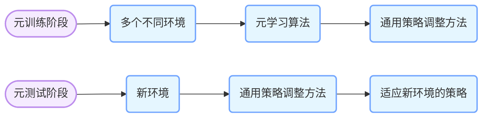

# 元策略优化:自适应调整AI行为的新途径

> 关键词：元策略优化、自适应调整、AI行为、强化学习、策略搜索

> 摘要：本文围绕元策略优化这一自适应调整AI行为的新途径展开深入探讨。首先介绍了元策略优化的背景，包括其目的、适用读者、文档结构和相关术语。接着阐述了核心概念与联系，通过文本示意图和Mermaid流程图展示其原理和架构。详细讲解了核心算法原理，并给出Python源代码进行说明。深入分析了数学模型和公式，辅以举例。通过项目实战展示了代码的实际案例和详细解释。探讨了元策略优化的实际应用场景，推荐了相关的学习资源、开发工具框架和论文著作。最后总结了未来发展趋势与挑战，并给出常见问题解答和扩展阅读参考资料，旨在为读者全面呈现元策略优化这一前沿技术。

## 1. 背景介绍 
### 1.1 目的和范围
元策略优化旨在解决传统AI策略在复杂多变环境中适应性不足的问题。传统的AI策略往往是针对特定环境或任务进行设计和训练的，当环境发生变化时，这些策略可能无法有效地应对。元策略优化通过学习如何快速适应新环境，使得AI能够在不同的场景下自动调整自身的行为，提高其泛化能力和适应性。

本文的范围涵盖了元策略优化的核心概念、算法原理、数学模型、实际应用等方面。我们将详细介绍元策略优化的基本思想、实现方法，以及如何在实际项目中应用这一技术。同时，我们还会探讨元策略优化的未来发展趋势和面临的挑战。

### 1.2 预期读者
本文预期读者包括对人工智能、机器学习、强化学习等领域感兴趣的研究人员、工程师和学生。对于那些希望深入了解如何让AI在不同环境中自适应调整行为的读者，本文将提供有价值的信息和技术指导。此外，对于从事智能系统开发、机器人控制、游戏AI等应用领域的专业人士，元策略优化的思想和方法也具有一定的借鉴意义。

### 1.3 文档结构概述
本文的文档结构如下：
- 核心概念与联系：介绍元策略优化的基本概念、原理和架构，通过文本示意图和Mermaid流程图进行直观展示。
- 核心算法原理 & 具体操作步骤：详细讲解元策略优化的核心算法，并用Python源代码进行具体实现和解释。
- 数学模型和公式 & 详细讲解 & 举例说明：分析元策略优化的数学模型和相关公式，通过具体例子加深理解。
- 项目实战：代码实际案例和详细解释说明：通过一个实际项目，展示元策略优化的具体应用，包括开发环境搭建、源代码实现和代码解读。
- 实际应用场景：探讨元策略优化在不同领域的实际应用场景。
- 工具和资源推荐：推荐与元策略优化相关的学习资源、开发工具框架和论文著作。
- 总结：未来发展趋势与挑战：总结元策略优化的发展现状，分析未来的发展趋势和面临的挑战。
- 附录：常见问题与解答：解答读者在学习和应用元策略优化过程中可能遇到的常见问题。
- 扩展阅读 & 参考资料：提供进一步深入学习元策略优化的扩展阅读材料和参考资料。

### 1.4 术语表
#### 1.4.1 核心术语定义
- **元策略优化（Meta-Policy Optimization）**：一种学习如何快速适应新环境的技术，通过在多个环境中进行训练，使得AI能够学习到一种通用的策略调整方法，从而在面对新环境时能够快速调整自身的行为策略。
- **策略（Policy）**：AI在特定环境下选择行动的规则或方法。策略可以表示为一个函数，输入当前环境的状态，输出相应的行动。
- **强化学习（Reinforcement Learning）**：一种机器学习方法，智能体通过与环境进行交互，根据环境反馈的奖励信号来学习最优的行为策略。
- **元学习（Meta-Learning）**：一种学习如何学习的技术，旨在让模型能够快速适应新的任务或环境。元学习通过在多个相关任务上进行训练，学习到一种通用的学习策略，从而在面对新任务时能够快速学习。

#### 1.4.2 相关概念解释
- **环境（Environment）**：AI所处的外部世界，包括各种状态和规则。AI通过与环境进行交互，观察环境的状态并采取相应的行动。
- **奖励（Reward）**：环境给予AI的反馈信号，用于衡量AI的行为表现。AI的目标是通过学习，最大化累积奖励。
- **状态（State）**：环境在某一时刻的具体描述，包括各种相关的信息。AI根据当前状态选择合适的行动。

#### 1.4.3 缩略词列表
- **RL**：Reinforcement Learning，强化学习
- **ML**：Machine Learning，机器学习
- **MAML**：Model-Agnostic Meta-Learning，模型无关元学习

## 2. 核心概念与联系 
### 核心概念原理
元策略优化的核心思想是在多个不同的环境中进行训练，让AI学习到一种通用的策略调整方法。传统的强化学习方法通常是在单一环境中训练一个固定的策略，当环境发生变化时，这个策略可能不再适用。而元策略优化通过引入元学习的思想，让AI能够在面对新环境时，快速调整自身的策略以适应新环境。

具体来说，元策略优化可以分为两个阶段：元训练阶段和元测试阶段。在元训练阶段，AI在多个不同的环境中进行训练，学习到一种通用的策略调整方法。在元测试阶段，AI遇到一个新的环境，利用在元训练阶段学习到的方法，快速调整自身的策略以适应新环境。

### 架构的文本示意图
```plaintext
元训练阶段：
多个不同环境 --> 元学习算法 --> 通用策略调整方法

元测试阶段：
新环境 --> 通用策略调整方法 --> 适应新环境的策略
```

### Mermaid流程图


## 3. 核心算法原理 & 具体操作步骤 
### 算法原理
元策略优化的核心算法通常基于模型无关元学习（MAML）的思想。MAML的目标是找到一个初始策略参数，使得在经过少量的梯度更新后，能够在新的环境中取得较好的性能。

具体来说，MAML的算法步骤如下：
1. 初始化策略参数 $\theta$。
2. 对于每个元训练任务（即不同的环境）：
    - 采样一个任务 $T$。
    - 在任务 $T$ 上进行少量的梯度更新，得到更新后的参数 $\theta'$。
    - 计算在更新后的参数 $\theta'$ 下，任务 $T$ 的损失函数 $L_T(\theta')$。
3. 计算所有任务的损失函数的平均值 $\bar{L}(\theta)$。
4. 使用梯度下降法更新初始策略参数 $\theta$，使得 $\bar{L}(\theta)$ 最小化。

### Python源代码实现
```python
import torch
import torch.nn as nn
import torch.optim as optim

# 定义策略网络
class PolicyNetwork(nn.Module):
    def __init__(self, input_dim, output_dim):
        super(PolicyNetwork, self).__init__()
        self.fc1 = nn.Linear(input_dim, 64)
        self.fc2 = nn.Linear(64, output_dim)

    def forward(self, x):
        x = torch.relu(self.fc1(x))
        x = self.fc2(x)
        return x

# 元训练函数
def meta_train(policy_network, meta_optimizer, tasks, num_inner_steps, inner_lr):
    meta_loss = 0
    for task in tasks:
        # 复制当前策略参数
        fast_weights = list(policy_network.parameters())

        # 内循环更新
        for _ in range(num_inner_steps):
            states, actions, rewards = task.sample_data()
            logits = policy_network(states)
            loss = nn.CrossEntropyLoss()(logits, actions)
            grads = torch.autograd.grad(loss, fast_weights)
            fast_weights = [w - inner_lr * g for w, g in zip(fast_weights, grads)]

        # 计算外循环损失
        states, actions, rewards = task.sample_data()
        logits = policy_network(states)
        loss = nn.CrossEntropyLoss()(logits, actions)
        meta_loss += loss

    meta_loss /= len(tasks)
    meta_optimizer.zero_grad()
    meta_loss.backward()
    meta_optimizer.step()
    return meta_loss.item()

# 主函数
if __name__ == "__main__":
    input_dim = 10
    output_dim = 5
    policy_network = PolicyNetwork(input_dim, output_dim)
    meta_optimizer = optim.Adam(policy_network.parameters(), lr=0.001)

    # 模拟多个任务
    tasks = [Task() for _ in range(10)]

    num_epochs = 100
    num_inner_steps = 3
    inner_lr = 0.01

    for epoch in range(num_epochs):
        meta_loss = meta_train(policy_network, meta_optimizer, tasks, num_inner_steps, inner_lr)
        print(f"Epoch {epoch+1}, Meta Loss: {meta_loss}")
```

### 代码解释
1. **PolicyNetwork**：定义了一个简单的策略网络，输入维度为 `input_dim`，输出维度为 `output_dim`。
2. **meta_train**：元训练函数，接受策略网络、元优化器、任务列表、内循环步数和内循环学习率作为输入。在函数内部，首先复制当前的策略参数，然后在内循环中进行少量的梯度更新，得到更新后的参数。最后，计算外循环的损失并进行元优化。
3. **主函数**：初始化策略网络和元优化器，模拟多个任务，并进行多个epoch的元训练。在每个epoch中，调用 `meta_train` 函数进行元训练，并打印元损失。

## 4. 数学模型和公式 & 详细讲解 & 举例说明 
### 数学模型和公式
#### 策略网络
假设策略网络 $\pi_{\theta}$ 是一个参数为 $\theta$ 的函数，输入为环境状态 $s$，输出为行动 $a$ 的概率分布。即：
$$\pi_{\theta}(a|s) = P(a|s; \theta)$$

#### 损失函数
在每个任务 $T$ 中，我们定义损失函数 $L_T(\theta)$ 为策略网络在任务 $T$ 上的期望损失。通常使用交叉熵损失或均方误差损失。

#### 元损失函数
元损失函数 $\bar{L}(\theta)$ 是所有任务的损失函数的平均值：
$$\bar{L}(\theta) = \frac{1}{N} \sum_{i=1}^{N} L_{T_i}(\theta)$$
其中 $N$ 是任务的数量。

#### 内循环更新
在每个任务 $T$ 中，我们进行少量的梯度更新，得到更新后的参数 $\theta'$：
$$\theta' = \theta - \alpha \nabla_{\theta} L_T(\theta)$$
其中 $\alpha$ 是内循环学习率。

#### 外循环更新
使用梯度下降法更新初始策略参数 $\theta$，使得元损失函数 $\bar{L}(\theta)$ 最小化：
$$\theta \leftarrow \theta - \beta \nabla_{\theta} \bar{L}(\theta)$$
其中 $\beta$ 是外循环学习率。

### 详细讲解
元策略优化的核心是通过元学习的方法，找到一个初始策略参数 $\theta$，使得在经过少量的梯度更新后，能够在新的环境中取得较好的性能。具体来说，在元训练阶段，我们在多个不同的任务上进行训练，每个任务都有自己的损失函数。通过内循环更新，我们得到每个任务的更新后的参数 $\theta'$。然后，我们计算所有任务的更新后的参数下的损失函数的平均值，即元损失函数 $\bar{L}(\theta)$。最后，使用外循环更新，更新初始策略参数 $\theta$，使得元损失函数最小化。

### 举例说明
假设我们有一个简单的强化学习任务，智能体需要在一个二维网格世界中找到目标位置。我们可以定义多个不同的网格世界作为不同的任务，每个任务的目标位置和障碍物分布都不同。

在元训练阶段，我们在这些不同的任务上进行训练。对于每个任务，我们首先使用初始策略参数 $\theta$ 进行少量的梯度更新，得到更新后的参数 $\theta'$。然后，我们计算在更新后的参数 $\theta'$ 下，任务的损失函数 $L_T(\theta')$。最后，我们计算所有任务的损失函数的平均值 $\bar{L}(\theta)$，并使用梯度下降法更新初始策略参数 $\theta$。

在元测试阶段，我们遇到一个新的网格世界。我们使用在元训练阶段学习到的初始策略参数 $\theta$，并进行少量的梯度更新，得到适应新环境的策略。这样，智能体就能够快速适应新的网格世界，找到目标位置。

## 5. 项目实战：代码实际案例和详细解释说明 
### 5.1  开发环境搭建
#### 安装Python
首先，确保你已经安装了Python 3.x版本。可以从Python官方网站（https://www.python.org/downloads/）下载并安装。

#### 安装依赖库
使用以下命令安装所需的依赖库：
```bash
pip install torch numpy
```

### 5.2  源代码详细实现和代码解读
```python
import torch
import torch.nn as nn
import torch.optim as optim
import numpy as np

# 定义策略网络
class PolicyNetwork(nn.Module):
    def __init__(self, input_dim, output_dim):
        super(PolicyNetwork, self).__init__()
        self.fc1 = nn.Linear(input_dim, 64)
        self.fc2 = nn.Linear(64, output_dim)

    def forward(self, x):
        x = torch.relu(self.fc1(x))
        x = self.fc2(x)
        return x

# 定义任务类
class Task:
    def __init__(self):
        self.input_dim = 10
        self.output_dim = 5

    def sample_data(self):
        states = torch.randn(32, self.input_dim)
        actions = torch.randint(0, self.output_dim, (32,))
        rewards = torch.randn(32)
        return states, actions, rewards

# 元训练函数
def meta_train(policy_network, meta_optimizer, tasks, num_inner_steps, inner_lr):
    meta_loss = 0
    for task in tasks:
        # 复制当前策略参数
        fast_weights = list(policy_network.parameters())

        # 内循环更新
        for _ in range(num_inner_steps):
            states, actions, rewards = task.sample_data()
            logits = policy_network(states)
            loss = nn.CrossEntropyLoss()(logits, actions)
            grads = torch.autograd.grad(loss, fast_weights)
            fast_weights = [w - inner_lr * g for w, g in zip(fast_weights, grads)]

        # 计算外循环损失
        states, actions, rewards = task.sample_data()
        logits = policy_network(states)
        loss = nn.CrossEntropyLoss()(logits, actions)
        meta_loss += loss

    meta_loss /= len(tasks)
    meta_optimizer.zero_grad()
    meta_loss.backward()
    meta_optimizer.step()
    return meta_loss.item()

# 主函数
if __name__ == "__main__":
    input_dim = 10
    output_dim = 5
    policy_network = PolicyNetwork(input_dim, output_dim)
    meta_optimizer = optim.Adam(policy_network.parameters(), lr=0.001)

    # 模拟多个任务
    tasks = [Task() for _ in range(10)]

    num_epochs = 100
    num_inner_steps = 3
    inner_lr = 0.01

    for epoch in range(num_epochs):
        meta_loss = meta_train(policy_network, meta_optimizer, tasks, num_inner_steps, inner_lr)
        print(f"Epoch {epoch+1}, Meta Loss: {meta_loss}")
```

### 代码解读与分析
1. **PolicyNetwork**：定义了一个简单的策略网络，包含一个输入层、一个隐藏层和一个输出层。输入层和隐藏层之间使用ReLU激活函数，输出层不使用激活函数。
2. **Task**：定义了一个任务类，用于模拟不同的任务。每个任务有自己的输入维度和输出维度，并且可以采样数据。
3. **meta_train**：元训练函数，实现了元策略优化的核心算法。在函数内部，首先复制当前的策略参数，然后在内循环中进行少量的梯度更新，得到更新后的参数。最后，计算外循环的损失并进行元优化。
4. **主函数**：初始化策略网络和元优化器，模拟多个任务，并进行多个epoch的元训练。在每个epoch中，调用 `meta_train` 函数进行元训练，并打印元损失。

## 6. 实际应用场景 
### 机器人控制
在机器人控制领域，元策略优化可以帮助机器人快速适应不同的环境和任务。例如，机器人需要在不同的地形上行走，或者执行不同的操作任务。通过元策略优化，机器人可以学习到一种通用的策略调整方法，在面对新的地形或任务时，能够快速调整自身的行为策略，提高其适应性和灵活性。

### 游戏AI
在游戏AI领域，元策略优化可以让游戏AI在不同的游戏场景中快速适应。例如，在一款策略游戏中，游戏AI需要根据不同的地图布局、对手策略等因素来调整自己的策略。通过元策略优化，游戏AI可以学习到一种通用的策略调整方法，在面对新的游戏场景时，能够快速做出合理的决策。

### 自动驾驶
在自动驾驶领域，元策略优化可以提高自动驾驶车辆在不同路况和环境下的适应性。例如，自动驾驶车辆需要在不同的天气条件、道路类型和交通状况下行驶。通过元策略优化，自动驾驶车辆可以学习到一种通用的策略调整方法，在面对新的路况和环境时，能够快速调整自己的驾驶策略，提高行驶的安全性和效率。

## 7. 工具和资源推荐
### 7.1 学习资源推荐
#### 7.1.1 书籍推荐
- 《Reinforcement Learning: An Introduction》：这本书是强化学习领域的经典教材，详细介绍了强化学习的基本概念、算法和应用。
- 《Deep Learning》：这本书是深度学习领域的权威教材，涵盖了深度学习的各个方面，包括神经网络、卷积神经网络、循环神经网络等。
- 《Meta-Learning: A Survey》：这本书对元学习进行了全面的综述，介绍了元学习的各种方法和应用。

#### 7.1.2 在线课程
- Coursera上的“Reinforcement Learning Specialization”：由DeepMind的研究人员授课，介绍了强化学习的基本概念、算法和应用。
- edX上的“Deep Learning Fundamentals”：介绍了深度学习的基本概念、算法和应用，包括神经网络、卷积神经网络、循环神经网络等。
- OpenAI的“Spinning Up in Deep Reinforcement Learning”：提供了深度学习强化学习的入门教程和代码实现。

#### 7.1.3 技术博客和网站
- OpenAI Blog：OpenAI官方博客，发布了很多关于人工智能、强化学习、元学习等领域的最新研究成果和技术文章。
- DeepMind Blog：DeepMind官方博客，发布了很多关于人工智能、强化学习等领域的最新研究成果和技术文章。
- Towards Data Science：一个数据科学和人工智能领域的技术博客，发布了很多关于机器学习、深度学习、强化学习等领域的技术文章和教程。

### 7.2 开发工具框架推荐
#### 7.2.1 IDE和编辑器
- PyCharm：一款功能强大的Python集成开发环境，提供了代码编辑、调试、版本控制等功能。
- Jupyter Notebook：一个交互式的笔记本环境，适合进行数据分析、机器学习和深度学习的实验和开发。
- Visual Studio Code：一款轻量级的代码编辑器，支持多种编程语言和插件，适合进行快速开发和调试。

#### 7.2.2 调试和性能分析工具
- TensorBoard：TensorFlow提供的可视化工具，用于监控和分析深度学习模型的训练过程和性能。
- PyTorch Profiler：PyTorch提供的性能分析工具，用于分析深度学习模型的性能瓶颈和优化建议。
- cProfile：Python内置的性能分析工具，用于分析Python代码的性能瓶颈。

#### 7.2.3 相关框架和库
- PyTorch：一个开源的深度学习框架，提供了丰富的神经网络模块和优化算法，适合进行深度学习模型的开发和训练。
- TensorFlow：一个开源的深度学习框架，提供了丰富的神经网络模块和优化算法，适合进行深度学习模型的开发和训练。
- Gym：OpenAI开发的一个开源的强化学习环境库，提供了各种不同的强化学习任务和环境。

### 7.3 相关论文著作推荐
#### 7.3.1 经典论文
- "Model-Agnostic Meta-Learning for Fast Adaptation of Deep Networks"：这篇论文提出了模型无关元学习（MAML）的方法，是元学习领域的经典论文。
- "Proximal Policy Optimization Algorithms"：这篇论文提出了近端策略优化（PPO）算法，是强化学习领域的经典算法之一。
- "Deep Reinforcement Learning with Double Q-Learning"：这篇论文提出了双Q学习算法，提高了Q学习算法的稳定性和性能。

#### 7.3.2 最新研究成果
- "Meta-Learning with Differentiable Closed-Form Solvers"：这篇论文提出了一种基于可微闭式求解器的元学习方法，提高了元学习的效率和性能。
- "Adversarial Meta-Learning for Few-Shot Learning"：这篇论文提出了一种基于对抗元学习的少样本学习方法，提高了少样本学习的性能。
- "Meta-Learning for Reinforcement Learning: A Survey"：这篇论文对元学习在强化学习中的应用进行了全面的综述，介绍了元学习在强化学习中的各种方法和应用。

#### 7.3.3 应用案例分析
- "Meta-Learning for Robot Manipulation: A Case Study"：这篇论文介绍了元学习在机器人操作中的应用案例，展示了元学习如何帮助机器人快速适应不同的操作任务。
- "Meta-Learning for Game AI: A Case Study"：这篇论文介绍了元学习在游戏AI中的应用案例，展示了元学习如何让游戏AI在不同的游戏场景中快速适应。
- "Meta-Learning for Autonomous Driving: A Case Study"：这篇论文介绍了元学习在自动驾驶中的应用案例，展示了元学习如何提高自动驾驶车辆在不同路况和环境下的适应性。

## 8. 总结：未来发展趋势与挑战
### 未来发展趋势
- **与其他技术的融合**：元策略优化可能会与其他技术，如深度学习、迁移学习、进化算法等进行更深入的融合，以提高其性能和应用范围。
- **多智能体系统**：在多智能体系统中，元策略优化可以帮助智能体快速适应其他智能体的行为和环境变化，提高多智能体系统的协作能力和性能。
- **实际应用拓展**：元策略优化将在更多的实际应用场景中得到应用，如医疗、金融、教育等领域，为这些领域带来新的解决方案和技术支持。

### 挑战
- **计算资源需求**：元策略优化通常需要大量的计算资源和时间，尤其是在处理复杂的环境和任务时。如何降低计算资源需求，提高算法的效率是一个重要的挑战。
- **数据稀缺性**：在一些实际应用场景中，数据可能非常稀缺，这会影响元策略优化的性能。如何在数据稀缺的情况下，有效地进行元策略优化是一个需要解决的问题。
- **理论基础不完善**：元策略优化的理论基础还不够完善，缺乏一些严格的理论分析和证明。如何建立完善的理论体系，为元策略优化的发展提供理论支持是一个重要的挑战。

## 9. 附录：常见问题与解答
### 问题1：元策略优化和传统强化学习有什么区别？
答：传统强化学习通常是在单一环境中训练一个固定的策略，当环境发生变化时，这个策略可能不再适用。而元策略优化通过引入元学习的思想，让AI能够在多个不同的环境中进行训练，学习到一种通用的策略调整方法，从而在面对新环境时能够快速调整自身的行为策略。

### 问题2：元策略优化需要大量的数据吗？
答：元策略优化通常需要在多个不同的环境中进行训练，因此需要一定量的数据。但是，与传统的强化学习方法相比，元策略优化可以通过元学习的方法，在少量的数据上快速学习到一种通用的策略调整方法，从而在面对新环境时能够快速适应。

### 问题3：元策略优化的计算复杂度高吗？
答：元策略优化的计算复杂度通常较高，尤其是在处理复杂的环境和任务时。这是因为元策略优化需要在多个不同的环境中进行训练，并且需要进行多次的梯度更新。但是，通过一些优化方法，如并行计算、分布式计算等，可以降低元策略优化的计算复杂度。

## 10. 扩展阅读 & 参考资料
### 扩展阅读
- 《Meta-Learning: Foundations and Trends in Machine Learning》：这本书对元学习进行了深入的研究和探讨，适合对元学习感兴趣的读者进行深入学习。
- 《Advanced Reinforcement Learning: Theory and Practice》：这本书介绍了强化学习的高级理论和实践方法，包括元策略优化等技术，适合对强化学习有一定基础的读者进行深入学习。

### 参考资料
- Finn, C., Abbeel, P., & Levine, S. (2017). Model-agnostic meta-learning for fast adaptation of deep networks. In Proceedings of the 34th International Conference on Machine Learning-Volume 70 (pp. 1126-1135). JMLR. org.
- Schulman, J., Wolski, F., Dhariwal, P., Radford, A., & Klimov, O. (2017). Proximal policy optimization algorithms. arXiv preprint arXiv:1707.06347.
- Hasselt, H. V., Guez, A., & Silver, D. (2015). Deep reinforcement learning with double Q-learning. In Thirtieth AAAI conference on artificial intelligence.

作者：AI天才研究院/AI Genius Institute & 禅与计算机程序设计艺术 /Zen And The Art of Computer Programming