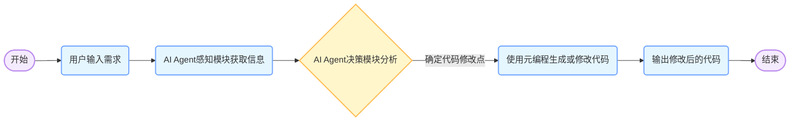

# 元编程：让AI Agent生成和修改代码

> 关键词：元编程、AI Agent、代码生成、代码修改、自动化编程

> 摘要：本文深入探讨了元编程以及如何利用AI Agent实现代码的生成和修改。首先介绍了元编程和AI Agent的背景知识，包括目的、预期读者、文档结构和相关术语。接着阐述了核心概念及其联系，通过示意图和流程图进行清晰展示。详细讲解了核心算法原理，并使用Python代码进行具体说明。同时给出了相关的数学模型和公式，并举例解释。在项目实战部分，从开发环境搭建到源代码实现与解读进行了全面剖析。分析了元编程在不同场景下的实际应用，推荐了学习资源、开发工具框架以及相关论文著作。最后总结了未来发展趋势与挑战，并提供常见问题解答和扩展阅读参考资料，旨在为读者全面呈现元编程与AI Agent结合的技术全貌。

## 1. 背景介绍 
### 1.1 目的和范围
元编程作为一种强大的编程技术，允许程序在运行时对自身进行操作，而AI Agent的出现为代码的生成和修改带来了新的可能性。本文的目的是深入探讨如何将元编程与AI Agent相结合，实现代码的自动化生成和修改。范围涵盖了元编程和AI Agent的核心概念、算法原理、数学模型、实际项目案例以及未来发展趋势等方面。通过本文的学习，读者将能够理解元编程与AI Agent结合的技术原理，并掌握相关的实践技能。

### 1.2 预期读者
本文预期读者包括软件开发人员、人工智能研究者、技术爱好者以及对自动化编程感兴趣的人群。无论是初学者想要了解元编程和AI Agent的基础知识，还是有一定经验的开发者希望探索如何利用这些技术提升编程效率，都能从本文中获得有价值的信息。

### 1.3 文档结构概述
本文将按照以下结构进行组织：首先介绍相关背景知识，包括目的、读者群体和文档结构等；接着阐述元编程和AI Agent的核心概念及其联系；详细讲解核心算法原理和具体操作步骤，并使用Python代码进行说明；给出相关的数学模型和公式，并举例解释；通过实际项目案例展示如何应用这些技术；分析元编程在不同场景下的实际应用；推荐学习资源、开发工具框架以及相关论文著作；最后总结未来发展趋势与挑战，提供常见问题解答和扩展阅读参考资料。

### 1.4 术语表
#### 1.4.1 核心术语定义
- **元编程**：元编程是一种编程技术，允许程序在运行时对自身进行操作，例如生成、修改或分析代码。它可以通过反射、宏等机制实现。
- **AI Agent**：AI Agent是一种能够感知环境、做出决策并采取行动的智能实体。在代码生成和修改的场景中，AI Agent可以根据输入的需求和上下文信息，自动生成或修改代码。
- **代码生成**：指根据特定的规则和需求，自动生成代码的过程。可以是生成整个程序，也可以是生成部分代码片段。
- **代码修改**：对已有的代码进行修改，以满足新的需求或修复存在的问题。

#### 1.4.2 相关概念解释
- **反射**：反射是元编程的一种实现机制，允许程序在运行时获取自身的信息，例如类的属性、方法等，并可以动态调用这些属性和方法。
- **宏**：宏是一种在编译时进行代码替换的机制，通过定义宏规则，可以在编译前对代码进行预处理，生成新的代码。
- **机器学习**：机器学习是人工智能的一个分支，通过让计算机从数据中学习模式和规律，从而实现预测和决策。在代码生成和修改中，机器学习可以用于训练AI Agent，使其能够根据输入的需求生成合适的代码。

#### 1.4.3 缩略词列表
- **AI**：Artificial Intelligence，人工智能
- **ML**：Machine Learning，机器学习

## 2. 核心概念与联系 

### 元编程的核心概念
元编程的核心思想是让程序能够自我操作和自我修改。它打破了传统编程中代码在编译时就固定不变的限制，允许程序在运行时动态地生成、修改和分析代码。元编程主要有两种实现方式：反射和宏。

反射机制允许程序在运行时获取自身的信息，例如类的结构、方法和属性等。通过反射，程序可以动态地调用方法、访问属性，甚至创建新的对象。例如，在Python中，可以使用`getattr()`和`setattr()`函数来动态访问和修改对象的属性。

宏是一种在编译时进行代码替换的机制。通过定义宏规则，编译器可以在编译前对代码进行预处理，将宏替换为实际的代码。宏可以简化代码的编写，提高代码的复用性。例如，在C语言中，可以使用`#define`来定义宏。

### AI Agent的核心概念
AI Agent是一种能够感知环境、做出决策并采取行动的智能实体。在代码生成和修改的场景中，AI Agent可以根据输入的需求和上下文信息，自动生成或修改代码。AI Agent通常由三个部分组成：感知模块、决策模块和行动模块。

感知模块负责获取环境信息，例如用户输入的需求、代码的上下文等。决策模块根据感知模块获取的信息，使用机器学习或其他算法做出决策，确定应该生成或修改哪些代码。行动模块根据决策模块的结果，执行相应的操作，例如生成新的代码、修改已有的代码等。

### 元编程与AI Agent的联系
元编程和AI Agent的结合可以实现更强大的代码生成和修改功能。元编程提供了程序自我操作的能力，而AI Agent则可以根据输入的需求和上下文信息，智能地做出决策，确定如何使用元编程来生成或修改代码。

例如，AI Agent可以通过感知模块获取用户输入的需求和代码的上下文信息，然后使用决策模块分析这些信息，确定需要生成或修改的代码部分。接着，AI Agent可以使用元编程的反射或宏机制，动态地生成或修改代码。通过这种方式，元编程和AI Agent的结合可以实现代码的自动化生成和修改，提高编程效率。

### 文本示意图
```plaintext
+----------------+          +----------------+
|    AI Agent    |          |    元编程     |
+----------------+          +----------------+
| 感知模块       |          | 反射机制       |
| 决策模块       | <------> | 宏机制         |
| 行动模块       |          |                |
+----------------+          +----------------+
```

### Mermaid流程图


## 3. 核心算法原理 & 具体操作步骤 

### 核心算法原理
在使用AI Agent进行代码生成和修改时，核心算法通常涉及到机器学习和自然语言处理技术。以下是一个基于机器学习的代码生成和修改算法的基本原理：

1. **数据收集**：收集大量的代码数据和对应的需求描述，作为训练数据。这些数据可以来自开源项目、代码库等。
2. **数据预处理**：对收集到的数据进行预处理，包括清洗、分词、标注等操作。将代码和需求描述转换为机器学习模型可以处理的格式。
3. **模型训练**：选择合适的机器学习模型，例如神经网络、决策树等，使用预处理后的数据进行训练。训练的目标是让模型能够根据输入的需求描述生成合适的代码。
4. **代码生成和修改**：在实际应用中，将用户输入的需求描述输入到训练好的模型中，模型根据输入生成相应的代码。然后使用元编程技术将生成的代码集成到现有的代码中，或者对现有代码进行修改。

### 具体操作步骤

#### 步骤1：数据收集
可以使用爬虫程序从开源代码库（如GitHub）中收集代码数据和对应的需求描述。以下是一个简单的Python爬虫示例，用于从GitHub上获取代码仓库的信息：

```python
import requests

def get_repo_info(repo_url):
    response = requests.get(repo_url)
    if response.status_code == 200:
        return response.json()
    else:
        return None

repo_url = 'https://api.github.com/repos/tensorflow/tensorflow'
repo_info = get_repo_info(repo_url)
if repo_info:
    print(repo_info)
```

#### 步骤2：数据预处理
对收集到的数据进行清洗，去除无用的字符和信息。然后使用分词工具对代码和需求描述进行分词，将其转换为单词序列。以下是一个简单的Python代码示例，用于对文本进行分词：

```python
import nltk
nltk.download('punkt')

def tokenize_text(text):
    tokens = nltk.word_tokenize(text)
    return tokens

text = "This is a sample sentence."
tokens = tokenize_text(text)
print(tokens)
```

#### 步骤3：模型训练
选择合适的机器学习模型，例如循环神经网络（RNN）或长短期记忆网络（LSTM），使用预处理后的数据进行训练。以下是一个简单的使用Keras库训练LSTM模型的示例：

```python
from keras.models import Sequential
from keras.layers import LSTM, Dense
import numpy as np

# 假设已经有了训练数据 X 和标签 y
X = np.random.rand(100, 10, 1)
y = np.random.randint(0, 2, 100)

model = Sequential()
model.add(LSTM(64, input_shape=(10, 1)))
model.add(Dense(1, activation='sigmoid'))

model.compile(loss='binary_crossentropy', optimizer='adam', metrics=['accuracy'])
model.fit(X, y, epochs=10, batch_size=32)
```

#### 步骤4：代码生成和修改
在实际应用中，将用户输入的需求描述输入到训练好的模型中，模型根据输入生成相应的代码。然后使用元编程技术将生成的代码集成到现有的代码中，或者对现有代码进行修改。以下是一个简单的Python元编程示例，用于动态创建类：

```python
class_name = 'MyClass'
attrs = {'x': 1, 'y': 2}

MyClass = type(class_name, (object,), attrs)
obj = MyClass()
print(obj.x, obj.y)
```

## 4. 数学模型和公式 & 详细讲解 & 举例说明 

### 机器学习模型的数学基础
在使用机器学习模型进行代码生成和修改时，常用的模型包括神经网络、决策树等。这里以神经网络为例，介绍其数学模型和公式。

#### 神经网络的基本结构
神经网络由输入层、隐藏层和输出层组成。每个神经元接收输入信号，经过加权求和和激活函数处理后，输出一个信号。

#### 前向传播公式
假设神经网络有 $L$ 层，第 $l$ 层有 $n_l$ 个神经元。第 $l$ 层第 $j$ 个神经元的输入为 $z_j^{(l)}$，输出为 $a_j^{(l)}$，权重为 $W^{(l)}$，偏置为 $b^{(l)}$。则前向传播公式如下：

$$
z_j^{(l)} = \sum_{i=1}^{n_{l-1}} W_{ji}^{(l)} a_i^{(l-1)} + b_j^{(l)}
$$

$$
a_j^{(l)} = f(z_j^{(l)})
$$

其中，$f$ 是激活函数，常用的激活函数有Sigmoid函数、ReLU函数等。

#### 损失函数
损失函数用于衡量模型的预测结果与真实标签之间的差异。常用的损失函数有均方误差（MSE）、交叉熵损失等。以交叉熵损失为例，假设模型的输出为 $\hat{y}$，真实标签为 $y$，则交叉熵损失公式如下：

$$
L(y, \hat{y}) = - \sum_{i=1}^{n} y_i \log(\hat{y}_i) + (1 - y_i) \log(1 - \hat{y}_i)
$$

#### 反向传播算法
反向传播算法用于更新神经网络的权重和偏置，以最小化损失函数。通过链式法则，计算损失函数对每个权重和偏置的梯度，然后使用梯度下降法更新权重和偏置。

### 举例说明
假设我们有一个简单的两层神经网络，输入层有2个神经元，隐藏层有3个神经元，输出层有1个神经元。输入数据为 $x = [x_1, x_2]$，隐藏层的权重为 $W^{(1)}$，偏置为 $b^{(1)}$，输出层的权重为 $W^{(2)}$，偏置为 $b^{(2)}$。

首先，计算隐藏层的输入和输出：

$$
z^{(1)} = W^{(1)} x + b^{(1)}
$$

$$
a^{(1)} = f(z^{(1)})
$$

然后，计算输出层的输入和输出：

$$
z^{(2)} = W^{(2)} a^{(1)} + b^{(2)}
$$

$$
\hat{y} = f(z^{(2)})
$$

假设真实标签为 $y$，则损失函数为：

$$
L(y, \hat{y}) = - y \log(\hat{y}) - (1 - y) \log(1 - \hat{y})
$$

通过反向传播算法，计算损失函数对 $W^{(1)}$、$b^{(1)}$、$W^{(2)}$ 和 $b^{(2)}$ 的梯度，然后使用梯度下降法更新这些参数，以最小化损失函数。

## 5. 项目实战：代码实际案例和详细解释说明 

### 5.1  开发环境搭建
在进行代码生成和修改的项目实战之前，需要搭建相应的开发环境。以下是搭建开发环境的步骤：

#### 安装Python
Python是一种常用的编程语言，许多机器学习和元编程库都支持Python。可以从Python官方网站（https://www.python.org/downloads/）下载并安装Python。

#### 安装机器学习库
常用的机器学习库包括TensorFlow、PyTorch、Scikit-learn等。可以使用pip命令安装这些库：

```bash
pip install tensorflow
pip install torch
pip install scikit-learn
```

#### 安装元编程相关库
在Python中，有许多元编程相关的库，例如`inspect`、`types`等。这些库通常是Python标准库的一部分，无需额外安装。

### 5.2  源代码详细实现和代码解读

#### 需求分析
假设我们要实现一个简单的代码生成工具，根据用户输入的需求描述，生成一个Python类。需求描述可以是类似于“创建一个名为Person的类，包含name和age属性，以及一个打印信息的方法”。

#### 代码实现
```python
import re

# 解析需求描述
def parse_requirement(requirement):
    class_name = re.search(r'名为(\w+)的类', requirement).group(1)
    attributes = re.findall(r'包含(\w+)属性', requirement)
    methods = re.findall(r'以及一个(\w+)的方法', requirement)
    return class_name, attributes, methods

# 生成代码
def generate_code(class_name, attributes, methods):
    code = f"class {class_name}:\n"
    code += "    def __init__(self, "
    code += ", ".join(attributes) + "):\n"
    for attr in attributes:
        code += f"        self.{attr} = {attr}\n"
    for method in methods:
        if method == '打印信息':
            code += f"    def {method}(self):\n"
            code += f"        print('Name: ', self.name, 'Age: ', self.age)\n"
    return code

# 主函数
def main():
    requirement = "创建一个名为Person的类，包含name和age属性，以及一个打印信息的方法"
    class_name, attributes, methods = parse_requirement(requirement)
    code = generate_code(class_name, attributes, methods)
    print(code)

if __name__ == "__main__":
    main()
```

#### 代码解读
1. **parse_requirement函数**：该函数用于解析用户输入的需求描述。使用正则表达式从需求描述中提取类名、属性和方法名。
2. **generate_code函数**：该函数根据解析得到的类名、属性和方法名，生成Python代码。首先定义类的初始化方法，将属性赋值给类的实例变量。然后根据方法名生成相应的方法代码。
3. **main函数**：该函数是程序的入口点，调用`parse_requirement`函数解析需求描述，调用`generate_code`函数生成代码，并打印生成的代码。

### 5.3  代码解读与分析
上述代码实现了一个简单的代码生成工具，通过解析用户输入的需求描述，生成相应的Python类代码。该工具使用了正则表达式进行需求描述的解析，使用字符串拼接的方式生成代码。

优点：
- 代码简单易懂，易于实现。
- 可以根据不同的需求描述生成不同的代码。

缺点：
- 正则表达式的匹配规则比较固定，对于复杂的需求描述可能无法准确解析。
- 代码生成的灵活性有限，只能生成简单的类和方法。

为了提高代码生成的准确性和灵活性，可以使用更复杂的自然语言处理技术，例如命名实体识别、语义分析等，对需求描述进行更深入的理解。同时，可以使用元编程技术，动态创建类和方法，提高代码生成的灵活性。

## 6. 实际应用场景 
### 软件开发
在软件开发中，元编程和AI Agent可以用于自动生成代码模板、测试用例等。例如，根据数据库表结构自动生成数据访问层的代码，根据接口文档自动生成客户端代码等。通过使用AI Agent，可以根据用户的需求和上下文信息，智能地生成合适的代码，提高开发效率。

### 代码维护和重构
在代码维护和重构过程中，AI Agent可以帮助开发人员识别代码中的问题，例如代码重复、性能瓶颈等，并根据问题提出相应的修改建议。使用元编程技术，可以自动修改代码，实现代码的自动化重构。

### 自动化测试
在自动化测试中，元编程和AI Agent可以用于自动生成测试用例。根据代码的结构和功能，AI Agent可以生成覆盖各种情况的测试用例，提高测试的覆盖率和效率。同时，使用元编程技术，可以动态修改测试用例，以适应代码的变化。

### 智能编程助手
元编程和AI Agent可以结合开发智能编程助手，为开发人员提供实时的代码提示、错误修复建议等功能。开发人员在编写代码时，智能编程助手可以根据输入的代码和上下文信息，预测开发人员的意图，并提供相应的代码建议，提高编程效率和代码质量。

## 7. 工具和资源推荐
### 7.1 学习资源推荐
#### 7.1.1 书籍推荐
- 《Python元编程》：深入介绍了Python中的元编程技术，包括反射、装饰器、元类等。
- 《人工智能：一种现代的方法》：全面介绍了人工智能的基本概念、算法和应用，包括机器学习、自然语言处理等。
- 《代码大全》：一本经典的软件开发书籍，涵盖了软件开发的各个方面，包括代码设计、代码质量等。

#### 7.1.2 在线课程
- Coursera上的“机器学习”课程：由斯坦福大学教授Andrew Ng主讲，是学习机器学习的经典课程。
- edX上的“人工智能基础”课程：介绍了人工智能的基本概念和算法，适合初学者学习。
- 慕课网上的“Python元编程实战”课程：通过实际案例介绍了Python中的元编程技术。

#### 7.1.3 技术博客和网站
- 博客园：一个技术博客平台，有许多软件开发和人工智能相关的文章。
- 开源中国：提供了大量的开源项目和技术文章，涵盖了软件开发的各个领域。
- Towards Data Science：一个专注于数据科学和机器学习的技术博客，有许多高质量的文章。

### 7.2 开发工具框架推荐
#### 7.2.1 IDE和编辑器
- PyCharm：一款专业的Python集成开发环境，提供了代码编辑、调试、代码分析等功能。
- Visual Studio Code：一款轻量级的代码编辑器，支持多种编程语言，有丰富的插件生态系统。
- Jupyter Notebook：一种交互式的开发环境，适合进行数据探索和模型训练。

#### 7.2.2 调试和性能分析工具
- pdb：Python的标准调试器，可以帮助开发人员调试代码。
- cProfile：Python的性能分析工具，可以分析代码的执行时间和内存使用情况。
- Py-Spy：一个轻量级的Python性能分析工具，可以实时监控Python程序的性能。

#### 7.2.3 相关框架和库
- TensorFlow：一个开源的机器学习框架，广泛应用于深度学习领域。
- PyTorch：另一个流行的深度学习框架，具有动态图的特点，易于使用和调试。
- NLTK：Python的自然语言处理工具包，提供了许多自然语言处理的功能，例如分词、词性标注等。

### 7.3 相关论文著作推荐
#### 7.3.1 经典论文
- 《Learning to Generate Code from Natural Language》：介绍了如何使用机器学习技术从自然语言生成代码。
- 《Program Synthesis with Large Language Models》：探讨了如何使用大型语言模型进行程序合成。
- 《Meta-Programming for Software Engineering》：研究了元编程在软件工程中的应用。

#### 7.3.2 最新研究成果
- 可以关注顶级的人工智能和软件工程会议，例如NeurIPS、ICSE等，获取最新的研究成果。
- 一些知名的研究机构和实验室，例如OpenAI、DeepMind等，也会发布相关的研究论文。

#### 7.3.3 应用案例分析
- 可以在GitHub上搜索相关的开源项目，了解元编程和AI Agent在实际项目中的应用案例。
- 一些技术博客和网站也会分享实际项目的经验和案例。

## 8. 总结：未来发展趋势与挑战
### 未来发展趋势
- **更强大的代码生成能力**：随着机器学习和自然语言处理技术的不断发展，AI Agent将能够更准确地理解用户的需求，生成更复杂、高质量的代码。
- **与其他技术的融合**：元编程和AI Agent将与其他技术，如区块链、物联网等融合，创造出更多的应用场景。
- **智能编程生态系统的建立**：将出现更多的智能编程工具和平台，形成一个完整的智能编程生态系统，为开发人员提供全方位的支持。

### 挑战
- **数据质量和数量**：机器学习模型的性能很大程度上依赖于数据的质量和数量。获取高质量、大规模的代码数据和需求描述数据是一个挑战。
- **模型的可解释性**：许多机器学习模型，如神经网络，是黑盒模型，难以解释其决策过程。在代码生成和修改的场景中，模型的可解释性至关重要。
- **安全性和可靠性**：自动生成和修改的代码可能存在安全漏洞和可靠性问题。如何确保生成的代码的安全性和可靠性是一个亟待解决的问题。

## 9. 附录：常见问题与解答
### 问题1：元编程和AI Agent的结合有什么优势？
元编程和AI Agent的结合可以实现更强大的代码生成和修改功能。元编程提供了程序自我操作的能力，而AI Agent可以根据输入的需求和上下文信息，智能地做出决策，确定如何使用元编程来生成或修改代码。通过这种方式，可以提高编程效率，减少人工编码的工作量。

### 问题2：使用机器学习模型进行代码生成和修改需要多少数据？
数据的数量和质量对机器学习模型的性能有很大影响。一般来说，需要大量的数据来训练模型，以提高模型的准确性和泛化能力。具体需要多少数据取决于模型的复杂度和任务的难度。

### 问题3：如何确保自动生成的代码的质量？
可以通过以下方法确保自动生成的代码的质量：
- 使用高质量的训练数据，提高模型的准确性。
- 对生成的代码进行严格的测试，包括单元测试、集成测试等。
- 引入代码审查机制，让开发人员对生成的代码进行审查。

### 问题4：元编程和AI Agent在实际项目中的应用有哪些限制？
元编程和AI Agent在实际项目中的应用存在以下限制：
- 对需求描述的理解能力有限，对于复杂的需求描述可能无法准确解析。
- 生成的代码可能存在安全漏洞和可靠性问题，需要进行额外的检查和验证。
- 开发和维护成本较高，需要具备一定的机器学习和元编程知识。

## 10. 扩展阅读 & 参考资料
- 《Python Cookbook》
- 《Effective Python》
- 《Hands-On Machine Learning with Scikit-Learn, Keras, and TensorFlow》
- https://www.python.org/doc/
- https://www.tensorflow.org/
- https://pytorch.org/

作者：AI天才研究院/AI Genius Institute & 禅与计算机程序设计艺术 /Zen And The Art of Computer Programming