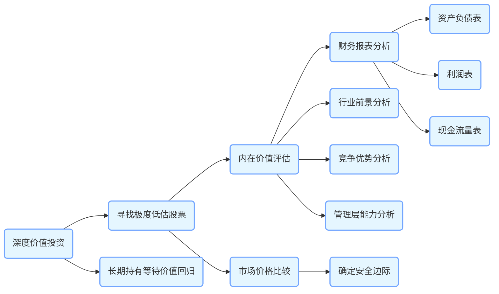

# 克里斯·布朗的深度价值投资：寻找极度低估的股票

> 关键词：深度价值投资、极度低估股票、克里斯·布朗、投资策略、股票估值

> 摘要：本文围绕克里斯·布朗的深度价值投资理念展开，详细探讨了其核心思想是如何寻找极度低估的股票。首先介绍了深度价值投资的背景，包括目的、预期读者、文档结构和相关术语。接着阐述了深度价值投资涉及的核心概念及它们之间的联系，通过文本示意图和 Mermaid 流程图进行清晰展示。深入剖析了核心算法原理，并给出 Python 代码示例。运用数学模型和公式对投资策略进行量化分析，并举例说明。通过项目实战，展示了在实际中如何搭建开发环境、实现代码并进行解读。探讨了深度价值投资的实际应用场景，推荐了相关的学习资源、开发工具框架和论文著作。最后总结了深度价值投资的未来发展趋势与挑战，还提供了常见问题解答和扩展阅读参考资料，旨在帮助投资者全面理解和运用克里斯·布朗的深度价值投资方法。

## 1. 背景介绍 
### 1.1 目的和范围
深度价值投资是一种旨在通过寻找被市场严重低估的股票来获取超额收益的投资策略。克里斯·布朗作为深度价值投资领域的知名人物，他的投资理念和方法具有重要的借鉴意义。本文的目的在于深入剖析克里斯·布朗的深度价值投资策略，详细阐述如何寻找极度低估的股票。范围涵盖了该投资策略的核心概念、算法原理、数学模型、实际应用案例以及相关的学习资源和工具推荐等方面。通过全面的介绍，帮助投资者更好地理解和运用这一投资策略，提高投资决策的准确性和成功率。

### 1.2 预期读者
本文预期读者主要包括对价值投资感兴趣的个人投资者、金融行业从业者、投资研究人员以及相关专业的学生。对于个人投资者而言，他们希望通过学习深度价值投资策略，优化自己的投资组合，实现资产的增值。金融行业从业者，如基金经理、分析师等，可以从本文中获取新的投资思路和方法，提升自己的专业能力。投资研究人员则可以将本文作为研究深度价值投资的参考资料，进一步探索该领域的理论和实践。相关专业的学生可以通过阅读本文，了解实际的投资策略和方法，为未来的职业发展打下基础。

### 1.3 文档结构概述
本文将按照以下结构进行组织：首先介绍深度价值投资的背景信息，包括目的、预期读者、文档结构和术语表。接着阐述深度价值投资的核心概念及其相互联系，并通过文本示意图和 Mermaid 流程图进行直观展示。然后深入分析核心算法原理，给出具体的 Python 代码实现。运用数学模型和公式对投资策略进行量化分析，并举例说明。通过项目实战，展示如何搭建开发环境、实现代码并进行详细解读。探讨深度价值投资的实际应用场景，推荐相关的学习资源、开发工具框架和论文著作。最后总结深度价值投资的未来发展趋势与挑战，提供常见问题解答和扩展阅读参考资料。

### 1.4 术语表
#### 1.4.1 核心术语定义
- **深度价值投资**：一种投资策略，专注于寻找市场价格远低于其内在价值的股票，通过长期持有等待价值回归获取收益。
- **极度低估股票**：指股票的市场价格相对于其内在价值存在极大的折扣，具有较高的投资安全边际。
- **内在价值**：股票所代表的企业的真实价值，通常通过对企业的财务状况、盈利能力、现金流等因素进行分析估算得出。
- **安全边际**：股票的内在价值与市场价格之间的差值，差值越大，投资的安全系数越高。

#### 1.4.2 相关概念解释
- **价值回归**：市场价格向内在价值靠拢的过程。当股票被低估时，随着市场对企业价值的重新认识，股票价格会逐渐上升至其内在价值水平。
- **财务报表分析**：对企业的资产负债表、利润表和现金流量表等财务报表进行分析，以评估企业的财务状况、经营成果和现金流量情况，为估算内在价值提供依据。
- **估值模型**：用于估算股票内在价值的数学模型，常见的有股息贴现模型、自由现金流贴现模型等。

#### 1.4.3 缩略词列表
- **DCF**：Discounted Cash Flow，现金流贴现法，一种常用的估值方法。
- **PE**：Price-to-Earnings Ratio，市盈率，反映股票价格与每股收益之间的比率。
- **PB**：Price-to-Book Ratio，市净率，反映股票价格与每股净资产之间的比率。

## 2. 核心概念与联系 

### 核心概念原理
深度价值投资的核心原理基于市场的无效性。市场并非总是能够准确反映股票的真实价值，由于各种因素，如投资者情绪、短期市场波动、信息不对称等，会导致一些股票的市场价格大幅低于其内在价值。深度价值投资者通过深入研究和分析，寻找这些被市场错误定价的股票，以较低的价格买入，等待市场发现其真实价值，从而实现价值回归，获取投资收益。

深度价值投资强调对企业内在价值的准确评估。内在价值是企业未来现金流量的现值，它反映了企业的真实盈利能力和资产状况。评估内在价值需要综合考虑多个因素，包括企业的财务报表、行业前景、竞争优势、管理层能力等。通过对这些因素的分析，投资者可以估算出企业的内在价值，并与当前的市场价格进行比较，判断股票是否被低估。

### 架构的文本示意图
```plaintext
深度价值投资
|
|-- 寻找极度低估股票
|   |
|   |-- 内在价值评估
|   |   |
|   |   |-- 财务报表分析
|   |   |   |
|   |   |   |-- 资产负债表
|   |   |   |-- 利润表
|   |   |   |-- 现金流量表
|   |   |
|   |   |-- 行业前景分析
|   |   |
|   |   |-- 竞争优势分析
|   |   |
|   |   |-- 管理层能力分析
|   |
|   |-- 市场价格比较
|       |
|       |-- 确定安全边际
|
|-- 长期持有等待价值回归
```

### Mermaid 流程图


## 3. 核心算法原理 & 具体操作步骤 

### 核心算法原理
深度价值投资的核心算法主要围绕股票内在价值的估算和安全边际的确定。常用的估算内在价值的方法是现金流贴现法（DCF），其基本原理是将企业未来的现金流量按照一定的贴现率折现到当前，得到企业的内在价值。

现金流贴现法的公式为：

$$V = \sum_{t=1}^{n} \frac{CF_t}{(1 + r)^t}$$

其中，$V$ 表示企业的内在价值，$CF_t$ 表示第 $t$ 期的现金流量，$r$ 表示贴现率，$n$ 表示预测期数。

在实际应用中，需要对企业未来的现金流量进行预测，并确定合适的贴现率。预测现金流量需要考虑企业的历史业绩、行业发展趋势、市场竞争情况等因素。贴现率则反映了投资者对投资风险的要求，通常可以使用加权平均资本成本（WACC）来确定。

### 具体操作步骤
1. **收集数据**：收集企业的财务报表、行业报告、市场数据等信息，为后续的分析和预测提供基础。
2. **财务报表分析**：对企业的资产负债表、利润表和现金流量表进行分析，了解企业的财务状况、经营成果和现金流量情况。计算关键财务指标，如毛利率、净利率、ROE（净资产收益率）等，评估企业的盈利能力和运营效率。
3. **行业前景分析**：研究企业所处的行业发展趋势、市场规模、竞争格局等，判断行业的增长潜力和风险。
4. **竞争优势分析**：分析企业的竞争优势，如品牌优势、技术优势、成本优势等，评估企业在行业中的竞争力。
5. **管理层能力分析**：考察企业管理层的经验、能力和决策水平，了解管理层的战略规划和执行能力。
6. **现金流量预测**：根据企业的历史业绩、行业前景和竞争优势等因素，对企业未来的现金流量进行预测。可以采用不同的预测方法，如趋势分析、情景分析等。
7. **贴现率确定**：确定合适的贴现率，通常可以使用加权平均资本成本（WACC）。WACC 的计算公式为：

$$WACC = E/V \times Re + D/V \times Rd \times (1 - Tc)$$

其中，$E$ 表示股权价值，$D$ 表示债务价值，$V = E + D$ 表示企业总价值，$Re$ 表示股权成本，$Rd$ 表示债务成本，$Tc$ 表示企业所得税税率。

8. **内在价值计算**：将预测的现金流量按照确定的贴现率折现到当前，得到企业的内在价值。
9. **市场价格比较**：将计算得到的内在价值与当前的市场价格进行比较，判断股票是否被低估。如果内在价值远高于市场价格，则说明股票可能被极度低估。
10. **确定安全边际**：计算内在价值与市场价格之间的差值，确定安全边际。安全边际越大，投资的风险越低。

### Python 代码示例
```python
import numpy as np

# 预测的现金流量
cash_flows = np.array([100, 120, 150, 180, 200])
# 贴现率
discount_rate = 0.1
# 预测期数
n = len(cash_flows)

# 计算内在价值
intrinsic_value = 0
for t in range(n):
    intrinsic_value += cash_flows[t] / ((1 + discount_rate) ** (t + 1))

print(f"内在价值: {intrinsic_value}")
```

## 4. 数学模型和公式 & 详细讲解 & 举例说明 

### 现金流贴现法（DCF）
现金流贴现法是深度价值投资中常用的估算内在价值的方法，其核心思想是将企业未来的现金流量按照一定的贴现率折现到当前，得到企业的内在价值。

#### 公式详细讲解
$$V = \sum_{t=1}^{n} \frac{CF_t}{(1 + r)^t}$$

- $V$：企业的内在价值，即企业未来现金流量的现值总和。
- $CF_t$：第 $t$ 期的现金流量，通常是预测的企业在未来第 $t$ 年产生的现金流量。现金流量可以是自由现金流（FCF），即企业在满足了所有必要的资本支出后剩余的现金流量。
- $r$：贴现率，反映了投资者对投资风险的要求。贴现率越高，说明投资者对风险的承受能力越低，对未来现金流量的折现程度越大。
- $n$：预测期数，即预测企业未来现金流量的年限。预测期数的选择需要根据企业的行业特点、发展阶段等因素进行合理确定。

#### 举例说明
假设一家企业未来 5 年的预测现金流量分别为 100 万元、120 万元、150 万元、180 万元和 200 万元，贴现率为 10%。则该企业的内在价值计算如下：

第 1 年现金流量的现值：$PV_1 = \frac{100}{(1 + 0.1)^1} \approx 90.91$（万元）

第 2 年现金流量的现值：$PV_2 = \frac{120}{(1 + 0.1)^2} \approx 99.17$（万元）

第 3 年现金流量的现值：$PV_3 = \frac{150}{(1 + 0.1)^3} \approx 112.70$（万元）

第 4 年现金流量的现值：$PV_4 = \frac{180}{(1 + 0.1)^4} \approx 122.94$（万元）

第 5 年现金流量的现值：$PV_5 = \frac{200}{(1 + 0.1)^5} \approx 124.18$（万元）

企业的内在价值：$V = PV_1 + PV_2 + PV_3 + PV_4 + PV_5 \approx 90.91 + 99.17 + 112.70 + 122.94 + 124.18 = 549.9$（万元）

### 加权平均资本成本（WACC）
加权平均资本成本是计算贴现率的常用方法，它反映了企业使用各种资本来源的平均成本。

#### 公式详细讲解
$$WACC = E/V \times Re + D/V \times Rd \times (1 - Tc)$$

- $E$：股权价值，即企业股东权益的市场价值。
- $D$：债务价值，即企业债务的市场价值。
- $V = E + D$：企业总价值，即股权价值与债务价值之和。
- $Re$：股权成本，即投资者要求的股权收益率。股权成本可以通过资本资产定价模型（CAPM）等方法计算。
- $Rd$：债务成本，即企业借款的利率。债务成本可以根据企业的债务合同确定。
- $Tc$：企业所得税税率，由于债务利息可以在税前扣除，因此需要考虑所得税的影响。

#### 举例说明
假设一家企业的股权价值为 800 万元，债务价值为 200 万元，股权成本为 12%，债务成本为 6%，企业所得税税率为 25%。则该企业的加权平均资本成本计算如下：

企业总价值：$V = E + D = 800 + 200 = 1000$（万元）

$E/V = 800/1000 = 0.8$

$D/V = 200/1000 = 0.2$

$WACC = 0.8 \times 12\% + 0.2 \times 6\% \times (1 - 25\%) = 9.6\% + 0.9\% = 10.5\%$

## 5. 项目实战：代码实际案例和详细解释说明 

### 5.1  开发环境搭建
#### 安装 Python
首先需要安装 Python 编程语言，建议使用 Python 3.7 及以上版本。可以从 Python 官方网站（https://www.python.org/downloads/）下载适合自己操作系统的安装包，按照安装向导进行安装。

#### 安装必要的库
在进行深度价值投资的项目实战中，需要使用一些 Python 库来处理数据和进行计算。可以使用以下命令来安装这些库：

```sh
pip install numpy pandas matplotlib requests
```

- `numpy`：用于进行数值计算和数组操作。
- `pandas`：用于数据处理和分析，提供了高效的数据结构和数据操作方法。
- `matplotlib`：用于数据可视化，绘制各种图表。
- `requests`：用于发送 HTTP 请求，获取网络数据。

### 5.2  源代码详细实现和代码解读
```python
import requests
import pandas as pd
import numpy as np
import matplotlib.pyplot as plt

# 定义获取财务数据的函数
def get_financial_data(ticker):
    url = f"https://financialmodelingprep.com/api/v3/income-statement/{ticker}?limit=5&apikey=your_api_key"
    response = requests.get(url)
    data = response.json()
    df = pd.DataFrame(data)
    return df

# 定义计算内在价值的函数
def calculate_intrinsic_value(cash_flows, discount_rate):
    n = len(cash_flows)
    intrinsic_value = 0
    for t in range(n):
        intrinsic_value += cash_flows[t] / ((1 + discount_rate) ** (t + 1))
    return intrinsic_value

# 主函数
def main():
    # 股票代码
    ticker = "AAPL"
    # 获取财务数据
    financial_data = get_financial_data(ticker)
    # 提取净利润作为现金流量
    cash_flows = financial_data['netIncome'].values[::-1]
    # 贴现率
    discount_rate = 0.1
    # 计算内在价值
    intrinsic_value = calculate_intrinsic_value(cash_flows, discount_rate)
    print(f"{ticker} 的内在价值: {intrinsic_value}")

    # 绘制现金流量图
    years = financial_data['date'].values[::-1]
    plt.plot(years, cash_flows)
    plt.xlabel('年份')
    plt.ylabel('现金流量')
    plt.title(f'{ticker} 现金流量图')
    plt.show()

if __name__ == "__main__":
    main()
```

### 代码解读与分析
#### `get_financial_data` 函数
该函数用于从 Financial Modeling Prep API 获取指定股票的财务数据。通过发送 HTTP 请求，获取 JSON 格式的财务数据，并将其转换为 Pandas DataFrame 进行处理。需要注意的是，需要替换 `your_api_key` 为自己的 API 密钥。

#### `calculate_intrinsic_value` 函数
该函数根据现金流贴现法计算股票的内在价值。接收现金流量数组和贴现率作为输入，通过循环计算每一期现金流量的现值，并将其累加得到内在价值。

#### `main` 函数
- 首先指定股票代码为 "AAPL"（苹果公司）。
- 调用 `get_financial_data` 函数获取财务数据。
- 提取净利润作为现金流量，并将其反转以保证时间顺序正确。
- 设定贴现率为 0.1。
- 调用 `calculate_intrinsic_value` 函数计算内在价值，并打印结果。
- 使用 `matplotlib` 库绘制现金流量图，直观展示企业的现金流量变化情况。

## 6. 实际应用场景 
### 个人投资
对于个人投资者来说，深度价值投资是一种长期投资策略，可以帮助他们寻找被市场低估的股票，构建稳健的投资组合。通过深入研究企业的基本面，个人投资者可以发现那些具有良好发展前景但暂时被市场忽视的股票，以较低的价格买入，等待价值回归，实现资产的增值。例如，在市场低迷时期，一些优质企业的股票价格可能会大幅下跌，但企业的内在价值并没有发生实质性变化。此时，深度价值投资者可以抓住机会买入这些股票，长期持有，获取丰厚的回报。

### 基金管理
基金经理可以运用深度价值投资策略来管理基金资产。通过筛选极度低估的股票，构建基金投资组合，提高基金的收益率。深度价值投资策略注重安全边际和长期投资，有助于降低基金的投资风险。例如，一些价值型基金通过深入研究企业的财务状况和行业前景，选择那些被市场低估的股票进行投资，在市场波动中表现出较好的抗风险能力。

### 企业并购
在企业并购领域，深度价值投资的理念也具有重要的应用价值。收购方可以通过评估目标企业的内在价值，寻找那些被市场低估的企业进行收购。通过整合资源、优化管理，提高目标企业的运营效率和盈利能力，实现企业价值的提升。例如，一些大型企业通过收购被低估的小型企业，拓展业务领域，实现协同效应，提升自身的市场竞争力。

## 7. 工具和资源推荐
### 7.1 学习资源推荐
#### 7.1.1 书籍推荐
- 《聪明的投资者》（The Intelligent Investor）：本杰明·格雷厄姆（Benjamin Graham）的经典著作，被誉为价值投资的圣经，详细阐述了价值投资的理念和方法。
- 《证券分析》（Security Analysis）：同样是本杰明·格雷厄姆的作品，是价值投资领域的奠基之作，对股票和债券的分析方法进行了深入探讨。
- 《巴菲特致股东的信》（Letters to Shareholders of Berkshire Hathaway）：沃伦·巴菲特（Warren Buffett）每年写给股东的信，包含了他的投资理念、策略和对市场的看法，是学习价值投资的宝贵资料。

#### 7.1.2 在线课程
- Coursera 上的“价值投资基础”（Foundations of Value Investing）课程：由知名教授授课，系统介绍价值投资的基本概念、方法和实践。
- edX 上的“投资分析与组合管理”（Investment Analysis and Portfolio Management）课程：涵盖了投资分析的各个方面，包括价值投资、技术分析等，有助于提升投资者的专业能力。

#### 7.1.3 技术博客和网站
- 雪球网（https://xueqiu.com/）：国内知名的投资社区，提供股票行情、财务数据、投资分析等信息，投资者可以在这里交流投资经验和观点。
- Seeking Alpha（https://seekingalpha.com/）：国外知名的投资研究网站，提供大量的股票分析报告和投资建议，有助于投资者了解市场动态和行业趋势。

### 7.2 开发工具框架推荐
#### 7.2.1 IDE和编辑器
- PyCharm：一款专业的 Python 集成开发环境，提供了丰富的代码编辑、调试和分析功能，适合进行深度价值投资的代码开发。
- Jupyter Notebook：一种交互式的开发环境，支持 Python 代码的编写、运行和可视化，方便进行数据探索和分析。

#### 7.2.2 调试和性能分析工具
- Py-Spy：一款轻量级的 Python 性能分析工具，可以实时监测 Python 程序的运行状态，找出性能瓶颈。
- PDB：Python 内置的调试器，可以帮助开发者定位和解决代码中的问题。

#### 7.2.3 相关框架和库
- Pandas：强大的数据处理和分析库，提供了高效的数据结构和数据操作方法，适合处理财务数据。
- NumPy：用于进行数值计算和数组操作的基础库，在深度价值投资的计算中发挥重要作用。
- Matplotlib：用于数据可视化的库，可以绘制各种图表，直观展示数据的特征和趋势。

### 7.3 相关论文著作推荐
#### 7.3.1 经典论文
- “The Theory of Investment Value”（投资价值理论）：由约翰·伯尔·威廉姆斯（John Burr Williams）撰写，提出了现金流贴现法的基本思想，对价值投资理论的发展产生了深远影响。
- “Value Investing: The Use of Historical Financial Statement Information to Separate Winners from Losers”（价值投资：利用历史财务报表信息区分赢家和输家）：探讨了如何利用财务报表信息进行价值投资，为投资者提供了实用的分析方法。

#### 7.3.2 最新研究成果
- 关注顶尖金融学术期刊，如《Journal of Finance》（金融期刊）、《Review of Financial Studies》（金融研究评论）等，了解深度价值投资领域的最新研究动态和成果。
- 参加金融学术会议，与行业专家和学者交流，获取最新的研究思路和方法。

#### 7.3.3 应用案例分析
- 研究知名价值投资者的投资案例，如巴菲特、芒格等的投资决策过程和方法，从中汲取经验和教训。
- 分析一些成功的深度价值投资项目，了解在实际应用中如何寻找极度低估的股票，实现投资收益的最大化。

## 8. 总结：未来发展趋势与挑战
### 未来发展趋势
- **数字化和智能化**：随着科技的不断发展，深度价值投资将越来越多地借助数字化和智能化工具。利用大数据、人工智能和机器学习等技术，可以更高效地收集和分析财务数据、行业信息和市场动态，提高投资决策的准确性和效率。例如，通过机器学习算法对大量的财务报表数据进行分析，挖掘潜在的投资机会；利用自然语言处理技术对新闻、研报等文本信息进行情感分析，了解市场情绪对股票价格的影响。
- **全球化投资**：全球经济一体化的趋势使得投资者可以更容易地进行全球化投资。深度价值投资者将目光投向全球市场，寻找那些在不同地区被低估的股票。通过分散投资，可以降低投资组合的风险，提高投资收益。例如，一些新兴市场国家的企业可能具有较高的成长潜力，但由于市场认知不足或其他原因，股票价格被低估。深度价值投资者可以通过研究这些市场，发现潜在的投资机会。
- **社会责任投资**：越来越多的投资者开始关注企业的社会责任和可持续发展。未来，深度价值投资可能会将企业的社会责任表现纳入投资决策的考虑因素。具有良好社会责任表现的企业可能更具长期投资价值，因为它们更容易获得消费者的信任和支持，降低经营风险。例如，一些环保、新能源等领域的企业，不仅具有良好的发展前景，还符合社会的可持续发展目标，可能会受到深度价值投资者的青睐。

### 挑战
- **数据质量和可靠性**：深度价值投资依赖于大量的财务数据和市场信息。然而，数据的质量和可靠性可能存在问题。财务报表可能存在造假、粉饰等情况，市场信息也可能存在误导性。投资者需要具备较强的数据分析能力和判断力，对数据进行深入挖掘和验证，以确保投资决策的准确性。
- **市场有效性的挑战**：随着市场的发展和信息传播的加速，市场的有效性可能会逐渐提高。这意味着寻找极度低估的股票将变得更加困难。投资者需要不断提升自己的研究能力和分析水平，挖掘那些隐藏在市场中的价值洼地。同时，需要关注市场的变化和趋势，及时调整投资策略。
- **宏观经济和政策风险**：宏观经济环境和政策变化对股票市场有着重要的影响。经济衰退、利率波动、政策调整等因素可能导致股票价格大幅波动，影响深度价值投资的收益。投资者需要密切关注宏观经济形势和政策动态，做好风险防范和应对措施。

## 9. 附录：常见问题与解答
### 问题 1：如何确定股票的内在价值？
答：确定股票的内在价值需要综合考虑多个因素。常用的方法是现金流贴现法（DCF），通过预测企业未来的现金流量，并按照一定的贴现率折现到当前，得到企业的内在价值。在预测现金流量时，需要分析企业的财务报表、行业前景、竞争优势等因素。贴现率的确定通常使用加权平均资本成本（WACC），反映了投资者对投资风险的要求。此外，还可以参考其他估值方法，如市盈率法、市净率法等，但这些方法相对较为简单，可能存在一定的局限性。

### 问题 2：深度价值投资是否适合短期投资？
答：深度价值投资是一种长期投资策略，不太适合短期投资。深度价值投资的核心是寻找被市场低估的股票，等待价值回归。价值回归的过程可能需要较长的时间，受到市场情绪、宏观经济环境等多种因素的影响。短期市场波动较大，难以准确判断股票价格的走势。因此，深度价值投资者通常需要具备耐心和长期投资的理念，持有股票数年甚至更长时间，以实现投资收益的最大化。

### 问题 3：如何评估企业的竞争优势？
答：评估企业的竞争优势可以从多个方面入手。首先，可以分析企业的品牌优势，具有知名品牌的企业通常更容易获得消费者的信任和认可，从而在市场竞争中占据优势。其次，考察企业的技术优势，掌握核心技术的企业可以提高生产效率、降低成本，推出更具竞争力的产品和服务。此外，还可以关注企业的成本优势、规模优势、渠道优势等。通过对企业的竞争优势进行评估，可以判断企业在行业中的地位和发展潜力，为投资决策提供依据。

### 问题 4：深度价值投资是否存在风险？
答：任何投资都存在风险，深度价值投资也不例外。虽然深度价值投资强调安全边际，通过寻找被低估的股票来降低投资风险，但仍然可能面临一些风险。例如，企业的基本面可能发生恶化，导致内在价值下降；市场环境可能发生变化，影响股票价格的走势；宏观经济和政策风险也可能对投资收益产生不利影响。因此，投资者在进行深度价值投资时，需要充分了解投资风险，做好风险防范和应对措施。

## 10. 扩展阅读 & 参考资料
### 扩展阅读
- 《怎样选择成长股》（Common Stocks and Uncommon Profits）：菲利普·费雪（Philip Fisher）的著作，介绍了寻找成长股的方法和技巧，与深度价值投资的理念相互补充。
- 《穷查理宝典》（Poor Charlie's Almanack）：收录了查理·芒格（Charlie Munger）的演讲和文章，包含了他的投资智慧和人生哲学，对投资者具有重要的启示作用。

### 参考资料
- Financial Modeling Prep API 文档：https://financialmodelingprep.com/developer/docs/
- Pandas 官方文档：https://pandas.pydata.org/docs/
- NumPy 官方文档：https://numpy.org/doc/
- Matplotlib 官方文档：https://matplotlib.org/stable/contents.html

作者：AI天才研究院/AI Genius Institute & 禅与计算机程序设计艺术 /Zen And The Art of Computer Programming