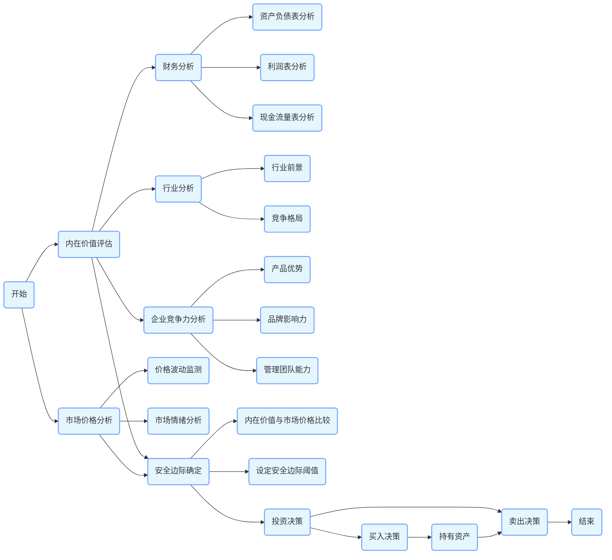

# 克里斯托弗·布朗的深度价值投资方法

> 关键词：克里斯托弗·布朗、深度价值投资、价值评估、投资策略、风险控制

> 摘要：本文深入探讨了克里斯托弗·布朗的深度价值投资方法。首先介绍了该方法提出的背景、适用范围以及预期读者群体等。接着阐述了深度价值投资的核心概念、相关联系和架构，通过 Mermaid 流程图进行直观展示。详细讲解了核心算法原理和具体操作步骤，并给出 Python 代码示例。对其中涉及的数学模型和公式进行了详细推导和举例说明。通过项目实战案例，展示了该投资方法在实际中的应用，包括开发环境搭建、源代码实现和代码解读。分析了深度价值投资方法的实际应用场景，推荐了相关的学习资源、开发工具框架以及论文著作。最后总结了该投资方法的未来发展趋势与挑战，还提供了常见问题解答和扩展阅读参考资料，旨在为投资者深入理解和应用克里斯托弗·布朗的深度价值投资方法提供全面的指导。

## 1. 背景介绍 
### 1.1 目的和范围
克里斯托弗·布朗的深度价值投资方法旨在为投资者提供一种通过挖掘被市场低估的资产来获取长期稳定收益的投资策略。其目的在于帮助投资者在复杂多变的金融市场中，找到那些具有坚实内在价值但由于各种原因被市场忽视或低估的投资机会。

该方法的范围涵盖了各类金融资产，包括股票、债券等。它适用于不同规模的投资组合，无论是个人投资者的小额资产配置，还是机构投资者的大规模资金运作，都可以借鉴这种投资方法来构建投资组合，以实现资产的保值增值。

### 1.2 预期读者
本文的预期读者主要包括以下几类人群：
- **个人投资者**：希望通过学习专业的投资方法，提高自己的投资水平，实现财富的稳健增长。他们可能缺乏系统的投资知识和经验，需要一种简单易懂且有效的投资策略来指导自己的投资决策。
- **金融从业者**：如股票分析师、基金经理等，他们可以从克里斯托弗·布朗的深度价值投资方法中获取新的思路和灵感，丰富自己的投资分析工具和方法体系，提升投资组合的管理能力。
- **金融专业学生**：通过学习这种投资方法，加深对金融市场和投资理论的理解，为未来从事金融相关工作打下坚实的基础。

### 1.3 文档结构概述
本文将按照以下结构进行详细阐述：
- 核心概念与联系：介绍深度价值投资的核心概念、原理以及各概念之间的联系，并通过文本示意图和 Mermaid 流程图进行直观展示。
- 核心算法原理 & 具体操作步骤：讲解深度价值投资方法的核心算法原理，并给出具体的操作步骤，同时使用 Python 源代码进行详细阐述。
- 数学模型和公式 & 详细讲解 & 举例说明：对深度价值投资方法中涉及的数学模型和公式进行详细推导和解释，并通过实际例子进行说明。
- 项目实战：通过一个实际的投资项目案例，展示深度价值投资方法在实际中的应用，包括开发环境搭建、源代码实现和代码解读。
- 实际应用场景：分析深度价值投资方法在不同金融市场环境下的实际应用场景和效果。
- 工具和资源推荐：推荐相关的学习资源、开发工具框架以及论文著作，帮助读者进一步深入学习和研究深度价值投资方法。
- 总结：未来发展趋势与挑战：总结深度价值投资方法的未来发展趋势，分析可能面临的挑战和问题。
- 附录：常见问题与解答：提供关于深度价值投资方法的常见问题解答，帮助读者解决在学习和应用过程中遇到的疑惑。
- 扩展阅读 & 参考资料：列出相关的扩展阅读材料和参考资料，方便读者进一步深入研究。

### 1.4 术语表
#### 1.4.1 核心术语定义
- **深度价值投资**：一种投资策略，通过对资产的内在价值进行深入分析和评估，寻找那些市场价格远低于其内在价值的资产进行投资，以获取长期的投资回报。
- **内在价值**：资产在合理的经济假设下所具有的真实价值，它是基于资产的未来现金流、盈利能力、资产质量等因素进行评估的结果。
- **安全边际**：指资产的市场价格低于其内在价值的幅度。安全边际越大，投资的风险越低，潜在的回报越高。
- **净流动资产**：指企业的流动资产减去全部负债后的余额，它反映了企业在短期内可以变现的资产净值。

#### 1.4.2 相关概念解释
- **市场效率**：指市场价格反映资产内在价值的程度。在有效市场中，市场价格能够及时、准确地反映资产的所有信息，因此很难找到被低估的资产。而深度价值投资方法则基于市场并非完全有效的假设，认为市场中存在着被错误定价的资产。
- **逆向投资**：与市场主流趋势相反的投资策略。当市场对某类资产过度悲观时，逆向投资者会选择买入；当市场对某类资产过度乐观时，逆向投资者会选择卖出。深度价值投资方法通常具有逆向投资的特点。

#### 1.4.3 缩略词列表
- **P/E**：市盈率（Price-to-Earnings Ratio），指股票价格与每股收益的比率，用于衡量股票的估值水平。
- **P/B**：市净率（Price-to-Book Ratio），指股票价格与每股净资产的比率，用于衡量股票相对于其账面价值的估值水平。
- **DCF**：现金流折现法（Discounted Cash Flow），一种用于评估资产内在价值的方法，通过将资产未来的现金流折现到当前来计算其价值。

## 2. 核心概念与联系 

### 核心概念原理
克里斯托弗·布朗的深度价值投资方法的核心原理是基于对资产内在价值的准确评估和对市场价格波动的理性分析。其核心思想在于，市场并非总是有效的，由于各种因素的影响，如投资者情绪、短期市场波动、信息不对称等，资产的市场价格可能会偏离其内在价值。深度价值投资者的任务就是通过深入的研究和分析，找出那些被市场低估的资产，并在价格低于其内在价值时买入，等待市场价格回归内在价值，从而获得投资回报。

深度价值投资方法强调对资产基本面的分析，包括企业的财务状况、盈利能力、行业竞争力、管理团队等方面。通过对这些因素的综合评估，可以估算出资产的内在价值。同时，为了降低投资风险，深度价值投资者通常会要求一定的安全边际，即市场价格要显著低于内在价值。

### 架构的文本示意图
```plaintext
深度价值投资方法
|-- 内在价值评估
|   |-- 财务分析
|   |   |-- 资产负债表分析
|   |   |-- 利润表分析
|   |   |-- 现金流量表分析
|   |-- 行业分析
|   |   |-- 行业前景
|   |   |-- 竞争格局
|   |-- 企业竞争力分析
|       |-- 产品优势
|       |-- 品牌影响力
|       |-- 管理团队能力
|-- 市场价格分析
|   |-- 价格波动监测
|   |-- 市场情绪分析
|-- 安全边际确定
|   |-- 内在价值与市场价格比较
|   |-- 设定安全边际阈值
|-- 投资决策
|   |-- 买入决策
|   |-- 卖出决策
```

### Mermaid 流程图


从流程图可以看出，深度价值投资方法的流程主要包括内在价值评估、市场价格分析、安全边际确定和投资决策四个主要环节。首先，通过对企业的财务状况、行业前景和企业竞争力等方面进行分析，评估资产的内在价值。同时，对市场价格的波动和市场情绪进行监测和分析。然后，将内在价值与市场价格进行比较，确定安全边际。最后，根据安全边际和投资目标做出买入或卖出的决策。

## 3. 核心算法原理 & 具体操作步骤 

### 核心算法原理
深度价值投资方法的核心算法原理主要围绕资产内在价值的评估和安全边际的确定。以下是几种常见的内在价值评估方法：

#### 1. 市盈率法（P/E 法）
市盈率法是一种简单常用的估值方法，其基本原理是通过比较同行业或类似企业的市盈率，来估算目标企业的价值。公式为：

$$V = EPS \times P/E$$

其中，$V$ 表示企业的内在价值，$EPS$ 表示每股收益，$P/E$ 表示市盈率。

#### 2. 市净率法（P/B 法）
市净率法是通过比较企业的市场价格与每股净资产的比率，来评估企业的价值。公式为：

$$V = BVPS \times P/B$$

其中，$V$ 表示企业的内在价值，$BVPS$ 表示每股净资产，$P/B$ 表示市净率。

#### 3. 现金流折现法（DCF 法）
现金流折现法是一种较为复杂但更为准确的估值方法，其基本原理是将企业未来的现金流折现到当前，以计算企业的内在价值。公式为：

$$V = \sum_{t=1}^{n} \frac{FCF_t}{(1 + r)^t} + \frac{TV}{(1 + r)^n}$$

其中，$V$ 表示企业的内在价值，$FCF_t$ 表示第 $t$ 期的自由现金流，$r$ 表示折现率，$n$ 表示预测期数，$TV$ 表示终值。

### 具体操作步骤

#### 1. 数据收集
收集目标企业的财务报表、行业数据、市场信息等相关资料。可以通过证券交易所网站、财经媒体、专业数据库等渠道获取数据。

#### 2. 财务分析
对企业的资产负债表、利润表和现金流量表进行分析，计算关键财务指标，如每股收益、每股净资产、自由现金流等。

#### 3. 行业分析
研究目标企业所处的行业环境，包括行业前景、竞争格局、市场规模等。可以参考行业研究报告、行业协会数据等。

#### 4. 内在价值评估
根据收集到的数据和分析结果，选择合适的估值方法（如 P/E 法、P/B 法或 DCF 法）来估算企业的内在价值。

#### 5. 市场价格分析
监测目标企业的市场价格波动情况，分析市场情绪对价格的影响。

#### 6. 安全边际确定
将估算的内在价值与市场价格进行比较，确定安全边际。一般来说，安全边际越大，投资风险越低。

#### 7. 投资决策
根据安全边际和投资目标，做出买入或卖出的决策。如果市场价格低于内在价值且安全边际达到设定的阈值，则考虑买入；如果市场价格高于内在价值或安全边际缩小到一定程度，则考虑卖出。

### Python 源代码示例
```python
import pandas as pd

# 假设已经获取到目标企业的财务数据
# 每股收益 (EPS)
eps = 2.5
# 同行业平均市盈率 (P/E)
pe_ratio = 15
# 每股净资产 (BVPS)
bvps = 10
# 同行业平均市净率 (P/B)
pb_ratio = 2

# 市盈率法估算内在价值
def pe_valuation(eps, pe_ratio):
    return eps * pe_ratio

# 市净率法估算内在价值
def pb_valuation(bvps, pb_ratio):
    return bvps * pb_ratio

# 计算内在价值
pe_value = pe_valuation(eps, pe_ratio)
pb_value = pb_valuation(bvps, pb_ratio)

# 假设当前市场价格
market_price = 30

# 计算安全边际
safety_margin_pe = (pe_value - market_price) / pe_value
safety_margin_pb = (pb_value - market_price) / pb_value

print(f"市盈率法估算的内在价值: {pe_value}")
print(f"市净率法估算的内在价值: {pb_value}")
print(f"市盈率法安全边际: {safety_margin_pe * 100:.2f}%")
print(f"市净率法安全边际: {safety_margin_pb * 100:.2f}%")

# 根据安全边际进行投资决策
if safety_margin_pe > 0.2 or safety_margin_pb > 0.2:
    print("建议买入")
else:
    print("建议观望")
```

在上述代码中，我们首先定义了每股收益、市盈率、每股净资产和市净率等参数。然后，使用市盈率法和市净率法分别估算企业的内在价值。接着，假设了当前的市场价格，并计算了两种方法下的安全边际。最后，根据安全边际的大小做出投资决策。

## 4. 数学模型和公式 & 详细讲解 & 举例说明 

### 市盈率法（P/E 法）
#### 公式
$$V = EPS \times P/E$$

#### 详细讲解
市盈率法的基本思想是，通过比较目标企业的每股收益和同行业或类似企业的市盈率，来估算目标企业的价值。市盈率反映了市场对企业盈利的预期，较高的市盈率通常表示市场对企业的未来盈利增长有较高的期望。

#### 举例说明
假设一家公司的每股收益为 $3$ 元，同行业平均市盈率为 $18$。则该公司的内在价值为：

$$V = 3 \times 18 = 54$$（元）

如果该公司的当前市场价格为 $45$ 元，则安全边际为：

$$\text{安全边际} = \frac{54 - 45}{54} \times 100\% = 16.67\%$$

### 市净率法（P/B 法）
#### 公式
$$V = BVPS \times P/B$$

#### 详细讲解
市净率法是通过比较企业的市场价格与每股净资产的比率，来评估企业的价值。每股净资产反映了企业的账面价值，市净率则反映了市场对企业净资产的估值。较低的市净率可能表示企业被低估。

#### 举例说明
假设一家公司的每股净资产为 $8$ 元，同行业平均市净率为 $2.5$。则该公司的内在价值为：

$$V = 8 \times 2.5 = 20$$（元）

如果该公司的当前市场价格为 $16$ 元，则安全边际为：

$$\text{安全边际} = \frac{20 - 16}{20} \times 100\% = 20\%$$

### 现金流折现法（DCF 法）
#### 公式
$$V = \sum_{t=1}^{n} \frac{FCF_t}{(1 + r)^t} + \frac{TV}{(1 + r)^n}$$

#### 详细讲解
现金流折现法的核心思想是，企业的价值等于其未来产生的自由现金流的现值之和。自由现金流是指企业在满足了所有必要的资本支出后剩余的现金流量，它反映了企业实际可用于分配给股东或用于再投资的现金。

折现率 $r$ 反映了投资的风险和机会成本，通常可以使用加权平均资本成本（WACC）来估算。终值 $TV$ 是指预测期结束后企业的价值，通常可以使用永续增长模型来估算。

#### 举例说明
假设一家公司未来 $5$ 年的自由现金流分别为 $100$ 万元、$120$ 万元、$140$ 万元、$160$ 万元和 $180$ 万元，折现率为 $10\%$，预测期结束后企业的自由现金流以 $3\%$ 的增长率永续增长。

首先，计算前 $5$ 年自由现金流的现值：

$$PV_1 = \frac{100}{(1 + 0.1)^1} = 90.91$$（万元）
$$PV_2 = \frac{120}{(1 + 0.1)^2} = 99.17$$（万元）
$$PV_3 = \frac{140}{(1 + 0.1)^3} = 105.18$$（万元）
$$PV_4 = \frac{160}{(1 + 0.1)^4} = 109.29$$（万元）
$$PV_5 = \frac{180}{(1 + 0.1)^5} = 111.73$$（万元）

然后，计算终值：

$$TV = \frac{180 \times (1 + 0.03)}{0.1 - 0.03} = 2657.14$$（万元）

终值的现值为：

$$PV_{TV} = \frac{2657.14}{(1 + 0.1)^5} = 1644.63$$（万元）

最后，计算企业的内在价值：

$$V = 90.91 + 99.17 + 105.18 + 109.29 + 111.73 + 1644.63 = 2160.91$$（万元）

如果该公司的当前市场价值为 $1800$ 万元，则安全边际为：

$$\text{安全边际} = \frac{2160.91 - 1800}{2160.91} \times 100\% = 16.7\%$$

## 5. 项目实战：代码实际案例和详细解释说明 

### 5.1  开发环境搭建
为了实现深度价值投资方法的项目实战，我们需要搭建一个合适的开发环境。以下是具体的步骤：

#### 1. 安装 Python
Python 是一种广泛使用的编程语言，具有丰富的科学计算和数据分析库。可以从 Python 官方网站（https://www.python.org/downloads/）下载并安装最新版本的 Python。

#### 2. 安装必要的库
我们需要安装一些必要的 Python 库，如 `pandas`、`numpy` 等，用于数据处理和分析。可以使用 `pip` 命令进行安装：

```sh
pip install pandas numpy
```

#### 3. 选择开发工具
可以选择使用 Jupyter Notebook 或 PyCharm 等开发工具。Jupyter Notebook 是一种交互式的开发环境，适合进行数据探索和分析；PyCharm 是一款专业的 Python 集成开发环境，适合进行大规模的项目开发。

### 5.2  源代码详细实现和代码解读
以下是一个使用 Python 实现深度价值投资方法的完整代码示例：

```python
import pandas as pd
import numpy as np

# 定义数据收集函数
def collect_data():
    # 模拟从数据库或 API 获取财务数据
    data = {
        'EPS': [2.5, 2.8, 3.0, 3.2, 3.5],
        'BVPS': [10, 11, 12, 13, 14],
        'Market_Price': [30, 32, 35, 38, 40]
    }
    df = pd.DataFrame(data)
    return df

# 定义市盈率法估值函数
def pe_valuation(eps, pe_ratio):
    return eps * pe_ratio

# 定义市净率法估值函数
def pb_valuation(bvps, pb_ratio):
    return bvps * pb_ratio

# 定义现金流折现法估值函数
def dcf_valuation(fcf, r, g):
    n = len(fcf)
    pv = []
    for i in range(n):
        pv.append(fcf[i] / ((1 + r) ** (i + 1)))
    tv = fcf[-1] * (1 + g) / (r - g)
    pv_tv = tv / ((1 + r) ** n)
    return sum(pv) + pv_tv

# 主函数
def main():
    # 收集数据
    df = collect_data()
    
    # 假设同行业平均市盈率和市净率
    pe_ratio = 15
    pb_ratio = 2
    
    # 假设折现率和永续增长率
    r = 0.1
    g = 0.03
    
    # 假设自由现金流
    fcf = [100, 120, 140, 160, 180]
    
    # 计算内在价值
    df['PE_Value'] = df['EPS'].apply(lambda x: pe_valuation(x, pe_ratio))
    df['PB_Value'] = df['BVPS'].apply(lambda x: pb_valuation(x, pb_ratio))
    dcf_value = dcf_valuation(fcf, r, g)
    
    # 计算安全边际
    df['PE_Safety_Margin'] = (df['PE_Value'] - df['Market_Price']) / df['PE_Value']
    df['PB_Safety_Margin'] = (df['PB_Value'] - df['Market_Price']) / df['PB_Value']
    
    # 投资决策
    df['PE_Decision'] = df['PE_Safety_Margin'].apply(lambda x: '买入' if x > 0.2 else '观望')
    df['PB_Decision'] = df['PB_Safety_Margin'].apply(lambda x: '买入' if x > 0.2 else '观望')
    
    print("市盈率法和市净率法估值结果:")
    print(df[['EPS', 'BVPS', 'Market_Price', 'PE_Value', 'PB_Value', 'PE_Safety_Margin', 'PB_Safety_Margin', 'PE_Decision', 'PB_Decision']])
    print(f"现金流折现法估值结果: {dcf_value}")

if __name__ == "__main__":
    main()
```

### 5.3  代码解读与分析
#### 1. 数据收集函数 `collect_data()`
该函数模拟从数据库或 API 获取财务数据，返回一个包含每股收益（`EPS`）、每股净资产（`BVPS`）和市场价格（`Market_Price`）的 `DataFrame`。

#### 2. 估值函数
- `pe_valuation(eps, pe_ratio)`：使用市盈率法估算企业的内在价值。
- `pb_valuation(bvps, pb_ratio)`：使用市净率法估算企业的内在价值。
- `dcf_valuation(fcf, r, g)`：使用现金流折现法估算企业的内在价值。

#### 3. 主函数 `main()`
- 调用 `collect_data()` 函数收集数据。
- 假设同行业平均市盈率和市净率、折现率和永续增长率，以及自由现金流。
- 计算不同方法下的内在价值。
- 计算安全边际。
- 根据安全边际做出投资决策。
- 打印估值结果和投资决策。

通过这个代码示例，我们可以看到如何使用 Python 实现深度价值投资方法的核心算法，并根据计算结果做出投资决策。

## 6. 实际应用场景 
克里斯托弗·布朗的深度价值投资方法在以下实际应用场景中具有重要的价值：

### 股票投资
在股票市场中，深度价值投资方法可以帮助投资者筛选出被低估的股票。通过对企业的财务状况、行业前景和内在价值进行深入分析，投资者可以找到那些市场价格低于其内在价值的股票，并在合适的时机买入。例如，在市场出现恐慌性下跌时，很多优质股票的价格可能会被过度打压，此时使用深度价值投资方法可以挖掘出这些被低估的股票，为投资者带来长期的投资回报。

### 基金投资
对于基金投资者来说，深度价值投资方法可以用于评估基金的投资组合。通过分析基金持有的股票或其他资产的内在价值和安全边际，投资者可以判断基金的投资策略是否符合深度价值投资的理念，从而选择合适的基金进行投资。

### 企业并购
在企业并购领域，深度价值投资方法可以帮助收购方评估目标企业的价值。通过对目标企业的财务报表、资产质量、盈利能力等方面进行分析，收购方可以确定目标企业的内在价值，并以此为基础进行谈判和定价。如果目标企业的市场价格低于其内在价值，收购方可以以较低的成本完成并购，从而获得潜在的协同效应和投资回报。

### 债券投资
在债券投资中，深度价值投资方法也可以发挥一定的作用。投资者可以通过分析债券发行人的财务状况、信用评级和现金流情况，评估债券的内在价值。如果债券的市场价格低于其内在价值，投资者可以考虑买入该债券，以获取固定的利息收益和潜在的资本增值。

### 资产配置
深度价值投资方法可以作为资产配置的一种策略。投资者可以将一部分资金分配到被低估的资产上，以降低投资组合的风险，并提高整体的投资回报。例如，在股票、债券、房地产等不同资产类别中，寻找那些具有较高安全边际的资产进行配置。

## 7. 工具和资源推荐
### 7.1 学习资源推荐
#### 7.1.1 书籍推荐
- 《聪明的投资者》（The Intelligent Investor）：本杰明·格雷厄姆（Benjamin Graham）的经典著作，被誉为价值投资的圣经，详细阐述了价值投资的基本理念和方法。
- 《证券分析》（Security Analysis）：同样是本杰明·格雷厄姆的著作，对证券的估值、分析和投资策略进行了系统的介绍。
- 《巴菲特致股东的信：股份公司教程》（The Essays of Warren Buffett: Lessons for Corporate America）：沃伦·巴菲特（Warren Buffett）历年致股东的信的汇编，从中可以学习到巴菲特的投资理念和方法。
- 《深度价值投资》（Deep Value: Why Activist Investors and Other Contrarians Battle for Control of Losing Corporations）：克里斯托弗·布朗（Christopher H. Browne）的著作，深入探讨了深度价值投资的方法和实践。

#### 7.1.2 在线课程
- Coursera 上的“投资学原理”（Principles of Investment）课程：由知名大学教授授课，涵盖了投资学的基本原理、估值方法和投资策略等内容。
- edX 上的“价值投资：从理论到实践”（Value Investing: From Theory to Practice）课程：系统介绍了价值投资的理论和实践，包括财务报表分析、估值模型和投资决策等方面。

#### 7.1.3 技术博客和网站
- Seeking Alpha：一个提供金融市场分析和投资建议的网站，有很多专业的投资者和分析师分享他们的研究成果和投资观点。
- GuruFocus：专注于价值投资的网站，提供企业的财务数据、估值分析和投资组合跟踪等功能。
- 雪球网：国内知名的投资社区，有很多投资者分享自己的投资经验和研究成果。

### 7.2 开发工具框架推荐
#### 7.2.1 IDE和编辑器
- Jupyter Notebook：一种交互式的开发环境，适合进行数据探索和分析，支持 Python、R 等多种编程语言。
- PyCharm：一款专业的 Python 集成开发环境，提供代码编辑、调试、版本控制等功能，适合进行大规模的项目开发。
- Visual Studio Code：一款轻量级的代码编辑器，支持多种编程语言和插件扩展，具有丰富的功能和良好的用户体验。

#### 7.2.2 调试和性能分析工具
- pdb：Python 自带的调试工具，可以帮助开发者定位和解决代码中的问题。
- cProfile：Python 的性能分析工具，可以分析代码的执行时间和函数调用情况，帮助开发者优化代码性能。
- Spyder：一款集成了代码编辑、调试和性能分析功能的 Python 开发环境，适合进行数据科学和机器学习项目的开发。

#### 7.2.3 相关框架和库
- pandas：一个强大的数据处理和分析库，提供了丰富的数据结构和数据操作方法，适合进行金融数据的处理和分析。
- numpy：Python 的数值计算库，提供了高效的数组和矩阵运算功能，是很多数据分析和机器学习库的基础。
- scikit-learn：一个常用的机器学习库，提供了各种机器学习算法和工具，可用于金融数据的建模和预测。

### 7.3 相关论文著作推荐
#### 7.3.1 经典论文
- “The Superinvestors of Graham-and-Doddsville”：沃伦·巴菲特的经典论文，通过分析格雷厄姆和多德的学生们的投资业绩，证明了价值投资的有效性。
- “Common Stocks and Uncommon Profits”：菲利普·费雪（Philip Fisher）的论文，提出了成长股投资的理念和方法。
- “Efficient Capital Markets: A Review of Theory and Empirical Work”：尤金·法玛（Eugene F. Fama）的论文，对有效市场假说进行了系统的阐述和总结。

#### 7.3.2 最新研究成果
- 关注《金融研究》《经济研究》等国内外知名金融学术期刊，以及 SSRN（Social Science Research Network）等学术平台，获取关于深度价值投资的最新研究成果。

#### 7.3.3 应用案例分析
- 可以参考一些专业的金融研究报告和案例分析书籍，了解深度价值投资方法在实际项目中的应用案例和经验教训。

## 8. 总结：未来发展趋势与挑战
### 未来发展趋势
#### 1. 与科技融合
随着科技的不断发展，深度价值投资方法将与大数据、人工智能等技术更加紧密地结合。通过利用大数据分析和人工智能算法，可以更快速、准确地收集和分析企业的财务数据、行业信息和市场动态，提高内在价值评估的准确性和效率。例如，使用自然语言处理技术对企业的新闻报道和公告进行情感分析，以了解市场情绪对企业价值的影响；使用机器学习算法对历史数据进行建模，预测企业的未来现金流和盈利情况。

#### 2. 全球投资机会增加
随着全球经济的一体化和金融市场的互联互通，深度价值投资方法将有更多的机会在全球范围内寻找被低估的资产。投资者可以通过跨境投资，参与不同国家和地区的市场，扩大投资组合的多样性，降低投资风险。同时，新兴市场的发展也为深度价值投资提供了更多的潜在机会，这些市场中的一些企业可能由于市场不成熟或信息不对称而被低估。

#### 3. 社会责任投资融入
未来，深度价值投资方法可能会更多地融入社会责任投资的理念。投资者不仅会关注企业的财务状况和内在价值，还会考虑企业的社会责任表现，如环境保护、员工福利、公司治理等方面。具有良好社会责任表现的企业可能会在长期内具有更高的稳定性和可持续发展能力，从而更符合深度价值投资的要求。

### 挑战
#### 1. 信息获取和分析难度加大
随着金融市场的复杂性不断增加，信息的获取和分析难度也越来越大。投资者需要面对海量的信息，如何从中筛选出有价值的信息，并进行准确的分析和判断，是一个巨大的挑战。此外，一些企业可能会通过财务造假等手段来粉饰财务报表，增加了投资者评估企业内在价值的难度。

#### 2. 市场有效性提高
虽然市场并非完全有效，但随着投资者教育水平的提高和信息传播的加速，市场的有效性可能会逐渐提高。这意味着被低估的资产可能会越来越难以找到，深度价值投资的机会可能会减少。投资者需要不断提高自己的分析能力和投资技巧，以在竞争激烈的市场中找到真正具有投资价值的资产。

#### 3. 宏观经济和政策不确定性
宏观经济环境和政策的不确定性对深度价值投资方法也会带来一定的挑战。例如，经济衰退、利率波动、政策调整等因素可能会对企业的盈利能力和市场价格产生重大影响，从而影响投资者对企业内在价值的评估和投资决策。投资者需要密切关注宏观经济和政策的变化，及时调整投资策略。

## 9. 附录：常见问题与解答
### 1. 深度价值投资方法是否适用于所有类型的投资者？
深度价值投资方法并不适用于所有类型的投资者。它需要投资者具备一定的财务知识和分析能力，能够对企业的基本面进行深入研究和评估。同时，深度价值投资通常需要较长的投资周期，投资者需要有足够的耐心和定力，能够承受市场价格的短期波动。因此，这种投资方法更适合那些具有一定投资经验、风险承受能力较强且追求长期稳定回报的投资者。

### 2. 如何确定安全边际的阈值？
安全边际的阈值并没有一个固定的标准，它取决于投资者的风险偏好、投资目标和市场环境等因素。一般来说，安全边际越大，投资的风险越低，但同时也可能会错过一些投资机会。投资者可以根据自己的经验和判断，结合市场的历史数据和行业特点，设定一个合理的安全边际阈值。例如，一些投资者可能会将安全边际阈值设定为 20% 或 30%，即当市场价格低于内在价值的 20% 或 30% 时，才考虑买入。

### 3. 现金流折现法中的折现率和永续增长率如何确定？
折现率反映了投资的风险和机会成本，通常可以使用加权平均资本成本（WACC）来估算。WACC 是企业债务成本和股权成本的加权平均值，其计算公式为：

$$WACC = w_d \times r_d \times (1 - t) + w_e \times r_e$$

其中，$w_d$ 和 $w_e$ 分别是债务和股权的权重，$r_d$ 是债务成本，$t$ 是企业所得税税率，$r_e$ 是股权成本。股权成本可以使用资本资产定价模型（CAPM）来估算：

$$r_e = r_f + \beta \times (r_m - r_f)$$

其中，$r_f$ 是无风险利率，$\beta$ 是股票的贝塔系数，$r_m$ 是市场收益率。

永续增长率是指企业在预测期结束后，自由现金流的长期增长率。永续增长率的确定需要考虑企业所处的行业特点、市场竞争格局和宏观经济环境等因素。一般来说，永续增长率不宜过高，通常在 2% - 5% 之间。

### 4. 深度价值投资方法与成长股投资方法有什么区别？
深度价值投资方法和成长股投资方法是两种不同的投资策略。深度价值投资方法侧重于寻找被市场低估的资产，关注企业的当前价值和安全边际，通常投资于那些业绩稳定、现金流充沛但市场价格较低的企业。而成长股投资方法则更注重企业的未来成长潜力，关注企业的营业收入和利润的增长速度，通常投资于那些具有高成长性的新兴企业。深度价值投资方法更强调风险控制和长期稳定回报，而成长股投资方法则更追求高收益，但同时也伴随着较高的风险。

## 10. 扩展阅读 & 参考资料
### 扩展阅读
- 《投资最重要的事》（The Most Important Thing Illuminated: Uncommon Sense for the Thoughtful Investor）：霍华德·马克斯（Howard Marks）的著作，分享了他在投资领域的经验和见解，对深度价值投资方法有一定的启发。
- 《金融炼金术》（The Alchemy of Finance）：乔治·索罗斯（George Soros）的著作，探讨了金融市场的运行规律和投资者的心理因素，有助于投资者更好地理解市场价格的波动和投资机会。
- 《漫步华尔街》（A Random Walk Down Wall Street）：伯顿·马尔基尔（Burton G. Malkiel）的著作，介绍了各种投资理论和策略，对投资者构建合理的投资组合有一定的指导作用。

### 参考资料
- 克里斯托弗·布朗（Christopher H. Browne）的相关研究论文和报告。
- 证券交易所的官方网站，如上海证券交易所（https://www.sse.com.cn/）、深圳证券交易所（https://www.szse.cn/）等，获取上市公司的财务报表和公告信息。
- 财经媒体，如新浪财经（https://finance.sina.com.cn/）、东方财富网（https://www.eastmoney.com/）等，获取金融市场的实时动态和分析评论。

作者：AI天才研究院/AI Genius Institute & 禅与计算机程序设计艺术 /Zen And The Art of Computer Programming