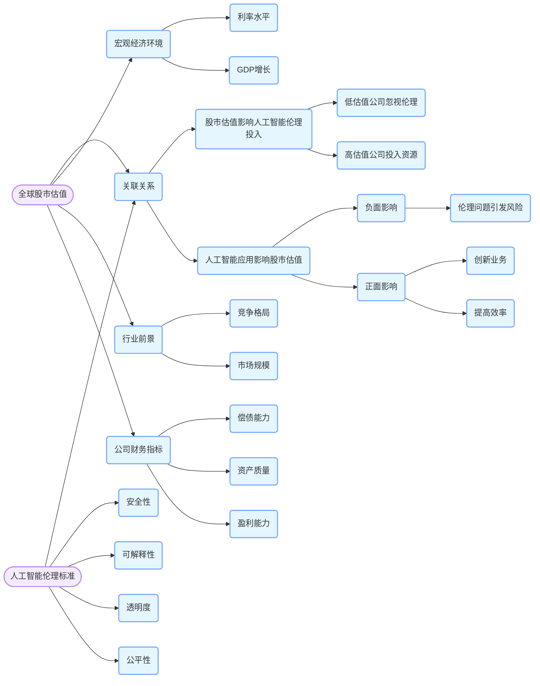

# 全球股市估值与人工智能伦理标准的关联

> 关键词：全球股市估值、人工智能伦理标准、关联分析、金融市场、人工智能应用

> 摘要：本文旨在深入探讨全球股市估值与人工智能伦理标准之间的关联。首先介绍了研究的背景、目的、预期读者等基本信息，阐述了核心概念及联系。接着详细分析了核心算法原理和具体操作步骤，并通过数学模型和公式进行说明。通过项目实战案例，展示了如何在实际中运用相关知识。探讨了该关联在实际中的应用场景，推荐了相关的学习资源、开发工具框架以及论文著作。最后总结了未来发展趋势与挑战，解答了常见问题并提供了扩展阅读和参考资料，为理解全球股市估值和人工智能伦理标准的相互关系提供了全面而深入的视角。

## 1. 背景介绍 
### 1.1 目的和范围
本研究的主要目的是揭示全球股市估值与人工智能伦理标准之间潜在的关联。随着人工智能在金融领域的广泛应用，其对股市的影响日益显著。同时，人工智能的伦理问题也受到了越来越多的关注。我们将深入分析这种关联的本质、影响因素以及可能带来的后果。研究范围涵盖了全球主要股票市场，包括纽约证券交易所、伦敦证券交易所、东京证券交易所等，同时考虑了不同行业和规模的企业在股市中的表现与人工智能伦理标准的关系。

### 1.2 预期读者
本文预期读者包括金融分析师、投资经理、人工智能研究人员、监管机构人员以及对金融市场和人工智能感兴趣的学者和爱好者。对于金融从业者，了解这种关联有助于他们在投资决策中考虑人工智能伦理因素；对于人工智能研究人员，能促使他们在开发和应用人工智能技术时更加关注伦理问题；对于监管机构，可为制定相关政策提供参考。

### 1.3 文档结构概述
本文将按照以下结构展开：首先介绍核心概念与联系，明确全球股市估值和人工智能伦理标准的定义及相互关系；接着阐述核心算法原理和具体操作步骤，提供实现关联分析的技术方法；然后通过数学模型和公式对关联进行量化分析；之后通过项目实战案例展示具体应用；探讨实际应用场景；推荐相关的工具和资源；最后总结未来发展趋势与挑战，解答常见问题并提供扩展阅读和参考资料。

### 1.4 术语表
#### 1.4.1 核心术语定义
- **全球股市估值**：指对全球范围内各个股票市场上上市公司的价值进行评估的过程和结果。通常通过市盈率（P/E）、市净率（P/B）等指标来衡量。
- **人工智能伦理标准**：是指在人工智能技术的研发、应用和管理过程中，为确保其符合人类的道德、法律和社会价值观而制定的一系列准则和规范。

#### 1.4.2 相关概念解释
- **市盈率（P/E）**：是指股票价格除以每股收益（EPS）的比率，反映了投资者为获取公司每一元盈利所愿意支付的价格。
- **市净率（P/B）**：是指股票价格与每股净资产的比率，用于评估股票相对于公司净资产的估值水平。
- **人工智能偏见**：指人工智能系统在处理数据和做出决策时，由于数据偏差、算法设计等原因，导致对某些群体或个体产生不公平的对待。

#### 1.4.3 缩略词列表
- **P/E**：市盈率（Price-to-Earnings Ratio）
- **P/B**：市净率（Price-to-Book Ratio）
- **AI**：人工智能（Artificial Intelligence）

## 2. 核心概念与联系 
### 核心概念原理
#### 全球股市估值原理
全球股市估值是基于对上市公司未来盈利能力、资产质量、市场竞争力等多方面因素的综合评估。投资者通过分析公司的财务报表、行业前景、宏观经济环境等信息，来判断股票的合理价值。常见的估值方法包括绝对估值法（如现金流折现法）和相对估值法（如市盈率法、市净率法）。

#### 人工智能伦理标准原理
人工智能伦理标准的制定旨在确保人工智能技术的发展和应用符合人类的利益和价值观。其核心原则包括公平性、透明度、可解释性、安全性等。公平性要求人工智能系统不产生歧视和偏见；透明度要求系统的决策过程和算法公开可查；可解释性要求能够对系统的决策结果进行合理的解释；安全性要求系统不会对人类造成危害。

### 架构的文本示意图
```plaintext
全球股市估值
|-- 公司财务指标
|   |-- 盈利能力
|   |-- 资产质量
|   |-- 偿债能力
|-- 行业前景
|   |-- 市场规模
|   |-- 竞争格局
|-- 宏观经济环境
|   |-- GDP增长
|   |-- 利率水平

人工智能伦理标准
|-- 公平性
|-- 透明度
|-- 可解释性
|-- 安全性

关联关系
|-- 人工智能应用影响股市估值
|   |-- 正面影响：提高效率、创新业务
|   |-- 负面影响：伦理问题引发风险
|-- 股市估值影响人工智能伦理投入
|   |-- 高估值公司更易投入资源
|   |-- 低估值公司可能忽视伦理
```

### Mermaid流程图


## 3. 核心算法原理 & 具体操作步骤 
### 核心算法原理
为了分析全球股市估值与人工智能伦理标准的关联，我们可以采用机器学习中的回归分析算法。回归分析可以建立股市估值指标（如市盈率、市净率）与人工智能伦理评估指标之间的数学关系。具体来说，我们可以将股市估值指标作为因变量，人工智能伦理评估指标作为自变量，通过最小二乘法来估计回归方程的参数。

### Python源代码详细阐述
```python
import pandas as pd
import numpy as np
from sklearn.linear_model import LinearRegression
from sklearn.model_selection import train_test_split
from sklearn.metrics import mean_squared_error

# 假设我们已经有了包含股市估值和人工智能伦理评估指标的数据集
# 数据集格式：每行代表一个样本，最后一列为股市估值指标，其余列为人工智能伦理评估指标
data = pd.read_csv('stock_ai_ethics.csv')

# 分离自变量（人工智能伦理评估指标）和因变量（股市估值指标）
X = data.iloc[:, :-1].values
y = data.iloc[:, -1].values

# 划分训练集和测试集
X_train, X_test, y_train, y_test = train_test_split(X, y, test_size=0.2, random_state=42)

# 创建线性回归模型
model = LinearRegression()

# 训练模型
model.fit(X_train, y_train)

# 在测试集上进行预测
y_pred = model.predict(X_test)

# 计算均方误差
mse = mean_squared_error(y_test, y_pred)
print(f"均方误差: {mse}")

# 查看回归系数
coefficients = model.coef_
intercept = model.intercept_
print(f"回归系数: {coefficients}")
print(f"截距: {intercept}")
```

### 具体操作步骤
1. **数据收集**：收集全球股市中上市公司的相关数据，包括股市估值指标（如市盈率、市净率）和人工智能伦理评估指标。人工智能伦理评估指标可以通过对公司的人工智能应用情况进行调查和评估得到。
2. **数据预处理**：对收集到的数据进行清洗、缺失值处理和标准化处理，以确保数据的质量和一致性。
3. **模型选择**：选择合适的回归分析模型，如线性回归、多项式回归等。在本示例中，我们选择了线性回归模型。
4. **模型训练**：将处理后的数据划分为训练集和测试集，使用训练集对模型进行训练。
5. **模型评估**：使用测试集对训练好的模型进行评估，计算评估指标（如均方误差），以评估模型的性能。
6. **结果分析**：分析回归系数和截距，了解人工智能伦理评估指标对股市估值指标的影响程度和方向。

## 4. 数学模型和公式 & 详细讲解 & 举例说明 
### 数学模型和公式
我们采用的线性回归模型可以表示为：
$$y = \beta_0 + \beta_1x_1 + \beta_2x_2 + \cdots + \beta_nx_n + \epsilon$$
其中，$y$ 是股市估值指标（如市盈率），$x_1, x_2, \cdots, x_n$ 是人工智能伦理评估指标，$\beta_0$ 是截距，$\beta_1, \beta_2, \cdots, \beta_n$ 是回归系数，$\epsilon$ 是误差项。

### 详细讲解
回归系数 $\beta_i$ 表示在其他自变量不变的情况下，自变量 $x_i$ 每增加一个单位，因变量 $y$ 的平均变化量。截距 $\beta_0$ 表示当所有自变量都为 0 时，因变量 $y$ 的取值。误差项 $\epsilon$ 表示模型无法解释的随机误差。

### 举例说明
假设我们有两个人工智能伦理评估指标：公平性得分 $x_1$ 和透明度得分 $x_2$，股市估值指标为市盈率 $y$。通过线性回归分析得到的回归方程为：
$$y = 10 + 2x_1 + 1.5x_2$$
这意味着，在其他条件不变的情况下，公平性得分每增加 1 分，市盈率平均增加 2 倍；透明度得分每增加 1 分，市盈率平均增加 1.5 倍。当公平性得分和透明度得分都为 0 时，市盈率为 10 倍。

## 5. 项目实战：代码实际案例和详细解释说明 
### 5.1  开发环境搭建
#### 安装Python
首先，需要安装Python编程语言。可以从Python官方网站（https://www.python.org/downloads/）下载适合自己操作系统的Python安装包，并按照安装向导进行安装。

#### 安装必要的库
使用以下命令安装本项目所需的Python库：
```bash
pip install pandas numpy scikit-learn
```

### 5.2  源代码详细实现和代码解读
```python
import pandas as pd
import numpy as np
from sklearn.linear_model import LinearRegression
from sklearn.model_selection import train_test_split
from sklearn.metrics import mean_squared_error

# 读取数据集
data = pd.read_csv('stock_ai_ethics.csv')

# 分离自变量和因变量
X = data.iloc[:, :-1].values
y = data.iloc[:, -1].values

# 划分训练集和测试集
X_train, X_test, y_train, y_test = train_test_split(X, y, test_size=0.2, random_state=42)

# 创建线性回归模型
model = LinearRegression()

# 训练模型
model.fit(X_train, y_train)

# 在测试集上进行预测
y_pred = model.predict(X_test)

# 计算均方误差
mse = mean_squared_error(y_test, y_pred)
print(f"均方误差: {mse}")

# 查看回归系数
coefficients = model.coef_
intercept = model.intercept_
print(f"回归系数: {coefficients}")
print(f"截距: {intercept}")
```

#### 代码解读
1. **导入必要的库**：导入 `pandas` 用于数据处理，`numpy` 用于数值计算，`sklearn.linear_model` 中的 `LinearRegression` 用于创建线性回归模型，`sklearn.model_selection` 中的 `train_test_split` 用于划分训练集和测试集，`sklearn.metrics` 中的 `mean_squared_error` 用于计算均方误差。
2. **读取数据集**：使用 `pd.read_csv` 函数读取包含股市估值和人工智能伦理评估指标的数据集。
3. **分离自变量和因变量**：使用 `iloc` 方法将数据集的自变量和因变量分离。
4. **划分训练集和测试集**：使用 `train_test_split` 函数将数据集划分为训练集和测试集，测试集占总数据集的 20%。
5. **创建线性回归模型**：使用 `LinearRegression` 类创建线性回归模型。
6. **训练模型**：使用 `fit` 方法对模型进行训练。
7. **在测试集上进行预测**：使用 `predict` 方法在测试集上进行预测。
8. **计算均方误差**：使用 `mean_squared_error` 函数计算预测值和真实值之间的均方误差。
9. **查看回归系数和截距**：使用 `coef_` 和 `intercept_` 属性查看回归系数和截距。

### 5.3  代码解读与分析
#### 均方误差分析
均方误差（MSE）是衡量模型预测误差的一个重要指标。MSE 值越小，说明模型的预测效果越好。在本项目中，我们可以通过比较不同模型的 MSE 值来选择最优模型。

#### 回归系数分析
回归系数反映了自变量对因变量的影响程度和方向。正的回归系数表示自变量与因变量呈正相关，负的回归系数表示自变量与因变量呈负相关。通过分析回归系数，我们可以了解人工智能伦理评估指标对股市估值指标的影响。

## 6. 实际应用场景 
### 投资决策
投资者在进行股票投资时，可以考虑公司的人工智能伦理表现。如果一家公司在人工智能应用中遵循较高的伦理标准，可能会具有更好的长期发展前景，其股票估值也可能更高。因此，投资者可以将人工智能伦理评估指标纳入投资决策模型，提高投资决策的准确性。

### 企业管理
企业管理者可以通过关注人工智能伦理标准，提高企业的声誉和竞争力。遵循人工智能伦理标准可以减少伦理风险，避免因伦理问题导致的法律诉讼和声誉损失。同时，良好的人工智能伦理表现也可以吸引更多的投资者和客户，从而提高企业的股市估值。

### 监管政策制定
监管机构可以根据全球股市估值与人工智能伦理标准的关联，制定相关的监管政策。例如，对人工智能应用中存在严重伦理问题的企业进行处罚，对遵循高伦理标准的企业给予奖励。通过监管政策的引导，可以促进人工智能技术的健康发展，维护金融市场的稳定。

## 7. 工具和资源推荐
### 7.1 学习资源推荐
#### 7.1.1 书籍推荐
- 《人工智能伦理》：本书系统地介绍了人工智能伦理的基本概念、原则和方法，对理解人工智能伦理标准具有重要的参考价值。
- 《金融市场学》：涵盖了金融市场的基本理论和实践，有助于读者了解全球股市估值的相关知识。

#### 7.1.2 在线课程
- Coursera上的“人工智能伦理”课程：由知名高校的教授授课，内容丰富，讲解详细。
- edX上的“金融市场分析”课程：提供了金融市场分析的实用方法和工具。

#### 7.1.3 技术博客和网站
- Towards Data Science：是一个专注于数据科学和人工智能的技术博客，经常发布有关人工智能伦理和金融数据分析的文章。
- Seeking Alpha：是一个金融投资领域的知名网站，提供了大量的股市分析和投资建议。

### 7.2 开发工具框架推荐
#### 7.2.1 IDE和编辑器
- PyCharm：是一款专业的Python集成开发环境，具有强大的代码编辑、调试和版本控制功能。
- Jupyter Notebook：是一个交互式的开发环境，适合进行数据探索和模型开发。

#### 7.2.2 调试和性能分析工具
- Py-Spy：可以对Python程序进行性能分析，找出程序中的性能瓶颈。
- PDB：是Python自带的调试工具，可以帮助开发者定位和解决代码中的问题。

#### 7.2.3 相关框架和库
- Scikit-learn：是一个常用的机器学习库，提供了丰富的机器学习算法和工具，方便进行回归分析等任务。
- Pandas：是一个强大的数据处理库，用于数据的清洗、转换和分析。

### 7.3 相关论文著作推荐
#### 7.3.1 经典论文
- “Artificial Intelligence and the Future of Ethics”：探讨了人工智能伦理的基本问题和发展趋势。
- “The Impact of Ethical AI on Financial Markets”：研究了人工智能伦理对金融市场的影响。

#### 7.3.2 最新研究成果
- 关注顶级学术期刊如《Journal of Financial Economics》《Artificial Intelligence》上的最新研究论文，了解全球股市估值与人工智能伦理标准关联的最新研究进展。

#### 7.3.3 应用案例分析
- 一些咨询公司和研究机构会发布关于人工智能伦理在金融领域应用的案例分析报告，可以从中了解实际应用中的经验和教训。

## 8. 总结：未来发展趋势与挑战
### 未来发展趋势
- **融合加深**：全球股市估值与人工智能伦理标准的关联将越来越紧密。随着人工智能在金融领域的进一步普及，其伦理问题对股市估值的影响将更加显著。
- **量化评估**：对人工智能伦理标准的量化评估将更加完善，使得投资者和监管机构能够更准确地衡量人工智能伦理对股市估值的影响。
- **跨领域合作**：金融领域和人工智能领域的专家将加强合作，共同研究和解决全球股市估值与人工智能伦理标准关联中的问题。

### 挑战
- **伦理标准制定难**：人工智能伦理标准的制定面临诸多挑战，不同国家和地区的文化、法律和价值观存在差异，难以形成统一的伦理标准。
- **数据获取困难**：获取准确、全面的人工智能伦理评估数据较为困难，这给关联分析带来了一定的障碍。
- **技术复杂性**：人工智能技术本身具有较高的复杂性，其伦理问题的分析和解决需要专业的技术知识和方法。

## 9. 附录：常见问题与解答
### 问题1：如何衡量人工智能伦理标准？
答：可以从公平性、透明度、可解释性、安全性等多个维度对人工智能伦理标准进行评估。例如，可以通过分析人工智能系统的算法设计、数据来源、决策过程等方面来评估其公平性和透明度。

### 问题2：人工智能伦理问题对股市估值的影响是短期还是长期的？
答：人工智能伦理问题对股市估值的影响可能既有短期的也有长期的。短期来看，严重的伦理问题可能会导致投资者的恐慌，从而使股票价格下跌；长期来看，遵循高伦理标准的企业可能会具有更好的发展前景，其股票估值也可能更高。

### 问题3：如何在投资决策中考虑人工智能伦理因素？
答：可以将人工智能伦理评估指标纳入投资决策模型，例如将公司的人工智能伦理得分作为一个重要的参考因素。同时，也可以关注行业内的人工智能伦理动态，了解不同公司在人工智能伦理方面的表现。

## 10. 扩展阅读 & 参考资料
### 扩展阅读
- 《人工智能时代的金融监管》
- 《金融科技与金融伦理》

### 参考资料
- 相关学术期刊和会议论文
- 金融监管机构发布的报告和政策文件
- 人工智能研究机构发布的研究报告

作者：AI天才研究院/AI Genius Institute & 禅与计算机程序设计艺术 /Zen And The Art of Computer Programming