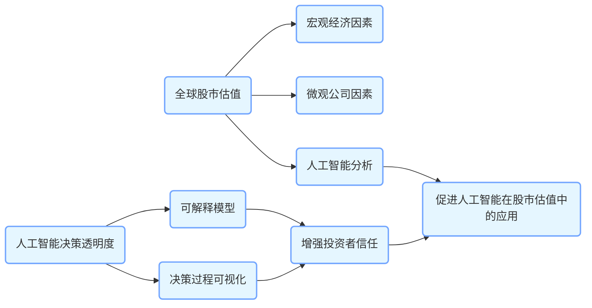

# 全球股市估值与人工智能决策透明度的关联

> 关键词：全球股市估值、人工智能决策透明度、关联分析、金融科技、机器学习

> 摘要：本文深入探讨了全球股市估值与人工智能决策透明度之间的关联。首先介绍了研究的背景、目的、预期读者和文档结构，对相关术语进行了详细解释。接着阐述了核心概念及其联系，给出了相应的文本示意图和 Mermaid 流程图。详细讲解了核心算法原理和具体操作步骤，并用 Python 代码进行了阐述。分析了相关的数学模型和公式，并举例说明。通过项目实战，展示了代码实际案例并进行详细解释。探讨了实际应用场景，推荐了学习资源、开发工具框架和相关论文著作。最后总结了未来发展趋势与挑战，提供了常见问题解答和扩展阅读参考资料，旨在为投资者和金融从业者提供全面的视角来理解两者之间的关系。

## 1. 背景介绍 
### 1.1 目的和范围
本研究的目的在于深入剖析全球股市估值与人工智能决策透明度之间的内在联系。全球股市估值反映了市场对上市公司价值的综合评估，受到众多因素的影响，如宏观经济环境、公司基本面等。而人工智能在金融领域的应用日益广泛，其决策过程的透明度对于投资者理解和信任人工智能辅助投资决策至关重要。本研究的范围涵盖了全球主要股票市场，包括美国、欧洲、亚洲等地区的股市，同时涉及人工智能在股市分析、投资决策等方面的应用。

### 1.2 预期读者
本文预期读者主要包括金融投资者、金融分析师、人工智能研究者、金融科技从业者以及对金融市场和人工智能交叉领域感兴趣的学者。投资者可以通过了解两者的关联，更好地利用人工智能工具进行投资决策；金融分析师可以借助研究结果改进股市估值模型；人工智能研究者可以从中获得在金融领域应用的新思路；金融科技从业者可以开发更具透明度和可靠性的金融产品；学者则可以将其作为进一步研究的参考。

### 1.3 文档结构概述
本文首先介绍研究的背景信息，包括目的、预期读者和文档结构。接着阐述核心概念，说明全球股市估值和人工智能决策透明度的定义和相互关系，并给出示意图和流程图。然后详细讲解核心算法原理和操作步骤，同时给出数学模型和公式。通过项目实战展示代码实现和解读。探讨实际应用场景，推荐相关的学习资源、开发工具和论文著作。最后总结未来发展趋势与挑战，提供常见问题解答和扩展阅读参考资料。

### 1.4 术语表
#### 1.4.1 核心术语定义
- **全球股市估值**：是指对全球范围内各个股票市场中上市公司股票价值的评估。它是通过多种方法和指标来衡量的，如市盈率（P/E）、市净率（P/B）等，反映了市场对公司未来盈利能力和资产价值的预期。
- **人工智能决策透明度**：指人工智能系统在进行投资决策等操作时，其决策过程和依据能够被人类理解和解释的程度。高透明度意味着投资者可以清楚地知道人工智能是如何得出投资建议的，低透明度则可能导致投资者对决策结果缺乏信任。

#### 1.4.2 相关概念解释
- **机器学习**：是人工智能的一个重要分支，它通过让计算机从数据中学习模式和规律，从而进行预测和决策。在股市估值和人工智能决策中，机器学习算法可以用于分析大量的市场数据，发现潜在的投资机会。
- **深度学习**：是一种基于人工神经网络的机器学习方法，它可以自动从大量数据中提取复杂的特征和模式。在金融领域，深度学习可以用于预测股票价格走势、分析市场情绪等。

#### 1.4.3 缩略词列表
- **P/E**：市盈率（Price-to-Earnings Ratio），是指股票价格除以每股收益的比率，用于衡量股票的估值水平。
- **P/B**：市净率（Price-to-Book Ratio），是指股票价格除以每股净资产的比率，反映了股票价格相对于公司净资产的倍数。
- **AI**：人工智能（Artificial Intelligence），是指计算机系统能够执行通常需要人类智能才能完成的任务的技术。

## 2. 核心概念与联系 

### 全球股市估值的概念
全球股市估值是一个复杂的概念，它涉及到多个方面的因素。从宏观层面来看，全球经济增长、利率水平、通货膨胀等因素会影响整个股市的估值。例如，当经济增长强劲时，企业的盈利能力通常会提高，股市估值也会相应上升；而当利率上升时，投资者更倾向于将资金存入银行，股市的吸引力会下降，估值可能会降低。

从微观层面来看，公司的基本面是影响其股票估值的重要因素。公司的盈利能力、资产质量、市场竞争力等都会影响投资者对其股票的估值。例如，一家盈利能力强、资产质量好的公司，其股票的估值通常会较高。

### 人工智能决策透明度的概念
人工智能决策透明度是指人工智能系统在做出决策时，能够向用户清晰地解释其决策过程和依据的程度。在金融领域，人工智能决策透明度尤为重要，因为投资者需要了解人工智能系统是如何得出投资建议的，以便做出合理的投资决策。

提高人工智能决策透明度的方法有很多种，例如使用可解释的机器学习模型、提供决策过程的可视化展示等。可解释的机器学习模型可以让投资者了解模型是如何根据输入数据得出输出结果的；决策过程的可视化展示可以让投资者直观地看到人工智能系统的决策过程。

### 两者的联系
全球股市估值与人工智能决策透明度之间存在着密切的联系。一方面，人工智能可以通过分析大量的市场数据，帮助投资者更准确地评估全球股市估值。例如，人工智能可以利用机器学习算法分析公司的财务报表、新闻报道等数据，预测公司的未来盈利能力，从而为投资者提供更准确的股市估值。

另一方面，人工智能决策透明度的提高可以增强投资者对人工智能辅助投资决策的信任。当投资者能够清楚地了解人工智能系统的决策过程和依据时，他们会更愿意接受人工智能的投资建议，从而更有效地利用人工智能来进行全球股市估值。

### 文本示意图
```plaintext
全球股市估值
|
|--宏观经济因素（经济增长、利率、通胀等）
|--微观公司因素（盈利能力、资产质量、竞争力等）
|
|--人工智能分析（数据挖掘、预测模型）
|
人工智能决策透明度
|
|--可解释模型
|--决策过程可视化
|
|--增强投资者信任
|--促进人工智能在股市估值中的应用
```

### Mermaid 流程图


## 3. 核心算法原理 & 具体操作步骤 

### 核心算法原理
在分析全球股市估值与人工智能决策透明度的关联时，我们可以使用机器学习算法来构建预测模型。其中，线性回归和决策树是常用的算法。

#### 线性回归
线性回归是一种用于建立自变量和因变量之间线性关系的统计方法。在股市估值中，我们可以将一些影响股市估值的因素作为自变量，如宏观经济指标、公司财务指标等，将股市估值作为因变量，建立线性回归模型。

线性回归模型的一般形式为：

$$y = \beta_0 + \beta_1x_1 + \beta_2x_2 + \cdots + \beta_nx_n + \epsilon$$

其中，$y$ 是因变量（股市估值），$x_1, x_2, \cdots, x_n$ 是自变量（影响股市估值的因素），$\beta_0, \beta_1, \cdots, \beta_n$ 是回归系数，$\epsilon$ 是误差项。

#### 决策树
决策树是一种基于树结构进行决策的机器学习算法。它通过对数据进行划分，构建一个树状结构，每个内部节点是一个特征上的测试，每个分支是测试输出，每个叶节点是一个类别或值。在股市估值中，决策树可以根据不同的特征对股票进行分类，预测其估值水平。

### 具体操作步骤

#### 数据收集
首先，我们需要收集全球股市的相关数据，包括宏观经济数据（如 GDP 增长率、利率、通货膨胀率等）、公司财务数据（如营业收入、净利润、资产负债率等）以及股市估值数据（如市盈率、市净率等）。可以从金融数据提供商（如 Bloomberg、Wind 等）获取这些数据。

#### 数据预处理
收集到的数据可能存在缺失值、异常值等问题，需要进行预处理。可以使用均值、中位数等方法填充缺失值，使用统计方法识别和处理异常值。同时，需要对数据进行标准化处理，将不同特征的数据缩放到相同的尺度上，以提高模型的性能。

#### 特征选择
从收集到的大量数据中选择与股市估值相关性较高的特征，去除冗余和无关的特征。可以使用相关性分析、特征重要性排序等方法进行特征选择。

#### 模型训练
使用选择好的特征和对应的股市估值数据，对线性回归和决策树模型进行训练。可以使用 Python 中的机器学习库（如 Scikit-learn）来实现模型的训练。

#### 模型评估
使用测试数据对训练好的模型进行评估，计算模型的性能指标，如均方误差（MSE）、决定系数（$R^2$）等。根据评估结果，调整模型的参数，优化模型的性能。

### Python 源代码实现
```python
import pandas as pd
from sklearn.model_selection import train_test_split
from sklearn.linear_model import LinearRegression
from sklearn.tree import DecisionTreeRegressor
from sklearn.metrics import mean_squared_error, r2_score

# 数据收集和读取（假设数据已经存储在 CSV 文件中）
data = pd.read_csv('stock_valuation_data.csv')

# 数据预处理
data = data.dropna()  # 删除含有缺失值的行

# 特征选择（假设选择了几个重要的特征）
features = ['GDP_growth', 'interest_rate', 'revenue', 'net_profit']
X = data[features]
y = data['PE_ratio']  # 以市盈率作为股市估值指标

# 数据划分
X_train, X_test, y_train, y_test = train_test_split(X, y, test_size=0.2, random_state=42)

# 线性回归模型训练
linear_model = LinearRegression()
linear_model.fit(X_train, y_train)

# 线性回归模型预测
linear_pred = linear_model.predict(X_test)

# 线性回归模型评估
linear_mse = mean_squared_error(y_test, linear_pred)
linear_r2 = r2_score(y_test, linear_pred)
print(f"线性回归模型均方误差: {linear_mse}")
print(f"线性回归模型决定系数: {linear_r2}")

# 决策树模型训练
tree_model = DecisionTreeRegressor()
tree_model.fit(X_train, y_train)

# 决策树模型预测
tree_pred = tree_model.predict(X_test)

# 决策树模型评估
tree_mse = mean_squared_error(y_test, tree_pred)
tree_r2 = r2_score(y_test, tree_pred)
print(f"决策树模型均方误差: {tree_mse}")
print(f"决策树模型决定系数: {tree_r2}")
```

## 4. 数学模型和公式 & 详细讲解 & 举例说明 

### 线性回归模型
线性回归模型的目标是找到一组回归系数 $\beta_0, \beta_1, \cdots, \beta_n$，使得预测值 $\hat{y}$ 与真实值 $y$ 之间的误差最小。通常使用最小二乘法来求解回归系数。

最小二乘法的目标是最小化误差平方和：

$$S(\beta) = \sum_{i=1}^{m}(y_i - \hat{y}_i)^2 = \sum_{i=1}^{m}(y_i - (\beta_0 + \beta_1x_{i1} + \beta_2x_{i2} + \cdots + \beta_nx_{in}))^2$$

其中，$m$ 是样本数量，$y_i$ 是第 $i$ 个样本的真实值，$\hat{y}_i$ 是第 $i$ 个样本的预测值。

通过对 $S(\beta)$ 求偏导数并令其等于 0，可以得到回归系数的估计值。对于简单线性回归（只有一个自变量），回归系数的计算公式为：

$$\beta_1 = \frac{\sum_{i=1}^{m}(x_i - \bar{x})(y_i - \bar{y})}{\sum_{i=1}^{m}(x_i - \bar{x})^2}$$

$$\beta_0 = \bar{y} - \beta_1\bar{x}$$

其中，$\bar{x}$ 和 $\bar{y}$ 分别是自变量和因变量的均值。

#### 举例说明
假设我们有一组关于股票市盈率（$y$）和公司营业收入（$x$）的数据，如下表所示：

| 营业收入（$x$） | 市盈率（$y$） |
| --- | --- |
| 100 | 20 |
| 200 | 30 |
| 300 | 40 |
| 400 | 50 |
| 500 | 60 |

首先，计算 $x$ 和 $y$ 的均值：

$$\bar{x} = \frac{100 + 200 + 300 + 400 + 500}{5} = 300$$

$$\bar{y} = \frac{20 + 30 + 40 + 50 + 60}{5} = 40$$

然后，计算 $\beta_1$：

$$\sum_{i=1}^{5}(x_i - \bar{x})(y_i - \bar{y}) = (100 - 300)(20 - 40) + (200 - 300)(30 - 40) + (300 - 300)(40 - 40) + (400 - 300)(50 - 40) + (500 - 300)(60 - 40) = 10000$$

$$\sum_{i=1}^{5}(x_i - \bar{x})^2 = (100 - 300)^2 + (200 - 300)^2 + (300 - 300)^2 + (400 - 300)^2 + (500 - 300)^2 = 100000$$

$$\beta_1 = \frac{10000}{100000} = 0.1$$

最后，计算 $\beta_0$：

$$\beta_0 = \bar{y} - \beta_1\bar{x} = 40 - 0.1 \times 300 = 10$$

所以，线性回归模型为 $y = 10 + 0.1x$。

### 决策树模型
决策树模型通过递归地划分数据来构建树结构。在每个内部节点，选择一个特征进行划分，使得划分后的子集具有较高的纯度。纯度可以使用基尼指数、信息熵等指标来衡量。

#### 基尼指数
基尼指数是一种衡量数据集纯度的指标，其计算公式为：

$$Gini(D) = 1 - \sum_{k=1}^{K}p_k^2$$

其中，$D$ 是数据集，$K$ 是类别数，$p_k$ 是第 $k$ 类样本在数据集 $D$ 中所占的比例。

在决策树的划分过程中，选择使得划分后子集的基尼指数之和最小的特征进行划分。

#### 信息熵
信息熵也是一种衡量数据集纯度的指标，其计算公式为：

$$Entropy(D) = - \sum_{k=1}^{K}p_k \log_2 p_k$$

同样，在决策树的划分过程中，选择使得划分后子集的信息熵之和最小的特征进行划分。

#### 举例说明
假设我们有一个关于股票是否值得投资的数据集，包含两个特征：市盈率（P/E）和市净率（P/B），以及一个类别标签：值得投资（1）或不值得投资（0）。数据集如下表所示：

| 市盈率（P/E） | 市净率（P/B） | 是否值得投资 |
| --- | --- | --- |
| 10 | 1.5 | 1 |
| 20 | 2.0 | 1 |
| 30 | 2.5 | 0 |
| 40 | 3.0 | 0 |

首先，计算原始数据集的基尼指数：

$$p_1 = \frac{2}{4} = 0.5$$
$$p_0 = \frac{2}{4} = 0.5$$
$$Gini(D) = 1 - (0.5^2 + 0.5^2) = 0.5$$

然后，分别考虑以市盈率和市净率进行划分。假设以市盈率 25 为划分点，划分后的两个子集为：

子集 1：市盈率小于 25，包含样本（10，1.5，1）和（20，2.0，1）
$$p_1 = \frac{2}{2} = 1$$
$$p_0 = \frac{0}{2} = 0$$
$$Gini(D_1) = 1 - (1^2 + 0^2) = 0$$

子集 2：市盈率大于等于 25，包含样本（30，2.5，0）和（40，3.0，0）
$$p_1 = \frac{0}{2} = 0$$
$$p_0 = \frac{2}{2} = 1$$
$$Gini(D_2) = 1 - (0^2 + 1^2) = 0$$

划分后的基尼指数之和为：

$$Gini_{split} = \frac{2}{4} \times 0 + \frac{2}{4} \times 0 = 0$$

由于划分后的基尼指数之和小于原始数据集的基尼指数，所以选择以市盈率 25 作为划分点。

## 5. 项目实战：代码实际案例和详细解释说明 

### 5.1  开发环境搭建
#### 操作系统
可以选择 Windows、Linux 或 macOS 操作系统。建议使用 Linux 系统，因为它在数据处理和机器学习方面具有更好的性能和稳定性。

#### Python 环境
安装 Python 3.7 或更高版本。可以从 Python 官方网站（https://www.python.org/downloads/）下载并安装。

#### 虚拟环境
建议使用虚拟环境来管理项目的依赖。可以使用 `venv` 或 `conda` 来创建虚拟环境。以下是使用 `venv` 创建虚拟环境的示例：

```bash
python -m venv stock_valuation_env
source stock_valuation_env/bin/activate  # 在 Linux 或 macOS 上
stock_valuation_env\Scripts\activate  # 在 Windows 上
```

#### 安装依赖库
在虚拟环境中安装所需的依赖库，包括 `pandas`、`scikit-learn` 等。可以使用 `pip` 来安装：

```bash
pip install pandas scikit-learn
```

### 5.2  源代码详细实现和代码解读
```python
import pandas as pd
from sklearn.model_selection import train_test_split
from sklearn.linear_model import LinearRegression
from sklearn.tree import DecisionTreeRegressor
from sklearn.metrics import mean_squared_error, r2_score

# 数据收集和读取（假设数据已经存储在 CSV 文件中）
data = pd.read_csv('stock_valuation_data.csv')

# 代码解读：使用 pandas 库的 read_csv 函数读取存储在 CSV 文件中的股市估值数据。

# 数据预处理
data = data.dropna()  # 删除含有缺失值的行

# 代码解读：使用 dropna 方法删除数据集中含有缺失值的行，以避免缺失值对模型训练的影响。

# 特征选择（假设选择了几个重要的特征）
features = ['GDP_growth', 'interest_rate', 'revenue', 'net_profit']
X = data[features]
y = data['PE_ratio']  # 以市盈率作为股市估值指标

# 代码解读：选择了 GDP 增长率、利率、营业收入和净利润作为特征，将市盈率作为目标变量。

# 数据划分
X_train, X_test, y_train, y_test = train_test_split(X, y, test_size=0.2, random_state=42)

# 代码解读：使用 train_test_split 函数将数据集划分为训练集和测试集，测试集占总数据集的 20%。

# 线性回归模型训练
linear_model = LinearRegression()
linear_model.fit(X_train, y_train)

# 代码解读：创建线性回归模型对象，并使用训练集数据对模型进行训练。

# 线性回归模型预测
linear_pred = linear_model.predict(X_test)

# 代码解读：使用训练好的线性回归模型对测试集数据进行预测。

# 线性回归模型评估
linear_mse = mean_squared_error(y_test, linear_pred)
linear_r2 = r2_score(y_test, linear_pred)
print(f"线性回归模型均方误差: {linear_mse}")
print(f"线性回归模型决定系数: {linear_r2}")

# 代码解读：使用 mean_squared_error 函数计算线性回归模型的均方误差，使用 r2_score 函数计算决定系数，并打印评估结果。

# 决策树模型训练
tree_model = DecisionTreeRegressor()
tree_model.fit(X_train, y_train)

# 代码解读：创建决策树回归模型对象，并使用训练集数据对模型进行训练。

# 决策树模型预测
tree_pred = tree_model.predict(X_test)

# 代码解读：使用训练好的决策树模型对测试集数据进行预测。

# 决策树模型评估
tree_mse = mean_squared_error(y_test, tree_pred)
tree_r2 = r2_score(y_test, tree_pred)
print(f"决策树模型均方误差: {tree_mse}")
print(f"决策树模型决定系数: {tree_r2}")

# 代码解读：使用 mean_squared_error 函数计算决策树模型的均方误差，使用 r2_score 函数计算决定系数，并打印评估结果。
```

### 5.3  代码解读与分析
#### 数据处理部分
- `pd.read_csv` 函数用于读取存储在 CSV 文件中的数据，方便对数据进行后续处理。
- `data.dropna()` 方法用于删除含有缺失值的行，保证数据的完整性。
- 特征选择部分选择了与股市估值相关的重要特征，有助于提高模型的准确性。

#### 模型训练部分
- `LinearRegression()` 创建线性回归模型对象，`fit` 方法用于训练模型。
- `DecisionTreeRegressor()` 创建决策树回归模型对象，同样使用 `fit` 方法进行训练。

#### 模型评估部分
- `mean_squared_error` 函数用于计算模型预测值与真实值之间的均方误差，反映了模型的预测误差大小。
- `r2_score` 函数用于计算决定系数，衡量了模型对数据的拟合程度。

通过比较线性回归模型和决策树模型的评估结果，可以选择性能更优的模型用于股市估值预测。

## 6. 实际应用场景 
### 投资者决策支持
对于个人投资者和机构投资者来说，了解全球股市估值与人工智能决策透明度的关联可以帮助他们做出更明智的投资决策。通过使用人工智能工具对股市估值进行分析，投资者可以更准确地评估股票的价值，发现潜在的投资机会。同时，高透明度的人工智能决策可以让投资者清楚地了解决策的依据，增强他们对投资建议的信任。

例如，投资者可以使用人工智能系统分析全球股市的市盈率、市净率等估值指标，结合宏观经济数据和公司基本面信息，筛选出被低估的股票。人工智能系统可以提供详细的分析报告，解释其决策过程和依据，帮助投资者做出投资决策。

### 金融机构风险管理
金融机构在进行投资组合管理和风险管理时，需要准确评估股市估值的变化。人工智能可以通过分析大量的市场数据，帮助金融机构预测股市的走势，及时调整投资组合，降低风险。同时，提高人工智能决策的透明度可以让金融机构更好地理解风险的来源和影响因素，加强风险管理。

例如，银行可以使用人工智能系统对其持有的股票投资组合进行实时监控，根据股市估值的变化及时调整投资比例。人工智能系统可以提供风险评估报告，解释其对风险的判断依据，帮助银行管理层做出风险管理决策。

### 监管机构监督
监管机构需要对金融市场进行监督，确保市场的公平、公正和透明。了解全球股市估值与人工智能决策透明度的关联可以帮助监管机构更好地监管人工智能在金融领域的应用。监管机构可以要求金融机构提高人工智能决策的透明度，加强对人工智能算法的审查，防范金融风险。

例如，证券监管机构可以制定相关的法规和标准，要求金融机构在使用人工智能进行投资决策时，公开其决策过程和依据，接受监管机构的监督。监管机构可以对人工智能算法进行评估，确保其符合公平、公正和透明的原则。

## 7. 工具和资源推荐
### 7.1 学习资源推荐
#### 7.1.1 书籍推荐
- 《机器学习》（周志华著）：这本书是机器学习领域的经典教材，系统地介绍了机器学习的基本概念、算法和应用。书中涵盖了线性回归、决策树等常用的机器学习算法，适合初学者和有一定基础的读者阅读。
- 《Python 数据分析实战》（作者： Wes McKinney）：本书介绍了如何使用 Python 进行数据分析，包括数据收集、清洗、处理和可视化等方面的内容。书中还介绍了使用 Pandas、Numpy 等库进行数据分析的方法，对于学习金融数据分析非常有帮助。
- 《深度学习》（Ian Goodfellow、Yoshua Bengio 和 Aaron Courville 著）：这本书是深度学习领域的权威著作，详细介绍了深度学习的基本原理、算法和应用。对于想要深入了解人工智能在金融领域应用的读者来说，是一本很好的参考书。

#### 7.1.2 在线课程
- Coursera 上的 “机器学习” 课程（Andrew Ng 教授授课）：这是一门非常经典的机器学习课程，通过视频讲解、编程作业等方式，系统地介绍了机器学习的基本概念和算法。课程内容丰富，适合初学者学习。
- edX 上的 “Python 数据科学” 课程：该课程介绍了如何使用 Python 进行数据科学研究，包括数据处理、数据分析、机器学习等方面的内容。课程结合实际案例进行讲解，具有很强的实践性。
- Udemy 上的 “金融科技：人工智能在金融领域的应用” 课程：这门课程专门介绍了人工智能在金融领域的应用，包括股市估值、风险管理等方面的内容。课程由行业专家授课，内容实用。

#### 7.1.3 技术博客和网站
- Medium：Medium 上有很多关于人工智能、金融科技等领域的技术博客，作者来自不同的行业和背景，分享了很多有价值的观点和经验。
- Towards Data Science：这是一个专注于数据科学和机器学习的网站，上面有很多关于数据分析、机器学习算法、金融数据分析等方面的文章，内容丰富且具有一定的深度。
- Kaggle：Kaggle 是一个数据科学竞赛平台，上面有很多关于金融数据分析的竞赛和数据集。通过参与竞赛和学习他人的解决方案，可以提高自己的数据分析和机器学习能力。

### 7.2 开发工具框架推荐
#### 7.2.1 IDE和编辑器
- PyCharm：PyCharm 是一款专门为 Python 开发设计的集成开发环境（IDE），具有代码编辑、调试、版本控制等功能。它提供了丰富的插件和工具，方便开发者进行 Python 项目的开发。
- Jupyter Notebook：Jupyter Notebook 是一个交互式的开发环境，支持多种编程语言，尤其适合数据分析和机器学习项目的开发。它可以将代码、文本、图表等内容集成在一个文档中，方便进行数据分析和结果展示。
- Visual Studio Code：Visual Studio Code 是一款轻量级的代码编辑器，支持多种编程语言和插件。它具有强大的代码编辑和调试功能，适合初学者和有一定经验的开发者使用。

#### 7.2.2 调试和性能分析工具
- PDB：PDB 是 Python 自带的调试工具，可以在代码中设置断点，逐行调试代码，帮助开发者找出代码中的错误。
- cProfile：cProfile 是 Python 自带的性能分析工具，可以分析代码的运行时间和函数调用次数，帮助开发者找出代码中的性能瓶颈。
- TensorBoard：TensorBoard 是 TensorFlow 提供的可视化工具，可以用于可视化深度学习模型的训练过程、性能指标等信息，帮助开发者优化模型。

#### 7.2.3 相关框架和库
- Scikit-learn：Scikit-learn 是一个开源的机器学习库，提供了丰富的机器学习算法和工具，包括线性回归、决策树、支持向量机等。它具有简单易用、文档丰富等特点，适合初学者和有一定基础的开发者使用。
- Pandas：Pandas 是一个用于数据处理和分析的 Python 库，提供了数据结构（如 DataFrame 和 Series）和数据操作方法（如数据读取、清洗、处理等）。它是金融数据分析中常用的库之一。
- TensorFlow：TensorFlow 是一个开源的深度学习框架，由 Google 开发。它提供了丰富的深度学习模型和工具，支持分布式训练和部署。在金融领域，TensorFlow 可以用于股票价格预测、市场情绪分析等方面。

### 7.3 相关论文著作推荐
#### 7.3.1 经典论文
- “A Random Walk Down Wall Street”（Burton G. Malkiel 著）：这篇论文提出了随机漫步理论，认为股票价格的变化是随机的，无法通过技术分析和基本面分析来预测。虽然该理论存在一定的争议，但对金融市场的研究产生了深远的影响。
- “Capital Asset Pricing Model (CAPM)”（William F. Sharpe 著）：CAPM 是一种用于计算资产预期收益率的模型，它将资产的预期收益率与市场风险联系起来。该模型在金融领域得到了广泛的应用，是现代投资理论的重要组成部分。
- “Efficient Market Hypothesis”（Eugene F. Fama 著）：有效市场假说认为，金融市场的价格已经反映了所有可用的信息，因此无法通过分析历史数据来获得超额收益。该假说对金融市场的研究和投资决策产生了重要的影响。

#### 7.3.2 最新研究成果
- 近年来，有很多关于人工智能在金融领域应用的研究成果。例如，一些研究使用深度学习算法对股票价格进行预测，取得了较好的效果；另一些研究探讨了如何提高人工智能决策的透明度，以增强投资者对人工智能辅助投资决策的信任。可以通过学术数据库（如 IEEE Xplore、ACM Digital Library 等）搜索相关的研究论文。

#### 7.3.3 应用案例分析
- 一些金融机构和科技公司发布了关于人工智能在股市估值和投资决策中的应用案例分析报告。例如，高盛、摩根大通等银行在其研究报告中分享了使用人工智能技术进行股市分析和投资组合管理的经验和成果。可以通过这些案例分析了解人工智能在实际应用中的效果和挑战。

## 8. 总结：未来发展趋势与挑战
### 未来发展趋势
#### 人工智能技术的不断创新
随着人工智能技术的不断发展，新的算法和模型将不断涌现。例如，强化学习、生成对抗网络等技术在金融领域的应用前景广阔。这些技术可以帮助投资者更好地进行股市估值和投资决策，提高投资收益。

#### 数据的丰富和整合
随着金融科技的发展，数据的获取和整合变得更加容易。未来，投资者可以获得更多的市场数据、公司数据和宏观经济数据，这些数据可以为人工智能分析提供更丰富的信息，提高股市估值的准确性。

#### 人工智能决策透明度的提高
为了增强投资者对人工智能辅助投资决策的信任，未来人工智能决策的透明度将不断提高。研究人员将开发更多的可解释机器学习模型和可视化工具，让投资者能够清楚地了解人工智能系统的决策过程和依据。

### 挑战
#### 数据质量和安全问题
金融数据的质量和安全是人工智能在股市估值中应用的重要挑战。数据的准确性、完整性和一致性会影响模型的性能和预测结果。同时，金融数据涉及到投资者的隐私和机密信息，数据安全问题需要得到高度重视。

#### 模型的可解释性和可靠性
虽然人工智能在股市估值中取得了一定的成果，但模型的可解释性和可靠性仍然是一个问题。一些复杂的深度学习模型往往是黑盒模型，难以解释其决策过程和依据。投资者需要对模型的结果进行合理的评估和判断，避免盲目依赖人工智能决策。

#### 监管和合规问题
人工智能在金融领域的应用需要遵守相关的监管和合规要求。监管机构需要制定相应的法规和标准，规范人工智能在股市估值和投资决策中的应用，防范金融风险。同时，金融机构需要加强内部管理，确保人工智能系统的开发和使用符合监管要求。

## 9. 附录：常见问题与解答
### 问题 1：如何选择适合的机器学习算法进行股市估值？
解答：选择适合的机器学习算法需要考虑多个因素，如数据的特点、问题的复杂度、模型的可解释性等。对于简单的线性关系问题，可以选择线性回归算法；对于复杂的非线性关系问题，可以选择决策树、神经网络等算法。同时，需要对不同的算法进行实验和比较，选择性能最优的算法。

### 问题 2：如何提高人工智能决策的透明度？
解答：提高人工智能决策透明度的方法有很多种。可以使用可解释的机器学习模型，如决策树、线性回归等，这些模型的决策过程相对容易解释。还可以提供决策过程的可视化展示，让投资者直观地看到人工智能系统的决策过程。此外，对模型的训练数据和参数进行公开和解释，也可以增强决策的透明度。

### 问题 3：人工智能在股市估值中的应用存在哪些风险？
解答：人工智能在股市估值中的应用存在一些风险。首先，模型的准确性和可靠性可能受到数据质量、模型选择等因素的影响，导致预测结果不准确。其次，人工智能模型可能存在过拟合的问题，即在训练数据上表现良好，但在测试数据上表现不佳。此外，人工智能决策的透明度问题可能导致投资者对决策结果缺乏信任，增加投资风险。

### 问题 4：如何评估人工智能模型在股市估值中的性能？
解答：可以使用多种指标来评估人工智能模型在股市估值中的性能，如均方误差（MSE）、决定系数（$R^2$）、平均绝对误差（MAE）等。均方误差反映了模型预测值与真实值之间的平均误差平方；决定系数衡量了模型对数据的拟合程度；平均绝对误差反映了模型预测值与真实值之间的平均绝对误差。通过比较不同模型的评估指标，可以选择性能最优的模型。

## 10. 扩展阅读 & 参考资料
### 扩展阅读
- 《金融科技时代的投资革命》：这本书介绍了金融科技在投资领域的应用和发展趋势，包括人工智能、区块链等技术在股市估值、投资决策等方面的应用。
- 《人工智能与金融风险管理》：本书探讨了人工智能在金融风险管理中的应用，分析了人工智能技术在识别和评估金融风险方面的优势和挑战。
- 《数据驱动的投资决策》：该书介绍了如何使用数据和分析工具进行投资决策，包括数据收集、清洗、分析和可视化等方面的内容。

### 参考资料
- Bloomberg：全球领先的金融数据提供商，提供了丰富的金融市场数据和分析工具。
- Wind：国内知名的金融数据服务商，提供了中国金融市场的各类数据和研究报告。
- IEEE Xplore：电气和电子工程师协会（IEEE）的数字图书馆，收录了大量的人工智能、金融科技等领域的研究论文。
- ACM Digital Library：美国计算机协会（ACM）的数字图书馆，提供了计算机科学领域的学术论文和研究报告。

作者：AI天才研究院/AI Genius Institute & 禅与计算机程序设计艺术 /Zen And The Art of Computer Programming